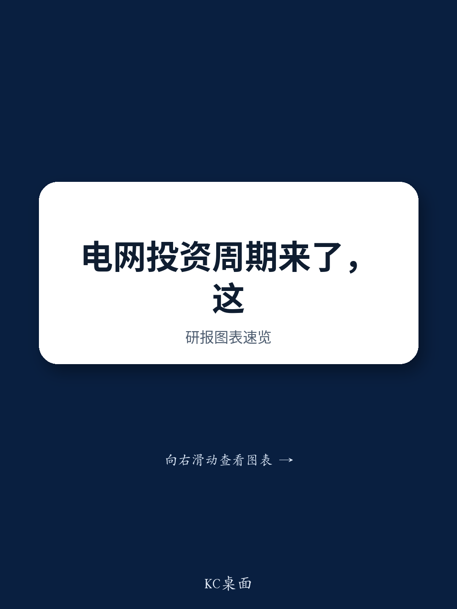
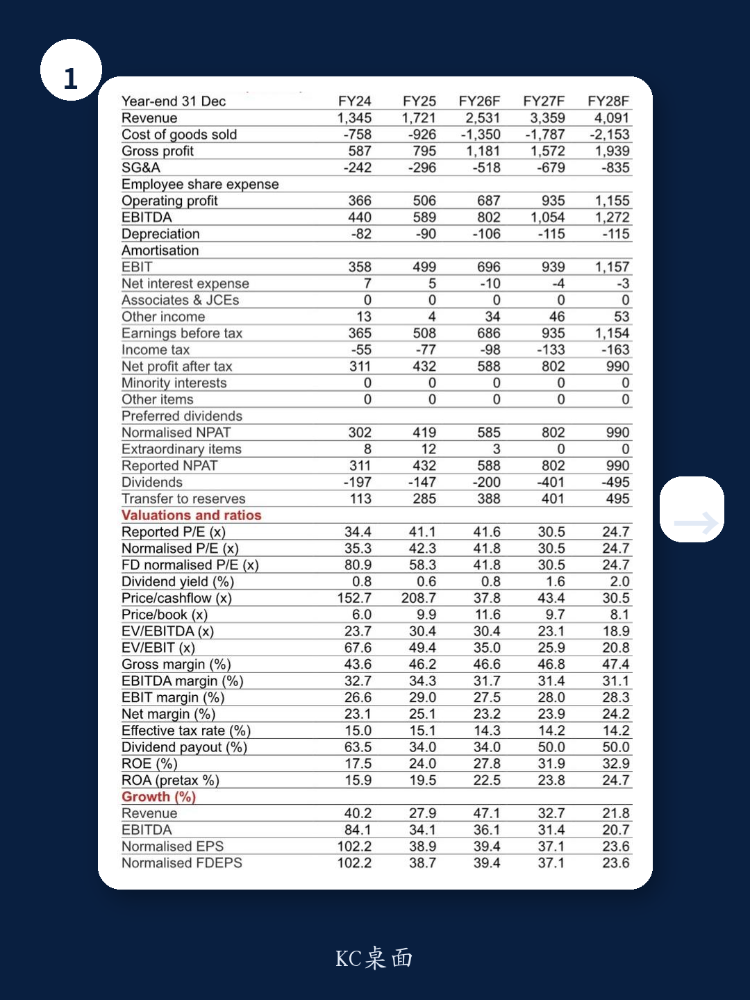
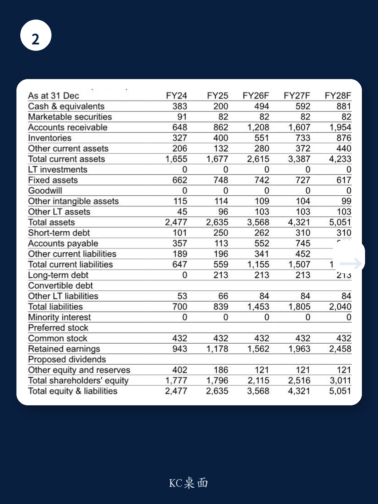

# 电网投资周期中，市场低估了复合绝缘子龙头的结构性优势

当市场还在为电力设备出口的短期波动和国内特高压项目执行节奏担忧时，一份最新发布的外资投行深度研报给出了一个值得认真对待的判断：一家专注于复合绝缘子的细分龙头，其未来三年的盈利增长确定性可能被低估了。

这份研报的核心主张并不复杂。报告认为，随着中国“十五五”期间电网投资与特高压建设的加速，叠加全球能源转型和AI数据中心建设驱动的海外电网升级需求，这家公司正处于一个需求侧与供给侧共振的有利位置。研报预测其2026至2028年收入复合增长率将达到33%，净利润复合增长率达到32%。更重要的是，研报给出的目标价隐含约48.8%的上行空间。

这一判断之所以值得关注，不仅因为它来自一家对电力设备领域有长期跟踪的外资投行，更因为它揭示了一个关键逻辑：在电网投资这个确定性较高的赛道里，真正稀缺的并非行业需求，而是那些能够将需求转化为可持续盈利能力的结构性竞争优势。

## 1. 需求侧的双重引擎已经启动，但市场焦点可能放错了地方

当前市场对电力设备板块的担忧主要集中在两个维度：一是海外出口面临的不确定性，二是国内特高压项目开工节奏的波动。这些担忧并非没有道理，但它们可能掩盖了一个更根本的趋势变化。

报告揭示的需求驱动力是双重的。国内方面，“十五五”期间电网投资与特高压建设将进入新一轮上行周期，这为复合绝缘子等核心部件提供了稳定的增量市场。海外方面，能源转型和AI数据中心建设正在推动全球范围的电网升级，这意味着海外市场不再是简单的周期性补充，而是正在成为结构性的增长极。

对于这家公司而言，海外市场的重要性正在从“锦上添花”转变为“第二增长曲线”。研报中明确提到，公司正在推进美国工厂的产能爬坡，这直接指向了海外本地化供应的战略意图。在贸易环境复杂化的背景下，能够在海外建立产能并实现本地化交付，本身就是一种难以复制的竞争壁垒。

## 2. 规模优势正在转化为议价权，这是被市场低估的关键变量

许多投资者习惯用“周期股”的框架来看待电力设备公司，认为其盈利能力会随着下游招标节奏而剧烈波动。但这忽略了一个关键的结构性变化：当一家公司在一个细分领域建立起显著的规模优势后，它的议价权会发生质变。

报告中的一组数据值得深思。研报预测公司的毛利率将从2025年的46.2%稳步提升至2028年的47.4%。在原材料价格存在波动、海外扩张需要额外投入的背景下，毛利率的持续改善并非易事。这背后的支撑逻辑，很可能来自公司对下游客户议价能力的增强。

根据公司披露的信息，变压器和开关柜等客户在内部生产绝缘子时缺乏规模经济，这使得外采成为更经济的选择。当全球电网投资加速、下游客户自身产能紧张时，这种“外采更优”的格局会进一步强化供应商的议价地位。换句话说，这家公司正在从“可替代的供应商”转变为“难以绕过的合作伙伴”。

## 3. 新增长曲线的轮廓已经清晰，但市场尚未给予充分定价

除了核心的复合绝缘子业务，报告还重点提到了公司正在积极拓展的新业务方向：输变电设备的外绝缘和密封产品。研报预测这部分业务在2026至2028年的收入复合增长率将达到41%。

这组数据隐含了一个重要判断：公司并非只是在一个成熟市场中分享行业增长，而是正在将自己在材料科学和制造工艺上的积累，横向复制到相邻的细分市场。外绝缘和密封产品与核心的复合绝缘子产品在技术路线上具有高度相关性，这意味着公司的研发投入和工艺经验可以被复用，边际扩张成本相对可控。

对于投资者而言，新业务的估值意义在于它提供了“期权价值”。当市场只按照核心业务的贴现现金流来定价时，新业务一旦兑现，就会成为估值上调的超预期因素。

## 4. 报告尚未完全回答的关键问题：盈利预测的置信度与风险边界

尽管研报的逻辑链条完整，但作为独立的观察者，有两个问题值得进一步推敲。

第一个是盈利预测的置信度。研报预测公司2026年收入将同比增长47.1%，这一增速远超2025年的27.9%。在海外工厂尚处于爬坡期、国内项目执行节奏存在不确定性的背景下，这一加速增长假设需要后续的订单数据和产能投放节奏来验证。

第二个是估值溢价的合理性。研报给予公司62倍2026年预期市盈率，较行业平均的36倍有显著溢价，理由是公司更强的利润增长和更高的ROE。这个溢价在逻辑上成立，但溢价幅度是否能够持续，取决于增长预期能否顺利兑现。一旦季度业绩出现波动，估值收缩的风险就会浮现。

此外，报告也明确列出了主要风险：产品质量问题、汇率波动以及原材料价格波动。对于一家以出口为导向的公司而言，汇率风险并非可以忽略的次要因素，尤其是在海外业务占比持续提升的背景下。

## 5. 投资者的观察框架：从“是否投资”到“何时验证”

基于以上分析，对于关注这家公司的投资者而言，核心问题不是“要不要买”，而是“哪些信号可以验证增长逻辑是否在兑现”。

第一个观察点是海外工厂的产能爬坡速度。如果美国工厂能够按计划或超预期实现满产，将直接验证公司海外本地化供应的能力，并显著降低市场对出口不确定性的担忧。

第二个观察点是国内特高压项目的招标节奏。虽然单个项目的推迟不会改变长期趋势，但密集的招标公告会显著提升市场对短期业绩的信心。

第三个观察点是新业务的订单获取情况。如果输变电设备外绝缘和密封产品能够获得来自头部客户的批量订单，将意味着新增长曲线的逻辑开始兑现。

这三个信号中，任何一个的积极变化都可能成为股价重新定价的催化剂。而研报中提到的“过去一个月跑输沪深300约10.8个百分点”恰恰说明，市场对这些信号的定价可能还不够充分。

---

以上分析只是基于这份研报核心逻辑的推演和延伸。报告中还有更多关于公司财务模型、竞争格局拆解、估值方法论对比的细节内容，这些信息对于做出独立的投资判断至关重要。

如果你希望看到完整的研报原文和更细致的财务数据拆解，欢迎来我们的社群继续讨论。在社群里，我们会定期分享外资投行的深度研报解读，并组织专题讨论，帮助成员在信息不对称中建立自己的分析框架。

Personal reading notes and learning share only. Not investment advice.

