# Initiation of Coverage

# Kioxia Holdings Corp

# Peak is not here yet

# Initiating coverage with Buy rating and price target of ¥79,000

Consensus OP estimates are ¥6.43trn for FY3/27 and ¥7.47trn for FY3/28. In comparison, we forecast ¥7.11trn and ¥8.99trn for the respective fiscal years, significantly exceeding consensus, especially for FY3/28. NAND flash memory prices are likely to rise qoq for the next six quarters before peaking in Q3 2027 (about 1.5 years from now, link). Kioxia has established a competitive advantage in terms of bit cost by successfully focusing on horizontal miniaturisation technology, which limits wafer cost increases. We think this sustained favourable market environment and cost advantage are not yet priced into the stock.

# AI demand has transformed the NAND flash memory market

Historically, NAND flash memory has been used primarily for storage for PCs, smartphones, tablets, and AI training data. For AI inference applications, though, NAND flash memory has become a part of the computational system, akin to DRAM, due to the need to retain users' chat history. Even with such compression technologies as TurboQuant KV cache, overall demand is likely to continue to rise, with the rapid growth driven by AI still unmitigated. And with the company's bit supply growth remaining below +20% yoy, we expect supply-demand conditions to remain tight (link).

# Established cost advantages within the industry

The company has maintained the highest operating margin in the industry since 2022. While Korean competitors have focused on vertical stacking, Kioxia has prioritised horizontal bit expansion and selected technologies for reducing costs. This strategy has succeeded in cutting wafer costs by about 50% and bit costs by 10–20%, on our estimates. Investor perceptions of the company's lag based on simple comparisons of stacked layers are likely to improve.

# Valuation: Upside for both earnings and multiples

Our price target is set at ¥79,000, based on estimated BPS at the FY3/28 fiscal year end and a PBR of 4.7x. The PBR multiple of 4.7x is derived from an average ROE of 41% for FY3/28-FY3/31 and a cost of equity (CoE) of 8.6%. This valuation method has been applied consistently across all Asian memory companies. The price target corresponds to an EV/EBITDA of 4x, which aligns with both the historical 10-year average EV/EBITDA for the memory sector and the company's average since its public listing.

Equities 

<table><tr><td>Japan</td></tr><tr><td>Semiconductors</td></tr></table>

<table><tr><td>12-month rating</td><td>BuyPrior : No Rating</td></tr><tr><td>12m price target</td><td>¥79,000Prior :</td></tr><tr><td>Price (28 May 2026)</td><td>¥61,280</td></tr></table>

RIC: 285A.T BBG: 285A JP

Trading data and key metrics 

<table><tr><td>52-wk range</td><td>¥65,450-1,982</td></tr><tr><td>Market cap.</td><td>¥33,464b/US$210b</td></tr><tr><td>Shares o/s</td><td>546m (ORD)</td></tr><tr><td>Free float</td><td>30%</td></tr><tr><td>Avg. daily volume (&#x27;000)</td><td>34,971</td></tr><tr><td>Avg. daily value (m)</td><td>¥1,130,121.5</td></tr><tr><td>Common s/h equity (03/27E)</td><td>¥4840b</td></tr><tr><td>P/BV (03/27E)</td><td>6.9x</td></tr><tr><td>Net debt to EBITDA (03/27E)</td><td>NM</td></tr></table>

EPS (reported, basic) (¥) 

<table><tr><td></td><td>From</td><td>To</td><td>% ch</td><td>Cons.</td></tr><tr><td>03/27E</td><td>-</td><td>9,002.5</td><td>-</td><td>7,475.0</td></tr><tr><td>03/28E</td><td>-</td><td>11,390.8</td><td>-</td><td>9,269.9</td></tr><tr><td>03/29E</td><td>-</td><td>9,757.0</td><td>-</td><td>11,237.3</td></tr></table>

Kenji Yasui

Analyst

kenji.yasui@ubs.com

+81-3-5208 6211

Atsuhiro Kinoshita

Analyst

atsuhiro.kinoshita@ubs.com

+81-3-5208 6768

<table><tr><td>Highlights (¥b)</td><td>03/24</td><td>03/25</td><td>03/26</td><td>03/27E</td><td>03/28E</td><td>03/29E</td><td>03/30E</td><td>03/31E</td></tr><tr><td>Revenues</td><td>1,076.6</td><td>1,706.5</td><td>2,337.6</td><td>9,121.0</td><td>11,301.0</td><td>10,181.0</td><td>9,711.0</td><td>9,711.0</td></tr><tr><td>EBIT (UBS)</td><td>(252.7)</td><td>451.7</td><td>870.4</td><td>7,107.0</td><td>8,991.0</td><td>7,701.0</td><td>6,961.0</td><td>6,941.0</td></tr><tr><td>Net earnings (UBS)</td><td>(243.7)</td><td>272.3</td><td>554.5</td><td>4,916.1</td><td>6,220.3</td><td>5,328.1</td><td>4,816.5</td><td>4,803.2</td></tr><tr><td>EPS (UBS, diluted) (¥)</td><td>(452.1)</td><td>505.2</td><td>1,015.4</td><td>9,002.5</td><td>11,390.8</td><td>9,757.0</td><td>8,820.1</td><td>8,795.7</td></tr><tr><td>DPS (net) (¥)</td><td>0.0</td><td>0.0</td><td>0.0</td><td>2,700.7</td><td>3,417.2</td><td>2,927.1</td><td>2,646.0</td><td>2,638.7</td></tr><tr><td>Net (debt) / cash</td><td>(1,101.3)</td><td>(827.6)</td><td>(775.3)</td><td>1,715.0</td><td>5,612.7</td><td>9,559.9</td><td>12,981.7</td><td>16,287.5</td></tr><tr><td>Profitability/valuation</td><td>03/24</td><td>03/25</td><td>03/26</td><td>03/27E</td><td>03/28E</td><td>03/29E</td><td>03/30E</td><td>03/31E</td></tr><tr><td>EBIT (UBS) margin %</td><td>(23.5)</td><td>26.5</td><td>37.2</td><td>77.9</td><td>79.6</td><td>75.6</td><td>71.7</td><td>71.5</td></tr><tr><td>ROIC (EBIT) %</td><td>(15.3)</td><td>28.1</td><td>45.5</td><td>263.9</td><td>264.7</td><td>219.0</td><td>205.8</td><td>205.0</td></tr><tr><td>EV/EBITDA (UBS core) x</td><td>-</td><td>2.8</td><td>4.5</td><td>4.4</td><td>3.2</td><td>3.2</td><td>3.0</td><td>2.6</td></tr><tr><td>P/E (UBS, diluted) x</td><td>-</td><td>4.3</td><td>8.0</td><td>6.8</td><td>5.4</td><td>6.3</td><td>6.9</td><td>7.0</td></tr><tr><td>Equity FCF (UBS) yield %</td><td>-</td><td>15.4</td><td>7.1</td><td>11.8</td><td>17.2</td><td>16.6</td><td>14.5</td><td>14.2</td></tr><tr><td>Dividend yield (net) %</td><td>-</td><td>0.0</td><td>0.0</td><td>4.4</td><td>5.6</td><td>4.8</td><td>4.3</td><td>4.3</td></tr></table>

Source: Company accounts, LSEG Eikon, UBS estimates. Metrics marked as (UBS) have had analyst adjustments applied. Valuations: based on an average share price that year, (E): based on a share price of ¥ 61,280 on 28-May-2026

# UBSResearch THESIS MAP a guide to our thinking and what's where in this report

# PIVOTAL QUESTIONS

# Q: Q: Can the company maintain its industry-leading NAND flash memory operating margin through 2027?

We expect Kioxia to sustain industry-leading NAND margins versus key peers through CY26–27, supported by its lead in lateral (horizontal) scaling. However, beyond 2027—particularly with the transition to BICS10 (332 layers) and subsequently the 400-layer generation—it remains uncertain whether this advantage in lateral scaling can be maintained to the same extent as today.

# Q: Is AI inference a temporary driver of NAND flash memory demand, as in the case of AI training, or is it a structural growth driver?

We view AI inference as a sustainable and structural driver of growth in NAND flash memory demand. For AI inference, NAND flash memory's performance and capacity are design variables that define user experience. This role is unlikely to change.

# Q: How long will NAND flash memory prices continue to rise?

We expect supply shortages to persist through 2027, as capacity expansion lags demand growth. Qoq price increases are likely to peak around 3Q 2027.

# UBSVIEW

NAND flash memory prices are likely to rise qoq for the next six quarters before peaking in Q3 2027 (about 1.5 years from now). By successfully focusing on horizontal miniaturisation technology, the company has established a competitive advantage in terms of bit cost, one that we expect to persist for several years.

# EVIDENCE

AI demand growth has benefited not only NAND flash memory companies but also HDD manufacturers, which occupy a lower tier of the storage hierarchy. Currently, few NAND flash memory or HDD companies expect demand from hyperscalers to decelerate.

On the supply side, companies in both the DRAM and NAND flash memory businesses are prioritising capacity expansion for DRAM. As a result, NAND flash memory supply is unlikely to grow in 2026 or 2027. Kioxia has similarly indicated that it intends to increase capex, but wafer shipment volumes are likely to decline.

# WHAT'S PRICED IN?

Based on our discussions with investors, most now think NAND flash memory prices will stay elevated. However, doubts persist about whether they can remain at such high levels. Compared to DRAM, NAND flash memory is more vulnerable to supply-demand imbalances.

# UPSIDE/DOWNSIDE SPECTRUM

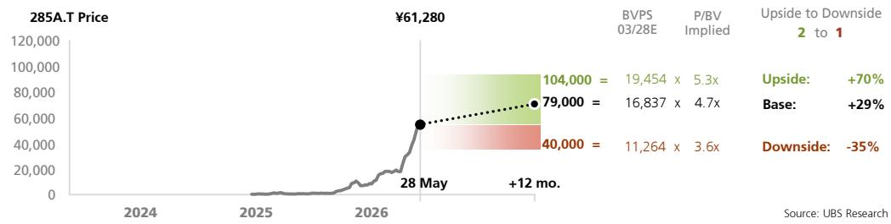

line

| Date       | Price     |
| ---------- | --------- |
| 28 May     | ¥61,280   |
| 28 May     | 104,000   |
| 28 May     | 79,000    |
| 28 May     | 40,000    |
| 28 May     | 11,264    |
| 28 May     | 16,837    |
| 28 May     | 19,454    |
| 28 May     | 5.3x      |
| 28 May     | 4.7x      |
| 28 May     | 3.6x      |
| 28 May     | +12 mo.   |

<table><tr><td>Value drivers</td><td>OP(FY3/28E)</td><td>NAND priceUSD$/GB(FY3/28E)</td><td>Bit costadvantage(FY3/28E)</td><td>EV/EBITDA(FY3/28E)</td><td>ROEFY3/28-FY3/31Eaverage</td><td>PBR(FY3/28E)</td></tr><tr><td>¥104,000 upside</td><td>¥11,062 bn</td><td>$0.35</td><td>20%</td><td>X 4</td><td>43%</td><td>X 5.3</td></tr><tr><td>¥79,000 base</td><td>¥8,991 bn</td><td>$0.30</td><td>10%</td><td>X 4</td><td>41%</td><td>X 4.7</td></tr><tr><td>¥40,000 downside</td><td>¥4,581 bn</td><td>$0.18</td><td>-5%</td><td>X 3</td><td>31%</td><td>X 3.6</td></tr></table>

Source: UBS estimates

# COMPANY DESCRIPTION

Kioxia is a leading global semiconductor manufacturer specializing in NAND flash memory and SSDs, holding a top-tier market share in this field. Originating from Toshiba's memory business, it operates as a dedicated manufacturer focused on the NAND business, offering products tailored for data centers and smart devices.

# PIVOTAL QUESTIONS

# Q: Can the company maintain its industry-leading NAND flash memory operating margin through 2027?

# UBSVIEW

We expect Kioxia to sustain industry-leading NAND margins versus key peers through CY26–27, supported by its lead in lateral (horizontal) scaling. However, beyond 2027—particularly with the transition to BICS10 (332 layers) and subsequently the 400-layer generation—it remains uncertain whether this advantage in lateral scaling can be maintained to the same extent as today.

# EVIDENCE

Key structural factors are high effective bit density, yield stability, sharing of facilities and technology through joint ventures, and competitors' shift in priority to DRAM (HBM) capex.

# WHAT'S PRICED IN?

Market participants appear to evaluate NAND flash memory competitiveness based primarily on superficial device specifications, such as vertical layer count and multilevel cell count. However, Kioxia's cost advantages per GB from lateral scaling and CBA architecture are likely not fully discounted as a factor differentiating the company from competitors.

# Low bit cost leads to high profitability

Kioxia consistently maintains the industry-leading operating margin per GB (Figure 1) owing primarily to its lower manufacturing cost per GB, or bit cost, than competitors' (Figure 2). Low bit cost underpins its industry-leading profitability.

Figure 1: NAND business: OPM   
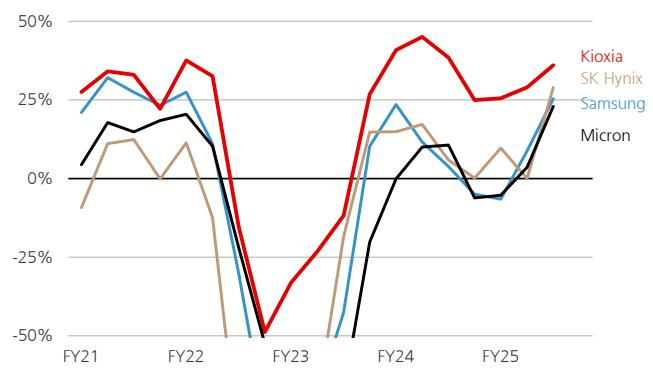

line

| Fiscal Year | Kioxia | SK Hynix | Samsung | Micron |
|-------------|--------|----------|---------|--------|
| FY21        | 25%    | 10%      | 20%     | 5%     |
| FY22        | 35%    | 15%      | 25%     | 10%    |
| FY23        | -50%   | -50%     | -50%    | -50%   |
| FY24        | 45%    | 15%      | 25%     | 10%    |
| FY25        | 25%    | 10%      | 0%      | 0%     |

Source: Company data, UBS

Figure 2: NAND: Bit cost   
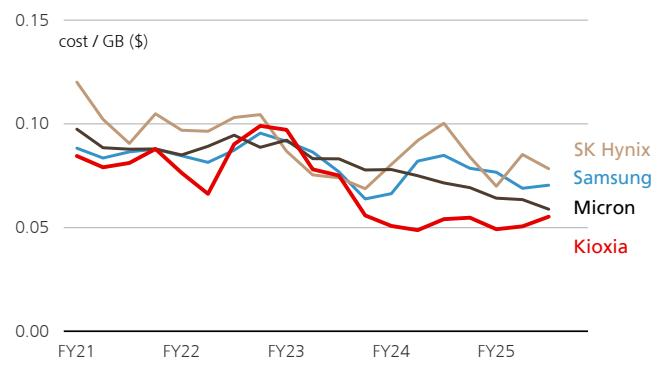

line

| Fiscal Year | SK Hynix | Samsung | Micron | Kioxia |
|-------------|----------|---------|--------|--------|
| FY21        | 0.12     | 0.09    | 0.10   | 0.08   |
| FY22        | 0.10     | 0.08    | 0.09   | 0.07   |
| FY23        | 0.10     | 0.09    | 0.09   | 0.10   |
| FY24        | 0.07     | 0.06    | 0.08   | 0.05   |
| FY25        | 0.08     | 0.07    | 0.06   | 0.05   |

Source: Company data, UBS, Gartner

# Achieving bit density through lateral scaling

The most effective way to reduce NAND flash memory bit cost is to increase bit density per wafer in one of three ways:

1. Increasing vertical layer count (multi-layering)   
2. Increasing bits per cell (multi-levelling)   
3. Enhancing lateral bit density (lateral scaling)

Given that there is little difference among companies in terms of multi-layering and multi-levelling, the market uses these metrics as proxy indicators of competitiveness. In contrast, lateral scaling is less commonly used because it is more complex and involves trade-offs with multi-layering and multi-levelling. A plot of lateral bit density against total chip bit density (Figure 3) reveals Kioxia's advantage over competitors in terms of lateral scaling.

Figure 3: Lateral scaling vs bit density   
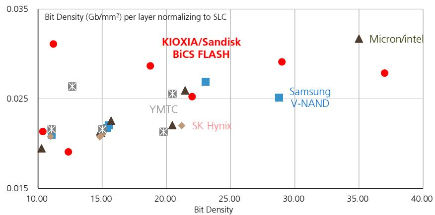

scatter

| Material           | Bit Density (Gb/mm²) |
| ------------------ | -------------------- |
| KIOXIA/Sandisk BiCS FLASH | 10.00                |
| KIOXIA/Sandisk BiCS FLASH | 12.00                |
| KIOXIA/Sandisk BiCS FLASH | 18.00                |
| KIOXIA/Sandisk BiCS FLASH | 22.00                |
| KIOXIA/Sandisk BiCS FLASH | 29.00                |
| KIOXIA/Sandisk BiCS FLASH | 37.00                |
| Micron/intel       | 35.00                |
| Samsung V-NAND      | 29.00                |
| YMTC               | 20.00                |
| SK Hynix           | 15.00                |

Source: Company data, UBS, Gartner

# Lateral scaling inherently conflicts with multi-layering and multilevelling

To increase density through lateral scaling, memory hole diameters must be reduced and pitch tightened. The resulting increase in the aspect ratio significantly complicates hole etching. As multi-layering progresses, deeper holes lead to further increases in the aspect ratio, thereby making lateral scaling incompatible with multi-layering.

Additionally, reducing hole diameters can lead to lower read currents and greater variability, reducing design margins and complicating multi-levelling control. Lateral scaling is thus also incompatible with multi-levelling.

# Kioxia and Micron lead in terms of lateral scaling

Kioxia's and Micron's latest NAND flash memory products are ahead of competitors' in terms of lateral scaling, which is complex and not that compatible with multi-layering and multi-levelling. We attribute this lead to Kioxia's expertise in high-aspect-ratio etching, developed during Toshiba's trench-type DRAM era. Similar to NAND, trench-type DRAM requires high-aspect-ratio hole processing, which involves not only deep etching but also simultaneous optimisation of shape control, precision, and speed. Kioxia's accumulated expertise likely gives the company a competitive edge. Micron's ability to achieve lateral density comparable to Kioxia's may stem from its acquisition of Toshiba's trench-type DRAM plant and similar technologies.

# CUA/CBA: Not low-temperature processes but differentiated manufacturing

Another way to increase lateral density is CUA (CMOS under array), which places peripheral circuits beneath the array to improve area efficiency. Different companies may use different naming conventions, but their goals are the same.

However, as multi-layering progresses, the thermal processes used to form memory cells can damage the CMOS created earlier, leading to peripheral circuit degradation and, in turn, device performance deterioration and increased difficulty in controlling multilevelling. To address this issue, companies have developed low-temperature processes for CUA.

Starting with BiCS8, Kioxia has adopted CBA (CMOS direct bonding to array), whereby CMOS and arrays are fabricated on separate wafers and joined via hybrid bonding to prevent thermal damage.

Companies are cautious about adopting CBA because of such issues as reduced throughput and yield. Kioxia leveraged its technological expertise to achieve mass production, prompting competitors to follow suit.

# Increasing bit density without raising wafer costs

Bit cost does not decline on higher bit density alone; stable wafer costs are also necessary.

Kioxia has improved bit density across generations while keeping wafer manufacturing costs (per wafer) from rising (Figure 4). We estimate Samsung Electronics' cost per wafer at about \$4,000, Micron's and SK Hynix's at around \$6,000, and Kioxia's at a much lower \$2,000. With wafer costs less than half competitors', Kioxia's bit cost is also lower.

Kioxia's low wafer manufacturing costs probably result from comparing and selecting bit density improvement methods based on cost efficiency. Semiconductor wafer costs depend on capex and throughput. For example, increasing the number of layers in the next generation would reduce throughput and raise wafer manufacturing costs in the absence of countermeasures. Developing high-throughput equipment or using more equipment can boost throughput but also involves more capex and thus ultimately increases costs.

Kioxia carefully evaluates multi-layering, multi-levelling, and lateral scaling and keeps capex lower than competitors' so as to minimise the final bit cost (Figure 5).

Figure 4: Manufacturing cost per wafer   
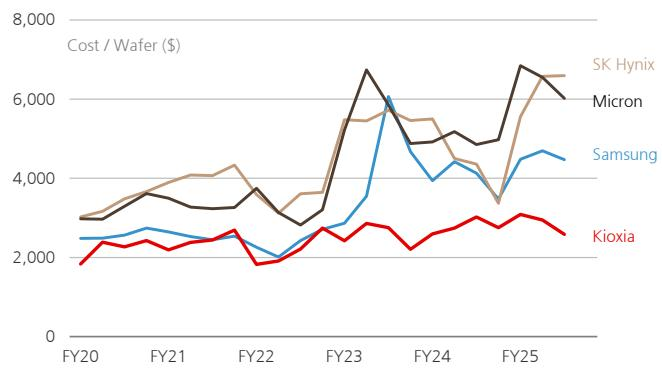

line

| Fiscal Year | SK Hynix | Micron | Samsung | Kioxia |
|-------------|----------|--------|---------|--------|
| FY20        | 3000     | 3000   | 2500    | 1800   |
| FY21        | 3500     | 3500   | 2700    | 2200   |
| FY22        | 4000     | 3800   | 2600    | 1900   |
| FY23        | 5500     | 6800   | 3500    | 2800   |
| FY24        | 5000     | 5000   | 4500    | 2500   |
| FY25        | 6800     | 6500   | 4800    | 3000   |

Source: Company data, UBS, Gartner

Figure 5: Capex required per TB increase (3-yr cumulative)   
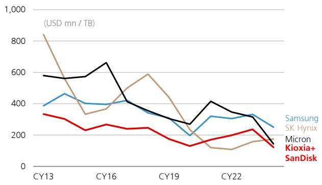

line

| Year | Samsung | SK Hynix | Micron | Kioxia+ | SanDisk |
|------|---------|----------|--------|---------|---------|
| CY13 | 400     | 850      | 350    | 350     | 350     |
| CY16 | 400     | 650      | 350    | 250     | 250     |
| CY19 | 350     | 550      | 300    | 250     | 200     |
| CY22 | 300     | 150      | 100    | 250     | 200     |

Source: Company data, UBS, Gartner

# Economies of scale through joint ventures enable high yields with complex processes

While using such complex processes as high-aspect-ratio etching and CBA, Kioxia maintains industry-leading yields and is thus able to keep wafer manufacturing costs low. The foundation for high yields lies in joint ventures. The ones in Yokkaichi and Kitakami involve shared investments, depreciation, R&D, and facility costs. Larger production scale accelerates the learning curve and thereby enables such new processes as high-precision etching and hybrid bonding to ramp up faster. This self-reinforcing competitive advantage tends to strengthen over time.

In terms of production scale, Kioxia cannot match Samsung on its own but comes close with its joint ventures included (Figure 6). Leveraging this production scale, Kioxia achieved high yields with complex processes early on. As a result, its bit shipment share is comparable to Samsung's, despite significantly lower capex (Figure 7).

Figure 6: Wafer capacity per month (kwpm)   
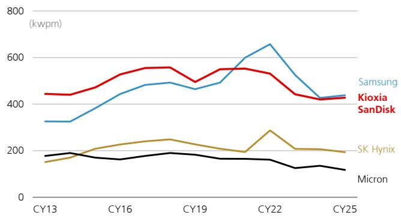

line

| Year | Samsung | Kioxia | SanDisk | SK Hynix | Micron |
|------|---------|--------|---------|----------|--------|
| CY13 | 300     | 450    | 180     | 150      | 180    |
| CY16 | 400     | 500    | 200     | 200      | 170    |
| CY19 | 450     | 550    | 220     | 250      | 190    |
| CY22 | 650     | 500    | 280     | 200      | 160    |
| CY25 | 400     | 420    | 200     | 180      | 120    |

Source: Company data, UBS, Gartner

Figure 7: Bit supply breakdown by market share   
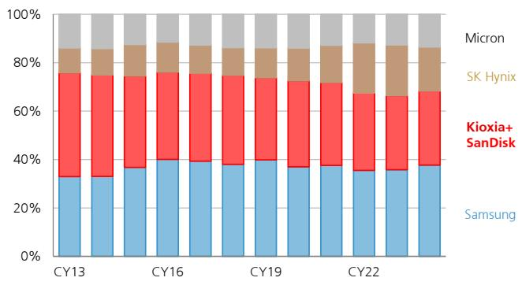

bar_stacked

| Year | Samsung (%) | Kioxia+ SanDisk (%) | SK Hynix (%) | Micron (%) |
|---|---|---|---|---|
| CY13 | 32 | 47 | 9 | 10 |
| CY16 | 38 | 42 | 10 | 10 |
| CY19 | 38 | 42 | 10 | 10 |
| CY22 | 36 | 38 | 15 | 15 |
| End | 38 | 38 | 15 | 15 |

Source: Company data, UBS, Gartner

Kioxia has consistently pursued a strategy of minimising bit costs to advance its NAND flash memory technology roadmap (Figure 8). This approach has enabled the company to maintain industry-leading operating margins per GB.

# Competitors' priority on HBM leads to delays in NAND flash memory advancements

The competitive landscape favours Kioxia. Samsung, SK Hynix, and Micron are heavily allocating capital, technology, and personnel to HBM and advanced DRAM. These moves make sense for capturing high-margin segments but limit resources for NAND flash memory scaling and architecture optimisation. As long as competitors stick with this type of capital allocation, they are unlikely to narrow the bit cost gap in the short term.

# Margin leadership likely to last through 2027

Based on the above, we think Kioxia can maintain its leading NAND flash memory operating margin through 2027. Its low bit cost is not merely a generational advantage but is also a structural competitive advantage underpinned by process capabilities that enable lateral scaling and CBA in mass production and also by economies of scale from joint ventures. Competitors would need to significantly shift their capital allocation and R&D priorities toward NAND flash memory to achieve a comparable cost structure in the short term.

A downside risk scenario for Kioxia is that the margin gap could narrow before 2027 if competitors accelerate NAND flash memory capex and technical resources after their HBM investment peaks, pursue lateral scaling and architecture optimisation, and rapidly improve mass production yields.

Figure 8: NAND technology roadmap 

<table><tr><td></td><td colspan="2">Generation Layer</td><td>Die capacity/Gb</td><td colspan="2">Bit Type</td><td colspan="2">Die Area/mm2 Mass production</td><td>Bit density</td></tr><tr><td rowspan="18">Samsung V-NAND</td><td>1st</td><td>24</td><td>128</td><td>MLC</td><td>2</td><td>133</td><td>Jul-13</td><td>0.96</td></tr><tr><td rowspan="2">2nd</td><td>32</td><td>128</td><td>MLC</td><td>2</td><td>84</td><td>May-14</td><td>1.52</td></tr><tr><td>32</td><td>128</td><td>TLC</td><td>3</td><td>68</td><td>Aug-14</td><td>1.89</td></tr><tr><td>3rd</td><td>48</td><td>256</td><td>TLC</td><td>3</td><td>97</td><td>Aug-15</td><td>2.64</td></tr><tr><td rowspan="3">4th</td><td>64</td><td>256</td><td>TLC</td><td>3</td><td>75</td><td>Dec-16</td><td>3.42</td></tr><tr><td>64</td><td>512</td><td>TLC</td><td>3</td><td>127</td><td>Dec-17</td><td>4.03</td></tr><tr><td>64</td><td>1024</td><td>QLC</td><td>4</td><td>180</td><td>Aug-18</td><td>5.68</td></tr><tr><td rowspan="3">5th</td><td>92</td><td>256</td><td>TLC</td><td>3</td><td>57</td><td>May-18</td><td>4.53</td></tr><tr><td>92</td><td>512</td><td>TLC</td><td>3</td><td>92</td><td>Jul-18</td><td>5.57</td></tr><tr><td>92</td><td>1024</td><td>QLC</td><td>4</td><td>134</td><td>Jul-18</td><td>7.62</td></tr><tr><td rowspan="3">6th</td><td>128</td><td>256</td><td>TLC</td><td>3</td><td>45</td><td>Jun-19</td><td>5.64</td></tr><tr><td>128</td><td>512</td><td>TLC</td><td>3</td><td>74</td><td>Jun-19</td><td>6.91</td></tr><tr><td>133</td><td>512</td><td>TLC</td><td>3</td><td>67</td><td>Aug-19</td><td>7.67</td></tr><tr><td rowspan="2">7th</td><td>176</td><td>512</td><td>TLC</td><td>3</td><td>46</td><td>Dec-20</td><td>11.07</td></tr><tr><td>176</td><td>1024</td><td>QLC</td><td>4</td><td>66</td><td>Dec-22</td><td>15.51</td></tr><tr><td>8th</td><td>236</td><td>1024</td><td>TLC</td><td>3</td><td>67</td><td>Nov-22</td><td>15.38</td></tr><tr><td rowspan="2">9th</td><td>286</td><td>1024</td><td>TLC</td><td>3</td><td>44</td><td>Apr-24</td><td>23.07</td></tr><tr><td>286</td><td>1024</td><td>QLC</td><td>4</td><td>36</td><td>26H1</td><td>28.77</td></tr><tr><td rowspan="20">KIOXIA BiCS FLASH</td><td>1st (prototype)</td><td>24</td><td></td><td>MLC</td><td></td><td></td><td></td><td></td></tr><tr><td rowspan="2">2nd</td><td>48</td><td>128</td><td>MLC</td><td>2</td><td>99</td><td>Mar-16</td><td>1.29</td></tr><tr><td>48</td><td>256</td><td>TLC</td><td>3</td><td>105</td><td>Jul-16</td><td>2.43</td></tr><tr><td rowspan="4">3rd</td><td>64</td><td>128</td><td>TLC</td><td>3</td><td>37</td><td>Jul-17</td><td>3.42</td></tr><tr><td>64</td><td>256</td><td>TLC</td><td>3</td><td>71</td><td>Jul-17</td><td>3.61</td></tr><tr><td>64</td><td>512</td><td>TLC</td><td>3</td><td>86</td><td>Jul-17</td><td>5.93</td></tr><tr><td>64</td><td>768</td><td>QLC</td><td>4</td><td>86</td><td></td><td>8.97</td></tr><tr><td rowspan="3">4th</td><td>96</td><td>256</td><td>TLC</td><td>3</td><td>51</td><td>Jul-18</td><td>5.03</td></tr><tr><td>96</td><td>512</td><td>TLC</td><td>3</td><td>84</td><td>Oct-18</td><td>6.09</td></tr><tr><td>96</td><td>1,362</td><td>QLC</td><td>4</td><td>159</td><td></td><td>8.55</td></tr><tr><td rowspan="3">5th</td><td>112</td><td>256</td><td>TLC</td><td>3</td><td>36</td><td>Jul-20</td><td>7.08</td></tr><tr><td>112</td><td>512</td><td>TLC</td><td>3</td><td>62</td><td>Jul-20</td><td>8.24</td></tr><tr><td>112</td><td>1,362</td><td>QLC</td><td>4</td><td>140</td><td>Oct-20</td><td>9.70</td></tr><tr><td rowspan="2">6th</td><td>162</td><td>512</td><td>TLC</td><td>3</td><td>49</td><td></td><td>10.37</td></tr><tr><td>162</td><td>1,024</td><td>QLC</td><td>4</td><td>83</td><td></td><td>12.36</td></tr><tr><td rowspan="2">8th</td><td>218</td><td>1,024</td><td>TLC</td><td>3</td><td>55</td><td>Jul-24</td><td>18.75</td></tr><tr><td>218</td><td>2,048</td><td>QLC</td><td>4</td><td>93</td><td>Oct-25</td><td>22.00</td></tr><tr><td>9th</td><td>120</td><td>512</td><td>TLC</td><td>3</td><td>46</td><td>Mar-26</td><td>11.20</td></tr><tr><td rowspan="2">10th</td><td>332</td><td>1,024</td><td>TLC</td><td>3</td><td>35</td><td>CY26</td><td>29.00</td></tr><tr><td>332</td><td></td><td>QLC</td><td>4</td><td></td><td>CY26</td><td>37.60</td></tr><tr><td rowspan="15">Micron</td><td rowspan="2">1st</td><td>32</td><td>256</td><td>MLC</td><td>2</td><td>123</td><td>Oct-15</td><td>2.08</td></tr><tr><td>32</td><td>384</td><td>TLC</td><td>3</td><td>168</td><td>Oct-15</td><td>2.28</td></tr><tr><td rowspan="3">2nd</td><td>64</td><td>256</td><td>TLC</td><td>3</td><td>59</td><td>Jul-17</td><td>4.36</td></tr><tr><td>64</td><td>512</td><td>TLC</td><td>3</td><td>108</td><td>Jul-17</td><td>4.74</td></tr><tr><td>64</td><td>1024</td><td>QLC</td><td>4</td><td>157</td><td>May-18</td><td>6.53</td></tr><tr><td rowspan="2">3rd</td><td>96</td><td>512</td><td>TLC</td><td>3</td><td>82</td><td>Oct-18</td><td>6.25</td></tr><tr><td>96</td><td>1024</td><td>QLC</td><td>4</td><td>113</td><td>Oct-18</td><td>9.08</td></tr><tr><td>4th</td><td>128</td><td>1024</td><td>TLC</td><td>3</td><td>132</td><td>Jul-20</td><td>7.76</td></tr><tr><td rowspan="2">5th</td><td>176</td><td>512</td><td>TLC</td><td>3</td><td>50</td><td>Nov-20</td><td>10.27</td></tr><tr><td>176</td><td>1024</td><td>QLC</td><td>4</td><td>69</td><td>Jan-22</td><td>14.92</td></tr><tr><td rowspan="3">6th</td><td>232</td><td>512</td><td>TLC</td><td>3</td><td>34</td><td>Jul-22</td><td>14.85</td></tr><tr><td>232</td><td>1024</td><td>TLC</td><td>3</td><td>65</td><td>Jul-22</td><td>15.69</td></tr><tr><td>232</td><td>1024</td><td>QLC</td><td>4</td><td>50</td><td>Apr-24</td><td>20.46</td></tr><tr><td rowspan="2">9th</td><td>276</td><td>1024</td><td>TLC</td><td>3</td><td>48</td><td>Jul-24</td><td>21.46</td></tr><tr><td>276</td><td>1024</td><td>QLC</td><td>4</td><td>29</td><td>Jun-25</td><td>35.00</td></tr><tr><td rowspan="15">SK Hynix</td><td>1st</td><td>24</td><td>64</td><td>MLC</td><td>2</td><td></td><td>Nov-14</td><td></td></tr><tr><td>2nd</td><td>36</td><td>128</td><td>MLC</td><td>2</td><td>88</td><td>Apr-16</td><td>1.45</td></tr><tr><td>3rd</td><td>48</td><td>256</td><td>TLC</td><td>3</td><td>92</td><td>Nov-16</td><td>2.78</td></tr><tr><td rowspan="3">4th</td><td>72</td><td>256</td><td>TLC</td><td>3</td><td>72</td><td>Jul-17</td><td>3.55</td></tr><tr><td>72</td><td>512</td><td>TLC</td><td>3</td><td>119</td><td>Feb-18</td><td>4.30</td></tr><tr><td>76</td><td>512</td><td>MLC</td><td>2</td><td>200</td><td>Mar-19</td><td>2.56</td></tr><tr><td rowspan="2">5th</td><td>96</td><td>512</td><td>TLC</td><td>3</td><td>84</td><td>Nov-18</td><td>6.09</td></tr><tr><td>96</td><td>1024</td><td>TLC</td><td>3</td><td>162</td><td>Jan-19</td><td>6.33</td></tr><tr><td rowspan="2">6th</td><td>128</td><td>512</td><td>TLC</td><td>3</td><td>63</td><td>Jun-19</td><td>8.09</td></tr><tr><td>128</td><td>1024</td><td>TLC</td><td>3</td><td>118</td><td>Jun-19</td><td>8.68</td></tr><tr><td>7th</td><td>176</td><td>512</td><td>TLC</td><td>3</td><td>47</td><td>Jun-21</td><td>10.98</td></tr><tr><td rowspan="2">8th</td><td>238</td><td>512</td><td>TLC</td><td>3</td><td>35</td><td>Jun-23</td><td>14.81</td></tr><tr><td>238</td><td>1024</td><td>TLC</td><td>3</td><td>68</td><td>Dec-23</td><td>15.03</td></tr><tr><td rowspan="2">9th</td><td>321</td><td>1024</td><td>TLC</td><td>3</td><td>48</td><td>Nov-24</td><td>21.19</td></tr><tr><td>321</td><td>2048</td><td>QLC</td><td>4</td><td>71</td><td>Aug-25</td><td>28.80</td></tr><tr><td rowspan="8">YMTC</td><td>1st</td><td>32</td><td>256</td><td>MLC</td><td>2</td><td></td><td>Sep-18</td><td></td></tr><tr><td>2nd (X1)</td><td>64</td><td>256</td><td>TLC</td><td>3</td><td>58</td><td>Sep-19</td><td>4.43</td></tr><tr><td rowspan="2">3rd (X2)</td><td>128</td><td>512</td><td>TLC</td><td>3</td><td>60</td><td>Apr-20</td><td>8.47</td></tr><tr><td>128</td><td>1362</td><td>QLC</td><td>4</td><td>123</td><td>Sep-21</td><td>11.06</td></tr><tr><td rowspan="2">4th (X3)</td><td>232</td><td>1024</td><td>TLC</td><td>3</td><td>68</td><td>Dec-22</td><td>15.02</td></tr><tr><td>232</td><td>1024</td><td>QLC</td><td>4</td><td>52</td><td>Jul-23</td><td>19.78</td></tr><tr><td rowspan="2">5th (X4)</td><td>160</td><td>512</td><td>TLC</td><td>3</td><td>40</td><td>Aug-24</td><td>12.66</td></tr><tr><td>267</td><td>1024</td><td>TLC</td><td>3</td><td>50</td><td>Sep-25</td><td>20.47</td></tr></table>

Source: Company data, UBS, Gartner

# PIVOTAL QUESTIONS

# Q: Is AI inference a temporary driver of NAND flash memory demand, as in the case of AI training, or is it a structural growth driver?

UBSVIEW

We view AI inference as a sustainable and structural driver of growth in NAND flash memory demand. For AI inference, NAND flash memory's performance and capacity are design variables that define user experience. This role is unlikely to change.

EVIDENCE

AI inference has evolved as a real-time service that responds instantly to end-user actions. With the implementation of RAG and agentic search, architectures are being explored and introduced to offload and restore KV cache data stored in GPU HBM using high-performance NAND flash memory/SSDs. More relevant themes are well explained by a recent APAC focus note by Nicolas Gaudois

WHAT'S PRICED IN?

The market appears to view storage demand for AI inference as sporadic, tied to the number of servers deployed, as in the case of AI training. Consequently, NAND flash memory is still perceived as a peripheral storage component. However, NAND flash memory actually complements HBM for AI inference, functioning as a core component that constrains response speed and the scale of models that can be handled. This shift in role is not yet fully priced into the stock, in our view.

# AI inference at a point where memory matters more than computation

Unlike AI training, AI inference does not conclude with a single series of computations because when users continue a chat, AI models need to retain the earlier context. This memory is stored in the KV cache.

AI models process numerical data (attention) representing word importance, relationships, and context. When a prompt is entered, all of the earlier context is fed as numerical data, and responses are generated through computation. If the AI models were to go over the entire context and recompute for every response from scratch, response times would become excessively slow. To address this issue, AI models store the results of prior computations in memory, as the KV cache, and read them to shorten response times.

A key point here is that the KV cache size grows exponentially as chats get longer.

# KV cache size grows as context windows get larger

Improving AI response accuracy generally requires enlarging the context window to increase the amount of information used for responses. AI vendors have historically enlarged model context windows at a remarkable pace of double or more annually (Figure 9).

However, as context windows get larger, KV cache sizes grow significantly, resulting in bottlenecks in the capacity of HBM, where KV cache is stored. The evolution of AI inference, including RAG and agentic search, has further exacerbated KV cache-related memory capacity constraints. Such technologies as TurboQuant have been developed to reduce KV cache sizes.

Figure 9: Context window length by model   
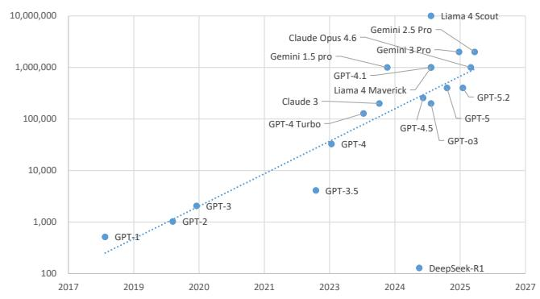

scatter

| Program | Year | Value |
| :--- | :--- | :--- |
| GPT-1 | 2018 | 500 |
| GPT-2 | 2019 | 1000 |
| GPT-3 | 2020 | 2000 |
| GPT-4 | 2023 | 40000 |
| GPT-3.5 | 2023 | 5000 |
| GPT-4 Turbo | 2023 | 100000 |
| Claude 3 | 2023 | 150000 |
| GPT-4.1 | 2024 | 150000 |
| GPT-4.5 | 2024 | 200000 |
| GPT-5.2 | 2025 | 500000 |
| GPT-5.2 Pro | 2025 | 1500000 |
| Liama 4 Maverick | 2024 | 200000 |
| Claude Opus 4.6 | 2024 | 150000 |
| Liama 4 Scout | 2025 | 1500000 |
| Gemini 1.5 pro | 2024 | 150000 |
| Gemini 1.5 Pro | 2025 | 150000 |
| Gemini 2.5 Pro | 2025 | 150000 |
| Gemini 3 Pro | 2025 | 150000 |
| DeepSeek-R1 | 2025 | 10 |
GPT-3.5
GPT-4
GPT-4.1
GPT-4.5
GPT-5
GPT-5.2
GPT-o3

Source: Company data, UBS

Figure 10: Context length vs KV cache size   
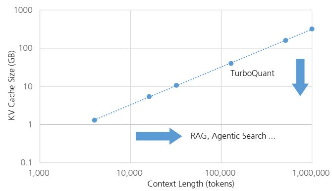

line

| Context Length (tokens) | KV Cache Size (GB) |
| ----------------------- | ------------------ |
| 1,000                   | 1.0                |
| 10,000                  | 5.0                |
| 100,000                 | 20.0               |
| 1,000,000               | 300.0              |

Source: UBS

# KV cache growth driven by RAG and agentic search RAG (retrieval-augmented generation)

RAG has rapidly become the industry standard for minimising hallucinations (plausible falsehoods) in AI models and generating accurate responses based on internal enterprise data.

RAG involves the retrieval of relevant information from external databases based on user queries and passes on the search results as part of the context (prompt) to the AI model for response generation. RAG significantly increases KV cache size because the former incorporates a large volume of search results into the context beyond the user-input prompt.

# Agentic Search

RAG is a static process for generating responses to user inputs with one-time inference, even though search results are appended. However, as more complex reasoning and autonomous task execution have become required, AI architectures have evolved from static RAG to dynamic agentic search, which differs from traditional one-question-one-answer AI chats. Instead of performing a one-time search and inference, the agent autonomously repeats a search/inference cycle of planning, tool execution, result evaluation, and re-search until the task is completed. This multi-step, continuous task execution significantly increases the number of tokens per task, from hundreds to millions, resulting in a dramatic increase in KV cache size.

# Multi-agent inference

Recently, advanced systems that deploy multiple agents in response to a single user prompt, performing agentic search repeatedly and concurrently, have become more common. In such cases, KV cache size increases proportionately to the number of agents used.

# Offloading KV cache overflow from HBM to NAND flash memory

The shift to multi-agent inference systems greatly enhances response accuracy but imposes unprecedented memory and storage demands on the underlying infrastructure because the context window of AI models, i.e., KV cache capacity, has grown exponentially.

For instance, processing a 100,000-token context window can use about 40GB of memory, depending on the model. This amount of memory is nearly half the HBM capacity of NVIDIA's H100, the current standard enterprise GPU.

To accommodate steadily growing KV cache sizes, HBM capacity per GPU module continues to increase (Figure 11), driving HBM demand exponentially (Figure 12).

However, it is no longer feasible to maintain such vast data volumes solely with HBM, which has very high unit costs and strict physical constraints. Scaling inference now requires offloading KV cache to external storage (e.g., SSDs) and restoring it to HBM as needed.

Figure 11: HBM capacity per GPU module   
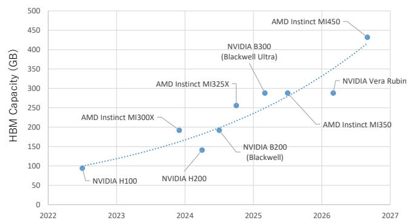

line

| Year | HBM Capacity (GB) | Model |
|------|-------------------|-------|
| 2022 | 90                | NVIDIA H100 |
| 2024 | 190               | AMD Instinct MI300X |
| 2024 | 140               | NVIDIA H200 |
| 2024 | 195               | AMD Instinct MI325X |
| 2025 | 285               | NVIDIA B300 (Blackwell Ultra) |
| 2025 | 260               | AMD Instinct MI350 |
| 2026 | 290               | NVIDIA Vera Rubin |
| 2027 | 430               | AMD Instinct MI450 |

Source: UBS, company data, industry public data

Figure 12: HBM demand driven by AI server (UBSe)   
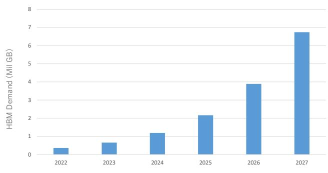

bar

| Year | HBM Demand (Mill GB) |
|---|---|
| 2022 | 0.4 |
| 2023 | 0.7 |
| 2024 | 1.2 |
| 2025 | 2.2 |
| 2026 | 3.9 |
| 2027 | 6.8 |

Source: UBS estimates

# An issue arises during switching

This transition introduces latency issues. For AI inference, when chats continue and context windows become too large or when the users handled by a GPU change, interruptions occur, requiring a switch to another process and then a reversion.

During this process, the GPU must offload KV cache and reload it upon resumption. If KV cache offloading (writing) or reloading is slow, the time needed to return the first token increases, resulting in a considerably degraded user experience. For AI inference, the focus is shifting from fast computation to quick memory recall.

# Approaches for quick memory recall Memory architecture for KV cache offloading

To address the explosive growth of KV cache sizes, inference infrastructure is evolving into a multi-tiered memory hierarchy (memory tiering) with HBM as the top tier (G1), followed by system DRAM (G2), local SSD (G3), and shared network storage (G4). This is the basis of NVIDIA's Inference Context Memory Storage (ICMS) concept, which redefines KV cache as AI-native persistent data instead of temporary cache. This architecture efficiently offloads and manages KV cache to low-latency NAND flash memory flash storage (Figure 13).

NVIDIA Dynamo integrates and controls these tiered storage layers at the software level, enabling transparent movement and restoration of KV cache blocks from GPU memory to various storage tiers. By maintaining and reusing context across these external storage tiers over extended periods, the architecture significantly reduces recalculation (prefill) at the start of inference and thereby allows the same GPU resources to economically handle more simultaneous users and agent processes.

Figure 13: Overview diagram of the ICMS concept   
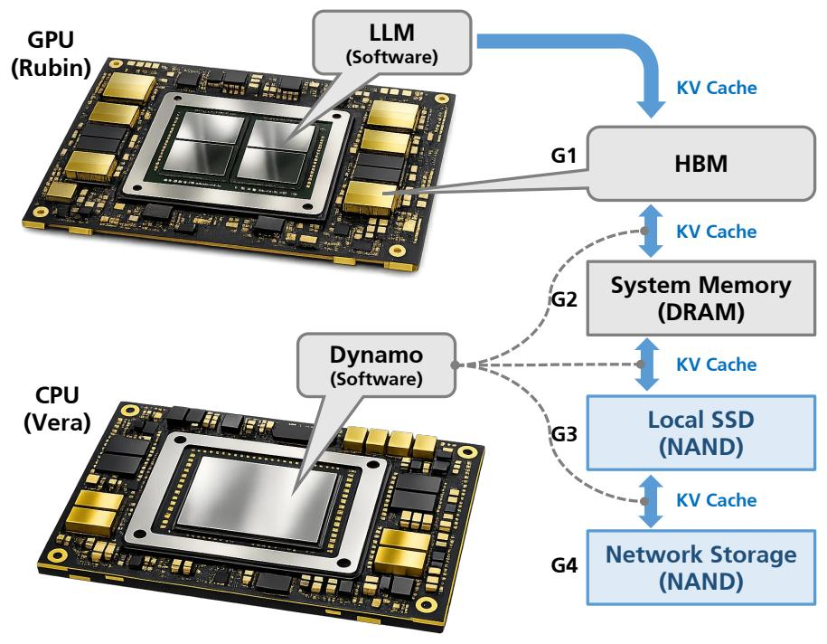

flowchart

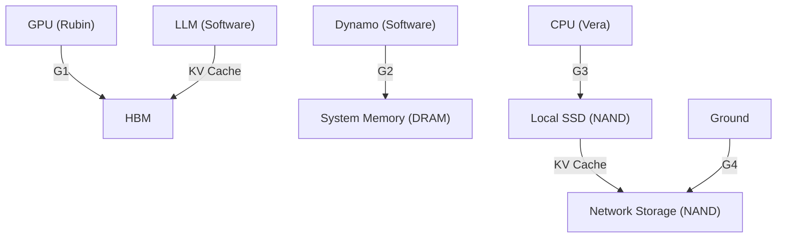

Source: UBS, company data

# GPU Direct Storage (GDS) and throughput improvements from compression technologies

The biggest challenge in operations that offload the KV cache to external SSDs is the latency involved in reloading data to the GPU when resuming an interrupted session – namely 'time to first token' (TTFT).

In conventional storage restoration processes, data is first read into CPU memory, after which the CPU manages DMA (direct memory access) and transfers the data to the GPU via PCIe. As a result, when large-scale concurrent access occurs, the CPU itself becomes a severe bottleneck. As a technology that resolves this structural flaw, adoption of GPU direct storage (GDS) is expanding rapidly; GDS completely bypasses the CPU, using RDMA to transfer data directly from network storage to GPU HBM.

In validation combining GDS and TurboQuant on Pure Storage's FlashBlade system, latency associated with KV cache restoration was improved by up to 10X compared with the conventional approach. In this configuration, the data volume itself is compressed to one-fifth, significantly reducing consumption of storage I/O bandwidth while enabling context delivery to begin with consistently ultra-low latency, regardless of GPU cluster size.

# Next-generation offload architecture enabled by CXL and NVIDIA CMX

In addition to innovation in NAND storage, an intermediate memory expansion approach using the CXL (Compute Express Link) interface is also being commercialised as a standard specification for inference infrastructure.

The industry's first CXL-based KV cache server, announced by Penguin Solutions, provides GPUs with up to 11TB of memory expansion capacity at far lower latency than conventional NVMe-based approaches. In environments deploying this CXL system equipped with Astera Labs controllers, GPU idle time was reduced, utilisation improved by $75\%$ , and overall inference throughput doubled, according to reports.

For even larger-scale deployment, NVIDIA has begun offering the new NVIDIA CMX (Context Memory Storage) platform as a rack-level shared context layer. CMX is built on the next-generation STX architecture integrating the NVIDIA BlueField-4 DPU and Spectrum-X Ethernet network, and can raise inference throughput by up to 5X compared with general storage configurations.

# Unprecedented NAND demand created by KV cache offload

With AI inference systems shifting to hierarchical memory architectures, the bottleneck in the inference process has completely shifted from compute capability to storage performance. In general, the storage layer is the slowest domain in server architecture and is currently the biggest bottleneck limiting inference throughput.

As a result, AI inference systems are becoming structurally more dependent on high-performance NAND storage solutions, and they are creating the long-term growth fundamentals of the NAND market.

# Rapid shift from HDD to QLC eSSD

To enable high-speed offload of the massive KV cache required by AI inference systems, data centres are shifting offload destinations from nearline HDDs to ultra-high-capacity QLC (quad-level cell) enterprise SSDs. Demand growth in this area has been remarkable, with the volume zone doubling in capacity in one year from 61TB in 2024 to 122TB in 2025.

To meet this enormous storage demand from AI data centres, Kioxia plans to launch a data centre solution with 245TB effective capacity (256TB raw capacity) using 9th-generation 321-layer QLC NAND. SK Hynix is also advancing development of an ultra-high-capacity 244TB product using 321-layer 4D NAND technology. Samsung, too, is bringing forward its mass-production schedule for 64TB and 128TB QLC SSDs to capture demand for high-density inference storage. Solidigm, which has led the QLC market as an early mover, has already shipped 122TB and 256TB drives on a scale of tens of exabytes, riding the wave of higher capacities on a scale far exceeding that of peers.

# Explosive consumption of physical wafers by pSLC

RAG and agentic search processes involve frequent access to large-scale vector databases. As a result, extremely high random access performance (IOPS) is required, which necessitates operating NAND in high-speed pSLC (pseudo-SLC) mode. However, this method, which operates cells capable of storing 3-bit or 4-bit data as 1-bit cells, entails the severe penalty of sacrificing about two-thirds of effective storage capacity.

As a result, achieving the same effective capacity as when using standard SSD requires 3X–4X more wafer production. That is further exacerbating both supply tightness and the sharp expansion in demand in the NAND flash market.

Figure 14: SSD specs by manufacturer 

<table><tr><td></td><td>Model</td><td>Cell type</td><td>Capacity (TB)</td><td>Layers</td></tr><tr><td colspan="5">Samsung</td></tr><tr><td rowspan="4"></td><td>SZ985</td><td>SLC</td><td>1</td><td>64</td></tr><tr><td>BM1743</td><td>QLC</td><td>61</td><td>176</td></tr><tr><td>PM1753</td><td>TLC</td><td>31</td><td>286</td></tr><tr><td>PM1763</td><td>TLC</td><td colspan="2">61 286 (V9)/400 (V10)</td></tr><tr><td colspan="5">SK Hynix</td></tr><tr><td rowspan="3"></td><td>PS1012</td><td>QLC</td><td>61</td><td>192</td></tr><tr><td>PS1101</td><td>QLC</td><td>245</td><td>321</td></tr><tr><td>AI-N P</td><td>SLC</td><td></td><td></td></tr><tr><td colspan="5">Micron</td></tr><tr><td rowspan="2"></td><td>9650</td><td>TLC</td><td>26</td><td>276</td></tr><tr><td>6600 ION</td><td>QLC</td><td>245</td><td>276</td></tr><tr><td colspan="5">Solidigm</td></tr><tr><td></td><td>D5-P5336</td><td>QLC</td><td>122</td><td>192</td></tr><tr><td colspan="5">Western Digital</td></tr><tr><td></td><td>Ultrastar DC SN650</td><td>TLC</td><td>15</td><td>112</td></tr><tr><td colspan="5">Kioxia</td></tr><tr><td rowspan="3"></td><td>CM9</td><td>TLC</td><td>61</td><td>218</td></tr><tr><td>LC9</td><td>QLC</td><td>246</td><td>218</td></tr><tr><td>GP</td><td>SLC</td><td>26</td><td>96</td></tr></table>

Source: UBS estimates based on company data

Figure 15: NAND: cell level vs capacity   
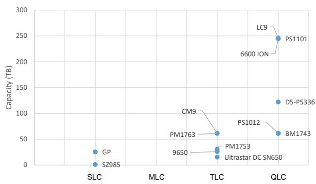

scatter

| Company | Capacity (TB) |
| :--- | :--- |
| GP | 25 |
| SZ985 | 5 |
| SLC | 0 |
| LMC | 0 |
| TMCL | 60 |
| CM9 | 70 |
| PM1763 | 30 |
| 9650 | 20 |
| Ultrastar DC SN650 | 15 |
| PS1012 | 40 |
| PS1101 | 245 |
| 6600 ION | 225 |
| D5-P5336 | 125 |
| BM1743 | 60 |

Source: UBS estimates based on company data

# TurboQuant does not reduce KV cache-related NAND demand

KV cache compression technology has advanced in recent years. In the case of Google's TurboQuant, the footprint per token can be compressed from 16-bit to 3-bit with no loss in accuracy. As a result, KV cache size shrinks, for example, from 125GB to around 23GB.

Meanwhile, offloading moves data from HBM to system memory or SSD once KV cache size is greater than available HBM. That is, whether offload technology is used depends on whether the size of the compressed KV cache exceeds available HBM capacity. If it fits, compression alone is sufficient. If it does not, offload is required.

As noted earlier, context length for major LLMs is more than doubling annually. Because KV cache size is proportional, it is growing at the same rate. In contrast, it takes around two years for per-GPU-module HBM capacity to double.

Even with compression technologies such as those used in TurboQuant, this widening gap cannot be bridged, meaning compression technology is not eliminating the need for offload. Once growth in context length pushes compressed KV cache beyond HBM capacity, offload becomes necessary again. In fact, companies are beginning to use KV cache compression technology in combination with offload to extend the context length models can handle.

# KV cache offloading changes NAND's role

In this way, AI inference systems are shifting toward a hierarchical memory architecture. Specifically, compression is applied within HBM as the first tier, and excess capacity is offloaded to NAND as a second tier. As a result, KV cache offloading is being repositioned from niche architectural optimisation to an essential requirement for supporting the ongoing evolution of AI inference, where context length continues to expand.

Consequently, NAND flash in AI inference is evolving beyond its traditional storage use, from a passive remote 'warehouse' to an active online 'material supply device' tightly coupled with GPU operation. As the storage layer near computation begins to participate in every link of data processing alongside GPUs, NAND flash demand will no longer be determined solely by standalone storage demand. Instead, like HBM, it will become linearly correlated with GPU deployment, because each GPU requires dedicated high-performance NAND to drive and sustain inference workflows.

This structural change represents significant upside potential for NAND demand growth. NAND is shifting from a peripheral component for AI accelerators to a mission-critical enabler.

According to NVIDIA estimates, large-scale multi-agent inference systems require as much as 16TB of KV cache capacity per GPU module. Even if this falls to one-fifth with TurboQuant, we expect NAND bit demand to increase sharply, as shown in Figure 16.

Figure 16: NAND demand driven by KV cache (UBSe)   
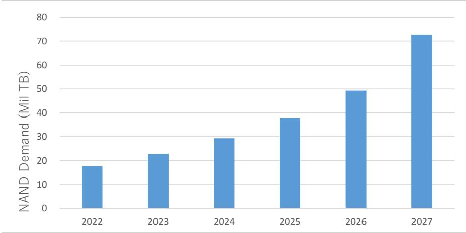

bar

| Year | NAND Demand (Mill TB) |
| :--- | :--- |
| 2022 | 18 |
| 2023 | 23 |
| 2024 | 29 |
| 2025 | 38 |
| 2026 | 49 |
| 2027 | 73 |

Source: UBS estimates

# Upside risk to NAND demand: HBF (high bandwidth flash)

One factor that could further boost NAND demand is high bandwidth flash (HBF), which is rapidly attracting attention as a next-generation technology to complement HBM. HBF is a new memory tier positioned between ultra-high-speed HBM and high-capacity SSDs, and is designed to simultaneously secure capacity expansion and power efficiency in AI inference workloads.

While conventional HBM achieves ultra-high speed bandwidth by vertically stacking DRAM, the key feature of HBF is that it vertically stacks NAND flash to form high-capacity long-term memory.

SK Hynix has announced 'H3', a new hybrid architecture integrating HBM and HBF. Under this H3 architecture, not only HBM but also HBF is placed in parallel immediately next to the GPU, enabling data processing in close proximity to the processor. As a result, by offloading the KV cache, which retains vast amounts of context, to the HBF tier, GPUs and HBM can focus on their original high-speed computing tasks, dramatically improving the power efficiency and throughput of the overall inference system.

# High capacity and wide bandwidth are supporting AI inference

In theoretical performance terms, while the bandwidth of a standard NVMe PCIe 4.0 SSD is capped at about 7,000MB/s, HBF is estimated to be capable of delivering a staggering data transfer speed of more than 1,638GB/s. In terms of capacity, while next-generation HBM4 is limited to 64GB per module, HBF can provide a substantially greater capacity of 512GB per module.

In fact, HBF currently under development by SanDisk is reportedly capable of boosting capacity by 8X while maintaining cost and bandwidth levels comparable to those of HBM by stacking 16 layers of NAND.

With the rise of multi-agent inference systems, the memory bandwidth and capacity required to maintain both processing speed and accuracy are likely to continue increasing. As a result, many in the industry see HBF as a core foundational technology in future AI inference infrastructure.

# Hyperscalers may adopt in 2028

Seeing the very large potential of the HBF market, leading memory companies are competing to develop HBF with the aim of achieving early standardisation and establishing mass production technologies.

In February 2026, SK Hynix and SanDisk launched the HBF Spec Standardization Consortium in the US and began joint work toward global standardisation of HBF technology under the Open Compute Project (OCP). SanDisk has moved quickly to build an HBF supply chain, and aims to launch a pilot line in Japan as a production base by H2

2026 and to commercialise the technology during 2027. SK Hynix likewise views HBF as a technology extension from HBM, and the company is also targeting 2027 for the start of mass production. Competitor Samsung Electronics has been conducting HBF-related research behind the scenes since the early 2020s and is strengthening its own portfolio through acquisition of related patents.

Based on these developments, we think HBF engineering samples are likely to appear before the end of 2027, and that actual adoption by major processor vendors such as Google, NVIDIA, and AMD could come as early as 2028.

# PIVOTAL QUESTIONS

# Q: How long will NAND prices continue to rise?

# UBSVIEW

While the NAND market is in a solid upswing, capacity expansion is lagging demand growth, and we believe supply shortages will continue through 2027. We expect the pace of price increases to peak around Q3 2027 in qoq terms.

# EVIDENCE

Comments from major listed NAND and HDD companies consistently support the view that demand is strong and current supply tightness is severe. Meanwhile, investment in NAND output expansion continues to be held back by factory space constraints, growing equipment lead times, tight availability of engineering staff, and priority investment in HBM. Industry inventories remain at low levels, which is leading to higher contract prices and longer contract terms. We therefore think supply shortages are likely to continue at least through 2026–27.

# WHAT'S PRICED IN?

The market appears to be assuming a traditional silicon cycle scenario, with the recent rise in NAND prices causing NAND demand to weaken, resulting in oversupply. However, market observers appear to be overlooking the fact that current NAND demand is being supported by core demand from AI data centres, where price elasticity is extremely low, and that investment in capacity expansion is lagging.

# Strong demand and severe supply tightness

We have obtained the following comments on NAND market trends from major HDD and NAND manufacturers. All of them point to strong NAND demand and extremely tight supply.

# 1. Hard disc drive manufacturers

# Western Digital (WDC, US)

- Inference generates huge volumes of new, unstructured data. The scale is such that storing it on SSDs is not economically viable, and cloud operators are directing inference-related bulk data to HDDs. This is creating structural demand.   
- 2026 is nearly sold out. We have firm orders from our seven biggest customers through the end of 2026. In addition, we have strong commercial agreements with three of the top five, with coverage through 2027 for two of them and through 2028 for one.   
- AI inference expands the role of HDDs beyond training to the entire AI value chain.

# Seagate Technology (STX, US)

- Nearline production capacity (87% of HDD sales) is fully allocated through 2026. In the coming months, we will begin taking orders for H1 2027, and discussions related to 2028 demand are progressing.   
- Inference-driven data growth will continue to support strong demand for high-capacity enterprise HDDs. Growth is coming not from unit volume increases, but from migration to higher-capacity drives.   
- The top priority for cloud customers is securing supply, and that supports price discipline.

# Toshiba (JP)

\- OP in the HDD business reflects firm trends, backed by expanding data centre demand driven by AI inference infrastructure.

\- The S300 AI HDD is a dedicated product designed for AI video analytics and edge inference, and it is optimised for mixed read/write workloads for real-time AI processing.

# 2. NAND flash manufacturers

# SanDisk (SNDK, US)

- As AI workloads expand, enterprise SSD demand is accelerating across the ecosystem. Inference in particular is meaningfully increasing NAND content per deployment.   
- Data centres are expected to become the largest NAND market in 2026, supported by the expansion of AI inference and rising storage strength per server.   
- AI inference requires low latency, high throughput, and high endurance. This evolution is shifting competition from price to performance capability.   
- We are developing high bandwidth flash (HBF) to address the capacity and bandwidth bottlenecks of conventional memory in large-scale AI inference. HBF delivers HBM-class bandwidth with NAND-level cost and density.   
- Together with SK Hynix, we are leading the standardisation of HBF for AI inference and KV cache expansion, enabling broad adoption.

# Micron Technology (MU, US)

- For NAND, AI inference is a bigger bit-growth driver than training. Inference and retrieval-augmented generation (RAG) architectures are driving a surge in data centre SSD demand.   
- Inference equals IOPS. In AI inference environments, extreme random read performance and low tail latency are required to keep GPUs fully utilised.   
- The Micron 9650 PCIe Gen6 SSD delivers up to 5.5mn random read IOPS and was designed to remove storage bottlenecks in AI inference.   
- Industry supply is expected to remain significantly below demand even after 2026, driven by the buildout of AI inference.

# Kioxia (285A, JP)

- Inference-related NAND demand is growing at a double-digit pace in data centre AI servers, edge AI devices, and AI PCs.   
- In collaboration with NVIDIA, we are developing a super-high IOPS SSD targeting over 10mn IOPS, and a next-generation 100mn IOPS SSD for AI inference.   
- The high-IOPS CD9P Series provides consistently low latency and high throughput for AI/HPC workloads, maximising GPU utilisation.   
- For NAND/SSD dedicated to KV cache applications, we are working with NVIDIA on specification development and demand assessment. We are targeting mass production around 2027, and believe this can be addressed with TLC SSDs using 8th-generation BiCS FLASH™.   
- By combining pre-trained models with proprietary data such as RAG, AI inference will bring explosive growth in server numbers and sustained expansion in SSD demand.   
- As competitors have focused on HBM and reduced NAND investment, Kioxia has opportunities for price increases and share gains.'

# Samsung Electronics (005930.KS, KR)

- AI inference and KV cache are driving a sharp expansion in enterprise SSD (ESSD) demand. ESSD is expected to account for approximately 37% of total NAND demand in 2026.   
- We are mass-producing KV SSDs and high-performance PCIe Gen6 SSDs optimised for AI inference workloads, with a focus on high-IOPS TLC products.'

- Memory semantic SSD provides up to a 20X performance improvement for AI inference tasks requiring high IOPS with small chunks.   
- As AI workloads shift from training to inference, demand for high-performance NAND and SSDs will be driven higher on a sustained basis.

# SK Hynix (000660.KS, KR)

- As the AI market shifts from training to inference with distributed architecture, NAND and enterprise SSD demand will grow strongly.'   
- Our AIN-P (AI-NAND performance) targets are 50mn IOPS in 2026 and 100mn IOPS in 2027 for ultra-low-latency AI inference.   
- Together with SanDisk, we are developing HBF to bridge the gap between HBM and SSDs. In inference scaling, HBF provides 10X the capacity of HBM at a lower cost.   
- AI inference is pushing storage from the periphery to the compute core, triggering explosive growth in enterprise SSD demand.

# Capacity expansion cannot keep up with demand

As the above discussion should make clear, AI server demand is a core growth engine for NAND, with robust growth in server unit shipments and increased per-server NAND use driving NAND demand higher.

However, monthly NAND wafer production capacity has been declining since a peak in 2022 (Figure 17). That means investment in NAND capacity expansion is being restrained by factory space constraints, longer equipment lead times, tight availability of engineering staffing, and – above all – priority investment in HBM.

Even though wafer production capacity is trending down, NAND bit supply continues to increase through technological innovation, as noted above. Even so, bit supply has never exceeded demand, and we do not expect the gap to be closed before 2027 (Figure 18).

This is not the pattern one would expect in a conventional silicon cycle. In fact, consumer electronics devices such as smartphones, personal computers, and tablets are currently under significant pressure from rising NAND prices. Replacement demand will likely be suppressed going forward, and our view is that shipment growth is likely to turn negative from 2026.

However, we think the consumer segment now accounts for only around one-third of total NAND demand and that the share will decline further over time (Figures 19-20). As a result, total NAND demand is likely to continue increasing, supported by NAND (SSD) for inference AI, where price elasticity is very low.

We believe the supply shortage will continue until 2027. Price increases are likely to continue on a qoq basis until peaking around Q3 2027 (Figure 21).

Figure 17: NAND: Total capacity and yoy growth   
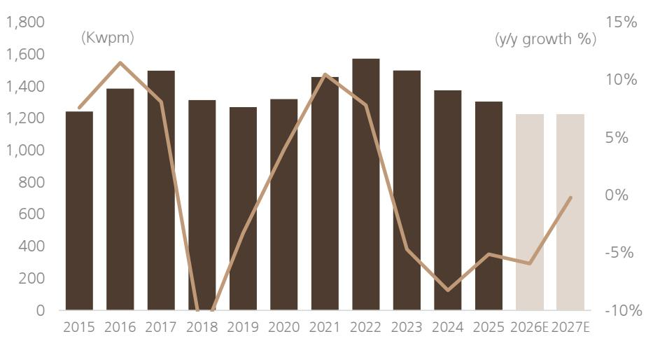

bar_line

| Year   | Value (Kwpm) | y/y growth (%) |
| ------ | ------------ | -------------- |
| 2015   | 1250         | 8%             |
| 2016   | 1400         | 12%            |
| 2017   | 1500         | 9%             |
| 2018   | 1300         | -10%           |
| 2019   | 1280         | -5%            |
| 2020   | 1320         | 3%             |
| 2021   | 1450         | 11%            |
| 2022   | 1580         | 8%             |
| 2023   | 1500         | -4%            |
| 2024   | 1380         | -8%            |
| 2025   | 1300         | -5%            |
| 2026E  | 1250         | -6%            |
| 2027E  | 1250         | -1%            |

Source: Company data, UBS estimates

Figure 18: NAND: Bit demand vs bit supply   
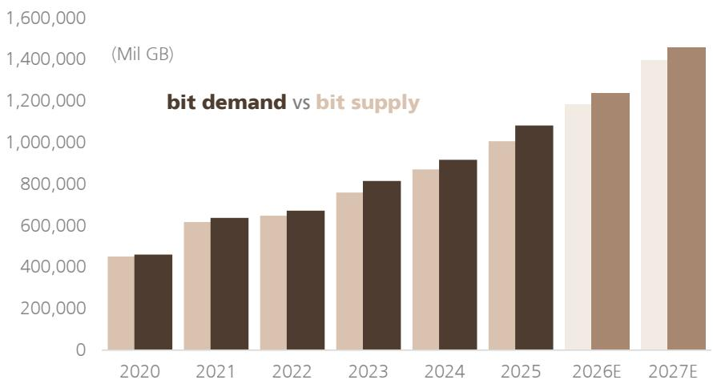

bar

bit demand vs bit supply
| Year | Bit Demand (Mill GB) | Bit Supply (Mill GB) |
| :--- | :--- | :--- |
| 2020 | 450,000 | 460,000 |
| 2021 | 620,000 | 640,000 |
| 2022 | 650,000 | 670,000 |
| 2023 | 760,000 | 810,000 |
| 2024 | 870,000 | 910,000 |
| 2025 | 1,010,000 | 1,080,000 |
| 2026E | 1,190,000 | 1,230,000 |
| 2027E | 1,410,000 | 1,450,000 |

Source: Company data, UBS estimates

Figure 19: NAND bit demand by application (CY26E)   
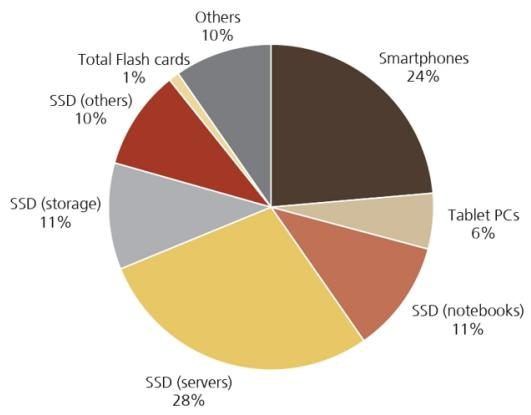

pie

| Category | Percentage (%) |
| :--- | :--- |
| Smartphones | 24 |
| Tablet PCs | 6 |
| SSD (notebooks) | 11 |
| SSD (servers) | 28 |
| SSD (storage) | 11 |
| SSD (others) | 10 |
| Others | 10 |
| Total Flash cards | 1 |

Source: Gartner, UBS estimates

Figure 20: NAND bit demand by application (CY27E)   
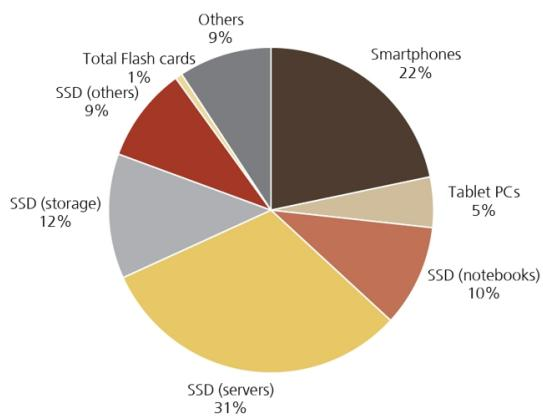

pie

| Category | Percentage (%) |
| :--- | :--- |
| Smartphones | 22 |
| Tablet PCs | 5 |
| SSD (notebooks) | 10 |
| SSD (servers) | 31 |
| SSD (storage) | 12 |
| SSD (others) | 9 |
| Total Flash cards | 1 |
| Others | 9 |

Source: Gartner, UBS estimates

Figure 21: NAND price trend (\$/1GB)   
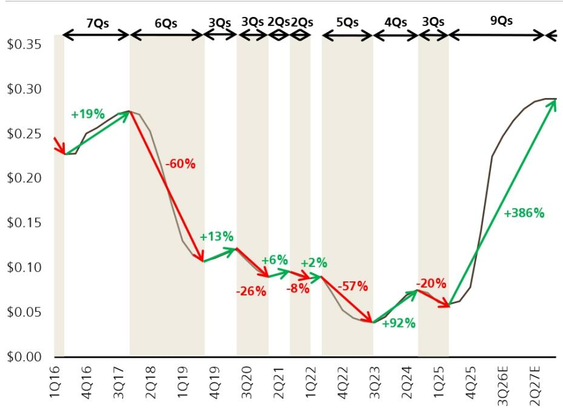

line

| Quarter | Value  | Change |
|---------|--------|--------|
| 1Q16    | $0.24  | +19%   |
| 4Q16    | $0.25  |        |
| 3Q17    | $0.27  |        |
| 2Q18    | $0.26  | -60%   |
| 1Q19    | $0.13  |        |
| 4Q19    | $0.12  | +13%   |
| 3Q20    | $0.10  |        |
| 2Q21    | $0.09  | -26%   |
| 1Q22    | $0.09  | +6%    |
| 4Q22    | $0.07  | -8%    |
| 3Q23    | $0.04  | +2%    |
| 2Q24    | $0.07  | -57%   |
| 1Q25    | $0.06  | +92%   |
| 4Q25    | $0.06  |        |
| 3Q26E   | $0.23  |        |
| 2Q27E   | $0.29  | +386%  |

Source: Company data, UBS estimates

# WHAT'S PRICED IN?

Memory Peers: EV/EBITDA (FY27)

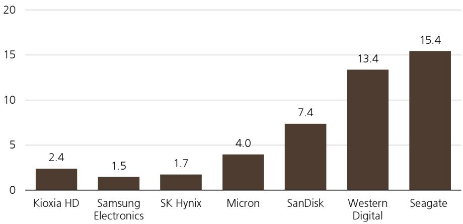

bar

| Company | Value |
| :--- | :--- |
| Kioxia HD | 2.4 |
| Samsung Electronics | 1.5 |
| SK Hynix | 1.7 |
| Micron | 4.0 |
| SanDisk | 7.4 |
| Western Digital | 13.4 |
| Seagate | 15.4 |

Source: UBS estimates, LSEG

Based on our discussions with investors, views on the NAND industry are currently mostly constructive. It is widely recognised that, at the inflection point where AI computing shifts from learning to training, the importance of NAND as a device increases. That has supported bullish views on the NAND industry not only within the NAND industry itself but also in the HDD industry, which sits one layer below NAND in the memory hierarchy, and where demand has strengthened for similar reasons.

Because the current market is exceptionally strong, most investor interest is focused on how long the current surge in NAND prices will continue. However, before this market recovery, NAND manufacturers had fallen into substantial losses. In FY3/23, Kioxia had a relatively low loss ratio, and, by FY3/25, Kioxia alone was profitable while other companies were around the breakeven point, prompting active debate over why Kioxia's margins were higher.

A new area of debate recently, amid what appears likely to be an unprecedented price surge, is the sustainability of current prices. We are forecasting a 7.3-fold increase in quarterly NAND industry sales from Q1 2025 to Q3 2027. Even if the price surge continues for some time, a supply-demand equilibrium point should emerge eventually and the market will likely weaken at some stage. Bears, thinking 'the higher the peak, the deeper the valley', are concerned that an extraordinary price surge could be followed by an extraordinary price decline. Bulls, meanwhile, reason that any price decline may end up being comparatively mild because the current price surge is being driven by AI demand.

Few investors believe Kioxia is leading in the technology competition for the hyperscalers driving AI demand. In the case of AI demand, SK Hynix, which established a technological lead in HBM in DRAM, is preparing mass production of HBF using that technology, and SanDisk, Kioxia's joint venture partner, is also preparing for HBF mass production. As supply frameworks at these two companies are being established, few investors believe the Super IOPS advocated by Kioxia will become the industry standard. Super IOPS represents an extension of SSD technology designed to further enhance access speeds, whereas HBF constitutes an intermediate memory layer positioned between DRAM (specifically HBM) and SSD, serving a fundamentally different use case.

Kioxia's largest customer has long been Apple. Given Apple's significant influence in the industry, there are likely few situations in which Kioxia could gain the upper hand in negotiations. A significant number of investors are concerned about this concentration on a specific customer. If the company succeeds in its current efforts to capture AI demand, investors will likely view that as a potential positive for earnings and margins from the perspective of customer mix.

# Earnings estimates

Kioxia's bit growth is expected to track market growth at approximately $20\%$ going forward, with the company guiding to high-teens growth for CY26. Over the next two years, the transition from 112-layer BiCS5 to 218-layer BiCS8 is set to progress (with a partial ramp of 332-layer BiCS10 as well). The migration from BiCS5 to BiCS8 increases bit shipments by 2.6x; however, the required expansion in layer-stacking equipment roughly doubles, effectively halving wafer production capacity. As a result, assuming a constant equipment base, bit growth would be a function of 2.6x yield offset by 0.5x wafer capacity, implying a net increase of approx. 1.3x, or roughly $30\%$ bit growth.

UBS forecasts Kioxia's bit growth at +18% YoY for FY3/27 and +25% for FY3/28. This assumes that wafer-equivalent production capacity at the Kioxia–SanDisk joint venture facilities declines from 460k/month at end-FY3/26 to 400k/month at end-FY3/27 and 370k/month at end-FY3/28. Based on Tokyo Electron disclosures (link), capex per 1k/month of capacity is estimated at \$112mn for BiCS10, \$102mn for BiCS8, and \$80mn for BiCS5. Accordingly, UBS assumes incremental investments of \$22mn for the transition from BiCS5 to BiCS8, and \$32mn from BiCS8 to BiCS10, forming the basis of its capex estimates.

Relative to Visible Alpha consensus, UBS forecasts outperformance for FY3/28. This divergence is primarily driven by pricing and volume assumptions: consensus expects bit ASPs to decline by 3.2% YoY from FY3/27 to FY3/28, whereas UBS assumes flat pricing. Additionally, UBS projects stronger bit growth (+25% YoY vs. consensus at +21.5%). Many Japanese equipment vendors anticipate an acceleration in Kioxia's capex in 2H FY3/27 versus 1H, supporting UBS's view that bit growth will reaccelerate from +18% in FY3/27 to +25% in FY3/28.

The joint venture agreement with SanDisk was renewed on 30 January. The updated terms underscore Kioxia's technological leadership and enhanced bargaining power vis-à-vis SanDisk. Key provisions include: (1) a five-year extension of the JV agreement from 31 December 2029 to 31 December 2034; and (2) total consideration of \$1.165bn (¥178.2bn), payable as \$175mn on 1 April 2026, and the remaining \$200–300mn annually in five installments each December from 2026 through 2029. While foundational technology development is conducted jointly, Kioxia has historically taken the lead in mass-production technologies. The revised terms suggest that the company is now able to secure compensation commensurate with its technological contributions, which is a positive development. As a reminder, the manufacturing JV structure with SanDisk results in approximately ¥200bn of annual shipments being recorded in both revenue and cost of goods sold for SanDisk-bound output, yielding zero profit contribution at the operating level.

On shareholder returns, Kioxia has historically struggled to generate cash since its days under Toshiba, leaving limited capacity for capital returns. However, the recent unprecedented upswing in NAND pricing has driven significant balance sheet improvement, prompting increasing debate in the equity market regarding potential distributions. At the FY3/26 earnings release, management indicated an initial focus on establishing a stable dividend policy. Similar discussions are also emerging among peers such as Samsung Electronics and SK Hynix. Given the commodity nature of the NAND industry, UBS views a combination of stable dividends and opportunistic share buybacks as the most pragmatic approach.

UBS assumes a 30% payout ratio, in line with the typical 30–35% range for Japanese corporates. In contrast, the Visible Alpha consensus reflects a 13% payout ratio; however, this appears to be skewed by a significant portion of zero-dividend assumptions based on the company's historical lack of distributions.

# Will the multiple diverge from its historical range?

The price target in this instance is derived based on a PBR framework, using the relationship PBR=ROE / CoE. To capture a normalised level of long-term ROE, we exclude the near-term FY3/27 and instead apply the average ROE of 41% over FY3/28–31, together with a cost of equity of 8.6%, implying a PBR of 4.7x. This corresponds to approx. 4.0x on an EV/EBITDA basis, which is consistent with the company's historical forward EV/EBITDA range of 3–5x since listing (Figure 24). This valuation range appears to reflect the structural characteristics of the NAND business, which is highly capex-intensive relative to revenue and has historically generated minimal free cash flow. In fact, this is comparable to industries with similar structural economics, such as air transportation, where the median forward EV/EBITDA multiple is also around 4x (Figure 25).

Current EV/EBITDA remains within its historical range, suggesting the equity markets may still view the memory industry as one that does not generate FCF. The investor consensus behind the negative view of the memory industry is that memory is a commodity product with large supply and demand fluctuations and a rapid pace of technological innovation, meaning that technological competition leads to investment competition and that tends to result in oversupply, while the supply–demand outlook is viewed as extremely short, at 3–6 months.

However, as we have argued, NAND is rapidly shifting from being a storage component for smartphones and SSDs, where price elasticity is high, to a core component for AI inference, where price elasticity is low. In other words, as the resilience of operating cash flow increases, the business is changing into one that does generate free cash flow. It is our view that the shift is not yet fully reflected in the current share price.

Figure 23: P/BV multiples of memory companies   
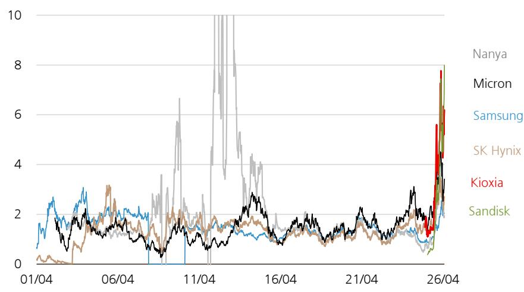

line

| Date   | Nanya | Micron | Samsung | SK Hynix | Kioxia | Sandisk |
|--------|-------|--------|---------|----------|--------|---------|
| 01/04  | 1.5   | 1.8    | 2.0     | 0.5      | 0.3    | 0.2     |
| 06/04  | 2.0   | 1.5    | 2.5     | 1.0      | 0.8    | 0.5     |
| 11/04  | 6.5   | 1.2    | 1.8     | 1.5      | 1.0    | 0.8     |
| 16/04  | 4.0   | 2.5    | 1.5     | 1.2      | 1.0    | 0.7     |
| 21/04  | 2.0   | 1.8    | 1.2     | 1.0      | 0.8    | 0.6     |
| 26/04  | 8.0   | 4.0    | 3.0     | 2.5      | 6.0    | 5.0     |

Source: UBS, LSEG Eikon

Figure 24: EV/EBITDA multiples of memory companies   
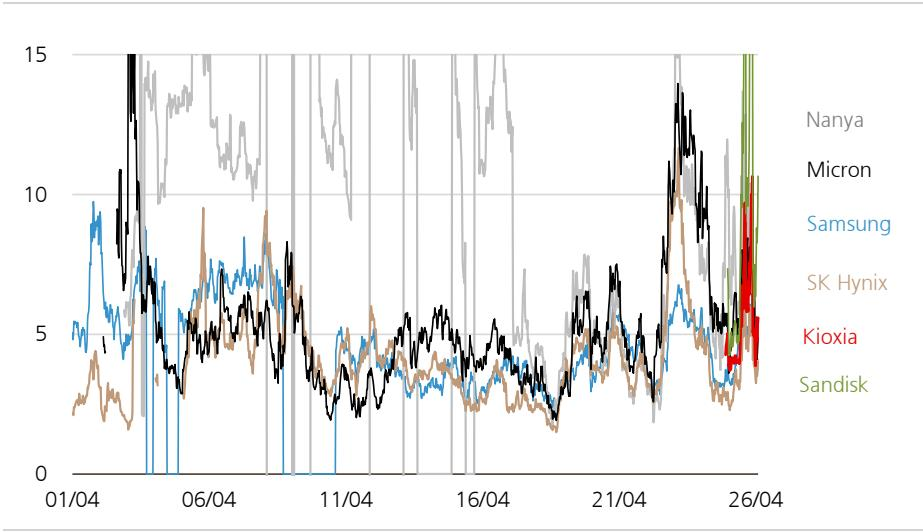

line

| Date   | Nanya | Micron | Samsung | SK Hynix | Kioxia | Sandisk |
|--------|-------|--------|---------|----------|--------|---------|
| 01/04  |       |        |         |          |        |         |
| 06/04  |       |        |         |          |        |         |
| 11/04  |       |        |         |          |        |         |
| 16/04  |       |        |         |          |        |         |
| 21/04  |       |        |         |          |        |         |
| 26/04  |       |        |         |          |        |         |

Source: UBS, LSEG Eikon

Figure 25: Average EV/EBITDA comparison: Rail vs Airline industries   
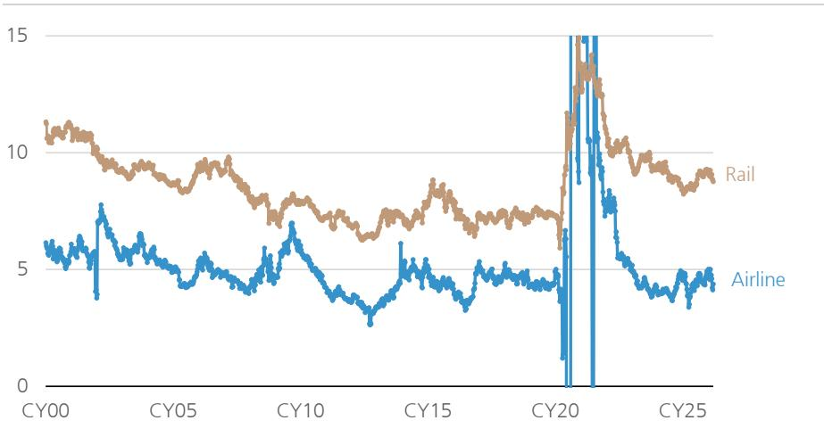

line

| Year | Rail | Airline |
|------|------|---------|
| CY00 | 11.0 | 6.0     |
| CY05 | 9.5  | 5.5     |
| CY10 | 8.0  | 7.0     |
| CY15 | 7.5  | 4.5     |
| CY20 | 7.0  | 4.0     |
| CY25 | 8.5  | 4.5     |

Source: UBS, LSEG Eikon

If the industry does become one that can generate stable FCF, what multiple would be appropriate? One useful reference would be multiples in industries that already generate high FCF while maintaining high levels of capital expenditure – for example, social infrastructure sectors including telecommunications, railways, and electric power. These sectors have been trading at EV/EBITDA levels of around 6X–7X.

From peak to trough, monthly sales in the NAND industry have declined at an average rate of 47% over the past seven down-phases in the cycle (Figure 26), suggesting sales generally fall by about half. Applying this to our current earnings forecasts, FY3/28 peak sales of ¥8.7trn and OP of ¥6.4trn, would, assuming a 47% decline, fall to sales of ¥4.6trn and OP of ¥2.3trn at bottom. Applying historical sales fluctuation ranges both to future up and down phases of the cycle, we estimate that medium-term stable OP is likely somewhere in the ¥4trn–¥5trn range. Applying the above EV/EBITDA of 6X–10X implies a market capitalisation of ¥33trn, close to that using our current price target.

Figure 26: NAND industry: Monthly revenue (\$bn) and peak-to-bottom change ratio in revenue   
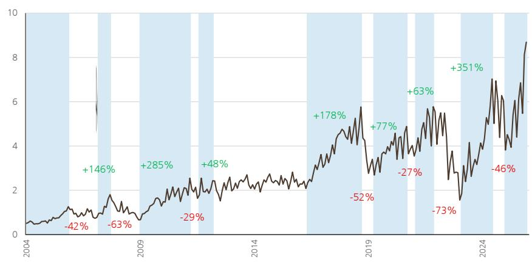

line

| Year | Value  |
|------|--------|
| 2004 | -42%   |
| 2005 | +146%  |
| 2006 | -63%   |
| 2007 | +285%  |
| 2008 | -29%   |
| 2009 | +48%   |
| 2010 | -52%   |
| 2011 | +178%  |
| 2012 | +77%   |
| 2013 | -27%   |
| 2014 | +63%   |
| 2015 | -73%   |
| 2016 | +351%  |
| 2017 | -46%   |
| 2018 | +351%  |
| 2019 | +351%  |
| 2020 | +351%  |
| 2021 | +351%  |
| 2022 | +351%  |
| 2023 | +351%  |
| 2024 | +351%  |
| 2025 | +351%  |

Source: UBS, SIA

UPSIDE/DOWNSIDE SPECTRUM   
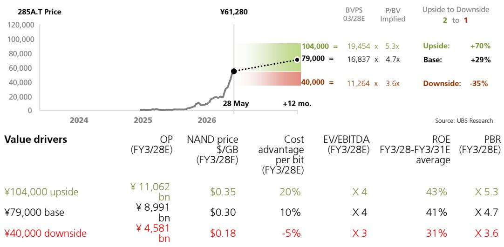

line

| Value drivers | OP (FY3/28E) | NAND price $/GB (FY3/28E) | Cost advantage per bit (FY3/28E) | EV/EBITDA (FY3/28E) | ROE FY3/28-FY3/31E average | PBR FY3/28E |
| --- | --- | --- | --- | --- | --- | --- |
| ¥104,000 upside | ¥11,062 bn | $0.35 | 20% | X 4 | 43% | X 5.3 |
| ¥79,000 base | ¥8,991 bn | $0.30 | 10% | X 4 | 41% | X 4.7 |
| ¥40,000 downside | ¥4,581 bn | $0.18 | -5% | X 3 | 31% | X 3.6 |

Source: UBS estimates

UPSIDE (¥104,000): This scenario assumes that supply shortages deepen beyond both UBS forecasts and the current consensus range, driving a further sustained increase in prices. UBS updates its memory pricing outlook on a monthly basis in its Memory Monthly report, and has continued to revise forecasts upward almost every month. In the latest report, for instance, the NAND price assumption for 2Q26 has again been raised from the prior +40% (previously unspecified) to +60%. This price strength is being driven primarily by growing AI inference demand. The current expansion in inference workloads is largely supported by revenue growth in AI coding agents, which are increasingly replacing traditional software development processes. Looking ahead, if additional industries—such as the legal sector, diagnostic healthcare, and drug discovery—begin to successfully monetize AI adoption, there could be a further acceleration in inference-driven demand. Under this upside scenario, we apply the same valuation multiple as in our base case, deriving a value of ¥104,000 based on an implied PBR multiple of 5.3x.

BASE (¥79,000): NAND pricing is expected to continue rising on a quarter-on-quarter basis through 3Q27. On a yoy basis, we forecast bit price growth of +214% from FY3/26 to FY3/27, and +0% from FY3/27 to FY3/28. Capex is projected to remain elevated around at ¥480bn in FY3/27, while bit growth is expected at +19% in FY3/27 and +24% in FY3/28, moderating to +12% in FY3/29 as supply-demand conditions ease. For valuation, we apply a PBR of 4.7x based on CoE of 8.6% and medium-term ROE of 41%, deriving a price target of ¥79,000.

DOWNSIDE (¥40,000): This scenario assumes that the current surge in memory pricing has peaked and the industry transitions into a down cycle. However, our downside scenario envisions a more moderate correction than in past cycles: we assume that the peak-to-trough revenue decline is limited to around 50%, with trough levels still remaining elevated relative to historical norms. We believe that NAND demand growth driven by AI inference is structural in nature, implying that the industry may no longer face the same degree of supply-demand volatility that has historically characterized the sector. Accordingly, a return to the prolonged and severe imbalances of prior cycles appears less likely. An extreme downside scenario—where breakthroughs in AI inference architectures or efficiency gains materially reduce demand, effectively reverting the industry to one that struggles to generate free cash flow—is not incorporated into the current UBS base case.

Figure 27: Earnings summary (annual) 

<table><tr><td rowspan="2">Kioxia(¥bn)</td><td>FY25</td><td colspan="2">FY26</td><td colspan="2">vs</td><td colspan="2">FY27</td><td colspan="2">vs</td></tr><tr><td>Actual</td><td>Consensus</td><td>UBS</td><td>Consensus</td><td>Y/Y</td><td>Consensus</td><td>UBS</td><td>Consensus</td><td>Y/Y</td></tr><tr><td>Sales</td><td>2,338</td><td>8,488</td><td>9,121</td><td>+633.1</td><td>+6,783.4</td><td>10,019</td><td>11,301</td><td>+1,282.5</td><td>+2,180.0</td></tr><tr><td>bit shipments (mn GB)</td><td>156,875</td><td>209,811</td><td>186,960</td><td>-22,851</td><td>+30,085</td><td>254,507</td><td>232,449</td><td>-22,058</td><td>45,490</td></tr><tr><td>y/y</td><td>+18%</td><td>+34%</td><td>+19%</td><td>-15pt</td><td>+1pt</td><td>+21%</td><td>+24%</td><td>+3pt</td><td>+5pt</td></tr><tr><td>ASP (¥/GB)</td><td>¥14.90</td><td>¥40.45</td><td>¥48.79</td><td>+¥8.34</td><td>+3.4</td><td>¥39.36</td><td>¥48.62</td><td>+¥9.26</td><td>-¥0.17</td></tr><tr><td>y/y</td><td>+16%</td><td>+171%</td><td>+227%</td><td>+56pt</td><td>+21pt</td><td>-3%</td><td>-0%</td><td>+2pt</td><td>-228pt</td></tr><tr><td>OP (Non-GAAP)</td><td>876</td><td>6,423</td><td>7,111</td><td>+687.8</td><td>+6,234.8</td><td>7,473</td><td>8,991</td><td>+1,517.6</td><td>+1,880.0</td></tr><tr><td>OPM%</td><td>37%</td><td>76%</td><td>78%</td><td>+2pt</td><td>+40pt</td><td>75%</td><td>80%</td><td>+5pt</td><td>+2pt</td></tr><tr><td>Dividends</td><td>0</td><td>557</td><td>1,475</td><td>+918.0</td><td>+1,474.8</td><td>685</td><td>1,866</td><td>+1,180.7</td><td>+391.3</td></tr><tr><td>Dividend payout ratio%</td><td>0%</td><td>13%</td><td>30%</td><td>+17pt</td><td>+30pt</td><td>13%</td><td>30%</td><td>+17pt</td><td>+0pt</td></tr><tr><td>Capex</td><td>284</td><td>465</td><td>466</td><td>+0.7</td><td>+182.0</td><td>591</td><td>496</td><td>-95.2</td><td>+30.0</td></tr></table>

Source: Company data, company estimates, Visible Alpha, UBS estimates

Figure 28: Earnings estimates 

<table><tr><td rowspan="2">(¥bn)</td><td rowspan="2">3/22</td><td rowspan="2">3/23</td><td rowspan="2">3/24</td><td rowspan="2">3/25</td><td colspan="6">3/26</td><td colspan="6">3/27E</td><td rowspan="2"></td><td rowspan="2">CoE (1Q)</td><td rowspan="2">3/28E</td><td rowspan="2">3/29E</td></tr><tr><td>1Q</td><td>2Q</td><td>3Q</td><td>4Q</td><td>1H</td><td>2H</td><td>1QE</td><td>2QE</td><td>3QE</td><td>4QE</td><td>1HE</td><td>2HE</td></tr><tr><td>Net sales</td><td>1,526.5</td><td>1,282.1</td><td>1,076.6</td><td>1,706.5</td><td>342.8</td><td>448.3</td><td>543.6</td><td>1,002.9</td><td>791.1</td><td>1,546.5</td><td>2,337.6</td><td>1,813.3</td><td>2,135.3</td><td>2,387.2</td><td>2,784.2</td><td>3,948.5</td><td>5,171.5</td><td>9,121.0</td><td>1,750.0</td><td>11,301.0</td></tr><tr><td>Y/Y</td><td></td><td>-16%</td><td>-16%</td><td>59%</td><td>-20%</td><td>-7%</td><td>21%</td><td>189%</td><td>-13%</td><td>94%</td><td>37%</td><td>429%</td><td>376%</td><td>339%</td><td>178%</td><td>399%</td><td>234%</td><td>290%</td><td>411%</td><td>24%</td></tr><tr><td>COGS</td><td>1,139.8</td><td>1,240.2</td><td>1,205.9</td><td>1,137.0</td><td>271.6</td><td>326.2</td><td>367.0</td><td>359.9</td><td>597.8</td><td>726.9</td><td>1,324.7</td><td>429.5</td><td>449.5</td><td>444.5</td><td>450.5</td><td>879.0</td><td>895.0</td><td>1,774.0</td><td></td><td>2,050.0</td></tr><tr><td>/ sales</td><td>75%</td><td>97%</td><td>112%</td><td>67%</td><td>79%</td><td>73%</td><td>68%</td><td>36%</td><td>76%</td><td>47%</td><td>57%</td><td>24%</td><td>21%</td><td>19%</td><td>16%</td><td>22%</td><td>17%</td><td>19%</td><td></td><td>18%</td></tr><tr><td>SG&amp;A</td><td>170.4</td><td>140.9</td><td>123.4</td><td>117.7</td><td>26.3</td><td>36.2</td><td>33.9</td><td>46.2</td><td>62.5</td><td>80.0</td><td>142.5</td><td>50.0</td><td>60.0</td><td>60.0</td><td>70.0</td><td>110.0</td><td>130.0</td><td>240.0</td><td></td><td>260.0</td></tr><tr><td>/ sales</td><td>11%</td><td>11%</td><td>11%</td><td>7%</td><td>8%</td><td>8%</td><td>6%</td><td>5%</td><td>8%</td><td>5%</td><td>6%</td><td>3%</td><td>3%</td><td>3%</td><td>3%</td><td>3%</td><td>3%</td><td>3%</td><td></td><td>2%</td></tr><tr><td>Operating profit</td><td>216.2</td><td>-99.0</td><td>-252.7</td><td>451.7</td><td>44.9</td><td>85.9</td><td>142.8</td><td>596.8</td><td>130.8</td><td>739.5</td><td>870.4</td><td>1,333.8</td><td>1,625.8</td><td>1,882.7</td><td>2,263.7</td><td>2,959.5</td><td>4,146.5</td><td>7,107.0</td><td>1,298.0</td><td>8,991.0</td></tr><tr><td>OPM</td><td>14%</td><td>-8%</td><td>-23%</td><td>26%</td><td>13%</td><td>19%</td><td>26%</td><td>60%</td><td>17%</td><td>48%</td><td>37%</td><td>74%</td><td>76%</td><td>79%</td><td>81%</td><td>75%</td><td>80%</td><td>78%</td><td>74%</td><td>80%</td></tr><tr><td>Non-operating</td><td></td><td></td><td>-90.6</td><td>-81.1</td><td>-17.6</td><td>-29.2</td><td>-21.0</td><td>-18.5</td><td>-46.8</td><td>-39.5</td><td>-86.3</td><td>-0.9</td><td>-0.8</td><td>-0.9</td><td>-0.8</td><td>-1.6</td><td>-1.6</td><td>-3.2</td><td></td><td>-2.5</td></tr><tr><td>Finance income</td><td></td><td></td><td>1.8</td><td>3.7</td><td>2.4</td><td>-0.4</td><td>1.6</td><td>5.9</td><td>2.0</td><td>7.5</td><td>9.5</td><td>1.0</td><td>1.0</td><td>1.0</td><td>1.0</td><td>2.0</td><td>2.0</td><td>4.0</td><td></td><td>4.0</td></tr><tr><td>Finance cost</td><td></td><td></td><td>92.7</td><td>85.3</td><td>19.9</td><td>29.1</td><td>22.8</td><td>25.0</td><td>49.0</td><td>47.7</td><td>96.7</td><td>2.1</td><td>2.1</td><td>2.1</td><td>2.1</td><td>4.1</td><td>4.1</td><td>8.2</td><td></td><td>7.5</td></tr><tr><td>Other</td><td></td><td></td><td>0.3</td><td>0.5</td><td>-0.1</td><td>0.3</td><td>0.1</td><td>0.6</td><td>0.2</td><td>0.8</td><td>0.9</td><td>0.2</td><td>0.3</td><td>0.2</td><td>0.3</td><td>0.5</td><td>0.5</td><td>1.0</td><td></td><td>1.0</td></tr><tr><td>Pre-Tax profit</td><td>154.4</td><td>-186.4</td><td>-343.3</td><td>370.7</td><td>27.3</td><td>56.7</td><td>121.7</td><td>578.3</td><td>84.0</td><td>700.1</td><td>784.1</td><td>1,332.9</td><td>1,625.0</td><td>1,881.9</td><td>2,263.0</td><td>2,957.9</td><td>4,144.9</td><td>7,103.8</td><td></td><td>8,988.5</td></tr><tr><td>Tax</td><td>48.4</td><td>-48.3</td><td>-99.6</td><td>98.3</td><td>9.0</td><td>16.0</td><td>33.9</td><td>170.6</td><td>25.1</td><td>204.5</td><td>229.6</td><td>410.5</td><td>500.4</td><td>579.6</td><td>697.2</td><td>910.9</td><td>1,276.8</td><td>2,187.7</td><td></td><td>2,768.1</td></tr><tr><td>Tax Rate</td><td>31%</td><td>26%</td><td>29%</td><td>27%</td><td>33%</td><td>28%</td><td>28%</td><td>29%</td><td>30%</td><td>29%</td><td>29%</td><td>31%</td><td>31%</td><td>31%</td><td>31%</td><td>31%</td><td>31%</td><td>31%</td><td></td><td>31%</td></tr><tr><td>Net profit</td><td>105.9</td><td>-138.1</td><td>-243.7</td><td>272.3</td><td>18.3</td><td>40.7</td><td>87.8</td><td>407.7</td><td>58.9</td><td>495.5</td><td>554.5</td><td>922.4</td><td>1,124.6</td><td>1,302.3</td><td>1,565.8</td><td>2,047.0</td><td>2,868.1</td><td>4,916.1</td><td>869.0</td><td>6,220.3</td></tr><tr><td>Operating CF</td><td>549.1</td><td>339.1</td><td>195.1</td><td>476.4</td><td>61.1</td><td>114.0</td><td>147.0</td><td>294.4</td><td>175.2</td><td>441.4</td><td>616.5</td><td></td><td></td><td></td><td></td><td></td><td></td><td>4,445.1</td><td></td><td>6,273.9</td></tr><tr><td>Investing CF</td><td>-400.3</td><td>-498.6</td><td>-274.9</td><td>-173.0</td><td>-34.1</td><td>-72.8</td><td>-61.3</td><td>-53.3</td><td>-106.9</td><td>-114.6</td><td>-221.5</td><td></td><td></td><td></td><td></td><td></td><td></td><td>-465.7</td><td></td><td>-495.7</td></tr><tr><td>Financial CF</td><td>-93.3</td><td>-50.8</td><td>3.2</td><td>-322.7</td><td>-17.3</td><td>15.3</td><td>-41.6</td><td>-52.4</td><td>-2.0</td><td>-94.1</td><td>-96.1</td><td></td><td></td><td></td><td></td><td></td><td></td><td>-2,551.0</td><td></td><td>-1,895.1</td></tr><tr><td>Shares outstanding (mn)</td><td>51.7</td><td>51.7</td><td>51.8</td><td>53.9</td><td>53.9</td><td>54.0</td><td>54.4</td><td>54.6</td><td>54.0</td><td>54.6</td><td>54.6</td><td></td><td></td><td></td><td></td><td></td><td></td><td>54.6</td><td></td><td>54.6</td></tr><tr><td>EPS (¥)</td><td>204.7</td><td>-266.9</td><td>-471.0</td><td>504.9</td><td>33.9</td><td>75.3</td><td>161.3</td><td>746.6</td><td>109.2</td><td>907.4</td><td>1,015.4</td><td></td><td></td><td></td><td></td><td></td><td></td><td>9,002.5</td><td></td><td>11,390.8</td></tr><tr><td>BPS (¥)</td><td>1,534.0</td><td>1,271.6</td><td>868.9</td><td>1,367.5</td><td>1,409.1</td><td>1,517.8</td><td>1,797.2</td><td>2,561.7</td><td>1,517.8</td><td>2,561.7</td><td>2,561.7</td><td></td><td></td><td></td><td></td><td></td><td></td><td>8,863.5</td><td></td><td>16,837.0</td></tr><tr><td>Capex</td><td>400.9</td><td>510.4</td><td>305.1</td><td>225.6</td><td>53.6</td><td>91.5</td><td>70.9</td><td>67.7</td><td>145.1</td><td>138.6</td><td>283.7</td><td></td><td></td><td></td><td></td><td></td><td></td><td>480.0</td><td></td><td>510.0</td></tr><tr><td>Depreciation</td><td>445.4</td><td>418.2</td><td>346.1</td><td>312.3</td><td>80.0</td><td>78.9</td><td>77.6</td><td>76.4</td><td>158.8</td><td>154.0</td><td>312.8</td><td></td><td></td><td></td><td></td><td></td><td></td><td>350.0</td><td></td><td>390.0</td></tr><tr><td>R&amp;D</td><td>140.3</td><td>1,282.1</td><td>1,076.6</td><td>1,706.5</td><td>342.8</td><td>448.3</td><td>543.6</td><td>1,002.9</td><td>791.1</td><td>1,546.5</td><td>2,337.6</td><td></td><td></td><td></td><td></td><td></td><td></td><td>9,121.0</td><td></td><td>11,301.0</td></tr><tr><td>Shipment</td><td>11,574.4</td><td>10,533.3</td><td>10,639.6</td><td>13,290.2</td><td>3,092.2</td><td>4,205.4</td><td>4,415.7</td><td>3,974.1</td><td>7,297.7</td><td>8,389.9</td><td>15,687.5</td><td></td><td></td><td></td><td></td><td></td><td></td><td>18,696.0</td><td></td><td>23,244.9</td></tr><tr><td>q/q</td><td></td><td></td><td></td><td></td><td>0%</td><td>36%</td><td>5%</td><td>-10%</td><td></td><td></td><td></td><td></td><td></td><td></td><td></td><td></td><td></td><td></td><td></td><td></td></tr><tr><td>y/y</td><td>33%</td><td>-9%</td><td>1%</td><td>25%</td><td>-4%</td><td>19%</td><td>29%</td><td>29%</td><td>8%</td><td>29%</td><td>18%</td><td></td><td></td><td></td><td></td><td></td><td></td><td>19%</td><td></td><td>24%</td></tr><tr><td>ASP / GB (¥)</td><td>¥13.19</td><td>¥12.17</td><td>¥10.12</td><td>¥12.84</td><td>¥11.09</td><td>¥10.66</td><td>¥12.31</td><td>¥25.23</td><td>¥10.84</td><td>¥18.43</td><td>¥14.90</td><td></td><td></td><td></td><td></td><td></td><td></td><td>¥46.81</td><td></td><td>¥46.74</td></tr><tr><td>q/q</td><td></td><td></td><td></td><td></td><td>-1%</td><td>-4%</td><td>15%</td><td>105%</td><td></td><td></td><td></td><td></td><td></td><td></td><td></td><td></td><td></td><td></td><td></td><td></td></tr><tr><td>y/y</td><td>-3%</td><td>-8%</td><td>-17%</td><td>27%</td><td>-17%</td><td>-21%</td><td>-6%</td><td>125%</td><td>-19%</td><td>51%</td><td>16%</td><td></td><td></td><td></td><td></td><td></td><td></td><td>214%</td><td></td><td>0%</td></tr></table>

Source: company data, company estimates, UBS estimates

Figure 29: NAND earnings estimates 

<table><tr><td></td><td>FY18</td><td>FY19</td><td>FY20</td><td>FY21</td><td>FY24</td><td colspan="4"></td><td rowspan="2">FY25</td><td colspan="4"></td><td rowspan="2">FY26E</td><td rowspan="2">CoE (1Q)</td><td rowspan="2">FY27E</td><td rowspan="2">FY28E</td></tr><tr><td>(JPY bn)</td><td></td><td></td><td></td><td></td><td></td><td>1Q</td><td>2Q</td><td>3Q</td><td>4Q</td><td>1QE</td><td>2QE</td><td>3QE</td><td>4QE</td></tr><tr><td>Sales</td><td>1,148</td><td>987</td><td>1,178</td><td>1,526</td><td>1,706.5</td><td>342.8</td><td>448.3</td><td>543.6</td><td>1,002.9</td><td>2,337.6</td><td>1,813.3</td><td>2,135.3</td><td>2,387.2</td><td>2,784.2</td><td>9,121.0</td><td>1,750.0</td><td>11,301.0</td><td>10,181.0</td></tr><tr><td>Bit Shipments (mn GB)</td><td>49,401</td><td>66,570</td><td>87,063</td><td>115,744</td><td>132,902</td><td>30,922</td><td>42,054</td><td>44,157</td><td>39,741</td><td>156,875</td><td>41,728</td><td>45,067</td><td>47,320</td><td>52,844</td><td>186,960</td><td></td><td>232,449</td><td>259,531</td></tr><tr><td>y/y</td><td>1380%</td><td>35%</td><td>31%</td><td>33%</td><td>25%</td><td>-4%</td><td>19%</td><td>29%</td><td>29%</td><td>18%</td><td>35%</td><td>46%</td><td>13%</td><td>20%</td><td>19%</td><td></td><td>24%</td><td>12%</td></tr><tr><td>q/q</td><td></td><td></td><td></td><td></td><td></td><td>0%</td><td>36%</td><td>5%</td><td>-10%</td><td></td><td>5%</td><td>8%</td><td>5%</td><td>12%</td><td></td><td></td><td></td><td></td></tr><tr><td>ASP (¥/GB)</td><td>¥23.2</td><td>¥14.8</td><td>¥13.5</td><td>¥13.2</td><td>¥12.8</td><td>¥11.1</td><td>¥10.7</td><td>¥12.3</td><td>¥25.2</td><td>¥14.9</td><td>¥43.5</td><td>¥47.4</td><td>¥50.4</td><td>¥52.7</td><td>¥48.8</td><td></td><td>¥48.6</td><td>¥39.2</td></tr><tr><td>y/y</td><td></td><td></td><td></td><td></td><td>27%</td><td>-17%</td><td>-21%</td><td>-6%</td><td>125%</td><td>16%</td><td>292%</td><td>327%</td><td>373%</td><td>328%</td><td>227%</td><td></td><td>0%</td><td>-19%</td></tr><tr><td>q/q</td><td></td><td></td><td></td><td></td><td></td><td>-1%</td><td>-4%</td><td>15%</td><td>105%</td><td></td><td>192%</td><td>9%</td><td>6%</td><td>4%</td><td></td><td></td><td></td><td></td></tr><tr><td>OP (Non-GAAP)</td><td>329</td><td>▲ 60</td><td>116</td><td>313</td><td>453</td><td>45</td><td>87</td><td>145</td><td>599</td><td>876</td><td>1,335</td><td>1,627</td><td>1,884</td><td>2,265</td><td>7,111</td><td>1,300</td><td>8,991</td><td>7,701</td></tr><tr><td>OPM%</td><td>29%</td><td>-6%</td><td>10%</td><td>21%</td><td>27%</td><td>13%</td><td>19%</td><td>27%</td><td>60%</td><td>37%</td><td>74%</td><td>76%</td><td>79%</td><td>81%</td><td>78%</td><td>74%</td><td>80%</td><td>76%</td></tr><tr><td>FCF</td><td>39</td><td>▲ 194</td><td>178</td><td>152</td><td>253</td><td>9</td><td>23</td><td>76</td><td>227</td><td>335</td><td></td><td></td><td></td><td></td><td>3,979</td><td></td><td>5,778</td><td>5,560</td></tr><tr><td>CapEx</td><td>428</td><td>357</td><td>260</td><td>401</td><td>226</td><td>54</td><td>91</td><td>71</td><td>68</td><td>284</td><td></td><td></td><td></td><td></td><td>466</td><td></td><td>496</td><td>386</td></tr><tr><td>Depreciation</td><td>319</td><td>412</td><td>426</td><td>445</td><td>312</td><td>80</td><td>79</td><td>78</td><td>76</td><td>313</td><td></td><td></td><td></td><td></td><td>350</td><td></td><td>390</td><td>390</td></tr><tr><td>JPY / USD</td><td>110.3</td><td>107.7</td><td>106.0</td><td>112.0</td><td>152.6</td><td>145.0</td><td>147.0</td><td>153.0</td><td>155.0</td><td>151.4</td><td></td><td></td><td></td><td></td><td>158.3</td><td></td><td>158.0</td><td>158.0</td></tr><tr><td>Capacity (K/m)</td><td>564 K</td><td>550 K</td><td>550 K</td><td>551 K</td><td>358 K</td><td>400 K</td><td>480 K</td><td>480 K</td><td>460 K</td><td>455 K</td><td></td><td></td><td></td><td></td><td>433 K</td><td></td><td>390 K</td><td>350 K</td></tr><tr><td>Shipment (K/m)</td><td>338 K</td><td>330 K</td><td>330 K</td><td>330 K</td><td>208 K</td><td>190 K</td><td>245 K</td><td>293 K</td><td>293 K</td><td>255 K</td><td></td><td></td><td></td><td></td><td>254 K</td><td></td><td>232 K</td><td>207 K</td></tr><tr><td>Inventory</td><td>227.7</td><td>215.1</td><td>256.5</td><td>304.2</td><td>352.9</td><td>371.9</td><td>361.6</td><td>353.5</td><td>412.6</td><td>412.6</td><td></td><td></td><td></td><td></td><td>486.0</td><td></td><td>561.6</td><td>608.2</td></tr><tr><td>Sales ($) / Wafer</td><td></td><td></td><td>2,808</td><td>3,436</td><td>4,491</td><td>4,148</td><td>4,150</td><td>4,042</td><td>7,361</td><td>5,040</td><td></td><td></td><td></td><td></td><td>18,947</td><td></td><td>25,719</td><td>25,941</td></tr><tr><td>Cost (¥K) / Wafer</td><td></td><td></td><td>236</td><td>272</td><td>424</td><td>448</td><td>433</td><td>395</td><td>40</td><td>414</td><td></td><td></td><td></td><td></td><td>546</td><td></td><td>680</td><td>813</td></tr></table>

Source: company data, company estimates, UBS estimates

Kioxia Holdings Corp (285A.T) 

<table><tr><td>Income Statement (¥b)</td><td>03/24</td><td>03/25</td><td>03/26</td><td>03/27E</td><td>%ch</td><td>03/28E</td><td>%ch</td><td>03/29E</td><td>03/30E</td><td>03/31E</td></tr><tr><td>Revenues</td><td>1,076.6</td><td>1,706.5</td><td>2,337.6</td><td>9,121.0</td><td>290.2</td><td>11,301.0</td><td>23.9</td><td>10,181.0</td><td>9,711.0</td><td>9,711.0</td></tr><tr><td>Gross profit</td><td>(129.3)</td><td>569.4</td><td>1,012.9</td><td>7,347.0</td><td>NM</td><td>9,251.0</td><td>25.9</td><td>7,961.0</td><td>7,221.0</td><td>7,201.0</td></tr><tr><td>EBITDA (UBS)</td><td>93.4</td><td>764.1</td><td>1,183.2</td><td>7,457.0</td><td>NM</td><td>9,381.0</td><td>25.8</td><td>8,091.0</td><td>7,381.0</td><td>7,381.0</td></tr><tr><td>Depreciation &amp; amortisation</td><td>(346.1)</td><td>(312.3)</td><td>(312.8)</td><td>(350.0)</td><td>-11.9</td><td>(390.0)</td><td>-11.4</td><td>(390.0)</td><td>(420.0)</td><td>(440.0)</td></tr><tr><td>EBIT (UBS)</td><td>(252.7)</td><td>451.7</td><td>870.4</td><td>7,107.0</td><td>NM</td><td>8,991.0</td><td>26.5</td><td>7,701.0</td><td>6,961.0</td><td>6,941.0</td></tr><tr><td>Associates &amp; investment income</td><td>0.0</td><td>0.0</td><td>0.0</td><td>0.0</td><td>-</td><td>0.0</td><td>-</td><td>0.0</td><td>0.0</td><td>0.0</td></tr><tr><td>Other non-operating income</td><td>0.0</td><td>0.0</td><td>0.0</td><td>0.0</td><td>-</td><td>0.0</td><td>-</td><td>0.0</td><td>0.0</td><td>0.0</td></tr><tr><td>Net interest</td><td>(90.6)</td><td>(81.1)</td><td>(86.3)</td><td>(3.2)</td><td>96.3</td><td>(2.5)</td><td>21.5</td><td>(1.8)</td><td>(1.1)</td><td>(0.4)</td></tr><tr><td>Exceptionals (incl goodwill)</td><td>0.0</td><td>0.0</td><td>0.0</td><td>0.0</td><td>-</td><td>0.0</td><td>-</td><td>0.0</td><td>0.0</td><td>0.0</td></tr><tr><td>Pre-tax profit</td><td>(343.3)</td><td>370.7</td><td>784.1</td><td>7,103.8</td><td>NM</td><td>8,988.5</td><td>26.5</td><td>7,699.2</td><td>6,959.9</td><td>6,940.6</td></tr><tr><td>Tax</td><td>99.6</td><td>(98.3)</td><td>(229.6)</td><td>(2,187.7)</td><td>NM</td><td>(2,768.1)</td><td>-26.5</td><td>(2,371.0)</td><td>(2,143.3)</td><td>(2,137.4)</td></tr><tr><td>Profit after tax</td><td>(243.7)</td><td>272.3</td><td>554.5</td><td>4,916.1</td><td>NM</td><td>6,220.3</td><td>26.5</td><td>5,328.1</td><td>4,816.5</td><td>4,803.2</td></tr><tr><td>Preference dividends</td><td>0.0</td><td>0.0</td><td>0.0</td><td>0.0</td><td>-</td><td>0.0</td><td>-</td><td>0.0</td><td>0.0</td><td>0.0</td></tr><tr><td>Minorities</td><td>0.0</td><td>0.0</td><td>0.0</td><td>0.0</td><td>-</td><td>0.0</td><td>-</td><td>0.0</td><td>0.0</td><td>0.0</td></tr><tr><td>Extraordinary items</td><td>0.0</td><td>0.0</td><td>0.0</td><td>0.0</td><td>-</td><td>0.0</td><td>-</td><td>0.0</td><td>0.0</td><td>0.0</td></tr><tr><td>Net earnings (local GAAP)</td><td>(243.7)</td><td>272.3</td><td>554.5</td><td>4,916.1</td><td>NM</td><td>6,220.3</td><td>26.5</td><td>5,328.1</td><td>4,816.5</td><td>4,803.2</td></tr><tr><td>Net earnings (UBS)</td><td>(243.7)</td><td>272.3</td><td>554.5</td><td>4,916.1</td><td>NM</td><td>6,220.3</td><td>26.5</td><td>5,328.1</td><td>4,816.5</td><td>4,803.2</td></tr><tr><td>Tax rate (%)</td><td>0.0</td><td>26.5</td><td>29.3</td><td>30.8</td><td>5.2</td><td>30.8</td><td>0.0</td><td>30.8</td><td>30.8</td><td>30.8</td></tr><tr><td>Per Share (¥)</td><td>03/24</td><td>03/25</td><td>03/26</td><td>03/27E</td><td>%ch</td><td>03/28E</td><td>%ch</td><td>03/29E</td><td>03/30E</td><td>03/31E</td></tr><tr><td>EPS (UBS, diluted)</td><td>(452.1)</td><td>505.2</td><td>1,015.4</td><td>9,002.5</td><td>NM</td><td>11,390.8</td><td>26.5</td><td>9,757.0</td><td>8,820.1</td><td>8,795.7</td></tr><tr><td>EPS (local GAAP, diluted)</td><td>(452.1)</td><td>505.2</td><td>1,015.4</td><td>9,002.5</td><td>NM</td><td>11,390.8</td><td>26.5</td><td>9,757.0</td><td>8,820.1</td><td>8,795.7</td></tr><tr><td>EPS (UBS, basic)</td><td>(452.1)</td><td>505.2</td><td>1,015.4</td><td>9,002.5</td><td>NM</td><td>11,390.8</td><td>26.5</td><td>9,757.0</td><td>8,820.1</td><td>8,795.7</td></tr><tr><td>DPS (net) (¥)</td><td>0.0</td><td>0.0</td><td>0.0</td><td>2,700.7</td><td>-</td><td>3,417.2</td><td>26.5</td><td>2,927.1</td><td>2,646.0</td><td>2,638.7</td></tr><tr><td>Cash EPS (UBS, diluted) 1</td><td>189.8</td><td>1,084.5</td><td>1,588.2</td><td>9,643.4</td><td>NM</td><td>12,104.9</td><td>25.5</td><td>10,471.1</td><td>9,589.2</td><td>9,601.4</td></tr><tr><td>Book value per share</td><td>834.1</td><td>1,368.2</td><td>2,561.7</td><td>8,863.5</td><td>246.0</td><td>16,837.0</td><td>90.0</td><td>23,666.9</td><td>29,840.9</td><td>35,997.9</td></tr><tr><td>Average shares (diluted)</td><td>539.1</td><td>539.1</td><td>546.1</td><td>546.1</td><td>0.0</td><td>546.1</td><td>0.0</td><td>546.1</td><td>546.1</td><td>546.1</td></tr><tr><td>Balance Sheet (¥b)</td><td>03/24</td><td>03/25</td><td>03/26</td><td>03/27E</td><td>%ch</td><td>03/28E</td><td>%ch</td><td>03/29E</td><td>03/30E</td><td>03/31E</td></tr><tr><td>Cash and equivalents</td><td>192.9</td><td>171.9</td><td>477.9</td><td>1,906.4</td><td>298.9</td><td>5,789.5</td><td>203.7</td><td>9,721.4</td><td>13,127.6</td><td>16,417.3</td></tr><tr><td>Other current assets</td><td>458.4</td><td>634.8</td><td>1,139.9</td><td>2,162.7</td><td>89.7</td><td>2,623.1</td><td>21.3</td><td>2,472.0</td><td>2,463.0</td><td>2,468.5</td></tr><tr><td>Total current assets</td><td>651.4</td><td>806.7</td><td>1,617.8</td><td>4,069.1</td><td>151.5</td><td>8,412.6</td><td>106.7</td><td>12,193.5</td><td>15,590.7</td><td>18,885.8</td></tr><tr><td>Net tangible fixed assets</td><td>1,328.5</td><td>1,297.2</td><td>1,233.3</td><td>1,363.3</td><td>10.5</td><td>1,483.3</td><td>8.8</td><td>1,493.3</td><td>1,573.3</td><td>1,633.3</td></tr><tr><td>Net intangible fixed assets</td><td>406.7</td><td>405.9</td><td>406.8</td><td>406.8</td><td>0.0</td><td>406.8</td><td>0.0</td><td>406.8</td><td>406.8</td><td>406.8</td></tr><tr><td>Investments / other assets</td><td>478.4</td><td>409.8</td><td>432.1</td><td>432.1</td><td>0.0</td><td>432.1</td><td>0.0</td><td>432.1</td><td>432.1</td><td>432.1</td></tr><tr><td>Total assets</td><td>2,864.9</td><td>2,919.7</td><td>3,690.1</td><td>6,271.3</td><td>70.0</td><td>10,734.8</td><td>71.2</td><td>14,525.7</td><td>18,002.9</td><td>21,358.0</td></tr><tr><td>Trade payables &amp; other ST liabilities</td><td>999.7</td><td>696.1</td><td>878.6</td><td>1,080.4</td><td>23.0</td><td>1,204.4</td><td>11.5</td><td>1,280.7</td><td>1,402.0</td><td>1,410.9</td></tr><tr><td>Short term debt</td><td>866.4</td><td>289.0</td><td>219.4</td><td>43.9</td><td>-80.0</td><td>43.9</td><td>0.0</td><td>43.9</td><td>43.9</td><td>43.9</td></tr><tr><td>Total current liabilities</td><td>1,866.1</td><td>985.2</td><td>1,098.0</td><td>1,124.3</td><td>2.4</td><td>1,248.3</td><td>11.0</td><td>1,324.6</td><td>1,445.9</td><td>1,454.8</td></tr><tr><td>Long term debt</td><td>427.8</td><td>710.5</td><td>1,033.8</td><td>147.5</td><td>-85.7</td><td>132.8</td><td>-10.0</td><td>117.6</td><td>102.0</td><td>85.9</td></tr><tr><td>Other long term liabilities</td><td>121.3</td><td>486.3</td><td>159.2</td><td>159.2</td><td>0.0</td><td>159.2</td><td>0.0</td><td>159.2</td><td>159.2</td><td>159.2</td></tr><tr><td>Preferred shares</td><td>0.0</td><td>0.0</td><td>0.0</td><td>0.0</td><td>-</td><td>0.0</td><td>-</td><td>0.0</td><td>0.0</td><td>0.0</td></tr><tr><td>Total liabilities (incl pref shares)</td><td>2,415.2</td><td>2,182.0</td><td>2,291.0</td><td>1,431.0</td><td>-37.5</td><td>1,540.2</td><td>7.6</td><td>1,601.4</td><td>1,707.0</td><td>1,699.9</td></tr><tr><td>Common s/h equity</td><td>449.6</td><td>737.6</td><td>1,398.9</td><td>4,840.2</td><td>246.0</td><td>9,194.5</td><td>90.0</td><td>12,924.1</td><td>16,295.7</td><td>19,658.0</td></tr><tr><td>Minority interests</td><td>0.1</td><td>0.1</td><td>0.2</td><td>0.2</td><td>0.0</td><td>0.2</td><td>0.0</td><td>0.2</td><td>0.2</td><td>0.2</td></tr><tr><td>Total liabilities &amp; equity</td><td>2,864.9</td><td>2,919.7</td><td>3,690.1</td><td>6,271.3</td><td>70.0</td><td>10,734.8</td><td>71.2</td><td>14,525.7</td><td>18,002.9</td><td>21,358.0</td></tr><tr><td>Cash Flow (¥b)</td><td>03/24</td><td>03/25</td><td>03/26</td><td>03/27E</td><td>%ch</td><td>03/28E</td><td>%ch</td><td>03/29E</td><td>03/30E</td><td>03/31E</td></tr><tr><td>Net income (before pref divs)</td><td>(243.7)</td><td>272.3</td><td>554.5</td><td>4,916.1</td><td>NM</td><td>6,220.3</td><td>26.5</td><td>5,328.1</td><td>4,816.5</td><td>4,803.2</td></tr><tr><td>Depreciation &amp; amortisation</td><td>346.1</td><td>312.3</td><td>312.8</td><td>350.0</td><td>11.9</td><td>390.0</td><td>11.4</td><td>390.0</td><td>420.0</td><td>440.0</td></tr><tr><td>Net change in working capital</td><td>146.0</td><td>(183.8)</td><td>(400.3)</td><td>(821.0)</td><td>-105.1</td><td>(336.5)</td><td>59.0</td><td>227.5</td><td>130.2</td><td>3.5</td></tr><tr><td>Other operating</td><td>(56.6)</td><td>70.9</td><td>144.8</td><td>(5.3)</td><td>-</td><td>(4.9)</td><td>8.8</td><td>(4.4)</td><td>(3.9)</td><td>(3.5)</td></tr><tr><td>Operating cash flow</td><td>191.8</td><td>471.7</td><td>611.8</td><td>4,439.8</td><td>NM</td><td>6,269.0</td><td>41.2</td><td>5,941.2</td><td>5,362.9</td><td>5,243.2</td></tr><tr><td>Tangible capital expenditure</td><td>(324.2)</td><td>(291.6)</td><td>(295.4)</td><td>(480.0)</td><td>-62.5</td><td>(510.0)</td><td>-6.3</td><td>(400.0)</td><td>(500.0)</td><td>(500.0)</td></tr><tr><td>Intangible capital expenditure</td><td>(0.7)</td><td>(1.8)</td><td>(2.6)</td><td>0.0</td><td>-</td><td>0.0</td><td>-</td><td>0.0</td><td>0.0</td><td>0.0</td></tr><tr><td>Net (acquisitions) &amp; disposals</td><td>0.0</td><td>0.0</td><td>0.0</td><td>0.0</td><td>-</td><td>0.0</td><td>-</td><td>0.0</td><td>0.0</td><td>0.0</td></tr><tr><td>Other investing</td><td>30.2</td><td>52.6</td><td>62.2</td><td>0.0</td><td>-</td><td>0.0</td><td>-</td><td>0.0</td><td>0.0</td><td>0.0</td></tr><tr><td>Investing cash flow</td><td>(294.6)</td><td>(240.8)</td><td>(235.8)</td><td>(480.0)</td><td>-103.5</td><td>(510.0)</td><td>-6.3</td><td>(400.0)</td><td>(500.0)</td><td>(500.0)</td></tr><tr><td>Equity dividends paid</td><td>0.0</td><td>0.0</td><td>0.0</td><td>(1,474.8)</td><td>-</td><td>(1,866.1)</td><td>-26.5</td><td>(1,598.4)</td><td>(1,445.0)</td><td>(1,441.0)</td></tr><tr><td>Share issues / (buybacks)</td><td>0.0</td><td>30.4</td><td>11.6</td><td>0.0</td><td>-</td><td>0.0</td><td>-</td><td>0.0</td><td>0.0</td><td>0.0</td></tr><tr><td>Other financing</td><td>0.0</td><td>0.0</td><td>0.0</td><td>0.0</td><td>-</td><td>0.0</td><td>-</td><td>0.0</td><td>0.0</td><td>0.0</td></tr><tr><td>Change in debt &amp; pref shares</td><td>26.3</td><td>(280.6)</td><td>(88.6)</td><td>(1,056.4)</td><td>NM</td><td>(9.8)</td><td>99.1</td><td>(10.8)</td><td>(11.7)</td><td>(12.6)</td></tr><tr><td>Financing cash flow</td><td>26.3</td><td>(250.2)</td><td>(77.0)</td><td>(2,531.3)</td><td>NM</td><td>(1,875.9)</td><td>25.9</td><td>(1,609.2)</td><td>(1,456.7)</td><td>(1,453.6)</td></tr><tr><td>Cash flow inc/(dec) in cash</td><td>(76.5)</td><td>(19.3)</td><td>298.9</td><td>1,428.5</td><td>377.8</td><td>3,883.1</td><td>171.8</td><td>3,932.0</td><td>3,406.2</td><td>3,289.6</td></tr><tr><td>FX / non cash items</td><td>6.3</td><td>(1.8)</td><td>7.0</td><td>0.0</td><td>-100.0</td><td>0.0</td><td>-</td><td>0.0</td><td>0.0</td><td>0.0</td></tr><tr><td>Balance sheet inc/(dec) in cash</td><td>(70.2)</td><td>(21.0)</td><td>306.0</td><td>1,428.5</td><td>366.8</td><td>3,883.1</td><td>171.8</td><td>3,932.0</td><td>3,406.2</td><td>3,289.6</td></tr></table>

Source: Company accounts, UBS estimates. (UBS) metrics use reported figures which have been adjusted by UBS analysts. $^{1}$ Cash EPS (UBS, diluted) is calculated using UBS net income adding back depreciation and amortization.

Kioxia Holdings Corp (285A.T) 

<table><tr><td>Valuation (x)</td><td>03/24</td><td>03/25</td><td>03/26</td></tr><tr><td>P/E (local GAAP, diluted)</td><td>-</td><td>4.3</td><td>8.0</td></tr><tr><td>P/E (UBS, diluted)</td><td>-</td><td>4.3</td><td>8.0</td></tr><tr><td>P/CEPS</td><td>-</td><td>2.0</td><td>5.1</td></tr><tr><td>Equity FCF (UBS) yield %</td><td>-</td><td>15.4</td><td>7.1</td></tr><tr><td>Dividend yield (net) %</td><td>-</td><td>0.0</td><td>0.0</td></tr><tr><td>P/BV</td><td>-</td><td>1.6</td><td>3.2</td></tr><tr><td>EV/revenues (core)</td><td>-</td><td>1.3</td><td>2.3</td></tr><tr><td>EV/EBITDA (UBS core)</td><td>-</td><td>2.8</td><td>4.5</td></tr><tr><td>EV/EBIT (core)</td><td>-</td><td>4.8</td><td>6.1</td></tr><tr><td>EV/OpFCF (core)</td><td>-</td><td>2.8</td><td>4.5</td></tr><tr><td>EV/op. invested capital</td><td>-</td><td>1.4</td><td>2.8</td></tr></table>

<table><tr><td>Enterprise value (¥b)</td><td>03/24</td><td>03/25</td><td>03/26</td></tr><tr><td>Market cap.</td><td>-</td><td>1,159.7</td><td>4,424.6</td></tr><tr><td>Net debt (cash)</td><td>1,051.6</td><td>964.4</td><td>801.5</td></tr><tr><td>Buy out of minorities</td><td>0.1</td><td>0.1</td><td>0.1</td></tr><tr><td>Pension provisions/other</td><td>49.1</td><td>47.5</td><td>44.7</td></tr><tr><td>Total enterprise value</td><td>-</td><td>2,171.8</td><td>5,270.9</td></tr><tr><td>Non core assets</td><td>0.0</td><td>0.0</td><td>0.0</td></tr><tr><td>Core enterprise value</td><td>-</td><td>2,171.8</td><td>5,270.9</td></tr></table>

<table><tr><td>Growth (%)</td><td>03/24</td><td>03/25</td><td>03/26</td></tr><tr><td>Revenue</td><td>(16.0)</td><td>58.5</td><td>37.0</td></tr><tr><td>EBITDA (UBS)</td><td>(70.7)</td><td>NM</td><td>54.9</td></tr><tr><td>EBIT (UBS)</td><td>(155.2)</td><td>-</td><td>92.7</td></tr><tr><td>EPS (UBS, diluted)</td><td>(76.4)</td><td>-</td><td>101.0</td></tr><tr><td>Net DPS</td><td>-</td><td>-</td><td>-</td></tr></table>

<table><tr><td>Margins &amp; Profitability (%)</td><td>03/24</td><td>03/25</td><td>03/26</td></tr><tr><td>Gross profit margin</td><td>NM</td><td>33.4</td><td>43.3</td></tr><tr><td>EBITDA margin</td><td>8.7</td><td>44.8</td><td>50.6</td></tr><tr><td>EBIT (UBS) margin</td><td>(23.5)</td><td>26.5</td><td>37.2</td></tr><tr><td>Net earnings (UBS) margin</td><td>NM</td><td>16.0</td><td>23.7</td></tr><tr><td>ROIC (EBIT)</td><td>NM</td><td>28.1</td><td>45.5</td></tr><tr><td>ROIC post tax</td><td>NM</td><td>20.7</td><td>32.1</td></tr><tr><td>ROE (UBS)</td><td>(44.0)</td><td>45.9</td><td>51.9</td></tr></table>

<table><tr><td>Capital structure &amp; Coverage (x)</td><td>03/24</td><td>03/25</td><td>03/26</td></tr><tr><td>Net debt / EBITDA</td><td>11.8</td><td>1.1</td><td>0.7</td></tr><tr><td>Net debt / total equity %</td><td>244.9</td><td>112.2</td><td>55.4</td></tr><tr><td>Net debt / (net debt + total equity) %</td><td>71.0</td><td>52.9</td><td>35.7</td></tr><tr><td>Net debt/EV %</td><td>-</td><td>44.4</td><td>15.2</td></tr><tr><td>Capex / depreciation %</td><td>93.7</td><td>93.4</td><td>94.4</td></tr><tr><td>Capex / revenue %</td><td>NM</td><td>17.1</td><td>12.6</td></tr><tr><td>EBIT / net interest</td><td>-</td><td>5.6</td><td>10.1</td></tr><tr><td>Dividend cover (UBS)</td><td>-</td><td>-</td><td>-</td></tr><tr><td>Div. payout ratio (UBS) %</td><td>-</td><td>-</td><td>-</td></tr></table>

<table><tr><td>Revenues by division (¥b)</td><td>03/24</td><td>03/25</td><td>03/26</td></tr><tr><td>SSD &amp; Storage</td><td>516.4</td><td>991.1</td><td>1,362.6</td></tr><tr><td>Smart Devices</td><td>374.3</td><td>501.1</td><td>760.0</td></tr><tr><td>Others</td><td>185.9</td><td>214.3</td><td>215.0</td></tr><tr><td>Total</td><td>1,076.6</td><td>1,706.5</td><td>2,337.6</td></tr></table>

<table><tr><td>EBIT (UBS) by division (¥b)</td><td>03/24</td><td>03/25</td><td>03/26</td></tr><tr><td>Others</td><td>(252.7)</td><td>451.7</td><td>870.4</td></tr><tr><td>Total</td><td>(252.7)</td><td>451.7</td><td>870.4</td></tr></table>

<table><tr><td>03/27E</td><td>03/28E</td><td>03/29E</td><td>03/30E</td><td>03/31E</td></tr><tr><td>6.8</td><td>5.4</td><td>6.3</td><td>6.9</td><td>7.0</td></tr><tr><td>6.8</td><td>5.4</td><td>6.3</td><td>6.9</td><td>7.0</td></tr><tr><td>6.4</td><td>5.1</td><td>5.9</td><td>6.4</td><td>6.4</td></tr><tr><td>11.8</td><td>17.2</td><td>16.6</td><td>14.5</td><td>14.2</td></tr><tr><td>4.4</td><td>5.6</td><td>4.8</td><td>4.3</td><td>4.3</td></tr><tr><td>6.9</td><td>3.6</td><td>2.6</td><td>2.1</td><td>1.7</td></tr><tr><td>3.6</td><td>2.6</td><td>2.5</td><td>2.3</td><td>1.9</td></tr><tr><td>4.4</td><td>3.2</td><td>3.2</td><td>3.0</td><td>2.6</td></tr><tr><td>4.6</td><td>3.3</td><td>3.4</td><td>3.2</td><td>2.7</td></tr><tr><td>4.4</td><td>3.2</td><td>3.2</td><td>3.0</td><td>2.6</td></tr><tr><td>12.3</td><td>8.8</td><td>7.4</td><td>6.6</td><td>5.6</td></tr></table>

<table><tr><td>03/27E</td><td>03/28E</td><td>03/29E</td><td>03/30E</td><td>03/31E</td></tr><tr><td>33,464.2(469.8)</td><td>33,464.2(3,663.9)</td><td>33,464.2(7,586.3)</td><td>33,464.2(11,270.8)</td><td>33,464.2(14,634.6)</td></tr><tr><td>0.2</td><td>0.2</td><td>0.2</td><td>0.2</td><td>0.2</td></tr><tr><td>42.9</td><td>42.9</td><td>42.9</td><td>42.9</td><td>42.9</td></tr><tr><td>33,037.3</td><td>29,843.3</td><td>25,920.9</td><td>22,236.4</td><td>18,872.6</td></tr><tr><td>0.0</td><td>0.0</td><td>0.0</td><td>0.0</td><td>0.0</td></tr><tr><td>33,037.3</td><td>29,843.3</td><td>25,920.9</td><td>22,236.4</td><td>18,872.6</td></tr></table>

<table><tr><td>03/27E</td><td>03/28E</td><td>03/29E</td><td>03/30E</td><td>03/31E</td></tr><tr><td>NM</td><td>23.9</td><td>(9.9)</td><td>(4.6)</td><td>0.0</td></tr><tr><td>NM</td><td>25.8</td><td>(13.8)</td><td>(8.8)</td><td>0.0</td></tr><tr><td>NM</td><td>26.5</td><td>(14.3)</td><td>(9.6)</td><td>(0.3)</td></tr><tr><td>NM</td><td>26.5</td><td>(14.3)</td><td>(9.6)</td><td>(0.3)</td></tr><tr><td>-</td><td>26.5</td><td>(14.3)</td><td>(9.6)</td><td>(0.3)</td></tr></table>

<table><tr><td>03/27E</td><td>03/28E</td><td>03/29E</td><td>03/30E</td><td>03/31E</td></tr><tr><td>NM</td><td>NM</td><td>NM</td><td>74.4</td><td>74.2</td></tr><tr><td>NM</td><td>NM</td><td>NM</td><td>NM</td><td>NM</td></tr><tr><td>77.9</td><td>79.6</td><td>75.6</td><td>71.7</td><td>71.5</td></tr><tr><td>53.9</td><td>55.0</td><td>52.3</td><td>49.6</td><td>49.5</td></tr><tr><td>NM</td><td>NM</td><td>NM</td><td>NM</td><td>NM</td></tr><tr><td>NM</td><td>NM</td><td>NM</td><td>NM</td><td>NM</td></tr><tr><td>157.6</td><td>88.6</td><td>48.2</td><td>33.0</td><td>26.7</td></tr></table>

<table><tr><td>03/27E</td><td>03/28E</td><td>03/29E</td><td>03/30E</td><td>03/31E</td></tr><tr><td>(0.2)</td><td>(0.6)</td><td>(1.2)</td><td>(1.8)</td><td>(2.2)</td></tr><tr><td>(35.4)</td><td>(61.0)</td><td>(74.0)</td><td>(79.7)</td><td>(82.9)</td></tr><tr><td>(54.9)</td><td>NM</td><td>NM</td><td>NM</td><td>NM</td></tr><tr><td>(1.4)</td><td>(12.3)</td><td>(29.3)</td><td>(50.7)</td><td>(77.5)</td></tr><tr><td>137.1</td><td>130.8</td><td>102.6</td><td>119.0</td><td>113.6</td></tr><tr><td>5.3</td><td>4.5</td><td>3.9</td><td>5.1</td><td>5.1</td></tr><tr><td>NM</td><td>NM</td><td>NM</td><td>NM</td><td>NM</td></tr><tr><td>3.3</td><td>3.3</td><td>3.3</td><td>3.3</td><td>3.3</td></tr><tr><td>30.0</td><td>30.0</td><td>30.0</td><td>30.0</td><td>30.0</td></tr></table>

<table><tr><td>03/27E</td><td>03/28E</td><td>03/29E</td><td>03/30E</td><td>03/31E</td></tr><tr><td>6,383.6</td><td>8,497.4</td><td>7,814.1</td><td>7,635.5</td><td>7,940.6</td></tr><tr><td>2,387.4</td><td>2,383.6</td><td>1,906.9</td><td>1,525.5</td><td>1,220.4</td></tr><tr><td>350.0</td><td>420.0</td><td>460.0</td><td>550.0</td><td>550.0</td></tr><tr><td>9,121.0</td><td>11,301.0</td><td>10,181.0</td><td>9,711.0</td><td>9,711.0</td></tr></table>

<table><tr><td>03/27E</td><td>03/28E</td><td>03/29E</td><td>03/30E</td><td>03/31E</td></tr><tr><td>7,107.0</td><td>8,991.0</td><td>7,701.0</td><td>6,961.0</td><td>6,941.0</td></tr><tr><td>7,107.0</td><td>8,991.0</td><td>7,701.0</td><td>6,961.0</td><td>6,941.0</td></tr></table>

Source: Company accounts, UBS estimates. (UBS) metrics use reported figures which have been adjusted by UBS analysts.

Forecast returns 

<table><tr><td>Forecast price appreciation</td><td>28.9%</td></tr><tr><td>Forecast dividend yield</td><td>4.4%</td></tr><tr><td>Forecast stock return</td><td>33.3%</td></tr><tr><td>Market return assumption</td><td>7.7%</td></tr><tr><td>Forecast excess return</td><td>25.6%</td></tr></table>

# Company Description

Kioxia is a leading global semiconductor manufacturer specializing in NAND flash memory and SSDs, holding a top-tier market share in this field. Originating from Toshiba's memory business, it operates as a dedicated manufacturer focused on the NAND business, offering products tailored for data centers and smart devices.

# Valuation Method and Risk Statement

Our price target is based on PBR. Risk factors include: 1) strong cyclicality of the NAND market and potential price declines following supply-demand equilibrium, 2) reduced demand due to a slowdown in AI investment and restrained semiconductor investment, 3) uncertainty regarding the sustainability of technological superiority, and 4) high profit leverage during periods of price increases.

# Quantitative Research Review

UBS Global Research publishes a quantitative assessment of its analysts' responses to certain questions about the likelihood of an occurrence of a number of short term factors in a product known as the 'Quantitative Research Review'. The views for this month can be found below. Views contained in this assessment on a particular stock reflect only the views on those short term factors which are a different timeframe to the 12-month timeframe reflected in any equity rating set out in this note. For previous responses please make reference to (i) previous UBS Global Research reports; and (ii) where no applicable research report was published that month, the Quantitative Research Review which can be found at https://neo.ubs.com/quantitative, or contact your UBS sales representative for access to the report or the Quantitative Research Team on ubs-quant-answers@ubs.com. A consolidated report which contains all responses is also available and again you should contact your UBS sales representative for details and pricing or the Quantitative Research Team on the email above.

Kioxia Holdings Corp 

<table><tr><td>Question</td><td>Response</td></tr><tr><td>1. Is the industry structure facing the firm likely to improve or deteriorate over the next six months? Rate on a scale of 1-5 (1 = getting worse, 3 = no change, 5 = getting better, N/A = no view)</td><td>5</td></tr><tr><td>2. Is the regulatory/government environment facing the firm likely to improve or deteriorate over the next six months? Rate on a scale of 1-5 (1 = getting tougher 3 = no change, 5 = getting better, N/A = no view)</td><td>3</td></tr><tr><td>3. Over the last 3-6 months in broad terms have things been improving/no change/getting worse for this stock? Rate on a scale of 1-5 (1 = getting a lot worse, 3 = not much change, 5 = getting a lot better, N/A = no view)</td><td>5</td></tr><tr><td>4. Relative to the current CONSENSUS EPS forecast, is the next company EPS update likely to lead to: (1 = negative surprise vs consensus, 3 = in-line with consensus, 5 = positive surprise vs consensus expectations, N/A = no view)</td><td>4</td></tr><tr><td>5. What&#x27;s driving the difference?</td><td></td></tr><tr><td>6. Relative to YOUR current earnings forecast, is there relatively greater risk at the next earnings result of:(1 = downside skew risk to earnings, 3 = equal upside or downside risk to earnings, 5 = upside skew risk to earnings, N/A = no view)</td><td>4</td></tr><tr><td>7. What&#x27;s driving the difference?</td><td></td></tr><tr><td>8. Is there an upcoming catalyst for the company over the next three months?</td><td>No Catalyst</td></tr><tr><td>9. Is there an actual or approximate date for the catalyst?</td><td></td></tr><tr><td>10. Is the catalyst date an actual or approximate date?</td><td>N/A</td></tr><tr><td>11. What is the catalyst?</td><td></td></tr></table>

# Required Disclosures

This document has been prepared by UBS Securities Japan Co., Ltd., an affiliate of UBS AG. UBS AG, its subsidiaries, branches and affiliates, including former Credit Suisse AG and its subsidiaries, branches and affiliates are referred to herein as "UBS".

For information on the ways in which UBS manages conflicts and maintains independence of its UBS Global Research product; historical performance information; certain additional disclosures concerning UBS Global Research recommendations; and terms and conditions for certain third party data used in research report, please visit https://www.ubs.com/disclosures. Unless otherwise indicated, information and data in this report are based on company disclosures including but not limited to annual, interim, quarterly reports and other company announcements. The figures contained in performance charts refer to the past; past performance is not a reliable indicator of future results. Additional information will be made available upon request. UBS Securities Co. Limited is licensed to conduct securities investment consultancy businesses by the China Securities Regulatory Commission. UBS acts or may act as principal in the debt securities (or in related derivatives) that may be the subject of this report. This recommendation was finalized on: 28 May 2026 02:53 PM GMT. UBS has designated certain UBS Global Research department members as Derivatives Research Analysts where those department members publish research principally on the analysis of the price or market for a derivative, and provide information reasonably sufficient upon which to base a decision to enter into a derivatives transaction. Where Derivatives Research Analysts co-author research reports with Equity Research Analysts or Economists, the Derivatives Research Analyst is responsible for the derivatives investment views, forecasts, and/or recommendations. Quantitative Research Review: UBS Global Research publishes a quantitative assessment of its analysts' responses to certain questions about the likelihood of an occurrence of a number of short term factors in a product known as the 'Quantitative Research Review'. Views contained in this assessment on a particular stock reflect only the views on those short term factors which are a different timeframe to the 12-month timeframe reflected in any equity rating set out in this note. For the latest responses, please see the Quantitative Research Review Addendum at the back of this report, where applicable. For previous responses please make reference to (i) previous UBS Global Research reports; and (ii) where no applicable research report was published that month, the Quantitative Research Review which can be found at https://neo.ubs.com/quantitative, or contact your UBS sales representative for access to the report or the Quantitative Research Team on ubs-quant-answers@ubs.com. A consolidated report which contains all responses is also available and again you should contact your UBS sales representative for details and pricing or the Quantitative Research team on the email above.

# Analyst Certification:

Each research analyst primarily responsible for the content of this research report, in whole or in part, certifies that with respect to each security or issuer that the analyst covered in this report: (1) all of the views expressed accurately reflect his or her personal views about those securities or issuers and were prepared in an independent manner, including with respect to UBS, and (2) no part of his or her compensation was, is, or will be, directly or indirectly, related to the specific recommendations or views expressed by that research analyst in the research report.

UBS Global Research: Global Equity Rating Definitions 

<table><tr><td>12-Month Rating</td><td>Definition</td><td>Coverage $^{1}$ </td><td>IB Services $^{2}$ </td></tr><tr><td>Buy</td><td>FSR is &gt; 6% above the MRA.</td><td>54%</td><td>24%</td></tr><tr><td>Neutral</td><td>FSR is between -6% and 6% of the MRA.</td><td>40%</td><td>21%</td></tr><tr><td>Sell</td><td>FSR is &gt; 6% below the MRA.</td><td>6%</td><td>21%</td></tr></table>

Source: UBS. Rating allocations are as of 31 March 2026.   
1: Percentage of companies under coverage globally within the 12-month rating category.   
2: Percentage of companies within the 12-month rating category for which investment banking (IB) services were provided within the past 12 months.

KEY DEFINITIONS: Forecast Stock Return (FSR) is defined as expected percentage price appreciation plus gross dividend yield over the next 12 months. In some cases, this yield may be based on accrued dividends. Market Return Assumption (MRA) is defined as the one-year local market interest rate plus 5% (a proxy for, and not a forecast of, the equity risk premium). Under Review (UR) Stocks may be flagged as UR by the analyst, indicating that the stock's price target and/or rating are subject to possible change in the near term, usually in response to an event that may affect the investment case or valuation. Equity Price Targets have an investment horizon of 12 months.

EXCEPTIONS AND SPECIAL CASES:UK and European Investment Fund ratings and definitions are: Buy: Positive on factors such as structure, management, performance record, discount; Neutral: Neutral on factors such as structure, management, performance record, discount; Sell: Negative on factors such as structure, management, performance record, discount. Core Banding Exceptions (CBE): Exceptions to the standard +/-6% bands may be granted by the Investment Review Consultation (IRC). Factors considered by the IRC include the stock's volatility and the credit spread of the respective company's debt. As a result, stocks deemed to be very high or low risk may be subject to higher or lower bands as they relate to the rating. When such exceptions apply, they will be identified in the Company Disclosures table in the relevant research piece.

Research analysts contributing to this report who are employed by any non-US affiliate of UBS Securities LLC are not registered/qualified as research analysts with FINRA. Such analysts may not be associated persons of UBS Securities LLC and therefore are not subject to the FINRA restrictions on communications with a subject company, public appearances, and trading securities held by a research analyst account. The name of each affiliate and analyst employed by that affiliate contributing to this report, if any, follows.

UBS Securities Japan Co., Ltd.: Atsuhiro Kinoshita, Kenji Yasui.

Company Disclosures 

<table><tr><td>Company Name</td><td>Reuters</td><td>12-month rating</td><td>Price</td><td>Price date</td></tr><tr><td>Kioxia Holdings Corp</td><td>285A.T</td><td>No Rating</td><td>¥61,280</td><td>28 May 2026</td></tr></table>

Source: UBS Global Research; LSEG Eikon. All prices as of local market close. Ratings in this table are the most current published ratings prior to this report. They may be more recent than the stock pricing date.

Unless otherwise indicated, please refer to the Valuation and Risk sections within the body of this report. For a complete set of disclosure statements associated with the companies discussed in this report, including information on valuation and risk, please contact UBS Securities LLC, 11 Madison Avenue, New York, NY 10010, USA, Attention: Investment Research.

Kioxia Holdings Corp (¥)   
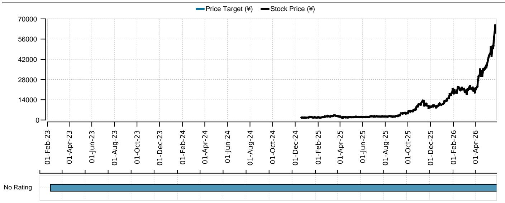

line

| Date       | Price Target (¥) | Stock Price (¥) |
| ---------- | ---------------- | --------------- |
| 01-Feb-23  | No Rating        | -               |
| 01-Apr-23  | No Rating        | -               |
| 01-Jun-23  | No Rating        | -               |
| 01-Aug-23  | No Rating        | -               |
| 01-Oct-23  | No Rating        | -               |
| 01-Dec-23  | No Rating        | -               |
| 01-Feb-24  | No Rating        | -               |
| 01-Apr-24  | No Rating        | -               |
| 01-Jun-24  | No Rating        | -               |
| 01-Aug-24  | No Rating        | -               |
| 01-Oct-24  | No Rating        | -               |
| 01-Dec-24  | No Rating        | ~1,000          |
| 01-Feb-25  | No Rating        | ~1,500          |
| 01-Apr-25  | No Rating        | ~1,500          |
| 01-Jun-25  | No Rating        | ~1,500          |
| 01-Aug-25  | No Rating        | ~2,000          |
| 01-Oct-25  | No Rating        | ~8,000          |
| 01-Dec-25  | No Rating        | ~14,000         |
| 01-Feb-26  | No Rating        | ~18,000         |
| 01-Apr-26  | No Rating        | ~28,000         |
| 01-May-26  | No Rating        | ~70,000         |

<table><tr><td>Date</td><td>Stock Price (¥)</td><td>Price Target (¥)</td><td>Rating</td></tr><tr><td>2023-02-28</td><td>NaN</td><td>-</td><td>No Rating</td></tr></table>

Source: UBS Global Research; LSEG Eikon as of 28-May-2026. All prices as of local market close. Ratings as of date shown.

# Company profile and fee and risk statement under the Japanese Financial Instruments & Exchange Law

Company Name etc: UBS Securities Japan Co., Ltd., Financial Instruments & Exchange Firm, Kanto Local Financial Bureau (Kinsho) No.2633

Associated Memberships: Japan Securities Dealers' Association, the Financial Futures Association of Japan, and Type II Financial Instruments Firms Association

UBS Securities Japan Co., Ltd. will receive a brokerage fee based on an individual contract and no standard upper limit or calculating method. For the trading of domestic stocks, consumption tax is added to the fee. For the trading of foreign stock, fee on the foreign stock exchange or foreign tax may be charged in addition to the domestic fee and tax. Those amounts may vary depending on the jurisdiction. There is a risk that a loss may occur due to a change in the price of the stock in the case of trading stocks, and that a loss may occur due to the exchange rate in the case of trading foreign stocks. There is a risk that a loss may occur due to a change in the price or performance of the properties in the portfolio in the case of trading REITs.

UBS Securities Japan Co., Ltd. will only receive the purchasing amounts for trading unlisted bonds (JGBs, municipals, government guaranteed bonds, corporate bonds) when UBS Securities Japan Co., Ltd. is the counterparty. There is a risk that a loss may occur due to a change in the price of the bond caused by the fluctuations in the interest rates, and that a loss may occur due to the exchange rate in the case of trading foreign bonds.

For the detailed information of commissions and risks associated with individual financial instrument transactions, please carefully read the documents provided prior to the execution of the contracts or other materials for customers, etc. before executing any transaction. If you need any clarification, please consult with our sales person in charge.

# The Disclaimer relevant to Global Wealth Management clients follows the Global Research Disclaimer. The Disclaimer relevant to Credit Suisse Wealth Management follows the Global Wealth Management Disclaimer.

# UBS Global Research Disclaimer

This document has been prepared by UBS Securities Japan Co., Ltd., an affiliate of UBS AG. UBS AG, its subsidiaries, branches and affiliates, including former Credit Suisse AG and its subsidiaries, branches and affiliates are referred to herein as "UBS".

Any opinions expressed in this document may change without notice and are only current as of the date of publication. Different areas, groups, and personnel within UBS may produce and distribute separate research products independently of each other. For example, research publications from UBS CIO are produced by UBS Global Wealth Management. UBS Global Research is produced by UBS Investment Bank. Research methodologies and rating systems of each separate research organization may differ, for example, in terms of investment recommendations, investment horizon, model assumptions, and valuation methods. As a consequence, except for certain economic forecasts (for which UBS CIO and UBS Global Research may collaborate), investment recommendations, ratings, price targets, and valuations provided by each of the separate research organizations may be different, or inconsistent. You should refer to each relevant research product for the details as to their methodologies and rating system. Not all clients may have access to all products from every organization. Each research product is subject to the policies and procedures of the organization that produces it.

This document is provided solely to recipients who are expressly authorized by UBS to receive it. If you are not so authorized you must immediately destroy the document.

UBS Global Research is provided to our clients through UBS Neo, and in certain instances, UBS.com and any other system or distribution method specifically identified in one or more communications distributed through UBS Neo or UBS.com (each a system) as an approved means for distributing UBS Global Research. It may also be made available through third party vendors and distributed by UBS and/or third parties via e-mail or alternative electronic means.

All UBS Global Research is available on UBS Neo. Please contact your UBS sales representative if you wish to discuss your access to UBS Neo. Where UBS Global Research refers to "UBS Evidence Lab Inside" or has made use of data provided by UBS Evidence Lab and you would like to access that data please contact your UBS sales representative. UBS Evidence Lab data is available on UBS Neo. The level and types of services provided by UBS Global Research and UBS Evidence Lab to a client may vary depending upon various factors such as a client's individual preferences as to the frequency and manner of receiving communications, a client's risk profile and investment focus and perspective (e.g., market wide, sector specific, long-term, short-term, etc.), the size and scope of the overall client relationship with UBS Global Research and UBS Evidence Lab and legal and regulatory constraints. UBS HOLT and UBS Pharma Values are offerings of UBS Global Research. HOLT Lens is a corporate performance platform offering that provides an objective accounting-led framework for comparing and valuing companies and is available to clients of UBS Global Research; for further details and pricing please contact your UBS Sales representative. In particular, HOLT has a variety of warranted prices based on the scenario chosen; please mail UBS Securities LLC, 11 Madison Avenue, New York, NY 10010, USA, Attention: Investment Research, if you are interested in the warranted price on a particular company, again subject to commercial considerations. UBS Pharma Values is an analytical tool that involves the creation of a number of individual product net present value calculations, based on published forecasts of sales for pharmaceuticals, and is available to clients of UBS Global Research; for further details and pricing please contact your UBS Sales representative. For all other specific disclaimers, please see https://www.ubs.com/disclosures.

When you receive UBS Global Research through a system, your access and/or use of such UBS Global Research is subject to this UBS Global Research Disclaimer and to the UBS Neo Platform Use Agreement (the "Neo Terms") together with any other relevant terms of use governing the applicable System.

When you receive UBS Global Research via a third party vendor, e-mail or other electronic means, you agree that use shall be subject to this UBS Global Research Disclaimer, the Neo Terms and where applicable the UBS Investment Bank terms of business (https://www.ubs.com/global/en/investment-bank/regulatory.html) and to UBS's Terms of Use/Disclaimer (https://www.ubs.com/global/en/legalinfo2/disclaimer.html). In addition, you consent to UBS processing your personal data and using cookies in accordance with our Privacy Statement (https://www.ubs.com/global/en/legalinfo2/privacy.html) and cookie notice (https://www.ubs.com/global/en/legal/privacy/users.html).

If you receive UBS Global Research, whether through a System or by any other means, you agree that you shall not copy, revise, amend, create a derivative work, provide to any third party, or in any way commercially exploit any UBS research provided via UBS Global Research or otherwise, and that you shall not extract data from any research or estimates provided to you via UBS Global Research or otherwise, without the prior written consent of UBS. You agree not to use UBS Global Research in any artificial intelligence system, without the prior written consent of UBS.

In certain circumstances you may receive UBS Global Research otherwise than in the capacity of a client of UBS and you understand and agree that under these circumstances (i) the UBS Global Research is provided to you for information purposes only; (ii) for the purposes of receiving it you are not intended to be and will not be treated as a “client” of UBS for any legal or regulatory purpose; (iii) the UBS Global Research must not be relied on or acted upon for any purpose; and (iv) such content is subject to the relevant disclaimers that follow.

This document is for distribution only as may be permitted by law. It is not directed to, or intended for distribution to or use by, any person or entity who is a citizen or resident of or located in any locality, state, country or other jurisdiction where such distribution, publication, availability or use would be contrary to law or regulation or would subject UBS to any registration or licensing requirement within such jurisdiction.

This document is a general communication and is educational in nature; it is not an advertisement nor is it a solicitation or an offer to buy or sell any financial instruments or to participate in any particular trading strategy. Nothing in this document constitutes a representation that any investment strategy or recommendation is suitable or appropriate to an investor's individual circumstances or otherwise constitutes a personal recommendation. By providing this document, none of UBS or its representatives has any responsibility or authority to provide or have provided investment advice in a fiduciary capacity or otherwise. Investments involve risks, and investors should exercise prudence and their own judgment in making their investment decisions. None of UBS or its representatives is suggesting that the recipient or any other person take a specific course of action or any action at all. The recipient should carefully read this document in its entirety and not draw inferences or conclusions from the rating alone. By receiving this document, the recipient acknowledges and agrees with the intended purpose described above and further disclaims any expectation or belief that the information constitutes investment advice to the recipient or otherwise purports to meet the investment objectives of the recipient. The financial instruments described in the document may not be eligible for sale in all jurisdictions or to certain categories of investors.

Options, structured derivative products and futures (including OTC derivatives) are not suitable for all investors. Trading in these instruments is considered risky and may be appropriate only for sophisticated investors. Prior to buying or selling an option, and for the complete risks relating to options, you must receive a copy of "The Characteristics and Risks of Standardized Options." You may read the document at https://www.theocc.com/publications/risks/riskchap1.jsp or ask your salesperson for a copy. Various theoretical explanations of the risks associated with these instruments have been published. Supporting documentation for any claims, comparisons, recommendations, statistics or other technical data will be supplied upon request. Past performance is not necessarily indicative of future results. Transaction costs may be significant in option strategies calling for multiple purchases and sales of options, such as spreads and straddles. Because of the importance of tax considerations to many options transactions, the investor considering options should consult with his/her tax advisor as to how taxes affect the outcome of contemplated options transactions.

Mortgage and asset-backed securities may involve a high degree of risk and may be highly volatile in response to fluctuations in interest rates or other market conditions. Foreign currency rates of exchange may adversely affect the value, price or income of any security or related instrument referred to in the document. For investment advice, trade execution or other enquiries, clients should contact their local sales representative.

UBS notes that no globally accepted framework or definition (legal, regulatory or otherwise) currently exists, nor is there a market consensus as to what constitutes an “ESG” (Environmental, Social or Governance) or an equivalent-label, or as to what precise attributes are required for the Information (as defined below) to be defined as ESG or equivalently-labelled. Any information, data or other content including from a third party source contained, referred to herein or used for whatsoever purpose by UBS or a third party (“Information”), in relation to any actual or potential ESG objective, issue or consideration is not intended to be relied upon for ESG classification, regulatory regime or industry initiative purposes (“ESG Regimes”). Nothing in these materials is intended to convey, suggest or indicate that UBS considers or represents any product, service, person or body mentioned in these materials as meeting or qualifying for any ESG classification, labelling or similar standards that may exist under the ESG Regimes. UBS has not conducted any assessment of compliance with ESG Regimes. Parties are reminded to make their own assessments for these purposes.

The value of any investment or income may go down as well as up, and investors may not get back the full (or any) amount invested. Past performance is not necessarily a guide to future performance. Neither UBS nor any of its directors, employees or agents accepts any liability for any loss (including investment loss) or damage arising out of the use of all or any of the Information.

Prior to making any investment or financial decisions, any recipient of this document or the information should take steps to understand the risk and return of the investment and seek individualized advice from his or her personal financial, legal, tax and other professional advisors that takes into account all the particular facts and circumstances of his or her investment objectives.

Any prices stated in this document are for information purposes only and do not represent valuations for individual securities or other financial instruments. There is no representation that any transaction can or could have been effected at those prices, and any prices do not necessarily reflect UBS's internal books and records or theoretical model-based valuations and may be based on certain assumptions. Different assumptions by UBS or any other source may yield substantially different results.

No representation or warranty, either expressed or implied, is provided in relation to the accuracy, completeness or reliability of the information contained in any materials to which this document relates (the "Information"), except with respect to Information concerning UBS. The Information is not intended to be a complete statement or summary of the securities, markets or developments referred to in the document. UBS does not undertake to update or keep current the Information. Any statements contained in this report attributed to a third party represent UBS's interpretation of the data, information and/or opinions provided by that third party either publicly or through a subscription service, and such use and interpretation have not been reviewed by the third party. In no circumstances may this document or any of the Information (including any forecast, value, index or other calculated amount ("Values")) be used for any of the following purposes:

(i) valuation or accounting purposes;

(ii) to determine the amounts due or payable, the price or the value of any financial instrument or financial contract; or

(iii) to measure the performance of any financial instrument including, without limitation, for the purpose of tracking the return or performance of any Value or of defining the asset allocation of portfolio or of computing performance fees.

By receiving this document and the Information you will be deemed to represent and warrant to UBS that you will not use this document or any of the Information for any of the above purposes or otherwise rely upon this document or any of the Information.

UBS has policies and procedures, which include, without limitation, independence policies and permanent information barriers, that are intended, and upon which UBS relies, to manage potential conflicts of interest and control the flow of information within divisions of UBS and among its subsidiaries, branches and affiliates. UBS does and seeks to do business with companies covered in its research reports. As a result, investors should be aware that the firm may have a conflict of interest that could affect the objectivity of this report. Investors should consider this report as only a single factor in making their investment decision. For further information on the ways in which UBS Global Research manages conflicts and maintains independence of its research products, historical performance information and certain additional disclosures concerning UBS Global Research recommendations, please visit https://www.ubs.com/disclosures.

UBS Global Research will initiate, update and cease coverage solely at the discretion of UBS Global Research Management, which will also have sole discretion on the timing and frequency of any published research product. The analysis contained in this document is based on numerous assumptions. All material information in relation to published research reports, such as valuation methodology, risk statements, underlying assumptions (including sensitivity analysis of those assumptions), ratings history etc. as required by the Market Abuse Regulation, can be found on UBS Neo. Different assumptions could result in materially different results.

UBS Global Research may utilise artificial intelligence tools ("AI Tools") in the preparation of this document. Notwithstanding any such use of AI Tools, this document has undergone human review.

The analyst(s) responsible for the preparation of this document may interact with trading desk personnel, sales personnel and other parties for the purpose of gathering, applying and interpreting market information. UBS relies on information barriers to control the flow of information contained in one or more areas within UBS into other areas, units, groups or affiliates of UBS. The compensation of the analyst who prepared this document is determined exclusively by UBS Global Research management and senior management (not including investment banking). Analyst compensation is not based on investment banking revenues; however, compensation may relate to the revenues of UBS and/or its divisions as a whole, of which investment banking, sales and trading are a part, and UBS as a whole.

For financial instruments admitted to trading on an EU regulated market: UBS (excluding UBS Securities LLC) acts as a market maker or liquidity provider (in accordance with the interpretation of these terms under English law or, if not carried out by UBS in the UK the law of the relevant jurisdiction in which UBS determines it carries out the activity) in the financial instruments of the issuer save that where the activity of liquidity provider is carried out in accordance with the definition given to it by the laws and regulations of any other EU jurisdictions, such information is separately disclosed in this document. For financial instruments admitted to trading on a non-EU regulated market: UBS may act as a market maker save that where this activity is carried out in the US in accordance with the definition given to it by the relevant laws and regulations, such activity will be specifically disclosed in this document. UBS may have issued a warrant the value of which is based on one or more of the financial instruments referred to in the document. UBS and its affiliates and employees may have long or short positions, trade as principal and buy and sell in instruments or derivatives identified herein; such transactions or positions may be inconsistent with the opinions expressed in this document.

Within the past 12 months UBS may have received or provided investment services and activities or ancillary services as per MiFID II which may have given rise to a payment or promise of a payment in relation to these services from or to this company.

Please note that all transactions conducted by UBS are consistent with sanctions regulations imposed by Switzerland, the European Union, the United Nations, the United Kingdom and the United States, per UBS' global sanctions policy. UBS opinion as to future investment worthiness assumes no new sanctions are imposed.

US persons are prohibited from purchasing or selling securities of certain companies designated as being associated with the Chinese Military in accordance with the amended US Presidential Executive Order 13959.

United Kingdom: This material is distributed by UBS AG, London Branch to persons who are eligible counterparties or professional clients. UBS AG, London Branch is authorised by the Prudential Regulation Authority and subject to regulation by the Financial Conduct Authority and limited regulation by the Prudential Regulation Authority. Europe: Except as otherwise specified herein, these materials are distributed by UBS Europe SE, a subsidiary of UBS AG, to persons who are eligible counterparties or professional clients (as detailed in the Bundesanstalt für Finanzdienstleistungsaufsicht (BaFin) Rules and according to MIFID) and are only available to such persons. The information does not apply to, and should not be relied upon by, retail clients. UBS Europe SE is authorised by the European Central Bank (ECB) and regulated by the BaFin and the ECB. Germany, Luxembourg, the Netherlands, Belgium and Ireland: Where an analyst of UBS Europe SE has contributed to this document, the document is also deemed to have been prepared by UBS Europe SE. In all cases it is distributed by UBS Europe SE and UBS AG, London Branch. Turkey: Distributed by UBS AG, London Branch. No information in this document is provided for the purpose of offering, marketing and sale by any means of any capital market instruments and services in the Republic of Turkey. Therefore, this document may not be considered as an offer made or to be made to residents of the Republic of Turkey. UBS AG, London Branch is not licensed by the Turkish Capital Market Board under the provisions of the Capital Market Law (Law No. 6362). Accordingly, neither this document nor any other offering material related to the instruments/services may be utilized in connection with providing any capital market services to persons within the Republic of Turkey without the prior approval of the Capital Market Board. However, according to article 15 (d) (ii) of the Decree No. 32, there is no restriction on the purchase or sale of the securities abroad by residents of the Republic of Turkey. Poland: Distributed by UBS Europe SE (spolka z ograniczona odpowiedzialnoscia) Oddzial w Polsce. Where an analyst of UBS Europe SE (spolka z ograniczona odpowiedzialnoscia) Oddzial w Polsce has contributed to this document, the document is also deemed to have been prepared by UBS Europe SE (spolka z ograniczona odpowiedzialnoscia) Oddzial w Polsce. Russia: Prepared and distributed by UBS Bank (OOO). Should not be construed as an individual Investment Recommendation for the purpose of the Russian Law - Federal Law #39-FZ ON THE SECURITIES MARKET Articles 6.1-6.2. Switzerland: Distributed by UBS AG to persons who are institutional investors only. UBS AG is regulated by the Swiss Financial Market Supervisory Authority (FINMA). Italy: Prepared by UBS Europe SE and distributed by UBS Europe SE and UBS Europe SE, Italy Branch. Where an analyst of UBS Europe SE, Italy Branch has contributed to this document, the document is also deemed to have been prepared by UBS Europe SE, Italy Branch. France: Prepared by UBS Europe SE and distributed by UBS Europe SE and UBS Europe SE, France Branch. Where an analyst of UBS Europe SE, France Branch has contributed to this document, the document is also deemed to have been prepared by UBS Europe SE, France Branch. Spain: Prepared by UBS Europe SE and distributed by UBS Europe SE and UBS Europe SE, Spain Branch. Where an analyst of UBS Europe SE, Spain Branch has contributed to this document, the document is also deemed to have been prepared by UBS Europe SE, Spain Branch. Sweden: Prepared by UBS Europe SE and distributed by UBS Europe SE and UBS Europe SE, Sweden Branch. Where an analyst of UBS Europe SE, Sweden Branch has contributed to this document, the document is also deemed to have been prepared by UBS Europe SE, Sweden Branch. South Africa: Distributed by UBS South Africa (Pty) Limited (Registration No. 1995/011140/07), an authorised user of the JSE and an authorised Financial Services Provider (FSP 7328). Saudi

Arabia: This document has been issued by UBS AG (and/or any of its subsidiaries, branches or affiliates), a public company limited by shares, incorporated in Switzerland with its registered offices at Aeschenvorstadt 1, CH-4051 Basel and Bahnhofstrasse 45, CH-8001 Zurich. This publication has been approved by UBS Saudi Arabia (a subsidiary of UBS AG), a Saudi closed joint stock company incorporated in the Kingdom of Saudi Arabia under commercial register number 1010257812 having its registered office at Tatweer Towers, P.O. Box 75724, Riyadh 11588, Kingdom of Saudi Arabia. UBS Saudi Arabia is authorized and regulated by the Capital Market Authority to conduct securities business under license number 08113-37. UAE / Dubai: The information distributed by UBS AG Dubai Branch is only intended for Professional Clients and/or Market Counterparties, as classified under the DFSA rulebook. No other person should act upon this material/communication. The information is not for further distribution within the United Arab Emirates. UBS AG Dubai Branch is regulated by the DFSA in the DIFC. UBS is not licensed to provide banking services in the UAE by the Central Bank of the UAE, nor is it licensed by the UAE Securities and Commodities Authority. Israel: This Material is distributed by UBS AG, London Branch. UBS Securities Israel Ltd is a licensed Investment Marketer that is supervised by the Israel Securities Authority (ISA). UBS AG, London Branch and its affiliates incorporated outside Israel are not licensed under the Israeli Advisory Law. UBS may engage among others in issuance of Financial Assets or in distribution of Financial Assets of other issuers for fees or other benefits. UBS AG, London Branch and its affiliates may prefer various Financial Assets to which they have or may have an Affiliation (as such term is defined under the Israeli Advisory Law). Nothing in this Material should be considered as investment advice under the Israeli Advisory Law. This Material is being issued only to and/or is directed only at persons who are Eligible Clients within the meaning of the Israeli Advisory Law, and this Material must not be furnished to, relied on or acted upon by any other persons. United

States: Distributed to US persons by either UBS Securities LLC or by UBS Financial Services Inc., subsidiaries of UBS AG; or by a group, subsidiary or affiliate of UBS AG that is not registered as a US broker-dealer (a 'non-US affiliate') to major US institutional investors only. UBS Securities LLC or UBS Financial Services Inc. accepts responsibility for the content of a report prepared by another non-US affiliate when distributed to US persons by UBS Securities LLC or UBS Financial Services Inc. All transactions by a US person in the securities mentioned in this report must be effected through UBS Securities LLC or UBS Financial Services Inc., and not through a non-US affiliate. UBS Securities LLC is not acting as a municipal advisor to any municipal entity or obligated person within the meaning of

Section 15B of the Securities Exchange Act (the "Municipal Advisor Rule"), and the opinions or views contained herein are not intended to be, and do not constitute, advice within the meaning of the Municipal Advisor Rule. Canada: Distributed by UBS Securities Canada Inc., a registered investment dealer in Canada and a Member-Canadian Investor Protection Fund, or by another affiliate of UBS AG that is registered to conduct business in Canada or is otherwise exempt from registration. Brazil: Except as otherwise specified herein, this Material is prepared by UBS BB Corretora de Câmbio, Títulos e Valores Mobiliários S.A. (UBS BB CCTV) to persons who are eligible investors residing in Brazil, which are considered to be Professional Investors (Investidores Profissionais), as designated by the applicable regulation, mainly the CVM Resolution No. 30 from the 11th of May 2021 (determines the duty to verify the suitability of products, services and transactions with regards to the client's profile). UBS BB CCTV is a subsidiary of UBS BB Servicos de Assessoria Financeira e Participacoes S.A. ("UBS BB"). UBS BB is an association between UBS AG and Banco do Brasil (through its subsidiary BB – Banco de Investimentos S.A.), of which UBS AG is the majority owner and which provides investment banking services and coverage in Brazil, Argentina, Chile, Paraguay, Peru and Uruguay. UBS BB CCTV is regulated by the Comissao de Valores Mobiliarios (CVM) and by the Central Bank of Brazil. Ombudsman: 0800-940-0266/ https://www.ubs.com/br/pt/ubssb-investment-bank/ombudsman.html. UBS may hold relevant financial and commercial interest in relation to the company subject to this Research report. Hong Kong: Distributed by UBS Securities Asia Limited. Please contact local licensed persons of UBS Securities Asia Limited in respect of any matters arising from, or in connection with, the analysis or document Singapore: Distributed by UBS Securities Pte. Ltd. [Co. Reg. No.: 198500648C] or UBS AG, Singapore Branch. Please contact UBS Securities Pte. Ltd., an exempt financial adviser under the Singapore Financial Advisers Act (Cap. 110); or UBS AG, Singapore Branch, an exempt financial adviser under the Singapore Financial Advisers Act (Cap. 110) and a wholesale bank licensed under the Singapore Banking Act (Cap. 19) regulated by the Monetary Authority of Singapore, in respect of any matters arising from, or in connection with, the analysis or document. The recipients of this document represent and warrant that they are accredited and institutional investors as defined in the Securities and Futures Act (Cap. 289). Japan: Distributed by UBS Securities Japan Co., Ltd. to professional investors (except as otherwise permitted). Where this report has been prepared by UBS Securities Japan Co., Ltd., UBS Securities Japan Co., Ltd. is the author, publisher and distributor of the report. Distributed by UBS AG, Tokyo Branch to Professional Investors (except as otherwise permitted) in relation to foreign exchange and other banking businesses when relevant. Australia: Clients of UBS AG: Distributed by UBS AG (ABN 47 088 129 613 and holder of Australian Financial Services License No. 231087). For all other recipients: Distributed by UBS Securities Australia Ltd (ABN 62 008 586 481 and holder of Australian Financial Services License No. 231098). This document contains general information and/or general advice only and does not constitute personal financial product advice. As such, the Information in this document has been prepared without taking into account any investor's objectives, financial situation or needs, and investors should, before acting on the Information, consider the appropriateness of the Information, having regard to their objectives, financial situation and needs. If the Information contained in this document relates to the acquisition, or potential acquisition of a particular financial product by a 'Retail' client as defined by section 761G of the Corporations Act 2001 where a Product Disclosure Statement would be required, the retail client should obtain and consider the Product Disclosure Statement relating to the product before making any decision about whether to acquire the product. New Zealand: Distributed by UBS New Zealand Ltd. UBS New Zealand Ltd is not a registered bank in New Zealand. You are being provided with this publication or material because you have indicated to UBS that you are a "wholesale client" within the meaning of clause 4 of schedule 5 of the Financial Markets Conduct Act 2013 of New Zealand (Permitted Client). This publication or material is not intended for clients who are not Permitted Clients (non-permitted Clients). If you are a non-permitted Client you must not rely on this publication or material. If despite this warning you nevertheless rely on this publication or material, you hereby (i) acknowledge that you may not rely on the content of this publication or material and that any recommendations or opinions in such this publication or material are not made or provided to you, and (ii) to the maximum extent permitted by law (a) indemnify UBS and its associates or related entities (and their respective Directors, officers, agents and Advisors) (each a 'Relevant Person') for any loss, damage, liability or claim any of them may incur or suffer as a result of, or in connection with, your unauthorised reliance on this publication or material and (b) waive any rights or remedies you may have against any Relevant Person for (or in respect of) any loss, damage, liability or claim you may incur or suffer as a result of, or in connection with, your unauthorised reliance on this publication or material. Korea: Distributed in Korea by UBS Securities Pte. Ltd., Seoul Branch. This report may have been edited or contributed to from time to time by affiliates of UBS Securities Pte. Ltd., Seoul Branch. This material is intended for professional/institutional clients only and not for distribution to any retail clients. Malaysia: This material is authorized to be distributed in Malaysia by UBS Securities Malaysia Sdn. Bhd (Capital Markets Services License No.: CMSL/A0063/2007). This material is intended for professional/institutional clients only and not for distribution to any retail clients. India: Distributed by UBS Securities India Private Ltd. (Corporate Identity Number U67120MH1996PTC097299) 2/F, 3 North Avenue, Maker Maxity, Bandra Kurla Complex, Bandra (East), Mumbai (India) 400051. Phone: +912261556000. It provides brokerage services bearing SEBI Registration Number: INZ000259830; Merchant Banking services bearing SEBI Registration Number: INM000013101; and Research Analyst services bearing SEBI Registration Number: INH000001204. Name of Compliance Officer Mr. Parameshwaran Shivaramakrishnan, Phone: +912261556151, Email: parameshwaran.s@ubs.com, Name of Grievance Officer Parameshwaran Shivaramakrishnan, Phone: +912261556151, Email: ol-ubs-sec-compliance@ubs.com Registration granted by SEBI, and certification from NISM in no way guarantee performance of the intermediary or provide any assurance of returns to investors. UBS may have debt holdings or positions in the subject Indian company/companies. UBS may have financial interests (e.g. loan/derivative products, rights to or interests in investments, etc.) in the subject Indian company/companies from time to time. Within the past 12 months, UBS may have received compensation for non-investment banking securities-related services and/or non-securities services from the subject Indian company/companies. The subject company/companies may have been a client/clients of UBS during the 12 months preceding the date of distribution of the research report with respect to investment banking and/or non-investment banking securities-related services and/or non-securities services. With regard to information on associates, please refer to the Annual Report at: https://www.ubs.com/global/en/about\_ubs/investor\_relations/annualreporting.html The Research Annual Compliance Report for UBS Securities India Private Limited is available on www.ubs.com/ubssi under Research tab. Taiwan: Except as otherwise specified herein, this material may not be distributed in Taiwan. Information and material on securities/instruments that are traded in a Taiwan organized exchange is deemed to be issued and distributed by UBS Securities Pte. LTD., Taipei Branch, which is licensed and regulated by Taiwan Financial Supervisory Commission. Save for securities/instruments that are traded in a Taiwan organized exchange, this material should not constitute "recommendation" to clients or recipients in Taiwan for the covered companies or any companies mentioned in this document. No portion of the document may be reproduced or quoted by the press or any other person without authorisation from UBS. Indonesia: This report is being distributed by PT UBS Sekuritas Indonesia and is delivered by its licensed employee(s), including marketing/sales person, to its client. PT UBS Sekuritas Indonesia, having its registered office at Sequis Tower Level 22 unit 22-1,Jl.Jend. Sudirman, kav.71, SCBD lot 11B, Jakarta 12190. Indonesia, is a subsidiary company of UBS AG and licensed under Capital Market Law no. 8 year 1995, a holder of broker-dealer and underwriter licenses issued by the Capital Market and Financial Institution Supervisory Agency (now Otoritas Jasa Keuangan/OJK). PT UBS Sekuritas Indonesia is also a member of Indonesia Stock Exchange and supervised by Otoritas Jasa Keuangan (OJK). Neither this report nor any copy hereof may be distributed in Indonesia or to any Indonesian citizens except in compliance with applicable Indonesian capital market laws and regulations. This report is not an offer of securities in Indonesia and may not be distributed within the territory of the Republic of Indonesia or to Indonesian citizens in circumstance which constitutes an offering within the meaning of Indonesian capital market laws and regulations.

The disclosures contained in research documents produced by UBS AG, London Branch or UBS Europe SE shall be governed by and construed in accordance with English law.

UBS specifically prohibits the redistribution of this document in whole or in part without the written permission of UBS and in any event UBS accepts no liability whatsoever for any redistribution of this document or its contents or the actions of third parties in this respect. Images may depict objects or elements that are protected by third party copyright, trademarks and other intellectual property rights. © UBS 2026. The key symbol and UBS are among the registered and unregistered trademarks of UBS. All rights reserved.

# Global Wealth Management Disclaimer

You receive this document in your capacity as a client of UBS Global Wealth Management. This publication has been distributed to you by UBS Switzerland AG (regulated by FINMA in Switzerland) or its affiliates ("UBS") with whom you have a banking relationship with. The full name of the distributing affiliate and its competent authority can be found in the country-specific disclaimer at the end of this document. UBS may utilise artificial intelligence tools ("AI Tools") in the preparation of this document. Notwithstanding any such use of AI Tools, this document has undergone human review.

The date and time of the first dissemination of this publication is the same as the date and time of its publication.

# Risk information:

You agree that you shall not copy, revise, amend, create a derivative work, provide to any third party, or in any way commercially exploit any UBS research, and that you shall not extract data from any research or estimates, without the prior written consent of UBS.

This document is for distribution only as may be permitted by law. It is not directed to, or intended for distribution to or use by, any person or entity who is a citizen or resident of or located in any locality, state, country or other jurisdiction where such distribution, publication, availability or use would be contrary to law or regulation or would subject UBS to any registration or licensing requirement within such jurisdiction.

This document is for your information only; it is not an advertisement nor is it a solicitation or an offer to buy or sell any financial instruments or to participate in any particular trading strategy. Nothing in this document constitutes a representation that any investment strategy or recommendation is suitable or appropriate to an investor's individual circumstances or otherwise constitutes a personal recommendation. By providing this document, none of UBS or its representatives has any responsibility or authority to provide or have provided investment advice in a fiduciary capacity or otherwise. Investments involve risks, and investors should exercise prudence and their own judgment in making their investment decisions. None of UBS or its representatives is suggesting that the recipient or any other person take a specific course of action or any action at all. By receiving this document, the recipient acknowledges and agrees with the intended purpose described above and further disclaims any expectation or belief that the information constitutes investment advice to the recipient or otherwise purports to meet the investment objectives of the recipient. The financial instruments described in the document may not be eligible for sale in all jurisdictions or to certain categories of investors.

Options, derivative products and futures are not suitable for all investors, and trading in these instruments is considered risky. Mortgage and asset-backed securities may involve a high degree of risk and may be highly volatile in response to fluctuations in interest rates or other market conditions. Foreign currency rates of exchange may adversely affect the value, price or income of any security or related instrument referred to in the document. For investment advice, trade execution or other enquiries, clients should contact their local sales representative.

The value of any investment or income may go down as well as up, and investors may not get back the full (or any) amount invested. Past performance is not necessarily a guide to future performance. Neither UBS nor any of its directors, employees or agents accepts any liability for any loss (including investment loss) or damage arising out of the use of all or any of the information (as defined below).

Prior to making any investment or financial decisions, any recipient of this document or the information should take steps to understand the risk and return of the investment and seek individualized advice from his or her personal financial, legal, tax and other professional advisors that takes into account all the particular facts and circumstances of his or her investment objectives.

Any prices stated in this document are for information purposes only and do not represent valuations for individual securities or other financial instruments. There is no representation that any transaction can or could have been effected at those prices, and any prices do not necessarily reflect UBS's internal books and records or theoretical model-based valuations and may be based on certain assumptions. Different assumptions by UBS or any other source may yield substantially different results.

No representation or warranty, either expressed or implied, is provided in relation to the accuracy, completeness or reliability of the information contained in any materials to which this document relates (the "Information"), except with respect to Information concerning UBS. The Information is not intended to be a complete statement or summary of the securities, markets or developments referred to in the document. UBS does not undertake to update or keep current the Information. Any opinions expressed in this document may change without notice and may differ or be contrary to opinions expressed by other business areas or groups, personnel or other representative of UBS. Any statements contained in this report attributed to a third party represent UBS's interpretation of the data, information and/or opinions provided by that third party either publicly or through a subscription service, and such use and interpretation have not been reviewed by the third party. In no circumstances may this document or any of the Information (including any forecast, value, index or other calculated amount ("Values")) be used for any of the following purposes: (i) valuation or accounting purposes; (ii) to determine the amounts due or payable, the price or the value of any financial instrument or financial contract; or (iii) to measure the performance of any financial instrument including, without limitation, for the purpose of tracking the return or performance of any Value or of defining the asset allocation of portfolio or of computing performance fees.

By receiving this document and the Information you will be deemed to represent and warrant to UBS that you will not use this document or any of the Information for any of the above purposes or otherwise rely upon this document or any of the Information.

UBS has policies and procedures, which include, without limitation, independence policies and permanent information barriers, that are intended, and upon which UBS relies, to manage potential conflicts of interest and control the flow of information within divisions of UBS (including between Global Wealth Management and UBS Global Research) and among its subsidiaries, branches and affiliates. For further information on the ways in which UBS manages conflicts and maintains independence of its research products, historical performance information and certain additional disclosures concerning UBS research recommendations, please visit https://www.ubs.com/research-methodology.

Research will initiate, update and cease coverage solely at the discretion of research management, which will also have sole discretion on the timing and frequency of any published research product. The analysis contained in this document is based on numerous assumptions. Different assumptions could result in materially different results.

The analyst(s) responsible for the preparation of this document may interact with trading desk personnel, sales personnel and other parties for the purpose of gathering, applying and interpreting market information. UBS relies on information barriers to control the flow of information contained in one or more areas within UBS into other areas, units, groups or affiliates of UBS. The compensation of the analyst who prepared this document is determined exclusively by research management and senior management (not including investment banking). Analyst compensation is not based on investment banking revenues; however, compensation may relate to the revenues of UBS and/or its divisions as a whole, of which investment banking, sales and trading are a part, and UBS's subsidiaries, branches and affiliates as a whole.

For financial instruments admitted to trading on an EU regulated market: UBS AG, its affiliates or subsidiaries (excluding UBS Securities LLC) acts as a market maker or liquidity provider (in accordance with the interpretation of these terms in the UK) in the financial instruments of the issuer save that where the activity of liquidity provider is carried out in accordance with the definition given to it by the laws and regulations of any other EU jurisdictions, such information is separately disclosed in this document. For financial instruments admitted to trading on a non-EU regulated market: UBS may act as a market maker save that where this activity is carried out in the US in accordance with the definition given to it by the relevant laws and regulations, such activity will be specifically disclosed in this document. UBS may have issued a warrant the value of which is based on one or more of the financial instruments referred to in the document. UBS and its affiliates and employees may have long or short positions, trade as principal and buy and sell in instruments or derivatives identified herein; such transactions or positions may be inconsistent with the opinions expressed in this document.

Options and futures are not suitable for all investors, and trading in these instruments is considered risky and may be appropriate only for sophisticated investors. Prior to buying or selling an option, and for the complete risks relating to options, you must receive a copy of "Characteristics and Risks of Standardized Options". You may read the document at https://www.theocc.com/about/publications/character-risks.jsp or ask your financial advisor for a copy.

Investing in structured investments involves significant risks. For a detailed discussion of the risks involved in investing in any particular structured investment, you must read the relevant offering materials for that investment. Structured investments are unsecured obligations of a particular issuer with returns linked to the performance of an underlying asset. Depending on the terms of the investment, investors could lose all or a substantial portion of their investment based on the performance of the underlying asset. Investors could also lose their entire investment if the issuer becomes insolvent. UBS does not guarantee in any way the obligations or the financial condition of any issuer or the accuracy of any financial information provided by any issuer. Structured investments are not traditional investments and investing in a structured investment is not equivalent to investing directly in the underlying asset. Structured investments may have limited or no liquidity, and investors should be prepared to hold their investment to maturity. The return of structured investments may be limited by a maximum gain, participation rate or other feature. Structured investments may include call features and, if a structured investment is called early, investors would not earn any further return and may not be able to reinvest in similar investments with similar terms. Structured investments include costs and fees which are generally embedded in the price of the investment. The tax treatment of a structured investment may be complex and may differ from a direct investment in the underlying asset. UBS and its employees do not provide tax advice. Investors should consult their own tax advisor about their own tax situation before investing in any securities.

Important Information About Sustainable Investing Strategies: Sustainable investing strategies aim to consider and incorporate environmental, social and governance (ESG) factors into investment process and portfolio construction. Strategies across geographies approach ESG analysis and incorporate the findings in a variety of ways. Incorporating ESG factors or Sustainable Investing considerations may inhibit the portfolio manager's ability to participate in certain investment opportunities that otherwise would be consistent with its investment objective and other principal investment strategies. The returns on a portfolio incorporating ESG factors or Sustainable Investing considerations may be lower or higher than portfolios where ESG factors, exclusions, or other sustainability issues are not considered by the portfolio manager, and the investment opportunities available to such portfolios may differ.

Within the past 12 months UBS Switzerland AG, its affiliates or subsidiaries may have received or provided investment services and activities or ancillary services as per MiFID II which may have given rise to a payment or promise of a payment in relation to these services from or to this company.

Disclosures: If you require detailed information on disclosures of interest or conflict of interest as required by Market Abuse Regulation please contact the mailbox MAR\_disclosure\_twopager@ubs.com. Please note that e-mail communication is unsecured.

External Asset Managers / External Financial Consultants: In case this research or publication is provided to an External Asset Manager or an External Financial Consultant, UBS expressly prohibits that it is redistributed by the External Asset Manager or the External Financial Consultant and is made available to their clients and/or third parties.

Argentina: All securities that will be offered to you by UBS are not authorized by the Argentine Securities and Exchange Commission (CNV) and are not subject to its reporting, periodic information requirements, or oversight. Furthermore, the CNV has not reviewed or endorsed the information provided in any securities offering document, nor the accuracy of any accounting, financial, economic data, or any other information disclosed therein, which remains the sole responsibility of the respective issuer and the other parties involved. Australia: This document is provided by UBS Switzerland AG. UBS Switzerland AG does not hold an Australian Financial Services Licence (AFSL) and relies on an exemption to provide financial services to persons in Australia. This document is intended only for distribution to wholesale clients under the Corporations Act 2001 (Cth). UBS Switzerland AG is a related body corporate of UBS AG, Australia Branch and UBS Securities Australia Limited. This document may be distributed to clients by those entities, but it is provided by UBS Switzerland AG and is not provided under any of the other entities' AFSL. The information in this document is general in nature and is not intended to address the objectives, financial situation or needs of any particular individual or entity. Each recipient should consider their own objectives, financial situation or needs before acting on the advice and obtain the relevant Product Disclosure Statement (if required) before making any decision whether to acquire any product. In Australia, UBS entities, other than UBS AG, Australia Branch, are not authorized deposit-taking institutions for the purposes of the Banking Act 1959 (Cth.) and their obligations do not represent deposits or other liabilities of UBS AG, Australia Branch. UBS AG, Australia Branch does not guarantee or otherwise provide assurance in respect of the obligations of such UBS entities or the funds. An investor is exposed to investment risk including possible delays in repayment and loss of income and principal invested, as relevant. If you do not wish to receive marketing materials from UBS, please contact your UBS representative or the contact details listed in the Australia Privacy Notice: https://www.ubs.com/global/en/legal/privacy.html. Your personal data will be processed in accordance with this notice. Bahrain: This report is being distributed by UBS AG, Bahrain Branch, duly licensed and regulated by the Central Bank of Bahrain (CBB) as an Investment Business Firm - Category 2 (Branch). Related financial services or products are only made available to Accredited Investors, as defined by the CBB, and are not intended for any other persons. UBS AG, Bahrain Branch is a Foreign Branch of UBS AG, Zurich/Switzerland and is located on Level 21, East Tower, Bahrain World Trade Centre, Manama, Kingdom of Bahrain. Brazil: This report is distributed in Brazil by UBS BB Corretora de Câmbio, Títulos e Valores Mobiliários S.A. or its affiliates ("UBS"). Pursuant to CVM Resolution No. 20/2021, of February 25, 2021, the author(s) of the report hereby certify(ies) that the views expressed in this report solely and exclusively reflect their personal opinions and have been prepared independently, including with respect to UBS. Part of the author(s)'s compensation is based on various factors, including the total revenues of the relevant UBS Group entity of which they are in employment of, but no part of the compensation has been, is, or will be related to the specific recommendations or views expressed in this report. In addition, UBS declares that: UBS has provided, and/or may in the future provide investment banking, brokerage, asset management, commercial banking and other financial services to the subject company/companies or its affiliates, for which they have received or may receive customary fees and commissions, and which constituted or may constitute relevant financial or commercial interests in relation to the subject company/companies or the subject securities. Canada: The information contained herein is not, and under no circumstances is to be construed as, a prospectus, an advertisement, a public offering, an offer to sell securities described herein, solicitation of an offer to buy securities described herein, in Canada or any province or territory thereof. Any offer or sale of the securities described herein in Canada will be made only under an exemption from the requirements to file a prospectus with the relevant Canadian securities regulators and only by a dealer properly registered under applicable securities laws or, alternatively, pursuant to an exemption from the dealer registration requirement in the relevant province or territory of Canada in which such offer or sale is made. Under no circumstances is the information contained herein to be construed as investment advice in any province or territory of Canada and is not tailored to the needs of the recipient. To the extent that the information contained herein references securities of an issuer incorporated, formed or created under the laws of Canada or a province or territory of Canada, any trades in such securities must be conducted through a dealer registered in Canada or, alternatively, pursuant to a dealer registration exemption. No securities commission or similar regulatory authority in Canada has reviewed or in any way passed upon these materials, the information contained herein or the merits of the securities described herein and any representation to the contrary is an offence. In Canada, this publication is distributed by UBS Investment Management Canada Inc. China: This report and any offering material such as term sheet, research report, other product or service documentation or any other information (the "Material") sent with this report was done so as a result of a request received by UBS from you and/or persons entitled to make the request on your behalf. Should you have received the material erroneously, UBS asks that you kindly delete it and inform UBS immediately. This report is prepared by UBS Switzerland AG or its offshore subsidiary or affiliate (collectively as "UBS Offshore"). UBS Offshore is an entity incorporated out of China and is not licensed, supervised or regulated in China to carry out banking or securities business. The recipient should not contact the analysts or UBS Offshore which produced this report for advice as they are not licensed to provide securities investment advice in China. UBS Investment Bank (including Research) has its own wholly independent research and views which at times may vary from the views of UBS Global Wealth Management. The recipient should not use this document or otherwise rely on any of the information contained in this report in making investment decisions and UBS takes no responsibility in this regard. Czech Republic: UBS is not a licensed bank in the Czech Republic and thus is not allowed to provide regulated banking or investment services in the Czech Republic. This communication and/or material is distributed for marketing purposes and constitutes a "Commercial Message" under the laws of Czech Republic in relation to banking and/or investment services. Please notify UBS if you do not wish to receive any further correspondence. Denmark: This publication is not intended to constitute a public offer under Danish law. It is distributed only for information purposes to clients of UBS Europe SE, Denmark Branch, filial af UBS Europe SE, with place of business at Sankt Annae Plads 13, 1250 Copenhagen, Denmark, registered with the Danish Commerce and Companies Agency, under No. 38 17 24 33. UBS Europe SE, Denmark Branch, filial af UBS Europe SE is subject to the joint supervision of the European Central Bank, the German Central Bank (Deutsche Bundesbank), the German Federal Financial Services Supervisory Authority (Bundesanstalt für Finanzdienstleistungsaufsicht, "BaFin"), as well as of the Danish Financial Supervisory Authority (Finanstilsynet), to which this publication has not been submitted for approval. UBS Europe SE is a credit institution constituted under German law in the form of a Societas Europaea, duly authorized by BaFin. Egypt: Securities or other investment products are not being offered or sold by UBS to the public in Egypt and they have not been and will not be registered with the Egyptian Financial Regulatory Authority (FRA). France: This publication is not intended to constitute a public offer under French law, it does not constitute a personal recommendation as it is distributed only for information purposes to clients of UBS Europe SE Succursale de France (a branch of UBS Europe SE), having its registered office at 39, rue du Colisée, 75008 Paris, France, registered with the "Registre du Commerce et des Sociétés" of Paris under N°844 425 629. UBS Europe SE Succursale de France is subject to the joint supervision of the European Central Bank, the German Central Bank (Deutsche Bundesbank), the German Federal Financial Services Supervisory Authority (Bundesanstalt für Finanzdienstleistungsaufsicht, "BaFin"), as well as of the French "Autorité de contrôle prudentiel et de résolution" and "Autorité des marchés financiers", to which this publication has not been submitted for approval. UBS Europe SE is a credit institution constituted under German law in the form of a Societas Europaea, duly authorized by BaFin. Germany: This publication is not intended to constitute a public offer under German law. It is distributed only for information purposes to clients of UBS Europe SE, Germany, with place of business at Bockenheimer Landstrasse 2-4, 60306 Frankfurt am Main. UBS Europe SE is a credit institution constituted under German law in the form of a Societas Europaea, duly authorized by the German Federal Financial Services Supervisory Authority (Bundesanstalt für Finanzdienstleistungsaufsicht, "BaFin") and supervised jointly by the European Central Bank, the German Central Bank (Deutsche Bundesbank) and BaFin, to which this publication has not been submitted for approval. Hong Kong SAR: This publication is distributed to clients of UBS AG Hong Kong Branch by UBS AG Hong Kong Branch, a licensed bank under the Hong Kong Banking Ordinance and a registered institution under the Securities and Futures Ordinance. UBS AG Hong Kong Branch is incorporated in Switzerland with limited liability. The contents of this material have not been reviewed by any regulatory authority in Hong Kong. India: UBS Securities India Private Ltd. (Corporate Identity Number U67120MH1996PTC097299) 2/F, 3 North Avenue, Maker Maxity, Bandra Kurla Complex, Bandra (East), Mumbai (India) 400051. Phone: +912261556000. It provides brokerage services bearing SEBI Registration Number: INZ000259830; Merchant Banking services bearing SEBI Registration Number: INM000013101 and Research Analyst services bearing SEBI Registration Number: INH000001204. Name of Compliance Officer Mr. Parameshwaran Shivaramakrishnan, Phone: +912261556151, Email: parameshwaran@ubs.com, Name of Grievance Officer Parameshwaran Shivaramakrishnan, Phone: +912261556151, Email: ol-ubs-sec-compliance@ubs.com. Registration granted by SEBI, and certification from NISM in no way guarantee performance of the intermediary or provide any assurance of returns to investors. UBS AG, its affiliates or subsidiaries may have debt holdings or positions in the subject Indian company/companies. UBS AG, its affiliates or subsidiaries may have financial interests (e.g. loan/derivative products, rights to or interests in investments, etc.) in the subject Indian company/companies from time to time. Within the past 12 months, UBS AG, its affiliates or subsidiaries may have received compensation for non-investment banking securities-related services and/or non-securities services from the subject Indian company/companies. The subject company/companies may have been a client/clients of UBS AG, its affiliates or subsidiaries during the 12 months preceding the date of distribution of the research report with respect to investment banking and/or non-investment banking securities-related services and/or non-securities services. With regard to information on associates, please refer to the Annual Report at: https://www.ubs.com/global/en/about\_ubs/investor\_relations/annualreporting.html. The Research Annual Compliance report for UBS Securities India Private Limited is available on www.ubs.com/ubssj under Research tab. Indonesia: This communication and any offering material term sheet, research report, other product or service documentation or any other information (the "Material") sent with this communication was done so as a result of a request received by UBS from you and/or persons entitled to make the request on your behalf. Should you have received the Material erroneously, UBS asks that you kindly delete/destroy the communication and inform UBS immediately. The Material, where provided, was provided for your information only and is not to be further distributed without the consent of UBS. None of the Material has been registered or filed under the prevailing laws and with any financial or regulatory authority in your jurisdiction. The Material may not have been approved, disapproved, endorsed, registered or filed with any financial or regulatory authority in your jurisdiction. UBS has not, by virtue of the Material, made available, issued any invitation to subscribe for or to purchase any investment (including securities or products or futures contracts). The Material is neither an offer nor a solicitation to enter into any transaction or contract (including futures contracts) nor is it an offer to buy or to sell any securities or products. The relevant investments will be subject to restrictions and obligations on transfer as set forth in the Material, and by receiving the Material you undertake to comply fully with such restrictions and obligations. You should carefully study and ensure that you understand and exercise due care and discretion in considering your investment objective, risk appetite and personal circumstances against the risk of the investment. You are advised to seek independent professional advice in case of doubt. Any and all advice provided on and/or trades executed by UBS pursuant to the Material will only have been provided upon your specific request or executed upon your specific instructions, as the case may be, and may be deemed as such by UBS and you. Israel: UBS is a premier global financial firm offering wealth management, asset management and investment banking services from its headquarters in Switzerland and its operations in over 50 countries worldwide to individual, corporate and institutional investors. This publication is intended for information only and is not intended as an offer to buy or solicitation of an offer. Furthermore, this publication is not intended as an investment advice. Nothing contrary to the above, no action has been, or will be, taken in Israel that would permit an offering of the product(s) mentioned in this document or a distribution of this document to the public in Israel. In particular, this document has not been reviewed or approved by the Israeli Securities Authority. The product(s) mentioned in this document is/are being offered to a limited number of sophisticated investors who qualify as one of the investors listed in the first supplement to the Israeli Securities Law, 5728-1968. This document may not be reproduced or used for any other purpose, nor be furnished to any other person other than those to whom copies have been sent. Anyone who purchases the product(s) mentioned herein shall do so for its own benefit and for its own account and not with the aim or intention of distributing or offering the product(s) to other parties. Anyone who purchases the product(s) shall do so in accordance with its own understanding and discretion and after it has received any relevant financial, legal, business, tax or other advice or opinion required by it in connection with such purchase(s). The word "advice" and/or any of its equivalent terms shall be read and construed in conjunction with the definition of the term "investment marketing" as defined under the Israeli Regulation of Investment Advice, Investment Marketing and Portfolio Management Law. The Swiss laws and regulations require a number of mandatory disclosures to be made in independent financial research reports or recommendations. Pursuant to the Swiss Financial Market Infrastructure Act and the Financial Market Infrastructure Ordinance-FINMA, banks must disclose the percentage of voting rights they hold in companies being researched, if these holdings are equal to or exceed the statutory thresholds. In addition, the Directives on the Independence of Financial Research, issued by the Swiss Bankers Association, mandate a number of disclosures, including the disclosure of potential conflicts of interest, the participation within previous 12 months in any securities issues on behalf of the company being researched, as well as the fact that remuneration paid to the financial analysts is based generally upon the performance of (i) the new issues department or investment banking; or (ii) securities trading performance (including proprietary trading) or sales. Italy: This publication is not intended to constitute a public offer under Italian law. It is distributed only for information purposes to clients of UBS Europe SE, Succursale Italia, with place of business at Via del Vecchio Politecnico, 3-20121 Milano. UBS Europe SE, Succursale Italia is subject to the joint supervision of the European Central Bank, the German Central Bank (Deutsche Bundesbank), the German Federal Financial Services Supervisory Authority (Bundesanstalt fur

Finanzdienstleistungsaufsicht, "BaFin"), as well as of the Bank of Italy (Banca d'Italia) and the Italian Financial Markets Supervisory Authority (CONSOB - Commissione Nazionale per le Società e la Borsa), to which this publication has not been submitted for approval. UBS Europe SE is a credit institution constituted under German law in the form of a Societas Europaea, duly authorized by BaFin. Japan: This report is solely distributed in Japan by UBS SuMi TRUST Wealth Management Co., Ltd, Financial Instruments Dealer, Director-General of Kanto Local Finance Bureau (Kinsho) No. 3233, a member of the Japan Securities Dealers Association, Financial Futures Association of Japan, Investment Management Association of Japan. UBS SuMi TRUST Wealth Management Co., Ltd will not distribute or forward this report outside Japan. Jersey: UBS AG, Jersey Branch, is regulated and authorized by the Jersey Financial Services Commission for the conduct of banking, funds and investment business. Where services are provided from outside Jersey, they will not be covered by the Jersey regulatory regime. UBS AG, Jersey Branch is a branch of UBS AG a public company limited by shares, incorporated in Switzerland whose registered offices are at Aeschenvorstadt 1, CH-4051 Basel and Bahnhofstrasse 45, CH 8001 Zurich. UBS AG, Jersey Branch's principal place of business is 1, IFC Jersey, St Helier, Jersey, JE2 3BX. Luxembourg: This publication is not intended to constitute a public offer under Luxembourg law. It is distributed only for information purposes to clients of UBS Europe SE, Luxembourg Branch ("UBS Luxembourg"), R.C.S. Luxembourg n° B209123, with registered office at 33A, Avenue J.F. Kennedy, L-1855 Luxembourg. UBS Europe SE is a credit institution constituted under German law in the form of a Societas Europaea (HRB n° 107046), with registered office at Bockenheimer Landstrasse 2-4, D-60306 Frankfurt am Main, Germany, duly authorized by the German Federal Financial Services Supervisory Authority (Bundesanstalt für Finanzdienstleistungsaufsicht, "BaFin") and subject to the joint prudential supervision of BaFin, the European Central Bank and the central bank of Germany (Deutsche Bundesbank). UBS Luxembourg is furthermore supervised by the Luxembourg prudential supervisory authority (Commission de Surveillance du Secteur Financier), in its role as host member state authority. This publication has not been submitted for approval to any public supervisory authority. Malaysia: This communication and any offering material term sheet, research report, other product or service documentation or any other information (the "Material") sent with this communication was done so as a result of a request received by UBS from you and/or persons entitled to make the request on your behalf. Should you have received the Material erroneously, UBS asks that you kindly delete/destroy the communication and Material and inform UBS immediately. The Material, where provided, was provided for your information only and is not to be further distributed in whole or in part in or into your jurisdiction without the consent of UBS. The Material may not have been reviewed, approved, disapproved, endorsed, registered or filed with any financial or regulatory authority in your jurisdiction. UBS has not, by virtue of the Material, made available, issued any invitation to subscribe for or to purchase any investment (including securities or derivatives products). The Material is neither an offer nor a solicitation to enter into any transaction or contract (including future contracts) nor is it an offer to buy or to sell any securities or derivatives products. The relevant investments will be subject to restrictions and obligations on transfer as set forth in the Material, and by receiving the Material you undertake to comply fully with such restrictions and obligations. You should carefully study and ensure that you understand and exercise due care and discretion in considering your investment objective, risk appetite and personal circumstances against the risk of the investment. You are advised to seek independent professional advice in case of doubt. Any and all advice provided on and/or trades executed by UBS pursuant to the Material will only have been provided upon your specific request or executed upon your specific instructions, as the case may be, and may be deemed as such by UBS and you. Mexico: This information is distributed by UBS Asesores México, S.A. de C.V. ("UBS Asesores"), an affiliate of UBS Switzerland AG, incorporated as a non-independent investment advisor under the Mexican regulation due to the relation with a Foreign Bank. UBS Asesores is registered under number 30060-001-(14115)-21/06/2016 and subject to the supervision of the Mexican Banking and Securities Commission ("CNBV") exclusively regarding the rendering of (i) portfolio management services, (ii) securities investment advisory services, analysis and issuance of individual investment recommendations, and (iii) anti-money laundering and terrorism financing matters. This UBS publication or any material related thereto is addressed only to Sophisticated or Institutional Investors located in Mexico. Research reports only reflect the views of the analysts responsible for the report. The compensation of the analyst(s) who prepared this report is determined exclusively by research management and senior management of any entity of UBS Group to which such analyst(s) render(s) services. Monaco: This document is not intended to constitute a public offering or a comparable solicitation under the Principality of Monaco laws, but might be made available for information purposes to clients of UBS (Monaco) S.A., a regulated bank having its registered office at 2 avenue de Grande Bretagne 98000 Monaco operating under a banking license granted by the "Autorité de Contrôle Prudentiel et de Résolution" (ACPR) and the Monegasque government which authorizes the provision of banking services in Monaco. UBS (Monaco) S.A. is also licensed by the "Commission de Contrôle des Activités Financières" (CCAF) to provide investment services in Monaco. The latter has not approved this publication. Philippines: This communication was done so as a result of a request received by UBS from you and/or persons entitled to make the request on your behalf. Should you have received the Material erroneously, UBS asks that you kindly delete/destroy the communication and Material and inform UBS immediately. The Material, where provided, was provided for your information only and is not to be further distributed in whole or in part in or into your jurisdiction without the consent of UBS. The Material may not have been reviewed; approved, disapproved, endorsed, registered or filed with any financial or regulatory authority in your jurisdiction. UBS has not, by virtue of the Material, made available; issued any invitation to subscribe for or to purchase any investment (including securities or derivatives products). The Material is neither an offer nor a solicitation to enter into any transaction or contract (including future contracts) nor is it an offer to buy or to sell any securities or derivatives products. The relevant investments will be subject to restrictions and obligations on transfer as set forth in the Material, and by receiving the Material you undertake to comply fully with such restrictions and obligations. You should carefully study and ensure that you understanding and exercise due care and discretion in considering your investment objective; risk appetite and personal circumstances against the risk of the investment. You are advised to seek independent professional advice in case of doubt. Any and all advice provided on and/or trades executed by UBS pursuant to the Material will only have been provided upon your specific request or executed upon your specific instructions, as the case may be, and may be deemed as such by UBS and you. Portugal: UBS Switzerland AG is not licensed to conduct banking and financial activities in Portugal nor is UBS Switzerland AG supervised by the portuguese regulators (Bank of Portugal "Banco de Portugal" and Portuguese Securities Exchange Commission "Comissão do Mercado de Valores Mobiliários"). Qatar: UBS Qatar LLC is licensed by the Qatar Financial Centre Authority and authorized by the QFC Regulatory Authority, with QFC no. 01169, and has its registered office at Building No. 36, 4th Floor, Abdulla Bin Thani Street, Doha Design District 1, Msheireb Downtown Doha, State of Qatar. This material is strictly intended for Eligible Counterparties and/or Business Customers only as classified under the QFCRA's Customer and Investor Protection Rules 2019. No other person should act upon this material. Russia: This document or information contained therein is for information purposes only and constitutes neither a public nor a private offering; is not an invitation to make offers; to sell, exchange or otherwise transfer any financial instruments in the Russian Federation to or for the benefit of any Russian person or entity and does not constitute an advertisement or offering of securities in the Russian Federation within the meaning of Russian securities laws. The information contained herein is not an "individual investment recommendation" as defined in Federal Law of 22 April 1996 No 39-FZ "On Securities Market" (as amended) and the financial instruments and operations specified herein may not be suitable for your investment profile or your investment goals or expectations. The determination of whether or not such financial instruments and operations are in your interests or are suitable for your investment goals, investment horizon or the acceptable risk level is your responsibility. We assume no liability for any losses connected with making any such operations or investing into any such financial instruments and we do not recommend to use such information as the only source of information for making an investment decision. Saudi Arabia: This material is for marketing and information purposes by UBS Saudi Arabia only. It has been distributed by UBS Saudi Arabia or reviewed and approved by UBS Saudi Arabia if it was issued by UBS Switzerland AG, by UBS AG, or any of its subsidiaries or branches. UBS Switzerland AG is a public company limited by shares, incorporated in Switzerland with its registered offices at Bahnhofstrasse 45, CH-8001 Zurich. UBS Saudi Arabia (a subsidiary of UBS AG) is a Saudi closed joint stock company incorporated in the Kingdom of Saudi Arabia with a paid capital of 110,000,000 Saudi Riyals under commercial register number 1010257812 having its registered office at Laysen Valley, P.O. Box 75724, Riyadh 11588, Kingdom of Saudi Arabia. UBS Saudi Arabia is authorized and regulated by the Capital Market Authority to conduct securities business under license number 08113-37. This document is distributed only under such circumstances as may be permitted by applicable laws and regulations. The information and – if any - opinions contained in this document have been compiled or arrived at based upon information obtained from sources believed to be reliable and in good faith, but is not guaranteed as being accurate, nor is it a complete statement or summary of the securities, markets or developments referred to in the document. All such information and opinions are subject to changes without notice. Past performance of investments (whether simulated or actual) is not necessarily an indicator of future results. Forward looking data is based on estimates that are subject to changes. Should the currency of a financial product or service not match your reference currency, performance may rise or fall due to currency fluctuations. UBS Switzerland AG and / or other members of the UBS Group may have a position in and may make a purchase and/or sale of any of the securities or other financial instruments mentioned in this document While statements that constitute "forward-looking statements", including, but not limited to, statements relating to our future business development represent UBS judgments and future expectations concerning the development of our business, a number of risks, uncertainties and other important factors could cause actual developments and results to differ materially from our expectations. This document may not be forwarded, reproduced, redistributed or republished for any purpose without the written permission of UBS Saudi Arabia. Source for all data and charts (if not indicated otherwise) is UBS Switzerland AG. Singapore: Where applicable, this material is distributed in Singapore by UBS AG, Singapore Branch, which is licensed by the Monetary Authority of Singapore under the Banking Act 1970 to carry on banking business. UBS AG is incorporated in Switzerland with limited liability. UBS AG has a branch registered in Singapore (UEN S98FC5560C). This material has been prepared and issued for distribution in Singapore to institutional investors, accredited investors and expert investors (each as defined under the Financial Advisers Regulations (the "FAR")) only. By virtue of your status as an institutional investor, accredited investor, or expert investor, UBS AG is exempted from complying with certain requirements under the Financial Advisers Act 2001 (the "FAA"), the FAR and the relevant Notices and Guidelines issued thereunder, in respect of any financial advisory service which UBS AG may provide to you. These include exemptions from complying with: Section 34 of the FAA (pursuant to Regulation 33(1) of the FAR); Section 36 of the FAA (pursuant to Regulation 34(1) of the FAR); and Section 45 of the FAA (pursuant to Regulation 35(1) of the FAR). Singapore recipients and clients of UBS AG, Singapore Branch should contact UBS AG, Singapore Branch for any matters arising from, or in connection with, this material. Where applicable, this communication and any offering material term sheet, research report, other product or service documentation or any other information (the "Material") sent with this communication was done so as a result of a request received by UBS from you and/or persons entitled to make the request on your behalf. Should you have received the Material erroneously, UBS asks that you kindly delete/destroy the communication and Material and inform UBS immediately. The Material, where provided, was provided for your information only and is not too be further distributed in whole or in part in or into your jurisdiction without the consent of UBS. The Material may not have been reviewed, approved, disapproved or endorsed by any financial or regulatory authority in your jurisdiction. UBS has not, by virtue of the Material, made available, issued any invitation to subscribe for or to purchase any investment (including securities or products or futures contracts). The Material is neither an offer nor a solicitation to enter into any transaction or contract (including future contracts) nor is it an offer to buy or to sell any securities or products. The relevant investments will be subject to restrictions and obligations on transfer as set forth in the Material, and by receiving the Material you undertake to comply fully with such restrictions and obligations. You should carefully study and ensure that you understand and exercise due care and discretion in considering your investment objective, risk appetite and personal circumstances against the risk of the investment. You are advised to seek independent professional advice in case of doubt. Any and all advice provided on and/or trades executed by UBS pursuant to the Material will only have been provided upon your specific request or executed upon your specific instructions, as the case may be, and may be deemed as such by UBS and you. Spain: This report is distributed in Spain by UBS AG, Sucursal en España, authorized under number 1460 in the Register by the Banco de España. Sweden: This publication is not intended to constitute a public offer under Swedish law. It is distributed only for information purposes to clients of UBS Europe SE, Sweden Bankfilial, with place of business at Regeringsgatan 38, 11153 Stockholm, Sweden, registered with the Swedish Companies Registration Office under Reg. No 516406-1011. UBS Europe SE, Sweden Bankfilial is subject to the joint supervision of the European Central Bank, the German Central Bank (Deutsche Bundesbank), the German Federal Financial Services Supervisory Authority (Bundesanstalt für Finanzdienstleistungsaufsicht, "BaFin"), as well as of the Swedish supervisory authority (Finansinspektionen), to which this publication has not been submitted for approval. UBS Europe SE is a credit institution constituted under German law in the form of a Societas Europaea, duly authorized by BaFin. Taiwan: This material is provided by UBS AG, Taipei Branch in accordance with laws of Taiwan, in agreement with or at the request of clients/prospects. Thailand: This communication and any offering material, term sheet, research report, other product or service documentation or any other information (the "Material") sent with this communication were done so as a result of a request received by UBS from you and/or persons entitled to make the request on your behalf. Should you have received the Material erroneously, UBS asks that you kindly delete/destroy the communication and Material and inform UBS immediately. The Material, where provided, was provided for your information only and is not to be further distributed in whole or in part in or into your jurisdiction without the consent of UBS. The Material may not have been reviewed, approved, disapproved, endorsed, registered or filed with any financial or regulatory authority in your jurisdiction. UBS has not, by virtue of the Material, made available, issued any invitation to subscribe for or to purchase any investment (including securities or derivatives products). The Material is neither an offer nor a solicitation to enter into any transaction or contract (including future contracts) nor is it an offer to buy or to sell any securities or derivatives products. The relevant investments will be subject to restrictions and obligations on transfer as set forth in the Material, and by receiving the Material you undertake to comply fully with such restrictions and obligations. You should carefully study and ensure that you understand and exercise due care and discretion in considering your investment objective, risk appetite and personal circumstances against the risk of the investment. You are advised to seek independent professional advice in case of doubt. Any and all advice provided and/or trades executed by UBS pursuant to the Material will only have been provided upon your specific request or executed upon your specific instructions, as the case may be, and may be deemed as such by UBS and you. Türkiye: The information in this document is not provided for the purpose of offering, marketing or sale of any capital market instrument or service in the Republic of Türkiye. Therefore, this document may not be considered as an offer made, or to be made, to residents of the Republic of Türkiye in the Republic of Türkiye. UBS Switzerland AG is not licensed by the Capital Markets Board of Türkiye (the CMB) under the provisions of the Capital Market Law (Law No. 6362). Accordingly, neither this document nor any other offering material related to the instrument/service may be utilized in connection with providing any capital market services to persons within the Republic of Türkiye without the prior approval of the CMB. However, according to article 15 (d) (ii) of the Decree No. 32 residents of the Republic of Türkiye are allowed to purchase or sell the financial instruments traded in financial markets outside of the Republic of Türkiye. Further to this, pursuant to article 9 of the Communiqué on Principles Regarding Investment Services, Activities and Ancillary Services No. III-37.1, investment services provided abroad to residents of the Republic of Türkiye based on their own initiative are not restricted. United Arab Emirates (UAE) / DIFC / Abu Dhabi: UBS is not licensed in the UAE by the Central Bank of the UAE nor by the Emirates' Securities and Commodities Authority and does not undertake banking activities in the UAE. This document is provided for your information only and does not constitute financial advice. DIFC: UBS AG Dubai Branch is regulated by the DFSA in the DIFC. This material is strictly intended for Professional Clients and/or Market Counterparties only as classified under the DFSA rulebook. It should not be distributed to Retail Clients. The Investment Research is provided for information purposes only and is not a recommendation or offer to buy/sell/hold a particular investment. The investment research may be out of date. You should seek investment advice before acting on the basis of the Investment Research. Abu Dhabi: UBS AG Abu Dhabi Branch is licensed and regulated by the Financial Services Regulatory Authority ("FSRA") of the Abu Dhabi Global Market. This material is intended solely for professional clients or market counterparties, as defined in the rules of the FSRA. It is not directed at, nor intended for, retail clients or any person who does not meet the criteria of a professional client or market counterparty. United Kingdom: This document is issued by UBS Wealth Management, a division of UBS AG which is authorised and regulated by the Financial Market Supervisory Authority in Switzerland. In the United Kingdom, UBS AG is authorised by the Prudential Regulation Authority and is subject to regulation by the Financial Conduct Authority and limited regulation by the Prudential Regulation Authority. Details about the extent of regulation by the Prudential Regulation Authority are available from us on request. A member of the London Stock Exchange. This publication is distributed to retail clients of UBS Wealth Management. Ukraine: UBS is a premier global financial services firm offering wealth management services to individual, corporate and institutional investors. UBS is established in Switzerland and operates under Swiss law and in over 50 countries and from all major financial centers. UBS is not registered and licensed as a bank/financial institution under Ukrainian legislation and does not provide banking and other financial services in Ukraine. UBS has not made, and will not make, any offer of the mentioned products to the public in Ukraine. No action has been taken to authorize an offer of the mentioned products to the public in Ukraine and the distribution of this document shall not constitute financial services for the purposes of the Law of Ukraine "On Financial Services and Financial Companies" dated 14 December 2021. Any offer of the mentioned products shall not constitute an investment advice, public offer, circulation, transfer, safekeeping, holding or custody of securities in the territory of Ukraine. Accordingly, nothing in this document or any other document, information or communication related to the mentioned products shall be interpreted as containing an offer, a public offer or invitation to offer or to a public offer, or solicitation of securities in the territory of Ukraine or investment advice under Ukrainian law. Electronic communication must not be considered as an offer to enter into an electronic agreement or other electronic instrument within the meaning of the Law of Ukraine "On Electronic Commerce" dated 3 September 2015. This document is strictly for private use by its holder and may not be passed on to third parties or otherwise publicly distributed. USA: Distributed to US persons only by UBS Financial Services Inc. or UBS Securities LLC, subsidiaries of UBS AG. UBS Switzerland AG, UBS Europe SE, UBS Bank, S.A., UBS BB Corretora de Câmbio, Títulos e Valores Mobiliários S.A., UBS Asesores México, S.A. de C.V., UBS SuMi TRUST Wealth Management Co., Ltd., UBS Wealth Management Israel Ltd. and UBS Menkul Degerler AS are affiliates of UBS AG. UBS Financial Services Inc. accepts responsibility for the content of a report prepared by a non-US affiliate when it distributes reports to US persons. All transactions by a US person in the securities mentioned in this report should be effected through a US-registered broker dealer affiliated with UBS, and not through a non-US affiliate. The contents of this report have not been and will not be approved by any securities or investment authority in the United States or elsewhere. UBS Financial Services Inc. is not acting as a municipal advisor to any municipal entity or obligated person within the meaning of Section 15B of the Securities Exchange Act (the "Municipal Advisor Rule") and the opinions or views contained herein are not intended to be, and do not constitute, advice within the meaning of the Municipal Advisor Rule. For information on the ways in which UBS Securities LLC manages conflicts and maintains independence of its UBS Global Research product; historical performance information; certain additional disclosures concerning UBS Global Research recommendations; and terms and conditions for certain third party data used in research report, please visit https://www.ubs.com/disclosures

© UBS 2026. The key symbol and UBS are among the registered and unregistered trademarks of UBS. All rights reserved.

# Credit Suisse Wealth Management Disclaimer

This disclaimer must be read in conjunction with "Risk information" and "Important Information About Sustainable Investing Strategies" sections of the Global Wealth Management Disclaimer above. You receive this document in your capacity as a client of Credit Suisse Wealth Management. Your personal data will be processed in accordance with the Credit Suisse privacy statement accessible at your domicile through the official Credit Suisse website https://www.credit-suisse.com. In order to provide you with marketing materials concerning our products and services, UBS Group AG and its subsidiaries may process your basic personal data (i.e. contact details such as name, e-mail address) until you notify us that you no longer wish to receive them. You can optout from receiving these materials at any time by informing your Relationship Manager.

Except as otherwise specified herein and/or depending on the local Credit Suisse entity from which you are receiving this report, this report is distributed by UBS Switzerland AG, authorised and regulated by the Swiss Financial Market Supervisory Authority (FINMA). Saudi Arabia: This document is being distributed by Credit Suisse Saudi Arabia I Part of UBS Group (CR Number 1010228645, NUN Number 7001515373), duly licensed and regulated by the Saudi Arabian Capital Market Authority pursuant to License Number 08104-37 dated 23/03/1429H corresponding to 21/03/2008AD. Credit Suisse Saudi Arabia's principal place of business is at King Khaled Road, Laysen Valley, Building number 6, 12329-2376, Riyadh, Saudi Arabia. Website: https://www.credit-suisse.com/sa/en/cssa.html.

© UBS 2026. The key symbol and UBS are among the registered and unregistered trademarks of UBS. All rights reserved.

