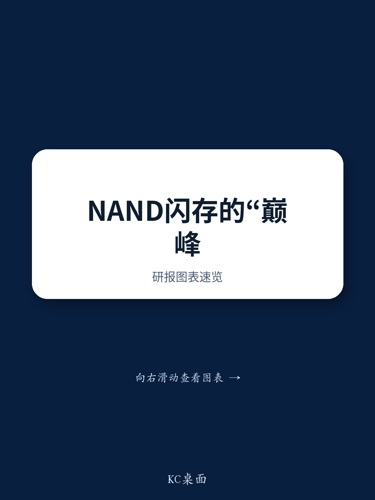
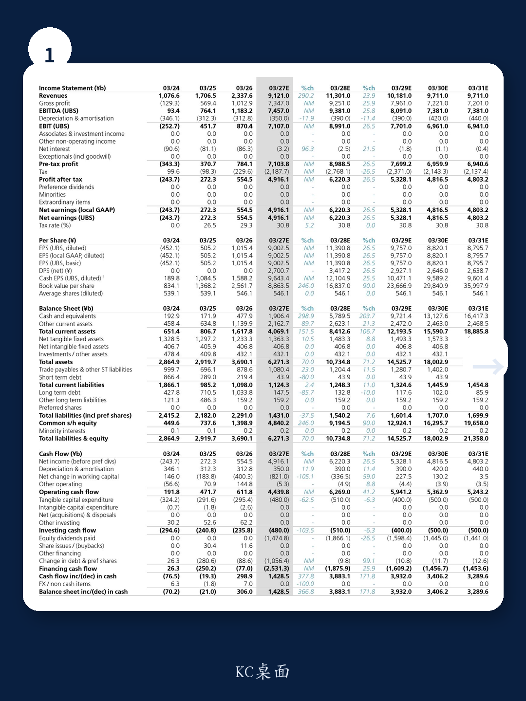
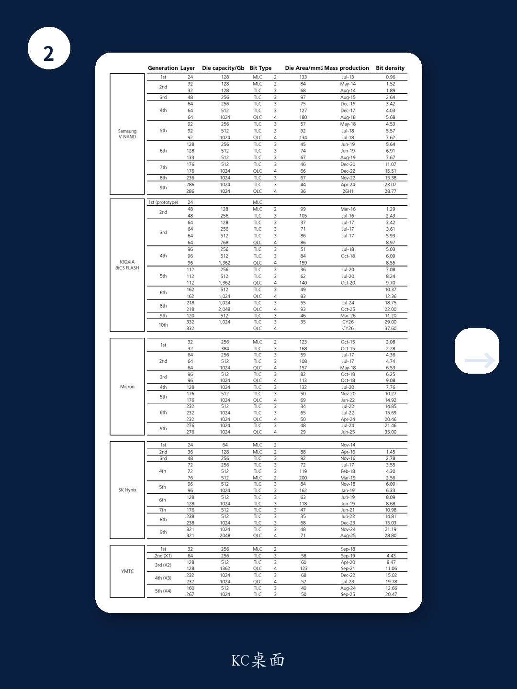

# 市场低估的不是NAND周期，而是Kioxia成本结构的不可复制性

当大多数投资者还在用“层数”和“多级单元”这些表面指标来评判NAND闪存公司的竞争力时，一份最新覆盖报告揭示了一个被系统性低估的核心变量：横向微缩技术带来的成本优势。这份由某外资投行发布的研报，对Kioxia给出了买入评级和79,000日元的目标价，较当前股价有近30%的上行空间。但真正值得关注的不是目标价本身，而是报告提供的分析框架——它挑战了市场对NAND行业竞争格局的普遍认知。

报告的核心判断是：NAND闪存价格将在未来六个季度持续环比上涨，于2027年第三季度见顶。但比这更重要的是，Kioxia通过专注于横向微缩技术，建立了行业内难以复制的单位比特成本优势。这一优势尚未被市场充分定价。换句话说，市场要么低估了这轮周期的强度，要么低估了Kioxia在这轮周期中能赚到多少利润——或者两者兼有。

以下是这份报告最值得推敲的几个层次。

## 1. AI推理正在把NAND从存储介质变成计算系统的一部分，这是结构性的需求迁移

历史上，NAND闪存主要用于PC、智能手机、平板电脑和AI训练数据的存储。但AI推理场景改变了这一格局。当用户与AI模型交互时，聊天历史需要被保留，NAND闪存因此成为计算系统的一部分，其角色类似于DRAM。即使有TurboQuant KV cache这样的压缩技术，总体需求仍在持续攀升。

报告明确指出，AI需求增长不仅惠及NAND公司，也惠及更低层级存储的HDD制造商。而目前，几乎没有NAND或HDD公司预期超大规模云服务商的需求会减速。这意味着需求端的韧性可能比市场预期的更强。

这对投资者的含义是：不要用过去PC时代的NAND周期框架来套用当前市场。AI推理带来的需求增量不是临时补库存，而是系统架构层面的结构性变化。

## 2. 供应端的约束比想象中更紧，供给增长可能在2026-2027年停滞

在需求端持续扩张的同时，供应端出现了罕见的约束。报告指出，同时拥有DRAM和NAND业务的公司，正在优先将产能分配给DRAM（特别是HBM）。这意味着NAND的供应在2026和2027年几乎不会增长。Kioxia自身也表明计划增加资本开支，但晶圆出货量可能反而下降。

这是一个关键的反直觉点：在NAND价格持续上涨的背景下，头部企业却无法或不愿大幅扩产。背后的原因在于，DRAM的资本回报率在当前环境下更具吸引力。这种资源错配进一步收紧了NAND的供需平衡。

报告预测，NAND闪存价格将在未来六个季度环比上涨，于2027年第三季度达到峰值。对于关注周期股的投资者来说，这意味着上行窗口期还有约一年半，而不是市场普遍预期的三到六个月。

## 3. Kioxia的成本优势来自横向微缩，这是一个市场尚未充分理解的竞争力维度

这是整份报告最具洞察力的部分。市场习惯用垂直堆叠层数（如238层、332层）和每单元比特数（如TLC、QLC）来评估NAND公司的竞争力。但报告指出，真正决定盈利能力的指标是“每晶圆比特密度”，而提升这一指标有三种路径：增加垂直层数、增加每单元比特数、以及增强横向比特密度。

前两种路径各公司之间差异不大，因此市场将它们作为竞争指标。但横向微缩技术更为复杂，且与多层化和多级化存在内在冲突——缩小存储孔直径会提高深宽比，使蚀刻难度大幅上升；同时，更小的孔径会导致读取电流降低和变异性增加，使多级控制更加困难。

Kioxia恰恰在这一领域建立了领先优势。报告将其归因于公司从东芝时代积累的高深宽比蚀刻技术——这一技术最初源于沟槽型DRAM的制造。当竞争对手在比拼层数时，Kioxia选择了一条更艰难但成本效率更高的路径。

## 4. 每晶圆制造成本不到竞争对手一半，这是利润率的直接来源

横向微缩技术带来的直接结果是：Kioxia的每晶圆制造成本显著低于同行。报告估算，三星电子每晶圆成本约为4,000美元，美光和SK海力士约为6,000美元，而Kioxia仅为2,000美元左右。这一成本优势直接转化为行业领先的运营利润率。

更值得注意的是，Kioxia在提升比特密度的同时，保持了晶圆制造成本的稳定。这意味着其成本优势不是一次性的，而是系统性的——来自对多层化、多级化和横向微缩三种路径的持续比较和选择，以成本效率为导向。

报告还提到了CBA（CMOS直接键合到阵列）技术，这是Kioxia在BiCS8代开始采用的差异化制造工艺。通过将CMOS和阵列分别制造在不同晶圆上，再用混合键合技术连接，避免了传统CMOS Under Array工艺中热损伤的问题。竞争对手虽然也在跟进，但Kioxia已经率先实现了量产。

## 5. 报告尚未完全回答的关键问题：2027年之后的成本优势能否持续？

尽管报告对Kioxia的中期前景充满信心，但它也坦诚地指出了不确定性。在2027年之后，特别是向BiCS10（332层）乃至400层世代过渡时，横向微缩技术的优势能否维持到同等程度，仍是未知数。

这是一个关键的风险点。横向微缩与多层化之间存在内在冲突，随着层数继续增加，保持横向微缩优势的技术难度将指数级上升。如果Kioxia在下一代产品中被迫在横向微缩和垂直堆叠之间做出更大妥协，其成本优势可能被竞争对手缩小。

此外，报告对AI推理驱动NAND需求的持续性判断，虽然逻辑自洽，但尚未经历完整的下行周期验证。如果AI推理的工作负载模式发生变化，或者出现新的存储架构（如存算一体），NAND在推理场景中的角色可能被重新定义。

## 6. 对决策者的观察框架：三个维度判断Kioxia的估值能否兑现

基于这份报告的分析逻辑，关注Kioxia的投资者可以从以下三个维度建立自己的观察框架：

第一，价格周期的位置。报告预测2027年三季度为价格峰值，这意味着未来一年半是盈利上行的窗口期。需要跟踪的是季度价格环比变化是否与报告预期一致。

第二，成本优势的持续验证。关注横向微缩技术的演进路径，特别是BiCS10及后续世代的技术选择。如果Kioxia在下一代产品中能够同时推进横向微缩和层数增加，其成本优势将得到强化；如果被迫在两者之间取舍，则需要重新评估竞争格局。

第三，产能分配的结构性变化。关注DRAM和NAND之间的资本支出分配。如果HBM需求放缓导致DRAM资本回报率下降，竞争对手可能重新将产能转向NAND，这将改变供应端的紧张格局。

这三个维度叠加起来，可以帮助决策者判断Kioxia的估值是处于周期顶部还是仍有上行空间。报告给出的目标价对应FY3/28的PBR为4.7倍，基于平均ROE 41%和权益成本8.6%的假设。这一估值框架本身也值得推敲——如果ROE无法维持在高位，或者权益成本上升，目标价将面临下调风险。

---

这份报告的分析深度远不止于此。关于Kioxia与西部数据的合资关系如何影响其产能规划、CBA技术的量产良率爬坡过程、以及不同情景下价格弹性的二阶效应，报告中都有更细致的拆解。欢迎来星球微信群里继续讨论完整报告，我们会围绕这些未解问题做进一步推演。

Personal reading notes and learning share only. Not investment advice.

