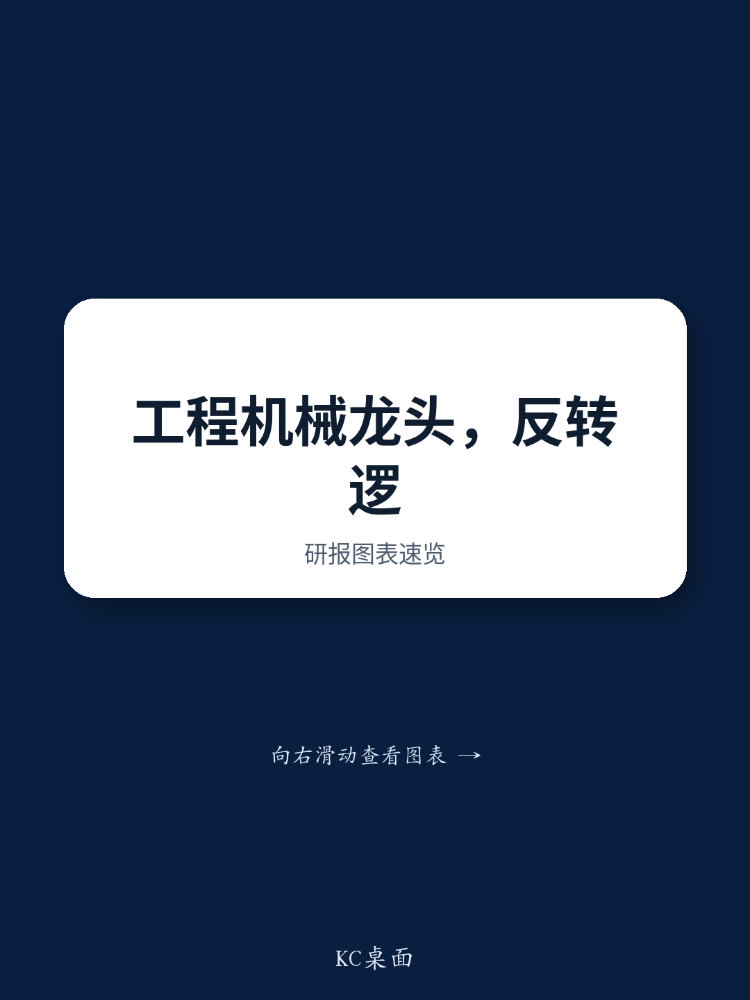
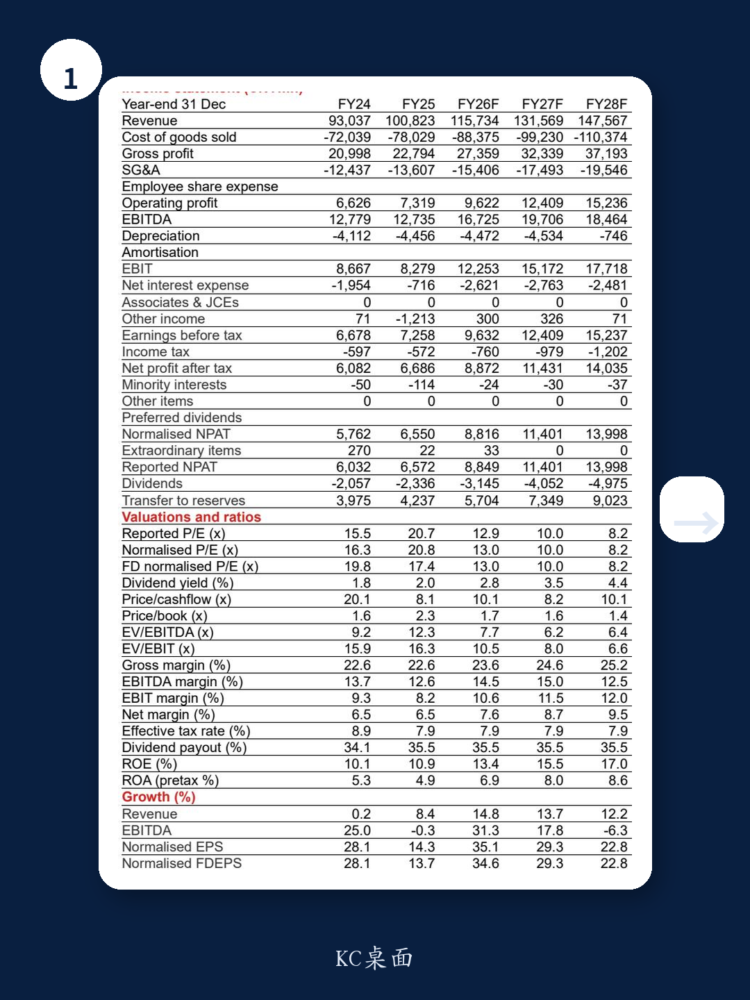
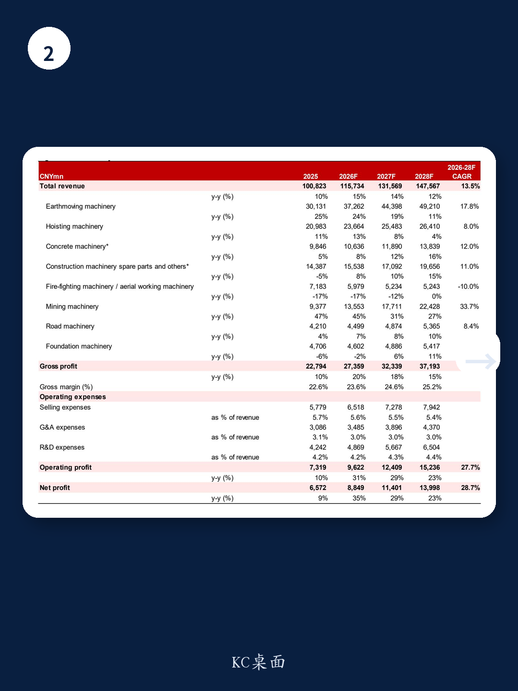

# 市场低估了这家工程机械龙头的“第二增长曲线”

过去一个月，某工程机械龙头股价下跌超过5%，跑输沪深300约7个百分点。市场将这一回调归结为资金偏好转向科技主题，而非基本面恶化。但某外资投行最新发布的深度研报提出了一个相反判断：当前价格不仅反映了悲观情绪的过度定价，更掩盖了两个正在发生的结构性变化——国内行业周期见底回升，以及公司自身正在培育一条足以改写估值逻辑的第二增长曲线。

这份报告的核心主张并非简单的“行业复苏买入”，而是指向一个更具体的投资叙事：当行业beta改善与公司alpha同时出现时，市场对后者的定价仍然不足。在13倍2026年预期市盈率的水平上，这家公司可能是当前周期中最被低估的工程机械资产之一。

## 1. 国内需求并非简单复苏，而是一个由政策、替换与绿色转型构成的“三重底”

报告认为，中国工程机械行业正在从一个以出口为主导的增长阶段，转向由国内周期性复苏与海外持续扩张共同支撑的更加平衡的增长阶段。这一判断的关键在于，国内需求的驱动因素已经不再是单一的地产或基建投资，而是三股力量的叠加。

首先是政策支持。地方政府专项债发行加速、设备更新补贴落地，正在为下游需求提供直接的资金来源。其次是设备替换需求。上一轮工程机械销量高峰在2017-2020年，按照8-10年的使用寿命周期，2025-2027年将迎来替换高峰。第三是电动化与绿色转型。这一趋势不仅带来新产品的溢价空间，还可能改变竞争格局——电动化对制造工艺和供应链管理的要求更高，有利于头部企业进一步集中份额。

这三个因素叠加，意味着国内市场的底部并非一个简单的“V型反弹”，而是一个更可持续的结构性改善。对于投资者而言，真正需要关注的不再是“需求何时见底”，而是“企业能否在需求改善中实现利润弹性”。

## 2. 海外市场才是真正的“长坡厚雪”，但渗透率仍处于早期阶段

报告引用了弗若斯特沙利文的数据：海外市场占全球工程机械销售额的80%以上。然而，中国领先的OEM企业在海外市场的份额，在2024年仅为12%左右。这意味着，即使不考虑国内市场的增长，仅凭海外渗透率的提升，头部企业就拥有足够的成长空间。

但这里需要区分两种不同的海外扩张逻辑。一种是简单的“出口替代”——将国内过剩产能转移到海外，以价格优势获取份额。另一种是“本地化运营”——在目标市场建立销售网络、服务体系甚至生产基地，真正融入当地产业链。报告倾向于认为，某龙头正在从前者向后者过渡。其矿山机械业务的海外布局，以及国企改革对海外收入占比的考核目标，都指向这一方向。

对于投资者来说，海外扩张的质量比速度更重要。如果企业能够通过本地化运营提升毛利率和客户粘性，那么海外业务不仅贡献收入增量，还将成为估值溢价的来源。

## 3. 矿山机械是公司最被低估的业务，可能成为利润弹性的核心来源

报告特别指出，公司内部设定了到2030年矿山机械收入超过400亿元的目标。在当前约1000亿元的总收入体量下，这一目标意味着矿山机械将从目前的一个相对边缘的业务，成长为接近总营收40%的核心板块。

矿山机械与传统的工程机械在客户结构、产品生命周期和毛利率上存在显著差异。矿山客户通常是大型矿业公司，采购决策更看重设备的可靠性和全生命周期成本，而非单纯的初始价格。这意味着，一旦进入供应链，客户粘性极高，且价格竞争压力相对较小。同时，矿山机械的毛利率通常高于传统工程机械，因此其收入占比的提升将直接拉高公司整体毛利率。

报告预计，公司毛利率将从2025年的22.6%提升至2028年的25.2%。如果矿山机械业务如期放量，这一预测可能仍然偏保守。但这里有一个关键假设需要验证：公司能否在矿山机械领域建立起与卡特彼勒、小松等全球巨头相匹敌的技术和品牌壁垒？报告没有完全展开，但这恰恰是未来几年最值得跟踪的核心变量。

## 4. 国企改革可能是被市场忽略的“催化剂”，而非“背景板”

报告将国企改革视为公司运营质量改善的重要驱动力。具体路径包括：混合所有制改革与战略投资者引入、集团层面上市、股权激励。这一系列动作的核心目的，是将管理层和股东的利益绑定在一起。

更具体的信号是，公司已设定了明确的ROE和经营现金流目标。这意味着，管理层不再仅仅追求规模增长，而是开始关注资本回报效率。报告预计，公司ROE将从2025年的10.9%提升至2028年的17.0%。如果这一目标能够实现，公司的估值中枢将面临系统性的上移。

但国企改革的效果往往需要较长时间才能体现在财务数据中。市场对此类主题的定价通常是脉冲式的——公告时上涨，执行期却缺乏持续关注。真正的检验点在于，未来几个季度的经营现金流和ROE数据是否能够持续超预期。

## 5. 报告尚未完全回答的三个关键问题

尽管这份报告提供了清晰的分析框架和有力的数据支撑，但仍有几个关键问题需要进一步探讨。

第一个问题是估值锚的合理性。报告采用18倍2026年预期市盈率作为估值基准，并认为这与行业均值大致持平。但考虑到矿山机械业务的潜在利润贡献和国企改革带来的运营效率提升，这一估值倍数是否应该享有溢价？报告没有给出明确的判断。

第二个问题是矿山机械的竞争格局。中国企业在矿山机械领域的全球份额仍然很低，突破需要时间。公司能否在2030年实现400亿元的收入目标，取决于其在大型矿用挖掘机、破碎筛分设备等关键产品线上的技术突破和客户认证进度。这些细节在报告中并未充分展开。

第三个问题是海外扩张的地缘政治风险。报告提到了海外运营风险，但没有深入分析不同区域的差异化风险敞口。例如，公司在东南亚、非洲、南美和中东市场的竞争环境、政策风险和汇率风险存在显著差异，这些因素将直接影响海外业务的盈利质量。

## 6. 投资者的观察框架：从“周期股”到“成长股”的定价切换

综合报告的核心逻辑，投资者可以建立一个简单的观察框架：如果国内行业beta改善和公司alpha同时兑现，市场对这家公司的定价逻辑将从“周期股”切换为“成长股”。

周期股的定价核心是供需关系和价格弹性，估值中枢通常在10-15倍市盈率。成长股的定价核心是收入增长可持续性和利润率的趋势性改善，估值中枢可以上移至20-25倍。报告给出的18倍目标估值，实际上已经隐含了这种切换的初步预期。

但切换能否完成，取决于三个可验证的指标：一是矿山机械业务的收入增速和毛利率是否持续高于公司整体水平；二是海外收入占比是否稳步提升，且海外业务的毛利率是否高于国内；三是ROE是否能持续改善，并带动自由现金流增长。

如果这三个指标在未来2-3个季度内得到验证，当前13倍的市盈率水平将构成一个有吸引力的安全边际。反之，如果矿山机械业务进展不及预期，或者海外扩张因地缘政治因素受阻，市场可能会重新将公司视为纯粹的周期股，估值中枢将难以突破。

---

上述分析仅基于这份研报的公开逻辑。报告中还有更多关于财务模型假设、分业务收入预测、竞争格局拆解以及风险情景分析的细节，这些内容对于判断上述关键问题的答案至关重要。如果你希望进一步讨论这些未解问题，或者获取完整的报告原文和原始图表，欢迎来我们的星球微信群继续交流。

Personal reading notes and learning share only. Not investment advice.

