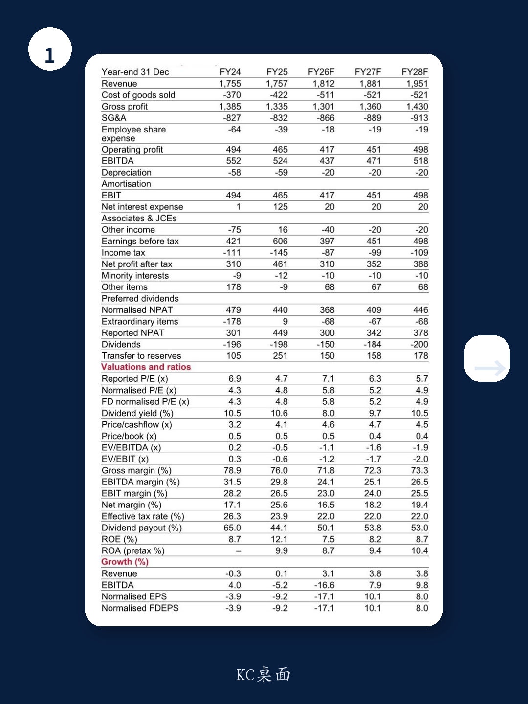
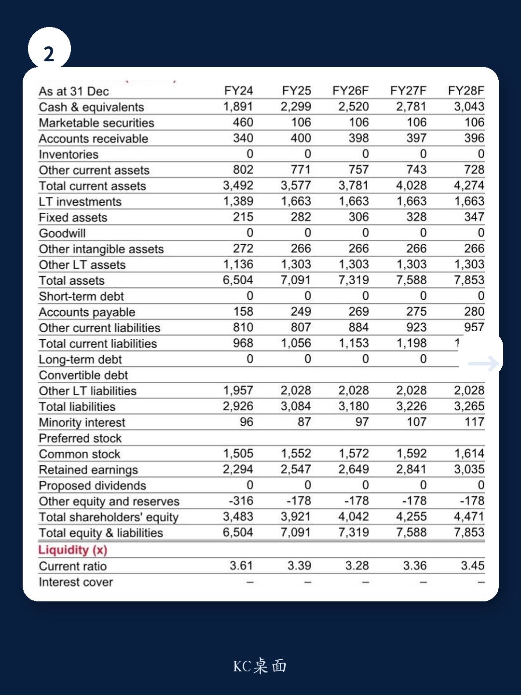

# 微博的利润压力不是周期性的，而是结构性的

当一家公司的一季度营收超预期、利润也高于市场共识时，股价却在随后被下调目标价，这通常意味着市场看到了更长期的问题。某外资投行在最新研报中将微博目标价从9.7美元下调至8.1美元，维持中性评级。表面看，这是一次常规的业绩后调整，但拆开数字背后的逻辑，你会发现一个更值得警惕的信号：微博正在同时承受收入端放缓与成本端扩张的双重挤压，而这两股力量都不是短期能逆转的。

报告的核心判断并不复杂：广告大盘在变差，而微博的AI投入才刚刚开始。但真正值得深读的，是这家投行如何用财务模型量化了这种“两头受压”的局面——营收增速预期从9%砍到3%，利润率同步收缩近5个百分点。这不是一个简单的“等风来”就能解决的问题。

## 1. 广告收入放缓的根源不是宏观，而是客户结构正在恶化

大多数投资者会把微博的广告疲软归因于整体消费环境，但报告给出的信号更具体。管理层在电话会上明确表示，汽车广告依然有增长，AI相关行业的预算也在积极争取。真正拖后腿的，是智能手机和在线游戏两个主力板块。

智能手机的广告预算下滑，不是因为用户不换手机，而是因为新机发布节奏被定价压力打乱。换句话说，手机厂商自己也在算账，营销预算成了最先被挤压的弹性成本。在线游戏则更直接——大厂新游戏上线数量减少，意味着买量需求下降。这两个板块曾经是微博广告收入的重要支柱，现在同时转弱，这不是宏观经济能解释的，而是客户自身行业周期的共振。

这意味着，即使中国消费数据回暖，微博的广告收入修复也可能滞后于大盘。因为它的核心客户群正处在自己的下行周期里，而不是单纯跟着GDP走。

## 2. 利润率的下滑并非一次性，而是被AI投入“锁死”了

报告中最值得关注的一组数字是利润率预测。2026财年非GAAP营业利润率预计从29.8%收缩至25%，下降4.8个百分点。这个幅度，比营收增速的下修更值得警惕。

原因在于，AI投入不是可选项，而是必选项。管理层提到，AI工具（包括内容创作、视频生成、搜索功能）正处于“部署阶段”，内部token消耗已经显著增长，但货币化仍处于早期。这句话的潜台词是：成本已经在发生，但收入贡献还看不到时间表。

更关键的是，这种投入是持续的。AI模型训练和推理的成本不会因为“部署完成”就消失，反而可能随着用户使用量的增加而继续上升。这与传统互联网公司的边际成本递减逻辑完全不同。微博正在从一个“轻资产、高毛利”的社交平台，向一个“重算力、高折旧”的AI应用公司转型，而资本市场目前还没有给它重新定价。

## 3. 6倍PE的估值锚点，隐含了市场对增长质量的不信任

报告维持6倍2026财年PE的估值倍数，目标价对应8.1美元。这个倍数本身并不极端——中国互联网公司普遍处于低估值区间。但值得注意的是，这个估值倍数并没有因为AI概念而被上调。

对比来看，报告在结尾处明确表示更偏好阿里巴巴，理由是“更扎实的基本面和在中国AI领域更强的地位”。这句话的潜台词是：市场愿意为AI故事买单，但前提是你能证明自己有足够的技术护城河和商业化路径。微博的AI投入目前更多是防守性的——为了不让用户流向更智能的平台，而不是进攻性地开辟新收入曲线。这种“防御性投入”在估值上通常得不到溢价。

当前微博的交易价格是5.8倍PE，几乎与目标价所隐含的6倍完全重合。市场已经把“没有惊喜”定价进去了，但“会不会有惊吓”才是接下来需要判断的问题。

## 4. 报告尚未完全回答的关键问题：AI货币化的拐点在哪里

研报对AI部分的讨论相对克制，这其实是一个信号——分析师自己也没有找到清晰的货币化路径。管理层提到“货币化仍处于早期”，但早期到什么程度？是季度内有望看到收入贡献，还是需要12-18个月？

另一个被轻描淡写的问题是：微博的AI能力与字节跳动、快手、小红书等平台的AI能力相比，是否有差异化优势？如果只是“别人有的我也要有”，那这笔投入的ROI就会非常难看。报告没有展开竞争格局分析，但这个问题恰恰是决定微博能否从“中性”走向“买入”的核心变量。

## 5. 投资者需要关注的三个观察指标

基于报告的框架，可以提炼出三个关键跟踪指标，帮助判断微博的基本面是否正在触底反弹。

第一个是广告主结构的变化。如果智能手机和游戏两大板块的广告收入占比持续下降，而AI、汽车等新板块的增量无法弥补缺口，那么营收增速的下修可能还没到底。第二个是AI投入的资本化比例。如果微博能将部分AI开发支出资本化，而不是全部计入当期费用，利润率压力会有所缓解。这一点需要在后续财报中仔细拆解。第三个是用户端数据——AI工具是否带来了用户时长或互动频率的提升。如果投入只停留在成本端，而没有转化为用户行为数据的变化，那就很难说服市场这是一笔有价值的投资。

这三个指标，比单季度营收是否超预期更能反映微博的真实走向。

---

以上分析基于公开研报的解读，但完整的财务模型、分业务收入拆分以及竞争格局对比，无法在一篇文章中完全展开。如果你对微博的AI投入节奏、广告客户结构变化的具体数据，或者与同行的估值对比感兴趣，欢迎来我们的社群继续讨论。我们会把研报的原始图表和更细致的拆解放在群里，供大家深入参考。

Personal reading notes and learning share only. Not investment advice.

