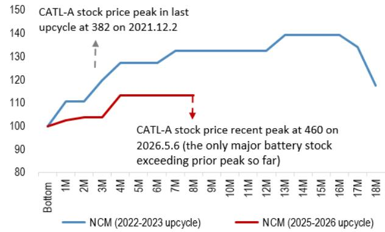
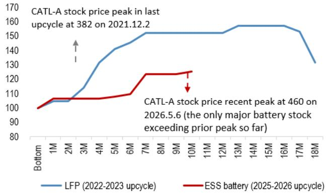
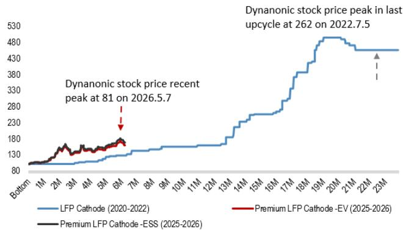
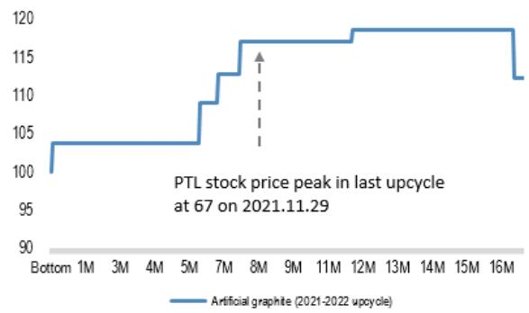
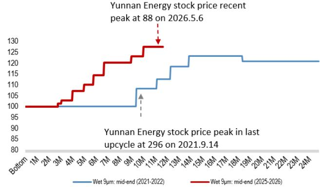
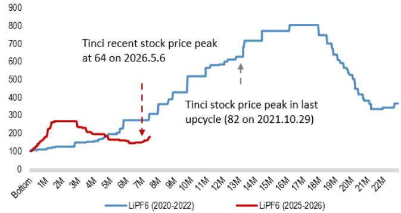
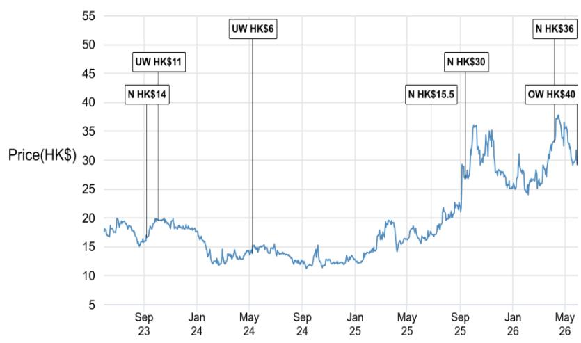
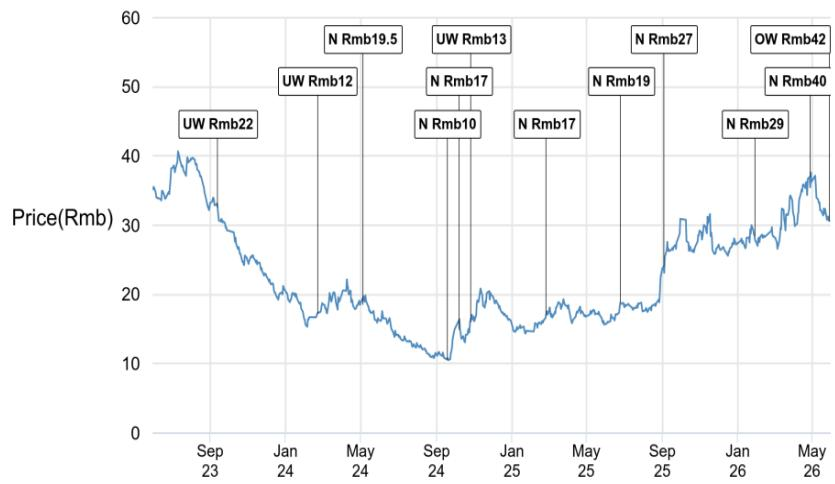
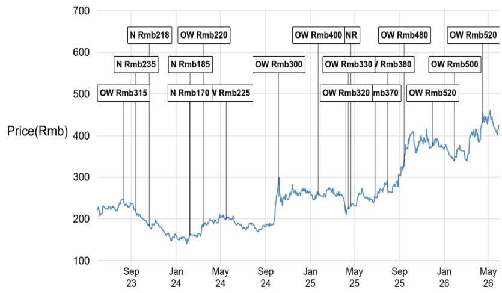
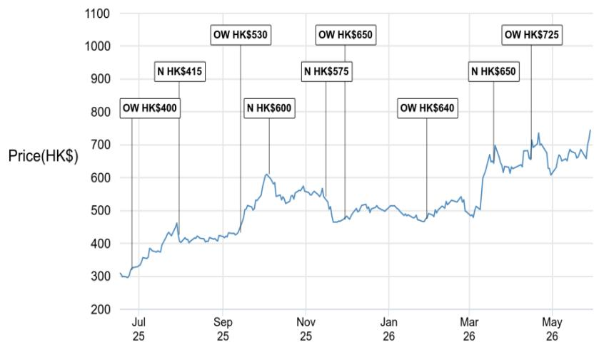

This material is neither intended to be distributed to Mainland China investors nor to provide securities investment consultancy services within the territory of Mainland China. This material or any portion hereof may not be reprinted, sold or redistributed without the written consent of J.P. Morgan.

# China Battery & Materials

Two Battery Cycles: Lessons learned and investment strategy for 2H26-2027

We published a comprehensive 100-page deep-dive on 30 May, analyzing the China battery sector's two major upcycles. The China battery sector is transitioning from the 2021-22 supercycle – driven by price hikes and aggressive expansion – to a more selective recovery phase. In this cycle, we recommend investors shift focus from ‘price hike expectations’ to ‘volume-led cashflow and earnings delivery’. We advocate a range-bound trading approach for material and tier-2 battery makers: buy on weakness, take profit when expectations become crowded. In our 30-May report, we tactically upgraded CALB and Putailai to Overweight on attractive valuations (12-14x) and >40% volume-driven earnings growth for 2027E, without relying on price or unit profit increases. CATL remains our top pick and core holding, given its unmatched record of stable, through-cycle earnings growth – the sector’s only true compounder.

- 2021-22 supercycle vs 2025-current recovery cycle: The 2021-22 battery cycle was a true supercycle, driven by near-zero interest rates, rapid China EV penetration, aggressive capacity expansion, strong fund flows, and extreme raw-material price inflation. By contrast, the current cycle is more of a recovery cycle: demand is more diversified across EV and ESS, industry participants are more disciplined on capacity, ASP recovery is meaningful but far smaller than the last cycle, and valuations remain much lower. As a result, we believe the current cycle is less likely to deliver a broad one-way sector rerating and more likely to reward companies with sustainable earnings growth, strong utilization, and cash-flow resilience.   
- Lessons learned from the last cycle: Stock prices peaked well ahead of ASP or earnings highs, as the market rapidly prices in expectations of future price increases. For example, Yunnan Energy's share price reached its peak in Sep-Oct 2021, preceding or coinciding with the initial rebound in industry separator selling prices from their trough.   
- Investment focus likely to shift from ASP recovery to profit delivery. In the current battery cycle, we see the investment focus shifting from ASP recovery to volume-led earnings durability. The first phase of the rally from 2H25 to early 2026 was driven largely by a selling-price recovery across batteries and materials. However, with price recovery now increasingly embedded in market expectations and industry players starting to accelerate capacity expansion again, the next phase of equity performance is likely to be more selective, in our view. We expect investors to focus less on further ASP upside and more on whether companies can deliver stable cashflow and profit growth through volume.

# Asia Autos & EV Battery

Rebecca Wen AC

(852) 2800-8505

rebecca.y.wen@jpmorgan.com

J.P. Morgan Securities (Asia Pacific) Limited/

J.P. Morgan Broking (Hong Kong) Limited

Cathy Liu

(852) 2800-8629

cathy.xiao.liu@jpmorgan.com

J.P. Morgan Securities (Asia Pacific) Limited/

J.P. Morgan Broking (Hong Kong) Limited

Shirley Feng

(86-21) 6106-6149

shirley.x.feng@jpmorgan.com

SAC Registration Number: S1730524040001

J.P. Morgan Securities (China) Company

Limited

\- Range-bound trading in 2H26-1H27. This argues for a more range-bound trading approach for material names and tier-2 battery makers. In 2025, LFP cathode names such as Hunan Yuneng worked well as price-recovery trades, followed by separator names such as Yunnan Energy in 1H26 as ASP recovery and utilization improvement became more visible. Going forward, however, we would be more disciplined in buying these names on weakness and taking profit when expectations become crowded, especially where earnings recovery depends on further price increases or processing-fee expansion. For lower-valuation laggards, such as Putailai or selected tier-2 battery makers such as CALB, the opportunity may come from volume growth and operating leverage rather than ASP beta, but these should still be treated as cyclical trades rather than long-duration compounders, in our view.

\- CATL the only core holding that can exhibit outperformance through cycles. By contrast, we believe CATL remains the core long-term holding in the sector. It is the only major battery supply-chain company that has demonstrated stable and solid earnings growth through the cycle, supported by scale, technology leadership, stronger bargaining power, stable unit profitability and superior cash-flow generation. While materials and tier-2 battery names may offer better tactical upside at certain points in the cycle, their earnings are more sensitive to pricing, utilization and capacity expectations. CATL, in our view, deserves to be held through the cycle as the sector's quality anchor, while the rest of the supply chain should be traded more actively around valuation, ASP expectations and EPS revision momentum.

# Battery & materials ASP index in the two cycles vs stock price peak time (ASP bottom prices index to 100)

Figure 1: NCM Battery: Price Index vs. No. of months of price increase in the two upcycles (2022-2023 vs. 2025-now)   

line

| Month | NCM (2022-2023 upcycle) | NCM (2025-2026 upcycle) |
|-------|--------------------------|--------------------------|
| Bottom | 100 | 100 |
| 1M | 110 | 105 |
| 2M | 115 | 108 |
| 3M | 125 | 110 |
| 4M | 130 | 115 |
| 5M | 132 | 115 |
| 6M | 133 | 115 |
| 7M | 135 | 115 |
| 8M | 138 | 115 |
| 9M | 138 | 115 |
| 10M | 138 | 115 |
| 11M | 138 | 115 |
| 12M | 138 | 115 |
| 13M | 140 | 115 |
| 14M | 140 | 115 |
| 15M | 140 | 115 |
| 16M | 140 | 115 |
| 17M | 135 | 110 |
| 18M | 120 | 100 |

Source: ICCSino, J.P. Morgan.

Figure 2: LFP Battery: Price Index vs. No. of months of price increase in the two upcycles (2022-2023 vs. 2025-now)   

line

| Date | LFP (2022-2023 upcycle) | ESS battery (2025-2026 upcycle) |
|------|--------------------------|----------------------------------|
| 1M   | ~100                     | ~100                             |
| 2M   | ~105                     | ~105                             |
| 3M   | ~115                     | ~105                             |
| 4M   | ~130                     | ~105                             |
| 5M   | ~140                     | ~105                             |
| 6M   | ~145                     | ~105                             |
| 7M   | ~150                     | ~110                             |
| 8M   | ~150                     | ~115                             |
| 9M   | ~150                     | ~115                             |
| 10M  | ~150                     | ~120                             |
| 11M  | ~150                     | ~120                             |
| 12M  | ~150                     | ~120                             |
| 13M  | ~155                     | ~120                             |
| 14M  | ~155                     | ~120                             |
| 15M  | ~155                     | ~120                             |
| 16M  | ~155                     | ~120                             |
| 17M  | ~150                     | ~120                             |
| 18M  | ~130                     | ~120                             |

Source: ICCSino, J.P. Morgan.

Figure 3: LFP Cathode: Price Index vs. No. of months of price increase in the two upcycles (2020-2022 vs. 2025-now)   

line

| Date       | LFP Cathode (2020-2022) | Premium LFP Cathode - EV (2025-2026) |
| ---------- | ------------------------ | ------------------------------------ |
| 2026.5.7   | 81                       | 180                                  |
| 2022.7.5   | 462                      | -                                    |

Source: ICCSino, J.P. Morgan.

Figure 4: Artificial graphite anode: Price Index vs. No. of months of price increase in the last upcycle (2021-2022), no price hikes yet in 2025-26   

line

| Date       | Stock Price |
| ---------- | ----------- |
| 2021.11.29 | 67          |

Source: ICCSino, J.P. Morgan.

Figure 5: Separator: Price Index vs. No. of months of price increase in the two upcycles (2021-2022 vs. 2025-now)   

line

| Date       | Wet 9μm: mid-end (2021-2022) | Wet 9μm: mid-end (2025-2026) |
| ---------- | ---------------------------- | ---------------------------- |
| 1M         | 100                          | 100                          |
| 2M         | 100                          | 100                          |
| 3M         | 100                          | 100                          |
| 4M         | 100                          | 100                          |
| 5M         | 100                          | 100                          |
| 6M         | 100                          | 100                          |
| 7M         | 100                          | 100                          |
| 8M         | 100                          | 100                          |
| 9M         | 100                          | 100                          |
| 10M        | 108                          | 108                          |
| 11M        | 115                          | 128                          |
| 12M        | 120                          | 130                          |
| 13M        | 125                          | 130                          |
| 14M        | 125                          | 130                          |
| 15M        | 125                          | 130                          |
| 16M        | 125                          | 130                          |
| 17M        | 125                          | 130                          |
| 18M        | 125                          | 130                          |
| 19M        | 125                          | 130                          |
| 20M        | 125                          | 130                          |
| 21M        | 125                          | 130                          |
| 22M        | 125                          | 130                          |
| 23M        | 125                          | 130                          |
| 24M        | 125                          | 130                          |

Source: ICCSino, J.P. Morgan.

Figure 6: LiPF6: Price Index vs. No. of months of price increase in the two upcycles (2020-2022 vs. 2025-now)   

line

| Date       | LiPF6 (2020-2022) | LiPF6 (2025-2026) |
| ---------- | ----------------- | ----------------- |
| 2026.5.6   | 64                | -                 |
| 8/21.10.29 | -                 | -                 |

Source: ICCSino, J.P. Morgan.

# The two battery cycles: Similarities, differences, and valuation implications

# 2021-22 supercycle vs. 2025-current recovery cycle

Table 3 compares the 2021-22 battery supercycle with the 2025-current recovery cycle, and we believe the current cycle should not be valued as a simple repeat of the last one. The 2021-22 cycle was driven by a powerful combination of near-zero global interest rates, rapid rise in EV penetration, aggressive capacity expansion, large capital inflows, and extreme raw-material price inflation. By contrast, the 2025-current cycle is supported by recovering utilization, more diversified demand drivers, and renewed pricing momentum, but it is occurring in a relatively more disciplined capital-market and industry environment. In the last cycle, battery stocks peaked in 2H21 at roughly 40-80x 2022E P/E; in the current cycle, only CATL amongst the top players have exceeded prior share-price peaks, while most remain 30-80% below their 2021 highs and trade mostly at 15-25x 2027E P/E.

# Demand drivers: Single factor in 2022 vs multiple drivers in 2026

Demand is also structurally different. The 2021-22 cycle was mainly driven by China passenger-vehicle EV demand which contributed to \~45% of the demand mix in 2022. In 2026, demand is more diversified, with China passenger EV now only contributing to 24% of total mix and ESS overall is expected to make up >40% of demand (up from <20% in 2022). The importance of EU/EV exports and China commercial EV also increased. This diversification is positive for earnings resilience because the sector is no longer dependent on a single China PV EV adoption curve. However, it also means the investment narrative is less simple and less powerful than the last cycle's “EV penetration explosion” story. The current cycle is more about multiple demand engines – EV, commercial vehicles, China ESS, and overseas ESS – rather than one dominant driver.

# Policy changes: multiple policy to watch out for

Policy support has also changed in character. In the last cycle, China EV subsidies were only phased out from January 2023. In the current cycle, there may be several policy changes: China EV trade-in subsidies were lowered from January 2026, purchase-tax subsidies were halved for passenger and commercial vehicles, battery export rebates are being reduced, and there is a potential battery consumption-tax increase under discussion. At the same time, nationwide ESS subsidies were clarified in early 2026, but China's ESS target is set for 2027, raising the risk of a potential decline in ESS installations in 2028, which could translate into battery-shipment pressure in 2027. This suggests that investors should watch not only near-term demand strength but also the durability of 2027-28 growth.

# Government attitude on capacity expansion: from encouragement to disciplined

On the supply side, the contrast is equally important. During 2021-22, local governments actively encouraged NEV and battery capacity expansion with subsidies and support. In the current cycle, central-government scrutiny has increased under broader “anti-involution” and fair-competition policies aimed at curbing irrational price competition, overcapacity, and preferential local support. Local governments also have less fiscal bandwidth to provide direct subsidies, although they may still support strategic players indirectly through equity investments, industrial funds, or government-backed consolidation vehicles. This creates a more disciplined supply environment, but it does not eliminate overcapacity risk. Current capacity expansion is more concentrated among tier-1 and tier-2 players, with fewer new entrants, improved capex efficiency, and shorter capacity lead times.

# Capital raising: more concentrated at battery makers, particularly CATL

Capital raising also shows a different pattern. In 2021-22, A/H placements, IPOs, and GDR issuance totaled around Rmb150bn from top industry players, with roughly half raised by battery makers and around 20% by upstream raw-material companies. In the current cycle, H-share IPOs and A/H-share placements have already raised more than Rmb105bn, but around 80% of the capital has come from battery makers, with very little from upstream raw-material suppliers. This reinforces the idea that bargaining power and investment focus have shifted toward battery cell makers, especially those with scale, utilization, technology, and cash-flow advantages. For example, CATL has raised Rmb77bn in this cycle, representing around 70% of total capital raised across the supply chain so far. This compares with Rmb45bn in the previous cycle, or roughly 30% of the total.

# ASP gains are milder, with prices still 40–80% below the prior peak

Pricing behavior is another major difference. The last cycle saw extreme inflation in upstream and midstream materials: lithium carbonate rose by more than 1,300%, LiPF6 by more than 670%, LFP cathode by more than 390%, and LFP cathode processing fees by more than 70%. In the current cycle, price increases are meaningful but much smaller: lithium carbonate is up more than 130% from the 2H25 bottom, LiPF6 is up 97%, LFP cathode is up more than 80%, but cathode processing fees are up only 16%; wet separator is up 28%, while graphite anode has seen no price upcycle. Importantly, the latest prices are still 40-80% below the last-cycle peak, which limits the case for simply extrapolating 2022 peak earnings into the current cycle.

# Profit distribution shifts from resources to downstream; CATL stands out as the only through-cycle winner

Profit distribution has shifted from upstream/resource-led earnings in the last cycle to battery-cell-led earnings in the current cycle. In the 2021-22 supercycle, the most dramatic profit pool expansion was concentrated in upstream raw materials, especially lithium, as shown by Ganfeng-A's peak quarterly net profit of Rmb6.1bn in 4Q22, far above most midstream material and battery makers. By contrast, in the current cycle, most supply-chain companies are still meaningfully below their last-cycle profit peaks by $20 - 80\%$ . Only select names have recovered to or surpassed prior peak profitability. More importantly, CATL stands out as the only major name that delivered stable and growing earnings through the cycle, highlighting that industry profit distribution has shifted toward leading battery cell makers with scale, utilization, bargaining power, and stronger cash-flow resilience.

# Market concentration ratio declined

Battery and materials industry concentration has generally declined versus the last cycle, suggesting that pricing power is more fragmented despite improving utilization. The most notably declined are in wet separator (CR3 and CR5 ratio reduced by 10ppt/15ppt), and to a lesser extent in EV/ESS batteries. Overall, although the current cycle has fewer new entrants and more disciplined capacity expansion, lower concentration in several segments means investors should be selective and focus on companies with real cost, technology, customer, and utilization advantages rather than assuming broad-based pricing power across the supply chain.

# PE expansion in 2021-22 vs. earnings recovery in 2025-26

The macro backdrop is one of the most important differences. In 2021, Fed funds were still near zero at around $0.25\%$ , supporting long-duration growth assets and allowing investors to pay high multiples for battery supply-chain growth. In the current cycle, Fed funds are around $3.75\%$ , and while J.P. Morgan expects the first rate hike only in 3Q27, market pricing has begun to reflect a higher probability of an earlier move by late 2026 or early 2027. This matters because the current cycle has less room for broad multiple expansion than the 2021-22 period, in our view. Equity performance is therefore likely to depend more on earnings upgrades, utilization, and cash-flow quality rather than on a return to the prior cycle's valuation extremes.

# Sustained EPS recovery more important than multiple expansion in this cycle

We believe the valuation implication is clear: the 2025-current cycle should be valued as a selective recovery cycle, not a repeat of the 2021-22 supercycle. Demand is healthier and more diversified, utilization has improved, and pricing has recovered, but valuation ceilings should be lower because interest rates are higher, investors are more cautious, capacity lead times are shorter, and customers are tougher in negotiations. We believe the right approach is therefore to reward companies with sustained utilization, stable unit profitability, stronger cash flow, and better bargaining power – such as leading battery cell makers and selectively positioned material suppliers – while applying more conservative multiples to segments where price increases do not translate into durable margin recovery.

Table 1: Battery and material prices in 2020-2023 cycles 

<table><tr><td colspan="2"></td><td colspan="7">Last upcycle in 2020-2023</td></tr><tr><td></td><td>Unit</td><td>Bottom Time</td><td>Bottom Price</td><td>Peak Time</td><td>Cycle last (No of Months)</td><td>Peak Price</td><td>Absolute ASP changes</td><td>% ASP changes</td></tr><tr><td colspan="9">Battery cell</td></tr><tr><td>NCM Battery</td><td>Rmb/Wh</td><td>2021.9</td><td>0.66</td><td>2023.2</td><td>16M</td><td>0.92</td><td>0.26</td><td>39%</td></tr><tr><td>LFP Battery</td><td>Rmb/Wh</td><td>2021.9</td><td>0.53</td><td>2023.2</td><td>16M</td><td>0.83</td><td>0.30</td><td>57%</td></tr><tr><td colspan="9">Battery material</td></tr><tr><td>LFP cathode</td><td>Rmb/t</td><td>2020.11</td><td>34,000</td><td>2022.4</td><td>17M</td><td>168,000</td><td>134,000</td><td>394%</td></tr><tr><td>LFP cathode processing</td><td>Rmb/t</td><td>2020.11</td><td>~21,000</td><td>2022.3</td><td>16M</td><td>~37,000</td><td>16,000</td><td>76%</td></tr><tr><td>Artificial graphite anode</td><td>Rmb/t</td><td>2021.4- 2021.9</td><td>52,500</td><td>2022.4-2022.9</td><td>12M</td><td>62,300</td><td>9,800</td><td>19%</td></tr><tr><td>Wet separator</td><td> $Rmb/m^2$ </td><td>2020.9-2021.10</td><td>1.20</td><td>2022.4-2022.9</td><td>11M</td><td>1.48</td><td>0.28</td><td>23%</td></tr><tr><td colspan="9">Raw material</td></tr><tr><td>Lithium carbonate</td><td>Rmb/t</td><td>2020.8</td><td>39,500</td><td>2023.2</td><td>27M</td><td>591,000</td><td>551,500</td><td>1396%</td></tr><tr><td>LiPF6</td><td>Rmb/t</td><td>2020.9</td><td>76,500</td><td>2022.3</td><td>14M</td><td>590,000</td><td>513,500</td><td>671%</td></tr><tr><td colspan="9">Battery equipment</td></tr><tr><td>Wuxi Lead new order</td><td>Rmb mn</td><td></td><td></td><td>2Q2022</td><td></td><td>11,000</td><td></td><td></td></tr></table>

Source: J.P. Morgan, Wind, ICCSino

Table 2: Battery and material prices in 2025-2026 cycles 

<table><tr><td colspan="2"></td><td colspan="10">Current cycle in 2025-2026</td></tr><tr><td></td><td>Unit</td><td>Bottom Time</td><td>Bottom Price</td><td>Latest Price</td><td>Absolute changes so far</td><td>% ASP changes so far</td><td>Latest vs. last peak</td><td>Recent peak time</td><td>Recent peak price</td><td>Absolute changes to peak</td><td>% ASP changes to peak</td></tr><tr><td colspan="12">Battery cell</td></tr><tr><td>NCM Battery</td><td>Rmb/Wh</td><td>2025.9</td><td>0.51</td><td>0.55</td><td>0.04</td><td>8%</td><td>-40%</td><td></td><td></td><td></td><td></td></tr><tr><td>LFP Battery</td><td>Rmb/Wh</td><td>2025.6</td><td>0.35</td><td>0.41</td><td>0.06</td><td>17%</td><td>-51%</td><td></td><td></td><td></td><td></td></tr><tr><td>ESS Battery</td><td>Rmb/Wh</td><td>2025.4</td><td>0.31</td><td>0.37</td><td>0.06</td><td>20%</td><td>-</td><td></td><td></td><td></td><td></td></tr><tr><td colspan="12">Battery material</td></tr><tr><td>LFP cathode</td><td>Rmb/t</td><td>2025.11</td><td>35,250</td><td>64,510</td><td>29,260</td><td>83%</td><td>-62%</td><td></td><td></td><td></td><td></td></tr><tr><td>LFP processing</td><td>Rmb/t</td><td>2025.9</td><td>~15,400</td><td>~17,820</td><td>2,420</td><td>16%</td><td>-52%</td><td></td><td></td><td></td><td></td></tr><tr><td>Artificial graphite</td><td>Rmb/t</td><td>No upcycle</td><td></td><td>38,800</td><td>-</td><td></td><td>-38%</td><td></td><td></td><td></td><td></td></tr><tr><td>Wet separator</td><td> $Rmb/m^2$ </td><td>2025.6-2025.9</td><td>0.69</td><td>0.88</td><td>0.19</td><td>28%</td><td>-41%</td><td></td><td></td><td></td><td></td></tr><tr><td colspan="12">Raw material</td></tr><tr><td>Lithium carbonate</td><td>Rmb/t</td><td>2025.10</td><td>76,500</td><td>178,500</td><td>102,000</td><td>133%</td><td>-70%</td><td>2026.5.12</td><td>198,500</td><td>122,000</td><td>159%</td></tr><tr><td>LiPF6</td><td>Rmb/t</td><td>2025.10</td><td>61,000</td><td>120,000</td><td>59,000</td><td>97%</td><td>-80%</td><td>2026.1.4</td><td>180,000</td><td>119,000</td><td>195%</td></tr><tr><td colspan="12">Equipment</td></tr><tr><td>Wuxi Lead new order</td><td>Rmb mn</td><td>4Q2025</td><td>1,500</td><td>9,600</td><td>8,100</td><td>540%</td><td>-13%</td><td></td><td></td><td></td><td></td></tr></table>

Source: J.P. Morgan, Wind, ICCSino

Table 3: Battery supply chain profit peak in the last cycle and first estimate cuts 

<table><tr><td rowspan="2">Representative stock</td><td colspan="3">Last cycle</td><td colspan="3">Current cycle</td></tr><tr><td>Profit peak quarter</td><td>NP at peak (Rmb mn)</td><td>First estimate cut</td><td>1Q26 NP (Rmb mn)</td><td>1Q26 vs last peak in NP</td><td>Latest estimate cut from peak</td></tr><tr><td>Battery</td><td></td><td></td><td></td><td></td><td></td><td></td></tr><tr><td>CATL</td><td colspan="2">Profits continued to increase through cycle</td><td>Apr-22</td><td>18,094</td><td></td><td>May-26</td></tr><tr><td>EVE</td><td>3Q22</td><td>1,363</td><td>Oct-21</td><td>1,160</td><td>-15%</td><td>Jan-26</td></tr><tr><td>Materials</td><td></td><td></td><td></td><td></td><td></td><td></td></tr><tr><td>Dynanonic</td><td>1Q22</td><td>760</td><td>Aug-22</td><td>265</td><td>-65%</td><td>n/a</td></tr><tr><td>Hunan Yuneng</td><td>1Q22</td><td>1,006</td><td>-</td><td>1,356</td><td>35%</td><td>n/a</td></tr><tr><td>Putailai</td><td>4Q22</td><td>880</td><td>Jul-22</td><td>696</td><td>-21%</td><td>May-26</td></tr><tr><td>Yunnan Energy</td><td>3Q22</td><td>1,199</td><td>Oct-22</td><td>260</td><td>-78%</td><td>May-26</td></tr><tr><td>Ganfeng-A</td><td>4Q22</td><td>6,112</td><td>Jan-23</td><td>1,480</td><td>-76%</td><td>n/a</td></tr><tr><td>Electrolyte</td><td>1Q22</td><td>1,498</td><td>Apr-23</td><td>1,564</td><td>4%</td><td>May-26</td></tr><tr><td>Equipment</td><td></td><td></td><td></td><td></td><td></td><td></td></tr><tr><td>Wuxi Lead</td><td>3Q22</td><td>838</td><td>Sep-22</td><td>403</td><td>-52%</td><td>n/a</td></tr></table>

Source: J.P. Morgan. Bloomberg

Table 4: Battery supply chain stock prices in last cycle vs. latest 

<table><tr><td rowspan="2">Representative stock</td><td colspan="3">Share price peak in last cycle</td><td colspan="6">Latest prices</td></tr><tr><td>Peak Time</td><td>Peak Price (Rmb)</td><td>Peak price PE (BBG 2Yr)</td><td>Latest price (2026.05.28)</td><td>Latest px vs. last cycle peak</td><td>Recent peak date</td><td>Recent peak price</td><td>Vs. last cycle peak</td><td>Current PE (BBG 2Yr)</td></tr><tr><td>Battery</td><td></td><td></td><td></td><td></td><td></td><td></td><td></td><td></td><td></td></tr><tr><td>CATL-A</td><td>2021.12.2</td><td>360</td><td>75x</td><td>416</td><td>15%</td><td>2026.5.6</td><td>460</td><td>28%</td><td>16x</td></tr><tr><td>EVE</td><td>2021.11.26</td><td>144</td><td>58x</td><td>66</td><td>-54%</td><td>2025.9.30</td><td>91</td><td>-37%</td><td>15x</td></tr><tr><td>Materials</td><td></td><td></td><td></td><td></td><td></td><td></td><td></td><td></td><td></td></tr><tr><td>Dynanonic</td><td>2022.7.5</td><td>261</td><td>24x</td><td>68</td><td>-74%</td><td>2026.5.7</td><td>81</td><td>-69%</td><td>27x</td></tr><tr><td>Hunan Yuneng</td><td>-</td><td>-</td><td>-</td><td>87</td><td>-</td><td>2026.5.6</td><td>109</td><td></td><td>15x</td></tr><tr><td>Putailai</td><td>2021.11.29</td><td>65</td><td>50x</td><td>31</td><td>-53%</td><td>2026.4.29</td><td>38</td><td>-42%</td><td>15x</td></tr><tr><td>Yunnan Energy</td><td>2021.9.14</td><td>296</td><td>66x</td><td>72</td><td>-76%</td><td>2026.5.6</td><td>88</td><td>-70%</td><td>22x</td></tr><tr><td>Ganfeng-A</td><td>2021.8.31</td><td>149</td><td>86x</td><td>73</td><td>-51%</td><td>2026.5.6</td><td>91</td><td>-39%</td><td>20x</td></tr><tr><td>Electrolyte</td><td>2021.10.29</td><td>79</td><td>40x</td><td>52</td><td>-34%</td><td>2026.5.6</td><td>64</td><td>-19%</td><td>13x</td></tr><tr><td>Equipment</td><td></td><td></td><td></td><td></td><td></td><td></td><td></td><td></td><td></td></tr><tr><td>Wuxi Lead</td><td>2021.11.12</td><td>83</td><td>51x</td><td>51</td><td>-38%</td><td>2025.9.24</td><td>68</td><td>-19%</td><td>25x</td></tr></table>

Source: J.P. Morgan. Bloomberg

Source: J.P. Morgan.   
Table 5: Comparison of 2021-22 vs. 2025-current battery cycles 

<table><tr><td></td><td>2021-2022 super cycle</td><td>2025-current recovery cycle</td></tr><tr><td>Macro environment</td><td></td><td></td></tr><tr><td>Fed interest expectations</td><td>Fed funds were still near zero (0.25%) by end-21.JPMorgan expected first hike in June 2022 and quarterly hikes afterward. Actual first rate hike happened in Mar-2022.</td><td>Fed fund rates at 3.75% currently. JPMorgan expect the first rate hike in 3Q27, but recognize the risk of an earlier move has increased. Market pricing now reflects a higher probability of a hike by late 2026 or early 2027</td></tr><tr><td>China market index</td><td>CSI300 peaked at 5342 in Jan-2021</td><td>CSI300 recent peak at 5000 on 13-May; JPMorgan expects CSI300 at 5200 by end-26 (6% increase vs. latest)</td></tr><tr><td>Fund flows</td><td>Massive fund flows out of China assets</td><td>No major foreign inflow before 2026 and do not expect major foreign flows in/out in 2H26</td></tr><tr><td>Battery sector - stock prices &amp; valuation</td><td>Stock prices peaked at 2H2021 with valuations at 40-80x 2022E PER .</td><td>Only select stocks seeing stock price higher than last peak as of 28-May 2026, e.g. CATL (+12%). Most stocks are still 30-80% below last peak in 2021. Valuation mostly at 15-25x 2027 PER.</td></tr><tr><td>Battery sector - demand</td><td></td><td></td></tr><tr><td>Subsidy policy changes</td><td>China EV subsidy phased out from Jan-2023</td><td>China EV trade-in subsidy lowered from Jan-2026; purchase tax subsidy halved (PV&amp;CV) from Jan-26China battery export rebate reduced by 3% from Apr-26 then 6% from Jan-27Potential increase in battery consumption tax by 2% (TBC)EU EV subsidies: some countries announced fixed subsidy budgetNation-wide ESS subsidies clarified in early-26, local policy to followChina ESS target set at 2027 -&gt; a potential decline of ESS installation in 2028 (translating to battery shipment in 2027)?</td></tr><tr><td>Demand driver</td><td>Mainly driven by China PV EV2022 demand breakdown:- EV: China PV 45%- EV: EU/RoW 18%- EV: China CV 5%- ESS: China 11%- ESS: ex-China 8%</td><td>More diversified demand drivers2026 demand breakdown-EV: China PV 24%EV: EU/RoW 19%EV: China CV 7%ESS: China 19%ESS: ex-China 23%</td></tr><tr><td>Battery sector- supply</td><td></td><td></td></tr><tr><td>Gov't policy on capacity expansion</td><td>Local gov't encourages capacity expansion in NEV / battery sector, with subsidies and supports</td><td>Central gov't increasing scrutiny of capacity expansion, in line with broader "anti-involution" and fair-competition policies aimed at curbing irrational price competition, overcapacity, and preferential local support for specific industries. Local gov'ts have less fiscal bandwidth to provide direct subsidies, and such subsidies are likely to face greater policy scrutiny. However, local authorities may continue supporting strategic players through less direct channels, including equity investments, industrial funds, or government-backed consolidation vehicles.</td></tr><tr><td>Capacity raising activities</td><td>A/H placement and IPO + GDR issuance totaling ~Rmb150bn from industry top players. Around half of capital raised by battery makers and ~20% by upstream raw materials.</td><td>H-shr IPO and A/H-shr placement, totaling &gt;Rmb105bn so far (with capital raising amount not yet announced for many deals). ~80% of capital raised by battery makers and very little by upstream raw material suppliers.</td></tr><tr><td>China bank borrow rates</td><td>4.6% in 2H21, down to 4% in end-2021</td><td>~3.1%</td></tr><tr><td>Capacity expansion</td><td>Everyone and many new entrants</td><td>More concentrated among the tier-1 and tier-2 players, little new entrants. Capex efficiency improved (less capital needed for the same output) and capacity lead time shortened.</td></tr><tr><td rowspan="7">Market concentration ratio</td><td>2021 market concentration ratio</td><td>2025 market concentration ratio slightly reduced vs. 2021</td></tr><tr><td>EV battery: CR3 67%; CR5 81%</td><td>EV battery: CR3 65%; CR5 75%</td></tr><tr><td>ESS battery: CR3 53%; CR5 65%</td><td>ESS battery: CR3 46%; CR5 64%</td></tr><tr><td>Wet separator: CR3 76%; CR5 89%</td><td>Wet separator: CR3 66%; CR5 75%</td></tr><tr><td>Electrolyte: CR3 59%; CR5 70%</td><td>Electrolyte: CR3 59%; CR5 70%</td></tr><tr><td>Anode: CR3 54%; CR5 73%</td><td>Anode: CR3 51%; CR5 65%</td></tr><tr><td>LFP cathode: CR3 51%; CR5 67%</td><td>LFP cathode: CR3 50%; CR5 64%</td></tr><tr><td>Battery price and profit</td><td></td><td></td></tr><tr><td rowspan="10">Battery ASP hikes</td><td>From 2020-2021 bottom to 2022-23 peak:</td><td>From 2H25 bottom to latest or recent peak:</td></tr><tr><td>Lithium carbonate: &gt;1300%</td><td>Lithium carbonate: &gt;130% (160% at peak)</td></tr><tr><td>LiPF6: &gt;670%</td><td>LiPF6: +97% (195% at peak)</td></tr><tr><td>LFP cathode: &gt;390%</td><td>LFP cathode: &gt;80%</td></tr><tr><td>Cathode processing fee: &gt;70%</td><td>Cathode processing fee: +16%</td></tr><tr><td>Wet separator: +23%</td><td>Wet separator: +28%</td></tr><tr><td>Graphite anode: +19%</td><td>Graphite anode: no changes</td></tr><tr><td>Battery (NCM): +40%</td><td>Battery (NCM): +8%</td></tr><tr><td>Battery (LFP): +60%</td><td>Battery (LFP): +17-20%</td></tr><tr><td></td><td>Latest prices are still 40-80% below last peak</td></tr><tr><td>Battery sector profits</td><td>Most dramatic profit pool expansion was concentrated in upstream raw materials, far above most midstream material and battery makers.CATL stands out as the only major name that delivered stable and growing earnings through the cycle</td><td>Profit distribution has shifted to battery-cell-led earnings in the current cycleMost supply-chain companies are still meaningfully below their last-cycle profit peaks by 20-80%. Only select names have recovered to or surpassed prior peak profitability.</td></tr></table>

Companies Discussed in This Report (all prices in this report as of market close on 29 May 2026, unless otherwise indicated)

CALB(3931.HK/HK\$29.22/OW), CATL - A(300750.SZ/Rmb424.00/OW), CATL - H(3750.HK/HK\$744.50/OW), Putailai(603659.SS/Rmb30.63/OW)

Analyst Certification: The Research Analyst(s) denoted by an “AC” on the cover of this report certifies (or, where multiple Research Analysts are primarily responsible for this report, the Research Analyst denoted by an “AC” on the cover or within the document individually certifies, with respect to each security or issuer that the Research Analyst covers in this research) that: (1) all of the views expressed in this report accurately reflect the Research Analyst’s personal views about any and all of the subject securities or issuers; and (2) no part of any of the Research Analyst's compensation was, is, or will be directly or indirectly related to the specific recommendations or views expressed by the Research Analyst(s) in this report. For all Korea-based Research Analysts listed on the front cover, if applicable, they also certify, as per KOFIA requirements, that the Research Analyst’s analysis was made in good faith and that the views reflect the Research Analyst’s own opinion, without undue influence or intervention.

All authors named within this report are Research Analysts who produce independent research unless otherwise specified. In Europe, Sector Specialists (Sales and Trading) may be shown on this report as contacts but are not authors of the report or part of the Research Department.

# Important Disclosures

- Market Maker/ Liquidity Provider: J.P. Morgan is a market maker and/or liquidity provider in the financial instruments of/related to CALB, Putailai, CATL - A, CATL - H or related entities.   
- Market Maker/ Liquidity Provider (Hong Kong): J.P. Morgan Securities (Asia Pacific) Limited and/or J.P. Morgan Broking (Hong Kong) Limited and/or an affiliate is a market maker and/or liquidity provider in the securities of CATL - A, CATL - H or related entities and/or warrants or options thereon, which are listed or traded on The Stock Exchange of Hong Kong Limited.   
- Manager or Co-manager: J.P. Morgan acted as manager or co-manager in a public offering of securities or financial instruments (as such term is defined in Directive 2014/65/EU) of/for CATL - A, CATL - H or related entities within the past 12 months.   
- Beneficial Ownership (1% or more): J.P. Morgan beneficially owns 1% or more of a class of common equity securities of CATL - A, CATL - H or related entities.   
- Client: J.P. Morgan currently has, or had within the past 12 months, the following entity(ies) as clients: CALB, Putailai, CATL - A, CATL - H or related entities.   
- Client/Investment Banking: J.P. Morgan currently has, or had within the past 12 months, the following entity(ies) as investment banking clients: CALB, CATL - A, CATL - H or related entities.   
- Client/Non-Investment Banking, Securities-Related: J.P. Morgan currently has, or had within the past 12 months, the following entity(ies) as clients, and the services provided were non-investment-banking, securities-related: Putailai, CATL - A, CATL - H or related entities.   
- Client/Non-Securities-Related: J.P. Morgan currently has, or had within the past 12 months, the following entity(ies) as clients, and the services provided were non-securities-related: Putailai, CATL - A, CATL - H or related entities.   
- Investment Banking Compensation Received: J.P. Morgan has received in the past 12 months compensation for investment banking services from CALB, CATL - A, CATL - H or related entities.   
- Potential Investment Banking Compensation: J.P. Morgan expects to receive, or intends to seek, compensation for investment banking services in the next three months from CALB, Putailai, CATL - A, CATL - H or related entities.   
- Non-Investment Banking Compensation Received: J.P. Morgan has received compensation in the past 12 months for products or services other than investment banking from Putailai, CATL - A, CATL - H or related entities.   
- Debt Position: J.P. Morgan may hold a position in the debt securities of CALB, Putailai, CATL - A, CATL - H or related entities, if any.

Company-Specific Disclosures: J.P. Morgan does and seeks to do business with companies covered in its research reports. As a result, investors should be aware that the firm may have a conflict of interest that could affect the objectivity of this report. Investors should consider this report as only a single factor in making their investment decision. Important disclosures, including price charts and credit opinion history tables (if applicable), are available for compendium reports and all J.P. Morgan-covered companies, and certain non-covered companies, by visiting https://www.jpmm.com/research/disclosures, calling 1-800-477-0406, or e-mailing research.disclosure.inquiries@jpmorgan.com with your request.

CALB (3931.HK, 3931 HK) Price Chart   

line

| Date       | Price(HK$) |
| ---------- | ---------- |
| Sep 23     | 14         |
| May 24     | 6          |
| May 25     | 15.5       |
| Sep 25     | 30         |
| May 26     | 36         |

<table><tr><td>Date</td><td>Rating</td><td>Price (HK$)</td><td>Price Target (HK$)</td></tr><tr><td>08-Sep-23</td><td>N</td><td>16.62</td><td>14</td></tr><tr><td>05-Oct-23</td><td>UW</td><td>19.58</td><td>11</td></tr><tr><td>09-May-24</td><td>UW</td><td>13.88</td><td>6</td></tr><tr><td>26-Jun-25</td><td>N</td><td>17.68</td><td>15.5</td></tr><tr><td>14-Sep-25</td><td>N</td><td>26.76</td><td>30</td></tr><tr><td>07-Apr-26</td><td>N</td><td>33.00</td><td>36</td></tr><tr><td>30-May-26</td><td>OW</td><td>29.22</td><td>40</td></tr></table>

Source: Bloomberg Finance L.P. and J.P. Morgan; price data adjusted for stock splits and dividends. Initiated coverage Nov 18, 2022. All share prices are as of market close on the previous business day

Putailai (603659.SS, 603659 CH) Price Chart   

line

| Date       | Label     | Price(Rmb) |
| ---------- | --------- | ---------- |
| Sep 23     | UW Rmb22  | ~40        |
| Jan 24     | UW Rmb12  | ~20        |
| May 24     | N Rmb19.5 | ~18        |
| Sep 24     | UW Rmb13  | ~10        |
| Jan 25     | N Rmb10   | ~15        |
| May 25     | N Rmb17   | ~18        |
| Sep 25     | N Rmb19   | ~25        |
| Jan 26     | N Rmb27   | ~30        |
| May 26     | OW Rmb42  | ~35        |
| May 26     | N Rmb40   | ~30        |

<table><tr><td>Date</td><td>Rating</td><td>Price (Rmb)</td><td>Price Target (Rmb)</td></tr><tr><td>14-Sep-23</td><td>UW</td><td>32.60</td><td>22</td></tr><tr><td>22-Feb-24</td><td>UW</td><td>17.23</td><td>12</td></tr><tr><td>05-May-24</td><td>N</td><td>18.51</td><td>19.5</td></tr><tr><td>19-Sep-24</td><td>N</td><td>10.61</td><td>10</td></tr><tr><td>08-Oct-24</td><td>N</td><td>14.95</td><td>17</td></tr><tr><td>27-Oct-24</td><td>UW</td><td>15.96</td><td>13</td></tr><tr><td>26-Feb-25</td><td>N</td><td>16.96</td><td>17</td></tr><tr><td>26-Jun-25</td><td>N</td><td>18.81</td><td>19</td></tr><tr><td>04-Sep-25</td><td>N</td><td>24.05</td><td>27</td></tr><tr><td>29-Jan-26</td><td>N</td><td>28.44</td><td>29</td></tr><tr><td>28-Apr-26</td><td>N</td><td>36.97</td><td>40</td></tr><tr><td>30-May-26</td><td>OW</td><td>30.63</td><td>42</td></tr></table>

Source: Bloomberg Finance L.P. and J.P. Morgan; price data adjusted for stock splits and dividends. Initiated coverage Jul 01, 2019. All share prices are as of market close on the previous business day.

CATL - A (300750.SZ, 300750 CH) Price Chart   

line

| Date       | Label     | Value |
| ---------- | --------- | ----- |
| Sep 23     | OW Rmb315 | 235   |
| Jan 24     | N Rmb218  | 218   |
| May 24     | OW Rmb220 | 185   |
| May 24     | N Rmb170  | 170   |
| May 24     | N Rmb225  | 225   |
| Sep 24     | OW Rmb300 | 300   |
| Jan 25     | OW Rmb400 | 400   |
| May 25     | NR        | 330   |
| May 25     | OW Rmb330 | 320   |
| May 25     | mb370     | 370   |
| Sep 25     | OW Rmb480 | 480   |
| Jan 26     | OW Rmb500 | 500   |
| May 26     | OW Rmb520 | 520   |

Source: Bloomberg Finance L.P. and J.P. Morgan; price data adjusted for stock splits and dividends. Initiated coverage Sep 27, 2018. All share prices are as of market close on the previous business day.

<table><tr><td>Date</td><td>Rating</td><td>Price (Rmb)</td><td>Price Target (Rmb)</td></tr><tr><td>11-Aug-23</td><td>OW</td><td>246.50</td><td>315</td></tr><tr><td>14-Sep-23</td><td>N</td><td>216.60</td><td>235</td></tr><tr><td>20-Oct-23</td><td>N</td><td>182.70</td><td>218</td></tr><tr><td>07-Feb-24</td><td>N</td><td>158.33</td><td>170</td></tr><tr><td>09-Feb-24</td><td>N</td><td>162.84</td><td>185</td></tr><tr><td>17-Mar-24</td><td>OW</td><td>181.00</td><td>220</td></tr><tr><td>17-May-24</td><td>OW</td><td>199.67</td><td>225</td></tr><tr><td>07-Oct-24</td><td>OW</td><td>251.89</td><td>300</td></tr><tr><td>23-Jan-25</td><td>OW</td><td>258.00</td><td>400</td></tr><tr><td>08-Apr-25</td><td>OW</td><td>215.22</td><td>320</td></tr><tr><td>15-Apr-25</td><td>OW</td><td>224.00</td><td>330</td></tr><tr><td>22-Apr-25</td><td>NR</td><td>231.36</td><td>--</td></tr><tr><td>26-Jun-25</td><td>OW</td><td>254.90</td><td>370</td></tr><tr><td>31-Jul-25</td><td>OW</td><td>277.09</td><td>380</td></tr><tr><td>14-Sep-25</td><td>OW</td><td>325.00</td><td>480</td></tr><tr><td>30-Nov-25</td><td>OW</td><td>373.20</td><td>520</td></tr><tr><td>29-Jan-26</td><td>OW</td><td>339.99</td><td>500</td></tr><tr><td>16-Apr-26</td><td>OW</td><td>431.00</td><td>520</td></tr></table>

CATL - H (3750.HK, 3750 HK) Price Chart   

line

| Date       | Price(HK$) |
| ---------- | ---------- |
| Jul 25     | 400        |
| Sep 25     | 415        |
| Nov 25     | 530        |
| Jan 26     | 600        |
| Mar 26     | 575        |
| May 26     | 650        |
| May 26     | 640        |
| May 26     | 650        |
| May 26     | 725        |

<table><tr><td>Date</td><td>Rating</td><td>Price (HK$)</td><td>Price Target (HK$)</td></tr><tr><td>26-Jun-25</td><td>OW</td><td>319.00</td><td>400</td></tr><tr><td>31-Jul-25</td><td>N</td><td>426.60</td><td>415</td></tr><tr><td>14-Sep-25</td><td>OW</td><td>432.80</td><td>530</td></tr><tr><td>05-Oct-25</td><td>N</td><td>610.50</td><td>600</td></tr><tr><td>16-Nov-25</td><td>N</td><td>542.00</td><td>575</td></tr><tr><td>30-Nov-25</td><td>OW</td><td>472.00</td><td>650</td></tr><tr><td>29-Jan-26</td><td>OW</td><td>475.40</td><td>640</td></tr><tr><td>19-Mar-26</td><td>N</td><td>650.50</td><td>650</td></tr><tr><td>16-Apr-26</td><td>OW</td><td>655.50</td><td>725</td></tr></table>

Source: Bloomberg Finance L.P. and J.P. Morgan; price data adjusted for stock splits and dividends. Initiated coverage Jun 25, 2025. All share prices are as of market close on the previous business day.

The chart(s) show J.P. Morgan's continuing coverage of the stocks; the current analysts may or may not have covered it over the entire period.

J.P. Morgan ratings or designations: OW = Overweight, N = Neutral, UW = Underweight, NR = Not Rated

# Explanation of Equity Research Ratings, Designations and Analyst(s) Coverage Universe:

J.P. Morgan uses the following rating system: Overweight (over the duration of the price target indicated in this report, we expect this stock will outperform the average total return of the stocks in the Research Analyst's, or the Research Analyst's team's, coverage universe); Neutral (over the duration of the price target indicated in this report, we expect this stock will perform in line with the average total return of the stocks in the Research Analyst's, or the Research Analyst's team's, coverage universe); and Underweight (over the duration of the price target indicated in this report, we expect this stock will underperform the average total return of the stocks in the Research Analyst's, or the Research Analyst's team's, coverage universe. NR is Not Rated. In this case, J.P. Morgan has removed the rating and, if applicable, the price target, for this stock because of either a lack of a sufficient fundamental basis or for legal, regulatory or policy reasons. The previous rating and, if applicable, the price target, no longer should be relied upon. An NR designation is not a recommendation or a rating. Some stocks under coverage have a rating but no price target; in these cases, we expect the stock will outperform/perform in line/underperform the average total return of the stocks in the Research Analyst's, or the Research Analyst's team's, coverage universe of the relevant duration of the region. In our Asia (ex-Australia and ex-India) and U.K. small- and mid-cap Equity Research, each stock's expected total return is compared to the expected total return of a benchmark country market index, not to those Research Analysts' coverage universe. If it does not appear in the Important Disclosures section of this report, the certifying Research Analyst's coverage universe can be found on J.P. Morgan's Research website, https://www.jpmorganmarkets.com.

Coverage Universe: Wen, Rebecca Y: CALB (3931.HK), CATL - A (300750.SZ), CATL - H (3750.HK), Dynanonic - A (300769.SZ), EVE Energy (300014.SZ), Fuyao Glass - A (600660.SS), Fuyao Glass - H (3606.HK), Gotion High-Tech (002074.SZ), Huayu (600741.SS), Hunan Yuneng – A (301358.SZ), Minth (0425.HK), Nexteer (1316.HK), Ningbo Joyson (600699.SS), Ningbo Tuopu (601689.SS), Putailai (603659.SS), Ronbay - A (688005.SS), Wuxi Lead - A (300450.SZ), Wuxi Lead - H (470.HK), Yunnan Energy (002812.SZ)

J.P. Morgan Equity Research Ratings Distribution, as of April 04, 2026 

<table><tr><td></td><td>Overweight (buy)</td><td>Neutral (hold)</td><td>Underweight (sell)</td></tr><tr><td>J.P. Morgan Global Equity Research Coverage*</td><td>51%</td><td>37%</td><td>12%</td></tr><tr><td>IB clients**</td><td>83%</td><td>79%</td><td>74%</td></tr><tr><td>JPMS Equity Research Coverage*</td><td>49%</td><td>39%</td><td>13%</td></tr><tr><td>IB clients**</td><td>94%</td><td>93%</td><td>85%</td></tr></table>

\*Please note that the percentages may not add to 100% because of rounding.   
\*\*Percentage of subject companies within each of the "buy," "hold" and "sell" categories for which J.P. Morgan has provided investment banking services within the previous 12 months.   
For purposes of FINRA ratings distribution rules only, our Overweight rating falls into a buy rating category; our Neutral rating falls into a hold rating category; and our Underweight rating falls into a sell rating category. Please note that stocks with an NR designation are not included in the table above. This information is current as of the end of the most recent calendar quarter.

Equity Valuation and Risks: For valuation methodology and risks associated with covered companies or price targets for covered companies, please see the most recent company-specific research report at http://www.jpmorganmarkets.com, contact the primary analyst or your J.P. Morgan representative, or email research.disclosure.inquiries@jpmorgan.com. For material information about the proprietary models used, please see the Summary of Financials in company-specific research reports and the Company Tearsheets, which are available to download on the company pages of our client website, http://www.jpmorganmarkets.com. This report also sets out within it the material underlying assumptions used.

# History of Investment Recommendations:

A history of J.P. Morgan investment recommendations disseminated during the preceding 12 months can be accessed on the Research & Commentary page of http://www.jpmorganmarkets.com where you can also search by analyst name, sector or financial instrument.

Analysts' Compensation: The research analysts responsible for the preparation of this report receive compensation based upon various factors, including the quality and accuracy of research, client feedback, competitive factors, and overall firm revenues.

Registration of non-US Analysts: Unless otherwise noted, the non-US analysts listed on the front of this report are employees of non-US affiliates of J.P. Morgan Securities LLC, may not be registered as research analysts under FINRA rules, may not be associated persons of J.P. Morgan Securities LLC, and may not be subject to FINRA Rule 2241 or 2242 restrictions on communications with covered companies, public appearances, and trading securities held by a research analyst account.

# Other Disclosures

J.P. Morgan is a marketing name for investment banking businesses of JPMorgan Chase & Co. and its subsidiaries and affiliates worldwide.   
UK MIFID FICC research unbundling exemption: UK clients should refer to UK MIFID Research Unbundling exemption for details of J.P. Morgan's implementation of the FICC research exemption and guidance on relevant FICC research categorisation.   
All research material made available to clients are simultaneously available on our client website, J.P. Morgan Markets, unless specifically permitted by relevant laws. Not all research content is redistributed, e-mailed or made available to third-party aggregators. For all research material available on a particular stock, please contact your sales representative.   
Any long form nomenclature for references to China; Hong Kong; Taiwan; and Macau within this research material are Mainland China; Hong Kong SAR (China); Taiwan (China); and Macau SAR (China).   
J.P. Morgan Research may, from time to time, write on issuers or securities targeted by economic or financial sanctions imposed or administered by the governmental authorities of the U.S., EU, UK or other relevant jurisdictions (Sanctioned Securities). Nothing in this

report is intended to be read or construed as encouraging, facilitating, promoting or otherwise approving investment or dealing in such Sanctioned Securities. Clients should be aware of their own legal and compliance obligations when making investment decisions.

Any digital or crypto assets discussed in this research report are subject to a rapidly changing regulatory landscape. For relevant regulatory advisories on crypto assets, including bitcoin and ether, please see https://www.jpmorgan.com/disclosures/cryptoasset-disclosure.

The author(s) of this research report may not be licensed to carry on regulated activities in your jurisdiction and, if not licensed, do not hold themselves out as being able to do so.

Exchange-Traded Funds (ETFs): J.P. Morgan Securities LLC (“JPMS”) acts as authorized participant for substantially all U.S.-listed ETFs. To the extent that any ETFs are mentioned in this report, JPMS may earn commissions and transaction-based compensation in connection with the distribution of those ETF shares and may earn fees for performing other trade-related services, such as securities lending to short sellers of the ETF shares. JPMS may also perform services for the ETFs themselves, including acting as a broker or dealer to the ETFs. In addition, affiliates of JPMS may perform services for the ETFs, including trust, custodial, administration, lending, index calculation and/or maintenance and other services.

Options and Futures related research: If the information contained herein regards options- or futures-related research, such information is available only to persons who have received the proper options or futures risk disclosure documents. Please contact your J.P. Morgan Representative or visit https://www.theocc.com/components/docs/riskstoc.pdf for a copy of the Option Clearing Corporation's Characteristics and Risks of Standardized Options or https://www.finra.org/sites/default/files/2020-08/Security\_Futures\_Risk\_Disclosure\_Statement\_2020.pdf for a copy of the Security Futures Risk Disclosure Statement.

Changes to Interbank Offered Rates (IBORs) and other benchmark rates: Certain interest rate benchmarks are, or may in the future become, subject to ongoing international, national and other regulatory guidance, reform and proposals for reform. For more information, please consult: https://www.jpmorgan.com/global/disclosures/interbank\_offered\_rates

Private Bank Clients: Where you are receiving research as a client of the private banking businesses offered by JPMorgan Chase & Co. and its subsidiaries (“J.P. Morgan Private Bank”), research is provided to you by J.P. Morgan Private Bank and not by any other division of J.P. Morgan, including, but not limited to, the J.P. Morgan Corporate and Investment Bank and its Global Research division.

Legal entity responsible for the production and distribution of research: The legal entity identified below the name of the Reg AC Research Analyst who authored this material is the legal entity responsible for the production of this research. Where multiple Reg AC Research Analysts authored this material with different legal entities identified below their names, these legal entities are jointly responsible for the production of this research. Where more than one legal entity is listed under an analyst's name, the first legal entity is responsible for the production unless stated otherwise. Research Analysts from various J.P. Morgan affiliates may have contributed to the production of this material but may not be licensed to carry out regulated activities in your jurisdiction (and do not hold themselves out as being able to do so). Unless otherwise stated below in the legal entity disclosures, this material has been distributed by the legal entity responsible for production, or where more than one legal entity is listed under the analyst's name, the first legal entity will be responsible for distribution. If you have any queries, please contact the relevant Research Analyst in your jurisdiction or the entity in your jurisdiction that has distributed this research material.

# Legal Entities Disclosures and Country-/Region-Specific Disclosures:

Argentina: JPMorgan Chase Bank N.A Sucursal Buenos Aires is regulated by Banco Central de la República Argentina (“BCRA”- Central Bank of Argentina) and Comisión Nacional de Valores (“CNV”- Argentinian Securities Commission - ALYC y AN Integral N°51).   
Australia: J.P. Morgan Securities Australia Limited (“JPMSAL”) (ABN 61 003 245 234/AFS Licence No: 238066) is regulated by the Australian Securities and Investments Commission and is a Market Participant of ASX Limited, a Clearing and Settlement Participant of ASX Clear Pty Limited and a Clearing Participant of ASX Clear (Futures) Pty Limited. This material is issued and distributed in Australia by or on behalf of JPMSAL only to "wholesale clients" (as defined in section 761G of the Corporations Act 2001). A list of all financial products covered can be found by visiting https://www.jpmm.com/research/disclosures. J.P. Morgan seeks to cover companies of relevance to the domestic and international investor base across all Global Industry Classification Standard (GICS) sectors, as well as across a range of market capitalisation sizes. If applicable, in the course of conducting public side due diligence on the subject company(ies), the Research Analyst team may at times perform such diligence through corporate engagements such as site visits, discussions with company representatives, management presentations, etc. Research issued by JPMSAL has been prepared in accordance with J.P. Morgan Australia’s Research Independence Policy which can be found at the following link: J.P. Morgan Australia - Research Independence Policy.   
Brazil: Banco J.P. Morgan S.A. is regulated by the Comissao de Valores Mobiliarios (CVM) and by the Central Bank of Brazil. Ombudsman J.P. Morgan: 0800-7700847 / 0800-7700810 (For Hearing Impaired) / ouvidoria.jp.morgan@jpmchase.com.

Canada: J.P. Morgan Securities Canada Inc. is a registered investment dealer, regulated by the Canadian Investment Regulatory Organization and the Ontario Securities Commission and is the participating member on Canadian exchanges. This material is distributed in Canada by or on behalf of J.P. Morgan Securities Canada Inc.

Chile: Inversiones J.P. Morgan Limitada is an unregulated entity incorporated in Chile.

China: J.P. Morgan Securities (China) Company Limited has been approved by CSRC to conduct the securities investment consultancy business.

Colombia: Banco J.P. Morgan Colombia S.A. is supervised by the Superintendencia Financiera de Colombia (SFC). Any reference in this material to products or services offered abroad by entities other than the Bank in Colombia is included exclusively for descriptive purposes. Such references do not constitute, and should not be construed as, promotional activity or the provision of financial products or services within Colombian territory, as defined under applicable Colombian regulation.

Dubai International Financial Centre (DIFC): JPMorgan Chase Bank, N.A., Dubai Branch is regulated by the Dubai Financial Services Authority (DFSA) and its registered address is Dubai International Financial Centre - The Gate, West Wing, Level 3 and 9 PO Box 506551, Dubai, UAE. This material has been distributed by JP Morgan Chase Bank, N.A., Dubai Branch to persons regarded as professional clients or market counterparties as defined under the DFSA rules.

European Economic Area (EEA): Unless specified to the contrary, research is distributed in the EEA by J.P. Morgan SE (“JPM SE”), which is authorised as a credit institution by the Federal Financial Supervisory Authority (Bundesanstalt für Finanzdienstleistungsaufsicht, BaFin) and jointly supervised by the BaFin, the German Central Bank (Deutsche Bundesbank) and the European Central Bank (ECB). JPM SE is a company headquartered in Frankfurt with registered address at TaunusTurm, Taunustor 1, Frankfurt am Main, 60310, Germany. The material has been distributed in the EEA to persons regarded as professional investors (or equivalent) pursuant to Art. 4 para. 1 no. 10 and Annex II of MiFID II and its respective implementation in their home jurisdictions (“EEA professional investors”). This material must not be acted on or relied on by persons who are not EEA professional investors. Any investment or investment activity to which this material relates is only available to EEA relevant persons and will be engaged in only with EEA relevant persons.

Hong Kong: J.P. Morgan Securities (Asia Pacific) Limited (CE number AAJ321) is regulated by the Hong Kong Monetary Authority and the Securities and Futures Commission in Hong Kong, and J.P. Morgan Broking (Hong Kong) Limited (CE number AAB027) is regulated by the Securities and Futures Commission in Hong Kong. JP Morgan Chase Bank, N.A., Hong Kong Branch (CE Number AAL996) is regulated by the Hong Kong Monetary Authority and the Securities and Futures Commission, is organized under the laws of the United States with limited liability. Where the distribution of this material is a regulated activity in Hong Kong, the material is distributed in Hong Kong by or through J.P. Morgan Securities (Asia Pacific) Limited and/or J.P. Morgan Broking (Hong Kong) Limited.

India: J.P. Morgan India Private Limited (Corporate Identity Number - U67120MH1992FTC068724), having its registered office at J.P. Morgan Tower, Off. C.S.T. Road, Kalina, Santacruz - East, Mumbai – 400098, is registered with the Securities and Exchange Board of India (SEBI) as a 'Research Analyst' having registration number INH000001873. J.P. Morgan India Private Limited is also registered with SEBI as a member of the National Stock Exchange of India Limited and the Bombay Stock Exchange Limited (SEBI Registration Number – INZ000239730) and as a Merchant Banker (SEBI Registration Number - MB/INM000002970). Telephone: 91-22-6157 3000, Facsimile: 91-22-6157 3990 and Website: http://www.jpmipl.com. JPMorgan Chase Bank, N.A. - Mumbai Branch is licensed by the Reserve Bank of India (RBI) (Licence No. 53/ Licence No. BY.4/94; SEBI - IN/CUS/014/ CDSL : IN-DP-CDSL-444-2008/ IN-DP-NSDL-285-2008/ INBI00000984/ INE231311239) as a Scheduled Commercial Bank in India, which is its primary license allowing it to carry on Banking business in India and other activities, which a Bank branch in India are permitted to undertake. For non-local research material, this material is not distributed in India by J.P. Morgan India Private Limited. Compliance Officer: Ashutosh Sharma; ashutosh.j.sharma@jpmchase.com; +912261575002. Grievance Officer: Ramprasadh K, jpmipl.research.feedback@jpmorgan.com; +912261573000. Registration granted by SEBI and certification from NISM in no way guarantee performance of the intermediary or provide any assurance of returns to investors. Please visit Terms and Conditions and Most Important Terms and Conditions (MITC). The annual Compliance audit report is available at http://www.jpmipl.com/#research.

Indonesia: PT J.P. Morgan Sekuritas Indonesia is a member of the Indonesia Stock Exchange and is registered and supervised by the Otoritas Jasa Keuangan (OJK).

Korea: J.P. Morgan Securities (Far East) Limited, Seoul Branch, is a member of the Korea Exchange (KRX). JPMorgan Chase Bank, N.A., Seoul Branch, is licensed as a branch office of foreign bank (JPMorgan Chase Bank, N.A.) in Korea. Both entities are regulated by the Financial Services Commission (FSC) and the Financial Supervisory Service (FSS). For non-macro research material, the material is distributed in Korea by or through J.P. Morgan Securities (Far East) Limited, Seoul Branch.

Japan: JPMorgan Securities Japan Co., Ltd. and JPMorgan Chase Bank, N.A., Tokyo Branch are regulated by the Financial Services Agency in Japan.

Malaysia: This material is issued and distributed in Malaysia by JPMorgan Securities (Malaysia) Sdn Bhd (18146-X), which is a Participating Organization of Bursa Malaysia Berhad and holds a Capital Markets Services License issued by the Securities Commission in Malaysia.

Mexico: J.P. Morgan Casa de Bolsa, S.A. de C.V., J.P. Morgan Grupo Financiero is member of the Mexican Stock Exchange (“Bolsa Mexicana de Valores”) and the Institutional Stock Exchange (“Bolsa Institucional de Valores”), and it is authorized to act as a broker dealer by the National Banking and Securities Exchange Commission (“Comisión Nacional Bancaria y de Valores”).

New Zealand: This material is issued and distributed by JPMSAL in New Zealand only to "wholesale clients" (as defined in the Financial Markets Conduct Act 2013). JPMSAL is registered as a Financial Service Provider under the Financial Service providers (Registration and Dispute Resolution) Act of 2008.

Philippines: J.P. Morgan Securities Philippines Inc. is a Trading Participant of the Philippine Stock Exchange and a member of the Securities Clearing Corporation of the Philippines and the Securities Investor Protection Fund. It is regulated by the Securities and Exchange Commission.

Singapore: This material is issued and distributed in Singapore by or through J.P. Morgan Securities Singapore Private Limited (JPMSS) [MDDI (P) 057/08/2025 and Co. Reg. No.: 199405335R], which is a member of the Singapore Exchange Securities Trading Limited, and/or JPMorgan Chase Bank, N.A., Singapore branch (JPMCB Singapore), both of which are regulated by the Monetary Authority of Singapore. This material is issued and distributed in Singapore only to accredited investors, expert investors and institutional investors, as defined in Section 4A of the Securities and Futures Act, Cap. 289 (SFA). This material is not intended to be issued or distributed to any retail investors or any other investors that do not fall into the classes of “accredited investors,” “expert investors” or “institutional investors,” as defined under Section 4A of the SFA. Recipients of this material in Singapore are to contact JPMSS or JPMCB Singapore in respect of any matters arising from, or in connection with, the material.

South Africa: J.P. Morgan Equities South Africa Proprietary Limited and JPMorgan Chase Bank, N.A., Johannesburg Branch are members of the Johannesburg Securities Exchange and are regulated by the Financial Services Conduct Authority (FSCA).

Taiwan: J.P. Morgan Securities (Taiwan) Limited is a participant of the Taiwan Stock Exchange (company-type) and regulated by the Taiwan Securities and Futures Bureau. Material relating to equity securities is issued and distributed in Taiwan by J.P. Morgan Securities (Taiwan) Limited, subject to the license scope and the applicable laws and the regulations in Taiwan. To the extent that J.P. Morgan Securities (Taiwan) Limited produces research materials on securities not listed on the Taiwan Stock Exchange or Taipei Exchange (“Non-Taiwan Listed Securities”), these materials shall not constitute securities recommendations for the purpose of applicable Taiwan regulations, and, for the avoidance of doubt, J.P. Morgan Securities (Taiwan) Limited does not act as broker for Non-Taiwan Listed Securities. According to Paragraph 2, Article 7-1 of Operational Regulations Governing Securities Firms Recommending Trades in Securities to Customers (as amended or supplemented) and/or other applicable laws or regulations, please note that the recipient of this material is not permitted to engage in any activities in connection with the material that may give rise to conflicts of interests, unless otherwise disclosed in the “Important Disclosures” in this material.

Thailand: This material is issued and distributed in Thailand by JPMorgan Securities (Thailand) Ltd., which is a member of the Stock Exchange of Thailand and is regulated by the Ministry of Finance and the Securities and Exchange Commission. The registered address is 548 One City Center Building, 50th Floor, Ploenchit Road, Lymphini, Pathum Wan, Bangkok 10330.

UK: Research is produced in the UK by J.P. Morgan Securities plc (“JPMS plc”) which is a member of the London Stock Exchange and is authorised by the Prudential Regulation Authority and regulated by the Financial Conduct Authority and the Prudential Regulation Authority or J.P. Morgan Markets Limited (“JPMML Ltd”) which is authorised and regulated by the Financial Conduct Authority. Unless specified to the contrary, this material is distributed in the UK by JPMS plc and is directed in the UK only to: (a) persons having professional experience in matters relating to investments falling within article 19(5) of the Financial Services and Markets Act 2000 (Financial Promotion) (Order) 2005 (“the FPO”); (b) persons outlined in article 49 of the FPO (high net worth companies, unincorporated associations or partnerships, the trustees of high value trusts, etc.); or (c) any persons to whom this communication may otherwise lawfully be made; all such persons being referred to as "UK relevant persons". This material must not be acted on or relied on by persons who are not UK relevant persons. Any investment or investment activity to which this material relates is only available to UK relevant persons and will be engaged in only with UK relevant persons. A description of J.P. Morgan EMEA’s policy for prevention and avoidance of conflicts of interest related to the production of Research can be found at the following link: J.P. Morgan EMEA - Research Independence Policy.

U.S.: J.P. Morgan Securities LLC (“JPMS”) is a member of the NYSE, FINRA, SIPC, and the NFA. JPMorgan Chase Bank, N.A. is a member of the FDIC. Material published by non-U.S. affiliates is distributed in the U.S. by JPMS who accepts responsibility for its content.

General: Additional information is available upon request. The information in this material has been obtained from sources believed to be reliable. While all reasonable care has been taken to ensure that the facts stated in this material are accurate and that the forecasts, opinions and expectations contained herein are fair and reasonable, JPMorgan Chase & Co. or its affiliates and/or subsidiaries (collectively J.P. Morgan) make no representations or warranties whatsoever to the completeness or accuracy of the material provided, except with respect to any disclosures relative to J.P. Morgan and the Research Analyst's involvement with the issuer that is the subject of the material. Accordingly, no reliance should be placed on the accuracy, fairness or completeness of the information contained in this material. There may be certain discrepancies with data and/or limited content in this material as a result of calculations, adjustments, translations to different languages, and/or local regulatory restrictions, as applicable. These discrepancies should not impact the overall investment analysis, views and/or recommendations of the subject company(ies) that may be discussed in the material. Artificial intelligence tools may have been used in the preparation of this material, including assisting in data analysis, pattern recognition, and content drafting for research material. J.P. Morgan accepts no liability whatsoever for any loss arising from any use of this material or its contents, and neither J.P. Morgan nor any of its respective directors, officers or employees, shall be in any way responsible for the contents hereof, apart from the liabilities and responsibilities that may be imposed on them by the relevant regulatory authority in the jurisdiction in question, or the regulatory regime thereunder. Opinions, forecasts or projections contained in this material represent J.P. Morgan's current opinions or judgment as of the date of the material only and are therefore subject to change without notice. Periodic updates may be provided on companies/industries based on company-specific developments or announcements, market conditions or any other publicly available information. There can be no assurance that future results or events will be consistent with any such opinions, forecasts or projections, which represent only one possible outcome. Furthermore, such opinions, forecasts or projections are subject to certain risks, uncertainties and assumptions that have not been verified, and future actual results or events could differ materially. The value of, or income from, any investments referred to in this material may fluctuate and/or be affected by changes in exchange rates. All pricing is indicative as of the close of market for the securities discussed, unless otherwise stated. Past performance is not indicative of future results. Accordingly, investors may receive back less than originally invested. This material is not intended as an offer or solicitation for the purchase or sale of any financial instrument. The opinions and recommendations herein do not take into account individual client circumstances, objectives, or needs and are not intended as recommendations of particular securities, financial instruments or strategies to particular clients. This material may include views on structured securities, options, futures and other derivatives. These are complex instruments, may involve a high degree of risk and may be appropriate investments only for sophisticated investors who are capable of understanding and assuming the risks involved. The recipients of this material must make their own independent decisions regarding any securities or financial instruments mentioned herein and should seek advice from such independent financial, legal, tax or other adviser as they deem necessary. J.P. Morgan may trade as a principal on the basis of the Research Analysts' views and research, and it may also engage in transactions for its own account or for its clients' accounts in a manner inconsistent with the views taken in this material, and J.P. Morgan is under no obligation to ensure that such other communication is brought to the attention of any recipient of this material. Others within J.P. Morgan, including Strategists, Sales staff and other Research Analysts, may take views that are inconsistent with those taken in this material. Employees of J.P. Morgan not involved in the preparation of this material may have investments in the securities (or derivatives of such securities) mentioned in this material and may trade them in ways different from those discussed in this material. This material is not an advertisement for or marketing of any issuer, its products or services, or its securities in any jurisdiction.

Confidentiality and Security Notice: This transmission may contain information that is privileged, confidential, legally privileged, and/or exempt from disclosure under applicable law. If you are not the intended recipient, you are hereby notified that any disclosure, copying, distribution, or use of the information contained herein (including any reliance thereon) is STRICTLY PROHIBITED. Although this transmission and any attachments are believed to be free of any virus or other defect that might affect any computer system into which it is received and opened, it is the responsibility of the recipient to ensure that it is virus free and no responsibility is accepted by JPMorgan Chase & Co., its subsidiaries and affiliates, as applicable, for any loss or damage arising in any way from its use. If you received this transmission in error, please immediately contact the sender and destroy the material in its entirety, whether in electronic or hard copy format. This message is subject to electronic monitoring: https://www.jpmorgan.com/disclosures/email

MSCI: Certain information herein (“Information”) is reproduced by permission of MSCI Inc., its affiliates and information providers (“MSCI”) ©2026. No reproduction or dissemination of the Information is permitted without an appropriate license. MSCI MAKES NO EXPRESS OR IMPLIED WARRANTIES (INCLUDING MERCHANTABILITY OR FITNESS) AS TO THE INFORMATION AND DISCLAIMS ALL LIABILITY TO THE EXTENT PERMITTED BY LAW. No Information constitutes investment advice, except for any applicable Information from MSCI ESG Research. Subject also to msci.com/disclaimer

Sustainalytics: Certain information, data, analyses and opinions contained herein are reproduced by permission of Sustainalytics and: (1) includes the proprietary information of Sustainalytics; (2) may not be copied or redistributed except as specifically authorized; (3) do not constitute investment advice nor an endorsement of any product or project; (4) are provided solely for informational purposes; and (5) are not warranted to be complete, accurate or timely. Sustainalytics is not responsible for any trading decisions, damages or other losses related to it or its use. The use of the data is subject to conditions available at https://www.sustainalytics.com/legal-disclaimers. ©2026 Sustainalytics. All Rights Reserved.

"Other Disclosures" last revised May 16, 2026.

Copyright 2026 JPMorgan Chase & Co. All rights reserved. This material or any portion hereof may not be reprinted, sold or redistributed without the written consent of J.P. Morgan. It is strictly prohibited to use or share without prior written consent from J.P. Morgan any research material received from J.P. Morgan or an authorized third-party (“J.P. Morgan Data”) in any third-party artificial intelligence (“AI”) systems or models when such J.P. Morgan Data is accessible by a third-party.