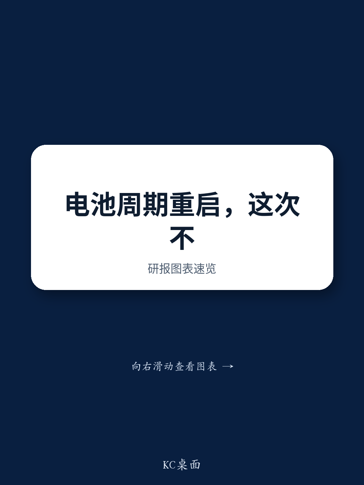
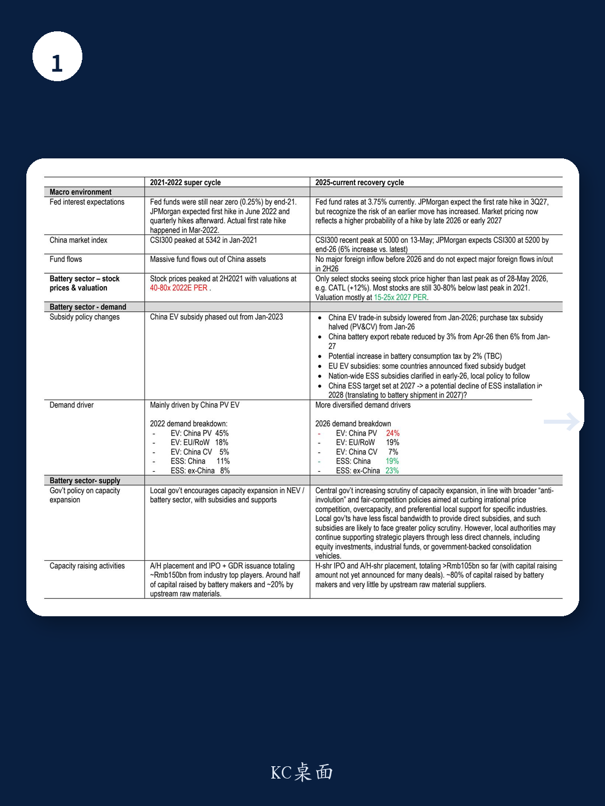
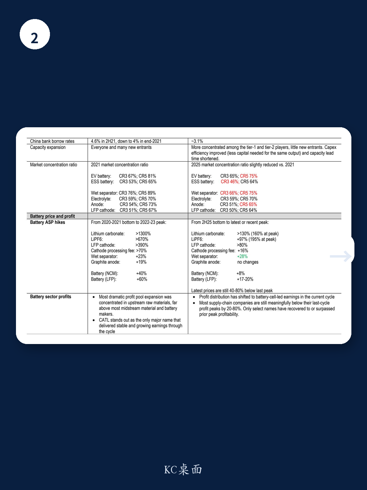

# 电池投资的下半场：市场真正低估的不是价格弹性，而是利润兑现的稳定性

市场正在为电池板块的第二次“涨价周期”定价，但这一次的剧本与2021-2022年的超级周期完全不同。某外资投行近期发布的一份长达100页的深度报告，系统地拆解了这两个周期的结构性差异，并给出了一个值得所有产业决策者与投资者认真对待的结论：当前周期更可能奖励的是那些能通过规模增长兑现稳定现金流和利润的公司，而不是押注价格继续反弹的博弈者。

报告的核心判断是，电池板块的投资逻辑正在从“预期涨价”切换为“利润兑现”。这一判断基于对两个周期中价格走势、需求结构、政策环境、资本流向和利润分配格局的全面对比。对于持有“历史会简单重复”预期的市场参与者而言，这份报告提供了一套需要重新校准的观察框架。

## 1. 当前周期并非超级周期的缩小版，而是一个结构不同的“恢复周期”

将2021-2022年的电池周期定义为“超级周期”并不过分。彼时，全球近乎零利率、中国电动车渗透率的爆发式增长、地方政府对产能扩张的积极鼓励、以及上游原材料价格的极端通胀，共同推动了一轮几乎所有环节都受益的普涨行情。

而当前周期，尽管同样出现了价格复苏和产能利用率回升，但其驱动力和约束条件已发生根本性变化。报告指出，当前周期的需求来源更加多元化——储能（ESS）的占比从2022年的不到20%跃升至2026年的超过40%，商用车和海外市场的贡献也在提升。这听起来是好事，但一个更分散的需求结构意味着投资叙事不再像“电动车渗透率爆炸”那样简洁有力。市场需要同时跟踪多个引擎的运转情况，而不是押注单一主线。

这意味着，当前周期更可能是一个“恢复周期”而非“超级周期”。它的涨幅更温和、持续时间可能更长、但选股的容错率更低。市场对板块整体重新定价的期待，需要被更审慎的个股筛选所取代。

## 2. 价格复苏的斜率远低于上一轮，但股价高点往往领先于利润高点

价格是理解两个周期差异最直观的窗口。上一轮周期中，碳酸锂价格上涨超过1300%，六氟磷酸锂超过670%，LFP正极材料超过390%。而本轮周期中，尽管碳酸锂从2025年下半年低点反弹了超过130%，但绝对价格仍比上一轮峰值低40%至80%。隔膜涨价28%，石墨负极甚至尚未出现任何价格上行周期。

一个被反复验证的历史教训是：股票价格往往在利润或价格达到顶峰之前很久就见顶了。报告以某隔膜龙头为例，其股价在2021年9-10月触及峰值，而这恰好是行业隔膜价格从低谷开始反弹的初期。市场总是在预期阶段就完成了对“涨价”的定价，而当涨价真正落地、利润开始释放时，股价反而失去了向上的动力。

这给当前周期的投资者提出了一个核心问题：如果价格已经反弹了一段时间，市场对涨价的预期是否已经被充分消化？下一阶段，驱动股价的变量将从“价格还能涨多少”转变为“利润能否真的兑现”。

## 3. 利润分配格局已变：电池厂成为赢家，上游资源不再是红利集中地

上一轮超级周期中，利润最丰厚的环节集中在上游资源端。某锂业公司在2022年第四季度实现了61亿元的季度净利润峰值，远超大多数中游材料和电池制造商。而当前周期，利润分配的天平已明显向电池厂倾斜，尤其是龙头企业。

报告的数据清晰地展示了这一点：在本轮周期的资本募集活动中，电池厂占据了约80%的份额，而CATL一家就募集了约770亿元，占整个供应链募集总额的约70%。相比之下，上一轮周期中CATL的募资占比仅为约30%。资本流向的变化，直接反映了议价能力和投资焦点的转移——拥有规模、技术、利用率和现金流优势的电池厂，正在成为产业链中利润最稳定的环节。

这一结构性变化意味着，投资者不能再简单地用上一轮周期中“资源为王”的框架来审视当前的投资机会。谁能在不依赖价格大幅上涨的前提下，通过销量增长和运营杠杆来持续创造利润，谁才是当前周期中的核心标的。

## 4. 报告尚未完全回答的关键问题：产能纪律能维持多久？

报告在多个地方强调了当前周期中供给侧的“更自律”——地方政府补贴减少、中央“反内卷”政策加严、新进入者减少。但一个悬而未决的问题是：这种产能纪律能持续多久？

报告自身也指出，尽管整体产能扩张更加集中在一二线玩家，但部分环节的行业集中度相比上一周期反而下降了，例如湿法隔膜的CR3和CR5分别下降了10个和15个百分点。这意味着，当需求增速放缓或价格回升到足够吸引人的水平时，现有玩家是否有动力重新启动激进的扩产计划？这将是决定本轮周期利润兑现可持续性的关键变量。

此外，政策端也存在不确定性。2026年初全国性储能补贴的明确化，以及2027年储能装机目标的存在，可能会在2028年带来装机量的潜在回落。这种“政策窗口期”效应，可能会导致2027年的电池出货量出现前高后低的压力。这些二阶影响，报告并未完全展开，但值得每一个长期投资者持续跟踪。

## 5. 对于决策者而言，需要建立“持有核心、交易周期”的观察框架

综合报告的判断，一个务实的观察框架浮出水面：对于电池板块的投资，应当区分“核心持有”与“周期交易”两种策略。

报告明确指出，CATL是板块中唯一一个在整个周期中展现出稳定且持续盈利增长的公司，其规模、技术领导力、议价能力和现金流生成能力，使其成为值得穿越周期的“压舱石”。而对于材料公司和二线电池厂，更合适的策略是区间交易——在估值低、预期悲观时买入，在预期变得拥挤时获利了结。这类公司的盈利对价格、产能利用率和产能扩张预期的敏感度更高，更适合作为战术性配置而非长期持有。

这一框架的核心在于，承认当前周期不具备全面重估的条件，但提供了结构性选股的机会。放弃对“板块普涨”的幻想，专注于识别那些能够通过自身经营能力穿越周期的公司，才是当前环境下最理性的选择。

---

上述分析仅触及了这份百页报告的一小部分核心逻辑。关于两个周期中需求结构的具体对比、各环节价格弹性的量化分析、以及不同公司在利润分配格局变化中的相对位置，报告都有更详尽的拆解。这些数据背后隐含的投资含义，以及报告尚未完全展开的关于2027-2028年增长可持续性的讨论，都值得进一步深入探讨。欢迎来社群微信群中，与我们继续拆解这份报告的完整框架与关键图表。

Personal reading notes and learning share only. Not investment advice.

