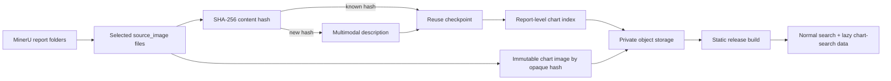

# Chart Search Architecture

Last updated: 2026-08-10

## Goal

Make the charts already extracted from reports searchable by facts such as company,
metric, period, geography, unit, and visible trend. The pipeline uses an
OpenAI-compatible multimodal endpoint to turn each selected MinerU chart into a
small structured description. Report PDFs and raw extraction folders remain private.

## Daily Incremental Flow



The daily PDF workflow dispatches `portal-chart-search-index.yml` before deleting
its short-lived private shard handoff. The chart workflow downloads those shards,
loads the previous checkpoint and index from private object storage, processes only
unknown content hashes, and publishes the new index. The regular edge refresh then:

1. downloads the latest chart index;
2. merges report-level chart text into `data/search_index.json`;
3. publishes `data/chart_search_index.json` for a chart-specific search view.

If chart search is temporarily disabled, the document and publishing workflows keep
working. Enable the daily dispatch with repository variable
`CHART_SEARCH_ENABLED=true` after the private API configuration is present.

## Model Configuration

The public repository contains no endpoint or credential. Actions reads:

| Setting | Type | Purpose |
| --- | --- | --- |
| `VISION_INDEX_API_KEY` | GitHub Actions secret | API bearer credential. |
| `VISION_INDEX_API_BASE_URL` | GitHub Actions secret | Credential-free HTTPS OpenAI-compatible base URL. |
| `VISION_INDEX_MODEL` | Repository variable | Model name; defaults to `qwen3-vl-flash`. |
| `VISION_INDEX_MAX_IMAGES_PER_RUN` | Repository variable | Whole-run ceiling for new API calls; defaults to `0` so no selected daily chart is silently dropped. |
| `VISION_INDEX_MAX_PER_REPORT` | Repository variable | Per-report image ceiling; defaults to `0` so every retained MinerU image is examined. |
| `VISION_INDEX_MIN_INTERVAL_SECONDS` | Repository variable | Minimum delay between requests; defaults to 0.4 seconds. |
| `VISION_INDEX_CHECKPOINT_BATCH_SIZE` | Repository variable | Maximum calls between private R2 state uploads; defaults to 20. |

The client rejects non-HTTPS bases, embedded URL credentials, query strings, and
fragments. Authentication/configuration failures such as HTTP 401/403 stop the run
immediately. Throttling, server failures, network timeouts, and malformed server/model
JSON remain retryable and can never quarantine an image. Logs and checkpoints store
only generic failure classes/statuses.

## Incremental, Deduplication, and Resume Rules

- The SHA-256 of the extracted source image is the model-cache key.
- A successful description, including `is_chart=false`, is reused on later runs.
- Duplicate images across reports cause one model call but can create multiple report
  associations.
- Each success or failure is atomically checkpointed locally. The workflow limits
  each model batch to 20 calls by default and uploads the private R2 state after
  every batch, so a runner timeout loses at most the active batch rather than the
  whole day.
- Failed images receive a bounded next-retry timestamp; they do not discard successful
  descriptions from the same run. Three consecutive transient failures across images
  open a circuit breaker. The workflow uploads the private state before exiting, so a
  service-wide outage does not spend calls across the full input set.
- `max_images` counts only new model calls. Cache hits are unlimited, so a backfill can
  relink already-described charts without consuming its call budget.
- The daily job makes as many calls as needed by default. Only deterministic single-image
  failures (local decode/input failures or an explicit image-content 4xx response) count
  toward quarantine, at most once per workflow execution. A hash that has the same stable
  image failure in three separate workflow runs is quarantined in the private state;
  transient failures remain retryable forever. Successful charts and the public index
  continue to publish. A manual
  historical backfill can revisit the retained source artifact if the quarantined
  image later needs another parser/model attempt.
- Immutable images are uploaded by hash before the index that references them.
- A non-zero `max_images` is an explicit whole-run ceiling. If the ceiling leaves unknown
  hashes, the child run fails after uploading its private checkpoint; the parent therefore
  retains the private source handoff for a later continuation instead of deleting it.
- Any remaining transient or not-yet-quarantined stable image failure follows the same
  fail-after-private-checkpoint rule. Only a complete run (successful hashes plus any
  hashes already quarantined after three separate executions) lets the parent remove the
  source handoff and publish the updated public index.

## Public Data Contract

`data/chart_search_index.json` has schema version 1:

```json
{
  "schema_version": 1,
  "updated_at_bjt": "ISO-8601 timestamp",
  "report_count": 1,
  "item_count": 2,
  "reports": [
    {
      "report_ref": "opaque stable reference",
      "report_id": "catalog report id",
      "title": "report title",
      "date_folder": "YYMMDD",
      "chart_count": 2,
      "search_text": "bounded combined chart terms",
      "charts": [
        {
          "id": "opaque chart id",
          "image_id": "SHA-256 image id",
          "ordinal": 1,
          "title": "visible chart title",
          "chart_type": "line",
          "description": "visible facts",
          "trend_summary": "visible trend",
          "metrics": [],
          "entities": [],
          "periods": [],
          "geographies": [],
          "units": [],
          "keywords": []
        }
      ]
    }
  ]
}
```

The frontend can return to the existing detail page with
`report.html?id=<report_id>`. The contract never contains a local source path, raw
handoff path, provider URL, API credential, or original storage key. `image_id` is an
opaque lookup id; the gateway should translate it to the private image object only
when rendering a result thumbnail.

## Manual Backfill

Run **Portal chart search index** manually with:

- `date_folder`: historical `YYMMDD` folder;
- exactly one of `source_handoff_run_id` or `source_artifact_run_id`;
- `source_artifact_pattern` when the historical run used a different artifact name;
- `expected_shards`: expected count, or `0` to accept all found shards;
- `max_images`: desired ceiling for new calls.

Repeat the same date/run with a higher ceiling if the summary reports deferred images.
Already completed hashes are skipped. Historical backfill requires a still-available
private handoff or Actions artifact containing `assets/source_image_*`; diagnostic-only
artifacts do not contain chart images. Process older dates in chronological batches so
each run persists its checkpoint before the next begins.

## Operational Verification

Each chart run uploads a small `summary.json` artifact with candidate, cache-hit,
model-call, failure, deferred, report, and chart counts. It intentionally excludes
model responses, images, source paths, and credentials. A healthy incremental run
normally shows mostly cache hits on a retry and only new hashes as model calls.
