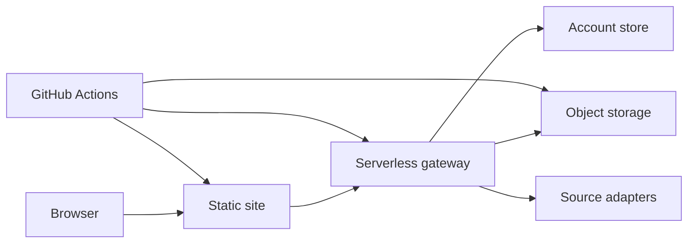

# Document Portal Architecture

Last updated: 2026-08-18

This document describes the protected document portal.

## Functional Boundary

The portal provides account-based search, detail views, and protected downloads for private document files.

Historical account records remain compatible with the current account and entitlement model. Disabled integration handlers stay behind feature flags unless a controlled restoration plan updates code, tests, and UI together.

## Overview

## Key Areas

| Area | Role |
| --- | --- |
| Frontend source | Search, detail, account, admin, operator, and contact surfaces. |
| Gateway worker | Authentication, authorization, download streaming, admin APIs, cache, and analytics. |
| Catalog data | Document metadata and search-index inputs. |
| Password rules | Shared access phrase hashes and fallback assignment rules. |
| Build scripts | Static artifact generation and storage sync. |
| Workflows | Main build, emergency frontend deploy, and emergency gateway deploy. |

Daily rewards, attribution fields, per-day analytics aggregation, and the
server-enforced Course gate are specified in
[`engagement-analytics-course-architecture.md`](engagement-analytics-course-architecture.md).

## Build And Deploy

The main workflow should:

1. Check out the remote default branch.
2. Run syntax checks and targeted regression tests.
3. Update catalog and search data.
4. Generate the static artifact.
5. Publish the static site.
6. Deploy the gateway.

Account and permission changes should deploy the gateway and frontend together when either side depends on the other.
For such a release, deploy and verify the gateway first, then switch the static
edge release. `neutral-edge-cutover.yml` publishes immutable static objects and
does not deploy the API gateway; `portal-worker-emergency-deploy.yml` owns the
gateway deployment and its pre-deploy contract tests.

The production hostname remains on the neutral edge route and is never bound
to GitHub Pages. Repository workflows may create build artifacts, but the
custom hostname and downloadable binaries are not served from repository
Pages.

Each immutable static deployment receives a random 32-character release ID.
The post-deploy catalog check uses
`/.well-known/edge-release/<release-id>/data/...`; the edge Worker serves that
path only when the requested ID matches its active `STATIC_PREFIX`, and marks
the response `no-store`. This verifies the newly active release without mixing
the ordinary five-minute catalog cache from different deployments. Public site
requests continue to use the normal unversioned paths and cache policy.

## Frontend Pages

| Page Type | Role |
| --- | --- |
| Search | Search, filters, document list, and account entry. |
| Detail | Catalog item detail and download entry. |
| External detail | Unified source-adapter detail page. |
| Course | Server-gated course catalog, materialized only after authorization. |
| Policy pages | Public policy and generic support instructions. |

Support language and support channels are resolved by the deployed frontend.

## Accounts, Roles, And Sessions

- Regular users, operators, and administrators share the account service but receive different UI and API capabilities.
- Session tokens are signed server-side.
- Hidden frontend controls do not replace server-side authorization.
- Account-store mode must be explicit in production.
- Historical account-source labels should be normalized in UI and exports.

## Permission Model

Download authorization can come from several independent positive sources:

- administrator grants;
- account-level entitlements;
- historical entitlements;
- trial or limited-use records;
- single-item grants or derived access codes.

Each source is evaluated independently by scope, expiry, and usage count. A broader short entitlement should not be merged with a narrower long entitlement into a permission that never existed.

Administrator disable decisions and role decisions take precedence where applicable. Positive grants can still combine as a union when they are independently valid.

## Gateway API Categories

| Category | Role |
| --- | --- |
| Auth | Session, login, registration, and password updates. |
| Entitlement | Current account permissions and item-specific checks. |
| Download | Protected file streaming. |
| Source adapters | External search, detail, and prepared file endpoints. |
| Admin | Account and permission management. |
| Ops | Operator dashboards and operational helpers. |
| Legacy-disabled | Old handlers that return disabled responses behind feature flags. |

## External Search Resilience

`external` is the Reportify source adapter. Its search path is deliberately
cache-first so an already resolved query does not depend on current upstream
latency:

1. Return a fresh exact-query R2 cache entry before contacting Reportify. The
   cache freshness window is six hours.
2. On a cache miss or expiry, give the live Reportify request a hard 10-second
   server-side budget.
3. If the live request fails or reaches that budget, return a usable recent
   exact-query cache entry when one exists; otherwise search the last complete
   R2 source mirror and return that result.
4. If neither cache layer can answer, return the normal degraded empty payload
   with an upstream warning rather than leave the request pending.

The browser gives Reportify an independent 16-second deadline; the other
remote sources each retain an independent 18-second deadline. The gateway's
10-second live budget must stay below the Reportify deadline so cache or mirror
lookup, response serialization, and network transit can complete before the
browser displays a source timeout. One slow source must not cancel or clear the
other sources. Responses expose `cache_status` (`fresh`, `refreshed`, `stale`,
`mirror`, or `miss`) so the serving path can be verified without exposing
private upstream configuration.

Mirror matching is punctuation-insensitive. Query and mirror fields are
normalized with Unicode NFKC and lowercase conversion; punctuation and symbol
runs, including `:`, `?`, and `_`, become token separators and repeated
whitespace is collapsed. This keeps titles such as `Viewpoint: ... what?` and
mirror variants such as `Viewpoint_ ... what_` equivalent for fallback
matching. The original user query is still sent to the live provider so this
normalization does not change upstream search semantics.

The request path only reads the mirror. The Portal Search Mirror workflow owns
refreshing and publishing the last complete mirror; an incomplete refresh must
not replace it. A Worker deployment therefore does not itself refresh search
data and must be verified against an existing complete mirror.

### External Search Deployment And Verification

Changes to this behavior require a gateway deployment through
`portal-worker-emergency-deploy.yml`. A static edge release is not required
unless frontend code also changed. The workflow has no custom dispatch inputs;
the branch or tag selected as the `workflow_dispatch` ref is the source checked
out and deployed. For the normal production path, merge or push the verified
commit to `main`, then dispatch the workflow on `main`. A same-repository branch
can be selected for an intentional branch deployment, but the ref must exist in
the repository and the workflow file must remain present on the default branch
for manual dispatch to be available. There is no input for deploying an
arbitrary commit SHA.

Deployment is gated by `PORTAL_AUTOMATION_ENABLED == 'true'`, the fixed
sparse-checkout validation suite, successful private-config materialization,
the required R2 and Cloudflare values, and Cloudflare deploy credentials. A new
Worker dependency or regression test must also be added to the workflow's
sparse-checkout list and validation commands. The shared concurrency group
cancels an in-progress emergency deployment when a newer one starts.

The workflow's built-in post-deploy smoke check requires `/api/health` to
return `ok: true` and verifies that anonymous rewards, course-access, and report
chat requests remain unauthorized. After that smoke check passes, validate the
search-specific contract through the live portal:

1. Search both the full title `US Economic Viewpoint: K, so what? Implications
   of a K-shaped economy` and the broader query `US economic`.
2. Confirm each `/api/external/search` request returns HTTP 200 inside the
   browser's 16-second Reportify deadline, and that the full-title response contains the
   expected report.
3. Inspect `cache_status`; after a successful live refresh, repeating the exact
   query within six hours should return `fresh`. A naturally degraded request
   may return `stale` or `mirror` but should still complete before the browser
   deadline.
4. Keep punctuation-equivalence and forced-upstream-timeout coverage in the
   Worker regression tests rather than intentionally disrupting production to
   exercise the fallback.

## Storage And Account Stores

Object storage areas:

| Area | Contents |
| --- | --- |
| Private files | Downloadable binaries. |
| Account grants | Custom access records, backups, and audits. |
| Analytics | Access and operation events. |
| Cached source data | Adapter caches and prepared files. |
| Hot or featured items | Optional curated private files and metadata. |

The structured account store keeps users, entitlements, and usage records. Read failures should be treated explicitly and must not silently overwrite valid records.

## Admin And Operator Surfaces

- Administrators can edit user scope, expiry, notes, disabled state, and roles.
- Permission saves should read back server state and update the UI from the authoritative result.
- Operator tools should be available to the operator role without requiring administrator-only checks.
- Historical source labels should be neutralized in UI and exports while leaving raw storage unchanged.
- All changes should write audit records.

## Regression Checks

Before release:

1. Run syntax checks for frontend and gateway files.
2. Run contact-language tests where applicable.
3. Run legacy-access compatibility tests.
4. Run entitlement precedence, renewal, scope, featured-item, and text-only tests.
5. Build the static site and inspect the output.

After release:

1. Regular accounts can log in.
2. Existing historical entitlements still authorize the proper scope.
3. Multiple entitlement sources combine according to the permission model.
4. Operator and administrator surfaces show according to role.
5. Disabled legacy endpoints return disabled responses.
