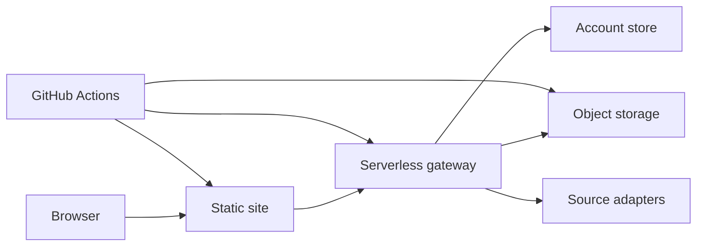

# Document Portal Architecture

Last updated: 2026-08-06

This document describes the protected document portal in neutral public language. It avoids product names, destination-channel labels, personal contact handles, pricing copy, and upstream source branding.

## Current Boundary

The portal provides account-based search, detail views, and protected downloads for private document files.

Current public documentation rules:

1. Do not document online checkout, partner redemption, or fulfillment copy in public repository docs.
2. Do not expose destination-specific support instructions or personal contact handles.
3. Preserve compatibility with historical account records without displaying historical brand names in user-facing UI.
4. Keep old integration handlers behind disabled feature flags unless a controlled restoration plan updates docs, tests, and UI together.

## Overview

## Key Areas

| Area | Role |
| --- | --- |
| Frontend source | Search, detail, account, admin, operator, and contact surfaces. |
| Gateway worker | Authentication, authorization, download streaming, admin APIs, cache, and analytics. |
| Catalog data | Document metadata and search-index inputs. |
| Password rules | Shared access phrase hashes and fallback assignment rules. |
| Build scripts | Static artifact generation and storage sync. |
| Workflows | Main build, emergency frontend deploy, and emergency gateway deploy. |

## Build And Deploy

The main workflow should:

1. Check out the remote default branch.
2. Run syntax checks and targeted regression tests.
3. Update catalog and search data.
4. Generate the static artifact.
5. Publish the static site.
6. Deploy the gateway.

Account and permission changes should deploy the gateway and frontend together when either side depends on the other.

## Frontend Pages

| Page Type | Role |
| --- | --- |
| Search | Search, filters, document list, and account entry. |
| Detail | Catalog item detail and download entry. |
| External detail | Unified source-adapter detail page. |
| Policy pages | Public policy and generic support instructions. |

Support language and support channels should be configured through private deployment assets, not hard-coded public documentation.

## Accounts, Roles, And Sessions

- Regular users, operators, and administrators share the account service but receive different UI and API capabilities.
- Session tokens are signed server-side.
- Hidden frontend controls do not replace server-side authorization.
- Account-store mode must be explicit in production.
- Historical account-source labels should be normalized in UI and exports.

## Permission Model

Download authorization can come from several independent positive sources:

- administrator grants;
- account-level entitlements;
- historical entitlements;
- trial or limited-use records;
- single-item grants or derived access codes.

Each source is evaluated independently by scope, expiry, and usage count. A broader short entitlement should not be merged with a narrower long entitlement into a permission that never existed.

Administrator disable decisions and role decisions take precedence where applicable. Positive grants can still combine as a union when they are independently valid.

## Gateway API Categories

| Category | Role |
| --- | --- |
| Auth | Session, login, registration, and password updates. |
| Entitlement | Current account permissions and item-specific checks. |
| Download | Protected file streaming. |
| Source adapters | External search, detail, and prepared file endpoints. |
| Admin | Account and permission management. |
| Ops | Operator dashboards and operational helpers. |
| Legacy-disabled | Old handlers that return disabled responses behind feature flags. |

## Storage And Account Stores

Object storage areas:

| Area | Contents |
| --- | --- |
| Private files | Downloadable binaries. |
| Account grants | Custom access records, backups, and audits. |
| Analytics | Access and operation events. |
| Cached source data | Adapter caches and prepared files. |
| Hot or featured items | Optional curated private files and metadata. |

The structured account store keeps users, entitlements, and usage records. Read failures should be treated explicitly and must not silently overwrite valid records.

## Admin And Operator Surfaces

- Administrators can edit user scope, expiry, notes, disabled state, and roles.
- Permission saves should read back server state and update the UI from the authoritative result.
- Operator tools should be available to the configured operator role without requiring administrator-only checks.
- Historical source labels should be neutralized in UI and exports while leaving raw storage unchanged.
- All changes should write audit records.

## Configuration Categories

Public docs may list configuration categories, but not values:

- account-store mode;
- allowed origins;
- catalog and search URLs;
- object-storage prefixes;
- session signing secret;
- account-store service credential;
- password or access-code secret;
- administrator utility secret;
- legacy feature flags.

## Regression Checks

Before release:

1. Run syntax checks for frontend and gateway files.
2. Run contact-language tests where applicable.
3. Run legacy-access compatibility tests.
4. Run entitlement precedence, renewal, scope, featured-item, and text-only tests.
5. Build the static site and inspect public source for destination-specific copy.

After release:

1. Regular accounts can log in.
2. Existing historical entitlements still authorize the proper scope.
3. Multiple entitlement sources combine according to the permission model.
4. Operator and administrator surfaces show according to role.
5. Disabled legacy endpoints return disabled responses.
