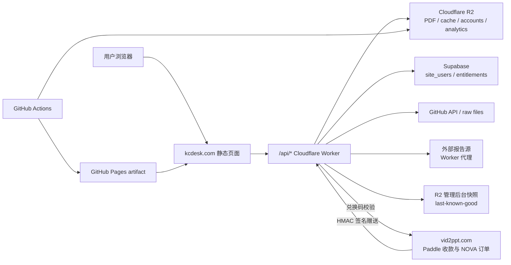

# kcdesk.com 技术架构文档

最后更新：2026-07-27
维护范围：`kcdesk.com` / KC Desk Notes 搜索站、报告详情页、外部报告检索、账号权限、管理后台、运营后台、每日文件缓存、访问埋点，以及接收 Vid2PPT NOVA 赠送权益的跨站协议。

维护规则：凡涉及账号、登录、权限、老客户兼容、跨站赠送、数据存储、Worker API 或部署链路的改动，必须在同一个 PR 或提交中同步更新本文件。文档只记录 secret 名称，不记录任何密码、token 或密钥值。

## 1. 总览

`kcdesk.com` 当前是一个轻前端、重 Worker 的静态站：

- 静态页面由 GitHub Actions 构建后部署到 GitHub Pages，再通过 `kcdesk.com` 访问。
- Cloudflare Worker 作为唯一后端入口，前端通过 `/api/...` 调用 Worker。
- 私有 PDF、外部报告缓存、账号兜底数据、每日文件缓存、访问埋点都存放在 Cloudflare R2。
- 账号主库优先走 Supabase；如果 Supabase 配置不可用，Worker 会回退到 R2 JSON 索引。
- 用户端只需要能访问 `kcdesk.com`。第三方检索、GitHub 文件、R2 下载等都由 Worker 代理或缓存，前端不直连上游。
- KCdesk 不接收 Paddle 付款。符合条件的 Vid2PPT NOVA 支付在 `vid2ppt.com` 完成后，通过签名服务端请求或兑换码兜底赠送 KCdesk 权益。
- 老 KCdesk 客户的原始账号和下载授权独立受保护，不因 Vid2PPT 集成改变，也不展示 Vid2PPT、NOVA 或兑换码入口。



## 2. 关键目录

| 路径 | 用途 |
| --- | --- |
| `kc_desk_notes/site_src/` | 前端源文件，包含首页、报告页、外部报告页、交付页、账号弹窗、管理后台 UI。 |
| `kc_desk_notes/data/catalog.json` | 长期报告 catalog，保留报告文字/元数据，PDF 可按容量策略归档。 |
| `kc_desk_notes/data/history_catalog.json` | 一次性导入的历史研报元数据（2025-12 ~ 2026-06 约 8900 篇，Text only，无 PDF）。 |
| `kc_desk_notes/data/history_text/shard_*.json.gz` | 历史研报的规范化检索文本分片，每篇截断 1 万字符。 |
| `scripts/import_history_reports.py` | 从本地 ib_rpt_history 抽取结果生成上面两个历史数据文件（一次性导入）。 |
| `kc_desk_notes/password_rules.json` | 通用密码 hash 和备用分组规则。 |
| `workers/kc-desk-notes-worker/src/index.js` | Cloudflare Worker 主逻辑，包含鉴权、下载、搜索代理、管理后台、缓存、埋点。 |
| `.github/workflows/kc-desk-notes-pages.yml` | 构建/部署 kcdesk.com 的主 workflow。 |
| `.github/workflows/kcdesk-worker-emergency-deploy.yml` | 手动、轻量、仅部署 Worker；发布前运行老客户权限兼容测试。 |
| `.github/workflows/kcdesk-pages-emergency-deploy.yml` | 手动、轻量、仅构建并部署 Pages；发布前运行老客户 UI 兼容测试。 |
| `scripts/kc_desk_notes_catalog.py` | 扫描 Dropbox、生成/合并 catalog、同步 PDF 到 R2、执行 PDF 容量清理。 |
| `scripts/build_kc_desk_notes_site.py` | 生成 Pages artifact 和公开搜索索引。 |
| `scripts/submit_kcdesk_indexnow.py` | 对比部署前后 catalog，只把新增、更新或删除的公开 canonical URL 通知 IndexNow。 |
| `scripts/translate_kc_desk_titles.py` | 用 DeepSeek 批量补中文标题。 |
| `kc_desk_notes/account_schema.sql` | Supabase 账号/权益/购买/使用事件 schema。 |

## 3. 构建与部署链路

主 workflow：`.github/workflows/kc-desk-notes-pages.yml`

触发：

- 定时：北京时间 09:30。
- 手动：Actions -> **KC Desk Notes Pages**。

流程：

1. 从 Dropbox `/zip_backup` 扫描 PDF。
2. `scripts/kc_desk_notes_catalog.py` 合并长期 catalog。
3. 解析 PDF 页数、首页宽高、横竖屏、文件大小等元数据。
4. 按 `storage_limit_gb` 控制 PDF 存储容量，默认 8 GiB。
5. 当前可用 PDF 上传到 R2，默认 key 为 `reports/<report_id>.pdf`。
6. `scripts/translate_kc_desk_titles.py` 用 DeepSeek 补缺失的中文标题，workers 默认 500。
7. `scripts/build_kc_desk_notes_site.py` 生成静态站 artifact：
   - `data/catalog.json`
   - `data/search_index.json`
   - `data/password_rules.json`
   - HTML/CSS/JS 静态资源
8. 部署 GitHub Pages。
9. 验证根目录 IndexNow key 后，增量通知 Bing、Yandex 等 IndexNow 参与者；通知失败不阻塞网站部署。
10. 条件满足时部署 Cloudflare Worker，并写入 `CATALOG_URL`、`SEARCH_INDEX_URL`、`PASSWORD_RULES_URL` 等变量。
11. 提交更新后的 `kc_desk_notes/data/catalog.json`。

### 3.1 发布层级

- 日常数据更新与完整发布使用 `KC Desk Notes Pages` 主 workflow。
- 只修改 Worker 时使用 `KCdesk Worker Emergency Deploy`，避免重新扫描 Dropbox 或重建全站数据。
- 只修改静态前端时使用 `KCdesk Pages Emergency Deploy`，避免顺带部署 Worker。
- 两个轻量 workflow 都只允许手动触发，并在部署前运行 `scripts/test_kcdesk_legacy_access_compat.js`。
- 账号、权限或跨站 UI 改动必须先通过老客户兼容测试；Worker 与 Pages 分开发布时，按向后兼容顺序逐个验证线上接口和页面。

### 3.2 SEO / GEO 公开发现层

公开索引只使用短 canonical URL：

```text
https://kcdesk.com/reports/<report_id>.html
```

动态业务页 `report.html`、`doc.html`、`delivery.html` 和登录后的 `newsfeed.html` 不进入 sitemap，并设置 `noindex`。任何带密码、source、token 或交付参数的 URL 都不会进入 sitemap、RSS、llms 文件或 IndexNow payload。

每次构建生成：

| 文件 | 用途 |
| --- | --- |
| `sitemap.xml` | sitemap index，供 Google、Bing、Yandex 和通用爬虫使用。 |
| `sitemap-pages.xml` / `sitemap-reports-*.xml` / `sitemap-blog-*.xml` | 公开页面、报告与 Blog 静态页分片，每片最多 5000 篇。 |
| `sitemap-baidu.xml` | 百度专用扁平 URL 集；不使用百度已停止处理的 sitemap index。 |
| `sitemap-sogou.xml` | 搜狗可直接提交的扁平 URL 集。 |
| `feed.xml` | 最近 100 篇报告 RSS；供 Bing、阅读器和增量发现使用。 |
| `robots.txt` | 声明全部 sitemap，允许公开页面与 catalog，隔离 API、私有数据、交付页和 Newsfeed。 |
| `llms.txt` | AI 检索入口和站点说明。 |
| `llms-full.txt` | 最近 200 篇报告的中文标题、机构、主题、日期、摘要和 canonical URL。 |
| `<INDEXNOW_KEY>.txt` | IndexNow 域名所有权验证。key 是公开验证值，不是业务 secret。 |

静态报告页包含中文 title/description、英文原标题、canonical、hreflang、Open Graph、Schema.org `Report`、`BreadcrumbList` 和相关报告静态链接。`lastmod` 优先使用文件真实修改时间或报告日期，不使用每次扫描都会变化的 `last_seen_at_bjt`，避免对搜索引擎制造虚假更新。

主动通知：

- workflow 在扫描 catalog 前保存一份部署前快照。
- Pages 部署成功后，`scripts/submit_kcdesk_indexnow.py` 对公开元数据做字段级比较。
- 只提交首页、报告索引、RSS，以及发生新增/修改/删除的静态报告 URL。
- 单次请求最多 10,000 URL；先确认线上 key 文件可读取，再调用 `https://api.indexnow.org/indexnow`。
- Cloudflare 可额外启用 Crawler Hints，利用 CDN cache 信号补充发送 IndexNow 通知。

站长平台提交口径：

- Google Search Console：`https://kcdesk.com/sitemap.xml`
- Bing Webmaster Tools：`https://kcdesk.com/sitemap.xml`，并由 IndexNow 接收增量更新。
- 百度搜索资源平台：`https://kcdesk.com/sitemap-baidu.xml`
- 搜狗资源平台：`https://kcdesk.com/sitemap-sogou.xml`；若账号未获 sitemap 邀请权限，则使用 URL 提交工具提交重要静态报告页。
- Yandex Webmaster：`https://kcdesk.com/sitemap.xml`，并由 IndexNow 接收增量更新。

## 4. 前端页面

| 页面 | 文件 | 说明 |
| --- | --- | --- |
| 首页 | `kc_desk_notes/site_src/index.html` + `assets/app.js` | 报告搜索、机构/行业/日期/范围/PDF状态/页数筛选、外部报告检索、登录入口。 |
| Blog | 构建生成的 `blog/index.html` 与 `blog/<slug>.html` | 自 2026-07-27 起归档每日微信公众号文章；正文经过白名单净化并进入公开 sitemap。 |
| 报告详情 | `kc_desk_notes/site_src/report.html` | 站内 PDF 报告详情、密码/账号下载、相关报告推荐。 |
| 外部报告详情 | `kc_desk_notes/site_src/doc.html` | “其他报告 / 报告A / 高权报告”的统一详情页。 |
| 交付页 | `kc_desk_notes/site_src/delivery.html` | 发货链接落地页，预填密码，但仍由客户点击下载按钮。 |
| 用户行为历史 | `kc_desk_notes/site_src/activity.html` | 仅 super 管理员可用；按日期、事件类型和关键词筛选 R2 历史埋点，并使用游标分页。 |
| 条款/退款 | `terms.html`、`refund.html` | 当前不展示自助支付；联系方式按浏览器首选语言显示微信或邮箱。 |

首页搜索策略：

- 站内 catalog 先在浏览器本地过滤和排序。
- 全文搜索索引来自 `data/search_index.json` + `data/search_index_history/`（历史研报文本分片，仅浏览器懒加载），只用于匹配，不展示长正文。
- 页数筛选支持 `5页以下`、`5-10页`、`10-20页`、`20页以上` 多选。
- 报告行统一 `target="_blank"` 打开新标签页，避免原页面跳转。
- 外部来源通过 Worker 实时搜索；上游不可用时尽量返回 R2 镜像缓存。

## 5. Worker API

Worker 支持 `/api/...` 路径，也兼容直接访问无 `/api` 的路径。

| Endpoint | 方法 | 用途 |
| --- | --- | --- |
| `/health` | GET | 健康检查，同时返回管理后台每日文件/分析快照的新鲜度，不含私有内容。 |
| `/analytics` | POST | 前端访问/搜索/下载/发货链接埋点。 |
| `/captcha` | GET | 注册/登录验证码。 |
| `/auth` | GET/POST | 获取 session、注册、登录。 |
| `/entitlement` | GET | 查询当前账号权益。 |
| `/catalog-pdf-overrides` | GET | 返回 Text only 管理员补传 PDF 的公开可用状态，不含对象键、版本、ETag 或上传账号。 |
| `/download` | POST | 站内 PDF 密码/账号校验后下载。 |
| `/calc` | GET | 隐藏的单篇报告密码计算器，需要 `CALC_KEY`。 |
| `/admin/login` | POST | 通用密钥入口，写入管理 token。 |
| `/admin/report-password` | POST | 管理端生成单篇报告密码/交付信息。 |
| `/account-admin/summary` | GET | 管理后台/运营后台总数据。 |
| `/account-admin/analytics-events` | GET | 仅 super 管理员可用的完整埋点历史查询；支持筛选、页数和稳定游标分页。 |
| `/account-admin/github-file` | GET | 每日文件下载，支持 R2 缓存和 Range。 |
| `/account-admin/github-artifact` | GET | GitHub artifact 下载，支持 R2 缓存和 Range。 |
| `/account-admin/report-pdf` | GET | 管理后台每日精选 PDF 下载。 |
| `/account-admin/text-only-pdf` | POST | 仅 `twotigers` super 账号可用；给已有 Text only catalog 条目补传 PDF，不创建新报告。 |
| `/external/search` | GET | “其他报告”检索。 |
| `/external/pdf` | GET/POST | “其他报告”PDF 准备/下载。 |
| `/external/status` | GET | “其他报告”准备状态轮询。 |
| `/report-a/search` | GET | “报告A”检索，只返回站内格式，不跳上游页面。 |
| `/authority/search` | GET | “高权报告”检索。 |
| `/authority/pdf` | GET/POST | “高权报告”不下载，前端按浏览器语言显示对应联系方式。 |
| `/vid2ppt/redeem-code` | POST | 已登录 KCdesk 用户校验并兑换 Vid2PPT NOVA 代码。 |
| `/vid2ppt/nova-grant` | POST | 接收 Vid2PPT 已支付订单的 HMAC 签名自动赠送。 |
| `/vid2ppt/atlas-grant` | POST | 旧路径兼容别名；只接受当前允许的 NOVA 计划，不再新增 ATLAS 赠送。 |
| `/paddle-config` | GET | 已关闭，固定返回 410；KCdesk 不提供 checkout。 |
| `/paddle-webhook` | POST | 已关闭，固定返回 410；Paddle 事件只由 Vid2PPT 处理。 |

## 6. R2 数据分区

主 bucket 默认：`kc-desk-notes-pdfs`

| Prefix | 内容 |
| --- | --- |
| `reports/<report_id>.pdf` | 站内 Dropbox PDF 镜像。 |
| `_catalog-pdf-overrides/pdfs/<report_id>/<version>.pdf` | super 管理员补传的 Text only PDF；独立于 Dropbox 容量清理。 |
| `_catalog-pdf-overrides/items/<report_id>.json` | 补传 PDF 的版本、对象校验和审计元数据；前端只读取脱敏后的公开状态接口。 |
| `reportify/<id>.pdf` | 历史命名的外部报告 PDF 缓存；用户端不展示这个名称。 |
| `reportify-status/<id>.json` | 外部报告后台准备状态；用户端不展示这个名称。 |
| `_account/...` | R2 兜底账号、权益、购买记录、GitHub 文件缓存。 |
| `_account/access/<email>.json` | 管理员手工开通的全站或条件授权主记录；实际下载鉴权来源之一。 |
| `_account/access_backup/...` | 手工授权 latest/history 恢复副本；不自动覆盖主记录。 |
| `_account/vid2ppt_trial/<email>.json` | NOVA-3D 独立 3 天/10 篇试用记录。 |
| `_account/vid2ppt_trial_backup/...` | NOVA-3D latest/history 恢复副本。 |
| `_account/github-cache/...` | 管理后台/运营后台每日文件缓存。 |
| `_account/admin-snapshots/*.json` | 管理后台各模块最后一次成功快照：每日文件、精选、公众号批次、分析、用户列表。 |
| `_analytics/events/YYYY-MM-DD/...json` | 访问、搜索、打开报告、下载等埋点事件。 |
| `_search-cache/...` | 外部搜索实时缓存。 |
| `_search-mirror/...` | 外部搜索镜像结果。 |

PDF 容量策略：

- `storage_limit_gb` 默认 8 GiB。
- 超过上限时，只归档旧 PDF：`available=false`、`r2_synced=false`，并删除对应 R2 PDF。
- catalog、标题、日期、机构、页数和搜索文字继续保留。
- 前端搜索到已归档报告时显示 `Text only`，并按浏览器语言提示对应联系方式。
- `twotigers` 登录后可在原报告详情页为 Text only 条目补传 PDF。补传写入独立、版本化前缀并读回核验，不会被 Dropbox 容量清理；首页、筛选、相关推荐、详情和下载在运行时合并公开 override 状态。
- 补传只改变 PDF 可用性，不改变 report id、全文索引、账号权益、机构范围、单篇密码或体验下载计数；实际对象确认存在后才消耗限次下载额度。

文字索引策略：

- `scripts/build_kc_desk_notes_site.py` 生成 `search_index.json`。
- 可以通过 `--search-index-limit-gb` 控制公开文字索引大小。
- 超过上限时按日期移除旧文本索引，但 catalog 元数据仍保留。

历史研报（Text only）策略：

- `scripts/import_history_reports.py` 一次性把本地 `ib_rpt_history` 全文抽取结果导入为
  `history_catalog.json` + `history_text/shard_*.json.gz`，之后由日常构建自动合并。
- 构建时按标题与 Dropbox catalog 去重：重复的历史条目不重复上架，其文本挂到现有 report id 上。
- 历史全文输出到 `data/search_index_history/`（manifest + 按月分片），**只有浏览器加载**；
  Worker 仍只加载较小的 `search_index.json`，避免撑爆 Worker 128MB 内存。
- 前端懒加载：首屏只加载 catalog，不下载任何文字索引；页面空闲 3 秒或用户点击/输入
  搜索框时，先加载 `search_index.json` 再按月流式加载历史分片（新月份优先），每片
  解析后让出主线程，页面不会卡顿。报告详情页同样先渲染、后台补文字索引再刷新相关推荐。
- 历史文本不占 R2 容量（存放在 GitHub Pages artifact），PDF 8 GiB 容量策略不受影响。
- `--history-index-limit-gb`（默认 0.06 GiB ≈ 64 MB，浏览器可接受的加载量）超限时，
  从最老日期开始删除正文文本，标题/元数据仍在 catalog 里可搜。

## 7. 密码与交付

站内报告支持三种下载授权：

1. 已登录账号拥有 super/operator/annual 或单篇购买/授权。
2. 输入通用密码，也就是当前业务口径的万能密钥。
3. 输入按 report id 推导出的单篇伪密码。

单篇伪密码规则：

```text
KC-<base32(hmac_sha256(PASSWORD_SECRET, "kc-desk-notes:" + report_id)) 前 12 位，按 4-4-4 分组>
```

隐藏计算器：

```text
/api/calc?id=<report_id>&key=<CALC_KEY>
```

发货链接：

- 管理端生成链接时会把报告 id、标题、source 和密码带入 URL。
- 客户打开后密码自动填好。
- 页面不会自动下载，客户仍需要点击下载按钮，方便先看到相关报告推荐。

## 8. 账号与权限

### 8.1 数据来源

- Supabase 是生产账号身份主库，当前核心表是 `site_users`、`user_entitlements`、`usage_events`。
- `report_purchases` 是可选的单篇购买表。当前数据库未创建该表时，Worker 会读取旧 R2 单篇授权；表不存在必须被视为“没有单篇购买”，不能让有效会员、管理员或手工授权失败。
- R2 `_account/access/...` 保存管理员手工开通的全站/条件授权，并保留 latest/history 恢复副本。
- R2 `_account/vid2ppt_trial/...` 单独保存 NOVA-3D 的 3 天/10 篇试用和已下载报告 id，避免覆盖普通会员或老客户授权。
- Supabase 未配置时仍保留 R2 JSON 账号/权益兼容路径；生产 Supabase 已配置后，不把密码 hash 重新镜像到旧 R2 identity namespace。

账号权益按独立来源组合，不先压成唯一权限：super/operator 角色和账号禁用状态优先；普通账号同时保留有效的 `_account/access/...` 管理后台授权、普通会员/NOVA 权益和 NOVA-3D 试用。每次请求具体报告时，只要任一有效来源覆盖该报告就允许下载。不同来源的范围、到期日和下载额度必须各自保存，不能把一个来源的更广范围与另一个来源的更长期限拼成不存在的权限。例如“伯恩斯坦 12 个月 + NOVA-M 全站 1 个月”应表现为首月全站、之后仅伯恩斯坦，而不是 12 个月全站；如果无限量来源已经放行，也不能扣减 NOVA-3D 的 10 篇额度。

`effective_access` 只是当前页面的主要摘要，`effective_access_components`、`custom_access_matched`、`entitlement_access_matched` 和 `trial_access_matched` 才共同表达实际鉴权结果。管理后台的有效正向授权与其它有效正向来源可以融合；只有后台明确关闭/失效等不能融合的冲突决定才继续阻止更早的会员或试用重新出现。可信业务发生时间晚于管理员决定的新购买或兑换可以接替（Paddle 使用 `paddle_last_occurred_at`，NOVA/Vid2PPT 使用签名结果中的 `completed_at`，缺少可信业务时间时不得越过管理员决定）。单篇购买/授权和报告密码继续作为独立入口，任何可选的单篇购买查询都不得阻断已经验证通过的权限来源。

### 8.2 两站账号与来源

- KCdesk 与 Vid2PPT 没有跨域 Cookie 或浏览器自动登录；两站各自签发 session token。
- 两站可以使用同一组 Supabase 业务表，但 Vid2PPT 不向 KCdesk 发送密码或 session。跨站自动赠送只传规范化邮箱、计划代号、订单引用、兑换码和支付元数据。
- 账号查询先按 `site_origin=kcdesk` 定位；无来源老数据保留兼容 fallback。这个 fallback 只服务迁移，不代表可以任意合并跨站账号。
- 管理分析口径只有在规范化用户名和邮箱都一致时才合并为同一用户；任一字段不同就保留为两个用户。
- `site_origin`、`registered_site`、`source_site` 标注注册来源；行为事件自己的 `site_origin` 标注动作实际发生在哪个站点，不能只靠邮箱推断。
- 自动 NOVA 赠送以有效支付邮箱匹配 KCdesk 邮箱。兑换码订单带有效邮箱时，还会校验该邮箱与当前登录 KCdesk 账号邮箱完全一致；未绑定邮箱的代码作为一次性兜底凭证。

固定高权限账号：

| 账号 | 权限 |
| --- | --- |
| `twotigers` / `twotigers@users.kcdesk.com` | super，管理后台，看到用户信息、访问埋点、公众号发送时间、每日文件、每日精选。 |
| `liuxin` / `liuxin@users.kcdesk.com` | operator，运营后台，看到每日精选和每日文件，不看用户数据、访问埋点、公众号发送时间，不看站内视频。 |

前端入口：

- 登录后根据 `role` 显示“管理后台”或“运营后台”。
- 也保留一个隐藏的通用密钥入口，用于临时生成报告密码/发货链接。
- `liuxin` 必须始终保留 operator 的“运营后台”入口；不能因为 sponsor UI 或来源判断而隐藏。
- 来源为空、`legacy-unknown` 或 `legacy-*` 的老 KCdesk 会话不显示 Vid2PPT、NOVA、赞助链接和兑换码输入框，只显示原有 KCdesk 权限和联系方式。

注册与联系方式：

- 注册必须填写有效的常用邮箱；前端和 Worker 都做必填校验。
- 注册成功后提示管理员会在 5 个工作日内通过邮件开通账号，问题邮箱为 `econ.scroll@gmail.com`。
- `assets/contact.js` 只读取浏览器首选语言：首选语言以 `zh` 开头时显示微信 `MacroGate`，其他语言显示可点击邮箱 `econ.scroll@gmail.com`。
- 首页二维码、页脚、报告详情、外部线索、账号弹窗和政策页都使用同一语言规则；邮件注册与审核通知始终使用邮箱。

## 9. 外部报告检索

用户端命名必须保持抽象：

- 外部源 E：前端显示为“其他报告”。
- 外部源 A：前端显示为“报告A”。
- 外部源 Q：前端显示为“高权报告”。

约束：

- 用户可见文案、按钮、链接名、详情页正文不展示真实上游品牌名或内部项目名。
- 前端不直接跳转上游原文；详情页统一走 `doc.html`。
- “其他报告”支持通用密码和单篇伪密码；有些 PDF 需要后台准备，页面轮询 `/external/status`。
- “报告A”只做检索线索展示，详情页格式和“其他报告”一致，需要原文时显示语言自适应联系方式。
- “高权报告”只做检索线索展示，不提供下载，价格口径为普通外文 26 元/份、实时外文 46 元/份，详情页显示语言自适应联系方式。
- 搜索次序和推荐次序：站内 Dropbox 报告 -> 其他报告 -> 报告A -> 高权报告。

## 10. 管理后台与运营后台

数据入口：`/api/account-admin/summary`

该接口不再在一次请求中同步等待所有上游。每日文件、精选、公众号批次、访问分析和用户列表分别读取 R2 中的 last-known-good 快照；每日文件超过 10 分钟、访问分析超过 15 分钟、其他模块超过 30 分钟后，仍先返回旧数据，再由 `ctx.waitUntil` 在后台刷新。任一模块更新失败时只影响自己的状态，不会清空其他模块，也不会把普通刷新错误误报成登录失效。

管理后台包含：

- 每日精选。
- 公众号发送时间。
- 每日文件。
- 访问与搜索埋点。
- 用户信息。

运营后台包含：

- 每日精选。
- 每日文件。
- 不包含用户信息、访问埋点、公众号发送时间。
- 不包含“站内视频”类文件。

更新状态：

- `fresh`：显示仍在各模块新鲜度窗口内的成功快照。
- `updating`：继续显示最近一次成功内容，同时提示数据更新中。
- `degraded`：快照超过 2 小时仍未完整刷新，继续保留旧内容并提示稍后重试。
- 没有任何快照时显示“数据正在首次同步，请约半小时后重新进入”，不展示内部异常信息。
- 前端对 summary 请求设置 22 秒超时并自动重试一次；同一登录会话内还会保留最后一次成功画面。不同账号之间不会复用该画面。
- 发现模块正在后台更新时，前端 12 秒后自动读取一次新快照，不需要用户反复点刷新。
- 手动点击“刷新”会触发一次完整的后台快照更新；页面先保留旧内容，更新完成后自动回读。

### 每日精选

选择逻辑在 Worker：

- 从 catalog 最近日期开始选 5 篇。
- 排除明显个股分析。
- 优先宏观趋势、央行政策、利率、汇率、资产配置、全球经济等主题。
- 页数要求：大于 5 页、未知页数但分数足够，或横屏 PDF。
- 横屏 PDF 加权，尽量入选。

展示能力：

- 中文标题和英文标题。
- 介绍文案，使用英文报告名。
- tag 不带链接，只展示纯文本 `#宏观趋势` 这种格式。
- 一键复制文案。
- 下载报告。
- 保存 PDF 第一页为图片。

### 公众号发送时间

- 只在 super 管理后台显示。
- 来源目录：
  - `wechat_drafts/xhs_notes`
  - `wechat_drafts/institutions`
  - `wechat_drafts/consulting`
  - `wechat_drafts`
- 按 batch 展示头条/二条/三条等标题。
- 推荐发送窗口：北京时间当天 08:00 到次日 00:30 均匀分布。

## 11. 每日文件与视频缓存

每日文件来自多个 GitHub 路径：

| 来源 | Worker label | repo/path | 权限 |
| --- | --- | --- | --- |
| Market Views PDF | `Market Views PDF` | 当前 repo `market_view_summaries` | super/operator |
| BBG Top Videos | `BBG Top Videos` | `yt-feng/bbg-show/rendered-clips/top-videos` | super/operator |
| BBG Show 视频 | `BBG Show 视频` | `yt-feng/bbg-show/rendered-clips/<date>` | super/operator |
| ARK Invest 视频 | `ARK Invest 视频` | `yt-feng/bbg-show/rendered-clips/ark-invest` | super/operator |
| KC 娱乐视频 | `KC 娱乐视频` | `yt-feng/entertain_cut/outputs/kc_entertain/YYYY-MM-DD/*.mp4` | super/operator |
| 站内视频 | `站内视频` | 当前 repo `bilingual_podcast_videos` | super only |

缓存与加速：

- Worker cron 每 30 分钟先刷新每日文件快照，再执行 `warmAdminGithubCache`。
- 管理后台打开时只读取快照；快照过期后在后台触发刷新，不让 GitHub 聚合阻塞页面。
- BBG Show、BBG Top、ARK、Market Views、报告视频等按类型合并；某一类型本轮未取到时保留该类型上一轮成功结果，避免列表忽隐忽现。
- 预热会把最新每日文件缓存到 R2 `_account/github-cache/...`。
- 缓存保留 3 天，Worker 按文件日期或缓存时间清理。
- 下载 endpoint 支持 HTTP Range。
- 前端对 mp4、以及大于 5 MB 的 pdf/zip 使用分段下载，显示进度条和取消按钮。
- 中国大陆员工只需要下载 `kcdesk.com/api/account-admin/github-file...`，不需要直连 GitHub raw。

坚果云运营镜像：

- Worker 每次成功写入“每日文件”快照后，会对运营视频清单计算稳定指纹；指纹变化时立即发送 `kcdesk-ops-files-changed` 事件，触发坚果云同步。
- 触发状态持久化在 R2 `_account/admin-snapshots/ops-mirror.json`。同一清单只触发一次；失败后冷却 5 分钟再重试，不会拖慢或清空管理后台。
- `.github/workflows/kcdesk-ops-jianguoyun-sync.yml` 接收上述事件立即运行；同时每小时在北京时间 08:15 至次日 00:15 兜底运行，并回补最近 3 天。
- `scripts/sync_ops_videos_to_jianguoyun.py` 从运营后台可见的视频源发现文件，上传到 `/我的坚果云/KCdesk/Ops/YYYY-MM-DD/<类型>/`。
- 镜像类型包括 `BBG Show`、`BBG Top Videos`、`ARK Invest`、`报告视频`、`KC娱乐`；管理员专属的“站内视频”不进入运营镜像。
- 上传按远端文件大小幂等跳过；同目录同名文件自动加短 hash，避免覆盖。
- WebDAV 只清理符合 `YYYY-MM-DD` 的过期日期目录，始终保留最近 3 个北京时间自然日。

视频账号标注：

- BBG 系列根据标题规则标注 `KC桌面` 或 `KC偏见`。
- 同一段原始视频、同一个人的分享视频必须统一账号；Worker 用同源视频多数原则修正。
- `outputs/kc_entertain` 固定标注 `KC娱乐`，不参与 `KC桌面`/`KC偏见` 二选一。

## 12. 访问埋点

前端调用 `/api/analytics` 记录：

- `page_view`
- `search`
- `report_open`
- `download_attempt`
- `download_success`
- `download_error`
- `download_pending`
- `delivery_link_generate`
- `account_auth`
- `admin_user_update`
- `daily_file_download`

存储：

```text
_analytics/events/YYYY-MM-DD/<timestamp>-<random>.json
```

dashboard：

- 只在 `twotigers` super 管理后台显示。
- 默认看近 7 天。
- 展示访客数、搜索数、报告打开、下载、发货链接、热门搜索、热门报告、最近事件。
- “最近事件”只保留摘要；“查看全部已采集记录”会在新标签页打开 `activity.html`。
- 完整历史页直接读取 R2 日期目录，按时间倒序使用对象键游标分页；新事件写入不会打乱已翻过的页。
- 完整历史页支持开始/结束日期、事件类型、关键词和 50/100/200 条每页。
- 页面会明确展示原始埋点的最早日期、当前页条数和是否还有更早记录；埋点启用前或当时未设置埋点的动作无法追溯补录。
- 除访问、搜索、报告与下载外，成功登录/注册/改密、退出登录、管理员用户权限变更，以及运营后台每日文件下载也写入同一份事件存档。
- 带事件类型或关键词筛选时按 100 条存档窗口推进，并保留下一页游标，避免稀有条件一次读取过多 R2 小对象。
- visitor id 存在浏览器本地，Worker 同时保存 IP hash，避免直接保存明文 IP。
- 聚合后的 dashboard 写入 `_account/admin-snapshots/analytics.json`；读取事件超时不会清空管理后台的历史统计。

## 13. 搜索镜像与中国大陆访问

目标：用户端只要能访问 `kcdesk.com`，就能使用站内和外部检索。

实现：

- 外部检索全部走 Worker endpoint。
- Worker 每次搜索优先实时请求上游，并写入 R2 搜索缓存。
- 上游超时或不可用时，使用 `_search-cache` 或 `_search-mirror` 返回最近可用结果。
- `KC Search Mirror` workflow 负责维护镜像结果。
- 前端会显示加载动画，外部结果多等一会也仍留在当前页面。

## 14. Vid2PPT NOVA 赠送

### 14.1 对外与支付边界

- KCdesk 不展示 checkout、不创建 Paddle 交易、不接收 Paddle webhook，也不作为商品销售方。
- 所有付款和 Paddle 记录只发生在 `vid2ppt.com`。对外口径是：Vid2PPT 的 NOVA 赞助恰好赠送 KCdesk.com 对应时长权益。
- KCdesk `/paddle-config` 和 `/paddle-webhook` 固定返回 410，防止旧前端或错误配置重新启用 KCdesk 收款。
- 老 KCdesk 客户沿用原始授权路径，不显示 Vid2PPT/NOVA/兑换码，也不需要知道赠送系统存在。

### 14.2 计划映射

| Vid2PPT 计划 | KCdesk 赠送 |
| --- | --- |
| `NOVA-3D` | 3 天体验，最多下载 10 篇；独立试用记录。 |
| `NOVA-M` | 1 个月全站下载权益。 |
| `NOVA-Q` | 3 个月全站下载权益。 |
| `NOVA-Y` | 12 个月全站下载权益。 |
| `NOVA-2Y` | 24 个月全站下载权益。 |

ATLAS 旧映射只为历史数据识别保留；新的 KCdesk 赠送只接受 NOVA。

### 14.3 自动赠送

1. Vid2PPT 的 Paddle webhook 完成验签、订单落库和兑换码生成。
2. Vid2PPT 使用 `VID2PPT_KCDESK_GRANT_SECRET` 对原始 JSON body 做 HMAC-SHA256，通过 `X-Vid2PPT-Signature` 调用 `/vid2ppt/nova-grant`。
3. KCdesk 以 `request_id`、Paddle transaction id、event id 或兑换码形成稳定 `source_reference`；同一订单重复通知不得重复增加时长。
4. 普通 NOVA 权益从现有有效到期日继续顺延；终身权益不被较短赠送覆盖。
5. NOVA-3D 写入 `_account/vid2ppt_trial/...`，独立统计 10 个唯一报告下载；不覆盖 `_account/access/...` 老授权。
6. 事件写入 `usage_events`，明确记录 `legal_purchase_site=vid2ppt.com` 和 `granted_benefit_site=kcdesk.com`。

### 14.4 权益优先级

1. super/operator 角色权限最高；账号禁用或权限读取错误不能被其它来源绕过。
2. 普通账号的有效正向来源做并集：管理后台授权、普通会员/NOVA 和 NOVA-3D 试用都独立参与当前报告的匹配，任一来源覆盖即可下载。
3. 来源之间不交叉拼接范围和期限。典型场景是“伯恩斯坦后台授权 + NOVA-M”：NOVA-M 有效期内全站可下载；NOVA-M 到期后，原伯恩斯坦权限继续按自己的期限生效。
4. 只有后台明确关闭、失效等无法融合的冲突决定才优先于更早的会员/试用记录。可信业务发生时间晚于管理员决策的新购买或兑换可以接替；异步处理时间 `updated_at` 不能作为依据，缺少可信业务时间时保持管理员决定。
5. 有无限量来源放行时不消耗限量来源额度；只有 NOVA-3D 是唯一放行来源时才记录其 10 篇计数。
6. 单篇购买/授权是独立补充，不改变其它权限来源。

### 14.5 兑换码兜底

- 非 legacy KCdesk 用户登录后，可在“账号管理”弹窗或报告详情的账号下载区域输入 Vid2PPT 兑换码。
- Worker 调用 Vid2PPT `/api/usage` 校验代码已支付、未兑换、属于 NOVA 且赠送站点为 KCdesk。
- 订单带有效支付邮箱时，必须与当前 KCdesk 账号邮箱一致；未绑定邮箱的代码兑换到当时已登录的 KCdesk 账号。
- 发放成功后再把代码标记为已兑换；失败时不能消耗代码。
- 自动赠送是主路径，兑换码用于自动请求延迟、失败或人工核对后的兜底。

## 15. Secrets / Vars 清单

主 workflow / Worker 常用配置：

| 名称 | 类型 | 用途 |
| --- | --- | --- |
| `DROPBOX_APP_KEY` | secret | 读取 Dropbox PDF。 |
| `DROPBOX_APP_SECRET` | secret | 读取 Dropbox PDF。 |
| `DROPBOX_REFRESH_TOKEN` | secret | 读取 Dropbox PDF。 |
| `DEEPSEEK_API_KEY` | secret | 标题翻译、正文/文案链路。 |
| `R2_ACCOUNT_ID` | secret/var | R2 account id。 |
| `R2_ACCESS_KEY_ID` | secret | R2 S3 上传/删除。 |
| `R2_SECRET_ACCESS_KEY` | secret | R2 S3 上传/删除。 |
| `R2_BUCKET` | secret/var | R2 bucket 名。 |
| `R2_OBJECT_PREFIX` | var | 站内 PDF 前缀，默认 `reports`。 |
| `PASSWORD_SECRET` | secret | 下载密码 hash pepper 和单篇密码 HMAC。 |
| `CALC_KEY` | secret | 隐藏计算器 key。 |
| `KC_DESK_DOWNLOAD_PASSWORD` | secret | 通用下载密码。 |
| `KC_DESK_MASTER_KEY` | secret | 管理密钥，缺省可回退通用密码。 |
| `AUTH_SECRET` | secret | 账号/session token 签名。 |
| `SUPABASE_URL` | secret/var | Supabase REST endpoint。 |
| `SUPABASE_SERVICE_ROLE_KEY` | secret | Supabase service role。 |
| `VID2PPT_KCDESK_GRANT_SECRET` | secret | 验证 Vid2PPT 到 KCdesk 自动赠送请求的 HMAC。 |
| `VID2PPT_REDEEM_URL` | var | KCdesk 服务端校验/消费 Vid2PPT 兑换码的 endpoint；缺省为 Vid2PPT `/api/usage`。 |
| `GH_READ_TOKEN` | secret | 读取 GitHub 文件/私有 repo。 |
| `GH_DISPATCH_TOKEN` | secret | 触发后台准备 workflow。 |
| `JIANGUOYUN_WEBDAV_URL` | secret | 坚果云 WebDAV endpoint。 |
| `JIANGUOYUN_WEBDAV_USERNAME` | secret | 坚果云 WebDAV 账号。 |
| `JIANGUOYUN_WEBDAV_PASSWORD` | secret | 坚果云应用密码。 |
| `CLOUDFLARE_API_TOKEN` | secret | 部署 Worker。 |
| `CLOUDFLARE_ACCOUNT_ID` | secret/var | 部署 Worker / R2。 |
| `KC_DESK_WORKER_URL` | var | Pages 前端 API base，生产通常为 `/api`。 |
| `KC_DESK_PAGES_URL` | var | Worker 读取 catalog/search/password 的 Pages URL。 |
| `OPS_ALERT_EMAIL` | secret/var | 接收微信流水线失败邮件的运营邮箱。 |
| `OPS_ALERT_SIGNING_KEY` | secret | GitHub Action 到 Worker 告警请求的 HMAC 签名 key。 |
| `NEWSFEED_EMAIL_PROVIDER` | var | 告警与 Newsfeed 共用的邮件 provider。 |

## 16. 常见维护入口

重新构建站点：

```bash
gh workflow run "KC Desk Notes Pages" \
  --repo yt-feng/rpt_edit \
  --ref main \
  -f dropbox_root=/zip_backup \
  -f days=0 \
  -f sync_r2=true \
  -f force_upload=false \
  -f storage_limit_gb=8 \
  -f deploy_worker=true
```

只部署 Worker（账号/权限/API 紧急修复）：

```bash
gh workflow run "KCdesk Worker Emergency Deploy" \
  --repo yt-feng/rpt_edit \
  --ref main
```

只部署 Pages（前端紧急修复）：

```bash
gh workflow run "KCdesk Pages Emergency Deploy" \
  --repo yt-feng/rpt_edit \
  --ref main
```

本地检查 Worker、前端和老客户兼容：

```bash
node --check workers/kc-desk-notes-worker/src/index.js
node --check kc_desk_notes/site_src/assets/app.js
node scripts/test_kcdesk_entitlement_precedence.js
node scripts/test_kcdesk_legacy_access_compat.js
node scripts/test_kcdesk_access_renewal.js
```

健康检查：

```bash
curl -s https://kcdesk.com/api/health
```

返回的 `dashboard_cache.files` 和 `dashboard_cache.analytics` 包含 `state`、`updated_at`、`age_seconds`，用于判断定时刷新是否工作；不会返回文件名、用户或埋点明细。

## 17. 命名约束

面向用户的页面、链接、按钮和状态文案只使用产品命名：

- `其他报告`
- `报告A`
- `高权报告`
- `MacroGate`
- `econ.scroll@gmail.com`
- `KC桌面`
- `KC偏见`
- `KC娱乐`

不要在用户可见页面出现真实上游品牌名、内部抓取项目名、第三方 API 域名、后台实现路径或调试词。源码内部常量、历史 R2 prefix、workflow 文件名可以保留，但新增 UI 文案要按上面的产品命名。

Vid2PPT 集成的额外展示规则：

- 只有非 legacy 的新账号路径可以显示 `https://vid2ppt.com/sponsor/`、NOVA 说明和兑换码输入框。
- 来源为空、`legacy-unknown` 或 `legacy-*` 的老客户不得看到 Vid2PPT、NOVA、ATLAS 或兑换码相关文案。
- 已开通权益的来源标签面向用户统一显示为 KCdesk 权益；支付站点、计划代号和跨站协议只在允许的新用户引导或管理数据中出现。

## 18. 稳定性约束与排障顺序

稳定性约束：

1. 上游实时读取不得直接决定管理后台模块是否为空；必须优先使用 last-known-good 快照。
2. 定时任务按 cron 隔离：30 分钟任务负责管理后台快照、每日文件 R2 预热和智库 PDF；10 分钟窗口任务只负责 Newsfeed 缓存与邮件，避免多组重任务同时争用 Worker。
3. GitHub、Supabase、Pages JSON 请求都有明确超时。已签名登录请求优先读取 R2 用户镜像，Supabase 查询超时后也回退 R2；Pages catalog/search 超时后保留精选快照。
4. 用户权限修改仍以 `_account/access/...` 的主记录、latest backup、history backup 三份写入并读回校验；用户列表快照只是管理后台展示层，不参与实际下载授权判断。
5. 用户权限新增、编辑、禁用后立即更新对应的用户列表快照；即使随后刷新失败，当前管理界面也保留服务端刚确认的结果。
6. Pages workflow 在同步和部署前执行前端与 Worker 的 `node --check`；语法校验失败时禁止继续部署 Worker。
7. 老客户现有 R2 手工授权必须始终作为独立来源保留；新增 NOVA 不得覆盖、缩短、隐藏或清空它，但可在自己的有效期内补充更广范围。两个来源不能交叉拼接范围与期限。手工记录过期或关闭后，只有管理员决定之后的新购买或兑换可接替；单篇授权保持独立补充。
8. `report_purchases` 是次要且可选的查询。它不存在或未部署时，已验证的会员、手工授权和 NOVA-3D 试用仍必须正常下载。
9. `NOVA-3D` 使用独立试用记录和独立恢复副本；它的 10 篇计数不能写入老客户 `_account/access/...` 主记录。
10. `liuxin` 的 operator 入口和 `twotigers` 的 super 入口由服务端角色决定，不得受 sponsor 可见性、用户来源或普通 entitlement 分支影响。
11. 跨站自动赠送失败只影响该次赠送状态，不得让 KCdesk 登录、老客户下载、运营后台或 Vid2PPT 已支付订单失效。
12. 账号/权限改动发布前先保存当前云端 `main` SHA 和生产 Worker version，运行语法及老客户兼容测试；Worker 与 Pages 使用独立轻量 workflow 发布并逐项验证后，再继续其他生产改动。
13. 管理员把用户设置为启用状态时，不得保存一个已经过期的到期日。旧记录已过期或输入日期已过时，Worker 必须按所选时长从当前时间重新计算；前端同时默认勾选续期并展示预计新日期。

排障顺序：

1. 请求 `/api/health`，检查 `dashboard_cache` 的状态和时间。
2. 查看 30 分钟 cron 是否执行完成；视频已经在源 repo 生成但后台未出现时，优先检查 files snapshot，而不是重新生成视频。
3. files 为 `updating` 时等待后台刷新；旧文件仍应可见。若旧文件也消失，视为快照回归问题。
4. analytics 为 `updating` 时检查 R2 `_analytics/events/` 是否持续写入，以及 `_account/admin-snapshots/analytics.json` 的更新时间。
5. 权限显示与下载结果不一致时，先核对 `/entitlement` 的 `effective_access_components` 和三个 `*_access_matched` 字段，再看 `effective_access_kind` 摘要；“伯恩斯坦后台授权 + 有效 NOVA-M”应同时包含 `admin` 与 `entitlement`，非伯恩斯坦报告由 `entitlement_access_matched=true` 放行，不以用户列表快照作为授权依据。
6. 老客户突然无法下载时，先核对 `_account/access/<email>.json`、有效 entitlement、`effective_access` 和 Worker version；不要先修改或迁移账号记录。
7. 看到 `report_purchases` 表不存在时，确认 Worker 已命中可选表兼容分支；该错误不能覆盖已经成立的基础权限。
8. `liuxin` 看不到运营后台时，检查 `/auth` 返回的 `role=operator` 和前端 `canOpenOperationsPanel`，不要用 sponsor 来源条件控制后台入口。
9. NOVA 自动赠送失败时，依次核对签名、计划 allowlist、支付邮箱、`source_reference` 和 R2/Supabase 写入；订单代码仍可走 `/vid2ppt/redeem-code` 兜底。
10. 管理后台提示保存成功但表格仍显示“未开通”时，检查 `_account/access/<email>.json` 的 `current_period_end` 是否已过期；过期记录重新保存后必须得到未来日期并立即读回为 `active=true`。
