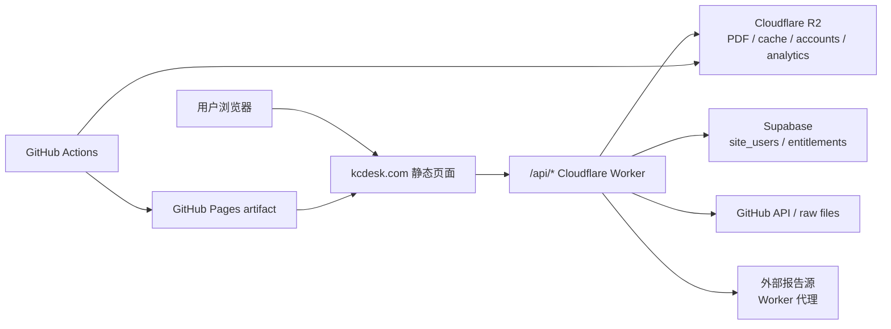

# kcdesk.com 技术架构文档

最后更新：2026-07-03
维护范围：`kcdesk.com` / KC Desk Notes 搜索站、报告详情页、外部报告检索、账号权限、管理后台、运营后台、每日文件缓存、访问埋点。

## 1. 总览

`kcdesk.com` 当前是一个轻前端、重 Worker 的静态站：

- 静态页面由 GitHub Actions 构建后部署到 GitHub Pages，再通过 `kcdesk.com` 访问。
- Cloudflare Worker 作为唯一后端入口，前端通过 `/api/...` 调用 Worker。
- 私有 PDF、外部报告缓存、账号兜底数据、每日文件缓存、访问埋点都存放在 Cloudflare R2。
- 账号主库优先走 Supabase；如果 Supabase 配置不可用，Worker 会回退到 R2 JSON 索引。
- 用户端只需要能访问 `kcdesk.com`。第三方检索、GitHub 文件、R2 下载等都由 Worker 代理或缓存，前端不直连上游。



## 2. 关键目录

| 路径 | 用途 |
| --- | --- |
| `kc_desk_notes/site_src/` | 前端源文件，包含首页、报告页、外部报告页、交付页、账号弹窗、管理后台 UI。 |
| `kc_desk_notes/data/catalog.json` | 长期报告 catalog，保留报告文字/元数据，PDF 可按容量策略归档。 |
| `kc_desk_notes/data/history_catalog.json` | 一次性导入的历史研报元数据（2025-12 ~ 2026-06 约 8900 篇，Text only，无 PDF）。 |
| `kc_desk_notes/data/history_text/shard_*.json.gz` | 历史研报的规范化检索文本分片，每篇截断 1 万字符。 |
| `scripts/import_history_reports.py` | 从本地 ib_rpt_history 抽取结果生成上面两个历史数据文件（一次性导入）。 |
| `kc_desk_notes/password_rules.json` | 通用密码 hash 和备用分组规则。 |
| `workers/kc-desk-notes-worker/src/index.js` | Cloudflare Worker 主逻辑，包含鉴权、下载、搜索代理、管理后台、缓存、埋点。 |
| `.github/workflows/kc-desk-notes-pages.yml` | 构建/部署 kcdesk.com 的主 workflow。 |
| `scripts/kc_desk_notes_catalog.py` | 扫描 Dropbox、生成/合并 catalog、同步 PDF 到 R2、执行 PDF 容量清理。 |
| `scripts/build_kc_desk_notes_site.py` | 生成 Pages artifact 和公开搜索索引。 |
| `scripts/translate_kc_desk_titles.py` | 用 DeepSeek 批量补中文标题。 |
| `kc_desk_notes/account_schema.sql` | Supabase 账号/权益/购买/使用事件 schema。 |

## 3. 构建与部署链路

主 workflow：`.github/workflows/kc-desk-notes-pages.yml`

触发：

- 定时：北京时间 09:30。
- 手动：Actions -> **KC Desk Notes Pages**。

流程：

1. 从 Dropbox `/zip_backup` 扫描 PDF。
2. `scripts/kc_desk_notes_catalog.py` 合并长期 catalog。
3. 解析 PDF 页数、首页宽高、横竖屏、文件大小等元数据。
4. 按 `storage_limit_gb` 控制 PDF 存储容量，默认 8 GiB。
5. 当前可用 PDF 上传到 R2，默认 key 为 `reports/<report_id>.pdf`。
6. `scripts/translate_kc_desk_titles.py` 用 DeepSeek 补缺失的中文标题，workers 默认 500。
7. `scripts/build_kc_desk_notes_site.py` 生成静态站 artifact：
   - `data/catalog.json`
   - `data/search_index.json`
   - `data/password_rules.json`
   - HTML/CSS/JS 静态资源
8. 部署 GitHub Pages。
9. 条件满足时部署 Cloudflare Worker，并写入 `CATALOG_URL`、`SEARCH_INDEX_URL`、`PASSWORD_RULES_URL` 等变量。
10. 提交更新后的 `kc_desk_notes/data/catalog.json`。

## 4. 前端页面

| 页面 | 文件 | 说明 |
| --- | --- | --- |
| 首页 | `kc_desk_notes/site_src/index.html` + `assets/app.js` | 报告搜索、机构/行业/日期/范围/PDF状态/页数筛选、外部报告检索、登录入口。 |
| 报告详情 | `kc_desk_notes/site_src/report.html` | 站内 PDF 报告详情、密码/账号下载、相关报告推荐。 |
| 外部报告详情 | `kc_desk_notes/site_src/doc.html` | “其他报告 / 报告A / 高权报告”的统一详情页。 |
| 交付页 | `kc_desk_notes/site_src/delivery.html` | 发货链接落地页，预填密码，但仍由客户点击下载按钮。 |
| 条款/退款 | `terms.html`、`refund.html` | 当前不展示自助支付，统一引导联系微信 `MacroGate`。 |

首页搜索策略：

- 站内 catalog 先在浏览器本地过滤和排序。
- 全文搜索索引来自 `data/search_index.json` + `data/search_index_history/`（历史研报文本分片，仅浏览器懒加载），只用于匹配，不展示长正文。
- 页数筛选支持 `5页以下`、`5-10页`、`10-20页`、`20页以上` 多选。
- 报告行统一 `target="_blank"` 打开新标签页，避免原页面跳转。
- 外部来源通过 Worker 实时搜索；上游不可用时尽量返回 R2 镜像缓存。

## 5. Worker API

Worker 支持 `/api/...` 路径，也兼容直接访问无 `/api` 的路径。

| Endpoint | 方法 | 用途 |
| --- | --- | --- |
| `/health` | GET | 健康检查。 |
| `/analytics` | POST | 前端访问/搜索/下载/发货链接埋点。 |
| `/captcha` | GET | 注册/登录验证码。 |
| `/auth` | GET/POST | 获取 session、注册、登录。 |
| `/entitlement` | GET | 查询当前账号权益。 |
| `/download` | POST | 站内 PDF 密码/账号校验后下载。 |
| `/calc` | GET | 隐藏的单篇报告密码计算器，需要 `CALC_KEY`。 |
| `/admin/login` | POST | 通用密钥入口，写入管理 token。 |
| `/admin/report-password` | POST | 管理端生成单篇报告密码/交付信息。 |
| `/account-admin/summary` | GET | 管理后台/运营后台总数据。 |
| `/account-admin/github-file` | GET | 每日文件下载，支持 R2 缓存和 Range。 |
| `/account-admin/github-artifact` | GET | GitHub artifact 下载，支持 R2 缓存和 Range。 |
| `/account-admin/report-pdf` | GET | 管理后台每日精选 PDF 下载。 |
| `/external/search` | GET | “其他报告”检索。 |
| `/external/pdf` | GET/POST | “其他报告”PDF 准备/下载。 |
| `/external/status` | GET | “其他报告”准备状态轮询。 |
| `/report-a/search` | GET | “报告A”检索，只返回站内格式，不跳上游页面。 |
| `/authority/search` | GET | “高权报告”检索。 |
| `/authority/pdf` | GET/POST | “高权报告”不下载，返回联系微信。 |
| `/paddle-config` | GET | 历史兼容接口；前台自助支付入口已下架。 |
| `/paddle-webhook` | POST | 历史兼容 webhook；当前售卖/权限开通走微信。 |

## 6. R2 数据分区

主 bucket 默认：`kc-desk-notes-pdfs`

| Prefix | 内容 |
| --- | --- |
| `reports/<report_id>.pdf` | 站内 Dropbox PDF 镜像。 |
| `reportify/<id>.pdf` | 历史命名的外部报告 PDF 缓存；用户端不展示这个名称。 |
| `reportify-status/<id>.json` | 外部报告后台准备状态；用户端不展示这个名称。 |
| `_account/...` | R2 兜底账号、权益、购买记录、GitHub 文件缓存。 |
| `_account/github-cache/...` | 管理后台/运营后台每日文件缓存。 |
| `_analytics/events/YYYY-MM-DD/...json` | 访问、搜索、打开报告、下载等埋点事件。 |
| `_search-cache/...` | 外部搜索实时缓存。 |
| `_search-mirror/...` | 外部搜索镜像结果。 |

PDF 容量策略：

- `storage_limit_gb` 默认 8 GiB。
- 超过上限时，只归档旧 PDF：`available=false`、`r2_synced=false`，并删除对应 R2 PDF。
- catalog、标题、日期、机构、页数和搜索文字继续保留。
- 前端搜索到已归档报告时显示 `Text only`，下载时提示联系微信 `MacroGate`。

文字索引策略：

- `scripts/build_kc_desk_notes_site.py` 生成 `search_index.json`。
- 可以通过 `--search-index-limit-gb` 控制公开文字索引大小。
- 超过上限时按日期移除旧文本索引，但 catalog 元数据仍保留。

历史研报（Text only）策略：

- `scripts/import_history_reports.py` 一次性把本地 `ib_rpt_history` 全文抽取结果导入为
  `history_catalog.json` + `history_text/shard_*.json.gz`，之后由日常构建自动合并。
- 构建时按标题与 Dropbox catalog 去重：重复的历史条目不重复上架，其文本挂到现有 report id 上。
- 历史全文输出到 `data/search_index_history/`（manifest + 按月分片），**只有浏览器加载**；
  Worker 仍只加载较小的 `search_index.json`，避免撑爆 Worker 128MB 内存。
- 前端懒加载：首屏只加载 catalog，不下载任何文字索引；页面空闲 3 秒或用户点击/输入
  搜索框时，先加载 `search_index.json` 再按月流式加载历史分片（新月份优先），每片
  解析后让出主线程，页面不会卡顿。报告详情页同样先渲染、后台补文字索引再刷新相关推荐。
- 历史文本不占 R2 容量（存放在 GitHub Pages artifact），PDF 8 GiB 容量策略不受影响。
- `--history-index-limit-gb`（默认 0.06 GiB ≈ 64 MB，浏览器可接受的加载量）超限时，
  从最老日期开始删除正文文本，标题/元数据仍在 catalog 里可搜。

## 7. 密码与交付

站内报告支持三种下载授权：

1. 已登录账号拥有 super/operator/annual 或单篇购买/授权。
2. 输入通用密码，也就是当前业务口径的万能密钥。
3. 输入按 report id 推导出的单篇伪密码。

单篇伪密码规则：

```text
KC-<base32(hmac_sha256(PASSWORD_SECRET, "kc-desk-notes:" + report_id)) 前 12 位，按 4-4-4 分组>
```

隐藏计算器：

```text
/api/calc?id=<report_id>&key=<CALC_KEY>
```

发货链接：

- 管理端生成链接时会把报告 id、标题、source 和密码带入 URL。
- 客户打开后密码自动填好。
- 页面不会自动下载，客户仍需要点击下载按钮，方便先看到相关报告推荐。

## 8. 账号与权限

账号主库：

- 优先 Supabase：`site_users`、`user_entitlements`、`report_purchases`、`usage_events`。
- Supabase 不可用时，Worker 使用 R2 JSON 兜底。

固定高权限账号：

| 账号 | 权限 |
| --- | --- |
| `twotigers` / `twotigers@users.kcdesk.com` | super，管理后台，看到用户信息、访问埋点、公众号发送时间、每日文件、每日精选。 |
| `liuxin` / `liuxin@users.kcdesk.com` | operator，运营后台，看到每日精选和每日文件，不看用户数据、访问埋点、公众号发送时间，不看站内视频。 |

前端入口：

- 登录后根据 `role` 显示“管理后台”或“运营后台”。
- 也保留一个隐藏的通用密钥入口，用于临时生成报告密码/发货链接。

## 9. 外部报告检索

用户端命名必须保持抽象：

- 外部源 E：前端显示为“其他报告”。
- 外部源 A：前端显示为“报告A”。
- 外部源 Q：前端显示为“高权报告”。

约束：

- 用户可见文案、按钮、链接名、详情页正文不展示真实上游品牌名或内部项目名。
- 前端不直接跳转上游原文；详情页统一走 `doc.html`。
- “其他报告”支持通用密码和单篇伪密码；有些 PDF 需要后台准备，页面轮询 `/external/status`。
- “报告A”只做检索线索展示，详情页格式和“其他报告”一致，需要原文时提示联系 `MacroGate`。
- “高权报告”只做检索线索展示，不提供下载，价格口径为普通外文 26 元/份、实时外文 46 元/份，详情页提示联系 `MacroGate`。
- 搜索次序和推荐次序：站内 Dropbox 报告 -> 其他报告 -> 报告A -> 高权报告。

## 10. 管理后台与运营后台

数据入口：`/api/account-admin/summary`

管理后台包含：

- 每日精选。
- 公众号发送时间。
- 每日文件。
- 访问与搜索埋点。
- 用户信息。

运营后台包含：

- 每日精选。
- 每日文件。
- 不包含用户信息、访问埋点、公众号发送时间。
- 不包含“站内视频”类文件。

### 每日精选

选择逻辑在 Worker：

- 从 catalog 最近日期开始选 5 篇。
- 排除明显个股分析。
- 优先宏观趋势、央行政策、利率、汇率、资产配置、全球经济等主题。
- 页数要求：大于 5 页、未知页数但分数足够，或横屏 PDF。
- 横屏 PDF 加权，尽量入选。

展示能力：

- 中文标题和英文标题。
- 介绍文案，使用英文报告名。
- tag 不带链接，只展示纯文本 `#宏观趋势` 这种格式。
- 一键复制文案。
- 下载报告。
- 保存 PDF 第一页为图片。

### 公众号发送时间

- 只在 super 管理后台显示。
- 来源目录：
  - `wechat_drafts/xhs_notes`
  - `wechat_drafts/institutions`
  - `wechat_drafts/consulting`
  - `wechat_drafts`
- 按 batch 展示头条/二条/三条等标题。
- 推荐发送窗口：北京时间当天 08:00 到次日 00:30 均匀分布。

## 11. 每日文件与视频缓存

每日文件来自多个 GitHub 路径：

| 来源 | Worker label | repo/path | 权限 |
| --- | --- | --- | --- |
| Market Views PDF | `Market Views PDF` | 当前 repo `market_view_summaries` | super/operator |
| BBG Top Videos | `BBG Top Videos` | `yt-feng/bbg-show/rendered-clips/top-videos` | super/operator |
| BBG Show 视频 | `BBG Show 视频` | `yt-feng/bbg-show/rendered-clips/<date>` | super/operator |
| ARK Invest 视频 | `ARK Invest 视频` | `yt-feng/bbg-show/rendered-clips/ark-invest` | super/operator |
| KC 娱乐视频 | `KC 娱乐视频` | `yt-feng/entertain_cut/outputs/kc_entertain/YYYY-MM-DD/*.mp4` | super/operator |
| 站内视频 | `站内视频` | 当前 repo `bilingual_podcast_videos` | super only |

缓存与加速：

- Worker cron 每 30 分钟执行 `warmAdminGithubCache`。
- 打开/刷新管理后台或运营后台时，也会异步触发一次预热。
- 预热会把最新每日文件缓存到 R2 `_account/github-cache/...`。
- 缓存保留 3 天，Worker 按文件日期或缓存时间清理。
- 下载 endpoint 支持 HTTP Range。
- 前端对 mp4、以及大于 5 MB 的 pdf/zip 使用分段下载，显示进度条和取消按钮。
- 中国大陆员工只需要下载 `kcdesk.com/api/account-admin/github-file...`，不需要直连 GitHub raw。

坚果云运营镜像：

- `.github/workflows/kcdesk-ops-jianguoyun-sync.yml` 每小时在北京时间 08:15 至次日 00:15 运行，并回补最近 3 天。
- `scripts/sync_ops_videos_to_jianguoyun.py` 从运营后台可见的视频源发现文件，上传到 `/我的坚果云/KCdesk/Ops/YYYY-MM-DD/<类型>/`。
- 镜像类型包括 `BBG Show`、`BBG Top Videos`、`ARK Invest`、`报告视频`、`KC娱乐`；管理员专属的“站内视频”不进入运营镜像。
- 上传按远端文件大小幂等跳过；同目录同名文件自动加短 hash，避免覆盖。
- WebDAV 只清理符合 `YYYY-MM-DD` 的过期日期目录，始终保留最近 3 个北京时间自然日。

视频账号标注：

- BBG 系列根据标题规则标注 `KC桌面` 或 `KC偏见`。
- 同一段原始视频、同一个人的分享视频必须统一账号；Worker 用同源视频多数原则修正。
- `outputs/kc_entertain` 固定标注 `KC娱乐`，不参与 `KC桌面`/`KC偏见` 二选一。

## 12. 访问埋点

前端调用 `/api/analytics` 记录：

- `page_view`
- `search`
- `report_open`
- `download_attempt`
- `download_success`
- `download_error`
- `delivery_link`

存储：

```text
_analytics/events/YYYY-MM-DD/<timestamp>-<random>.json
```

dashboard：

- 只在 `twotigers` super 管理后台显示。
- 默认看近 30 天。
- 展示访客数、搜索数、报告打开、下载、发货链接、热门搜索、热门报告、最近事件。
- visitor id 存在浏览器本地，Worker 同时保存 IP hash，避免直接保存明文 IP。

## 13. 搜索镜像与中国大陆访问

目标：用户端只要能访问 `kcdesk.com`，就能使用站内和外部检索。

实现：

- 外部检索全部走 Worker endpoint。
- Worker 每次搜索优先实时请求上游，并写入 R2 搜索缓存。
- 上游超时或不可用时，使用 `_search-cache` 或 `_search-mirror` 返回最近可用结果。
- `KC Search Mirror` workflow 负责维护镜像结果。
- 前端会显示加载动画，外部结果多等一会也仍留在当前页面。

## 14. 支付现状

当前前台自助支付已经下架：

- 站点不展示定价按钮或 checkout。
- 获取权限、开通报告、售后统一引导联系微信 `MacroGate`。
- Worker 中的 Paddle 配置、webhook、entitlement 处理保留为历史兼容代码，不作为当前用户路径。

如果未来重启支付，需要同时更新：

- 前台定价入口。
- Worker `paddle-config` / `paddle-webhook`。
- Supabase `user_entitlements` / `report_purchases`。
- 域名和商品合规说明页面。

## 15. Secrets / Vars 清单

主 workflow / Worker 常用配置：

| 名称 | 类型 | 用途 |
| --- | --- | --- |
| `DROPBOX_APP_KEY` | secret | 读取 Dropbox PDF。 |
| `DROPBOX_APP_SECRET` | secret | 读取 Dropbox PDF。 |
| `DROPBOX_REFRESH_TOKEN` | secret | 读取 Dropbox PDF。 |
| `DEEPSEEK_API_KEY` | secret | 标题翻译、正文/文案链路。 |
| `R2_ACCOUNT_ID` | secret/var | R2 account id。 |
| `R2_ACCESS_KEY_ID` | secret | R2 S3 上传/删除。 |
| `R2_SECRET_ACCESS_KEY` | secret | R2 S3 上传/删除。 |
| `R2_BUCKET` | secret/var | R2 bucket 名。 |
| `R2_OBJECT_PREFIX` | var | 站内 PDF 前缀，默认 `reports`。 |
| `PASSWORD_SECRET` | secret | 下载密码 hash pepper 和单篇密码 HMAC。 |
| `CALC_KEY` | secret | 隐藏计算器 key。 |
| `KC_DESK_DOWNLOAD_PASSWORD` | secret | 通用下载密码。 |
| `KC_DESK_MASTER_KEY` | secret | 管理密钥，缺省可回退通用密码。 |
| `AUTH_SECRET` | secret | 账号/session token 签名。 |
| `SUPABASE_URL` | secret/var | Supabase REST endpoint。 |
| `SUPABASE_SERVICE_ROLE_KEY` | secret | Supabase service role。 |
| `GH_READ_TOKEN` | secret | 读取 GitHub 文件/私有 repo。 |
| `GH_DISPATCH_TOKEN` | secret | 触发后台准备 workflow。 |
| `JIANGUOYUN_WEBDAV_URL` | secret | 坚果云 WebDAV endpoint。 |
| `JIANGUOYUN_WEBDAV_USERNAME` | secret | 坚果云 WebDAV 账号。 |
| `JIANGUOYUN_WEBDAV_PASSWORD` | secret | 坚果云应用密码。 |
| `CLOUDFLARE_API_TOKEN` | secret | 部署 Worker。 |
| `CLOUDFLARE_ACCOUNT_ID` | secret/var | 部署 Worker / R2。 |
| `KC_DESK_WORKER_URL` | var | Pages 前端 API base，生产通常为 `/api`。 |
| `KC_DESK_PAGES_URL` | var | Worker 读取 catalog/search/password 的 Pages URL。 |

## 16. 常见维护入口

重新构建站点：

```bash
gh workflow run "KC Desk Notes Pages" \
  --repo yt-feng/rpt_edit \
  --ref main \
  -f dropbox_root=/zip_backup \
  -f days=0 \
  -f sync_r2=true \
  -f force_upload=false \
  -f storage_limit_gb=8 \
  -f deploy_worker=true
```

只部署 Worker：

```bash
gh workflow run "KC Desk Notes Pages" \
  --repo yt-feng/rpt_edit \
  --ref main \
  -f dropbox_root=/zip_backup \
  -f days=0 \
  -f sync_r2=false \
  -f force_upload=false \
  -f storage_limit_gb=8 \
  -f deploy_worker=true
```

本地检查 Worker 语法：

```bash
node --check workers/kc-desk-notes-worker/src/index.js
```

健康检查：

```bash
curl -s https://kcdesk.com/api/health
```

## 17. 命名约束

面向用户的页面、链接、按钮和状态文案只使用产品命名：

- `其他报告`
- `报告A`
- `高权报告`
- `MacroGate`
- `KC桌面`
- `KC偏见`
- `KC娱乐`

不要在用户可见页面出现真实上游品牌名、内部抓取项目名、第三方 API 域名、后台实现路径或调试词。源码内部常量、历史 R2 prefix、workflow 文件名可以保留，但新增 UI 文案要按上面的产品命名。
