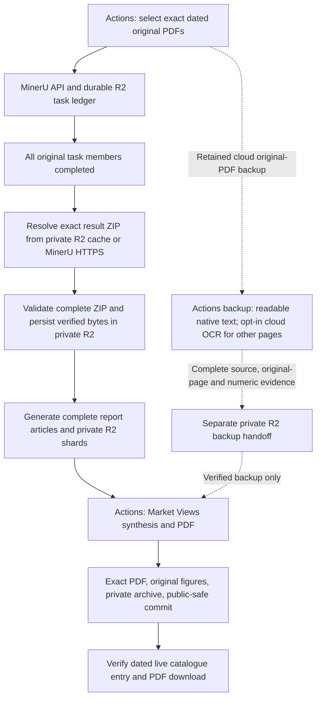

# Market Views source recovery

## Primary architecture

Market Views uses **MinerU API parsing on GitHub Actions** as its primary source
pipeline. The Daily report workflow selects the exact bank PDF batch, preserves
source/task bindings, retrieves complete MinerU results, generates report
articles and hands complete shards through private R2 to
[`market-views-latex-pdf.yml`](../.github/workflows/market-views-latex-pdf.yml).
The Market Views workflow synthesizes and renders the PDF, archives the exact
private version, commits its validated public-safe copy and exposes the dated
catalogue entry. Scheduled processing and recovery run in the cloud; the user's
computer is not a production dependency. The repository architecture map is
[Automation Pipeline Overview](pipeline-overview-v2.md).

Provider completion, result retrieval, complete handoff, PDF creation, public
commit and live delivery are separate acceptance steps. A green workflow or a
MinerU `done` row does not establish that the next step succeeded. Partial
original batches do not release result rows to generation, even when the
requested subset has completed. See
[MinerU in-flight recovery](mineru-inflight-recovery.md) for the exact gates.

## Recovery within the MinerU chain

The durable client can move to another configured key only after HTTP 401 or
explicit `A0202`/`A0211` authentication rejection without a submission
acknowledgement. It saves the rejection before trying another key. Accepted
tasks retain their original credential, batch ID, PDF bytes and complete batch
membership. Polling failures, timeouts, parsing failures, conflicting
acknowledgements and ambiguous submissions do not authorize resubmission.
Changing a key cannot fix a shared result-download certificate.

The explicit cloud recovery entry is
[`market-views-mineru-recovery.yml`](../.github/workflows/market-views-mineru-recovery.yml).
It verifies the exact original artifact, manifest, PDF bytes and original task
membership. Every completed original ZIP must be retrieved and verified before retrying a
failed member. A reviewed failure code or exact message hash authorizes at most
two durable child attempts; only failed members are submitted. Original task and
source records retain their original identity and credential. Ambiguous
submissions and pending children block further submissions. Recovery releases
sources only after every original member is covered by a successful original or
child result. Its separate private receipt binds the complete source inventory,
result files, lineage, recovery run and executing commit before PDF synthesis.

The one-page cloud smoke test
[`mineru-api-smoke.yml`](../.github/workflows/mineru-api-smoke.yml) exercises a new
synthetic PDF through parsing and complete ZIP download, then verifies fixed text
and numeric evidence. It has an independent task scope and a per-run immutable
source guard; rerunning an accepted or ambiguous task cannot create another parse.

Use cloud read-only diagnostics to distinguish current credential/API health,
task state and result retrieval. The diagnostic entry is **Diagnose MinerU API
and saved results**
([`mineru-api-diagnostics.yml`](../.github/workflows/mineru-api-diagnostics.yml)).
It reads the exact retained private inspection receipt, probes each configured
credential, and checks result-host TLS/HEAD responses plus an optional four-byte
ZIP prefix. Its safe summary separates `historical_tasks`, `authentication` and
`result_download`; a prefix probe explicitly reports `full_zip_verified=false`.
It submits no parsing task, changes no canonical claim and sends no email.
Authentication, new parsing and result delivery require separate cloud probes;
a successful small download probe does not establish complete ZIP retrieval.

The existing
[`mineru-durable-inspect.yml`](../.github/workflows/mineru-durable-inspect.yml)
reads exact original tasks and preserves their complete provider response in a
separate private R2 receipt. The receipt layout, diagnostic inputs and historical
inspection identity are documented in
[MinerU in-flight recovery](mineru-inflight-recovery.md).
Public failure counts and message hashes do not establish a provider error's
cause.

## Private R2 result persistence

The private result cache in `scripts/mineru_result_cache.py` is shared by the
R2-backed Dropbox parser and the exact-task recovery path. Its immutable identity
binds the frozen PDF bytes, source options and original or recovery-child task.
It does not use a signed result URL as the identity. A successful complete ZIP is
validated, saved with its SHA-256 and read back immediately, before article or PDF
generation. A later report failure therefore retains the earlier source result.
Reruns still verify current provider task membership and the complete original
batch; a matching cache hit supplies the ZIP without another CDN download.
Corrupt or mismatched cache evidence stops processing rather than substituting
another source. Raw ZIPs remain private and outside public handoff artifacts.

R2 is also checked for existing source-generation checkpoints and exact final
PDFs through `market-views-r2-cache-inspect.yml`. A checkpoint identity and archive
hash are not by themselves proof that it matches the current original batch;
complete source bindings must be verified before reuse. The independent
`mineru-cloudflare-tls-probe.yml` creates an authenticated temporary Worker to
make one strict HTTPS HEAD request to the public MinerU result CDN. It does not
download a ZIP or mirror it into R2. A valid HTTP response identifies another
potential cloud retrieval path; invalid-certificate or fetch failure still
requires further resolution before any missing source can enter R2.

The manual probe accepts `default`, `gcp:asia-east1` or `azure:southeastasia`
placement for its newly created temporary Worker. Region hints use Cloudflare's
[documented placement API](https://developers.cloudflare.com/workers/configuration/placement/)
without changing the official result hostname or HTTPS verification. The
incoming request's `request.cf.colo` records ingress only. Execution location is
reported only when the platform supplies a valid `cf-placement` response header;
a requested region does not prove execution there. Every probe retains one
provider HEAD, zero result ZIP downloads, zero parsing submissions and cleanup.

The independent `mineru-result-tls-probe.yml` also records two strict public-host
OpenSSL handshakes: default negotiation and a TLS 1.2 RSA diagnostic. Each makes
one TLS connection and no HTTP request. The bounded peer-provided certificate
chain records public subjects, issuers, validity dates and fingerprints plus
verification code/depth. This is distinct from a constructed trusted chain and
from complete ZIP validation. The parameters apply only to that manual cloud
diagnostic; production TLS configuration is unchanged.

The separate manual-only
[`mineru-result-cache-seed.yml`](../.github/workflows/mineru-result-cache-seed.yml)
can retrieve completed original tasks with a fixed, previously observed leaf
certificate identity. This cloud recovery is limited to
`cdn-mineru.openxlab.org.cn`, SHA-256
`12137420c572ee3fde42af27309c8f36efdfc4d07e76dcba801ddf6bc308aeb3`,
and the fixed cutoff `2026-10-04T23:59:59Z`. It first verifies the exact leaf and
peer chain against system and certifi roots at the last instant before that
leaf's expiry, including server purpose and hostname. This is historical chain
verification plus exact-leaf authentication; it is explicitly **not current PKI
verification**. The dedicated connection asserts the same leaf before HTTP,
rejects redirects and other origins, and checks the cutoff before connections,
body reads and private R2 writes. Normal daily HTTPS verification is unchanged.

Before downloading any ZIP, the seeder verifies the full original Daily
artifact, every PDF hash/date binding and all accepted original task members
through read-only provider lookups. It makes no parsing submission or canonical
ledger write. The default one-result canary validates the complete ZIP, stores a
separate immutable authentication receipt and the existing immutable result
cache, and reads both back. The `all` option covers completed original results;
failed members remain failures and still require the bounded recovery path.
The cache-only summary cannot establish a complete handoff or restored PDF.
The new transport requires cloud canary validation before it is reported as
working, and it cannot extend its own cutoff.

The bank source date owns the Market Views issue. Auxiliary sources use the
latest usable date on or before that bank date; a future auxiliary date cannot
rename or suppress the bank issue. Private handoff run IDs and report/shard
counts are validated before materialization.

## Retained cloud backup and its current limits

The original-PDF branch is a backup for Market Views. Its deployed implementation
uses readable native PDF text, original exhibit pages and explicitly enabled
cloud OCR for otherwise unsupported pages. It makes no MinerU submission and
runs on GitHub Actions. It preserves the failed report-notes conclusion;
WeChat and translation keep their normal completion gates. It is not the primary
parser and does not depend on local OCR or a user's computer.

The original backup rejected duplicate contents and scanned pages with zero
native text. The opt-in extension
retains every exact filename and SHA-256 binding while extracting and summarizing
identical PDF contents once. It checks readable language and table structure,
rather than admitting opaque strings solely by character count. Encrypted or
damaged PDFs, incomplete inventory and mismatched bytes still reject the batch.
Unsupported pages require `--enable-ocr`; full-page Tesseract OCR uses
`eng+chi_sim` at 300 dpi, retaining the original page image, raw transcript,
page coordinates, model hashes and rendering provenance. An all-white page is
accepted only with empty native text and pixel evidence.

Independent full-page and cropped numeric reads compare source positions and
actual decimal, minus, percent and negative-parenthesis pixels. Confirmed values
can enter source summaries; conflicting or omitted fields remain explicit
`[数值待核对:...]` markers with private evidence. The model must not guess or
calculate with those fields. This evidence is checked again by the PDF consumer.
The schema-2 receipt also binds the date, producer run, executing commit and
original Daily source run before synthesis or an existing-PDF skip. Report
coverage distinguishes all original file aliases from unique-content summaries.
Numbered source captions select original full-page images; uncaptioned visuals
are not inferred or redrawn.

The old eight-file experiment remains preserved as an immutable
[experimental backup patch](experiments/market-views-ocr-fallback-20261004.md).
The current implementation adds cloud dependencies and stronger gates. Local
tests do not establish cloud recovery or publication; real OCR regression
dependencies are mandatory in CI, and full actual-report quality review is
required before enabling daily OCR backup.

[`market-views-native-recovery.yml`](../.github/workflows/market-views-native-recovery.yml)
accepts an exact `date_folder` and `expected_articles`, with `enable_ocr=false`
and `generate_pdf=true` defaults. `generate_pdf=false` performs complete source
validation and private R2 handoff without synthesis or model calls, retaining
the handoff for quality review. Daily OCR fallback uses the separate repository
variable `MARKET_VIEWS_OCR_BACKUP_ENABLED`; absent or false leaves OCR disabled.
`source_run_id` reuses the
original Daily report artifact; with no source run ID it downloads that exact
Dropbox date and binds a fresh manifest. It does not classify or submit those
PDFs to MinerU. A complete source receipt is checked before synthesis or an
existing-PDF skip. Backup handoffs use a separate private R2 prefix; temporary
inputs are deleted only after their PDF consumer succeeds, and failed/cancelled
consumers retain their inputs.

## Recorded incident and remaining acceptance

The public catalogue observed on 2026-10-04 had `market-view:260930` as its newest
entry. Saved Daily report diagnostics after that date show late Dropbox batches,
terminal MinerU failures and a result-download certificate failure at
`cdn-mineru.openxlab.org.cn`. The 2026-10-03 inspection of run `37159099752`
counted 36 provider-completed PDFs and 18 terminal failures. The specific cause
of those 18 failures remains unverified. The certificate error was observed while
retrieving already completed results; it does not establish current API health.

Four configured MinerU key slots were loaded in the saved run. The token page
was observed in Chrome on 2026-10-04 with four valid tokens and one older token
expired on October 2. That view does not establish which credentials the
historical tasks used, or that every API endpoint and result host is healthy.

Cloud diagnostic run `37211677994` verified all four configured key slots through
authenticated task lookup on 2026-10-04. The retained 18 failures were classified
from actual provider messages as `provider_internal`, with no supplied error code.
The first retained completed ZIP's host still failed certificate validation as
expired; no result GET or new task POST followed that failure.

Cloud smoke run `37212761333`
accepted and completed one newly uploaded synthetic PDF on 2026-10-04. Its
result download then failed with `tls_certificate_expired`, with zero downloaded
bytes and `complete_zip_verified=false`. This directly establishes current
authentication, upload and parsing success for that task. It also reproduces the
result-delivery blocker independently of the historical failures. The smoke task
is retained durably; rerunning the same run reuses its accepted task instead of
submitting another PDF. Complete dated Market Views delivery is still unverified.

The deployed exact-source recovery was exercised in run `37214015946` using the
54 selected originals from Daily producer `37159099752`. Its source recovery
step stopped with `tls_certificate_expired` before reaching child submission or
PDF generation. The bounded recovery code was merged in PR 220; the original
36 completed results therefore still require valid result delivery.

PR 221 was merged after ordinary GitHub access resumed. Cloud comparison run
`37217880580` at 2026-10-04 16:45 UTC independently checked the public result-CDN
root using the system CA store and certifi `2026.07.22`. Both strict clients
reported `tls_certificate_expired`, with no HTTP response or body bytes. This
rules out a failure confined to the older system trust store; it does not prove
that every CDN edge serves the same certificate or restore any dated issue.

PR 222 merged the complete-ZIP result cache and the cloud R2/Cloudflare
diagnostics at commit `4c7ae7abc53cb25f977491b5c9ae44a8af5658a6`. Read-only R2
inventory run `37219229168` completed successfully on 2026-10-04 17:06 UTC. For
each of `261001`, `261002` and `261003`, the exact generation-cache and original
producer-handoff prefixes had zero objects, with complete listings; canonical
final PDF/item objects were also absent. This is evidence for those configured
paths, not a bucket-wide assertion. Existing ledger task metadata cannot replace
the missing source material.

The first temporary-Worker run `37219241529` created and enabled the isolated
Worker, but its immediate `/probe` request returned HTTP 404. The run then deleted
the Worker successfully. No MinerU result response or ZIP was verified. Worker
deployment propagation must be distinguished from an upstream CDN failure; the
probe now checks an authenticated `/ready` endpoint that makes no provider
request, allowing only bounded deployment-404 waits before its single CDN HEAD.

PR 223 merged the readiness check at
`d0138a57a32e4722eb65c57914434647d1d52ee6`. Cloudflare run `37229206987` on
2026-10-04 19:42 UTC received readiness HTTP 404 then HTTP 200 after five seconds.
Its authenticated handler then made exactly one strict HTTPS HEAD to the official
CDN root and received HTTP 526 (`tls_invalid_certificate`). The recorded LAX
value identifies request ingress; that run did not separately prove execution location.
The temporary Worker was successfully deleted. Zero ZIP downloads, provider
POSTs and R2 writes occurred. This is CDN evidence, unlike the earlier deployment
404, and does not establish the certificate state of every possible CDN edge.

Attempt 2 of smoke run `37212761333` at the same time resumed the existing
completed one-page task with zero provider POSTs. Authentication was accepted
and the task still had one completed result; result retrieval again stopped with
`tls_certificate_expired`, zero ZIP bytes and no marker verification. Thus a
Cloudflare-to-R2 mirror has no verified upstream delivery path in these probes.
The new ZIP cache prevents loss of future successful downloads but does not
restore currently absent source bytes. A valid official result download path is
still required before the missing dated PDFs can be built.

Attempt 3 of the same smoke run at 2026-10-04 19:57 UTC retained the existing
completed task, made zero parsing POSTs and again stopped at download with
`tls_certificate_expired` and zero bytes. Separately, a read-only TLS handshake
to the same official hostname observed a valid Let's Encrypt YR1 chain with leaf
validity 2026-09-17 through 2026-12-16. That handshake did not retrieve a result
ZIP and does not establish runner or Cloudflare retrieval success. These
different observations require testing a legitimate cloud retrieval path rather
than describing every CDN edge as expired. Regional Cloudflare probes are
available for that test; region selection alone is not success evidence.

Readiness-verified regional run `37231111280` used `gcp:asia-east1` and the
platform reported `cf-placement: remote-TPE`; its single strict HEAD received
HTTP 526. Run `37231384448` used `azure:southeastasia` with
`cf-placement: remote-SIN` and also received HTTP 526. Both temporary Workers
were deleted successfully, with zero ZIP downloads, provider POSTs or R2 writes.
Thus the tested Taipei and Singapore cloud routes have not provided a valid
upstream ZIP for an R2 mirror.

Runner certificate-chain diagnostic `37232259586` on 2026-10-04 received the same
`*.openxlab.org.cn` leaf issued by RapidSSL TLS RSA CA G1 in both default and
TLS 1.2 RSA handshakes. It expired at **2026-10-02 23:59:59 UTC**; both handshakes
reported verification code 10 at depth 0, identifying the expired website leaf.
The independently observed valid Let's Encrypt chain on another connection does
not verify runner ZIP retrieval. These diagnostics downloaded no complete ZIP.
For the primary MinerU chain, verified upstream ZIP bytes must be retrieved
before R2 persistence can supply the missing source.

PR 228 merged at `f7c5a0097b86a37670c54b91c2988bd8b2557deb`. The independent
GitHub-hosted macOS ARM64 diagnostic `37233771704` at 2026-10-04 20:53 UTC also
failed strict validation. Default and TLS 1.2 RSA handshakes received the same
RapidSSL leaf and peer chain as the earlier runner, with leaf SHA-256
`12137420c572ee3fde42af27309c8f36efdfc4d07e76dcba801ddf6bc308aeb3` and code 10
at depth 0. Neither system CA nor certifi retrieved an HTTP response or ZIP bytes.
Changing the cloud runner OS therefore did not restore the tested download path.
The same accepted synthetic task was checked again in smoke attempt 4 at
2026-10-04 21:28 UTC: authentication and parsing still passed, no new task was
submitted, and strict result retrieval again failed with
`tls_certificate_expired`, zero downloaded bytes and no verified ZIP.
The [provider incident draft](experiments/mineru-result-download-incident-20261004.md)
is prepared but remains unsubmitted; submission permission has been requested
and no approval has been received.

The earlier 2026-10-03 22:34 UTC inventory note recorded `261002=4`; that count
was not independently revalidated and is superseded by the complete current
Dropbox listing and successful download of **50 PDFs** in `261002`. This does not
establish why the earlier count differed or that it belonged to another date.
Fresh recovery preserves Daily's default `selection_mode=all` scope; it must not
truncate the current batch to fit the earlier count. Run `37232193875` correctly
stopped before OCR because its expected count was still 4.

Original October 2 Daily run `37067138754` stopped at source intake: it expected
`261003`, found latest folder `261001`, and rejected age 2 against allowed ages
0–1. It downloaded no original October 2 batch and reached no MinerU parsing;
that run cannot supply an original-PDF recovery artifact for `261002`.

Current cloud source-only recovery runs are recorded separately from PDF
publication. They use `generate_pdf=false`; a successful handoff retains
original page and numeric evidence for review:

| Bank date | Source-only run | Bound original scope | Recorded state |
| --- | --- | --- | --- |
| `261001` | `37232969584` | Producer `36932674491`; 63 files, 62 unique contents | Failed at report ordinal 10, page 9; no complete handoff |
| `261002` | `37233084607` | Fresh exact Dropbox listing; 50 files; original source run explicitly empty | Failed at report ordinal 6, page 5; no complete handoff |
| `261003` | `37231899669` | Producer `37159099752`; 54 files, 1,029 pages | Failed during complete-source extraction; no complete handoff |
| `261004` | `37233077480` | Producer `37232504334`; 4 unique files, date and `content_sha256` verified | Source contract passed; private R2 handoff saved; consumer numeric fixture rejected |

October 4 source-only extraction completed successfully with all 4 originals
and 4 unique contents: 109 pages, including 82 native-text pages, 27 OCR pages
and no blank pages. Its source-contract audit passed, but
`fixture_acceptance=not_requested` means this run did not establish visual numeric
fixture acceptance. The receipt observed 1,775 numeric mentions: 1,334 primary
mentions (354 verified, 8 corrected, 972 unresolved) plus 441 secondary mentions.
In total 1,413 remained unconfirmed and excluded from usable numeric claims.
Successful source coverage is therefore separate from numeric quality approval.
Merged PR 229 adds consumer readiness and a known-field fixture audit,
including the visual `17%` field, before model synthesis. Its two focused test
suites passed 12 and 17 tests, respectively. PRs 228 and 229 are merged on main
at the recorded `0ead65e` state. Real October 4 consumer run `37235097133`
stopped with **`field_unresolved`** for the visual `17%` field; this was a numeric
fixture failure, not a fixture-input format rejection. It made zero model calls
and generated zero PDFs. The guard has now run against the real handoff, but
numeric quality and October 4 PDF/live delivery remain unaccepted.

October 3 run `37231899669` failed at 2026-10-04 20:55:55 UTC in “Extract and
verify the complete original source batch”, reporting a generic
`SourceValidationError` for report ordinal 24, page 49. The cause remains under
investigation against that exact source page. Visual inspection identified a
short disclosure-appendix divider. Earlier reports had already used
OCR successfully; this generic error does not establish missing Tesseract
models. The run produced no complete R2 source archive and reached neither the
complete-source auditor nor golden-fixture acceptance. October 1 source run
`37232969584` also failed at report ordinal 10, page 9; that original page is a
short Q&A divider. October 2 run `37233084607` failed at report ordinal 6, page 5;
its original page type has not yet been inspected. All three complete-source
extractions failed; none has a complete R2 handoff. PR 230 merged the narrow
short-structure OCR fix at `2bebbacb`, with all 43 source tests (including six
actual cloud OCR cases) and 32 receipt-audit tests passing in cloud regression
`37236018141`. It also adds bounded numeric-only evidence for rejected fixtures.
This tests the failure class; it does not claim that the failed complete source
batches have been rebuilt. The October 2 failure is not assumed to have the same
cause.

The manual `market-views-ocr-field-probe.yml` workflow verifies a complete,
exact-date original Daily artifact and all original hashes before recognizing
only explicitly requested fixture pages. It uses the production field matcher
and emits sanitized numeric diagnostics. Its output always declares
`page_probe_only=true`, `complete_source_handoff=false`, and
`production_acceptance=false`; it cannot admit a partial source, invoke a model,
publish a PDF or provide a consumer handoff. This probe supports fast actual
field diagnosis before another complete-source run.

Real R2 diagnostic run `37236412568` isolated the October 4 rejection: the
original and 450dpi field reads were `17%`; the two 600dpi crop reads were
`317%` and `17%`. The wide crop included neighboring glyphs, while the percent
pixel witness was present. The numeric reader now isolates the 600dpi OCR crop
and records its clip, policy and pixel size. The independent, wider 300dpi
punctuation witness and requirement for three agreeing positioned reads remain
in place, and existing immutable receipts remain compatible. Actual fixture
acceptance and a rebuilt complete source remain separate pending checks.

Recovery is complete only after the
matching cloud source and retrieval gates, exact dated PDF, original figures,
private archive, public-safe commit and live catalogue/download are verified.
Neither the retained native backup nor the saved OCR experiment establishes
that delivery has been restored.

Current real-source admission review checked all 54 original PDFs from producer
`37159099752`: each hash matched its original manifest, with 54 unique contents
and 1,029 pages. The stronger language gate classified 798 pages as readable,
21 opaque-string pages and 210 pages with insufficient native text. Approximately
231 pages therefore require cloud OCR. This inventory audit is not a successful
OCR extraction. Five real numeric golden fixtures are available for cloud
quality checks, but the failed October 3 run did not reach their acceptance.
Complete actual-report extraction and review remain outstanding.
Verified private handoff, missing dated PDF delivery and daily OCR switch
enablement remain acceptance steps; `MARKET_VIEWS_OCR_BACKUP_ENABLED` remains
false and no restored dated PDF/live delivery is claimed.
