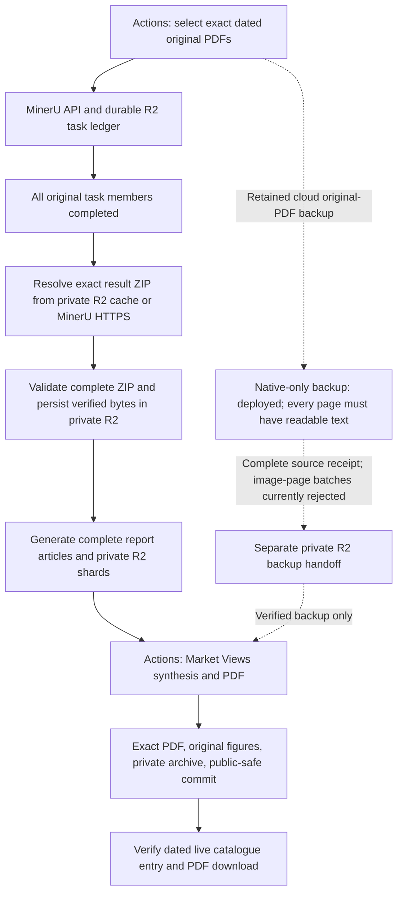

# Market Views source recovery

## Primary architecture

Market Views uses **MinerU API parsing on GitHub Actions** as its primary source
pipeline. The Daily report workflow selects the exact bank PDF batch, preserves
source/task bindings, retrieves complete MinerU results, generates report
articles and hands complete shards through private R2 to
[`market-views-latex-pdf.yml`](../.github/workflows/market-views-latex-pdf.yml).
The Market Views workflow synthesizes and renders the PDF, archives the exact
private version, commits its validated public-safe copy and exposes the dated
catalogue entry. Scheduled processing and recovery run in the cloud; the user's
computer is not a production dependency. The repository architecture map is
[Automation Pipeline Overview](pipeline-overview-v2.md).

Provider completion, result retrieval, complete handoff, PDF creation, public
commit and live delivery are separate acceptance steps. A green workflow or a
MinerU `done` row does not establish that the next step succeeded. Partial
original batches do not release result rows to generation, even when the
requested subset has completed. See
[MinerU in-flight recovery](mineru-inflight-recovery.md) for the exact gates.

## Recovery within the MinerU chain

The durable client can move to another configured key only after HTTP 401 or
explicit `A0202`/`A0211` authentication rejection without a submission
acknowledgement. It saves the rejection before trying another key. Accepted
tasks retain their original credential, batch ID, PDF bytes and complete batch
membership. Polling failures, timeouts, parsing failures, conflicting
acknowledgements and ambiguous submissions do not authorize resubmission.
Changing a key cannot fix a shared result-download certificate.

The explicit cloud recovery entry is
[`market-views-mineru-recovery.yml`](../.github/workflows/market-views-mineru-recovery.yml).
It verifies the exact original artifact, manifest, PDF bytes and original task
membership. Every completed original ZIP must be retrieved and verified before retrying a
failed member. A reviewed failure code or exact message hash authorizes at most
two durable child attempts; only failed members are submitted. Original task and
source records retain their original identity and credential. Ambiguous
submissions and pending children block further submissions. Recovery releases
sources only after every original member is covered by a successful original or
child result. Its separate private receipt binds the complete source inventory,
result files, lineage, recovery run and executing commit before PDF synthesis.

The one-page cloud smoke test
[`mineru-api-smoke.yml`](../.github/workflows/mineru-api-smoke.yml) exercises a new
synthetic PDF through parsing and complete ZIP download, then verifies fixed text
and numeric evidence. It has an independent task scope and a per-run immutable
source guard; rerunning an accepted or ambiguous task cannot create another parse.

Use cloud read-only diagnostics to distinguish current credential/API health,
task state and result retrieval. The diagnostic entry is **Diagnose MinerU API
and saved results**
([`mineru-api-diagnostics.yml`](../.github/workflows/mineru-api-diagnostics.yml)).
It reads the exact retained private inspection receipt, probes each configured
credential, and checks result-host TLS/HEAD responses plus an optional four-byte
ZIP prefix. Its safe summary separates `historical_tasks`, `authentication` and
`result_download`; a prefix probe explicitly reports `full_zip_verified=false`.
It submits no parsing task, changes no canonical claim and sends no email.
Authentication, new parsing and result delivery require separate cloud probes;
a successful small download probe does not establish complete ZIP retrieval.

The existing
[`mineru-durable-inspect.yml`](../.github/workflows/mineru-durable-inspect.yml)
reads exact original tasks and preserves their complete provider response in a
separate private R2 receipt. The receipt layout, diagnostic inputs and historical
inspection identity are documented in
[MinerU in-flight recovery](mineru-inflight-recovery.md).
Public failure counts and message hashes do not establish a provider error's
cause.

## Private R2 result persistence

The private result cache in `scripts/mineru_result_cache.py` is shared by the
R2-backed Dropbox parser and the exact-task recovery path. Its immutable identity
binds the frozen PDF bytes, source options and original or recovery-child task.
It does not use a signed result URL as the identity. A successful complete ZIP is
validated, saved with its SHA-256 and read back immediately, before article or PDF
generation. A later report failure therefore retains the earlier source result.
Reruns still verify current provider task membership and the complete original
batch; a matching cache hit supplies the ZIP without another CDN download.
Corrupt or mismatched cache evidence stops processing rather than substituting
another source. Raw ZIPs remain private and outside public handoff artifacts.

R2 is also checked for existing source-generation checkpoints and exact final
PDFs through `market-views-r2-cache-inspect.yml`. A checkpoint identity and archive
hash are not by themselves proof that it matches the current original batch;
complete source bindings must be verified before reuse. The independent
`mineru-cloudflare-tls-probe.yml` creates an authenticated temporary Worker to
make one strict HTTPS HEAD request to the public MinerU result CDN. It does not
download a ZIP or mirror it into R2. A valid HTTP response identifies another
potential cloud retrieval path; invalid-certificate or fetch failure still
requires further resolution before any missing source can enter R2.

The manual probe accepts `default`, `gcp:asia-east1` or `azure:southeastasia`
placement for its newly created temporary Worker. Region hints use Cloudflare's
[documented placement API](https://developers.cloudflare.com/workers/configuration/placement/)
without changing the official result hostname or HTTPS verification. The
incoming request's `request.cf.colo` records ingress only. Execution location is
reported only when the platform supplies a valid `cf-placement` response header;
a requested region does not prove execution there. Every probe retains one
provider HEAD, zero result ZIP downloads, zero parsing submissions and cleanup.

The bank source date owns the Market Views issue. Auxiliary sources use the
latest usable date on or before that bank date; a future auxiliary date cannot
rename or suppress the bank issue. Private handoff run IDs and report/shard
counts are validated before materialization.

## Retained cloud backup and its current limits

The original-PDF branch is a backup for Market Views. Its deployed implementation
uses only native PDF text and original exhibit pages, makes no MinerU submission
and runs on GitHub Actions. It preserves the failed report-notes conclusion;
WeChat and translation keep their normal completion gates. It is not the primary
parser and does not depend on local OCR or a user's computer.

The native-only backup verifies every original filename and SHA-256 against the
selected manifest. Every page must have at least 40 readable text characters and
each report at least 600. Textless image pages, scanned pages, encrypted or
damaged PDFs, duplicate-content originals under different names, incomplete
inventory and mismatched bytes reject the whole batch. The first cloud backup
attempts rejected `261001` for duplicate contents and `261002`/`261003` for a
Bernstein page with zero native text. This deployed backup has not restored those
issues. Numbered source captions select original full-page
images; uncaptioned visuals are not inferred or redrawn.

The OCR extension is preserved in a versioned
[experimental backup patch](experiments/market-views-ocr-fallback-20261004.md). It has not been
deployed and is not part of the active architecture. Its local tests do not prove
cloud recovery or publication. Backup extensions must retain the exact complete
source inventory and normal PDF acceptance gates before they can be used.

[`market-views-native-recovery.yml`](../.github/workflows/market-views-native-recovery.yml)
accepts an exact `date_folder` and `expected_articles`. `source_run_id` reuses the
original Daily report artifact; with no source run ID it downloads that exact
Dropbox date and binds a fresh manifest. It does not classify or submit those
PDFs to MinerU. A complete source receipt is checked before synthesis or an
existing-PDF skip. Backup handoffs use a separate private R2 prefix; temporary
inputs are deleted only after their PDF consumer succeeds, and failed/cancelled
consumers retain their inputs.

## Recorded incident and remaining acceptance

The public catalogue observed on 2026-10-04 had `market-view:260930` as its newest
entry. Saved Daily report diagnostics after that date show late Dropbox batches,
terminal MinerU failures and a result-download certificate failure at
`cdn-mineru.openxlab.org.cn`. The 2026-10-03 inspection of run `37159099752`
counted 36 provider-completed PDFs and 18 terminal failures. The specific cause
of those 18 failures remains unverified. The certificate error was observed while
retrieving already completed results; it does not establish current API health.

Four configured MinerU key slots were loaded in the saved run. The token page
was observed in Chrome on 2026-10-04 with four valid tokens and one older token
expired on October 2. That view does not establish which credentials the
historical tasks used, or that every API endpoint and result host is healthy.

Cloud diagnostic run `37211677994` verified all four configured key slots through
authenticated task lookup on 2026-10-04. The retained 18 failures were classified
from actual provider messages as `provider_internal`, with no supplied error code.
The first retained completed ZIP's host still failed certificate validation as
expired; no result GET or new task POST followed that failure.

Cloud smoke run `37212761333`
accepted and completed one newly uploaded synthetic PDF on 2026-10-04. Its
result download then failed with `tls_certificate_expired`, with zero downloaded
bytes and `complete_zip_verified=false`. This directly establishes current
authentication, upload and parsing success for that task. It also reproduces the
result-delivery blocker independently of the historical failures. The smoke task
is retained durably; rerunning the same run reuses its accepted task instead of
submitting another PDF. Complete dated Market Views delivery is still unverified.

The deployed exact-source recovery was exercised in run `37214015946` using the
54 selected originals from Daily producer `37159099752`. Its source recovery
step stopped with `tls_certificate_expired` before reaching child submission or
PDF generation. The bounded recovery code was merged in PR 220; the original
36 completed results therefore still require valid result delivery.

PR 221 was merged after ordinary GitHub access resumed. Cloud comparison run
`37217880580` at 2026-10-04 16:45 UTC independently checked the public result-CDN
root using the system CA store and certifi `2026.07.22`. Both strict clients
reported `tls_certificate_expired`, with no HTTP response or body bytes. This
rules out a failure confined to the older system trust store; it does not prove
that every CDN edge serves the same certificate or restore any dated issue.

PR 222 merged the complete-ZIP result cache and the cloud R2/Cloudflare
diagnostics at commit `4c7ae7abc53cb25f977491b5c9ae44a8af5658a6`. Read-only R2
inventory run `37219229168` completed successfully on 2026-10-04 17:06 UTC. For
each of `261001`, `261002` and `261003`, the exact generation-cache and original
producer-handoff prefixes had zero objects, with complete listings; canonical
final PDF/item objects were also absent. This is evidence for those configured
paths, not a bucket-wide assertion. Existing ledger task metadata cannot replace
the missing source material.

The first temporary-Worker run `37219241529` created and enabled the isolated
Worker, but its immediate `/probe` request returned HTTP 404. The run then deleted
the Worker successfully. No MinerU result response or ZIP was verified. Worker
deployment propagation must be distinguished from an upstream CDN failure; the
probe now checks an authenticated `/ready` endpoint that makes no provider
request, allowing only bounded deployment-404 waits before its single CDN HEAD.

PR 223 merged the readiness check at
`d0138a57a32e4722eb65c57914434647d1d52ee6`. Cloudflare run `37229206987` on
2026-10-04 19:42 UTC received readiness HTTP 404 then HTTP 200 after five seconds.
Its authenticated handler then made exactly one strict HTTPS HEAD to the official
CDN root and received HTTP 526 (`tls_invalid_certificate`). The recorded LAX
value identifies request ingress; that run did not separately prove execution location.
The temporary Worker was successfully deleted. Zero ZIP downloads, provider
POSTs and R2 writes occurred. This is CDN evidence, unlike the earlier deployment
404, and does not establish the certificate state of every possible CDN edge.

Attempt 2 of smoke run `37212761333` at the same time resumed the existing
completed one-page task with zero provider POSTs. Authentication was accepted
and the task still had one completed result; result retrieval again stopped with
`tls_certificate_expired`, zero ZIP bytes and no marker verification. Thus a
Cloudflare-to-R2 mirror has no verified upstream delivery path in these probes.
The new ZIP cache prevents loss of future successful downloads but does not
restore currently absent source bytes. A valid official result download path is
still required before the missing dated PDFs can be built.

Attempt 3 of the same smoke run at 2026-10-04 19:57 UTC retained the existing
completed task, made zero parsing POSTs and again stopped at download with
`tls_certificate_expired` and zero bytes. Separately, a read-only TLS handshake
to the same official hostname observed a valid Let's Encrypt YR1 chain with leaf
validity 2026-09-17 through 2026-12-16. That handshake did not retrieve a result
ZIP and does not establish runner or Cloudflare retrieval success. These
different observations require testing a legitimate cloud retrieval path rather
than describing every CDN edge as expired. Regional Cloudflare probes are
available for that test; region selection alone is not success evidence.

Saved Dropbox inventory from 2026-10-03 22:34 UTC contained 63 PDFs for `261001`,
4 for `261002` and 54 for `261003`. Those counts describe original inputs, not
generated or published Market Views issues. Recovery is complete only after the
matching cloud source and retrieval gates, exact dated PDF, original figures,
private archive, public-safe commit and live catalogue/download are verified.
Neither the retained native backup nor the saved OCR experiment establishes
that delivery has been restored.
