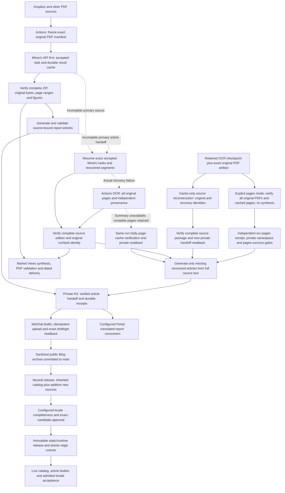

# Automation Pipeline Overview

Last reviewed: 2026-10-11.

This document is the architecture map for the repository's automation system.
Production PDF parsing uses the **MinerU API from GitHub Actions**. Actions also
run generation, private R2 handoff, PDF rendering and publication. The scheduled
pipeline does not depend on a user's computer being awake or running a local job.

## Purpose

The repository automates a document-processing pipeline:

1. Collect PDF inputs from source locations.
2. Extract text, tables, and figures through MinerU.
3. Generate structured drafts and derivative assets.
4. Package review-ready outputs.
5. Build optional summary, media, and search artifacts.
6. Publish a static index that can call a protected serverless gateway for private files.

## High-Level Flow

The regular source order is MinerU, accepted-task recovery, then complete cloud
OCR only when that recovery fails. Frozen replay retains a separate
provider-proven, no-new-submission path. The OCR branch now feeds the same
article, WeChat draft, Blog and configured translation consumers; it is not
limited to Market Views PDF generation. Its article input is all hash-bound
page text, never a summary substituted for the original source. MinerU and OCR
keep distinct text, figure and cache identities.

The recurring Daily path also separates original-page readiness from summary
readiness. `recover-market-sources` exports its actual MinerU/OCR step outcomes
and whether a full article source was archived, even when synthesis fails.
`recover-ocr-page-sources` runs only on an ordinary, non-replay Daily with a
failed MinerU recovery, an actual OCR attempt, no accepted primary article
handoff and no successfully archived recovery edition. It downloads that same
run's exact selected PDF artifact and manifest, restores the durable cache with
verified archive SHA/size, and validates every original PDF and every cached
page before emitting an `ocr-pages` source. This step performs zero OCR,
MinerU, synthesis or model requests; it never interprets or clears old pending
summary requests. Partial or changed page caches remain failures.

The new source has an exclusive `daily_cache_origin` envelope, with the same
Daily source/handoff run ID and execution SHA, and the separate private
`market-ocr-pages-daily/<run_id>/<date>/shard_0.tar.gz` namespace. Historical
`cache_recovery` envelopes require distinct original/recovery identities;
both envelopes together, cross-namespace uploads, or changed original bindings
are rejected. Independent consumer admission checks the failed prior recovery,
its completed MinerU/OCR attempt gates, absence of a successfully saved full
source edition, and both new page verification/archive gates. The reusable
`deliver-recovered-report-articles` consumer then retains draft readback, Blog
publication and configured translated-report generation. A same-run retry
reuses the exact archived pages receipt before inspecting the mutable OCR cache.

Page-only article delivery does not authorize Market Views synthesis/PDF or
chart indexing. Their existing gates remain independent, and an unresolved
summary still leaves the PDF delivery check failed. The daily pages source is
retained as a private checkpoint, with no automatic source cleanup before its
separate delivery acceptance. Automated regressions exercise the Daily path
with real PDFs and cached page evidence; production execution and downstream
WeChat/Blog acceptance must still be verified on an eligible Daily run.

Historical OCR recovery has a separate main-only manual producer,
[`recover-ocr-cache-sources.yml`](../.github/workflows/recover-ocr-cache-sources.yml).
A cleaned-up temporary source handoff does not imply that the durable
source-bound OCR checkpoint is absent. After exact presence inspection, the
producer verifies pinned archive size/hash, the retained original PDF artifact
and manifest, and all required cached source/model-prompt identities. It
reconstructs the complete source package without OCR, MinerU or model calls;
incomplete or mismatched cache contents stop this path.

The default `source_mode=synthesis` preserves this complete synthesis contract.
An explicit `source_mode=pages` can instead restore complete original page text
for report articles while an old Market Views summary remains unresolved. It
never calls the synthesis builder, reads/clears pending-summary state or
resubmits a model request. All original PDF hashes and actual page counts,
production page-cache identities, ordered page text hashes/methods/empty flags
are verified before a handoff is written. This is `ocr-pages`, with its own
`ocr_pages_receipt.json`, `market-ocr-pages-cache-recovery` namespace and two
distinct successful producer gates. It supplies no reconstructed charts or
successful-synthesis claim and cannot authorize a synthesized Market Views PDF.

Only this validated source package may explicitly include its exact
`originals/RNNN.pdf` inventory in the same private R2 bucket so consumers can
recheck PDF SHA/page counts. Original PDFs stay excluded by default from other
handoffs and from downstream article checkpoints; there is no arbitrary
include-PDF CLI option. Article consumers use the full verified page Markdown,
with `ocr_pages_text_only` figure provenance and no generated chart substitutes.

The receipt keeps the original Daily run/SHA and adds a separately authenticated
recovery run/SHA, manifest/checkpoint identity and archive pins. The new package
uses the `market-ocr-cache-recovery` private namespace, never the original Daily
namespace. Consumers admit it only after the fixed producer's two source gates
succeed. Rerunning that same GitHub run revalidates and reuses the existing
package and exact receipt bytes, preserving generation/draft checkpoint
identity. It does not grant another recovery run automatic reuse of a changed
context. The downstream article workflow can then generate missing articles,
verify drafts and publish Blog output; those stages retain their own acceptance
receipts. Pages mode follows the same downstream delivery and exact-byte replay
contract through its independent namespace. Cloud run `38049925018` stopped at
`summary_submission_pending` after checkpoint verification with zero OCR/model
calls; it did not establish source, draft or Blog acceptance.
The later pages-mode run `38053057754` verified all 44 original sources, and
retained-title apply `38062813064` completed the 44-article generation handoff
without provider requests. Draft and Blog acceptance are tracked separately in
the current acceptance scope below.
See the [OCR cache recovery procedure](wechat-pipeline-recovery.md#restore-ocr-sources-after-the-temporary-handoff-expires).

Source parsing, article generation, draft acceptance, Blog archival, public
release and locale publication are separate acceptance boundaries. A successful
PDF, source run or dispatch acknowledgement does not establish the later
boundaries. Recovery retains private source material until the PDF and
configured article consumers finish, with article/draft checkpoints retained
independently. See [WeChat generation and recovery](wechat-pipeline-recovery.md),
[Blog output contract](blog-seo-wechat-output.md), and
[Market Views source recovery](market-views-source-recovery.md).

Production parsing, recovery and rendering run in Actions. WeChat API calls run
on the configured `wechat-draft` runner. The user's computer is not a production
OCR service. The legacy opt-in native/OCR reconstruction experiments and their
older feature switches remain historical evidence; they do not describe the
current complete-OCR-synthesis article path.

## Catalog continuity and release admission

`neutral-edge-cutover.yml` captures the active edge identity and public catalog,
then `restore_published_catalog.py` reads that release's immutable runtime
catalog, verifies its manifest/hash, and requires exact equality with the public
catalog. It inherits published IDs and source-date memberships before the
Dropbox refresh. Newly inherited available PDFs require exact private-object
size checks before receiving a synced flag. Existing deletion/archive markers
remain authoritative. An explicit manual historical release may fill missing
IDs, but cannot overwrite the active state of an existing ID.

The additive Dropbox scan does not prune old PDFs. Two mandatory retention
gates check the candidate: after the Chinese static build and after final
locale/English assembly, before upload. Both reject lost IDs, lost date
memberships, unavailable formerly available PDFs, or reversed archive state.
History/search merging keeps exact IDs rather than collapsing distinct records
solely because their displayed titles match.

Optional Chinese title translation first applies trusted seed/cache entries,
then prioritizes new sources over older untranslated titles. Its total model
budget is 180 seconds. Expiry keeps the original title, preserves successful
checkpoints, and leaves unfinished items uncached so the next refresh can retry.
This optional enrichment must not indefinitely delay the Chinese catalog.

Eligible publications share the non-cancelling production release lock.
Ineligible workflow-completion events and disabled schedules use isolated groups
so they cannot replace a valid queued release. English and extended automatic
review retain the protected-environment handshake. When an attempted review
fails, cleanup rejects only that exact run's waiting environment; if rejection
fails, the independent built-in token may cancel only the same validated
run/attempt/SHA before cutover starts. Legitimate manual approval waits and
skipped automatic reviews are preserved; cleanup never approves a candidate.

Locale capability is not locale publication. Chinese, the base locale bundle,
English commentary and extended locale candidates retain their own readiness,
source-generation and exact-approval contracts. SEO translations in ko/ja/ar
and the 33 non-English extended locales treat prose-number differences as
advisory. These differences alone do not trigger translation retries, cache
eviction, source-text substitution or publication blocking. HTML structure,
links, required runtime placeholders, complete page coverage and approved
publication bytes remain checked. Original Chinese article/title evidence and English editorial
contracts keep their existing validation scope. `publication_ready` is distinct
from `translation_ready`: authenticated legacy numeric-only fallback may remain
publishable without being relabeled fully translated. See
[the quantity policy](financial-quantity-translation.md).

Only admitted complete candidates enter a release. Manual no-rebuild resume
reuses the immutable candidate and requires fresh protected approval. See
[locale refresh reliability](locale-refresh-reliability.md),
[base multilingual architecture](portal-multilingual-architecture.md),
[extended locale architecture](extended-locales-architecture-audit.md), and
[immutable runtime data](neutral-runtime-data-versioning.md).

Static files and immutable runtime catalog/rules are uploaded from the same
candidate. Pre-cutover verification compares manifest identities and file
hashes/sizes; public acceptance then compares the live and immutable catalogs,
preview, runtime release identity and configured content routes. Failure after
cutover rolls back to the captured prior release.

Daily and standalone recovery publication events enter the durable locale
admission queue before its single writer lock. The consumer verifies the exact
original run/attempt, successful nested publication jobs, archive ancestry and
canonical/body receipt before registering source generations. Hourly bounded
reconciliation preserves late events without recreating articles or uploading
drafts again. This implemented route is documented in
[durable publication ingress](extended-locale-publication-ingress.md); code and
regression coverage do not establish that an eligible real Daily nested event
has completed admission.

## Current acceptance scope

The 2026-10-10 Chinese publication run `38036944110` passed live acceptance for
14,760 report IDs, all 40 October 8 and 79 October 9 source items, and both prior
catalog baselines without ID, availability or date-membership regression.
Its 118 Chinese Blog articles also passed independent HTTP, canonical and full
body/reference checks. These are production receipts, not just CI results.

The 118-article cohort comprises source dates 261004, 261008 and 261009, with
16 accepted WeChat draft groups. It proves normal and recovered MinerU delivery
for those cohorts. The separate 44-source 261007 OCR cohort has its own accepted
draft receipt and separately tracked public Blog acceptance below; the old
118-article receipt must not be reinterpreted as a check of the new cohort.

For that OCR cohort, pages-mode source run `38053057754` verified all 44 sources.
After PR #335 merged at `30169f6` with seven successful cloud checks, real
read-only inspection `38062695853` and apply `38062813064` both validated 44/44
articles while preserving the other 43 articles. Inspection performed zero
object writes; apply verified both private generation and article-handoff
writes. Both made zero provider requests. The selected retained title passed
the original gates after whole-quantity truncation removed a complete numeric
atom; the additional original-source semantic-support route was not needed.
The [title recovery receipt](title-original-source-claims.md#production-revalidation-receipt)
records the exact proof and unchanged-checkpoint boundaries.

Standalone delivery `38062937361`, job `114244980478`, has verified 44 draft
articles in six WeChat groups, with 44 source reports accounted for and zero
exclusions. Blog archive commit `a1dec872d156e505094e77bd4df582a95b02db5e`
is recorded. Its exact public request artifact `11674476878` contains 44 unique
hash-bound records; request SHA-256 is
`e9a0235e0044d50bb711896caa981d61e10fcf653edca22815274c9b94e89eae`.
The request itself does not establish live publication. The original standalone
run later completed successfully at 2026-10-10 19:43:34 UTC, including publish
job `114251477079`, without rerunning generation or duplicating accepted drafts.

Production release run: `38072861358`; immutable release:
`a7fc76874f6643ccc275778311837bcd`. Cutover succeeded at 2026-10-10 19:42:50 UTC.
The new 44-article public cohort passed independent live acceptance at
2026-10-10 19:44:13 UTC: all 44 canonicals and complete normalized body/reference
hashes matched, and edge release/tree identity was unchanged before and after
readback. Receipt SHA-256:
`085399b6aa2ade200cd7c731d063bffd7f53ee76b114b2d6217912876522ea42`.
The earlier 118-article cohort was independently rechecked on this same release
at 2026-10-10 19:46:02 UTC: 118/118 canonical/body/reference matches and unchanged
edge identity. Its new receipt SHA-256 is
`4d5a67b9957007c90f6d563eba6feebb35d5154f8234e4cbbd2f5c5989bba10e`.
Together, these two exact cohorts establish 162/162 live articles on this
release; their accepted WeChat drafts comprise 22 groups. Neither live check
made provider calls or production writes.

The 261009 chart producer `38053642365` committed 10,303 charts from 2,894 reports
to private R2. Release `38072861358` / `a7fc76874f6643ccc275778311837bcd` passed
public chart acceptance: prepared, immutable-release and public index receipts
are identical, including 10,303 charts / 2,894 reports and file SHA-256
`022a192c65f6360c5cda495c28b112ddcff973ea4d21c1d85d76403d8e2386c5`.
The same live release passed catalog acceptance with 14,760 reports and unchanged
edge identity around the check. All 40 October 8 and 79 October 9 sources map to
available records, with zero missing or ambiguous sources. All 14,760 inherited
IDs, availability, source-date memberships and archive states remain intact;
all 12 public/immutable/runtime/preview checks passed. This catalog receipt
verifies public source mapping, not authenticated PDF download behavior.

The recovered standalone publication event was captured and frozen with exact
run `38062937361` / attempt 1 identity. Source-admission run `38080940054`
succeeded at 2026-10-10 19:46:24 UTC: one event captured, checked and admitted,
zero blocked or retained events, and zero paid-provider requests. This closes
the real standalone OCR-publication ingress path; an eligible real Daily nested
publication still needs its own admission receipt. Neutral-triggered admission
`38080888840` separately registered the latest 2026-10-10 inventory of 83 pages;
that inventory must not be described as the recovered 44-article generation.

The resulting current-main successor is `38081129295`, at `39e54e5`, observed
**pending with zero jobs at 2026-10-10 19:48 UTC**. The prior pending runs
`38072881611` and `38081042864` were naturally replaced before execution, both
with zero jobs. The existing active run `38030674044` remained running, with
19 non-English locales successful, Persian/Gujarati running and 12 queued at
that observation. The non-cancelling translation lock preserves active work;
its successor reads admitted original generations/checkpoints before selecting
new sources. Admission or dispatch does not establish publication in every
supported locale. Earlier missing cohorts likewise require their exact
manifests and accepted draft/archive identities, without resubmitting successful
parses or duplicating accepted drafts.

English remains a separate editorial acceptance lane. In the older active run
`38030674044`, job `114151900663` completed 22 of 24 pages with one
`expansion-validation` and one `offline-quantity-validation` failure; the budget
was not exhausted and there were zero paid-provider requests. The newer source
planner includes pending English work in the latest successor `38081129295`,
using the same two-worker matrix and retained checkpoints; the originally
queued `38072881611` never executed. Current-main read-only inspector
`38074947529` verified the exact 61-row checkpoint and 22/24 candidate with zero
model calls, paid-provider requests and production writes. The quantity-failed
title has no retained translation; its two subsequent blocks are also uncached.
In the other failed document, the cached title and first block pass current
strict validation, while the second block still fails `english-source-residue`.
The cache-validation repair allows that rejected unit to be regenerated instead
of repeatedly reused; it does not make the existing invalid text acceptable.
Complete-candidate and live English publication acceptance remain unverified.
SEO numeric advisory excludes English editorial content, so non-English success
does not establish that the English quantity failure is resolved.

## MinerU recovery and acceptance

The primary daily workflow is
[`dropbox-latest-pdf-to-xhs-sharded.yml`](../.github/workflows/dropbox-latest-pdf-to-xhs-sharded.yml).
Its default report selection mode is `all`, with no user-requested total cap;
fresh exact-date recovery preserves that complete source scope.
It keeps exact source bindings and accepted MinerU task identities in a durable
private R2 ledger. A new submission may move to the next configured credential
only after an explicit authentication rejection without any acceptance
acknowledgement. Accepted tasks always keep their original credential and batch
ID. Timeouts, failed parsing, polling errors and ambiguous acknowledgements do
not by themselves authorize another submission. Explicit cloud recovery retains
the original records and permits bounded child tasks only for freshly verified,
specifically approved terminal failures. The detailed contract is in
[MinerU in-flight recovery](mineru-inflight-recovery.md).

The daily Dropbox path and explicit source recovery share an immutable private
R2 cache of complete MinerU result ZIPs. Each cache entry binds the exact original
PDF bytes, source name, parser options and accepted task lineage; temporary
signed URLs are not cache identities. A successful download is validated and
persisted before report generation, so later failures and runner termination
do not discard it. Cache reuse still requires current provider polling and the
complete original-batch gate. An absent cache first uses strict HTTPS; corrupt or
unverifiable stored objects stop processing rather than silently falling back.

The main daily workflow and exact-date source recovery automatically recover the
known result-CDN leaf-expiry error through `mineru_daily_result_transport.py`.
Every cache miss still tries normal PKI first. Only the known hostname and exact
previously verified leaf fingerprint can enter recovery, after a fresh strict
handshake confirms a depth-zero expiry and both system and certifi historical
chain/hostname checks pass. Intermediates must be currently valid. The actual
download connection pins that same leaf, rejects redirects, sends no API token
and has a fresh lease of at most 15 minutes. Unknown certificates and unrelated
failures remain errors. When the provider renews its certificate, ordinary PKI
works directly and the recovery path is unused.

The complete ZIP is checked before a separate immutable daily authentication
receipt and the existing source-bound result cache are written and read back.
The receipt honestly records `pki_verified_now=false`. Existing complete caches
remain usable after a lease expires. This automatic policy is separate from the
manual seeder's fixed cutoff and does not require repeated date extensions.
`mineru-api-smoke.yml` verifies the same transport with one synthetic page,
known text/numbers, private R2 persistence and an immediate cache-only replay.

The separate manual cloud `mineru-result-cache-seed.yml` verifies the complete
original Daily artifact and accepted task inventory before caching completed
original ZIPs. It submits no new parses. Its temporary transport authenticates
only the documented exact CDN leaf fingerprint, verifies the historical chain
and hostname, and stops at the reviewed fixed `2026-10-05T23:59:59Z` cutoff. Previously
authenticated complete caches retain their original October 4 receipts. It records
`pki_verified_now=false` in a separate immutable private authentication receipt.
The default one-ZIP canary must pass
full ZIP checks and R2 readback before bulk seeding. Failed parses, complete
handoff and actual dated PDF delivery remain separate gates; see
[source recovery](market-views-source-recovery.md) for the exact policy.

These acceptance layers are separate:

| Layer | Required evidence |
| --- | --- |
| MinerU completion | Every originally admitted PDF has a successful terminal row and result URL; a successful subset is insufficient. |
| Result retrieval | Completed result ZIPs download and yield usable source text and figures; provider `done` alone does not prove this. |
| Complete report handoff | Exact selected source coverage and valid report outputs are present in the private R2 shard handoff. |
| Market Views PDF | The bank issue date, complete report coverage, original figure rendering and exact PDF checks pass. |
| Archive and public output | The exact PDF is privately archived and the validated public-safe PDF is committed. |
| User-visible delivery | The dated live catalogue entry and its actual PDF download are verified. |

Read-only diagnostics use privately preserved original provider responses
instead of assigning a cause from public counts. The cloud diagnostic entry is
[`mineru-api-diagnostics.yml`](../.github/workflows/mineru-api-diagnostics.yml);
its safe summary separates historical task errors, current authentication, and
result-download TLS/HEAD or optional four-byte ZIP probes. The probe results must
be read before asserting current API health; a ZIP prefix is not a complete
download. The existing durable-task inspector and private response receipts are
documented in
[MinerU in-flight recovery](mineru-inflight-recovery.md). A green diagnostic job,
a credential page, or a sibling workflow is not PDF delivery evidence. The
[one-page cloud smoke test](../.github/workflows/mineru-api-smoke.yml) verifies
new parsing and complete ZIP content separately. The retained OCR experiment is
[versioned here](experiments/market-views-ocr-fallback-20261004.md). The legacy opt-in
cloud implementation has its own OCR/source acceptance history. Current
complete-OCR-synthesis article consumers retain the separate source-binding and
delivery gates described above.

## Historical PDF and provider evidence: October 5

The following observations are dated incident evidence, not current provider
health, current feature-switch values, or proof of downstream article delivery.
The current architecture and October 10 acceptance scope are described above.

October 1–4 primary PDFs were generated from complete MinerU results and appear
in the live catalogue: 63 original aliases (62 unique contents), 50 originals,
54 originals and four originals respectively. October 2 source recovery
`37284033767` and PDF `37284226601` succeeded. Fresh live inspection
`37343103500` matched the latest full private PDF hashes and index records
with all four dated public entries, and anonymous download requests returned
HTTP 401. Actual authenticated member-browser downloads also matched the
private R2 receipts for October 2 and the rebuilt October 3 PDF:

| Member original | Pages | Bytes | SHA-256 |
| --- | --- | --- | --- |
| October 2 | 54 | 3,619,892 | `dc902a24cae3672e7f5292a600048436b5805b3a111403aea48269262394acd3` |
| October 3 | 46 | 30,252,678 | `7a1b9af4609923b1bddd3a1560aac13381b3c95a50c568a4ef878b8011649f0c` |

October 1 and 4 have not had this authenticated browser-download acceptance.
The October 2 53-page public-safe PDF is a separately sanitized version; its
page count and hash must not be used to check the member original.

MinerU task authentication and parsing have succeeded, while strict result-CDN
TLS probe `37347310154` still reported an expired certificate at 17:18 UTC.
The result-download connection is separate from GitHub authorization and the
MinerU task API. Strict Cloudflare probes also rejected that certificate; R2
can retain verified result bytes but cannot supply a ZIP not yet retrieved.
The daily path now tries strict PKI first and has the automatic, exact-identity
recovery described above. The provider certificate itself remains expired;
automatic retrieval passed live cloud smoke `37353991034` on main
`f08dce92` at 18:11 UTC. It accepted and parsed one synthetic PDF, recovered the
16,941-byte complete result ZIP through the exact-leaf path, verified its known
text and three numeric values, then persisted and read it back from private R2.
An immediate original-task replay used zero new submissions and zero result
downloads. A second job attempt on a fresh runner also passed, initially hitting
the persisted cache with zero submissions and identical source/result hashes
and authentication facts. This verifies API parsing, authenticated result recovery and durable
cache reuse; it does not claim a new full scheduled Daily publication.
No local network workaround or local OCR service is required.

PR 251 merged at `95110608`; PR 252 merged at `eb80a3e5` at 10:35:54 UTC after
cloud CI `37297176568` passed. Source-bound figure proof retains original
provider metadata hashes and authenticated original-page pixels, preserves
complete chart context, and verifies the consumer crop replay. Exact
`<eq>...</eq>` versus ` $...$ ` serialization preserves all formula and table
contents. Original-page carriers are written and replayed individually, with
80 million pixels per page and one billion across unique selected pages.
The proof schema is unchanged. After that release, October 4 source rebuild
`37297655439` and PDF `37297840175`, and October 1 legacy rebuild `37297927956`
and child PDF `37298965236`, succeeded. October 3 rebuild `37340380301`
passed all 54 source checks at 16:30:59 UTC and private R2 handoff at 16:31:38.
Its PDF child `37341517817` succeeded at 16:42:21 on `ce16fb2a`; the parent
completed at 16:42:30, with public-safe PDF commit `615d5602`.
The fresh live inspection and October 3 member download above verified this
latest publication. Local QA remains a development check only.

PR 254 merged at `ce16fb2a` at 16:22 UTC after CI `37339774011` passed actual
OCR and renderer checks in 3 minutes 45 seconds. Final ReportLab/LaTeX output
now displays complete internal numeric-pending markers as an explicit Chinese
pending-value message. Original field IDs, inputs, receipts, structured data
and unresolved numeric status remain unchanged.

| Complete cloud backup | Source evidence | Successful acceptance-only PDF |
| --- | --- | --- |
| October 2 | 50 originals, 663 pages; original producer `37245268724` retained and re-audit `37297634646` passed | `37335782776` |
| October 3 | 54 originals, 1,029 pages; producer `37245279463` passed | `37284342786` |
| October 4 | Four originals, 109 pages (82 native, 27 OCR); producer `37244394621` passed | `37297644728` |

These complete PDF builds run the normal source, numeric, synthesis, rendering
and sanitization checks without replacing live publications. October 2 re-audit
measured its unchanged receipt at 325,008,524 bytes, confirming the old
256,000,000-byte audit limit caused the rejection. Re-audit retains the original
producer/receipt identity, validates the complete source and issues an immutable
binding for the PDF consumer, with zero OCR, MinerU or model calls. Ordinary
source-readiness gates remain unchanged. Acceptance-only PDF runs have separate
concurrency groups; publications retain their shared queue.

Based on these three complete real batches and PDF acceptances,
`MARKET_VIEWS_OCR_BACKUP_ENABLED=true` was enabled and read back at 16:06 UTC.
Daily failures can now recover the exact selected original artifact entirely
in Actions, followed by full source/numeric validation, private R2 handoff and
the normal PDF consumer. Invalid or incomplete evidence still stops the batch;
failed report-note generation keeps its failure state. A subsequent actual
Daily automatic-fallback run has not yet been accepted end to end.

October 1 is still a separate open backup case. PR 253 merged at `b9a79ae0`;
actual probe `37336781381` passed the prior 0.1373-pixel horizontal word-box
intersection but rejected a second thin word spanning chart regions. The
affected page subsequently passed cloud golden-field probe `37351321483` on
`a0c69fe6`; full-batch backup acceptance remains pending. Enabling the
already-accepted backup capability does not claim success for every source
shape or every October date. Readability, complete-source and independent
numeric gates remain strict; new rotated values remain masked until confirmed.
Private diagnostic probe `37340394718` retained its original failed exit and
saved two verified private evidence files with source, pixel and model bindings.
They confirm multiple short horizontal OCR word boxes cross date-axis regions.
PR 255 merged at `8e984e74` after actual Ubuntu OCR CI `37345360545`
passed. Real-page probe `37346104127` then passed the four-band planner and
unique complete-date direction, but its source-pixel check rejected light
glyph edges and eight isolated near-white pixels. Follow-up coverage work
retains these pixels explicitly instead of inventing date text. PR 257 merged
at `dcf10862`; private probe `37348761613` retained all four regions. Its
follow-up handles bounded equal-gray edges and records complete near-white
source components independently, without imposing date-word ownership on
untranscribed pixels. All four regions passed cached-read producer/consumer
replay: 127,723 ink pixels are fully accounted for, including 53 explicitly
untranscribed pixels. Original boxes and independent numeric confirmation
remain unchanged; source-component halos are checked against the full page.
Affected-page and complete-batch acceptance remain open; diagnostic files are not complete
source handoffs.
PR 256 merged at `1da60820` after all four required CI checks passed. A
same-date repository PDF now permits a skip only when the private member PDF
and catalogue item pass full-byte hash, size, date and metadata checks.
Missing or inconsistent private objects rebuild from the verified complete
source; the public-safe repository PDF is never reused as the member original.
TLS, authorization, timeout and incomplete-read errors still fail rather than
being interpreted as absence. This corrects interrupted-publication retries
without changing explicit force or acceptance-only behavior.

The detailed contracts and historical evidence are maintained in
[Market Views source recovery](market-views-source-recovery.md).

## Main Workflow Groups

| Group | Role |
| --- | --- |
| Batch processing | Extracts PDF content and creates structured draft folders. |
| Package assembly | Builds operator-friendly archives while excluding raw logs and prompts. |
| Summary rendering | Produces compiled PDF summaries from generated source material. |
| Media rendering | Creates optional audio or video explainers from selected documents. |
| Static index build | Produces a searchable metadata/index artifact for the document portal. |
| Gateway deployment | Deploys the serverless API that validates access and serves private files. |
| Alerting | Sends signed server-to-server operational notices through enabled providers. |
| Cleanup | Prunes generated date folders and large transient outputs. |

## Data Boundaries

- Raw PDF inputs are treated as private working material.
- Static index artifacts should contain only metadata and approved search text.
- Private binaries are served through the gateway, not as direct public URLs.
- Heavy generated outputs are transient unless a workflow explicitly commits them.
- Logs, prompts, raw extraction archives, and provider responses should stay out of review packages.

## Output Categories

| Category | Contents |
| --- | --- |
| Source extraction | Parsed text, figures, page metadata, extraction status. |
| Draft folders | Generated drafts, normalized figures, status summaries. |
| Review packages | Curated files prepared for operator review. |
| Summaries | Compiled overview documents and supporting figure assets. |
| Media | Optional rendered audio/video assets. |
| Portal data | Catalogs, search indexes, account rules, and static assets. |
| Operational alerts | Signed, deduplicated notifications for workflow failures. |

## Operational Alert Policy

GitHub Actions keeps the original success or failure conclusion for observability and
recovery logic. The separate operator email is quieter: before sending, the shared
alert workflow reads the same workflow's recent run history. A successful run in the
24 hours preceding the failed attempt suppresses the email. Reruns use the current
attempt's actual start time instead of the original run creation time. An email is
sent only when that health window contains no success. The server-side dedupe key is
stable per workflow, so an ongoing outage produces at most one operations email in
each rolling 24-hour period.

If GitHub run history cannot be read, the email is suppressed instead of guessing.
This policy changes notification volume only; failed runs remain visible in GitHub,
private checkpoints and handoffs retain their existing recovery behavior, and no
workflow output is marked successful merely to silence an alert.

The search-mirror refresh has an additional last-known-good health rule. External and
authority fetches have bounded stage budgets, and an incomplete attempt never replaces
the corresponding R2 snapshot. The refresh remains healthy while that retained snapshot
is less than 24 hours old; it fails only after a source has had no complete refresh for
the full grace window. This treats the still-current snapshot as the served output while
preventing a prolonged upstream outage from being hidden.

The optional chart-search stage and its resumable object-storage checkpoint are
documented in [Chart Search Architecture](chart-search-architecture.md).
The registered-user metadata RAG and private Course-directory recommender are
documented in [Report Chat and Course Recommendation RAG](report-chat-rag-architecture.md).

### MinerU credential expiry monitoring

The daily `MinerU API key expiry monitor` checks every non-empty credential slot
used by production (`MINER_U`, `MINER_U_2`, `MINER_U_3`, and `MINER_U_4`). It
uses a read-only query for a synthetic task ID, so the health check does not
submit a document or consume parsing pages. In the
[official MinerU API contract](https://mineru.net/apiManage/docs), error `A0211`
means an expired token and `A0202` means an invalid token; rate limits, provider
errors, timeouts, and non-JSON responses are reported as inconclusive rather
than as expiry.

MinerU does not expose a public `expires_at` field. Each configured key can
therefore have a matching repository variable (`MINER_U_EXPIRES_AT`,
`MINER_U_2_EXPIRES_AT`, and so on) containing an ISO-8601 timestamp. The
monitor uses a JWT `exp` claim only when that explicit variable is absent. When
a key is replaced, its matching expiry variable must be updated at the same
time. Reminder emails contain only the secret slot name, expiry status, and
date; token values, prefixes, hashes, and raw provider responses are excluded.

Expiry reminders bypass the workflow-failure health-window gate and call the
same signed Worker/Brevo operations-email endpoint directly. All affected slots
are combined into one email. The signed alert endpoint accepts a bounded custom
dedupe window for this monitor while existing workflow-failure emails retain
their 24-hour default.

## Market Views Figure Contract

The private report handoff deliberately excludes each report's `mineru_raw/`
directory. The batch parser therefore retains only its chart-like MinerU
selections as `assets/source_image_<n>.*`. The Market Views builder consumes the
original Markdown-relative image when it is available and falls back to these
stable selected copies when running from the private handoff. Images are
content-hash deduplicated and copied into the transient summary `figures/`
directory; raw source paths never enter the PDF caption.

The ReportLab renderer records count-only/opaque-ID render statistics and fails
instead of silently publishing when a selected figure cannot be inserted. The
workflow also fails if retained MinerU source images exist but zero figure
candidates are produced. The public-copy step removes only the dedicated final
private page and preserves figure image objects on all body pages.

## Explicitly Retained Public Outputs

Heavy outputs remain transient by default. The daily Market Views PDF is the
documented exception: after public-identity validation, its workflow force-adds
only `market_view_summaries/<YYMMDD>/market_views_<YYMMDD>.pdf` to `main`.
Source PDFs, extracted working folders, prompts, and private handoff objects are
not committed. The same validated PDF may also be copied to private object
storage for the website's member download path.

Blog archive shards are another intentional small public output. Their
sanitization, fingerprinting, concurrent-write handling, and edge publishing
contract are documented in [Blog SEO and WeChat Output Contract](blog-seo-wechat-output.md).

## Compatibility Note

Some paths, scripts, prompts, workflows, and environment variables still use historical names. Renaming them would require a migration across GitHub Actions, scripts, generated folders, and downstream references, so this documentation cleanup leaves runtime names intact.
