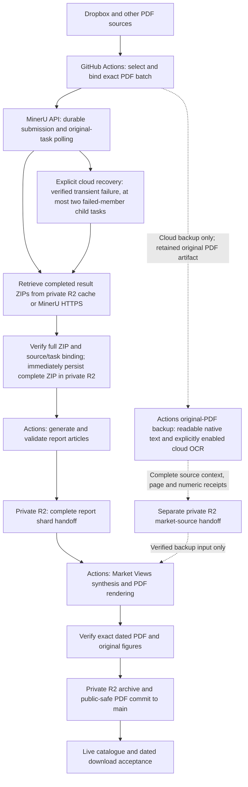

# Automation Pipeline Overview

This document is the architecture map for the repository's automation system.
Production PDF parsing uses the **MinerU API from GitHub Actions**. Actions also
run generation, private R2 handoff, PDF rendering and publication. The scheduled
pipeline does not depend on a user's computer being awake or running a local job.

## Purpose

The repository automates a document-processing pipeline:

1. Collect PDF inputs from source locations.
2. Extract text, tables, and figures through MinerU.
3. Generate structured drafts and derivative assets.
4. Package review-ready outputs.
5. Build optional summary, media, and search artifacts.
6. Publish a static index that can call a protected serverless gateway for private files.

## High-Level Flow

The solid path is the primary architecture. The dashed path is a cloud backup
for Market Views, not a replacement for MinerU or a way to mark failed report
generation successful. OCR is an explicit cloud opt-in: manual recovery uses
`enable_ocr=true`; daily fallback uses `MARKET_VIEWS_OCR_BACKUP_ENABLED=true`.
Both default to disabled. Actions installs Tesseract English and Simplified
Chinese models; the user's computer supplies no production OCR service.
The retained original experiment is archived separately; the current extension
adds readable-language gates and independent numeric checks. Code, CI, full
real-report quality review, automatic enablement and dated PDF delivery remain
separate rollout steps. See
[Market Views source recovery](market-views-source-recovery.md) for the backup
limits and incident evidence.

## MinerU recovery and acceptance

The primary daily workflow is
[`dropbox-latest-pdf-to-xhs-sharded.yml`](../.github/workflows/dropbox-latest-pdf-to-xhs-sharded.yml).
Its default report selection mode is `all`, with no user-requested total cap;
fresh exact-date recovery preserves that complete source scope.
It keeps exact source bindings and accepted MinerU task identities in a durable
private R2 ledger. A new submission may move to the next configured credential
only after an explicit authentication rejection without any acceptance
acknowledgement. Accepted tasks always keep their original credential and batch
ID. Timeouts, failed parsing, polling errors and ambiguous acknowledgements do
not by themselves authorize another submission. Explicit cloud recovery retains
the original records and permits bounded child tasks only for freshly verified,
specifically approved terminal failures. The detailed contract is in
[MinerU in-flight recovery](mineru-inflight-recovery.md).

The daily Dropbox path and explicit source recovery share an immutable private
R2 cache of complete MinerU result ZIPs. Each cache entry binds the exact original
PDF bytes, source name, parser options and accepted task lineage; temporary
signed URLs are not cache identities. A successful download is validated and
persisted before report generation, so later failures and runner termination
do not discard it. Cache reuse still requires current provider polling and the
complete original-batch gate. An absent cache may use strict HTTPS; corrupt or
unverifiable stored objects stop processing rather than silently falling back.

These acceptance layers are separate:

| Layer | Required evidence |
| --- | --- |
| MinerU completion | Every originally admitted PDF has a successful terminal row and result URL; a successful subset is insufficient. |
| Result retrieval | Completed result ZIPs download and yield usable source text and figures; provider `done` alone does not prove this. |
| Complete report handoff | Exact selected source coverage and valid report outputs are present in the private R2 shard handoff. |
| Market Views PDF | The bank issue date, complete report coverage, original figure rendering and exact PDF checks pass. |
| Archive and public output | The exact PDF is privately archived and the validated public-safe PDF is committed. |
| User-visible delivery | The dated live catalogue entry and its actual PDF download are verified. |

Read-only diagnostics use privately preserved original provider responses
instead of assigning a cause from public counts. The cloud diagnostic entry is
[`mineru-api-diagnostics.yml`](../.github/workflows/mineru-api-diagnostics.yml);
its safe summary separates historical task errors, current authentication, and
result-download TLS/HEAD or optional four-byte ZIP probes. The probe results must
be read before asserting current API health; a ZIP prefix is not a complete
download. The existing durable-task inspector and private response receipts are
documented in
[MinerU in-flight recovery](mineru-inflight-recovery.md). A green diagnostic job,
a credential page, or a sibling workflow is not PDF delivery evidence. The
[one-page cloud smoke test](../.github/workflows/mineru-api-smoke.yml) verifies
new parsing and complete ZIP content separately. The retained OCR experiment is
[versioned here](experiments/market-views-ocr-fallback-20261004.md). The opt-in
cloud implementation requires real OCR regressions with unavailable models
treated as failure, followed by complete real-source validation and normal
publication checks before enabling the daily switch.

The 2026-10-04 cloud smoke run
`37212761333`
completed parsing of one new PDF but could not download its result because the
provider CDN certificate was expired. Authentication and parsing succeeded;
result delivery and the missing dated issues remain incomplete. Run
`37217880580` subsequently observed an expired certificate using both the runner
system CA store and Requests with certifi `2026.07.22`. This is a result-CDN
delivery problem, not evidence of rejected API credentials. Separate cloud
workflows inspect the exact October 1-3 private R2 caches and test one fixed CDN
HEAD from a temporary authenticated Cloudflare Worker; neither alone proves a
complete result ZIP or final PDF has been restored.

Read-only R2 inventory run `37219229168` found no objects in the exact October
1-3 generation-cache/original-handoff prefixes and no canonical final PDF/item
pairs. The first temporary-Worker run returned a deployment HTTP 404 before
producing CDN evidence; authenticated, provider-free readiness checks distinguish
that stage from the subsequent single CDN request. Missing PDF delivery remains
open.

The subsequent readiness-verified Cloudflare run `37229206987` at 2026-10-04
19:42 UTC made one strict HTTPS HEAD and received HTTP 526
(`tls_invalid_certificate`), then deleted its temporary Worker. Attempt 2 of
smoke run `37212761333` resumed the existing completed task with zero new POSTs
and again retrieved zero bytes due to an expired certificate. Result delivery
through Cloudflare is therefore still blocked in this probe; no ZIP mirror or
dated PDF recovery is claimed. LAX recorded request ingress; execution placement
was not independently observed in that run. Attempt 3 of the same smoke at
19:57 UTC again retained the completed task, made zero parsing POSTs and failed
result retrieval with zero bytes. A separate read-only public TLS handshake
observed a valid September 17–December 16 certificate chain for the same
hostname, so the failure is not established for every possible CDN path.

The temporary-Worker probe now supports explicit Asian region hints through the
[Cloudflare placement API](https://developers.cloudflare.com/workers/configuration/placement/).
It preserves strict HTTPS and the official hostname. A valid platform
`cf-placement` response header is required to report actual execution location;
an input hint is not location evidence. A successful probe would still need a
complete ZIP download and source validation before a private R2 mirror could
restore processing. R2 storage and task metadata cannot substitute for the
missing completed-result bytes.

Regional runs `37231111280` and `37231384448` subsequently proved execution in
TPE and SIN through platform headers and each received HTTP 526. Both temporary
Workers were deleted; neither downloaded a ZIP or wrote source bytes to R2.
Runner diagnostic `37232259586` then received the same RapidSSL-issued
`*.openxlab.org.cn` leaf under default and TLS 1.2 RSA handshakes. That leaf
expired at 2026-10-02 23:59:59 UTC; both reported verification code 10 at depth 0.
The valid Let's Encrypt chain seen on another connection does not prove a cloud
ZIP download. Complete verified result bytes are still required before an R2
mirror can restore the primary source path.
After PR 228 merged at `f7c5a0097b86a37670c54b91c2988bd8b2557deb`, GitHub-hosted
macOS ARM64 diagnostic `37233771704` at 20:53 UTC reproduced the same RapidSSL
leaf and peer chain, October 2 expiry, and depth-0/code-10 failure under both
handshakes. It downloaded no ZIP. The prepared provider report remains
unsubmitted while submission permission is unanswered.

October 2 Daily run `37067138754` stopped before downloading or parsing: its
expected folder was `261003`, latest was `261001`, and age 2 exceeded the allowed
0–1 days. The earlier `261002=4` inventory note remains unverified and is
superseded for current recovery by the complete 50-file Dropbox listing; the
reason for that difference is not established. Source-only recovery now binds
`261001` to `36932674491` (63 files/62 unique; recovery `37232969584`), `261002`
to the fresh 50-file listing (empty original source run; `37233084607`),
`261003` to `37159099752` (54 files/1,029 pages; `37231899669`), and `261004`
to verified producer `37232504334` (4 unique files; `37233077480`). October 1
and October 2 recovery remain in progress. October 3 run `37231899669` failed at
20:55:55 UTC during complete-source extraction, with a generic
`SourceValidationError` at report ordinal 24, page 49; its cause is under
investigation. Earlier successful OCR does not support attributing that message
to absent models. No complete R2 handoff, source-auditor acceptance or
golden-fixture acceptance was reached for that run. October 4 extraction and its
source-contract audit succeeded: 109 pages (82 native, 27 OCR, no blank), with
the complete handoff saved privately in R2. Its fixture acceptance was
`not_requested`; 1,413 of 1,775 numeric mentions remained unconfirmed. Numeric
quality approval remains pending. Prepared PR 229 adds consumer readiness and
known-field fixture checks before synthesis, with focused suites of 12 and 17
tests passing; deployment and runtime acceptance remain pending. This source-only success
does not establish a generated PDF or live delivery.
Roughly 231 October 3 pages require OCR, with five real
numeric golden fixtures available for cloud quality checks; the failed run did
not reach their acceptance. Full extraction,
source review, dated PDF/live delivery and daily OCR enablement are not yet
accepted. The detailed source-only status is maintained in
[Market Views source recovery](market-views-source-recovery.md).

## Main Workflow Groups

| Group | Role |
| --- | --- |
| Batch processing | Extracts PDF content and creates structured draft folders. |
| Package assembly | Builds operator-friendly archives while excluding raw logs and prompts. |
| Summary rendering | Produces compiled PDF summaries from generated source material. |
| Media rendering | Creates optional audio or video explainers from selected documents. |
| Static index build | Produces a searchable metadata/index artifact for the document portal. |
| Gateway deployment | Deploys the serverless API that validates access and serves private files. |
| Alerting | Sends signed server-to-server operational notices through enabled providers. |
| Cleanup | Prunes generated date folders and large transient outputs. |

## Data Boundaries

- Raw PDF inputs are treated as private working material.
- Static index artifacts should contain only metadata and approved search text.
- Private binaries are served through the gateway, not as direct public URLs.
- Heavy generated outputs are transient unless a workflow explicitly commits them.
- Logs, prompts, raw extraction archives, and provider responses should stay out of review packages.

## Output Categories

| Category | Contents |
| --- | --- |
| Source extraction | Parsed text, figures, page metadata, extraction status. |
| Draft folders | Generated drafts, normalized figures, status summaries. |
| Review packages | Curated files prepared for operator review. |
| Summaries | Compiled overview documents and supporting figure assets. |
| Media | Optional rendered audio/video assets. |
| Portal data | Catalogs, search indexes, account rules, and static assets. |
| Operational alerts | Signed, deduplicated notifications for workflow failures. |

## Operational Alert Policy

GitHub Actions keeps the original success or failure conclusion for observability and
recovery logic. The separate operator email is quieter: before sending, the shared
alert workflow reads the same workflow's recent run history. A successful run in the
24 hours preceding the failed attempt suppresses the email. Reruns use the current
attempt's actual start time instead of the original run creation time. An email is
sent only when that health window contains no success. The server-side dedupe key is
stable per workflow, so an ongoing outage produces at most one operations email in
each rolling 24-hour period.

If GitHub run history cannot be read, the email is suppressed instead of guessing.
This policy changes notification volume only; failed runs remain visible in GitHub,
private checkpoints and handoffs retain their existing recovery behavior, and no
workflow output is marked successful merely to silence an alert.

The search-mirror refresh has an additional last-known-good health rule. External and
authority fetches have bounded stage budgets, and an incomplete attempt never replaces
the corresponding R2 snapshot. The refresh remains healthy while that retained snapshot
is less than 24 hours old; it fails only after a source has had no complete refresh for
the full grace window. This treats the still-current snapshot as the served output while
preventing a prolonged upstream outage from being hidden.

The optional chart-search stage and its resumable object-storage checkpoint are
documented in [Chart Search Architecture](chart-search-architecture.md).
The registered-user metadata RAG and private Course-directory recommender are
documented in [Report Chat and Course Recommendation RAG](report-chat-rag-architecture.md).

### MinerU credential expiry monitoring

The daily `MinerU API key expiry monitor` checks every non-empty credential slot
used by production (`MINER_U`, `MINER_U_2`, `MINER_U_3`, and `MINER_U_4`). It
uses a read-only query for a synthetic task ID, so the health check does not
submit a document or consume parsing pages. In the
[official MinerU API contract](https://mineru.net/apiManage/docs), error `A0211`
means an expired token and `A0202` means an invalid token; rate limits, provider
errors, timeouts, and non-JSON responses are reported as inconclusive rather
than as expiry.

MinerU does not expose a public `expires_at` field. Each configured key can
therefore have a matching repository variable (`MINER_U_EXPIRES_AT`,
`MINER_U_2_EXPIRES_AT`, and so on) containing an ISO-8601 timestamp. The
monitor uses a JWT `exp` claim only when that explicit variable is absent. When
a key is replaced, its matching expiry variable must be updated at the same
time. Reminder emails contain only the secret slot name, expiry status, and
date; token values, prefixes, hashes, and raw provider responses are excluded.

Expiry reminders bypass the workflow-failure health-window gate and call the
same signed Worker/Brevo operations-email endpoint directly. All affected slots
are combined into one email. The signed alert endpoint accepts a bounded custom
dedupe window for this monitor while existing workflow-failure emails retain
their 24-hour default.

## Market Views Figure Contract

The private report handoff deliberately excludes each report's `mineru_raw/`
directory. The batch parser therefore retains only its chart-like MinerU
selections as `assets/source_image_<n>.*`. The Market Views builder consumes the
original Markdown-relative image when it is available and falls back to these
stable selected copies when running from the private handoff. Images are
content-hash deduplicated and copied into the transient summary `figures/`
directory; raw source paths never enter the PDF caption.

The ReportLab renderer records count-only/opaque-ID render statistics and fails
instead of silently publishing when a selected figure cannot be inserted. The
workflow also fails if retained MinerU source images exist but zero figure
candidates are produced. The public-copy step removes only the dedicated final
private page and preserves figure image objects on all body pages.

## Explicitly Retained Public Outputs

Heavy outputs remain transient by default. The daily Market Views PDF is the
documented exception: after public-identity validation, its workflow force-adds
only `market_view_summaries/<YYMMDD>/market_views_<YYMMDD>.pdf` to `main`.
Source PDFs, extracted working folders, prompts, and private handoff objects are
not committed. The same validated PDF may also be copied to private object
storage for the website's member download path.

Blog archive shards are another intentional small public output. Their
sanitization, fingerprinting, concurrent-write handling, and edge publishing
contract are documented in [Blog SEO and WeChat Output Contract](blog-seo-wechat-output.md).

## Compatibility Note

Some paths, scripts, prompts, workflows, and environment variables still use historical names. Renaming them would require a migration across GitHub Actions, scripts, generated folders, and downstream references, so this documentation cleanup leaves runtime names intact.
