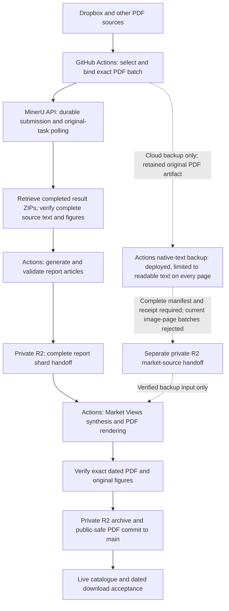

# Automation Pipeline Overview

This document is the architecture map for the repository's automation system.
Production PDF parsing uses the **MinerU API from GitHub Actions**. Actions also
run generation, private R2 handoff, PDF rendering and publication. The scheduled
pipeline does not depend on a user's computer being awake or running a local job.

## Purpose

The repository automates a document-processing pipeline:

1. Collect PDF inputs from source locations.
2. Extract text, tables, and figures through MinerU.
3. Generate structured drafts and derivative assets.
4. Package review-ready outputs.
5. Build optional summary, media, and search artifacts.
6. Publish a static index that can call a protected serverless gateway for private files.

## High-Level Flow

The solid path is the primary architecture. The dashed path is a cloud backup
for Market Views, not a replacement for MinerU or a way to mark failed report
generation successful. Its deployed native-only parser cannot recover a batch
containing textless image pages. Local OCR changes were saved as an experimental
patch and have not been deployed; no OCR recovery is claimed. See
[Market Views source recovery](market-views-source-recovery.md) for the backup
limits and incident evidence.

## MinerU recovery and acceptance

The primary daily workflow is
[`dropbox-latest-pdf-to-xhs-sharded.yml`](../.github/workflows/dropbox-latest-pdf-to-xhs-sharded.yml).
It keeps exact source bindings and accepted MinerU task identities in a durable
private R2 ledger. A new submission may move to the next configured credential
only after an explicit authentication rejection without any acceptance
acknowledgement. Accepted tasks always keep their original credential and batch
ID. Timeouts, failed parsing, polling errors and ambiguous acknowledgements do
not authorize another submission. The detailed contract is in
[MinerU in-flight recovery](mineru-inflight-recovery.md).

These acceptance layers are separate:

| Layer | Required evidence |
| --- | --- |
| MinerU completion | Every originally admitted PDF has a successful terminal row and result URL; a successful subset is insufficient. |
| Result retrieval | Completed result ZIPs download and yield usable source text and figures; provider `done` alone does not prove this. |
| Complete report handoff | Exact selected source coverage and valid report outputs are present in the private R2 shard handoff. |
| Market Views PDF | The bank issue date, complete report coverage, original figure rendering and exact PDF checks pass. |
| Archive and public output | The exact PDF is privately archived and the validated public-safe PDF is committed. |
| User-visible delivery | The dated live catalogue entry and its actual PDF download are verified. |

Read-only diagnostics use privately preserved original provider responses
instead of assigning a cause from public counts. The cloud diagnostic entry is
[`mineru-api-diagnostics.yml`](../.github/workflows/mineru-api-diagnostics.yml);
its safe summary separates historical task errors, current authentication, and
result-download TLS/HEAD or optional four-byte ZIP probes. The probe results must
be read before asserting current API health; a ZIP prefix is not a complete
download. The existing durable-task inspector and private response receipts are
documented in
[MinerU in-flight recovery](mineru-inflight-recovery.md). A green diagnostic job,
a credential page, or a sibling workflow is not PDF delivery evidence.

## Main Workflow Groups

| Group | Role |
| --- | --- |
| Batch processing | Extracts PDF content and creates structured draft folders. |
| Package assembly | Builds operator-friendly archives while excluding raw logs and prompts. |
| Summary rendering | Produces compiled PDF summaries from generated source material. |
| Media rendering | Creates optional audio or video explainers from selected documents. |
| Static index build | Produces a searchable metadata/index artifact for the document portal. |
| Gateway deployment | Deploys the serverless API that validates access and serves private files. |
| Alerting | Sends signed server-to-server operational notices through enabled providers. |
| Cleanup | Prunes generated date folders and large transient outputs. |

## Data Boundaries

- Raw PDF inputs are treated as private working material.
- Static index artifacts should contain only metadata and approved search text.
- Private binaries are served through the gateway, not as direct public URLs.
- Heavy generated outputs are transient unless a workflow explicitly commits them.
- Logs, prompts, raw extraction archives, and provider responses should stay out of review packages.

## Output Categories

| Category | Contents |
| --- | --- |
| Source extraction | Parsed text, figures, page metadata, extraction status. |
| Draft folders | Generated drafts, normalized figures, status summaries. |
| Review packages | Curated files prepared for operator review. |
| Summaries | Compiled overview documents and supporting figure assets. |
| Media | Optional rendered audio/video assets. |
| Portal data | Catalogs, search indexes, account rules, and static assets. |
| Operational alerts | Signed, deduplicated notifications for workflow failures. |

## Operational Alert Policy

GitHub Actions keeps the original success or failure conclusion for observability and
recovery logic. The separate operator email is quieter: before sending, the shared
alert workflow reads the same workflow's recent run history. A successful run in the
24 hours preceding the failed attempt suppresses the email. Reruns use the current
attempt's actual start time instead of the original run creation time. An email is
sent only when that health window contains no success. The server-side dedupe key is
stable per workflow, so an ongoing outage produces at most one operations email in
each rolling 24-hour period.

If GitHub run history cannot be read, the email is suppressed instead of guessing.
This policy changes notification volume only; failed runs remain visible in GitHub,
private checkpoints and handoffs retain their existing recovery behavior, and no
workflow output is marked successful merely to silence an alert.

The search-mirror refresh has an additional last-known-good health rule. External and
authority fetches have bounded stage budgets, and an incomplete attempt never replaces
the corresponding R2 snapshot. The refresh remains healthy while that retained snapshot
is less than 24 hours old; it fails only after a source has had no complete refresh for
the full grace window. This treats the still-current snapshot as the served output while
preventing a prolonged upstream outage from being hidden.

The optional chart-search stage and its resumable object-storage checkpoint are
documented in [Chart Search Architecture](chart-search-architecture.md).
The registered-user metadata RAG and private Course-directory recommender are
documented in [Report Chat and Course Recommendation RAG](report-chat-rag-architecture.md).

### MinerU credential expiry monitoring

The daily `MinerU API key expiry monitor` checks every non-empty credential slot
used by production (`MINER_U`, `MINER_U_2`, `MINER_U_3`, and `MINER_U_4`). It
uses a read-only query for a synthetic task ID, so the health check does not
submit a document or consume parsing pages. In the
[official MinerU API contract](https://mineru.net/apiManage/docs), error `A0211`
means an expired token and `A0202` means an invalid token; rate limits, provider
errors, timeouts, and non-JSON responses are reported as inconclusive rather
than as expiry.

MinerU does not expose a public `expires_at` field. Each configured key can
therefore have a matching repository variable (`MINER_U_EXPIRES_AT`,
`MINER_U_2_EXPIRES_AT`, and so on) containing an ISO-8601 timestamp. The
monitor uses a JWT `exp` claim only when that explicit variable is absent. When
a key is replaced, its matching expiry variable must be updated at the same
time. Reminder emails contain only the secret slot name, expiry status, and
date; token values, prefixes, hashes, and raw provider responses are excluded.

Expiry reminders bypass the workflow-failure health-window gate and call the
same signed Worker/Brevo operations-email endpoint directly. All affected slots
are combined into one email. The signed alert endpoint accepts a bounded custom
dedupe window for this monitor while existing workflow-failure emails retain
their 24-hour default.

## Market Views Figure Contract

The private report handoff deliberately excludes each report's `mineru_raw/`
directory. The batch parser therefore retains only its chart-like MinerU
selections as `assets/source_image_<n>.*`. The Market Views builder consumes the
original Markdown-relative image when it is available and falls back to these
stable selected copies when running from the private handoff. Images are
content-hash deduplicated and copied into the transient summary `figures/`
directory; raw source paths never enter the PDF caption.

The ReportLab renderer records count-only/opaque-ID render statistics and fails
instead of silently publishing when a selected figure cannot be inserted. The
workflow also fails if retained MinerU source images exist but zero figure
candidates are produced. The public-copy step removes only the dedicated final
private page and preserves figure image objects on all body pages.

## Explicitly Retained Public Outputs

Heavy outputs remain transient by default. The daily Market Views PDF is the
documented exception: after public-identity validation, its workflow force-adds
only `market_view_summaries/<YYMMDD>/market_views_<YYMMDD>.pdf` to `main`.
Source PDFs, extracted working folders, prompts, and private handoff objects are
not committed. The same validated PDF may also be copied to private object
storage for the website's member download path.

Blog archive shards are another intentional small public output. Their
sanitization, fingerprinting, concurrent-write handling, and edge publishing
contract are documented in [Blog SEO and WeChat Output Contract](blog-seo-wechat-output.md).

## Compatibility Note

Some paths, scripts, prompts, workflows, and environment variables still use historical names. Renaming them would require a migration across GitHub Actions, scripts, generated folders, and downstream references, so this documentation cleanup leaves runtime names intact.
