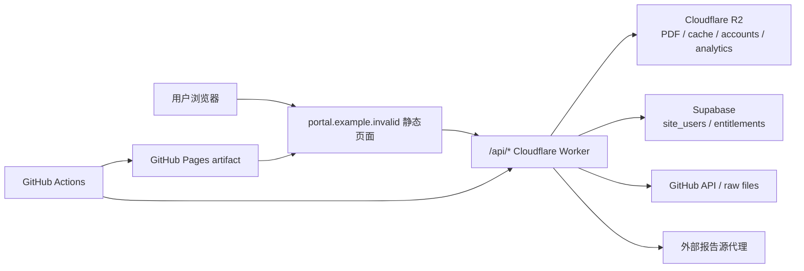

# portal.example.invalid 技术架构文档

最后更新：2026-07-30

维护范围：`portal.example.invalid` 搜索站、报告详情、账号、下载权限、管理后台、运营后台、静态构建、Cloudflare Worker、R2/Supabase 数据和发布链路。

维护规则：凡涉及账号、登录、权限、老客户兼容、联系方式、Worker API、数据存储或部署链路的改动，必须在同一个 PR 或提交中同步更新本文件。文档只记录 secret/var 名称，不记录值。

## 1. 当前业务边界

1. Portal Suite 不提供在线支付，不创建 Paddle checkout，也不接收有效支付 webhook。
2. Portal Suite 与 Vid2PPT 的新支付赠送、自动发放和兑换关联已下架。
3. 网站前台、账号弹窗、报告页和后台展示不出现 Vid2PPT、NOVA、ATLAS、赞助链接或兑换码文案。
4. 新开通或调整下载权限只能人工联系：浏览器首选语言为中文时显示微信 `Support Contact`；其他语言显示邮箱 `support@portal.example.invalid`。
5. 历史上已经写入的有效权益继续按自己的范围、期限和下载额度参与鉴权，直到到期或管理员调整；此次下架不清空或缩短老客户权益。
6. Worker 内旧接收/兑换处理结构保留在 `PORTAL_VID2PPT_LINK_ENABLED` flag 后，生产默认未配置，即为关闭并返回 410。恢复前必须同步恢复前端说明并完成受控验证。

## 2. 总览

## 3. 关键目录

| 路径 | 用途 |
| --- | --- |
| `portal_suite/site_src/` | 前端源文件、账号弹窗、报告页和联系方式。 |
| `portal_suite/site_src/assets/contact.js` | 依据浏览器首选语言选择微信或邮箱。 |
| `portal_suite/site_src/assets/app.js` | 搜索、详情、账号、权限、管理/运营后台 UI。 |
| `workers/portal-suite-worker/src/index.js` | 鉴权、下载、权限融合、管理 API、缓存与埋点。 |
| `portal_suite/data/catalog.json` | 报告 catalog。 |
| `portal_suite/data/history_catalog.json` | 历史 Text only 报告元数据。 |
| `portal_suite/password_rules.json` | 通用密码 hash 与备用分组规则。 |
| `scripts/build_portal_suite_site.py` | 构建 GitHub Pages artifact。 |
| `.github/workflows/portal-suite-pages.yml` | 主构建、Pages 发布和 Worker 部署。 |
| `.github/workflows/portal-worker-emergency-deploy.yml` | Worker 紧急发布。 |
| `.github/workflows/portal-pages-emergency-deploy.yml` | Pages 紧急发布。 |

## 4. 构建与部署

主 workflow：`.github/workflows/portal-suite-pages.yml`。

1. 检出最新 `main`。
2. 运行 JavaScript 语法检查、权限回归测试、联系语言测试和站点构建测试。
3. 更新 catalog、搜索索引和必要的 R2 PDF 镜像。
4. `scripts/build_portal_suite_site.py` 生成静态 artifact。
5. 发布 GitHub Pages。
6. 使用 Wrangler 发布 Cloudflare Worker。

账号/权限改动必须同时发布 Worker 与 Pages。发布后检查登录、老客户下载、管理员权限保存、`operator-a` 运营后台、联系语言和已关闭接口。

## 5. 前端页面

| 页面 | 作用 |
| --- | --- |
| `index.html` | 搜索、筛选、报告列表、账号入口。 |
| `report.html` | catalog 报告详情和下载。 |
| `doc.html` | 外部报告线索与代理详情。 |
| `terms.html` / `refund.html` | 政策和联系方式。 |

权限提示统一规则：

- 中文浏览器：`如需开通或调整下载权限，请联系微信 Support Contact。`
- 非中文浏览器：`To activate or update download access, email support@portal.example.invalid.`
- 邮箱必须使用可点击的 `mailto:` 链接。
- 报告详情、账号弹窗、Text only 权限、热门报告提示和页脚都使用同一语言选择逻辑。

## 6. 账号、角色与会话

- 普通用户、operator、super 共享账号服务，但权限不同。
- `admin-a` 是 super 身份；管理后台按钮只对 super 显示。
- `operator-a` 的 operator 身份必须持续显示“运营后台”，不得被 super-only 显示逻辑覆盖。
- session token 由 Worker 服务端签名；前端隐藏按钮不能替代 API 鉴权。
- Supabase 是账号主库；配置暂不可用时，Worker 使用 R2 JSON 兼容路径。
- 老账号来源为空或 legacy 标识时，仍按 Portal Suite 老账号处理，不改变登录方式。

## 7. 权限模型

### 7.1 独立正向来源

普通账号可以同时拥有：

- 管理后台手工授权 `_account/access/<email>.json`；
- 普通会员 entitlement；
- 历史赠送 entitlement；
- 历史 3 天/10 篇试用记录；
- 单篇授权或报告密码。

每次请求具体报告时，各来源分别判断范围和到期日。任一有效来源覆盖当前报告即可下载，但不能把一个来源的更广范围与另一个来源的更长期限拼成不存在的权益。

示例：伯恩斯坦 12 个月后台授权和全站 1 个月历史会员并存时，第 1 个月全站可下载；之后只保留伯恩斯坦范围。若无限量来源已经放行，不消耗 10 篇试用额度。

### 7.2 管理员决定

- super/operator 角色和账号禁用状态优先。
- 管理后台明确关闭或失效等不能融合的决定，优先于更早的会员记录。
- 普通的正向授权与其它正向来源做并集，不以“时长更长”单一规则覆盖范围更广的来源。
- 管理后台保存后，Worker 必须实时以 `/entitlement` 和具体下载决策为准，不能只依赖用户列表快照。

### 7.3 历史跨站数据

- 内部仍识别历史 `vid2ppt_nova`、`vid2ppt_atlas`、`vid2ppt_trial` 等 source 值，以避免老权益失效。
- 这些内部 source 只用于兼容和审计；前端显示为“历史会员权益”，不显示外站名称或旧计划代号。
- 不批量迁移或删除历史记录。

## 8. Worker API

| Endpoint | 方法 | 用途 |
| --- | --- | --- |
| `/auth` | GET/POST | session、登录、注册。 |
| `/account/password` | POST | 修改密码。 |
| `/entitlement` | GET | 当前账号与具体报告权限。 |
| `/download` | POST | catalog PDF 下载。 |
| `/report-text` | GET | 有权限的 Text only 原始文本。 |
| `/hot-reports` | GET | 近期热门报告列表。 |
| `/hot-reports/access` | GET | 热门报告权限。 |
| `/account-admin/*` | GET/POST | super 管理后台。 |
| `/ops/*` | GET/POST | super/operator 运营后台。 |
| `/paddle-config` | GET | 410；Portal Suite 不提供 checkout。 |
| `/paddle-webhook` | POST | 410；Portal Suite 不接收支付 webhook。 |
| `/vid2ppt/redeem-code` | POST | flag 默认关闭并返回 410；旧处理器仅保留结构。 |
| `/vid2ppt/nova-grant` | POST | flag 默认关闭并返回 410；旧处理器仅保留结构。 |
| `/vid2ppt/atlas-grant` | POST | flag 默认关闭并返回 410；旧兼容别名。 |

生产环境不得设置 `PORTAL_VID2PPT_LINK_ENABLED=true`。需要恢复时必须先更新本文档、测试和所有用户可见说明。

## 9. R2 与 Supabase

R2 主要分区：

| Key 前缀 | 用途 |
| --- | --- |
| `reports/` | 私有 PDF。 |
| `_account/access/` | 管理后台手工授权。 |
| `_account/access_backup/` | 手工授权恢复副本。 |
| `_account/vid2ppt_trial/` | 历史试用兼容记录。 |
| `_account/analytics/` | 访问与操作事件。 |
| `_hot-reports/` | 热门报告 PDF、元数据和评论。 |

Supabase 保存 `site_users`、`user_entitlements`、`usage_events` 等结构化数据。Worker 写权限时保留恢复副本；读取失败时不能把“读取错误”当作“无权限”覆盖现有记录。

## 10. 管理后台与运营后台

- 管理后台可编辑用户范围、期限、备注、禁用状态和角色。
- 保存权限后立即读取服务端结果，并更新列表及当前账号的实际下载判断。
- 运营后台对 super 和 operator 开放；不得只检查 super。
- 管理数据中的历史外站 source 在 UI/导出视图中中性化为 `historical` / `historical_member`，原始存储不改写。
- 所有修改都写审计记录，包含操作者、时间和变更摘要。

## 11. 联系语言

`assets/contact.js` 读取 `navigator.languages[0]`：

- `zh`、`zh-CN`、`zh-TW` 等中文首选语言显示微信 `Support Contact`。
- 其它语言显示邮箱 `support@portal.example.invalid`。
- 注册审核邮件仍使用邮箱，不因界面语言改变。

## 12. Vars / Secrets

| 名称 | 类型 | 用途 |
| --- | --- | --- |
| `ACCOUNT_STORE_MODE` | var | 账号存储模式。 |
| `ALLOWED_ORIGIN` | var | CORS 允许来源。 |
| `CATALOG_URL` | var | catalog 地址。 |
| `SEARCH_INDEX_URL` | var | 搜索索引地址。 |
| `R2_OBJECT_PREFIX` | var | PDF 前缀。 |
| `AUTH_SECRET` | secret | session 签名。 |
| `SUPABASE_URL` | secret/var | Supabase 地址。 |
| `SUPABASE_SERVICE_ROLE_KEY` | secret | 服务端数据库访问。 |
| `PASSWORD_SECRET` | secret | 密码相关签名。 |
| `MASTER_KEY` | secret | 管理交付能力。 |
| `PORTAL_VID2PPT_LINK_ENABLED` | var | 旧跨站处理总开关；生产必须保持关闭/未配置。 |

旧跨站 HMAC 和兑换 URL 变量不属于当前生产配置；保留的兼容代码不能在 flag 关闭时读取或调用它们。

## 13. 回归检查

发布前：

1. `node --check` 检查前端和 Worker。
2. 运行 `test_portal_contact_locale.js`。
3. 运行 `test_portal_legacy_access_compat.js`。
4. 运行 entitlement precedence、renewal、multi-institution、hot-report 和 Text only 测试。
5. 构建静态站点并确认页面源码无用户可见跨站文案。

发布后：

1. 普通账号可以登录，账号弹窗显示正确联系方式。
2. 老客户既有机构权限仍可下载对应报告。
3. 多来源融合按范围与期限分别生效。
4. `operator-a` 可见并可打开运营后台。
5. `admin-a` 可保存和读取用户权限。
6. 中文浏览器显示 Support Contact，非中文浏览器显示邮箱。
7. 旧兑换、grant 与 Paddle endpoint 返回 410；登录、下载和后台接口不受影响。
