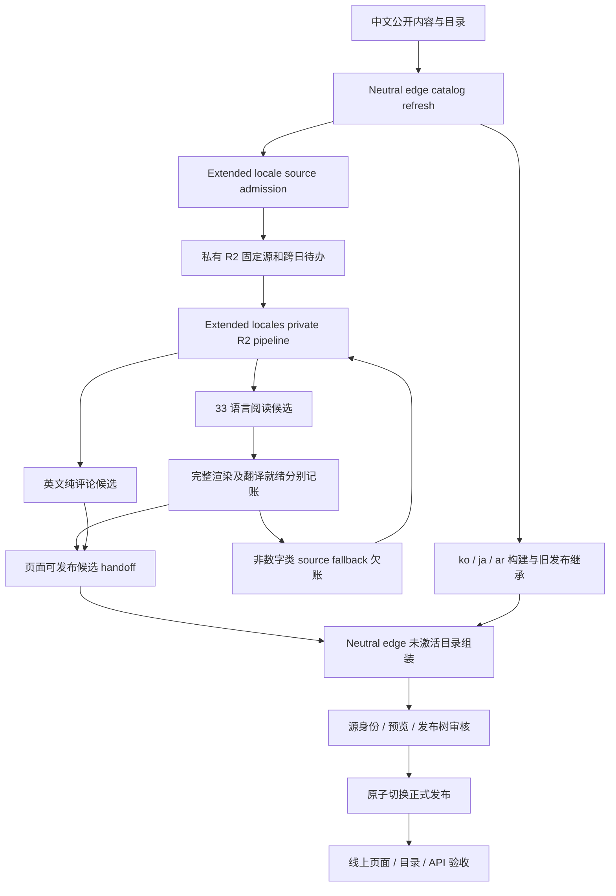

# KC 桌面多语言生成与发布架构

本文的生成与发布架构于 2026-10-11 更新，取代早期 DeepSeek/DeepL 主翻译及“全历史镜像”设计描述。实现入口和当前事故证据分别见下文与[多语言架构核对记录](extended-locales-architecture-audit.md)。多语种 SEO 正文采用数字告警策略，边界见[数字翻译契约](financial-quantity-translation.md)，历史 fallback 的自动有界恢复见[质量欠账恢复](extended-locale-quality-recovery.md)。配置支持、候选生成、译文覆盖、正式发布和线上可读是不同状态。

## 语言与产品范围

语言登记来自 [`portal_extended_locales.py`](../scripts/portal_extended_locales.py) 和固定离线模型适配器，共 **38 个语言/变体代码**：

| 类型 | 代码 | 当前生成范围 |
| --- | --- | --- |
| 中文源站 | `zh` | 既有根站、报告目录、Blog、图表与应用 |
| 既有应用镜像 | `ko`, `ja`, `ar` | 公开页面、UI 和按需加载的本地化数据覆盖层 |
| 新增静态阅读页 | `fr`, `pt`, `es`, `tr`, `ru`, `th`, `it`, `de`, `vi`, `ms`, `id`, `tl`, `hi`, `zh-Hant`, `pl`, `cs`, `nl`, `km`, `my`, `fa`, `gu`, `ur`, `te`, `mr`, `he`, `bn`, `ta`, `uk`, `bo`, `kk`, `mn`, `ug`, `yue` | 33 个目标；新增公开详情页的静态阅读版本，保留源页身份 |
| 英文二次评论 | `en` | 仅中文自有 Blog 中明确标记的 KC/编辑评论；公开标题与预览，完整评论由会员接口读取 |

2026-10-10 的正式发布取证已验证中文、`ko/ja/ar` 和 33 个新增非英文语言的页面；英文当次 assembly 未就绪。新增语言已发布 Blog 的审计边界到 10 月 6 日，并非全部内容已经追平中文。具体发布 ID、页数与验收限制见[核对记录](extended-locales-architecture-audit.md)。

`all-supported` 指 33 个新增阅读页目标，不包含英文，也不重复调度 `ko/ja/ar`。英文有独立 source、checkpoint、candidate、ready queue 和发布账本；启用后每日 CPU 矩阵最多有 34 个 job。38 是登记数量，不能用作已上线语言数量。

英文不复制原始研报、中文全文、图表、报告下载入口或完整阅读镜像。未标记评论的 Blog 不进入英文源。新增 33 个语言也不复制 33 套会员应用；原报告、图表及权限相关操作返回既有源站服务。

## 端到端流程

主要入口：

- [`neutral-edge-cutover.yml`](../.github/workflows/neutral-edge-cutover.yml)：中文与既有镜像构建；继承已发布新增语言和英文；恢复指定候选；生成不可变发布目录，审核后切换。
- [`portal-extended-locales-source.yml`](../.github/workflows/portal-extended-locales-source.yml)：默认分支的 `Neutral edge catalog refresh` 成功后冻结最新内容日新增来源；另接受已验收文章恢复运行的固定历史 Blog cohort，不重抓历史、不改正文日期。其独立互斥组不被长时间 CPU 翻译阻塞。
- [`portal-extended-locales-r2.yml`](../.github/workflows/portal-extended-locales-r2.yml)：来源 admission 成功后消费私有队列；执行模型、保存进度、产生 handoff 和有进展时的后续批次。
- [`portal_extended_daily_queue.py`](../scripts/portal_extended_daily_queue.py)、[`portal_english_pipeline.py`](../scripts/portal_english_pipeline.py)：跨日来源、候选、完成记录和队列的身份边界。

所有自动入口核对受信任的默认分支成功事件。手工恢复仍必须指定真实 source/candidate 身份，不能用本地生成物替代云端发布证据。

## 源与增量身份

新增语言自 2026-09-25 起只接收北京时间当天首次发现并通过日期校验的公开详情页。单批最多 24 个网站页面，不是 PDF 页数；不足 24 页可以正常处理。首页、About、机构/主题目录和历史推荐列表不作为新增详情批次。

发表日期读取当前 canonical 对应的 `Article`/`BlogPosting`/`Report` 实体。仅修改 sitemap `lastmod`、收录目录或抓取时间不会变成新文章；未知日期不猜测。源 HTML SHA、canonical、内容摘要与 generation 一起绑定。英文只从同一次已接纳抓取中的明确评论区域提取，不能日后扩大到原文或补抓历史正文。

已经成功 admission 的当天新增在私有 R2 队列保留，即使翻译跨到下一天也继续原 generation。新一天不覆盖旧待办。每个语言的完成记录独立；已完成部分不重新推理。续跑只在持久化页数取得进展时自动安排下一批，重复的确定性失败不会无限自我调度。

## 模型、预算和可恢复缓存

当前两条生成路径使用固定 **Hy-MT2 离线模型与公共 Linux CPU runner**；本流程没有付费翻译兜底。既有 `ko/ja/ar` 使用 [`build_portal_locales.py`](../scripts/build_portal_locales.py)，新增阅读页使用 [`build_portal_extended_locales.py`](../scripts/build_portal_extended_locales.py)，英文使用 [`portal_english_commentary.py`](../scripts/portal_english_commentary.py)。

- 新增语言 CPU workflow 使用全局互斥组 `extended-locales-r2-pipeline`，`cancel-in-progress: false`，单次矩阵 `max-parallel: 2`。第二个 workflow 等待前一个持有者结束；不能由总状态 `queued` 推断前一个矩阵没有正在运行的 job。
- 每个新增语言默认预算 14,400 秒，上限也是 14,400 秒，job 最长 270 分钟，预留模型初始化及 checkpoint 上传时间。期限传入底层模型调用，不能在预算结束后再启动长重试。
- 既有镜像在 Neutral 构建中使用独立的短探针和 600 秒增量预算，恢复已有缓存，并显式允许源文回退；它不等待 33 个新增语言矩阵结束。
- checkpoint 精确绑定模型、目标语、源语言与源文本；当前 generation 与跨代 seed 都要重新校验。只把本次实际用到的合法 seed 单元写入新 checkpoint，不能把未用到的历史内容全量搬入。
- 内容校验失败只处理对应单元。已验证单元可跨失败恢复；损坏身份、存储权限和读回摘要错误仍明确失败。

2026-10-11 起，`ko/ja/ar`、33 个新增非英文 SEO/GEO 页面和英文评论页面显式使用数字告警策略。正文中的数量、金额、百分比、日期、数量级或数字格式差异只计入诊断，不因这类差异重试模型、删除缓存、退回源文或阻断网站发布。共享 Hy-MT2 适配器与外层页面 Memo 使用同一策略，避免外层放行、底层继续重试。缓存身份保持不变，旧译文按当前页面结构规则复用。

非空内容、目标文字、乱码、表格边界、资源与链接、必要模板占位符和页面代码仍检查。核心镜像已识别为纯正文数字的 `data_placeholders` 可以省略或重复；资源、URL 和运行时代码占位符不属于此例外。报告翻译与中文编辑调用者保留默认严格数量校验；SEO 调用者显式选择数字告警，不修改共享适配器和英文通用 Memo 的默认严格策略。英文生产入口在底层模型、页面 Memo、候选正文复核三处使用同一数字告警策略，避免生成放行后又被保存或发布验收阻断。数字告警仅保存固定类别、计数和哈希，不公开原文或译文。

2026-10-11 17:00（北京时间）结束的旧运行 `38030674044` 实际在前一天的英语 job 中失败：24 篇完成 22 篇，未耗尽预算，固定失败类别为 `offline-quantity-validation` 和 `expansion-validation` 各一项。33 个非英语 job、持久化和后续调度均完成；整体邮件在长矩阵结束后才发出。数字类别暴露了英文调用链未采用 SEO 策略的缺口。旧通用 `expansion-validation` 无更细证据，不能推断它的确切内容原因；当前版本已有更细的英文错误分类及写入/复用前验证。

英文数字告警只在 CLI 摘要报告固定策略和唯一单元/出现次数，不输出原文或数字值，不更改候选 schema、不可变来源或已有对象。缓存中的纯数字差异可按当前策略复用，页面结构或英文内容不合格的单元仍拒绝。此次修复作用于后续运行，不重新生成旧文章、不重跑已结束的历史批次；正在执行的多语种任务保留。

### 当前并发与恢复限制

`cancel-in-progress: false` 保留正在执行的 workflow，但同互斥组的新运行仍可能替换已有 pending。`english-resume` 也使用这个全局组：手工加入它可能替换待执行的 `all-supported` 运行；若英文没有取得完整页面进展，或本次已经清空英文待办，现有 followup 不一定补回全部语言的唤醒。私有 R2 admission 不会因此消失，但其他语言可能等待下一次来源事件。

不要为了插入修复随意取消 active 矩阵。source 阶段已为所有选中语言登记 `started`，即使对应 job 尚未开始；取消或中断可能留下没有完整持久化结果的 `started/claimed`。后续会将该语言列为 stopped；另一 run/attempt 不能直接接管原 owner，现有 legacy intent 也不能重置已注册 generation。必须先核对准确 owner、checkpoint、candidate 和终态，不能把取消后重新运行当成通用恢复。

本轮保全全部语言范围的恢复入口是：修复合入后，从 **`main` 手工运行 `operation=candidate`、`locales=all-supported`，`source_generation` 与 `continuation_evidence` 留空**。普通 source 会继续已有合法待办并自动加入独立英文评论队列；不额外启动第三个 CPU，不取消 active。它仍须通过实际模型、候选与发布审核，不能保证每次都完成或自动解决已 stopped 的任务。精确只读 inspection 使用独立互斥组，可先检查英文证据而不替换翻译队列。

目前两条 publication handoff 都等待整个 locale 矩阵完成，已完成的单语候选也要等待其他 job。将矩阵改成有上限的小批语言并持久化公平轮转（bounded waves）是待改善方案，当前尚未实现；本轮没有提高 `max-parallel`、拆出独立英文 CPU 或改变调度代码。

## 原文回退与英文严格模式

非英文阅读页的生产参数允许原文回退：被拒绝的模型响应丢弃，对应字段精确保留来源原文，并将记录单独写入 `source_fallbacks`。它不是合法译文，不混入 `rows`。重复字段和后续恢复可复用同一回退记录，避免对同一个确定性失败反复消耗 CPU。

`complete-candidate` 只说明本批页面与必需字段齐全。必须同时报告：

- `translation_complete`：是否没有原文回退；
- `source_fallback_unit_count`：回退的唯一单元数；
- `source_fallback_occurrences`：页面中实际出现次数；
- `translation_policy` 与固定错误码计数；
- `publication_ready`：页面是否具备发布条件，与译文是否全部完成分开；
- 数字告警与 `numeric_source_fallback_unit_count`：保留历史数字回退的真实数量。

只有数字校验导致的历史源文回退，可以在完整候选、精确 source/manifest/proof 身份及回退清单验证后继续发布；`translation_complete` 和 `translation_ready` 仍为 false，不把原文冒充译文。混合其他失败类别、清单缺失、计数不符或页面不完整继续按原发布门禁处理。自动恢复不为纯数字差异再次安排模型调用；已接受的恢复结果仍可零调用完成原有写入尾部。已验证数字类告警不占可执行修复队列，旧记录通过既有有界轮转扫描移出，但不可变来源、候选、回退和质量 proof 保留，避免非阻断告警累积填满队列后再次影响发布。

英文始终不允许源文回退。英文评论校验必须在 Memo 写入和复用之前执行，包括无中文/日文/韩文残留、无原文/图片/URL 嵌入、标题及正文长度限制。遇到旧版本已保存的无效单元，只清理该精确单元的 Memo/模型缓存后重新生成，其余合法进度继续复用。诊断输出固定的 `english-language-validation`、`english-asset-validation`、`english-size-validation` 等类别，不输出评论正文。

## 发布、继承与审核

候选和正式发布是两个阶段。完整候选在私有 R2 保存；候选公开投影保持 `noindex`。非英文自动 handoff 同时要求语言处于 `PORTAL_EXTENDED_AUTO_PUBLISH_LOCALES` 且已经在 active release 获准上线。首次启用一个新语言仍走明确的候选组装与审核。英文自动 handoff 由 `PORTAL_ENGLISH_AUTO_PUBLISH` 控制，完整候选与独立 ready queue 是前提。

Neutral 的组装器从已验证的 active release 继承旧集合，再加入本次候选：

- 非英文由 [`portal_extended_publication.py`](../scripts/portal_extended_publication.py) 和 [`restore_assemble_portal_extended_r2.py`](../scripts/restore_assemble_portal_extended_r2.py) 保留已批准批次、源身份与公共路径，避免普通中文刷新清空旧语言。
- 英文由 [`portal_english_publication.py`](../scripts/portal_english_publication.py) 验证私有完整评论及发布账本，并仅向公共 HTML 投影允许的标题、预览、日期和稳定 URL。完整正文不进入公开 JSON、搜索、HTML 或诊断 artifact。
- 英文审核逐字节重建预览投影。资源版本来自**实际候选目录的资产 SHA**，审核 job 使用固定发布 manifest 的同一 SHA，并有界读回全部 7 项资产校验长度和内容 SHA；不能取尚未物化部署配置的源码 `app.js` hash，否则合法预览也会误判不一致。
- `extended_daily_review` / `english_daily_review` 校验身份、候选/账本集合与目录；随后才允许正常切换。发布失败继续服务上一版本。

这些开关只代表配置，不能代替实际 run 和 active release 证据。正式验收必须从同一发布身份读取 manifest、sitemap、真实页面和受控正文接口，并检查已发布内容未被后续中文刷新丢弃。

## 路由、数据与 SEO 契约

中文保留根路径；既有镜像使用 `/ko/`、`/ja/`、`/ar/`。报告 ID、Blog ID、机构和专题 slug 不因翻译改写。新增阅读页沿用对应 locale 前缀及稳定源内容身份；英文是 `/en/` 和 `/en/blog/{id}.html`。

不按 IP、浏览器语言或地理位置自动重定向。同一 URL 返回固定语言内容。简体中文浏览器环境不插入多语言选择器；公开 canonical、sitemap 和搜索可发现性仍正常。直接打开语言路径也不改变正文。

既有镜像共用应用布局与原始索引，仅为可见公开字段生成 locale 数据覆盖层。首页先加载 preview，完整 catalog 及标题 overlay 在明确查询、筛选或翻页后加载；详情按当前 shard 加载小型覆盖层。原始 PDF、会员私有内容及完整原文搜索索引不复制为 38 套译文。查询层必须保留 IME、RTL 和源语言文档标注。

每个已发布、可索引页面使用自 canonical；hreflang 只列实际存在且互惠的版本。缺失、未完成、`noindex` 或退役页面不得虚构 alternate。`yue` 保留其合法页面语言代码，但不进入 Google 不支持的 hreflang 映射。阿语等从右到左语言须设置对应 `dir`，金额、ticker、URL 等保持双向文本可读。

既有镜像的历史 cohort 由 active release 的 `data/i18n/history-release.json` 推进，候选、失败尝试和普通缓存不能推进已发布账本；暂停历史扩展不能删除已经发布的 URL。新增 33 语言的“当天新增 admission”是另一套范围，不能拿它重启全历史翻译。

sitemap、RSS、JSON-LD、机器发现文件只描述实际公开集合。保留原发布日期；归档日期、抓取时间、模板修改或翻译日期不冒充出版日期。`Report.inLanguage` 描述原报告语言，页面 locale 描述页面语言，两者分开。不得以 SEO/GEO 为由新增来源没有的事实、结论或引用。

## 检查与运维证据

恢复按同一份来源 → 单元/页面 checkpoint → candidate → handoff → prepared release → active release 逐层核对。最小验收包含：

1. 来源当天新增数量、各语种 admitted/selected/remaining 数量和固定身份；
2. 每语种完成页数、预算、回退数、失败类别；不以一个兄弟 job 绿色代替整个矩阵；
3. 默认分支提交与真实 cloud run，候选 SHA 和发布审核成功；
4. 当前线上发布 ID、实际语言集合、各语种最新日期与页面计数；
5. 旧已发布 URL/账本持续保留、正文与访问权限正确。

私有 source、checkpoint、ledger、正文留在私有 R2。公开仓库和 Actions 日志只保存代码、合成测试、固定错误枚举、计数、哈希及运行链接；不复制源标题、评论、原始模型响应、令牌或访问凭据。相关回归集中在 `test_portal_extended*.py`、`test_portal_english*.py` 和固定模型/数量校验测试中。

## 既有镜像详细契约

下列原有详细约束继续保留。它们主要适用于 `ko/ja/ar` 应用镜像；新增阅读页与英文的范围、离线 provider、显式回退和私有评论边界以前文为准。阶段标题是发布检查清单，不代表站点当前尚未激活。

## 不可破坏的产品契约

### 路由

中文站继续使用现有根路径。新语言使用稳定、可直接访问的路径前缀；是否进入搜索引擎索引按下文固定 cohort 策略控制：

- 韩文：`/ko/`
- 日文：`/ja/`
- 阿拉伯文：`/ar/`

公开页面按一一对应关系镜像，例如：

| 中文根站 | 韩文 | 日文 | 阿拉伯文 |
| --- | --- | --- | --- |
| `/reports/` | `/ko/reports/` | `/ja/reports/` | `/ar/reports/` |
| `/reports/{id}.html` | `/ko/reports/{id}.html` | `/ja/reports/{id}.html` | `/ar/reports/{id}.html` |
| `/reports/institutions/{slug}/` | `/ko/reports/institutions/{slug}/` | `/ja/reports/institutions/{slug}/` | `/ar/reports/institutions/{slug}/` |
| `/reports/topics/{slug}/` | `/ko/reports/topics/{slug}/` | `/ja/reports/topics/{slug}/` | `/ar/reports/topics/{slug}/` |
| `/blog/{slug}.html` | `/ko/blog/{slug}.html` | `/ja/blog/{slug}.html` | `/ar/blog/{slug}.html` |
| `/charts` | `/ko/charts` | `/ja/charts` | `/ar/charts` |

报告 ID、机构 slug、专题 slug 和 Blog slug 必须保持稳定，不做语言化改写。这样才能可靠建立 canonical、hreflang、变更检测和退役映射。

不根据浏览器语言、IP 或地理位置自动跳转。用户或搜索引擎直接请求任一 locale URL 时，服务器始终返回该 URL 对应的固定语言内容；不得通过内容协商让同一 URL 返回不同语言正文。

### 简体中文浏览器不显示多语言入口

“不让简体中文浏览器用户发现多语言 feature”在 UI 层解释为：不渲染语言入口，不改变中文页面正文，不自动跳转。它不能解释为让公开 locale 页面无法从搜索、外链、sitemap 或 HTML `<head>` 中发现，因为那会与可索引的 SEO 目标冲突。

- `zh-CN`、`zh-Hans`、`zh-SG` 以及无地区的 `zh` 视为简体中文浏览器环境。
- 上述环境不插入语言选择器节点，不显示入口占位，不产生首屏闪现，也不发出 locale CSS/JS 请求；中文页 `<head>` 中的轻量内联门禁先读取首选浏览器语言，只有非简体中文环境才按需加载语言入口资源。
- `zh-TW`、`zh-HK`、`zh-MO`、`zh-Hant` 不自动归入简体中文；其入口策略可按非简体环境执行。
- 中文根页的服务端 `<body>` 继续沿用正式基线。若要让其他浏览器语言从中文根站进入 locale，入口只能在确认不是简体中文后由客户端插入。
- 即使简体中文用户知道并直接打开 `/ja/`、`/ko/` 或 `/ar/`，页面仍正常返回、访问和索引，只是不渲染语言选择器。
- 不对 crawler、简体中文用户和其他用户返回不同的主体内容，避免形成 cloaking。

## 既有镜像的完整公开展示范围

这里的完整范围是既有 `ko/ja/ar` 镜像中需要登记和处理的公开展示字段，不是翻译所有被索引、存储或有权访问的材料。字段齐全与译文齐全分别验收；生产允许的原文回退必须单独登记，不能计入成功译文。新增 33 语言和英文遵循前文各自的范围。

必须翻译：

- 公开首页、报告列表、机构页、专题页、公开报告落地页、Blog、图表页、About、公开政策页的可见文案；
- 页面标题、摘要、说明、面包屑、导航、筛选、搜索、表单、按钮、加载态、空状态、错误态和页脚；
- `title`、description、Open Graph、可见的可引用摘要、结构化数据中的页面名称与描述；
- `aria-label`、placeholder、图片替代文本及其他会影响可访问性的用户可见语义；
- 公开 catalog 中实际出现在页面上的标题、简介、来源说明和相关推荐文案。

明确不包含：

- 原始版权 PDF、研报附件或第三方受版权保护的全文；
- 会员私有内容、登录后内容、申请交付内容、内部备注及非公开元数据；
- 仅用于搜索召回的私有索引字段；
- 用被截断的搜索索引、snippet 或 OCR 片段冒充“已翻译全文”。

搜索索引中的截断字段可以在确实会公开展示时作为独立展示字段翻译，但不能据此把对应原始文章、PDF 或研报标记为全文完成。翻译覆盖清单必须从权威公开渲染源生成，而不是从搜索 shard 的片段长度推断。

机构法定名称、证券代码、ticker、报告 ID、URL、邮箱、数字和模板变量默认保留；需要本地化的机构别名另行进入受控术语表。阿拉伯文采用现代标准阿拉伯语，不自动假定某个国家方言。

## 静态站与运行时架构

`scripts/build_portal_suite_site.py` 继续作为中文根站的权威生成器。`scripts/build_portal_locales.py` 只在中文静态站完整构建后读取其公开渲染结果，并从同一结果生成三种镜像；它不复制三套页面模板，也不修改中文 `<body>`。locale 配置至少包含：

- URL 前缀、`html_lang`、文本方向和数字格式；
- UI 词典、术语表和翻译 manifest；
- Open Graph locale；
- 页面标题、description、面包屑和结构化数据标签；
- 字体和 RTL 行为。

`portal_suite/site_src/assets/app.js`、`site-runtime.js`、`charts.js` 及报告交互脚本中的公开文案由同一 segment 清单做构建时本地化；程序语义值（路由、DOM ID、CSS class、事件名、状态枚举和语言原生名称）必须保持不变。页面位于 `/ja/` 等前缀后，共享 `data/...` 请求由同步加载的 locale runtime 映射回根数据，并叠加紧凑的本地化 catalog 字段。

大型原始全文搜索索引保持共享，不为三种语言复制完整 corpus。公开显示标题、摘要和搜索标签可以使用紧凑 locale lookup。韩文、日文和阿拉伯文检索必须分别验证：

- 日文无空格查询与 IME composition；
- 韩文归一化和组合输入；
- 阿拉伯字符、变体、附加符号和 RTL 输入；
- 英文机构名、ticker 和数字与本地文字混输。

locale 首页首屏只加载现有 preview 数据。完整 catalog 与标题 overlay 仅在第一次搜索、筛选或翻页等明确用户意图后加载，不设置空闲自动下载；完成后原子替换数据，不清空用户已输入的查询。站内报告详情的 256 个源数据 shard 各自使用同前缀的小型翻译 overlay，只加载当前 shard 的 item 与 related 标题字段，不得复用完整 catalog overlay。本地化 external detail 沿用已加载的 preview 和四个有界 Worker 推荐源，不再下载 14,000+ 项的历史 recommendation catalog；中文根站保持原有行为与加载时序。Hot Reports 的有界 locale 覆盖层可在首屏后单独加载，查询只向 Worker 发送有界公开 ID 集；覆盖层缺失、加载失败或 generation 不一致时显示本地化的更新状态和空结果，不把源语言标题回退给用户。

发布门对首屏 locale CSS/JS 和各类运行时 JSON 分别设置体积上限：preview 512 KB、单个详情 shard overlay 512 KB、完整标题 overlay 8 MB、图表 overlay 32 MB、Hot Reports overlay 6 MB、课程数据 2 MB。首页不等待后四类文件；完整目录构建索引时按小批次让出主线程，失败后保留 preview 并允许用户意图触发有冷却时间的重试。

locale 搜索覆盖公开 catalog、标题、图表和 Hot Reports 的本地化字段。原始报告全文/PDF 不发送给翻译模型，也不复制三份；涉及该共享索引的选项必须明确标注为“源语言文档文本”，不能暗示支持目标语言全文检索。

## 既有镜像的 SEO 与 GEO 详细契约

### 全量预翻译、分批索引

“已翻译”和“允许首批索引”是两个独立状态。每次既有 locale 构建扫描当次公开 HTML inventory，复用合法缓存、在预算内翻译新增单元并静态生成页面；报告搜索 catalog overlay 也保留全部公开记录。因此未进入首批索引的历史详情仍可由站内搜索、内部链接或直接 URL 打开，且请求时不调用翻译 API。索引策略只改变 locale 详情页的 robots、hreflang、locale sitemap 和 locale `llms*.txt`，不删除页面或搜索数据，也不改变中文根站正文。

默认策略 fail-closed：未显式配置起始日时，仅首页、根级公开页、列表分页、机构页、专题页等 hub/core 页面进入三种 locale sitemap；其余原本可索引的详情页静态生成，但写入 `noindex,follow`。这控制的是搜索结果收录，不宣称可以阻止爬虫请求这些公开 URL。激活时通过 `--index-start-date YYYY-MM-DD` 固定一个不随构建时间滚动的起始日。此后发布日期不早于该日期的新 Blog/Report 自动进入索引，已经进入的页面不会因“最近 N 天”窗口向前滚动而自动退役。需要单篇提升历史内容时，用 `--index-allowlist` 指向一份逐行列出 root canonical URL 或路径的文件；未知 URL 或中文源本身为 `noindex` 的 URL 会让构建失败。

资格日期只读取权威发布字段：

- Blog 详情由文章 `date` 生成 JSON-LD `BlogPosting.datePublished`；门禁只读取与当前 canonical 对应的该结构化实体，可见 `<time datetime>` 不参与资格判断；
- Report 详情只有 catalog 的源字段 `published_at` 可生成 JSON-LD `Report.datePublished`；门禁只读取与当前 canonical 对应的 Report 实体，有合法值时才自动进入 cutoff cohort；
- `date_folder` 是归档/收录目录，`server_modified`、`first_seen_at_bjt`、`last_seen_at_bjt` 是抓取或文件变化时间，不能冒充出版日期；
- sitemap `lastmod` 还包含稳定的页面模板 revision floor，只用于 freshness，不用于首批详情资格；
- 缺少或格式无效的 `datePublished` 默认保持 `noindex,follow`，直到补齐权威日期或显式 allowlist。

locale sitemap 及 locale `llms-full.txt` 只列出 hub/core 与当前 eligible cohort，避免机器发现文件绕过分批索引策略；简版 locale `llms.txt` 同样过滤任何已知但未 eligible 的详情 URL。暂缓索引的详情页保留自引用 canonical，但中、韩、日、阿四个对应页均暂不声明该详情的 hreflang 集群；提升进入 cohort 后再由同一次不可变构建统一补齐。中文 sitemap、中文 `llms.txt`、中文 `llms-full.txt` 均不改。locale RSS 继续沿用中文构建器已限定的近期集合。

Blog 的历史正文可能含不可供国际站使用的知识星球图片地址。在收集翻译单元之前，先针对 locale 副本删除 ``、`<source>`、`<amp-img>` 的 `src`、`srcset`、`data-src`、`data-srcset`、`data-original`、`data-original-src`、`data-url` 或 `url` 中包含 `zsxq.img` / `zsxq_img` 的节点；HTML entity、多重百分号编码以及 inline `background-image` 也纳入识别，避免其 alt/title 等无用文案进入翻译模型。locale HTML 渲染后再执行同一过滤作为最终门禁。若父级是只包含该图片的 `a`、`span`、`p`、`picture`、`figure` 或 `div`，连同纯图片包装逐层删除。有正文、caption、非目标 style 或其他有效内容的容器保留。中文 Blog HTML 和其他页面不执行该清理。

### Canonical 与 hreflang

每个公开页面必须自引用 canonical。当前索引 cohort 内的对应页面组成互惠 hreflang 集群：

- 中文：`zh-Hans`
- 韩文：`ko`
- 日文：`ja`
- 阿拉伯文：`ar`
- 默认：`x-default` 指向现有中文根站对应 URL

只有已经完整生成、可访问且已进入索引 cohort 的版本才能出现在集群中。任意两个 eligible locale 页面之间必须互相声明；暂缓索引、退役或不完整版本必须从整个集群删除。`<html lang>` 与当前页面一致，阿拉伯文还必须带 `dir="rtl"`。

Open Graph 使用 `ko_KR`、`ja_JP` 和当前面向 MENA 的 `ar_AE`；阿拉伯文路由与 hreflang 仍保持通用 `ar`，不把 URL 锁定到单一国家。若未来确认新的阿语目标市场，只调整 Open Graph 区域配置，不改既有 `/ar/` URL。
`og:site_name` 也必须走 locale 渲染；源站若使用“KC桌面”，三个国际站统一输出受保护的英文品牌，不得把中文品牌字样残留在本地化元数据中。

### Sitemap、robots、RSS 和 IndexNow

根 sitemap index 应列出按语言拆分的页面、报告和 Blog sitemap，例如：

- `sitemap-pages-{locale}.xml`
- `sitemap-reports-{locale}-{n}.xml`
- `sitemap-blog-{locale}-{n}.xml`

URL 节点使用 XHTML alternate 标注全部已完成的 hreflang 对应页。`lastmod` 来自源内容或有效翻译变化，不使用每日构建时间伪造更新。

`sitemap-baidu.xml` 和 `sitemap-sogou.xml` 保持中文专用。根 `robots.txt` 不阻止 `/ko/`、`/ja/`、`/ar/`；私有、运行时数据和管理路径继续维持当前禁止策略。Cloudflare Managed robots 是否覆盖仓库中的 sitemap 声明，需要在激活后单独进行线上验证。

每种语言生成自己的 RSS：`/{locale}/feed.xml`。`scripts/submit_portal_indexnow.py` 必须能把同一公开内容的全部已完成 locale URL 作为一组提交或退役；不能继续只以中文 `sitemap-baidu.xml` 代表所有变更。

线上 SEO 审计把三份 locale sitemap 视为一个完整集合，禁止只启用其中一部分。IndexNow 增量同时比较当前与上一份站点产物：新增/更新的 eligible URL 进入更新集合，已从 locale sitemap 退役的 URL 也进入通知集合；中文增量仍独立保持既有行为。

### llms 与可引用内容

每种语言生成：

- `/{locale}/llms.txt`
- `/{locale}/llms-full.txt`

内容必须与当前 locale 页面一致，包含自然语言的可引用摘要、清楚的来源归属、稳定 canonical 和相关内部链接。`llms.txt` 只作为可能采用该格式的其他系统的发现辅助，不替代可抓取的静态 HTML、sitemap 或真实页面内容；Google Search 明确不使用该文件，因此不能把它计作 Google SEO/GEO 成果。

不得为了 GEO 虚构原始材料没有提供的结论、作者、发布日期、引用、FAQ 或地域属性。韩文、日文和阿拉伯文应使用当地用户自然搜索问题的表达，但事实、数值和来源必须保持一致。

### JSON-LD

- `WebPage`、`CollectionPage`、`BlogPosting` 的 `inLanguage` 使用页面 locale。
- `BreadcrumbList`、`ItemList` 的名称和 URL 使用本地化页面值。
- Publisher、来源机构和原始作者身份不因页面翻译而改变。
- 页面语言与原始报告语言分离：页面可以是 `ar`，但 `Report.inLanguage` 只能来自 catalog 中可证实的原始语言字段。
- 原始英文标题可作为 `alternateName`，不能把翻译标题冒充原始出版物标题。

## 阿拉伯文 RTL 与双向文本

阿拉伯文页面使用 `<html lang="ar" dir="rtl">`。CSS 优先使用逻辑属性：

- `margin-inline-*`、`padding-inline-*`
- `border-inline-*`
- `inset-inline-*`
- `text-align: start/end`

移动抽屉、面包屑、前进/后退箭头、关闭按钮和悬浮控件需要显式 `:dir(rtl)` 验证。不能机械镜像图表、品牌图形、照片、播放图标或有固定含义的方向符号。

混合文本使用以下规则：

- 英文机构名、ticker、报告 ID 使用 `<bdi dir="auto">`；
- URL、邮箱、代码和金融图表坐标使用 `dir="ltr"`；
- 搜索输入使用 `dir="auto"`；
- 数字由 `Intl` 和 locale 配置格式化，金融数字必要时保持 LTR，不能继续硬编码 `zh-CN`。

字体使用操作系统本地的阿拉伯文、日文和韩文字体 fallback 栈，不在首屏新增外部字体请求；如果后续需要更强的一致性，再在现有 CSP 下自托管并做体积预算。阿拉伯文需单独校准字号、行高和断行，不应用拉丁字母 uppercase 或 letter-spacing 规则。

## 分阶段交付、激活与回滚

### 阶段 0：冻结契约

- 以远端 `main` 为正式基线；
- 固化中文根站 UI/body/路由快照；
- 固化公开内容 inventory 和排除清单；
- 确认阿拉伯文术语、字体和区域性 Open Graph 配置。

### 阶段 1：翻译系统与已授权的首次范围

- 构建稳定 segment ledger、哈希缓存和术语保护，逐项检查当前 inventory 覆盖，合法译文与已登记源文回退分开计数；
- 按 locale 分批处理已授权窗口的公开展示内容；不得因新增语言上线而重新启动全历史翻译；
- 初始回填与每日增量分开，不把大规模首次翻译塞进日常发布窗口；
- 估算并调整静态文件数、对象存储大小和上传时长门限。报告详情页镜像三种语言后，现有 20,000 文件上限不再适用。

### 阶段 2：候选构建

- 构建独立、不可变、同时包含中文与三种 locale 的 candidate release 和 manifest；
- candidate 中可以存在 `/ko/`、`/ja/`、`/ar/` 文件，但在发布指针切换前不承接正式流量；
- 候选上传到非活动 slot 时，增量跳过的每个旧对象都必须通过 `HEAD` 精确匹配长度与发布器写入的 SHA-256 metadata；缺失、错误或同长度漂移一律重传。随后同一次 workflow 记录 commit SHA、实际 static tree SHA-256 和固定索引策略 SHA-256，并把完整 identity 放入短期验证 artifact 和 Job Summary；
- `locale-shadow` 只生成这个候选和 identity，既不进入生产 Environment 审批，也不切换公开流量；
- 对每种语言抽样首页、列表、机构、专题、详情、Blog、图表和政策页；
- 验证翻译覆盖、链接、数据加载、移动端、RTL、SEO 产物和文件完整性。

候选构建通过并不等于可发布；必须再通过激活前门禁。

### 阶段 3：激活前门禁

每个 locale 至少满足：

1. 本次应生成的页面与字段集合完整，manifest 与实际集合逐项一致，并披露成功译文和源文回退；
2. sitemap、RSS、llms、JSON-LD 与页面集合一致；
3. canonical 与 hreflang 互惠完整；
4. 无被拒绝的模型输出、未登记的原文回退、私有内容或原始 PDF 正文；英文始终禁止原文回退；
5. edge 路由和末尾斜杠 canonical 测试通过；
6. 简体中文浏览器入口零渲染测试通过；
7. 阿拉伯文 RTL 和 bidi 移动端验收通过；
8. 回滚目标和上一版 release manifest 已确认。

### 阶段 4：受控激活

- 只有明确开启 `PORTAL_MULTILINGUAL_ENABLED` 后，日常发布才构建三种 locale；默认关闭，不会意外激活；
- 仓库级变量 `PORTAL_MULTILINGUAL_LIVE` 是“多语言已通过首次线上验收”的人工状态，默认必须为 `false`。prepare 只读取并传递该状态，workflow 不得创建、修改或自动推断它；
- 自动 schedule/workflow_run 只有在多语言未启用，或 `PORTAL_MULTILINGUAL_LIVE=true` 时才允许进入 prepare；因此 `ENABLED=true`、`LIVE=false` 的首次激活只能由人工 dispatch 发起，不会由定时任务反复构建并堆积待审批作业；
- 当 `PORTAL_MULTILINGUAL_ENABLED=true` 且 `PORTAL_MULTILINGUAL_LIVE!=true` 时，首次真实多语言切换必须在构建候选的同一次 workflow 中等待 `portal-multilingual-production` GitHub Environment 审批。审核人先查看 prepare Job Summary/artifact 中的三项 identity，再把同一组值写入该 Environment 的 `PORTAL_MULTILINGUAL_APPROVED_COMMIT_SHA`、`PORTAL_MULTILINGUAL_APPROVED_STATIC_TREE`、`PORTAL_MULTILINGUAL_APPROVED_INDEX_POLICY_SHA256`，并明确设定 `PORTAL_MULTILINGUAL_ACTIVATION_APPROVED=true` 后批准；审批后不重新构建候选；
- 审批作业从同一次 artifact 和 `prepare_release` outputs 分别读取 identity 并互相校验，然后再与 Environment vars 比较。Environment 未配置 required reviewers 时也不能直接放行：审批 flag 缺失或任一 identity 为空、过期或不一致都会终止，Edge 不切换；
- 整个 workflow 在等待 Environment 审批期间继续占用既有的 `portal-production-release` 非取消 concurrency 锁，避免后续发布覆盖当前非活动 slot；identity artifact 保留 7 天，超过审核窗口应重新生成候选；
- 不得拿较早 `locale-shadow` 或另一 workflow 的 raw static tree 给新候选放行。catalog 的 `last_seen` / `updated_at` 会让另一次构建的树发生变化；同一次候选审批正是为了消除“审核旧树、重建新树”的循环；
- 首次切换完成后仍不能由 workflow 自动把状态改为 live。只有真实 URL、RTL、资源加载和 SEO 等线上验收全部通过，运营者才可人工把仓库变量 `PORTAL_MULTILINGUAL_LIVE` 设为 `true`；首次切换失败、回滚或尚未验收时必须保持 `false`；
- `PORTAL_MULTILINGUAL_LIVE=true` 后，schedule 和可信 `workflow_run` 产生的每日新增/变化内容仍必须通过完整字段集合、当前翻译/回退策略、静态完整性、性能预算、Portal Worker capability、线上前置检查和 A/B 回滚门禁，但跳过首次 Environment 人工树审批并自动切换，从而实现新增内容的日常增量发布；
- 非多语言中文发布不读取多语言 Environment 审批值，跳过该审批作业并继续沿用既有 cutover；`locale-shadow` 无论 live 状态如何都跳过审批且被 cutover 条件明确排除，不会承接正式流量；
- 中文根站与三个 locale 一次性切到同一个通过验证的不可变 release；
- 切换前比较中文 body 契约，切换后比较候选与线上 locale 文件及 manifest；
- 激活后验证真实 URL、状态码、canonical、hreflang、HTML 语言、资源加载、sitemap、robots、RSS、llms 和 IndexNow；
- 只有线上验证完成后才能报告该 locale 已上线。

### 回滚

回滚通过现有 A/B 发布指针恢复到上一份完整的整站版本，不原地覆盖或删除当前对象：

- 中文根站恢复到同一旧发布中的一致版本，不单独混用新旧目录；
- 中文、三种 locale、sitemap、RSS、llms 和 hreflang 一起恢复到上一版一致状态；
- 不完整的新版本保留为不可访问的诊断产物，按既有保留期清理；
- 首次激活前没有上一份多语言版本时，保持 feature flag 关闭，不让 locale 路由进入正式发布。

## 自动化验证清单

以下测试保留详细契约；回归结论必须同时说明本地、云端和线上验收阶段：

- 扩展 `scripts/test_portal_seo.py`：locale 路径、lang/dir、自 canonical、互惠 hreflang、本地化 metadata、JSON-LD、sitemap alternate、RSS 和 llms。
- `scripts/test_build_portal_locales.py`：源哈希缓存、零变化零调用、程序语义保护、重试/checkpoint、完整字段集合阻断，以及合法译文与显式源文回退分离。
- `scripts/test_portal_locale_runtime.js`：简体中文环境零入口节点、其他环境按规则显示、无自动跳转、locale-aware 数据 URL 与 Intl 配置。
- 扩展 `portal_suite/tests/home-search-ux.test.mjs`：日文 IME、韩文和阿拉伯文查询及混合 ticker。
- 扩展 `workers/edge-static-host/test/index.test.mjs`：`/ja` 到 `/ja/`、`/ar/index.html` 到 `/ar/`、locale 列表/详情/Blog canonical 和 query 保留。
- 扩展 `scripts/test_submit_portal_indexnow.py`：同一内容的已完成 locale 新增、更新、退役和未完成版本过滤。
- 扩展 `scripts/test_audit_portal_seo_live.py`：线上 lang、dir、hreflang 互惠和每个 locale 的确定性页面样本。
- 为中文根站增加 body/路由回归快照，并验证简体中文环境执行 locale runtime 后 DOM 不发生入口相关变化。

`.github/workflows/neutral-edge-cutover.yml` 在构建、上传和激活之间执行这些门禁，并把 locale builder 与 runtime 纳入语义 build contract。首次已授权范围仍通过 `locale-shadow` 在不切换流量的前提下完成审阅；首次真实切换经同一次候选审批和线上验收后，才由运营者人工设置 `PORTAL_MULTILINGUAL_LIVE=true`。此后定时发布恢复合法活动发布与持久检查点缓存，只翻译新增或变化 segment，并在完整门禁通过后自动切换。

## 已完成页面的翻译欠账与有界恢复

33 个扩展语言的完整页面、日完成游标和发布 ACK 均不等同于译文全部完成。`portal_extended_quality.py` 保留独立、绑定精确 source/manifest 的质量欠账；自动 handoff 检查独立的 `publication_ready`：完整页集合、零 budget/failure，且没有非数字类 fallback。零 fallback 的候选继续具备 `translation_ready`；仅历史数字校验回退的候选可发布但仍如实记录未全译。旧不可变 proof 经同样精确身份、计数、完整哈希清单和数字错误类别验证后可按新策略读取，无须覆盖原 manifest 或调用模型。英文和 `ko/ja/ar` 保持各自链路，不使用这套 33 语言恢复策略。

`portal_extended_quality_recovery.py` 在原全局串行 workflow 内、原 `max-parallel: 2` 矩阵中给每个语言选择 1..20 个非数字类精确旧 fallback。source/manifest/原 producer 必须可验证；缓存或已接受 ledger 优先，全部已有 accepted outcome 的计划显式 `requires_engine=false`，跳过模型 setup，build 禁止构造翻译适配器。其它计划仅授权所选单元一次离线尝试，paid provider 为零。当前普通文章队列与历史欠账按每语言交替；只在存在普通待办时交出该轮，不插入空转轮次。

恢复采用法语旧流程的完整 render/cache/proof 契约并保留其兼容入口，但旧法语终止或未知请求不会因新策略、新运行或新 validator revision 被重新打开。完整候选重建不调用模型，未选中的有效译文与 fallback、原 source/origin、continuation 计数保持。精确 prepared tail 可零推理完成；只有已验证的 durable accepted-unit delta 或原普通页进展才续发下一轮，纯 terminal/unknown 不循环。ACK 前保留绑定 quality proof 的完整 immutable outcome 定位；旧无定位资料只在四种合法 continuation 计数中有唯一原结果时恢复，无法验证就保留 typed blocker。

参见[详细边界、计数及验收](extended-locale-quality-recovery.md)。代码/合成回归、真实译文覆盖、候选页面可发布、protected 发布审核和线上 URL 是分别验收的阶段；非数字类实际修复核对 fallback 减少，数字告警类保持原真实未译计数；此机制不宣称所有旧语言已追平中文。

## 已批准候选重放的只读诊断

`portal-candidate-replay-inspect.yml` 的 `active_only=true` 模式只需精确 `active_release`；`generation/locale/candidate` 必须为空。它先核对公开 edge-state 的 release ID，再用同一 slot/release/tree 身份校验 R2 静态 manifest 和已批准 assembly ledger，按实际发布相同的 page-owner 顺序检查活动候选。仅允许 R2 HEAD/GET，不执行对象写入、模型推理、常规 ko/ja/ar 构建或发布，不占用翻译全局锁。

摘要保留 locale、source/candidate/checkpoint SHA、current 与冻结数量解析器的重放次数/完整页数/缓存 miss/固定失败类别，以及页面字节和可见文本散列差异；不输出原文、译文、源 URL 或异常正文。`all-matched` 仅说明已批准候选在当前代码下可逐字节重放；`mismatch` 用于区分检查点变化、校验拒绝与渲染差异；空活动集合为 `no-active-batches`。首个 mismatch 取得后，后续可选缓存审计即使超出原 128 项上限或读取失败，也保留该证据，并报告 `cache_audit_complete=false` 与固定类别；不得把失败审计当作通过。诊断不放宽 `prove_approved_baseline`、当前 source content 绑定、原 HTML SHA、批准 identity 或发布门禁。若 release 已改变则停止，不自动追随另一版本。原 incoming-candidate 模式仍要求完整三项输入，不能与 active-only 混用。

### 活动候选固定检查点

已认证活动 ledger 的 `batches` 和 `replays` 必须来自同一静态 manifest 校验过的 JSON 字节。发布对仍拥有页面的活动 `(approved_generation, locale, approved_candidate)` 查找唯一 `replays.checkpoint_sha256`，从原 generation 的 SHA 定址对象读取当时的种子，不再以可变 `latest` 指针重解释旧批准。对象完整字节 SHA、检查点 locale/model/version/source identity 均需验证；随后仍用原 `prove_approved_baseline` 要求完整已批准 HTML 文件清单逐字节相等、零 cache miss，并只将实际消费的单位送入当前 source 重建。

缺记录、同 tuple 重复记录、非法 SHA、缺对象、损坏对象或检查点身份不符均停止，不退回 latest。完全被后续批次覆盖、实际不重放的历史 tuple 不要求额外恢复资料；部分覆盖仍需原批准种子。incoming 新候选使用当前 SEO 数字告警策略与逐字节证明，输入上自带的 checkpoint/quantity 字段不能获得活动批准资格。新的 assembly `replays` 继续保留原批准 generation/candidate 和原种子 SHA，并记录 `checkpoint_binding`，不误用当前重建输出的 SHA。来源内容变化、新旧 locale 保留、中文历史、静态版本 identity 和切换审核均沿用原门禁。本地检查点漂移回归通过不等同于任何具体线上失败已定位或恢复，须以精确活动版本诊断和后续发布验收确认。

只读诊断同时保留 latest 的 `checkpoint_sha256/matches/baseline_attempts` 对照，并对每个仍拥有页面的活动 tuple 增加 `approved_checkpoint_replay`，含认证 pin SHA、current/frozen exact-byte 尝试和固定类别。`publication_matches` 使用生产实际要求的 pin 证明；latest 缺失或漂移不能代替也不能掩盖这份证明。总体 `all-matched` 要求 `checked_candidates == selected_candidates` 且全部 active pin 通过；首个失败返回 `mismatch`，不是全批通过。后续可选 latest cache audit 的失败仍单独报告，所有路径仅 HEAD/GET，不调用模型，不写生产对象。

pin 和本次 latest 读取的完整字节相同、两边散列与检查点身份均已独立验证、原批准 tuple 相同时，可复用刚完成的同一 baseline proof，报告 `reused_verified_latest_replay=true`，不重复 build。不同字节必须单独证明；workflow 的原 15 分钟上限不扩大。合并前可在本仓库候选 branch 运行此只读诊断，但必须显式提供与实际运行提交完全一致的 40 位 `expected_head`，仍固定 `active_release`；workflow job 条件及执行前 shell 均检查 head。它不启用 branch 上的发布或模型工作流。

## 历史数字规则冲突的处理

旧发布重放曾同时依赖现行数量解析和冻结的旧数量解析；同一候选中的不同译文可分别被两版规则拒绝，导致中文网站刷新也被历史语言重放卡住。当前优先按 SEO 数字告警策略做纯缓存重放；已批准 HTML 的文件集合和完整字节仍必须相等，源身份不变，模型调用为零。冻结解析只保留精确旧版本兼容用途，不再作为新 SEO 正文的质量要求。数字策略放宽不授权改写已批准页面，也不放宽代码、链接、权限、canonical、hreflang、来源或发布目录完整性检查。
