# 报告到微信公众号流水线架构

本文档是 Dropbox、国际机构、咨询公司和 ARK 报告进入微信公众号草稿箱的架构基线。
工作流、脚本边界、持久化状态、失败语义或恢复方式发生变化时，必须同步更新本文档和
`docs/pipeline-overview-v2.md` 的对应入口说明。

最后更新：2026-07-25。

## 1. 目标与范围

这条流水线负责：

1. 从 Dropbox 或公开信源发现 PDF。
2. 用 MinerU 提取正文和原始图表。
3. 用 DeepSeek 生成短版中文文章、标题和 KC 评论。
4. 用模型约束和确定性规则把公众号标题统一改成中性事实表达。
5. 生成 KC 中文汇编 PDF 和公众号 HTML。
6. 通过固定 IP self-hosted runner 慢速上传微信公众号草稿，并用 `draft/get` 校验。

市场观点 PDF 与公众号存在不同的内容边界：市场观点 PDF 可以保留原始国际信源；
公众号必须通过更严格的标题、措辞和荐股语言审核。

## 2. 运行边界

```mermaid
flowchart LR
  A["Dropbox / IMF / WB / BIS / MBB / ARK"] --> B["GitHub-hosted runner: discover + download"]
  B --> C["Transient PDFs"]
  C --> D["MinerU: Markdown + charts"]
  D --> E["DeepSeek: note + WeChat article"]
  E --> F["Neutral title generation + deterministic cooling"]
  F --> G["KC translated artifacts"]
  G --> H["Commit required handoff to origin/main"]
  H --> I["Fixed-IP self-hosted runner"]
  I --> J["Build HTML + upload images + pacing"]
  J --> K["WeChat draft/add"]
  K --> L["WeChat draft/get verification"]
  L --> M["Draft summary committed to origin/main"]
  D --> N["Market views PDF"]
```

### GitHub-hosted runner

负责公开信源抓取、MinerU、DeepSeek、图表筛选、标题审核、中文汇编 PDF 和产物提交。
该 runner 不需要微信公众号固定 IP。

### 固定 IP self-hosted runner

label 为 `wechat-draft`。负责微信 token、图片上传、`draft/add`、`draft/get` 校验和草稿摘要。
输入必须来自已经推送到远端 `main` 的产物，不以某台开发电脑的工作区为准。

## 3. 核心组件

| 组件 | 职责 |
| --- | --- |
| `scripts/fetch_institution_latest_pdfs.py` | 国际机构和咨询来源发现、PDF 下载、seen 状态和链接归档 |
| `scripts/run_pdf_to_xhs_in_batches.py` | 分片、稳定编号、已有产物跳过和 batch 汇总 |
| `scripts/check_completed_shard.py` | 按日期、分片参数、当前入选 PDF 名单和必需产物校验可复用分片 |
| `scripts/pdf_to_xhs_batch.py` | MinerU、短版文章、标题候选、图表和逐篇状态 |
| `scripts/deepseek_http.py` | DeepSeek 当前模型名、退役别名迁移、模型拒绝恢复、主备 key 和瞬时错误有界退避 |
| `scripts/sensitive_content_guard.py` | 荐股措辞、严格词语、标题中性化审计和确定性降温 |
| `scripts/build_kc_translated_reports.py` | 精译、文章化、标题生成与中性化和 KC PDF |
| `scripts/commit_output_dir.sh` | 并发环境中的 fetch/reset/add/commit/push 重试和关键交接校验 |
| `scripts/push_kc_translated_to_wechat_drafts.py` | HTML、三张正文图、慢速图片上传、草稿创建与回读校验 |
| `scripts/push_xhs_notes_to_wechat_drafts.py` | 投行短版文章直传；与 KC 精译上传共用图片、文章、草稿和回读等待节奏 |

主要入口：

| Workflow | 来源 | 默认时间（北京时间） |
| --- | --- | --- |
| `dropbox-latest-pdf-to-xhs-sharded.yml` | Dropbox 投行报告 | 02:00 |
| `institution-latest-pdf-to-wechat.yml` | IMF / WB / BIS 等 | 06:00 |
| `consulting-latest-pdf-to-wechat.yml` | McKinsey / BCG | 06:30 |
| `ark-invest-feed-to-wechat.yml` | ARK feed | 以 workflow 配置为准 |

投行主流程按 Dropbox 报告通常在 00:30 到齐的节奏预留 90 分钟缓冲。提前到
02:00 只改变启动时间；分片并发、失败重试、固定 IP runner 和微信慢速上传节奏保持不变。

## 4. 持久化与幂等

远端 GitHub `main` 是唯一可信版本。原始 PDF 是中转输入，不要求永久保留。

长期状态包括：

- `institution_feeds/*archive.jsonl`：原始链接归档。
- `institution_feeds/*seen_state.json`：跨日去重。
- `xhs_notes/<source>/<date>/`：MinerU、文章和逐篇状态。
- `kc_translated_reports/<source>/<date>/`：公众号上游和每日汇编输入。
- `wechat_drafts/<source>/<date>/`：payload、成功 `media_id` 和校验结果。

幂等规则：

- 只有确认下载或确认无 PDF 的条目才进入 seen；网络错误不写 seen，次日继续尝试。
- 报告目录同时存在 `source_mineru.md`、`note.md`、`wechat_article.md` 才算可复用成功产物。
- `force_reprocess=false` 时跳过完整产物；`true` 时清理当天目标目录后重做。
- 微信成功不是只看 `draft/add` 返回值，必须再用 `draft/get` 确认文章数一致。

## 5. 内容与标题不变量

- 标题以原始 PDF 文件名为最高语义权重，DeepSeek 只负责翻译、压缩和补充有证据的日期、数字、技术或行业事实；公众号中性化规则的优先级高于逐字保留原题。
- 标题必须完整、自然、可独立理解，目标长度 20-35 个中文字。
- 标题只陈述机构、研究对象、时间、数据、技术和行业主题，不作好坏评价。正向和负向评价词都要移除，也不使用警告、输赢、误判、危机或“不是……而是……”等对立式钩子。
- 涉及中国宏观、人民币汇率、信贷、债务、权益、房地产、就业、财政或监管时，公开标题退回“近期数据、货币定价框架、资金结构、市场主题、城市与住房数据”等不带立场的研究对象；正文仍保留报告内容。
- 军事、国防、战争、选举、政党、制裁和地缘政治等标签不进入公开标题；标题改写为可公开表达的行业、技术、运营、数据或区域研究主题。
- 标题敏感或评价性措辞只触发改写，不触发丢弃报告。若模型无法给出合格标题，使用确定性的“机构名 + 中性研究主题”后备标题，文章照常进入草稿。
- 生成端、KC 精译上传端和 XHS 直传端共用同一中性化函数；上传前会重写正文第一个 H1，并逐一检查其余 H2/H3，防止外层标题已降温而正文可见小标题仍保留评价性或敏感措辞。标题改写永远不能成为删除文章、跳过报告或减少草稿数量的理由。
- 个股报告不得出现目标价、评级、买入、卖出或推荐措辞。
- 正文不放中间 CTA；只保留 KC 评论和最结尾统一文字 `更新信息参见ΚСⅾеѕk․сοｍ`。
- 正文默认三张图，优先原报告图表；缺图时生成与相邻段落相关的图，并分散插入正文。

## 6. 失败与重试语义

| 边界 | 行为 |
| --- | --- |
| 信源 GET / API POST / PDF 下载 | 最多 3 次；只重试连接错误、`408/425/429/5xx`；尊重 `Retry-After`；`401/403/404` 直接返回 |
| IMF PDF 定位 | Coveo 的系列编号优先推导官方 `/media/files/publications/` PDF；Akamai 落地页只作后备，避免落地页 `403` 造成假空结果 |
| 单一信源 | 与其他信源隔离；发现未处理的新条目但全部解析或下载失败时记为 `error`，部分失败记为 `degraded`，不能解释为确认零更新 |
| MinerU | `MINER_U` 至 `MINER_U_4` 组成去重 key 池；并发 shard 按编号轮换首选 key，避免所有 shard 同时压到同一队列；每把 key 一次有界尝试，无进展后切下一把，已完成 PDF 可继续处理 |
| DeepSeek 模型生命周期 | 默认使用 `deepseek-v4-flash` 非思考模式；旧 `deepseek-chat` / `deepseek-reasoner` 在请求前映射到 V4；服务端以 `400` 返回受支持模型时，同一 key 立即切换到受支持模型，且不消耗瞬时错误重试次数 |
| DeepSeek 短版文章 | 主 key 最多 4 次有界指数退避；只有鉴权、余额、限流或瞬时错误耗尽后才自动切到 `DEEPSEEK_API_KEY_BACKUP`，模型名错误不触发 key 轮换 |
| DeepSeek 精译 | 每个片段最多 3 次完整调用；标题与文章化调用也有 HTTP 重试和主备 key 切换 |
| 单篇报告 | 捕获异常并写 `status.json`；继续同批其他报告 |
| 空产物 | 一个 shard 有输入但最终没有 publish-ready 报告时返回失败，禁止假绿 |
| 分片恢复 | 每个 shard 先下载独立的小型 manifest；只有摘要参数、当前对应 PDF 名单和必需文章文件全部一致时才跳过，校验不通过才下载完整 PDF artifact；`force_reprocess=true` 永不复用 |
| Market Views 下游 | `workflow_run` 仅接受上游 `success`；失败或取消的恢复任务不得触发重复 PDF 构建 |
| Git 交接 | 最多 8 次同步并推送；微信下游依赖的目录启用 strict handoff，推送失败则 job 失败 |
| GitHub checkout | 来源选择只检出代码；每个分片恢复只增加自己的 `shard_N`（最多 5 篇）；打包只检出当天输出与 ZIP 目录，避免历史二进制文件拖慢 runner |
| 汇总打包 | 仅当全部 shard 成功时执行；按当天目录稀疏检出，避免历史大文件使 checkout 超过 20 分钟；不完整结果不得进入微信上传 |
| 微信 API | 网络、`-1 system busy` 和可重试状态最多 5 次；KC 精译与 XHS 直传默认均按图片 3 秒、文章 12 秒、草稿 90 秒、回读 8 秒 pacing |
| 微信草稿 | `draft/add` 后等待并执行 `draft/get`；文章数不一致视为失败 |
| XHS 草稿批次 | 每完成一组最多 8 篇就立即 `draft/add` 和回读，不等待全天文章全部构建；后续单篇失败不抹掉已验证草稿，重跑按标题组复用 |
| 失败邮件 | 主要生成、机构、咨询、ARK、Market Views 和微信维护 workflow 失败时调用统一 reusable workflow；请求以 HMAC 签名发送到 KC Desk Worker，再复用 Newsfeed 邮件 provider 发信；同一 run 在 R2 中 24 小时去重 |

永久性认证、余额或参数错误不会被无限重试。所有重试必须有次数上限和最长等待时间。

MinerU 个人 token 接口不提供可查询的未来到期日期，因此不能可靠地在“到期前 N 天”预测。系统会识别
官方 `A0211 Token 过期`、认证/余额错误和全部 key 无法完成解析，并在 workflow 最终失败时立即发邮件；
邮件不会替代 key 轮换、分片续跑或微信草稿回读。

## 7. 批处理成功标准

- 某一篇失败不应抹掉同批已经完成的报告。
- 多篇输入时，只要存在成功报告，可以继续后续步骤，同时在 summary 中保留失败明细。
- 所有报告都失败时必须返回非零退出码。
- 全程零下载时，IMF、World Bank、BIS、McKinsey、BCG 任一核心发现源为 `empty/error/degraded`，抓取步骤必须失败；只有核心来源均健康且候选已 seen/确认为无 PDF，才可把 0 篇解释为正常无更新。
- 所有报告都被标题审核主动过滤时，可以成功结束但不得创建微信草稿。
- 微信 job 只有在 `translation_summary.json` 明确显示全部因标题审核跳过时才接受空输入；真实生成失败造成的空目录仍必须失败。
- 关键 Git 交接未进入远端 `main` 时，微信上传 job 不得继续。

## 8. 恢复手册

### DeepSeek 瞬时失败

查看 `Generate MinerU source text and notes` 日志。如果 MinerU 已 `done`，但 DeepSeek 在重试耗尽后失败，
先确认日志是否已经从 `DEEPSEEK_API_KEY` 切到 `DEEPSEEK_API_KEY_BACKUP`。两把 key 都不可用时，
修复或充值后从最新 `main` 重新触发 workflow。失败运行未提交 seen 状态时，不需要 `force_reprocess`。

### DeepSeek 模型名被拒绝

日志出现 `supported API model names`、`unsupported model` 或 `invalid model` 时，先按模型生命周期问题处理，
不要轮换或充值 API key。共享 HTTP 层会把历史别名映射为 `deepseek-v4-flash`，并在服务端列出新模型名时
使用同一 key 自动重试。若日志仍停在旧模型名，说明该运行使用的是修复前 commit；从最新 `main` 重新触发，
不要直接 rerun 旧 commit。

### MinerU 长时间 pending

先看 `MinerU token slots available` 和各 shard 的首个 `MinerU attempt`。同一批并发 shard 应分别从
`MINER_U`、`MINER_U_2`、`MINER_U_3`、`MINER_U_4` 开始；若全部从同一 label 开始，说明 workflow
没有传入 `MINER_U_TOKEN_OFFSET`。任务成功提交但持续 `pending` 是解析队列无进展，不等同于余额或鉴权失败。
当前策略不会对同一 key 重复提交第二轮；四把 key 均无进展时让 shard 明确失败，修复后从最新 `main`
重新触发，已有成功目录会由 `skip_existing` 保留。

### 已提交 seen，但需要重做当天文章

手动运行 workflow，并设置 `force_reprocess=true`。这会重建当天输出；上传前仍会经过标题审核。

### 微信 job queued

检查 `wechat-draft` self-hosted runner 是否在线、磁盘是否充足，以及同一 runner 是否已有 job。
不要改用本地电脑绕过固定 IP。

### 微信上传失败

先看微信 errcode：固定 IP 白名单、token、图片大小和草稿文章总大小分别处理。
只在没有成功 `draft/get` 校验时补跑；已有成功 `media_id` 时不要盲目重复创建。

### 关键产物推送失败

strict handoff 会让 build job 失败并阻止微信 job。先解决并发 push 或 GitHub 状态，再从最新 `main` 补跑。

## 9. 可观测性

每次运行至少保留：

- source manifest 和 source health。
- `mineru_attempts_summary.json`。
- `summary.json` / `batch_run_summary.json`。
- `translation_summary.json`，含成功、失败和标题中性化数量；旧的 `sensitive_skipped` 字段仅为兼容历史读取，标题不再造成跳过。
- `wechat_draft_summary.json`，含 payload、`media_id` 和 `draft/get` 文章数。
- 微信标题日志，记录原始候选、最终标题、`neutralization_changes` 和质量兜底原因，便于连续观察 DeepSeek 标题质量。
- KC Desk operations alert 记录保存在 R2 `_ops/alerts/`；同一 GitHub run 只确认发送一次。

不要仅依据 workflow 绿色图标判断业务成功；要核对报告数量、草稿文章数量和 `media_id`。

## 10. 变更检查清单

修改这条流水线时至少确认：

1. 新外部请求是否定义了超时、可重试条件、最大次数和永久错误行为。
2. 单篇失败是否会影响同批其他文章。
3. 失败是否会错误写 seen 或造成重复草稿。
4. 标题是否同时经过模型中性约束、生成后确定性降温和上传前兜底，且没有减少文章数量。
5. 关键产物是否已经进入远端 `main` 才启动 self-hosted runner。
6. 微信是否执行慢速上传和 `draft/get` 校验。
7. 是否补充了定向测试。
8. 是否同步更新本文档和 `docs/pipeline-overview-v2.md`。
