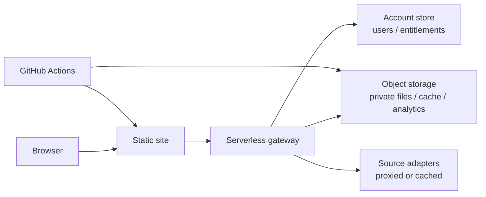

# Protected Document Service Architecture

Last updated: 2026-08-10

This document describes the protected document service.

## Overview

The service is a static frontend backed by a serverless gateway:

- Static assets are built by GitHub Actions and deployed as a public site artifact.
- The browser calls the gateway for authentication, search-adapter requests, analytics, and private file downloads.
- Private binaries, cache objects, custom access records, audit files, and analytics events live in object storage.
- The production account store is explicitly selected with `ACCOUNT_STORE_MODE=supabase`.
- In production, missing or failing account-store configuration rejects account and authorization requests instead of falling back to legacy object-storage indexes.



## Core Components

| Component | Role |
| --- | --- |
| Static site | Search UI, document detail views, account UI, and admin/operator tools. |
| Gateway | Validates access, proxies selected requests, records events, and streams private files. |
| Object storage | Stores private binaries, cached adapter output, audit records, and analytics. |
| Account store | Authoritative users, subscriptions, item-level grants, and usage records. |
| Build scripts | Generate catalogs, indexes, static assets, and storage sync plans. |

## Data Boundary

The static artifact contains metadata, filtered search text, normalized titles, and UI assets. Private file bytes are served through the gateway.

## Private File Access

Private files are returned only by the gateway. The gateway checks at least one valid authorization path before streaming the file:

- an authenticated account with an active role or entitlement;
- a shared access phrase;
- a derived one-item access code;
- an administrator-created custom grant.

The gateway rechecks authorization immediately before sending the file body.

## Derived Access-Code Mechanism

Single-item access codes are deterministic, secret-backed identifiers. They are not stored in plaintext.

```text
raw = HMAC_SHA256(ACCESS_SECRET, ACCESS_DOMAIN + ":" + item_id)
code = BASE32(raw)[0:12]
display = group(code, 4, "-")
```

Rules:

- `ACCESS_SECRET` is stored only as a secret.
- `ACCESS_DOMAIN` is a private message-domain prefix and must not be reused for sessions, admin tools, captcha, or webhook verification.
- `item_id` is the stable internal identifier for the private file.
- Only the truncated, grouped code is shown to operators or users.
- Rotating `ACCESS_SECRET` changes all derived codes.

This is an access-code derivation scheme, not reversible encryption. The file itself remains private because the object is stored outside the public artifact and is served only after gateway authorization.

## Token Separation

User sessions, captcha tokens, administrator utility tokens, and webhook validation use separate HMAC message domains. Administrator tokens also verify explicit `kind`, `aud`, and `version` fields so they cannot be accepted as user tokens.

## Account Store Mode

`ACCOUNT_STORE_MODE` must be set explicitly:

| Mode | Intended Use |
| --- | --- |
| `supabase` | Production account and entitlement authority. |
| `r2` | Local tests or controlled migration work only. |

Production requires both the account-store URL and service-role credential. Partial configuration fails closed. In production mode, legacy object-storage account indexes are not used as an automatic fallback.

## Object Storage Layout

Prefixes are implementation details, but the storage model is:

| Area | Contents |
| --- | --- |
| Private files | Current downloadable binaries. |
| Adapter cache | Cached source-adapter search results and prepared files. |
| Account records | Custom grants, backups, audit logs, disabled states, and migration-only legacy records. |
| Analytics | Search, open, download, and delivery events. |
| Build cache | Files cached for admin/operator workflows. |

Capacity controls may archive old private binaries while keeping metadata searchable.

## Search Index Policy

- Metadata can be public if it has been normalized and approved.
- Full-text search fragments should be size-limited and filtered before publication.
- Historical text can be split into lazy-loaded shards so the browser does not fetch everything at first paint.
- Archived items can remain searchable as metadata-only records, while downloads continue to require gateway authorization.
- Extracted chart descriptions follow the incremental, hash-deduplicated pipeline in
  [Chart Search Architecture](chart-search-architecture.md); public chart records use
  opaque image ids and catalog report ids, never private filesystem or object paths.

## Source Adapter Policy

Public UI labels should stay generic, for example:

- primary collection;
- auxiliary collection;
- high-authority collection;
- external source adapter.

The browser should use the unified detail page and the gateway for protected flows.

Metadata-only supplemental leads use the opaque-ID and redaction contract in
[Supplemental Source-Lead Adapter](source-lead-adapter.md). Upstream locations,
brands, private locators, and contact values remain deployment secrets; public
responses expose only neutral labels and contact-only detail pages.

## Engagement And Publication Extensions

- Daily rewards, the 30-day Course gate, and privacy-preserving attribution are
  defined in [Engagement, Analytics, and Course Access](engagement-analytics-course-architecture.md).
- Blog persistence, title SEO, cover handling, and private hostname
  materialization are defined in [Blog SEO and WeChat Output Contract](blog-seo-wechat-output.md).
- Chart descriptions and image-hash checkpoints are defined in
  [Chart Search Architecture](chart-search-architecture.md).

## Hosting And Public-Identity Boundary

The production hostname is served by an edge Worker backed by immutable object
storage releases. It must not be configured as a GitHub Pages custom domain.
Public source uses neutral placeholders; the production hostname, support
identity, source origins, and deny-list markers are materialized only from
encrypted deployment configuration in the short-lived Actions workspace.

`check_public_identity.py` runs before public commits and again against the
materialized release boundary. Workflow logs, artifacts, committed archives,
and public API responses must not contain private deployment values. A release
is switched only after the edge route and static identity checks succeed.

## Admin And Operator Tools

The admin surface can expose account, entitlement, analytics, and file-cache operations according to role. The operator surface should expose only the subset needed for daily operations.

Access edits use version fields such as `change_id` or `updated_at` so a stale editor cannot overwrite newer edits from another session. Limited-use grants should update counters with conditional writes.

## Deployment Checks

Before publishing gateway changes:

1. Validate JavaScript syntax.
2. Run the relevant worker tests.
3. Confirm account-store schema and row-level access configuration.
4. Confirm required repository variables mark schema and data-audit completion.
5. Deploy the gateway before publishing frontend changes that depend on it.
