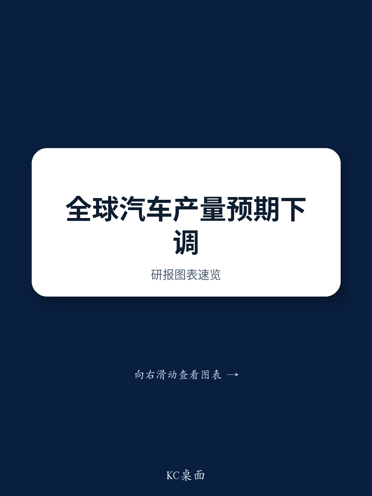
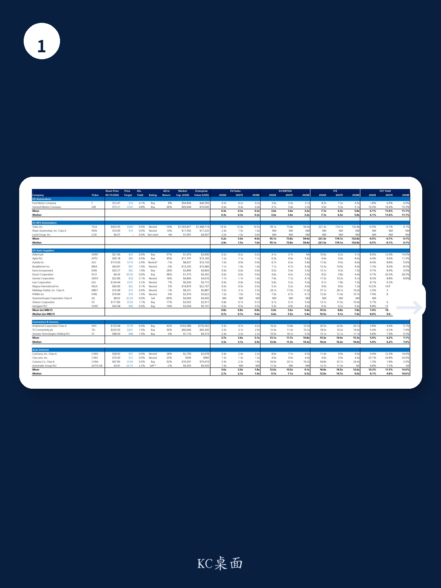
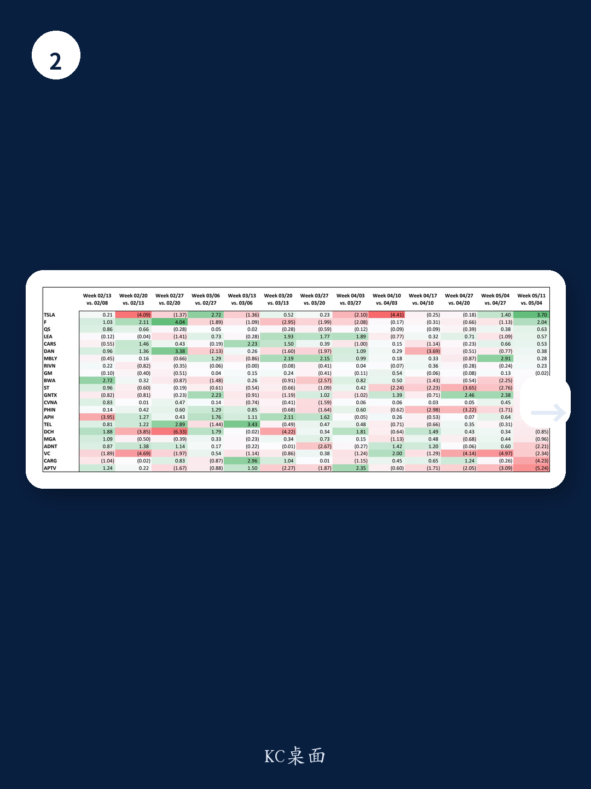

# 全球汽车产量下修背后，市场真正低估的是“非汽车AI叙事”的重定价能力

全球汽车产量预测正在经历一轮温和但结构性的下修。S&P Global Mobility 刚刚将2026年全球产量预期下调0.5个百分点，同比降幅从-1.8%扩大至-2.4%。单看数字，这似乎只是宏观疲软的又一个注脚——多数供应商此前已按-2%左右的降幅做指引，偏差并不大。

但真正值得关注的，不是产量下修本身，而是市场正在重新定价一批汽车股的底层逻辑。上周，福特、博格华纳等公司因与AI数据中心相关的储能业务获得资金追捧，即便汽车主业承压。这背后隐藏着一个更深层次的判断：当一家汽车公司能够用非汽车主题“捕获”一般投资者的想象力，叠加本身已被压低的估值，就可能触发重估。这份来自某外资投行的研报，恰恰提供了这样一个观察框架——产量数字只是表，真正的变量在于供给侧的再定价和跨界叙事的价值。

## 1. 产量下修的核心并非总量，而是区域结构和“前置生产”的扰动

研报指出，2026年产量下修主要集中在2至4季度，同比降幅达到-2.6%，而1季度反而被上调了1.6%。表面看，1季度的“强劲”缓解了部分担忧，但S&P认为这更多是周期性因素——部分产量被前置，因为OEM厂商在防范原材料或零部件短缺。换句话说，上半年的好数据可能透支了下半年的需求。

更关键的是下修的区域分布：中国贡献了41%，南亚16%，欧洲和日韩各13%，北美仅占5%（约4.2万辆）。对于北美供应商而言，这个混合结构并不算糟糕。这意味着，产量下修对北美暴露度高的公司冲击相对有限，而对中国依赖度高的公司则需更为警惕。

这里的含义是：投资者不应简单看总量数字，而应拆解下修的区域结构，判断自己持仓的暴露度。研报同时提示，其自身模型对中国和欧洲的数字已经比S&P分别低了约1%和0.4%，但在北美更高——说明不同机构的预期仍有分歧，这为后续调整留下了空间。

## 2. “汽车AI交易”并未死亡，而是从概念炒作转向有选择性的价值重估

上周，福特因储能业务（BESS）获得市场追捧，尽管周五有所回落，但一周涨幅仍达9%。研报认为，这并非偶然。福特与宁德时代的技术合作关系、PTC资格带来的成本优势，以及其产品可能符合FEOC标准从而获得ITC税收抵免，这些因素共同构筑了一个相对稀缺的竞争壁垒。在目前碎片化的储能价值链中，福特有可能实现从电芯到安装的全链条覆盖。

但研报也谨慎指出，“好事过头”的风险存在。福特的肯塔基工厂要到2027年四季度才投产，客户订单仍在洽谈中。市场对这类故事的预期管理至关重要——需要持续的信息流来支撑估值，而非一次性脉冲。

真正的洞察在于：福特和博格华纳的上涨说明，如果一家公司能够用非汽车主题（尤其是AI数据中心相关）赢得一般投资者的关注，同时自身估值又足够便宜，那么重估的可能性就会显著提升。这是因为其他AI相关标的已经普遍偏贵。研报特别点出，ST和APTV是这一主题下最值得关注的潜在受益者。

## 3. 连接器板块正在接近估值支撑，但光学替代铜缆的争议尚未定价

研报同时关注了安费诺（APH）和泰科电子（TEL）的估值变化。两者在经历近期回调后，已经接近估值支撑区域，从盈利修正角度看变得更容易持有。更重要的是，相对于其他工业AI标的，它们显得有吸引力。

但这里存在一个尚未被充分讨论的变量：AI数据中心内部正从铜缆连接向光学连接迁移。市场目前对安费诺的反馈更为积极，因为投资者对其在光学领域（尤其是CCS）的布局更有信心。泰科电子则面临更多质疑。

这个争议的实质是：连接器公司的AI叙事是否还能继续成立？如果光学替代铜缆的速度加快，那么当前基于铜缆的估值逻辑就需要重新审视。研报认为两家公司都有良好的下行估值支撑，且未来几年盈利修正存在正向偏倚，但并未完全回答“光学替代”对估值倍数的影响有多大。这恰恰是报告留下的一处伏笔。

## 4. 报告尚未完全回答的关键问题：储能业务的盈利模型和光学替代的时间表

尽管研报对福特的储能机会给出了积极评价，但并未详细展开其单位经济模型、客户集中度以及竞争对手可能采取的反制措施。福特的“电芯到安装”一体化模式在碎片化市场中确实有吸引力，但执行难度不容低估。此外，PTC资格和FEOC合规性这些关键优势，是否具有可持续性？如果政策环境发生变化，这些壁垒是否会迅速消失？

对于连接器板块，光学替代铜缆的技术路线和时间表仍是最大的不确定性。研报指出投资者对安费诺的反馈更积极，但并未量化光学替代对两家公司收入结构的具体影响。这是一个需要持续跟踪的变量——如果光学渗透率在2027至2028年加速提升，那么当前基于铜缆的估值倍数可能面临下行风险。

## 5. 投资者的观察框架：从“汽车公司”转向“拥有汽车业务的科技/能源公司”

综合研报的观点，一个清晰的观察框架正在浮现：传统的汽车股分类正在失效。未来6至12个月，投资者需要从三个维度重新审视每家公司：

第一，汽车主业的下行风险是否已经被价格充分反映。当前多数供应商的估值已经处于历史低位，P/E在6至10倍区间，FCF收益率在8%至12%之间。如果产量下修幅度没有超预期，这些数字可能提供了安全垫。

第二，非汽车业务的叙事是否具备“可投资性”。不是所有储能或AI概念都能被市场接受。关键在于：是否有明确的竞争优势（如技术壁垒、成本优势、合规壁垒）、是否有可验证的客户进展、以及管理层是否愿意持续释放信息。研报对福特的评价就体现了这一筛选标准。

第三，跨界叙事的估值溢价是否可持续。当前福特和博格华纳的上涨，部分原因是其他AI标的已经太贵。如果AI板块整体估值回调，或者这些公司的非汽车业务进展低于预期，那么溢价可能快速消失。投资者需要区分“结构性重估”和“主题性炒作”。

这份报告最有价值的地方，不是给出了具体的产量数字或估值表格，而是提供了一个思考框架：在汽车行业进入结构性调整的背景下，哪些公司能够通过非汽车叙事实现价值重估？哪些公司只是周期性的反弹？答案可能取决于投资者是否愿意跳出传统的行业分类，用更跨界的视角去理解这些公司的业务组合。

产量下修还会继续，但真正的机会可能不在产量本身。

欢迎来星球微信群继续讨论：哪些汽车公司的非汽车业务最有可能被市场重新定价？光学替代铜缆对连接器估值的影响有多大？完整研报的估值表格和更多细节，我们会在社群中继续拆解。

Personal reading notes and learning share only. Not investment advice.

