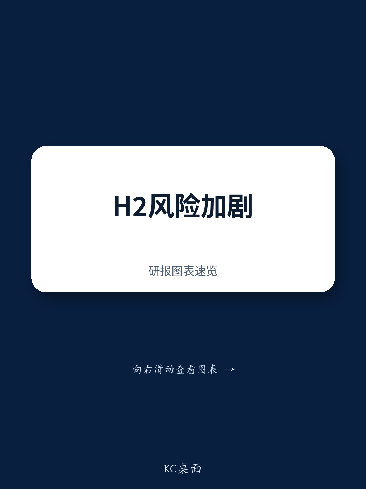
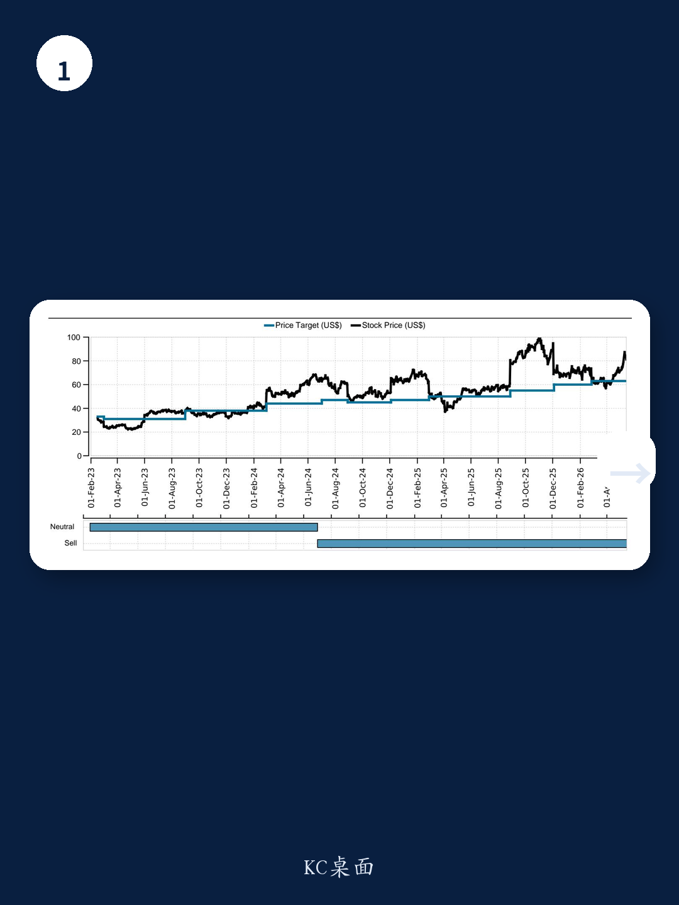
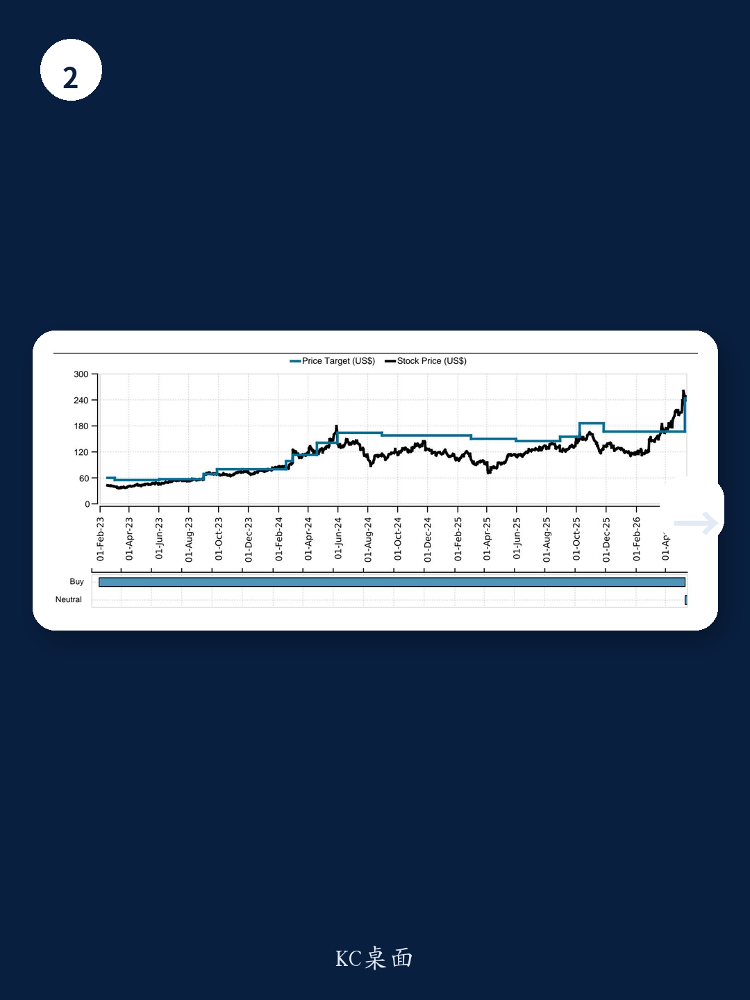

# 市场真正低估的不是AI需求，而是内存成本引发的利润断层

一份覆盖HP Inc、Dell Tech、NetApp和Everpure四家核心硬件企业的研报，在即将到来的财报季前释放了一个信号：四月的数字大概率不会太差，但市场的注意力应该从“能不能超预期”转向“下半年利润会不会断崖式修正”。这份研报的核心判断并非需求疲软，而是在历史级的内存成本上涨面前，OEM企业正在用提价来保护毛利率，而这一行为本身正在制造需求毁灭的风险。对于持有或正在跟踪这些标的的投资者而言，真正需要关注的不是即将发布的季度数据，而是管理层对下半年的指引将如何定价这份不确定性。

## 1. 四月季报大概率符合预期甚至略超，但真正的风暴在下半年

研报对四家公司的四月季度给出了基本一致的判断：收入端受到Windows 11升级周期尾部效应和客户提前采购的共同支撑，大概率落在预期区间上沿。HP Inc的PC业务、Dell Tech的AI服务器收入、NetApp的存储需求以及Everpure的全闪存阵列，都在短期内表现出韧性。然而，研报反复强调一个时间节点——下半年。核心变量是内存成本。DDR DRAM合约价格季度环比涨幅预计接近60%，NAND闪存同样上涨60%。当OEM企业将这部分成本转嫁给终端客户时，PC和服务器的平均售价正在被推高，而高价正在抑制增量需求。HP Inc的PSG（个人系统）利润率已经低于其长期指引区间（5%-7%），研报预计这一趋势将在下半年进一步恶化。换句话说，四月的好数字，可能只是暴风雨前的最后平静。

## 2. 内存成本上涨正在制造一个“需求提前+需求毁灭”的双重挤压

研报提供了两个值得深入推敲的数据点。其一，CDW（大型IT分销商）在三月季度因客户提前采购，预计产生了约1亿美元的收入拉动。其二，Everpure自身也承认F1Q中约有8个百分点的增长来自订单提前。这些数据叠加在一起，指向一个清晰的判断：当前的需求并非自然增长，而是由客户对涨价的恐慌性采购驱动的。这种提前采购的后果是，下半年的需求池将被提前抽空。研报特别指出，HP Inc的Windows 11升级周期已完成约60%，这意味着剩余的可转化需求正在快速收窄。当升级红利耗尽、提前采购透支未来需求、而终端价格仍在上涨时，下半年的出货量和利润率将同时承压。这不是一个线性外推的问题，而是一个结构性的供需错位。

## 3. 投资者对EPS的预期可能已经低于一致预期，但风险仍未被完全定价

一个容易被忽视但非常重要的信息点是，研报在讨论HP Inc的FY26指引时指出，基于与投资者的交流，市场对EPS的实际预期已经降至2.70-2.80美元区间，远低于公司官方指引的2.90-3.20美元。这意味着，即使公司在下一次财报中重申指引，市场可能也不会感到意外，因为预期已经先行下调。但问题在于，这一预期是否已经充分反映了内存成本在下半年的二次冲击？研报对NetApp的FY27初始EPS指引给出了8.25-8.55美元的区间，低于Visible Alpha一致预期的8.59美元，主要原因是产品毛利率持平。对于Everpure，研报认为FY27毛利率指引存在下行风险，即使管理层声称F1Q是毛利率的底部。这些判断表明，即使在已经下调的预期基础上，利润端仍有未被充分定价的向下空间。市场的定价逻辑可能从“需求是否强劲”转向“利润能否守住”。

## 4. 研报尚未完全回答的关键问题：AI服务器的利润率能否对冲内存冲击

这是研报中一个值得深挖但并未充分展开的线索。Dell Tech的AI优化服务器收入是其四月季度超预期的主要驱动力，但研报明确指出，AI服务器的运营利润率较低，限制了EPS的上行空间。这意味着，AI带来的收入增长，在利润层面可能不如传统企业级业务。如果内存成本持续上涨，而AI服务器又无法贡献足够的利润增量来对冲，那么Dell Tech的整体利润率将面临更大的压力。研报没有给出一个清晰的“AI服务器利润率拐点”判断，也没有分析AI需求是否具备足够的定价权来消化组件成本。这是一个需要投资者在财报电话会上重点追问的问题。对于NetApp和Everpure而言，同样存在类似的疑问：公共云业务的毛利率贡献能否完全弥补产品毛利率的下降？目前来看，答案并不乐观。

## 5. 投资者需要建立的新观察框架：从“收入增速”转向“利润韧性”

传统上，硬件企业的投资逻辑围绕收入增长、市场份额和产品周期展开。但在这份研报的框架下，未来6-9个月的核心变量变成了利润韧性。具体而言，需要关注三个维度：第一，公司是否有能力通过长期协议（LTA）或产品重新配置来锁定成本，而不是被动接受现货市场的内存定价；第二，提价对终端需求的影响何时从“提前采购”转为“需求冻结”，这需要跟踪渠道库存和客户订单周期变化；第三，AI业务在利润表中的真实贡献——是拉低整体毛利率，还是能够通过规模效应逐步改善。研报中有一张图表显示，HP Inc相对于标普500的估值折价已经接近66%，为十年来的最宽水平。这既反映了市场对内存冲击的担忧，也可能意味着一旦利润端出现超预期韧性，估值修复的空间同样可观。但关键在于，利润韧性这一假设目前仍缺乏足够的数据支撑。

---

欢迎来社群继续拆解这份完整报告。我们会在财报发布前后，结合四家公司的实际数据和电话会纪要，重点讨论以下未解问题：内存成本的传导机制是否真的如研报所预期的那样线性？AI服务器的利润率拐点何时出现？以及，当市场对EPS的预期已经先行下调之后，真正的预期差究竟在哪里。

Personal reading notes and learning share only. Not investment advice.

