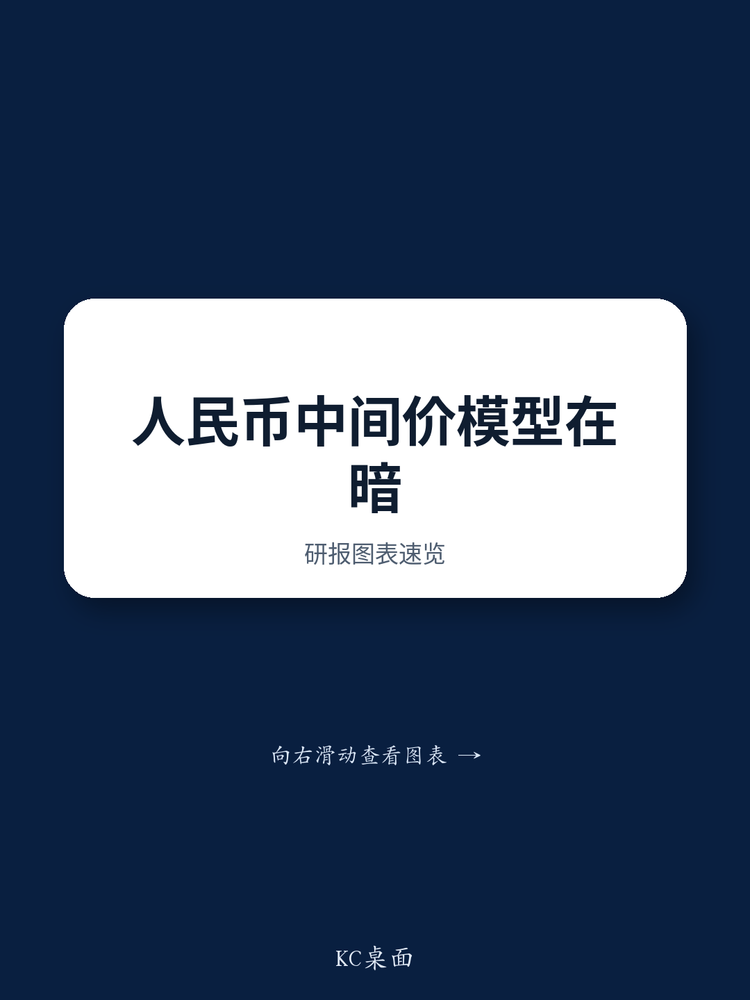
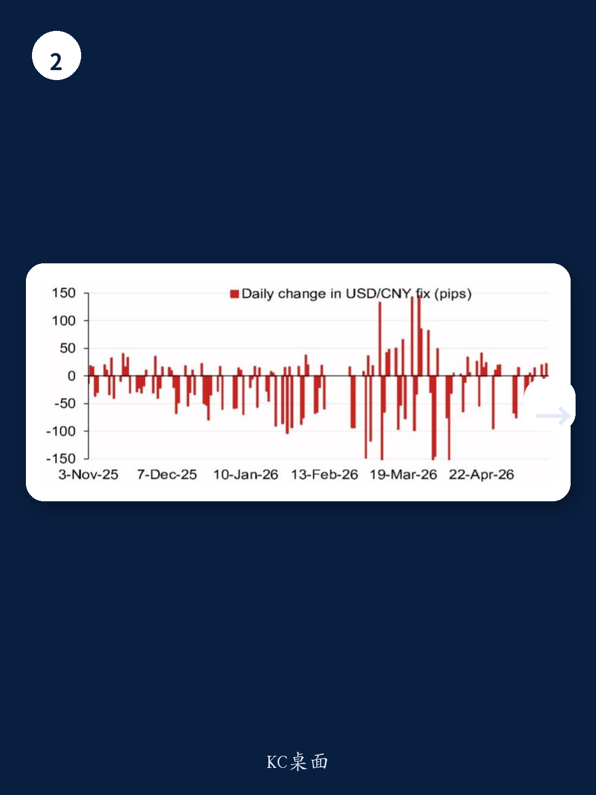

# 人民币中间价的信号：市场低估了政策工具箱的主动性

当多数市场参与者还在争论人民币是否会“破7”时，某外资投行最新发布的中间价模型给出了一个值得深究的数字：6.7927。这个数字比前一次模型预测低了470个基点，比官方即期收盘价低了133个基点。模型的预测值与现实之间的差距，恰恰是理解当前汇率博弈的关键。这份报告的核心判断并非简单的方向预测，而是揭示了一个更深层的机制：中国央行正在通过中间价这一工具，重新定义市场预期的锚点。理解这个锚点如何移动，比猜测汇率具体点位更重要。

## 1. 模型预测的偏离并非误差，而是政策意图的映射

报告中最引人注目的并非6.7927这个预测值本身，而是它与此前预测值之间的巨大落差。模型预测在短时间内下调了470个基点，这绝非随机波动。仔细拆解模型背后的驱动因素，四个主要货币——韩元、欧元、澳元、卢布——的隔夜变动贡献了绝大部分的预测变化。但真正值得关注的，是模型在引入“逆周期因子”后的调整。当加入这一因子后，预测值从6.7927小幅调整至6.8058。这个仅133个基点的修正幅度，反而比模型本身的方向性变化更有信息含量。

它意味着，在当前环境下，央行并未选择通过逆周期因子进行强力的方向性干预，而是让模型本身去捕捉外部市场的变化。这传递了一个信号：央行对当前人民币的定价水平有相当的容忍度，但容忍不等于放任。模型预测与官方中间价之间的差距，就是政策主动性的缓冲区。对于投资者而言，这意味着不能简单地将中间价视为市场供求的被动反映，而应将其视为一个包含政策偏好的复合变量。

## 2. 模型误差的历史波动揭示了政策容忍度的边界

报告提供的模型误差历史数据，是理解政策逻辑的另一个关键维度。从2025年初到2026年4月，模型的每日误差经历了从-1800个基点的大幅偏离，到逐渐收敛至600个基点以内的过程。这一波动轨迹，本质上就是央行政策容忍度边界的动态刻画。

2025年初的大幅负误差，对应的是市场对人民币贬值预期的集中释放，而央行通过中间价进行了有力的对冲。误差的快速收敛，则表明当市场预期与政策意图趋于一致时，央行会迅速放松干预力度。到2026年，误差稳定在正负600个基点的区间内，这或许可以被视为当前政策框架下“可接受的偏离范围”。这个范围不是固定的，它会随着外部环境（如中美关系、美元走势）和内部目标（如稳增长、防风险）的变化而调整。

对于投资者而言，监测每日的模型误差，比紧盯即期汇率更有意义。当误差持续扩大并突破历史波动区间时，往往意味着政策框架可能面临调整，或是市场正在酝酿一次方向性的突破。

## 3. 2026年下半年的关键事件将构成汇率定价的“压力测试”

报告在附录中列出了一份2026年下半年的关键事件日历。这份日历并非简单的日程表，而是汇率定价逻辑中不可忽视的外部变量。其中，11月在深圳举办的APEC会议，以及年底中国领导人可能对美国的访问，是两条影响汇率预期的主线。

这些事件之所以重要，并非因为它们本身能直接改变汇率，而是因为它们会重塑市场对中美关系这一核心变量的叙事。当前的人民币定价，本质上是在“经济基本面”与“地缘政治风险溢价”之间寻找平衡。APEC会议若能释放出合作信号，将显著降低风险溢价，为人民币提供支撑。反之，若会议前后出现新的摩擦，市场会迅速将这一风险重新定价到汇率中。

报告没有给出具体的事件驱动交易策略，但它的价值在于提供了一个分析框架：将汇率定价拆解为“模型可量化的部分”和“事件驱动的不可量化部分”。投资者需要做的，不是预测每个事件的结果，而是评估当前价格中已经包含了多少“合作预期”或“对抗预期”，以及这些预期在事件前后可能如何被修正。

## 4. 报告尚未完全回答的关键问题：逆周期因子的使用阈值在哪里？

尽管报告提供了丰富的模型细节和事件线索，但它留下了一个关键空白：逆周期因子的使用规则依然是一个黑箱。模型预测显示，在没有逆周期因子调整时，预测值为6.7927；加入因子后变为6.8058。这个调整幅度很小，但它无法回答一个更根本的问题：在什么条件下，央行会大幅启用逆周期因子，让中间价与模型预测产生系统性偏离？

历史上的经验是，当汇率出现“羊群效应”或“无序波动”时，逆周期因子会被激活。但“无序”的定义是模糊的，且随着时间变化。当前模型误差处于历史低位，这或许意味着央行认为市场运行基本有序。但若未来外部冲击导致误差迅速扩大，央行会在哪个临界点出手？是误差超过1000个基点，还是当贬值预期开始影响资本流动数据时？

这个问题的答案，直接决定了投资者应该如何为汇率风险定价。如果逆周期因子的使用阈值是明确的，那么汇率的下行风险就是可控的；如果阈值是动态且不可预测的，那么市场就需要为更大的尾部风险定价。报告没有给出答案，但这恰恰是深入讨论的开始。

## 5. 给决策者的观察框架：从“预测点位”转向“监测信号”

基于上述分析，一个更务实的做法是放弃对具体汇率点位的预测，转而建立一套监测政策意图和市场压力的信号体系。这套体系至少应包括三个层次：

第一，每日的模型预测值与实际中间价之间的偏差，以及偏差的方向和幅度。这是最直接的“政策温度计”。

第二，模型误差的历史分位数。当误差处于历史90%分位数以上时，意味着市场与政策之间出现了显著的张力，需要警惕政策调整或市场突破。

第三，关键事件前后的汇率波动率变化。如果波动率在事件前持续压低，可能意味着市场在押注一个特定的结果；如果波动率在事件后急剧放大，则说明预期被打破，新的定价正在形成。

这套框架的核心，是将注意力从“汇率会到多少”转移到“政策在做什么”和“市场在如何反应”。对于持有人民币资产或负有外币负债的决策者而言，后者才是真正可操作的信息。

这份报告的价值，不在于给出了一个精确的预测数字，而在于它拆解了中间价形成的“配方”。但配方中有一味关键的“调料”——逆周期因子的使用规则——报告并未完全展开。这个未解的问题，恰恰是理解未来汇率波动边界的关键。欢迎来社群继续拆解完整报告，我们会在微信群中围绕逆周期因子的历史使用案例和触发条件进行更深入的讨论。

Personal reading notes and learning share only. Not investment advice.

