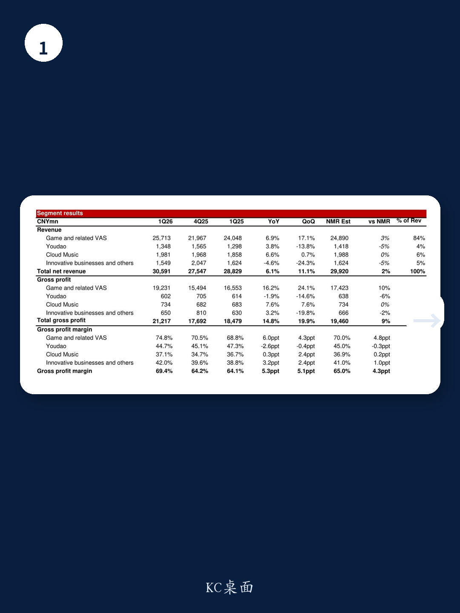
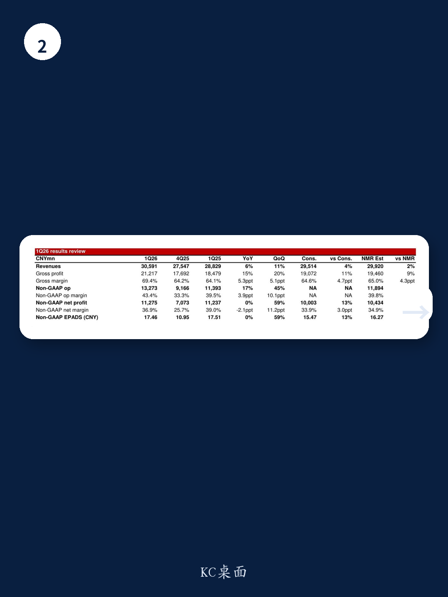

# 网易的利润弹性被低估了：真正超预期的不是收入，而是毛利率的结构性重塑

市场对网易2026年第一季度的关注点，大多集中在《永劫无间手游》能否接棒、以及新游《湮灭：边界线》的定档时间。但某外资投行最新发布的这份研报揭示了一个更值得关注的信号：网易本季度的超预期表现，核心驱动力并非爆款新游，而是老产品的利润结构发生了不可逆的改善。

这家投行在1Q26业绩快评中维持了对网易的“买入”评级，目标价155美元，对应FY26F 17倍市盈率，而当前估值仅为13倍。这个估值差背后，隐藏着一个市场尚未充分定价的逻辑——网易正在从一个“靠新品赌爆发”的游戏公司，转向一个“靠存量提效”的利润机器。

## 1. 游戏毛利率创历史新高，但市场可能误读了驱动因素

本季度网易游戏及相关增值服务的毛利率达到74.8%，同比提升6个百分点，环比提升4.3个百分点，创下近年来的最高纪录。这一数字不仅大幅超出投行预期的70%，也显著高于市场一致预期。

毛利率提升的直接原因，投行归结为两点：高毛利的PC端游收入占比提升，以及应用商店降低的分成比例。但这里有一个容易被忽略的结构性含义——网易的端游资产正在从“稳定器”变成“利润放大器”。

《梦幻西游》电脑版在本季度创下了390万的同时在线峰值新高，这是一个极具说服力的信号：一款运营超过20年的产品，不仅没有进入衰退期，反而在用户基数和变现效率上同时实现了突破。这意味着网易的核心端游IP已经形成了“用户粘性+付费深度”的双重护城河，而这种护城河带来的边际利润几乎是纯增量的。

对于投资者而言，需要重新评估的是：当一家公司的核心资产不再依赖高额的买量成本和渠道分成时，它的利润中枢应该对应什么样的估值倍数。

## 2. 收入超预期背后的“基数幻觉”与真实动能

本季度网易总收入同比增长6%至306亿元，超出彭博一致预期4%。投行特别指出，基于其测算，现金收入同比增长约3.7%，与预期基本一致，考虑到去年同期的高基数，这个增速“值得肯定”。

这里需要拆解一个关键细节：游戏及相关增值服务收入同比增长6.9%，但游戏毛利率却提升了6个百分点。这意味着收入的增长质量远高于表面数字——公司用更少的成本换来了更多的利润。换言之，如果收入增长是“量”，毛利率提升就是“质”，而本季度网易同时实现了量和质的改善。

但投行也暗示了一个潜在风险：现金收入增速（3.7%）低于报表收入增速（6%），两者之间的差异可能来自递延收入的释放节奏。这需要投资者在后续季度持续跟踪，以判断是否存在一次性因素。

## 3. 经营利润率扩张3.9个百分点，但非GAAP净利润为何持平？

一个看似矛盾的数据值得深究：本季度非GAAP经营利润同比增长17%，经营利润率从39.5%提升至43.4%，但非GAAP净利润却同比持平于113亿元。

投行没有在正文中展开解释这一差异，但根据财务逻辑，这通常指向非经营项目的扰动——可能是联营公司损益、投资收益或汇兑损益的变化。对于关注利润质量的投资者来说，这是一个需要进一步拆解的信号：经营利润的改善是真实的，但股东最终能留存多少，还取决于公司非主营业务的波动。

这也引出了一个问题：网易的利润弹性是否被非经营因素掩盖了？如果剔除这些扰动，核心游戏业务的利润增速可能比报表显示的更强劲。

## 4. 下半年最大的催化剂，但报告没有完全回答一个关键问题

投行明确指出，即将在3Q26上线的《湮灭：边界线》有望成为下半年游戏业务再加速的催化剂，并预计公司会选择在7月暑期档上线以最大化曝光。

但这份报告没有完全展开的是：这款新游的利润率模型会是什么水平？如果它是一款高买量、高渠道分成的移动游戏，那么它可能无法复制当前端游的高毛利率结构，甚至可能拉低整体毛利率。反之，如果它延续了网易近年来“端游IP化+手游精品化”的策略，那么它对利润的贡献可能超出市场预期。

这是决定网易下半年估值走向的一个关键变量，也是投资者需要持续跟踪的核心问题。

## 5. 港股双重主要上市的时间窗口，是一个被低估的催化剂

报告末尾提到，网易没有就港股股份从第二上市转换为双重主要上市的时间表提供更新。根据港交所现行规则，网易从2026年2月起有一年的时间窗口完成这一转换。

这看似是一个程序性事项，但它的含义远不止于此。完成双重主要上市后，网易将符合纳入港股通的资格条件，这意味着南向资金可以直接通过互联互通机制买入。对于一家当前估值仅为13倍远期市盈率、且具备持续回购能力的公司而言，一旦获得南向资金的增量配置，估值中枢的上移可能比基本面改善来得更快。

报告没有对此展开量化分析，但这是一个值得投资者提前布局的逻辑。

## 6. 市场真正忽视的，是“规模效应”向“议价权”的转化

综合来看，这份研报揭示的底层逻辑是：网易正在从一个依赖产品周期的游戏公司，转变为一个拥有稳定高利润现金流的平台型企业。其核心资产——端游IP的变现效率、渠道议价能力的提升、以及毛利率的结构性改善——都在指向一个结论：市场对网易的估值框架可能需要从“成长股”切换为“价值成长股”。

但报告也留下了一个未解的问题：这种毛利率的改善是可持续的，还是阶段性的？渠道分成的降低是否会被新游的高买量成本抵消？端游用户的高粘性能否在移动端复现？

这些问题，需要更深入的财务报表拆解和产品管线分析才能回答。

---

如果你对网易的利润结构拆解、新游利润率假设、以及港股通纳入的估值影响感兴趣，欢迎来我们的星球微信群继续讨论。我们会基于这份研报的原始数据和财务模型，逐一拆解那些报告没有完全展开的二阶影响。

Personal reading notes and learning share only. Not investment advice.

