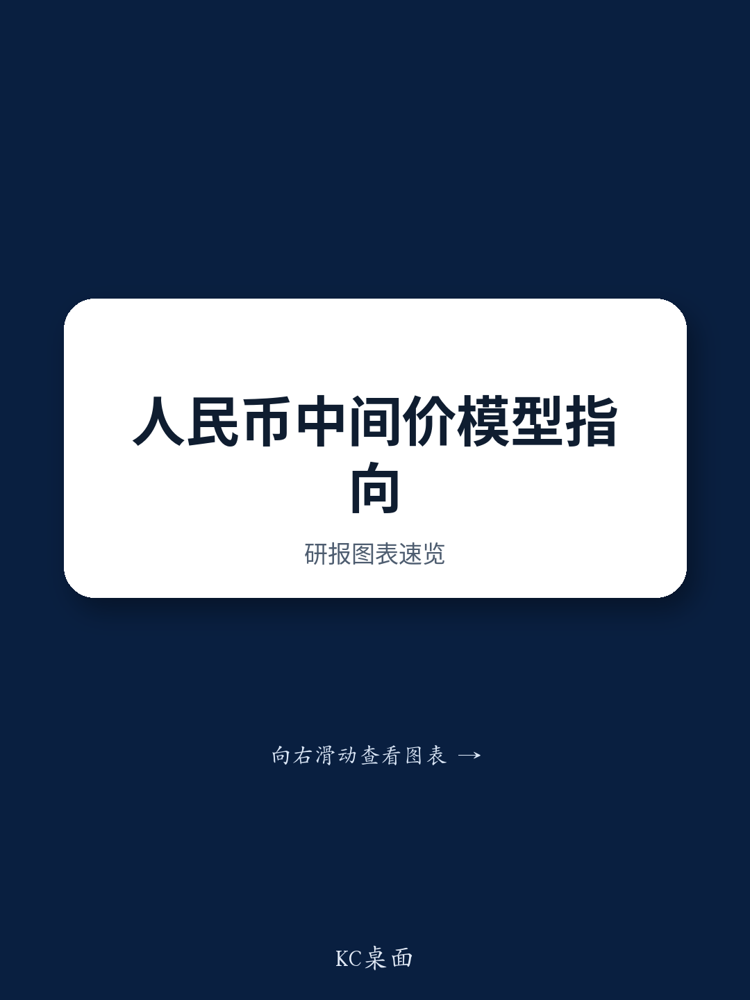

# 人民币中间价模型正在发出一个被忽视的信号：政策工具箱比市场想象得更灵活

外汇市场参与者习惯将人民币中间价视为政策意志的直接投射。当模型预测值与实际公布值出现偏差，市场的第一反应往往是寻找“干预”或“维稳”的叙事。但某外资投行最新发布的人民币中间价预测模型，揭示了一个更微妙的机制：中间价的设定并非简单的“强”或“弱”的二元选择，而是一个包含多个可调节变量的精密方程。市场真正需要关注的，不是中间价的绝对水平，而是模型内部各因子权重的动态变化——这背后才是政策意图的真实映射。

该模型在2026年5月22日给出的无逆周期因子调整的预测值为6.7979，较前一日的6.8349大幅调降370个基点。即便加入逆周期因子调整，预测值也在6.8138，仍较前一日低211个基点。这份报告的价值不在于预测本身是否精确，而在于它提供了一个拆解中间价形成机制的分析框架，让市场参与者能够量化评估不同因素对最终定价的边际影响。

## 1. 模型误差的历史波动揭示政策节奏，而非模型失效

报告提供的模型误差历史数据值得反复推敲。从2025年1月至2026年4月，每日模型误差（未调整逆周期因子）的波动区间从-1800个基点延伸至+600个基点。如果模型是完美的，误差应为零。但实际误差的大幅波动恰恰说明，模型所依赖的市场变量——隔夜汇率变动、一篮子货币走势等——并不能完全解释中间价的设定。

关键洞察在于误差的“方向性”。2025年初至年中，误差持续为负（模型预测值高于实际中间价），意味着实际中间价设定比模型预测的更弱。而进入2026年，误差转正，实际中间价反而强于模型预测。这种转变不是模型的缺陷，而是政策节奏变化的量化证据。当误差从负转正，它暗示决策层对汇率波动的容忍度或目标区间发生了系统性调整。投资者不应将模型误差视为噪音，而应将其作为解读政策意图的领先指标。

## 2. 隔夜贡献的权重分布正在重写汇率传导的底层逻辑

模型预测的变动并非由单一货币对驱动。报告详细列出了对预测变化贡献最大的四个货币对：俄罗斯卢布（+18个基点）、欧元（+11个基点）、韩元（+3.5个基点）和澳元（-8个基点）。这一排序本身就是一个重要信号。

卢布的权重跃居首位，表明地缘政治风险溢价正在通过中间价模型被更直接地定价。欧元和韩元紧随其后，反映了全球贸易摩擦和区域经济增长分化对人民币汇率的影响。而澳元的负贡献则暗示，大宗商品价格波动对人民币的传导路径可能正在发生变化。传统的“人民币跟随一篮子货币”的叙事过于粗糙。真正重要的是，模型内部对不同货币对的权重分配是否在动态调整。如果卢布的贡献持续放大，意味着人民币中间价对地缘政治事件的敏感度正在结构性上升，这对所有持有人民币资产的投资者都是一个需要重新校准的风险参数。

## 3. 逆周期因子的存在本身就是最关键的“未解变量”

模型在加入逆周期因子后，预测值从6.7979变为6.8138，差距为136个基点。这136个基点，就是政策主动干预的空间。但报告并未详细展开逆周期因子是如何被计算或调整的。

这里存在一个关键但尚未被完全回答的问题：逆周期因子究竟是“平滑器”还是“方向器”？如果它只是平滑市场波动，那么其调整幅度应该与市场波动率成正比。但从模型误差的历史走势看，逆周期因子的作用似乎并非线性。在特定时间点——比如2025年1月误差达到-1800个基点时——逆周期因子可能被大幅启用，以阻止中间价过快贬值。而在2026年误差转正后，其作用可能减弱甚至反向。市场需要一套可追踪的框架来理解逆周期因子的触发条件，而不是仅仅将其视为一个黑箱。报告没有提供这个框架，而这恰恰是深入分析的核心。

## 4. 2026年下半年的事件日历是测试政策灵活性的关键窗口

报告列出的2026年下半年重要事件日历，实际上为中间价模型的压力测试提供了时间表。从7月的政治局会议、10月的国庆黄金周、11月的APEC会议，到年底的中央经济工作会议和潜在的中美领导人会晤，每一个事件都是政策意图的潜在“释放点”。

在这些关键节点前后，模型误差和逆周期因子的使用频率可能会发生显著变化。例如，在APEC会议前，决策层可能倾向于维持中间价稳定，以营造良好的外交氛围。而在中央经济工作会议后，如果经济数据需要，汇率弹性可能被重新激活。投资者不应孤立地看待中间价预测，而应将其与这些事件日历进行交叉验证。一个有效的策略是：在重大事件前，关注模型误差是否收窄（政策维稳）；在事件后，关注误差是否扩大（政策调整）。

## 5. 市场尚未充分定价的，是模型参数本身的“可调整性”

大多数市场讨论聚焦于中间价的“水平”，而忽略了模型参数本身的“可调整性”。这份报告隐含的一个更深层判断是：决策层可能正在根据外部环境变化，系统性地重新校准模型内部各因子的权重。例如，卢布贡献的上升可能并非临时现象，而是反映了外汇篮子权重或定价公式的长期调整。

这意味着，单纯追踪美元对人民币的即期汇率已经不够。投资者需要建立一个更复杂的监测体系，包括：隔夜贡献的货币对分布是否发生结构性变化、模型误差的方向和幅度是否出现趋势性转变、逆周期因子的隐含使用频率是否在上升。这些信号组合在一起，才能拼凑出人民币汇率政策的全貌。报告提供了一个起点，但真正的分析工作在于跟踪这些参数的动态变化，而不是预测一个静态的数字。

这份报告的价值，不在于它预测了一个具体的中间价数字，而在于它揭示了一个可被持续追踪的分析框架。模型误差的历史波动、隔夜贡献的权重分布、逆周期因子的调整幅度——这些参数本身，就是政策意图的量化表达。市场参与者需要从“看中间价”转向“看模型”，从“猜方向”转向“测参数”。

关于逆周期因子的具体触发机制、模型误差的统计特征、以及不同事件场景下参数变化的概率分布，报告并未完全展开。欢迎来我们的星球微信群，继续拆解这份报告的完整数据与图表，一起讨论如何将模型参数的变化转化为可执行的观察框架。

Personal reading notes and learning share only. Not investment advice.

