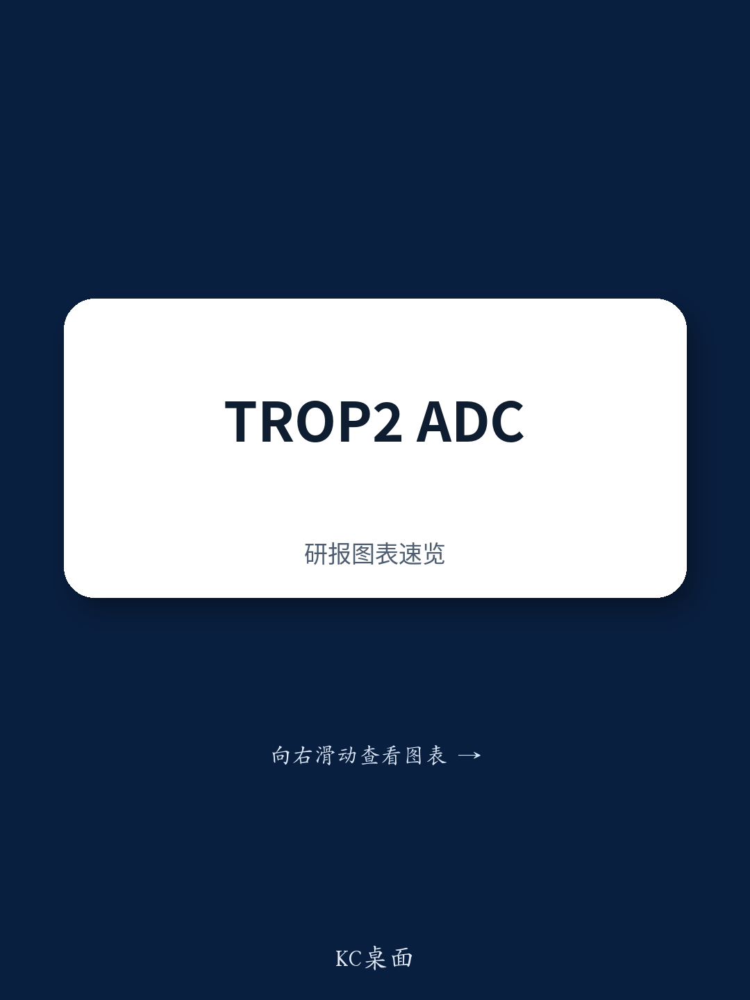
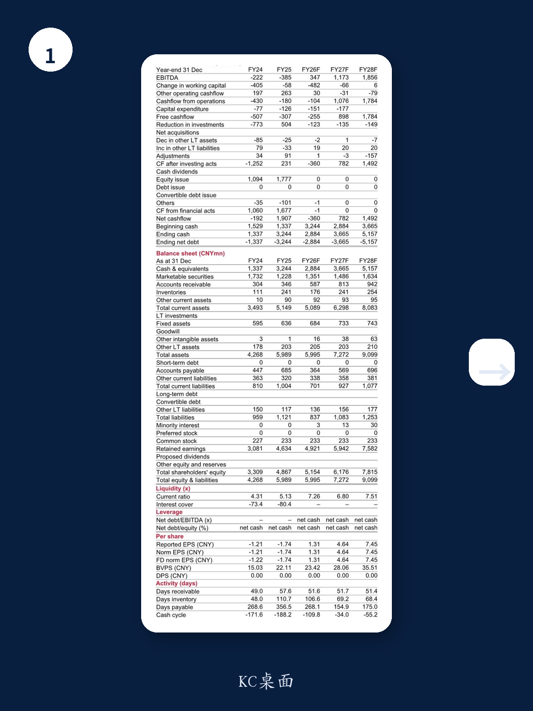
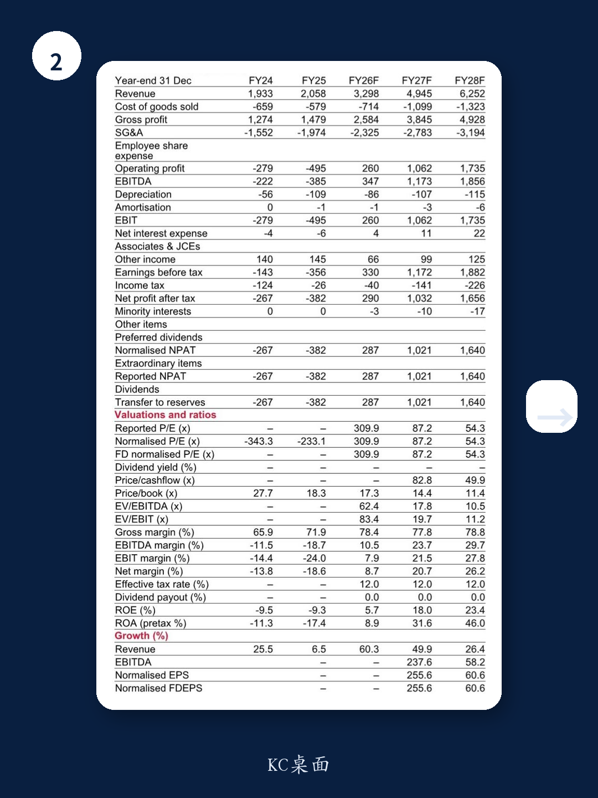

# 市场低估的不只是这款ADC的数据，而是它对一线肺癌治疗格局的改写能力

2026年ASCO年会前夕，某外资投行发布了一份关于科伦博泰核心产品sac-TMT的研报更新。报告的核心判断不是“数据好”，而是“数据好到可能改变竞争格局”。

这份研报上调了目标价至544.42港元，隐含约20%的上行空间。但真正值得关注的，不是目标价本身，而是驱动这一调整的三个结构性因素：sac-TMT在PD-L1阳性非小细胞肺癌一线治疗中展现的PFS HR达到0.35，这是目前同类III期临床试验中ADC药物报告的最好水平；其在不同PD-L1表达水平亚组中的表现差异，暗示了更精准的患者分层可能；以及该适应症已获中国监管机构优先审评，商业化进程可能快于预期。

对于关注中国创新药资产定价的投资者而言，这份报告提供的不只是一个公司的催化剂，而是一个观察ADC药物如何从后线治疗向一线治疗渗透的窗口。

## 1. 0.35的PFS HR不只是数字，它重新定义了一线治疗的可比基准

OptiTROP-Lung05试验的数据核心是：sac-TMT联合帕博利珠单抗对比帕博利珠单抗单药，在PD-L1阳性NSCLC患者中，PFS尚未达到中位数对比5.7个月，HR为0.35。报告明确指出，这是首个在PD-L1阳性NSCLC III期试验中报告PFS改善的ADC。

理解这一数据的重要性，需要把它放在竞争格局中看。目前这一领域的主流方案，包括依沃西单抗、帕博利珠单抗联合化疗等，其PFS HR大约在0.50左右。0.35的HR意味着疾病进展或死亡风险降低了65%，这相当于在现有标准治疗的基础上，把疗效提升了一个完整的阶梯。报告没有详细展开，但这一数据如果能在更大人群中重复，将直接挑战当前指南对一线治疗方案的推荐顺序。

## 2. PD-L1低表达亚组的HR更优，这违背了行业直觉但符合机制逻辑

研报中一个容易被忽略但极具洞察力的细节是：在PD-L1 TPS 1-49%的亚组中，PFS HR为0.28，反而优于TPS大于50%亚组的0.47。这看似反直觉——通常PD-L1高表达患者对免疫治疗反应更好——但恰恰揭示了sac-TMT的作用机制优势。

ADC药物通过TROP-2靶向递送化疗载荷，同时杀伤肿瘤细胞和调节肿瘤微环境，这种双重机制可能在PD-L1中等表达的患者中产生更显著的协同效应。报告没有进一步讨论，但这一发现意味着：如果后续研究能证实这一趋势，sac-TMT将不只是“PD-L1高表达患者的另一个选择”，而是“PD-L1中等表达患者的最优方案”。这将直接扩大其可治疗人群的规模，并改变当前一线治疗的竞争边界。

## 3. 分析师大幅上调海外收入预期，但背后的假设仍需验证

基于这一数据和此前Trofuse-05的积极结果，分析师将sac-TMT在中国市场的FY35F收入预测从46亿元上调至58亿元，海外市场从65亿元大幅上调至105亿元。海外市场的上调幅度更大，隐含的假设是这一数据足以支撑其在美国等主要市场的注册和商业化成功。

这里有一个需要投资者自己判断的关键点：当前数据来源于中国人群的III期试验，而全球多中心试验的结果尚未完全读出。海外监管机构是否会基于中国数据加速审批，以及海外定价和医保覆盖的节奏，都是影响这一收入预测能否兑现的变量。报告将终端增长率从4%上调至4.5%，这一假设本身也反映了对长期市场渗透速度的乐观预期。

## 4. 管线价值重估已经开始，但单一产品的估值依赖度仍是核心风险

研报上调目标价的核心驱动力是sac-TMT的销售预期上调，而非公司其他管线的价值重估。这意味着当前股价的定价逻辑高度集中于单一产品。从财务数据看，公司预计在FY26F实现首次盈利，但P/E高达309.9倍，FY27F的P/E仍为87.2倍，估值对销售预期和临床进展的敏感性极高。

报告列出了两个主要风险：销售放量慢于预期，以及临床进展不达预期。但更深层的风险是：如果sac-TMT在后续全球试验中数据有所回落，或者竞争对手推出更优的联合方案，当前估值所隐含的市场份额假设可能会被打破。对于持有或关注该股票的投资者，需要持续跟踪的不仅是sac-TMT的临床数据，还有其商业化和竞争格局的动态。

## 5. 报告未完全回答的关键问题：OS数据能否转化为生存获益，以及全球注册路径如何落地

尽管PFS数据亮眼，OS趋势也呈现阳性（HR=0.55），但报告明确标注的是“positive OS trend”而非“statistically significant OS benefit”。在肿瘤药物审批中，OS通常是金标准终点。如果最终OS数据未能达到统计学显著性，可能会影响全球监管机构的审评态度，尤其是在已经存在多种有效方案的PD-L1阳性NSCLC一线治疗领域。

此外，全球注册路径的细节仍未完全明朗。sac-TMT是基于中国数据申请美国加速批准，还是需要等待全球III期结果？如果走加速批准路径，后续确证性试验的设计和时间表是什么？这些问题对于评估海外收入预测的可实现性至关重要。

## 6. 投资者需要建立的观察框架：从“数据好不好”转向“格局变不变”

对于关注中国创新药资产的读者，sac-TMT的案例提供了一个更通用的分析框架：当一款药物在II期或III期试验中展现出超越现有标准治疗的数据时，真正的投资机会不在于“数据超预期”，而在于“数据是否足以改写治疗指南，进而改变竞争格局”。

具体到sac-TMT，需要跟踪的三个关键信号是：ASCO会议上同行专家对该数据的解读和质疑、全球注册路径的官方进展、以及竞争对手是否有已在进行中的头对头试验。这些信号将决定当前估值所隐含的“格局改写”假设是否成立。

---

上述分析只能触及这份研报核心讨论的一部分。关于sac-TMT在不同组织学亚型（nsNSCLC vs sNSCLC）中的差异化表现、DCF模型中对终端增长率和WACC的敏感性分析、以及公司管理层在5月31日投资者交流会上可能释放的更多细节，都值得进一步拆解。欢迎来星球微信群里继续讨论，一起把这份报告的完整逻辑和隐含假设梳理清楚。

Personal reading notes and learning share only. Not investment advice.

