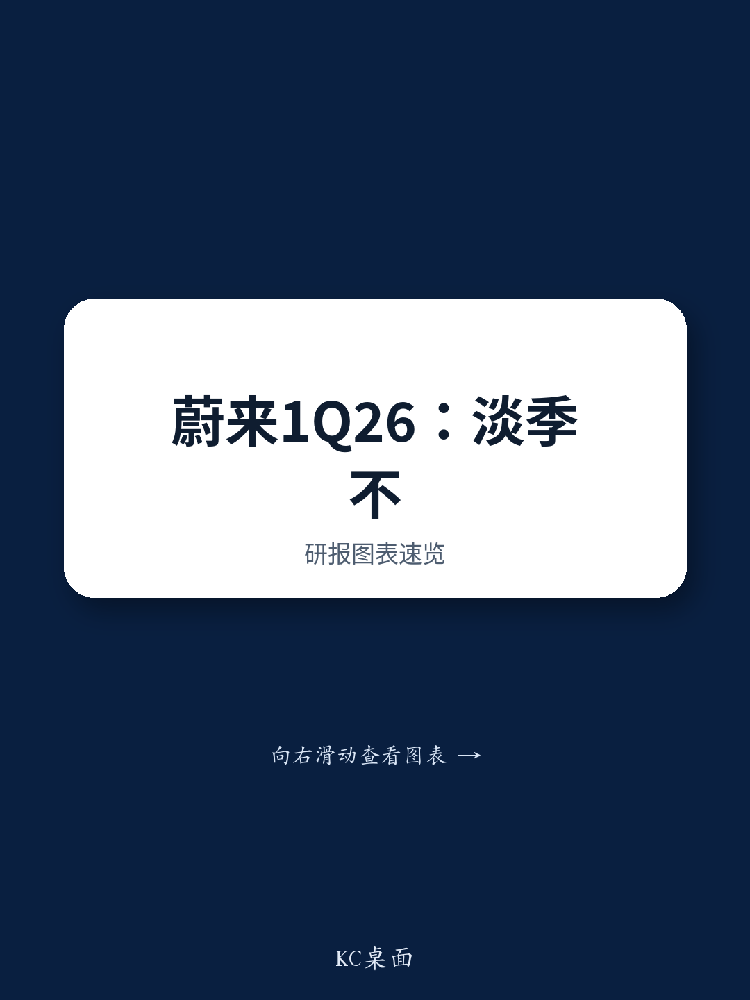
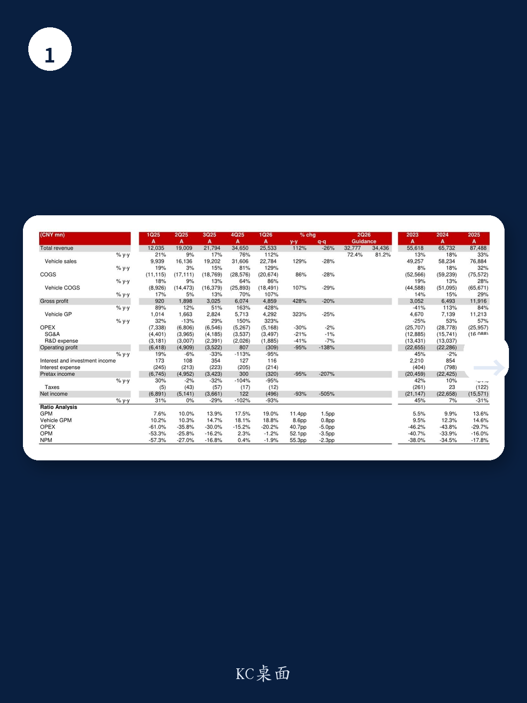
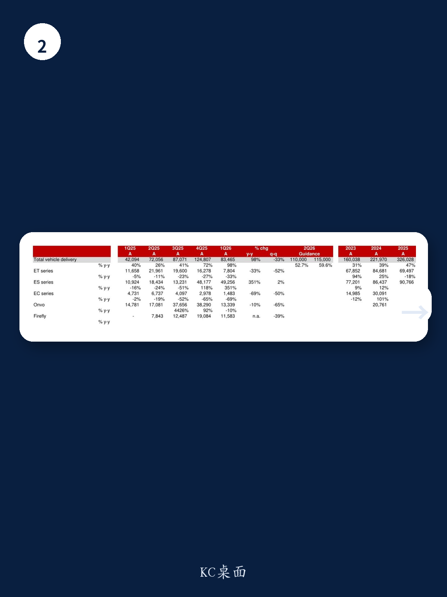

# 蔚来真正的拐点不是盈利，而是高端品牌定价权的初步兑现

当市场还在用“亏损收窄”和“季度交付”的旧框架审视蔚来时，某外资投行在1Q26财报后的Quick Note中揭示了一个更值得关注的信号：蔚来正在从一个“销量增长故事”转向“高端品牌定价权故事”。这份报告的核心判断并不在于1Q26营收255亿、同比翻倍这些数字本身，而在于一个结构性的变化——ES8单一车型贡献了54%的销售额，同时带动整体车辆ASP环比提升8%。这意味着蔚来在30万元以上纯电市场中的议价能力，正在被真实订单所验证。

这份报告发布于5月21日，距离ES9正式上市仅剩不到一周。在当前新能源车市“价格战常态化”的背景下，一家中国车企能够连续两个季度实现非GAAP盈利，同时维持ASP环比上行，这本身就值得产业决策者和投资者重新审视其竞争逻辑。

## 1. 一季度最被低估的数字不是营收，而是ES8的销售占比

1Q26蔚来交付83,465辆车，环比下降33%，这符合一季度淡季的季节性规律。真正值得拆解的是产品结构：ES系列（以ES8为主）交付49,256辆，同比增长351%，环比还微增2%，占整体交付量的59%。而ET系列和Onvo分别环比下降52%和65%。

报告特别点明，ES8贡献了总销售额的54%。这意味着蔚来在1Q26的营收质量发生了质变——高端车型不再是“形象产品”，而是实实在在的现金牛。对于一家正在追求品牌向上的车企而言，这种结构性变化比总量增长更有长期意义。它验证了一个假设：蔚来的高端定位不是营销口号，而是消费者用订单投票的结果。

## 2. 毛利率连续改善的背后，是规模效应和产品组合的双重驱动

1Q26整体毛利率19.0%，同比提升11.4个百分点，环比提升1.5个百分点；车辆毛利率18.8%，同比提升8.6个百分点。这份报告揭示的驱动因素有两个：出货量增长带来的规模效应，以及产品组合向高毛利车型倾斜。

但报告同时埋下了一个关键伏笔：管理层在业绩电话会上明确指出，BOM成本上涨（包括锂、铝、铜和存储芯片）的影响尚未在1Q26完全体现，单车成本影响约1万元人民币。这意味着2Q26的毛利率将面临一次真实的压力测试。管理层给出的2Q26和全年车辆毛利率指引维持在17-18%，这本身就隐含了他们对成本管控和定价能力的信心。

对于投资者而言，接下来需要跟踪的不是毛利率绝对值，而是蔚来能否在成本上升周期中维持甚至提升毛利率——这才是高端品牌定价权的终极验证。

## 3. 2Q26的ASP指引暗示了一个有趣的定价策略

报告根据2Q26营收指引（328-344亿元）和交付指引（11-11.5万辆），推算出隐含ASP约26.7万元，环比1Q26的27.3万元下降约2%。这个微幅下调本身并不令人担忧，因为2Q26将开始交付Onvo L80和ES9等新车型，产品组合的变化自然会拉低均价。

但值得关注的是，管理层在电话会中透露，5月前20天ES8的锁单量已达到2025年10月以来同期最高水平。这意味着在ES9上市前夕，ES8不仅没有被“等新款”效应拖累，反而因为门店客流增加而获得更多订单。这种“旗舰车型拉动全系客流”的效应，是高端品牌溢价能力的另一个侧面印证。

## 4. 报告尚未完全回答的关键问题：成本压力何时传导到利润表

尽管报告对蔚来的前景保持乐观，维持买入评级和8.6美元目标价，但其中有一个关键变量并未完全展开——BOM成本上涨的传导机制。

管理层表示1Q26的库存缓冲了成本冲击，但2Q26开始成本压力将逐步体现。报告估算单车成本增加约1万元，按2Q26指引中位数11.25万辆计算，这意味着约11.25亿元的成本增量。蔚来能否通过规模效应、采购谈判或终端定价来消化这部分压力，将直接决定全年盈利能否兑现。

此外，报告提到管理层维持2026年非GAAP经营利润盈亏平衡的指引，但1Q26经营利润率仅为-1.2%，而2Q26将面临新品上市带来的销售费用环比增长。这个时间差值得密切跟踪。

## 5. 一个值得产业界关注的观察框架：高端品牌从“销量验证”到“定价权验证”

对于关注中国新能源汽车竞争格局的读者，这份报告提供了一个更精细的分析框架：不要只盯着蔚来的月交付量，更要看其产品结构和ASP走势。ES8占比超过50%且ASP环比提升，说明蔚来在30万+市场已经建立了一定的用户基础。而ES9上市后，能否复制ES8的订单表现，将决定蔚来能否从“单旗舰”升级为“双旗舰”驱动。

另一个值得观察的维度是管理层提到的“成为BBA之后的下一个选择”这一战略定位。这不是一个短期目标，而是一个需要持续验证的长期叙事。当前蔚来在EV市场的份额已从2025年初的2.4%提升至2026年3月的4.0%，但要在BBA的燃油车基盘上切分份额，还需要更长的数据积累。

## 6. 接下来的关键节点：ES9上市后的订单转化率

报告明确指出，整个市场都将追踪ES9在5月27日上市后的表现。结合管理层透露的5月前20天ES8锁单量创新高这一信息，一个合理的推测是：ES9的到店正在为蔚来品牌整体引流。但如果ES9上市后订单转化率不及预期，市场可能会重新评估蔚来在高端SUV市场的竞争力。

此外，报告还提到2H26将推出ES8的五座版，以及未来每年3-5款新车的产品节奏。这些信息组合在一起，勾勒出一个清晰的战略路径：蔚来正在用旗舰车型建立品牌势能，再通过产品矩阵的扩展来放大规模效应。

---

对于希望深入拆解这份报告完整逻辑的读者，包括ES9上市后的订单数据跟踪、BOM成本压力的定量测算、以及蔚来在不同子品牌（NIO、Onvo、Firefly）之间的资源分配策略，这些内容在原始报告中有更详细的图表和敏感性分析。欢迎来我们的星球微信群继续讨论这些未解问题，一起追踪蔚来在2Q26财报前的关键信号。

Personal reading notes and learning share only. Not investment advice.

