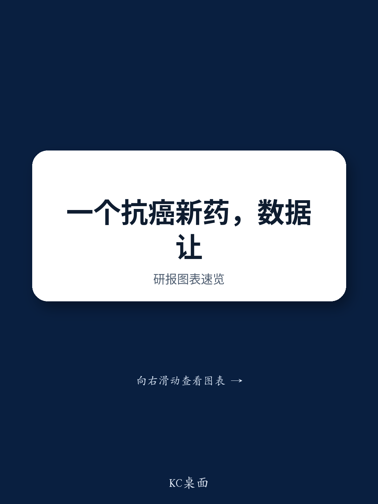
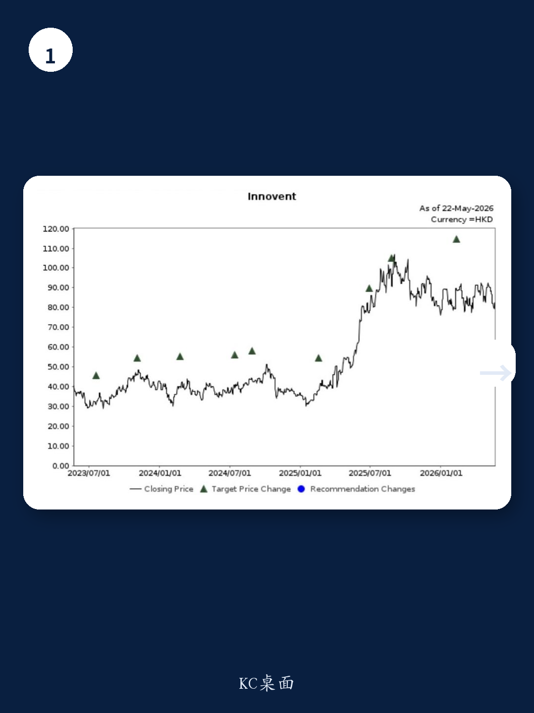
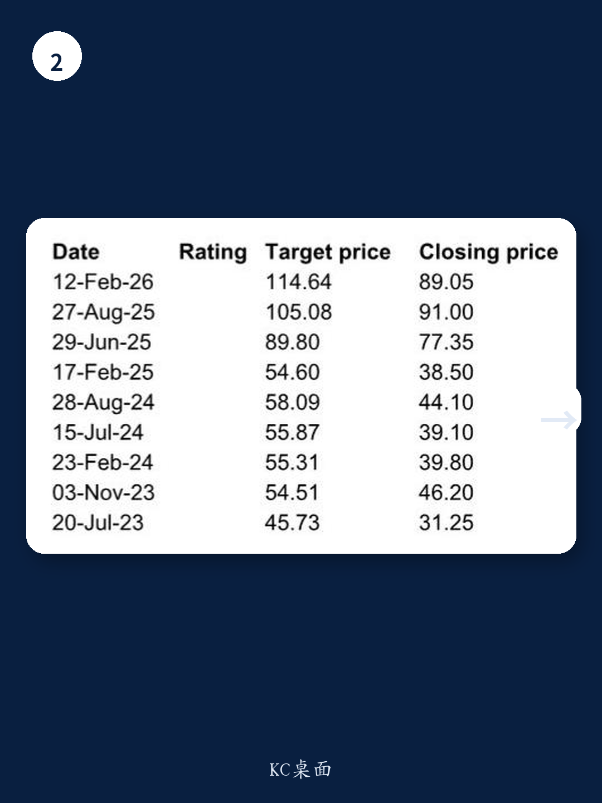

# 信达生物IBI363：市场真正低估的不是疗效，而是对“免疫耐药”这个空白战场的定价权

某外资投行在2026年ASCO前夕发布了一份信达生物IBI363的快速解读。这份报告的核心判断，并不只是“又一款PD-1/IL2双抗数据不错”。它指向一个更深层的产业信号：当大多数同类药物还在一线治疗的红海里拼杀时，IBI363选择了一条更窄、但回报可能更高的路——免疫耐药后的非小细胞肺癌（NSCLC）。这个选择，正在重新定义市场对这款分子价值的评估框架。

为什么现在要关注这份数据？因为ASCO前夕的早期数据披露，往往带有明确的信号意图。信达选择在大会前主动公布PoC数据，说明其对疗效有足够信心。而报告中最值得注意的数字，并不是那组一线治疗的ORR，而是免疫耐药后线治疗的中位总生存期（OS）——18.2个月。这个数字，直接对标的是TROPPIN-Lung01试验中9.4个月的OS。差距接近一倍。

但这还不是故事的全部。真正的产业含义，藏在安全性与疗效的平衡里，藏在剂量爬坡的设计里，也藏在那个“尚未完全回答”的关键问题里。

## 1. 一线治疗的ORR数据有意义，但样本量决定了它不能成为定价锚点

在一线1L NSCLC治疗中，3mg/kg至1.5mg/kg剂量组的ORR达到了86.4%。这个数字确实亮眼——对比其他同类方案通常50%-60%的ORR，差距明显。但报告自己也坦率地指出，这基于的小样本队列（n=23）仍需更大规模验证。

从产业角度看，这个数据的价值更多在于“信号确认”，而非“疗效定论”。它告诉市场：IBI363在PD-L1表达不高的患者群体中（TPS<50%）依然展现出了协同效应。这对于一个PD-1/IL2双抗来说，是关键的机制验证。但真正驱动估值重估的变量，不在这里。

## 2. 免疫耐药后线治疗的OS数据，才是真正的“甜蜜点”

报告明确将IO-resistant NSCLC定义为IBI363的“甜蜜点”。这不是一句空话。在31例鳞状NSCLC患者中，3mg/kg Q3W方案取得了10.1个月的中位PFS和18.2个月的中位OS。对比TROPPIN-Lung01试验中9.4个月的OS，这是一个具有统计学意义和临床意义的改善。

更重要的是，24个月OS率达到47.8%。这意味着接近一半的患者在两年后仍然存活。对于免疫耐药后线治疗这个领域，这个数字足以让临床医生和支付方认真对待。

这里需要强调的是：TROPPIN-Lung01是一个大规模试验，而IBI363的数据来自小样本。但即便考虑样本量差异，OS的绝对差距仍然足够大。这正是某外资投行维持买入评级和114.64港元目标价的核心逻辑。

## 3. 安全性数据是悬在估值上方的“未完全回答的问题”

报告没有回避IBI363的Achilles heel。在免疫耐药后线治疗中，治疗相关不良事件（TEAE）发生率为99.3%，其中3级以上TEAE为48.5%。常见副作用包括关节痛、贫血和皮疹。

这个安全性信号，从IBI363首次进入临床时就存在。它不是一个新问题，但至今没有完全解决。对于一款靶向IL2通路的药物，免疫相关毒性的管理本身就是核心挑战。

市场目前对IBI363的估值，实际上隐含了一个假设：疗效数据足够好，可以让支付方和医生容忍较高的毒性。但这个假设需要更大规模的III期数据来验证。如果安全性问题在更大样本中暴露得更明显，估值逻辑就需要重构。

## 4. 剂量爬坡方案中的“降阶梯”设计，可能是一个被低估的临床智慧

报告中提到一个细节：3mg/kg至1.5mg/kg的降阶梯给药方案。这个设计本身就是一个临床洞察。通常，IL2通路药物的毒性集中在初始给药阶段。通过起始高剂量快速建立免疫应答，再降低至维持剂量，可以在疗效和安全性之间取得更优平衡。

这个设计在1L NSCLC组中展现出了最高的ORR（86.4%），说明其有效性。但它在安全性数据上的表现如何，报告没有完全展开。这是读者需要关注的下一个关键数据点——如果降阶梯方案能够在保持疗效的同时降低3级以上TEAE发生率，那么IBI363的临床价值将大幅提升。

## 5. 全球III期试验正在进行，但临床设计细节才是决胜关键

报告提到，一项针对IO-resistant NSCLC的全球III期试验正在进行，其临床设计将在2026年ASCO上公布。这意味着，目前市场对IBI363的估值，还处于“数据驱动”但“设计不确定”的阶段。

III期试验的对照组选择、入组标准、终点设置，将直接影响数据解读的空间。如果选择当前标准治疗作为对照，那么OS的改善幅度将决定其能否成为标准方案。如果选择其他PD-1/IL2双抗作为对照，那么竞争格局的演变就会成为新的变量。

这个未解问题，是当前研报最值得深挖的地方。某外资投行的报告给出了积极判断，但并未完全拆解III期试验设计的潜在风险与机会。

## 6. 对产业决策者和投资者的观察框架：三个核心变量

基于以上分析，我们建议读者从以下三个维度持续跟踪IBI363的价值演变：

第一，安全性数据的成熟度。3级以上TEAE的分布特征、是否出现新的安全性信号、降阶梯方案的毒性数据，这些将决定IBI363能否从“有希望”走向“可处方”。

第二，III期试验的设计细节。对照组是标准治疗还是同类药物？主要终点是PFS还是OS？入组标准是否与PoC数据一致？这些设计选择将直接影响数据的说服力。

第三，竞争格局的演变。PD-1/IL2双抗赛道正在快速拥挤。IBI363的先发优势有多大，取决于其III期数据能否在疗效和安全性上同时拉开差距。如果竞争对手在安全性上取得突破，IBI363的“甜蜜点”可能被侵蚀。

这三个变量，任何一个发生变化，都会改变当前估值框架下的风险收益比。而某外资投行的报告，恰恰为这些变量提供了初步的锚点，但远未给出终局判断。

---

报告中最引人深思的，不是那些数字本身，而是信达生物在战略选择上的克制。当整个行业都在追逐一线治疗的“大市场”时，它选择先啃下免疫耐药这块硬骨头。这个选择，既是对自身分子的信心，也是对临床未满足需求的精准判断。

但克制背后，仍有大量未解问题。安全性数据的成熟度如何？III期试验的临床设计是否会暴露新的风险？全球多中心试验的执行能力是否匹配数据潜力？这些问题的答案，不在今天的报告中，而藏在后续的数据读出里。

欢迎来我们的微信群，继续拆解这份完整研报。我们会在群里分享报告原文、关键图表，以及围绕III期试验设计的深度推演。

Personal reading notes and learning share only. Not investment advice.

