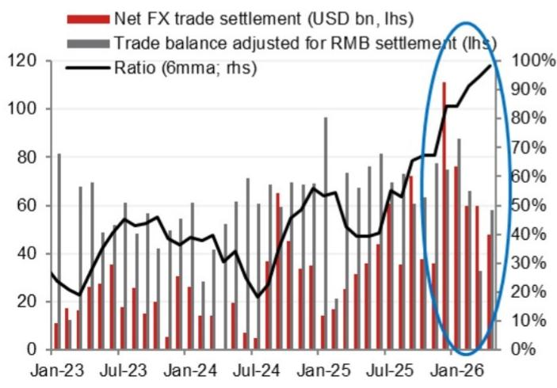
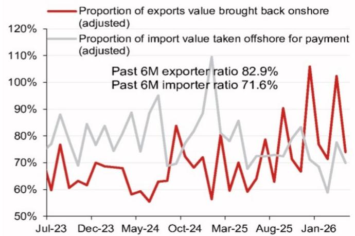
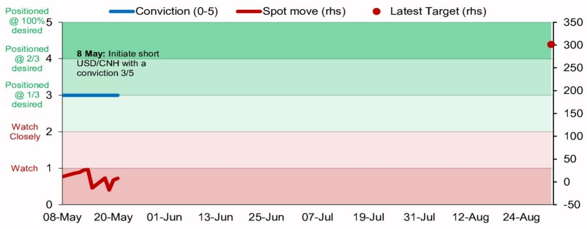

# CNH: BoP flow dynamics remain supportive

Asymmetric sensitivity to the USD, strong net FX trade settlement inflows, a positive Xi-Trump meeting, lower USD/CNY fixings and FX undervaluation.

Trade: We maintain a modest conviction level of 3/5 on our short USD/CNH recommendation, targeting 6.60 (\~4.0% gain) by end-August.

Recent developments continue to support our view. Overall, we expect CNH outperformance based on our favorable views on China's capital flows, political/policy developments and relative competitiveness of China/RMB.

# Drivers of CNH outperformance

1. CNH has outperformed amid the ongoing US-Iran stalemate. While we see a risk of the stronger USD backdrop temporarily slowing the downtrend in USD/CNH, it remains clear that the upside in USD/CNH remains limited and the risk is for a more significant move lower in USD/CNH if there are positive US-Iran developments (such as a re-opening of the Strait of Hormuz). Since the start of the Iran war (28 February) to date (21 May 2026) DXY is higher by 1.7%, while USD/CNH is actually 0.9% lower – leading the CNH CFETS basket 1.8% stronger over the same period. During this period, the sensitivity of USD/CNH to upward moves in DXY moves has been low at around 28%, while USD/CNH sensitivity is much higher at \~62% when DXY is falling. China's energy security is one of the strongest within Asia, and it is relatively less exposed to the Strait of Hormuz shock, and we believe the corporate flow backdrop remains strong.

2. Strong onshore corporate FX repatriation continues and is supported by China's strong external sector.

- Latest April data on net FX trade settlement showed a surplus of USD47.7bn (Q1 average: USD65.3bn), which was equivalent to 82.1% of the trade surplus after adjusting for RMB settlement (Figure 1). The exporter remittance ratio (as a percentage of export value) decreased to 50.1% in April (Q1 average: 55.8%), while importers' FX demand ratio remain stable at 48.3% (Q1 average: 48.7%).   
- We believe exporter FX selling activity is likely remain robust in the coming months, owing to China's continued strong export growth (net trade surplus in Q1 2026 totaled USD247bn), as well as some local expectations for RMB appreciation. In our view, a further de-escalation in the Middle East would be a significant catalyst for even greater exporter repatriation. Our economics team also raised its 2026 China export growth forecast to $8.6\%$ from $4.0\%$ , with full-year trade surplus forecast at USD1,161bn.

3. We believe the recent Xi-Trump summit has created a constructive backdrop for US-China relations in the coming month, as well as a more conducive environment for China's capital inflows. Foreign inflows into our tracking of China-focused equity ETFs totalled USD1.8bn from 13-19 May, with a relatively notable daily inflow of USD811mn on 18 May (first session after the end of the Xi-Trump summit). MTD foreign inflows into these China-focused equity ETFs stood at USD2.2bn (1-19 May). The last large monthly inflows occurred in February and March 2025, after the release of Deepseek-R1 on 20 January 2025 (USD4.4bn and USD2.5bn inflows in February and March 2025 respectively).

\- The other positivity around the Xi-Trump meeting is improved trade relations with the China Ministry of Commerce confirming details initially provided by US officials including a tariff reduction on \~USD30bn worth of goods. China also signaled that it would not retaliate after the US imposed new Section 301 tariffs as replacements for previous IEEPA tariffs, which were stuck down by the US

# Research Analysts

# Asia FX Strategy

Craig Chan - NSL

craig.chan@nomura.com

+65 6433 6106

Wee Choon Teo - NSL

weechoon.teo@nomura.com

+65 6433 6107

Vicky Chen - NSL

vicky.chen1@nomura.com

+65 6433 6540

Manthan Shingala - NSL

manthan.shingala1@nomura.com

+65 6433 6427

Supreme Court, as long as the US tariffs on China do not exceed the level outlined in the Kuala Lumpur trade talks agreement (which culminated to the US-China trade deal agreed on 30 October 2025).

4. USD/CNY fixing is drifting lower despite some official restraints. The daily USD/CNY fixing came in at 6.8349 on 21 May – its lowest since 15 February 2023. Since 8 May (the start of the latest upswing in DXY; +1.3%), the daily USD/CNY fixing has on average been 14pips lower. Positive model errors (actual fix minus our model projection) have remained stable at an average of +417pips.

5. RMB appreciation should also be supported by its substantial undervaluation. Based on our four FX valuation models, RMB remains undervalued by an average of $9.5\%$ , with its productivity-adjusted REER undervalued by $19.3\%$ .

Fig. 1: China net FX trade settlement   

bar_line

| Date   | Net FX trade settlement (USD bn, lhs) | Trade balance adjusted for RMB settlement (lhs) | Ratio (6mma; rhs) |
|--------|----------------------------------------|--------------------------------------------------|-------------------|
| Jan-23 | 10                                     | 80                                               | 30%               |
| Jul-23 | 30                                     | 70                                               | 50%               |
| Jan-24 | 20                                     | 60                                               | 45%               |
| Jul-24 | 10                                     | 70                                               | 35%               |
| Jan-25 | 30                                     | 95                                               | 55%               |
| Jul-25 | 40                                     | 80                                               | 60%               |
| Jan-26 | 110                                    | 85                                               | 95%               |

Source: CEIC, Nomura

Fig. 2: Exporter remittances and importer FX demand ratio   

line

| Date    | Proportion of exports value brought back onshore (adjusted) | Proportion of import value taken offshore for payment (adjusted) |
|---------|---------------------------------------------------------------|------------------------------------------------------------------|
| Past 6M | 82.9%                                                         | 71.6%                                                            |

Source: CEIC, Nomura

Fig. 3: Short USD/CNH, conviction level 3/5, targeting 6.60 by end-August 2026   

line

| Date       | Conviction (0-5) | Spot move (rhs) | Latest Target (rhs) |
| ---------- | ---------------- | --------------- | ------------------- |
| 8 May      | Initiate short    | USD/CNH with 3/5 | 300                 |

Source: Bloomberg, Nomura

Fig. 4: Trade Ideas 

<table><tr><td>Trade</td><td>Target</td><td>Timeline</td><td>Conviction (0-5)</td><td>Entry Date</td></tr><tr><td>Receive Jun-IMM 1y SORA</td><td>1.20%</td><td>end-Jun</td><td>3</td><td>15-May-26</td></tr><tr><td>Short USD/CNH</td><td>6.6</td><td>end-Aug</td><td>3</td><td>8-May-26</td></tr><tr><td>Long 12m USD/HKD</td><td>7.8</td><td>12-May-27</td><td>3</td><td>8-May-26</td></tr><tr><td>Short AUD/NZD</td><td>1.1800</td><td>end-Jun</td><td>3</td><td>30-Apr-26</td></tr><tr><td>Long CNH vs 6FX abridged basket</td><td>-</td><td>-</td><td>2</td><td>30-Apr-26</td></tr><tr><td>Long CHF/JPY</td><td>206.5</td><td>end-Jun</td><td>4</td><td>30-Apr-26</td></tr><tr><td>Long EUR/PHP</td><td>73.5</td><td>end-Jul</td><td>4</td><td>17-Apr-26</td></tr><tr><td>Long EUR/SEK</td><td>11.2</td><td>end-Jun</td><td>3</td><td>17-Apr-26</td></tr><tr><td>Receive Dec-1y Korea NDIRS</td><td>3.60%</td><td>mid-Jun</td><td>3</td><td>13-May-26</td></tr><tr><td>Long 30y CGB vs. pay Jun-3y China NDIRS (extra pay in 3y)</td><td>15bp gain</td><td>end-May</td><td>3</td><td>14-Apr-26</td></tr><tr><td>Receive Jun-IMM 5y THOR (50% vs. US)</td><td>20bp gain</td><td>end-May</td><td>3</td><td>8-Apr-26</td></tr><tr><td>Long EUR/INR</td><td>113</td><td>end-Aug</td><td>4</td><td>1-Apr-26</td></tr><tr><td>Pay Jun-IMM 10y HK IRS</td><td>50bp gain</td><td>end-May</td><td>3</td><td>6-Mar-26</td></tr><tr><td>Long USD/THB</td><td>-</td><td>-</td><td>1</td><td>2-Feb-26</td></tr><tr><td>Long 9m USD/HKD</td><td>7.8</td><td>27-Oct-26</td><td>3</td><td>23-Jan-26</td></tr><tr><td>Long 12m USD/HKD</td><td>7.8</td><td>27-Jan-27</td><td>3</td><td>23-Jan-26</td></tr><tr><td>Long SGD/IDR</td><td>14,200</td><td>end-Aug</td><td>5</td><td>9-Jan-26</td></tr><tr><td>Long EUR/GBP</td><td>0.8950</td><td>end-Jun</td><td>4</td><td>9-Jan-26</td></tr></table>

Source: Nomura

Please see Strategy portfolio update (7 May 2026) for our full portfolio.

# Appendix A-1

This report has been produced by Nomura Singapore Ltd. (NSL), Singapore.

See Disclaimers for Nomura Group entity details.

# Analyst Certification

We, Craig Chan, Wee Choon Teo, Vicky Chen and Manthan Shingala, hereby certify (1) that the views expressed in this Research report accurately reflect our personal views about any or all of the subject securities or issuers referred to in this Research report, (2) no part of our compensation was, is or will be directly or indirectly related to the specific recommendations or views expressed in this Research report and (3) no part of our compensation is tied to any specific investment banking transactions performed by Nomura Securities International, Inc., Nomura International plc or any other Nomura Group company.

# Important Disclosures

# Online availability of research and conflict-of-interest disclosures

Nomura Group research is available on www.nomuranow.com/research, Bloomberg, Capital IQ, Factset, LSEG.

Important disclosures may be read at http://go.nomuranow.com/research/m/Disclosures or requested from Nomura Securities International, Inc. If you have any difficulties with the website, please email grpsupport@nomura.com for help.

The analysts responsible for preparing this report have received compensation based upon various factors including the firm's total revenues, a portion of which is generated by Investment Banking activities. Unless otherwise noted, the non-US analysts listed at the front of this report are not registered/qualified as research analysts under FINRA rules, may not be associated persons of NSI, and may not be subject to FINRA Rule 2241 restrictions on communications with covered companies, public appearances, and trading securities held by a research analyst account.

Nomura Global Financial Products Inc. (NGFP) Nomura Derivative Products Inc. (NDP) and Nomura International plc. (NIplc) are registered with the Commodities Futures Trading Commission and the National Futures Association (NFA) as swap dealers. NGFP, NDPI, and NIplc are generally engaged in the trading of swaps and other derivative products, any of which may be the subject of this report.

# ADDITIONAL DISCLOSURES REQUIRED IN THE U.S.

Principal Trading: Nomura Securities International, Inc and its affiliates will usually trade as principal in the fixed income securities (or in related derivatives) that are the subject of this research report. Analyst Interactions with other Nomura Securities International, Inc. Personnel: The fixed income research analysts of Nomura Securities International, Inc and its affiliates regularly interact with sales and trading desk personnel in connection with obtaining liquidity and pricing information for their respective coverage universe.

# Valuation methodology - Fixed Income

Nomura's Fixed Income Strategists express views on the price of securities and financial markets by providing trade recommendations. These can be relative value recommendations, directional trade recommendations, asset allocation recommendations, or a mixture of all three.

The analysis which is embedded in a trade recommendation would include, but not be limited to:

\- Fundamental analysis regarding whether a security's price deviates from its underlying macro- or micro-economic fundamentals.

• Quantitative analysis of price variations.

\- Technical factors such as regulatory changes, changes to risk appetite in the market, unexpected rating actions, primary market activity and supply/ demand considerations.

The timeframe for a trade recommendation is variable. Tactical ideas have a short timeframe, typically less than three months. Strategic trade ideas have a longer timeframe of typically more than three months.

For the purposes of the EU Market Abuse Regulation, the distribution of ratings published by Nomura Global Fixed Income Research is as follows:

52% have been assigned a Buy (or equivalent) rating; 50% of issuers with this rating were supplied material services\* by the Nomura Group\*\*.
0% have been assigned a Neutral (or equivalent) rating.

48% have been assigned a Sell (or equivalent) rating; 50% of issuers with this rating were supplied material services by the Nomura Group. As at 31 Mar 2026.

\*As defined by the EU Market Abuse Regulation

\*\*The Nomura Group as defined in the Disclaimer section at the end of this report

# Disclaimers

This publication contains material that has been prepared by the Nomura Group entity identified on page 1 and, if applicable, with the contributions of one or more Nomura Group entities whose employees and their respective affiliations are specified on page 1 or identified elsewhere in this publication. The term "Nomura Group" used herein refers to Nomura Holdings, Inc. and its affiliates and subsidiaries including: (a) Nomura Securities Co., Ltd. ('NSC') Tokyo, Japan, (b) Nomura Financial Products Europe GmbH ('NFPE'), Germany, (c) Nomura International plc ('NIplc'), UK, (d) Nomura Securities International, Inc. ('NSI'), New York, US, (e) Nomura International (Hong Kong) Ltd.

('NIHK'), Hong Kong, (f) Nomura Financial Investment (Korea) Co., Ltd. ('NFIK'), Korea (Information on Nomura analysts registered with the Korea Financial Investment Association ('KOFIA') can be found on the KOFIA Intranet at http://dis.kofia.or.kr, (g) Nomura Singapore Ltd. ('NSL'), Singapore (Registration number 197201440E, regulated by the Monetary Authority of Singapore) (h) Nomura Australia Ltd. ('NAL'), Australia (ABN 48 003 032 513), regulated by the Australian Securities and Investment Commission ('ASIC') and holder of an Australian financial services licence number 246412, (i) Nomura Securities Malaysia Sdn. Bhd. ('NSM'), Malaysia, (j) NIHK, Taipei Branch ('NITB'), Taiwan, (k) Nomura Financial Advisory and Securities (India) Private Limited ('NFASL'), Mumbai, India (Registered Address: Ceejay House, Level 11, Plot F, Shivsagar Estate, Dr. Annie Besant Road, Worli, Mumbai- 400 018, India; Tel: 91 22 4037 4037, Fax: 91 22 4037 4111; CIN No: U74140MH2007PTC169116, SEBI Registration No. for Stock Broking activities : INZ000255633; SEBI Registration No. for Merchant Banking : INM000011419; SEBI Registration No. for Research: INH000001014 - Compliance Officer: Ms. Pratiksha Tondwalkar, 91 22 40374904, grievance email: investorgrievancesra@nomura.com Webpage: LINK

For reports with respect to Indian public companies or authored by India-based NFASL research analysts: (i) Investment in securities markets is subject to market risks. Read all the related documents carefully before investing. (ii) Registration granted by SEBI, and certification from NISM in no way guarantee performance of the intermediary or provide any assurance of returns to investors. (iii) NFASL terms and conditions for availing research services is disclosed on NFASL webpage.

(I) Nomura Fiduciary Research & Consulting Co., Ltd. ('NFRC') Tokyo, Japan. (m) Nomura Orient International Securities Co., Ltd ("NOI"), is a majority owned joint venture amongst Nomura Group, Orient International (Holding) Co., Ltd, and Shanghai Huangpu Investment Holding (Group) Co., Ltd. In accordance with the laws of the People's Republic of China ("PRC", excluding Hong Kong, Macau and Taiwan, for the purpose of this document), NOI is licensed in the PRC to provide securities research and investment recommendations and it operates independently from the other members of the Nomura Group; in particular, NOI's interests in PRC securities are not disclosed to, or aggregated with the holdings of, any other Nomura Group entities and the interests in PRC securities of other Nomura Group entities are not disclosed to, or aggregated with the holdings of, NOI. An individual name printed next to NOI on the front page of a research report indicates that individual is employed by NOI to provide research assistance to NIHK under a research partnership agreement. 'NSFSPL' next to an employee's name on the front page of a research report indicates that the individual is employed by Nomura Structured Finance Services Private Limited to provide assistance to certain Nomura entities under inter-company agreements. 'Verdhana' next to an individual's name on the front page of a research report indicates that the individual is employed by PT Verdhana Sekuritas Indonesia ('Verdhana') to provide research assistance to NIHK under a research partnership agreement and neither Verdhana nor such individual is licensed outside of Indonesia.

THIS MATERIAL IS: (I) FOR YOUR PRIVATE INFORMATION, AND WE ARE NOT SOLICITING ANY ACTION BASED UPON IT; (II) NOT TO BE CONSTRUED AS AN OFFER TO SELL OR A SOLICITATION OF AN OFFER TO BUY ANY SECURITIES IN ANY JURISDICTION WHERE SUCH OFFER OR SOLICITATION WOULD BE ILLEGAL; AND (III) OTHER THAN DISCLOSURES RELATING TO THE NOMURA GROUP, BASED UPON INFORMATION FROM SOURCES THAT WE CONSIDER RELIABLE, BUT HAS NOT BEEN INDEPENDENTLY VERIFIED BY NOMURA GROUP.

Other than disclosures relating to the Nomura Group, the Nomura Group does not warrant, represent or undertake, express or implied, that the document is fair, accurate, complete, correct, reliable or fit for any particular purpose or merchantable, and to the maximum extent permissible by law and/or regulation, does not accept liability (in negligence or otherwise, and in whole or in part) for any act (or decision not to act) resulting from use of this document and related data. To the maximum extent permissible by law and/or regulation, all warranties and other assurances by the Nomura Group are hereby excluded and the Nomura Group shall have no liability (in negligence or otherwise, and in whole or in part) for any loss howsoever arising from the use, misuse, or distribution of this material or the information contained in this material or otherwise arising in connection therewith.

Opinions or estimates expressed are current opinions as of the original publication date appearing on this material and the information, including the opinions and estimates contained herein, are subject to change without notice. The Nomura Group, however, expressly disclaims any obligation, and therefore is under no duty, to update or revise this document. Any comments or statements made herein are those of the author(s) and may differ from views held by other parties within Nomura Group. Clients should consider whether any advice or recommendation in this report is suitable for their particular circumstances and, if appropriate, seek professional advice, including tax advice. The Nomura Group does not provide tax advice.

The Nomura Group, and/or its officers, directors, employees and affiliates, may, to the extent permitted by applicable law and/or regulation, deal as principal, agent, or otherwise, or have long or short positions in, or buy or sell, the securities, commodities or instruments, or options or other derivative instruments based thereon, of issuers or securities mentioned herein. The Nomura Group companies may also act as market maker or liquidity provider (within the meaning of applicable regulations in the UK) in the financial instruments of the issuer. Where the activity of market maker is carried out in accordance with the definition given to it by specific laws and regulations of the US or other jurisdictions, this will be separately disclosed within the specific issuer disclosures.

This document may contain information obtained from third parties, including, but not limited to, ratings from credit ratings agencies such as Standard & Poor's. The Nomura Group hereby expressly disclaims all representations, warranties or undertakings of originality, fairness, accuracy, completeness, correctness, merchantability or fitness for a particular purpose with respect to any of the information obtained from third parties contained in this material or otherwise arising in connection therewith, and shall not be liable (in negligence or otherwise, and in whole or in part) for any direct, indirect, incidental, exemplary, compensatory, punitive, special or consequential damages, costs, expenses, legal fees, or losses (including lost income or profits and opportunity costs) in connection with any use or misuse of any of the information obtained from third parties contained in this material or otherwise arising in connection therewith. Reproduction and distribution of third-party content in any form is prohibited except with the prior written permission of the related third-party. Third-party content providers do not, express or implied, guarantee the fairness, accuracy, completeness, correctness, timeliness or availability of any information, including ratings, and are not in any way responsible for any errors or omissions (negligent or otherwise), regardless of the cause, or for the results obtained from the use or misuse of such content. Third-party content providers give no express or implied warranties, including, but not limited to, any warranties of merchantability or fitness for a particular purpose or use. Third-party content providers shall not be liable (in negligence or otherwise, and in whole or in part) for any direct, indirect, incidental, exemplary, compensatory, punitive, special or consequential damages, costs, expenses, legal fees, or losses (including lost income or profits and opportunity costs) in connection with any use or misuse of their content, including ratings. Credit ratings are statements of opinions and are not statements of fact or recommendations to purchase hold or sell securities. They do not address the suitability of securities or the suitability of securities for investment purposes, and should not be relied on as investment advice. Any MSCI sourced information in this document is the exclusive property of MSCI Inc. ('MSCI'). Without prior written permission of MSCI, this information and any other MSCI intellectual property may not be duplicated, reproduced, re-disseminated, redistributed or used, in whole or in part, for any purpose whatsoever, including creating any financial products and any indices. This information is provided on an "as is" basis. The user assumes the entire risk of any use made of this information. MSCI, its affiliates and any third party involved in, or related to, computing or compiling the information hereby expressly disclaim all representations, warranties or undertakings of originality, fairness, accuracy, completeness, correctness, merchantability or fitness for a particular purpose with respect to any of this material or the information contained in this material or otherwise arising in connection therewith. Without limiting any of the foregoing, in no event shall MSCI, any of its affiliates or any third party involved in, or related to, computing or compiling the information have any liability (in negligence or otherwise, and in whole or in part) for any damages of any kind. MSCI and the MSCI indexes are services marks of MSCI and its affiliates.

The intellectual property rights and any other rights, in Russell/Nomura Japan Equity Index belong to Nomura Fiduciary Research & Consulting Co., Ltd. ("NFRC") and FTSE Russell ("Russell"). NFRC and Russell do not guarantee fairness, accuracy, completeness, correctness, reliability, usefulness, marketability, merchantability or fitness of the Index, and do not account for business activities or services that any index user and/or its affiliates undertakes with the use of the Index.

Investors should consider this document as only a single factor in making their investment decision and, as such, the report should not be viewed as identifying or suggesting all risks, direct or indirect, that may be associated with any investment decision. Nomura Group produces a number of different types of research product including, among others, fundamental analysis and quantitative analysis; recommendations contained in one type of research product may differ from recommendations contained in other types of research product, whether as a result of differing time horizons, methodologies or otherwise. The Nomura Group publishes research product in a number of different ways including the posting of product on the Nomura Group portals and/or distribution directly to clients. Different groups of clients may receive different products and services from the research department depending on their individual requirements.

Figures presented herein may refer to past performance or simulations based on past performance which are not reliable indicators of future or likely performance. Where the information contains an expectation, projection or indication of future performance and business prospects, such forecasts may not be a reliable indicator of future or likely performance. Moreover, simulations are based on models and simplifying assumptions which may oversimplify and not reflect the future distribution of returns. Any figure, strategy or index created and published for illustrative purposes within this document is not intended for “use” as a “benchmark” as defined by the European Benchmark Regulation.

Certain securities are subject to fluctuations in exchange rates that could have an adverse effect on the value or price of, or income derived from, the investment.

With respect to Fixed Income Research: Recommendations fall into two categories: tactical, which typically last up to three months; or strategic, which typically last from 6-12 months. However, trade recommendations may be reviewed at any time as circumstances change. 'Stop loss' levels for trades are also provided; which, if hit, closes the trade recommendation automatically. Prices and yields shown in recommendations are taken at the time of submission for publication and are based on either indicative Bloomberg, LSEG or Nomura prices and yields at that time. The prices and yields shown are not necessarily those at which the trade recommendation can be implemented.

The securities described herein may not have been registered under the US Securities Act of 1933 (the '1933 Act'), and, in such case, may not be offered or sold in the US or to US persons unless they have been registered under the 1933 Act, or except in compliance with an exemption from the registration requirements of the 1933 Act. Unless governing law permits otherwise, any transaction should be executed via a Nomura entity in your home jurisdiction.

This document has been approved for distribution in the UK as investment research by NIplc. NIplc is authorised by the Prudential Regulation Authority and regulated by the Financial Conduct Authority and the Prudential Regulation Authority. NIplc is a member of the London Stock Exchange. This document does not constitute a personal recommendation within the meaning of applicable regulations in the UK, or take into account the particular investment objectives, financial situations, or needs of individual investors. This document is intended only for investors who are 'eligible counterparties' or 'professional clients' for the purposes of applicable regulations in the UK, and may not, therefore, be redistributed to persons who are 'retail clients' for such purposes.

This document has been approved for distribution in the European Economic Area as investment research by Nomura Financial Products Europe GmbH ("NFPE"). NFPE is a company organized as a limited liability company under German law registered in the Commercial Register of the Court of Frankfurt/Main under HRB 110223. NFPE is authorized and regulated by the German Federal Financial Supervisory Authority (BaFin).

This document has been approved by NIHK, which is regulated by the Hong Kong Securities and Futures Commission, for distribution in Hong Kong by NIHK. This document is intended only for investors who are 'professional investors' for the purposes of applicable regulations in Hong Kong and may not, therefore, be redistributed to persons who are not 'professional investors' for such purposes.

This document has been approved for distribution in Australia by NAL, which is authorized and regulated in Australia by the ASIC. This document has also been approved for distribution in Malaysia by NSM.

In Singapore, this document has been distributed by NSL, an exempt financial adviser as defined under the Financial Advisers Act (Chapter 110), among other things, and regulated by the Monetary Authority of Singapore. NSL may distribute this document produced by its foreign affiliates pursuant to an arrangement under Regulation 32C of the Financial Advisers Regulations. This document is intended for accredited, expert or institutional investors as defined by the Securities and Futures Act (Chapter 289). Where the recipient of this document is not an accredited, expert or institutional investor, NSL accepts legal responsibility for the contents of this document in respect of such recipient only to the extent required by law. Recipients of this document in Singapore should contact NSL in respect of matters arising from, or in connection with, this document. THIS DOCUMENT IS INTENDED FOR GENERAL CIRCULATION. IT DOES NOT TAKE INTO ACCOUNT THE SPECIFIC INVESTMENT OBJECTIVES, FINANCIAL SITUATION OR PARTICULAR NEEDS OF ANY PARTICULAR PERSON. RECIPIENTS SHOULD

TAKE INTO ACCOUNT THEIR SPECIFIC INVESTMENT OBJECTIVES, FINANCIAL SITUATION OR PARTICULAR NEEDS BEFORE MAKING A COMMITMENT TO PURCHASE ANY SECURITIES, INCLUDING SEEKING ADVICE FROM AN INDEPENDENT FINANCIAL ADVISER REGARDING THE SUITABILITY OF THE INVESTMENT, UNDER A SEPARATE ENGAGEMENT, AS THE RECIPIENT DEEMS FIT. Unless prohibited by the provisions of Regulation S of the 1933 Act, this material is distributed in the US, by NSI, a US-registered broker-dealer, which accepts responsibility for its contents in accordance with the provisions of Rule 15a-6, under the US Securities Exchange Act of 1934. The entity that prepared this document permits its separately operated affiliates within the Nomura Group to make copies of such documents available to their clients.

This document has not been approved for distribution to persons other than ‘Authorised Persons’, ‘Exempt Persons’ or ‘Institutions’ (as defined by the Capital Markets Authority) in the Kingdom of Saudi Arabia (‘Saudi Arabia’) or a ‘Market Counterparty’ or a ‘Professional Client’ (as defined by the Dubai Financial Services Authority) in the United Arab Emirates (‘UAE’) or a ‘Market Counterparty’ or a ‘Business Customer’ (as defined by the Qatar Financial Centre Regulatory Authority) in the State of Qatar (‘Qatar’) by Nomura Saudi Arabia, NIplc or any other member of the Nomura Group, as the case may be. Neither this document nor any copy thereof may be taken or transmitted or distributed, directly or indirectly, by any person other than those authorised to do so into Saudi Arabia or in the UAE or in Qatar or to any person other than ‘Authorised Persons’, ‘Exempt Persons’ or ‘Institutions’ located in Saudi Arabia or a ‘Market Counterparty’ or a ‘Professional Client’ in the UAE or a ‘Market Counterparty’ or a ‘Business Customer’ in Qatar. Any failure to comply with these restrictions may constitute a violation of the laws of the UAE or Saudi Arabia or Qatar.

For report with reference of TAIWAN public companies or authored by Taiwan based research analyst:

THIS DOCUMENT IS SOLELY FOR REFERENCE ONLY. You should independently evaluate the investment risks and are solely responsible for your investment decisions. NO PORTION OF THE REPORT MAY BE REPRODUCED OR QUOTED BY THE PRESS OR ANY OTHER PERSON WITHOUT WRITTEN AUTHORIZATION FROM NOMURA GROUP. Pursuant to Operational Regulations Governing Securities Firms Recommending Trades in Securities to Customers and/or other applicable laws or regulations in Taiwan, you are prohibited to provide the reports to others (including but not limited to related parties, affiliated companies and any other third parties) or engage in any activities in connection with the reports which may involve conflicts of interests. INFORMATION ON SECURITIES / INSTRUMENTS NOT EXECUTABLE BY NOMURA INTERNATIONAL (HONG KONG) LTD., TAIPEI BRANCH IS FOR INFORMATIONAL PURPOSES ONLY AND IS NOT BE CONSTRUED AS A RECOMMENDATION OR A SOLICITATION TO TRADE IN SUCH SECURITIES / INSTRUMENTS.

This material may not be distributed in Indonesia or passed on within the territory of the Republic of Indonesia or to persons who are Indonesian citizens (wherever they are domiciled or located) or entities of or residents in Indonesia in a manner which constitutes a public offering under the laws of the Republic of Indonesia. The securities mentioned in this document may not be offered or sold in Indonesia or to persons who are citizens of Indonesia (wherever they are domiciled or located) or entities of or residents in Indonesia in a manner which constitutes a public offering under the laws of the Republic of Indonesia.

An individual name printed next to NOI on the front page of a research report indicates that this document is a translation of a research report issued by NOI in the PRC. In all other cases, this document is prepared by Nomura Group or its subsidiary or affiliate (collectively, “Offshore Issuers”) that is not licensed in the PRC to provide securities research. This research report is not approved or intended to be circulated in the PRC. The A-share related analysis (if any) is not produced for any persons located or incorporated in the PRC. The recipients should not rely on any information contained in this research report in making investment decisions and Offshore Issuers take no responsibility in this regard. NO PART OF THIS MATERIAL MAY BE (I) COPIED, PHOTOCOPIED, REPRODUCED OR DUPLICATED IN ANY FORM, BY ANY MEANS; OR (II) REDISSEMINATED, REPUBLISHED OR REDISTRIBUTED WITHOUT THE PRIOR WRITTEN CONSENT OF A MEMBER OF THE NOMURA GROUP. If this document has been distributed by electronic transmission, such as e-mail, then such transmission cannot be guaranteed to be secure or error-free as information could be intercepted, corrupted, lost, destroyed, arrive late or incomplete, or contain viruses. The sender therefore does not accept liability (in negligence or otherwise, and in whole or in part) for any errors or omissions in the contents of this document, which may arise as a result of electronic transmission. If verification is required, please request a hard-copy version.

The Nomura Group manages conflicts with respect to the production of research through its compliance policies and procedures (including, but not limited to, Conflicts of Interest, Chinese Wall and Confidentiality policies) as well as through the maintenance of Chinese Walls and employee training.

Additional information regarding the methodologies or models used in the production of any investment recommendations contained within this document is available upon request by contacting the Research Analysts of Nomura listed on the front page. Disclosures information is available upon request and disclosure information is available at the Nomura Disclosure web page:

http://go.nomuranow.com/research/m/Disclosures

Copyright © 2026 Nomura Singapore Ltd., Singapore. All rights reserved.