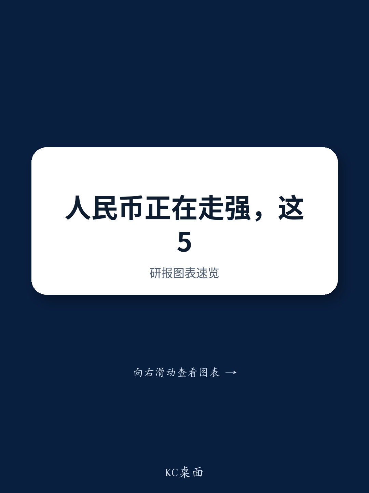
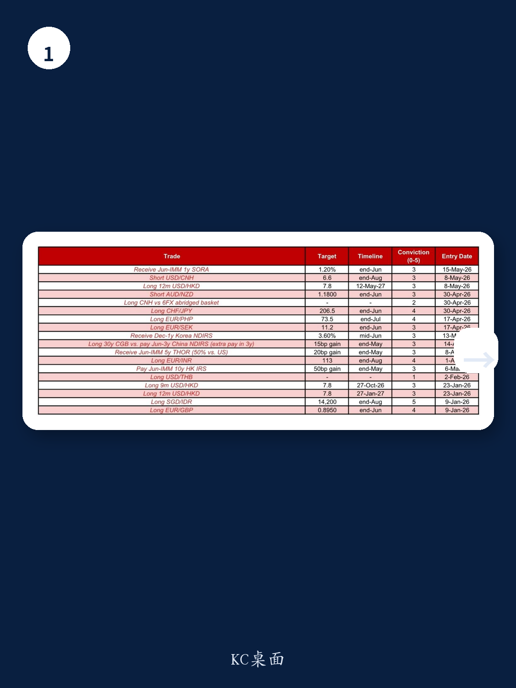
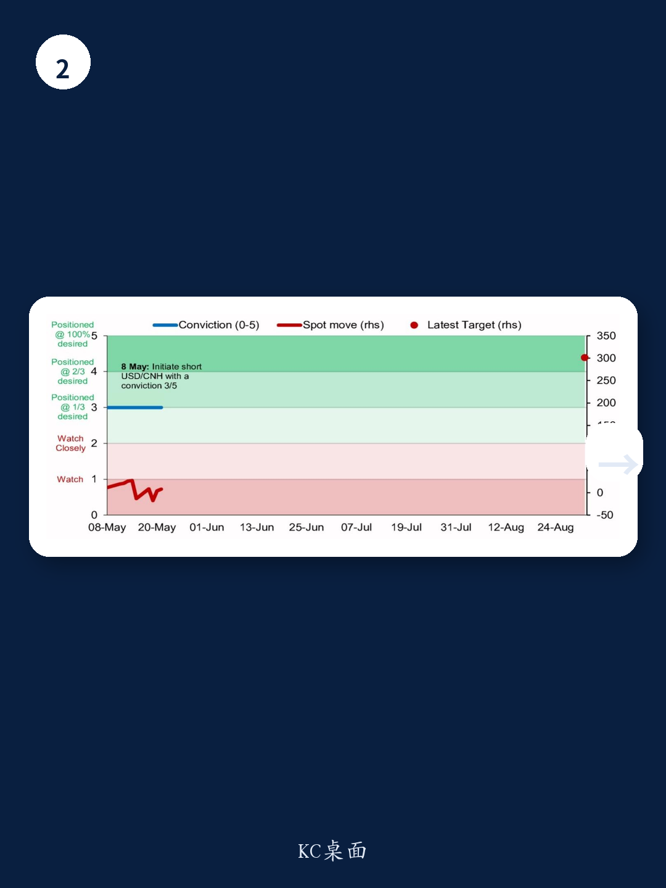

# 人民币被低估的9.5%，但市场真正定价的是一套新叙事

过去两个月，美元指数上涨了1.7%，大多数非美货币承压。但离岸人民币（CNH）不但没有跟跌，反而对美元升值了0.9%。这不是一次短期的避险脉冲，而是一套正在成型的结构性逻辑在起作用。

某外资投行最新发布的亚洲外汇策略报告，给出的是一个相当明确的判断：**做空美元/离岸人民币，目标6.60，预计到2026年8月底实现约4%的收益。** 报告的置信度评分为3/5，不算最高，但放在当前全球外汇市场普遍低波动的背景下，这已经是一个有分量的信号。

市场真正低估的不是人民币会否升值，而是驱动这次升值的底层力量——资本流动结构、地缘政治再定价、以及贸易顺差的真实转化效率——正在发生质变。

## 1. 美元走强时人民币不跌，这本身就是新信号

传统上，人民币对美元的汇率敏感性极高。当美元走强，人民币几乎必然跟随贬值。但报告揭示了一个关键变化：从2026年2月底伊朗局势升级至今，美元指数上涨1.7%，而美元/离岸人民币反而下跌0.9%。更重要的是，在美元上行期间，美元/离岸人民币的敏感性仅为28%；而美元下跌时，敏感性却高达62%。

这意味着什么？人民币正在获得一种不对称的韧性。它在美元强的时候跌得少，美元弱的时候跌得快。这种不对称性，背后是中国的能源安全优势——报告明确指出，中国是亚洲能源安全最强的国家之一，对霍尔木兹海峡冲击的暴露程度相对最低。当全球资本因地缘风险寻找避风港时，人民币正在被重新定价为一种“有能源背书的亚洲避险货币”。

这不是一个短期交易逻辑，而是一个可能持续数年的结构性重估起点。

## 2. 企业结汇行为正在从“被动”转向“主动”

报告中最有说服力的数据，来自企业外汇结算的微观行为。2026年4月，中国净外汇贸易结算盈余为477亿美元，相当于调整后贸易顺差的82.1%。这个比例本身并不惊人，真正值得注意的是趋势：出口商的收汇比率（出口收入中汇回国内的比例）在4月降至50.1%，低于一季度平均的55.8%。

乍看这似乎是结汇意愿下降，但报告的解读恰恰相反。出口商收汇比率下降，不是因为企业不愿意结汇，而是因为出口规模增长太快——一季度净贸易顺差已达2470亿美元——导致分母迅速扩大。进口商的外汇需求比率稳定在48.3%，说明企业端并没有明显的购汇恐慌。

更关键的判断在于：**如果中东局势进一步缓和，将是出口商加速结汇的重大催化剂。** 报告的经济团队已将2026年中国出口增速预测从4.0%上调至8.6%，全年贸易顺差预测达1.16万亿美元。这意味着，企业结汇的潜在动能远未被充分释放。一旦地缘风险溢价下降，出口商将更有动力将海外收入汇回，形成对人民币的直接买盘支撑。

这里有一个尚未完全打开的讨论：企业结汇的时点选择，是否已经开始反映对人民币升值的预期？报告提到了“一些本地市场对人民币升值的预期”，但并没有深入拆解企业预期形成机制。这可能是完整报告中值得深挖的伏笔。

## 3. Xi-Trump峰会后的资本流入，不是一次性的

2026年5月13日至19日，追踪中国主题的股票ETF累计获得18亿美元外资流入，其中5月18日（峰会结束后的第一个交易日）单日流入8.11亿美元。5月至今的总流入已达22亿美元。

这个数字需要放在历史背景中看。上一次如此规模的月度流入发生在2025年2月和3月——Deepseek-R1发布后的两个月，分别流入44亿美元和25亿美元。两次资本流入的触发因素完全不同：一次是技术突破，一次是地缘政治缓和。但共同点是，外资对中国资产的兴趣正在从“事件驱动”转向“趋势确认”。

报告没有展开的是，这些流入资金的结构如何。是主动型基金还是被动型？是短期套利还是中期配置？如果流入的主力是ETF被动资金，那么其持续性取决于指数表现；如果是主动型基金，则可能意味着更深的配置逻辑变化。这里仍需要进一步验证。

## 4. 中间价的信号：央行在释放有序升值的空间

美元/人民币中间价在5月21日降至6.8349，创下2023年2月以来的新低。更值得关注的是，自5月8日美元指数新一轮上行以来，中间价不仅没有跟随美元走强而上调，反而平均每日下调14个基点。实际中间价与模型预测的偏差稳定在+417个基点。

这个偏差意味着什么？央行正在用中间价传递一个清晰的信号：人民币有升值空间，而且这个空间正在被有序释放。+417个基点的正向偏差表明，央行允许人民币中间价比模型预测的更弱一些——但这恰恰是管理预期的手段，而不是打压汇率。在美元走强的背景下主动下调中间价，本质上是在告诉市场：不要赌人民币贬值。

报告提到“尽管有一些官方限制”，但中间价仍在走低。这暗示央行内部可能也存在分歧，或者政策工具的使用正在变得更加精细化。完整报告中或许包含更多关于央行干预策略的细节。

## 5. 被低估的9.5%：估值修复的起点，不是终点

报告基于四个外汇估值模型测算，人民币平均被低估9.5%，其中经生产率调整后的实际有效汇率被低估19.3%。这是一个巨大的估值缺口。

但这里需要谨慎。估值模型给出的低估信号，并不等同于短期升值空间。人民币在2015年“811汇改”前也被认为严重低估，但随后经历的是一轮大幅贬值。低估是必要条件，不是充分条件。真正决定升值能否兑现的，是资本账户开放程度、货币政策独立性、以及市场对人民币资产信心的修复速度。

报告没有完全回答的问题是：这9.5%的低估，需要多长时间才能修复？是通过名义汇率升值，还是通过国内通胀消化？不同的路径对应完全不同的资产定价逻辑。如果通过名义汇率升值，则利好持有人民币资产的投资者；如果通过通胀消化，则意味着国内购买力下降，对消费和地产的影响将截然不同。

这可能是整份报告中最值得持续追踪的核心变量。

## 欢迎来社群继续拆解完整报告

上述分析已经触及了报告的五个核心判断，但完整报告还包含大量未展开的细节：中间价的模型构建方法、企业结汇的季节性规律、以及不同情景下人民币升值的路径推演。特别是报告中提到的“短期美元/离岸人民币交易建议”背后，隐含了对美元指数走势、中美利差变化、以及全球风险偏好的多重假设。这些假设是否成立，将直接影响6.60目标能否如期实现。

欢迎来星球的微信群里，我们一起逐页拆解这份报告的完整版本，讨论那些尚未被市场充分定价的细节。群里还有更多跨境资本流动、亚洲外汇策略的原始图表和数据，供深度研究使用。

Personal reading notes and learning share only. Not investment advice.

