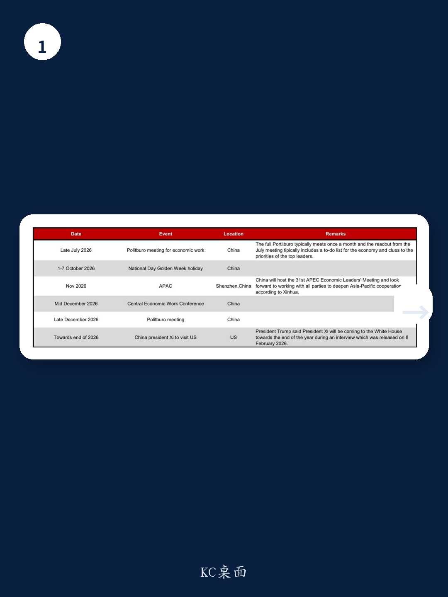
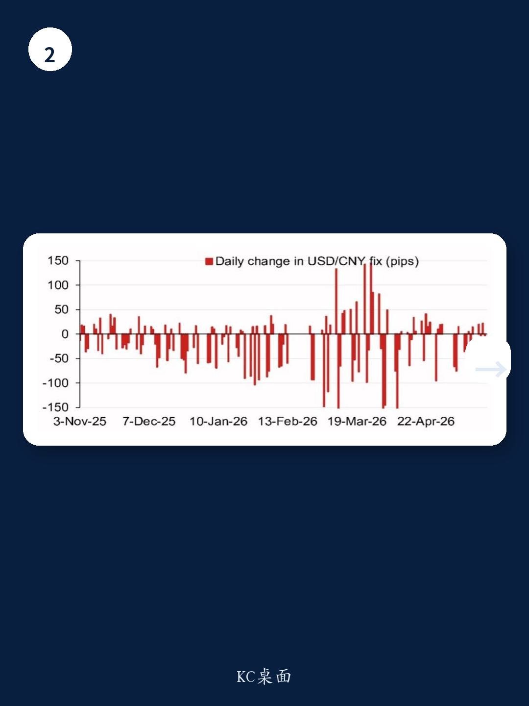

# 人民币中间价的定价权，比市场想象的更主动

市场对人民币汇率的讨论，长期陷入一个二元框架：盯住一篮子，还是对美元渐进贬值。但这份来自某外资投行的中间价模型报告，揭示了一个更深层的信号——中国央行在中间价定价上的主动调节空间，比许多投资者以为的要大得多。模型预测值与实际中间价之间的差距，正在系统性收窄，这本身就是一个判断，而非背景。

报告的核心价值不在于给出一个具体的预测数字，而在于拆解了“定价公式”中那些不可见的部分。当模型误差从千点级别收敛至百点级别，背后是逆周期因子使用频率和力度的结构性变化。对于任何持有人民币资产或承担汇率敞口的决策者而言，理解这个定价机制的变化，比猜测下一个点位重要得多。

## 1. 逆周期因子的角色正在从“对冲”转向“微调”

模型给出的不加逆周期因子的预测值为6.7979，而加入逆周期因子后的预测值为6.8138，二者相差仅211个基点。这个差值在历史序列中处于偏低水平。回顾2025年初，模型误差曾高达1800个基点，逆周期因子需要大规模介入才能平抑市场预期。如今，误差区间的收窄意味着，央行不再需要大幅偏离模型来传递信号。

这意味着什么？逆周期因子的使用逻辑，可能已经从“对抗单边预期”演变为“管理日内波动”。央行对中间价的掌控力，不是变弱了，而是变得更精细、更隐蔽。对于交易员而言，过去那种“盯住模型偏差就能判断央行意图”的策略，可能需要让位于对每日波动区间的更微观观察。

## 2. 误差收敛本身就是一个重要信号

报告中的模型误差走势图（图2）值得反复看。从2025年初的-1800个基点，到2026年4月的+600个基点，误差不仅绝对值在缩小，方向也在切换。这说明，市场的定价逻辑和央行的调节逻辑正在趋同，而不是背离。

一个合理的推断是：当误差持续为正或为负时，央行会倾向于通过逆周期因子进行修正；但当误差在零轴附近摆动时，央行可能选择容忍。这种容忍本身，就是一种政策态度。它意味着，央行认为当前的市场定价已经基本反映了基本面，无需额外干预。这对投资者而言，是一个相对友好的环境——政策不确定性在降低，汇率走势的可预测性在提升。

## 3. 关键事件日历揭示了“汇率窗口期”的存在

报告列出了一份2026年下半年的事件日历，包括7月的政治局会议、10月黄金周、11月APEC会议、12月的中央经济工作会议，以及年底可能的中美元首会晤。这些事件并非简单的日程罗列，而是构成了一个“汇率政策窗口期”的框架。

在重大外事活动或国内政策会议前后，汇率稳定往往是优先目标。但窗口期之外，央行可能赋予市场更多弹性。因此，下半年人民币汇率的波动节奏，很可能不是线性的，而是与这些事件紧密挂钩。投资者需要做的，不是预测每个事件的结果，而是识别出每个窗口期前后央行可能的“弹性空间”变化。

## 4. 报告尚未完全回答的关键问题：逆周期因子的“阈值”在哪里？

这份模型报告最令人好奇的部分，恰恰是它没有完全展开的——逆周期因子的触发条件。模型可以计算出逆周期因子的调整幅度，但无法告诉我们，央行在什么情况下会决定启用它。是当模型误差超过某个绝对值？还是当日内波动幅度达到某个阈值？抑或是基于更宏观的金融稳定考量？

这个问题之所以关键，是因为它决定了投资者如何给自己的头寸上“保险”。如果逆周期因子的触发阈值是已知的，那么交易策略就可以围绕这个阈值设计。但现实中，这个阈值是动态的、非透明的。报告没有给出答案，这也意味着，对于希望精确对冲汇率风险的机构而言，仅仅依赖模型是不够的，还需要对政策意图有更深的理解。

## 5. 真正需要建立的是“定价机制”的观察框架，而非“点位”的预测框架

对于大多数读者而言，这份报告最大的价值不在于6.7979或6.8138这两个数字，而在于它提供了一个观察央行行为的框架。具体来说，可以关注三个维度：

第一，模型误差的方向和幅度。误差持续为正或负，意味着市场定价与模型定价之间出现了系统性偏差，这往往是政策调整的前兆。

第二，逆周期因子调整的频率和力度。如果调整幅度突然放大，或者连续多日出现调整，说明央行正在释放信号。

第三，事件日历与汇率波动的关联。在重要会议或外事活动前，如果中间价突然出现与模型预测明显偏离的调整，那很可能不是技术性的，而是政策性的。

这三者组合起来，可以构成一个比单纯看点位更有效的汇率判断框架。

---

逆周期因子的“阈值”究竟在哪里？误差收敛到多少，央行才会重新加大干预？这些问题的答案，可能藏在更完整的报告和更长时间序列的数据中。欢迎来我们的星球微信群，继续拆解这份中间价模型报告的完整逻辑与图表，一起讨论下半年人民币汇率的核心变量。

Personal reading notes and learning share only. Not investment advice.

