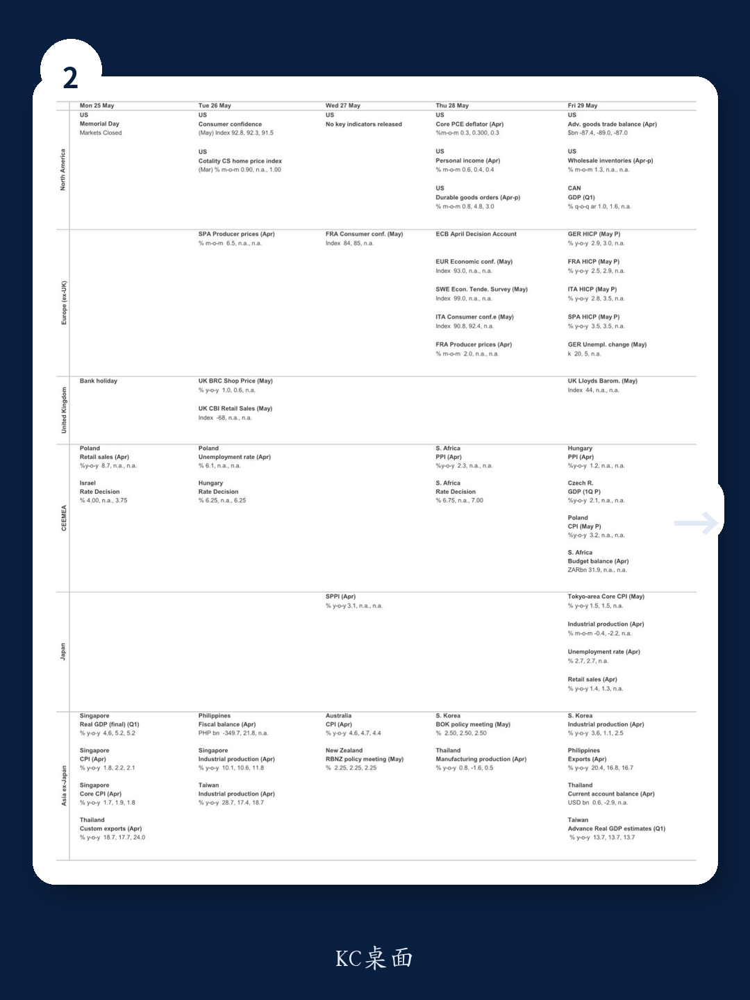

# 美联储的“无限期暂停”才是市场真正的定价盲区

市场对美联储降息的定价，正在从一个“时间问题”变成一个“方向问题”。过去几个季度，主流叙事始终围绕“何时降息”、“降几次”。但某外资投行最新发布的研报，给出一个更值得警惕的判断：美联储可能无限期按兵不动，2026年全年不降息。这个判断不是基于一次性的数据扰动，而是基于三个结构性变化——政治压力消退、通胀压力扩散、劳动力市场韧性超预期。市场如果还在用“降息只是推迟”的框架去定价资产，可能会错过更根本的宏观切换。

这份报告的核心洞察在于：美联储内部支持宽松倾向的票数正在减少，而鹰派官员开始公开讨论加息的可能性。这不是一次“鸽派暂停”，而是一次“鹰式暂停”（Hawkward Pause）。理解这个切换的底层逻辑，比猜测下一次FOMC的措辞更重要。

## 1. 政治压力消退：特朗普不再施压，降息的外部驱动力消失

过去一年，市场对美联储降息的预期中，隐含了一个重要假设：政治压力会迫使美联储放松政策。但这份报告引用特朗普本人的公开表态，揭示了关键变化。特朗普在《财富》杂志采访中明确表示，“在战争结束前，你无法真正看数据”，并称将让新任美联储主席沃什“做他想做的事”。这意味着，来自白宫的降息压力已经实质性消退。

这个变化的影响是结构性的。此前，部分市场参与者认为美联储的独立性会在选举周期或地缘冲突期间受到政治干预。但当前的政治信号表明，白宫不仅不再施压，反而在授权美联储自行判断。这直接削弱了市场此前定价中的“政治降息溢价”。对于资产定价而言，这意味着美联储的行动将更纯粹地取决于数据，而非外部压力。

## 2. 通胀压力的扩散已经超出“关税脉冲”的范畴

报告明确指出，关税带来的通胀压力正在消退，但新的价格压力正在从其他渠道涌现。伊朗战争推高了能源价格，全球内存芯片短缺正在推高电子产品的价格。更关键的是，调查数据中的价格信号已经进入历史极端区间。S&P制造业PMI的投入价格指数在5月飙升至79.5，创下该系列历史上最大的月度涨幅。纽约联储的服务业价格指数也在持续上升，指向超级核心PCE通胀的持续性。

报告预计4月核心PCE同比将从3.2%升至3.3%，但更值得关注的不是这个数字本身，而是其构成。核心商品通胀已经连续五个月上升，计算机软件及配件是主要推手。而超级核心PCE虽然4月有所放缓，但强劲的股市意味着金融服务价格将在5月反弹，机票价格也在加速。这意味着通胀的“去中心化”正在发生——不再是单一因素推动，而是多个渠道同时升温。这对美联储而言，意味着“等待通胀回落”的窗口正在关闭。

## 3. 劳动力市场的韧性正在从“稳定”转向“加速”

报告中最容易被忽视的数据是ADP的周度就业指标。ADP数据显示，截至5月2日的四周内，私人部门平均周度新增就业达到42.5万人，创下该系列历史最高值。初请失业金人数近期保持横盘，这在季节性上属于积极信号，因为近年来的趋势是初请人数在夏季上升。制造业和商业资本支出也在加速，S&P制造业PMI创下多年新高，资本品出货和进口均走强。

这些数据合在一起指向一个判断：劳动力市场不仅没有恶化，反而在加速改善。这对美联储意味着什么？报告中的鹰派官员沃勒已经明确表态：劳动力市场正在稳定，几乎没有恶化风险。如果就业持续加速，美联储不仅没有理由降息，反而可能开始讨论何时需要加息。这是一个市场尚未充分定价的风险。

## 4. 报告尚未完全回答的关键问题：沃什能否真正推动降息？

新任美联储主席沃什被市场视为潜在的鸽派力量。报告也承认，沃什本人可能仍有降息的动机。但问题在于，他能否说服FOMC的多数成员支持降息？报告给出的答案是悲观的。4月FOMC会议纪要显示，支持改变宽松倾向的官员数量已经从3月的“许多”减少到“几位”。而鹰派官员如沃勒和费城联储主席霍尔森已经公开表态，认为降息的可能性不高于加息。

这里有一个尚未被充分讨论的变量：沃什的领导风格和说服力。如果沃什试图推动降息，他将面临一个内部共识正在快速收紧的委员会。报告没有给出沃什的具体策略或可能的妥协方案，这个不确定性是未来几个月最重要的宏观观察点。如果沃什无法凝聚支持，美联储的“无限期暂停”可能比市场预期的更长。

## 5. 投资者需要建立的观察框架：从“降息时点”转向“加息概率”

面对美联储的鹰式暂停，投资者的分析框架需要从“何时降息”切换到“是否可能加息”。报告提供了几个关键信号：核心PCE是否持续高于0.3%的月环比、制造业投入价格指数是否继续飙升、劳动力市场是否继续加速。这些数据如果持续走强，市场将从“推迟降息”的叙事切换到“重新定价加息”的叙事。

另一个值得跟踪的指标是OIS远期利率曲线与美联储点阵图的偏离。报告中的图表显示，OIS远期利率已经低于美联储的预测路径，这意味着市场仍在定价降息。如果数据持续超预期，这个偏差将需要修复，而修复的方式可能是长端利率的上行。对于固定收益投资者而言，这意味着久期风险可能被低估。

这份报告的价值不在于给出一个确定的预测，而在于提供了一个清晰的逻辑链条：政治压力消失、通胀扩散、就业加速，三者叠加导致美联储内部宽松共识瓦解。投资者如果还停留在“降息只是时间问题”的框架里，可能会错过资产定价的范式切换。

报告中的图表和详细数据，特别是关于FOMC内部投票变化的逐次会议对比、ADP周度就业的历史序列、以及制造业投入价格指数的极端读数，都值得仔细拆解。这些数据背后的二阶影响，包括对美元、美债收益率曲线斜率、以及成长股估值的影响，报告没有完全展开。欢迎来星球微信群里继续讨论，一起拆解这份完整研报的图表逻辑和资产含义。

Personal reading notes and learning share only. Not investment advice.

