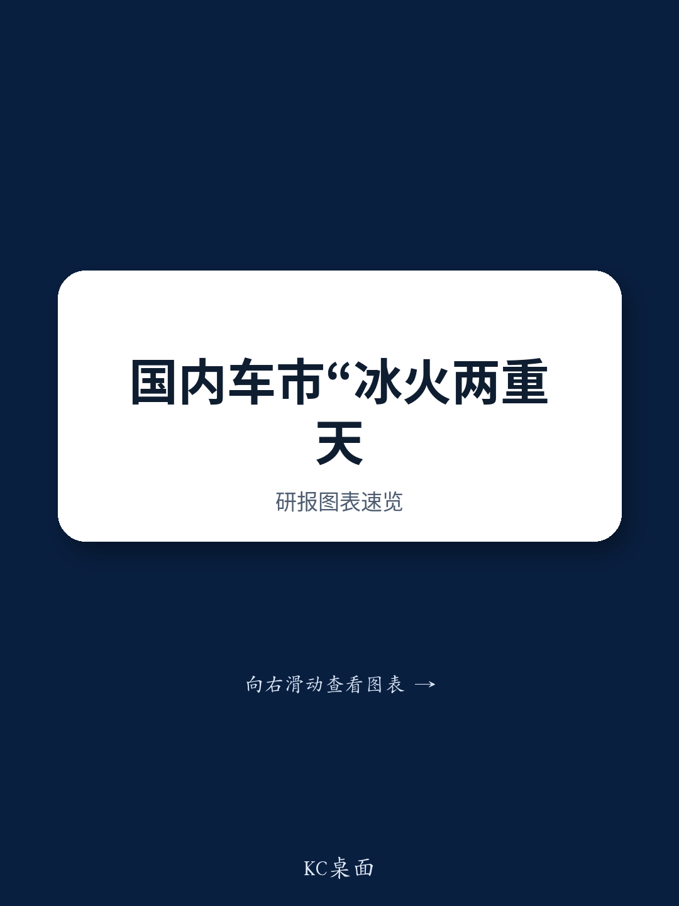
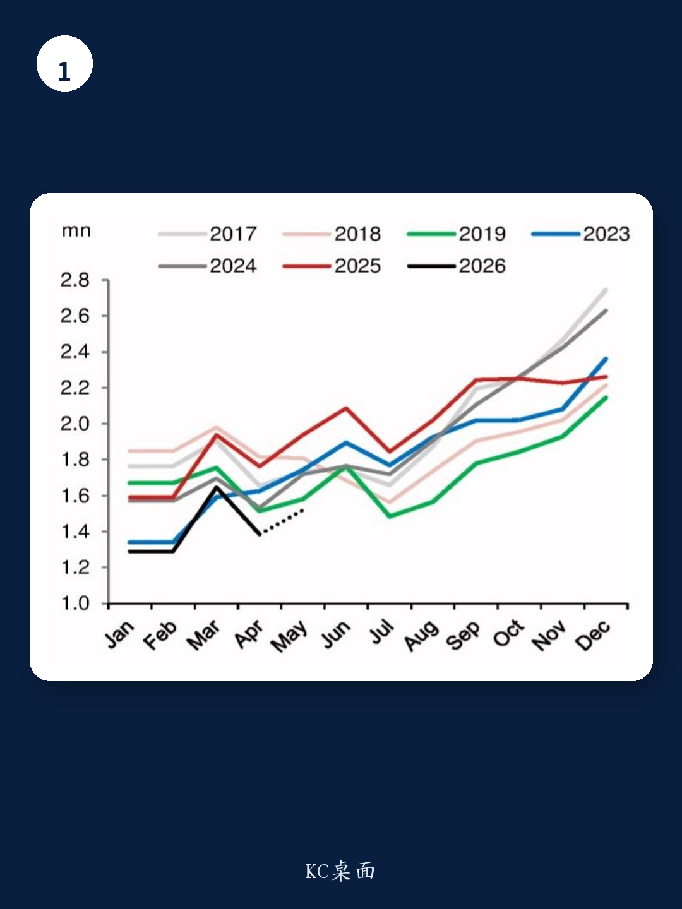

# 市场真正低估的不是需求，而是内外市场“断崖式分化”的定价效应

中国汽车市场的叙事正在被重写。5月国内乘用车零售销量同比增速预计下滑至-21.6%，较4月的-20.0%进一步恶化，而出口增速却飙升至84.1%。这两个数字放在一起，揭示的不是简单的“内冷外热”，而是一个更深层的结构性事实：中国汽车产业正在经历一场从“内需驱动”到“双轨并行”的剧烈切换，而资本市场对这一切换的定价尚未完全反映其长期影响。

某外资投行最新发布的研报提供了一个关键判断：国内与出口市场之间的裂口，在2026年全年将持续扩大。这意味着，任何仅基于国内销量数据来判断整个汽车行业景气度的框架，都将严重失真。真正值得关注的问题，不是国内需求何时见底，而是企业能否在出口高速增长的同时，将规模优势转化为可持续的议价权与利润结构。

## 1. 国内销量下滑并非周期波动，而是政策退潮后的“真实需求映射”

5月-21.6%的增速，不是一次性的数据扰动。研报明确指出，下滑的驱动因素来自两个叠加效应：以旧换新补贴退坡后的“补课效应”，以及电动车购置税从0%恢复至5%带来的成本冲击。

这两项政策调整的共同点在于，它们都在移除过去两年人为创造的“需求前置”。2023年至2024年，政策红利让大量本应在2026年释放的需求被提前透支。如今政策退潮，市场正在经历一次“去泡沫”式的需求回归。这不是需求消失，而是需求被重新校准到真实购买力与使用成本所支撑的水平。

对于整车厂而言，这意味着依赖政策补贴来维持销量的商业模式已走到尽头。那些在补贴时代靠低价和营销快速扩张、但缺乏产品力和品牌溢价的公司，将面临最严峻的考验。而对于投资者，国内销量的持续低迷，恰恰是检验企业“抗周期能力”的试金石。

## 2. 出口增速84.1%的背后，是能源格局变化带来的非对称优势

4月出口量同比增速从Q1的60.7%跳升至84.1%，这个速度超出了单纯市场拓展所能解释的范畴。研报提供了一个关键视角：全球油气价格攀升，正在意外地为中国电动车创造独特的竞争优势。

逻辑链条并不复杂。油气价格上涨，使得燃油车的使用成本在全球范围内显著上升，加速了消费者对电动车的转向。而中国作为全球电动车产业链最完整的国家，在这一轮“成本驱动型电动化”中占据了天然的供给优势。这不是技术领先带来的溢价，而是成本结构差异带来的结构性红利。

但这里有一个尚未被充分讨论的隐含问题：这种优势的可持续性取决于油气价格走势。如果全球能源价格回落，中国电动车的相对吸引力是否会同步减弱？研报没有给出明确判断，但这一不确定性，恰恰是评估出口增长“质”而非“量”的关键变量。

## 3. 出口无法完全对冲内需下滑，但“对冲”的思考框架本身就是错的

研报给出了一个精确的数字：2025年，出口仅占中国汽车市场总量的19%和总值的15%。这意味着，即便出口增速维持高位，其在总量层面的拉动作用仍有限。5月国内销量下滑21.6%，而出口增长84.1%，两者在绝对规模上并不匹配。

但更重要的洞察在于：将出口视为“对冲内需下滑的工具”，本身就是一个误导性的分析框架。出口和内需是两个完全不同的竞争场域。国内市场的竞争焦点是价格、渠道和政策敏感度；出口市场的竞争焦点则是合规、品牌认知、售后服务网络和地缘政治风险。一家企业很难用同一套能力同时在这两个战场上取胜。

因此，真正值得关注的是：哪些企业能够在国内市场“守得住”的同时，在出口市场“攻得出去”？这考验的不是规模，而是组织能力和战略定力。

## 4. 报告尚未完全回答的关键问题：出口利润能否支撑行业整体估值

研报清晰地描绘了销量与增速的分化，但对于一个核心问题着墨不多：出口业务的利润率是否足以弥补国内市场的利润下滑？

出口增长84.1%，但如果出口产品的单价和利润率远低于国内，那么“量增利薄”的局面反而可能拉低整个行业的盈利水平。尤其是在当前全球贸易摩擦加剧的背景下，部分市场的关税壁垒和本地化生产要求，正在侵蚀中国车企的出口利润空间。

这一点需要更细致的拆解。不同市场、不同车型、不同渠道模式的出口利润差异极大。研报没有提供出口利润率的细分数据，这意味着，目前市场对出口板块的估值，可能隐含了一个“利润与销量同步增长”的乐观假设。如果这一假设无法成立，那么当前部分出口导向型车企的估值溢价，就存在回调风险。

## 5. 投资者需要建立的新观察框架：从“总量思维”转向“结构思维”

基于上述分析，传统的“看月度销量、判断行业景气”的方法已经失效。更有效的观察框架应该包括三个维度：

第一，国内市场份额的变动，而非绝对销量。在总量下滑的环境中，市场份额的提升意味着企业在存量竞争中获得定价权和渠道优势，这是衡量企业竞争力的核心指标。

第二，出口市场的“利润率曲线”，而非仅看增速。需要追踪的是：随着出口规模扩大，单位利润是在提升还是下降？这反映了企业是否在出口市场建立了品牌溢价或成本优势。

第三，政策敏感度的降低程度。一家企业如果仍高度依赖补贴、购置税优惠等政策工具来驱动销量，那么它在2026年的处境将比同行更为脆弱。真正的安全边际，来自于产品力和成本结构对政策的“免疫能力”。

这三个维度，比任何一个单一的总量数据都更能说明企业的真实竞争力。

## 6. 一个被低估的长期变量：能源价格波动如何重塑竞争格局

研报中提及，油气价格上涨驱动了全球对中国电动车的需求。这个判断本身成立，但它的逆命题同样值得警惕：如果全球进入能源价格下行周期，中国电动车的出口优势是否会同步削弱？

更深远的影响在于，能源价格的波动不仅影响需求，还会影响各国政府对电动车的补贴政策、贸易保护措施以及基础设施投资节奏。这些因素的组合，将决定中国车企出海是“顺势而为”还是“逆风而行”。

这一点，研报没有展开分析，但它可能是2026年下半年最值得跟踪的宏观变量。

---

以上讨论触及了研报中最核心的判断，也点出了那些尚未被充分回答的疑问。出口利润的真实结构、能源价格波动的二阶影响、以及不同车企在“双轨市场”中的差异化表现，这些内容在完整报告中都有更深入的图表拆解和情景分析。欢迎来社群微信群继续拆解完整报告，一起探讨这些未被定价的变量将如何影响你的投资判断。

Personal reading notes and learning share only. Not investment advice.

