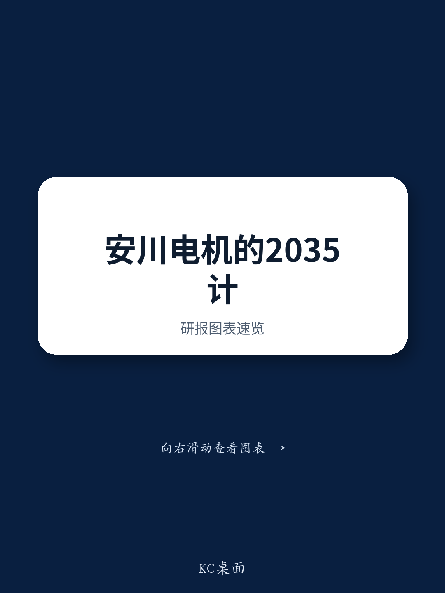
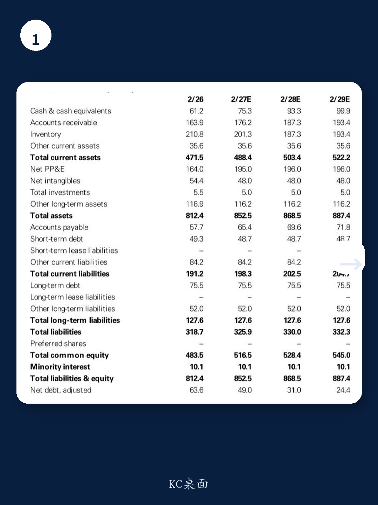
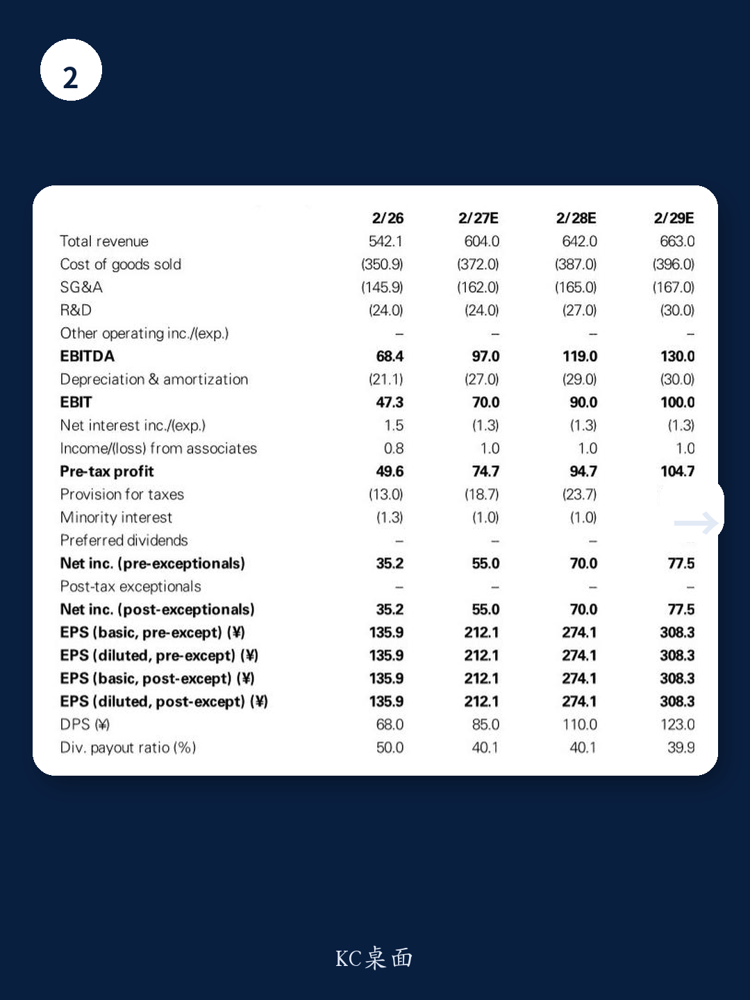

# 安川电机的长期目标比短期数字更重要，但市场可能低估了实现路径的难度

某外资投行在5月22日收盘后发布了安川电机的研报，核心围绕公司新公布的四年中期计划Dash35和十年长期愿景Vision 2035。市场目光大多落在FY2/30的1000亿日元营业利润目标和15.4%的营业利润率上，但这份报告真正值得深读的判断是：**长期20%的OPM目标才是结构性信号，而中期分部门目标的“保守与乐观并存”恰恰揭示了公司战略的真实意图。**

报告给出12个月目标价7300日元，维持买入评级，当前股价7064日元，上行空间仅3.3%。这看似保守的价差背后，隐藏着对安川电机盈利节奏和业务结构重塑的深层判断。

## 1. 中期目标虽符合预期，但长期20%OPM才是真正的变革信号

安川电机为FY2/30设定了1000亿日元营业利润和15.4%OPM的目标，基于145日元/美元和170日元/欧元的汇率假设。报告指出，当前市场对FY2/28的共识营业利润为754亿日元，因此中期目标大致符合预期。但对FY2/30，市场估计约在900亿日元左右，1000亿日元的目标略高于共识。

真正值得关注的不是这些中期数字，而是面向FY2/36的长期愿景——将20%以上的OPM定位为最重要的KGI。报告明确表示对这一目标“印象正面”，因为它意味着公司必须进行更深层次的业务结构改革。这不仅仅是利润率的提升，而是安川电机从传统制造企业向更高附加值业务模式转型的宣言。

对于一家历史上OPM在10%-15%之间波动的公司，20%意味着什么？这需要重新审视其业务组合、成本结构和定价能力。报告没有完全展开这一点，但暗示了实现这一目标需要“进一步改革”和“实施具体举措”。这是投资者需要持续跟踪的关键变量。

## 2. 运动控制业务的目标保守得令人怀疑，而机器人业务的目标则乐观得需要验证

报告对分部门目标的评估是整篇研报中最具洞察力的部分。对于运动控制（MC）业务，FY2/30的17.3%OPM目标和FY2/28的16.2%目标，看起来并不激进——这些利润率水平在过去已经多次实现。报告甚至认为，在当前业务环境向好背景下，FY2/27就可能达到这些水平。

这引出了一个关键问题：**为什么公司要设定一个看似容易实现的目标？** 报告给出的解释是：考虑到MC业务的高度周期性，这些数字更像是管理层在不利条件下也要兑现的“坚定承诺”。换句话说，这是公司在向市场传递“我们有底线”的信号，而非展示上限。

反观机器人业务，情况完全不同。FY2/28的10.4%OPM目标通过成本削减似乎可达，但FY2/30的15.5%目标就显得乐观了。报告指出，该业务的历史峰值OPM仅为13.7%（FY2/23第四季度），全年最高为11.7%。公司提到AI机器人带来的附加值提升，但报告直言“实现路径的可行性仍有待观察”。

这种“保守与乐观并存”的设定，实际上暗示了安川电机的战略重心：MC业务将继续扮演利润稳定器，而机器人业务则承担着突破性增长的任务。但突破需要时间，也需要市场验证。

## 3. 资本效率目标低于预期，但盈利上行可能让这些目标提前实现

报告指出，安川电机新的资本效率目标——FY2/30的ROE不低于12%、ROIC不低于11%——相较上一期长期愿景的15%以上目标，显得“缺乏亮点”。FY2/28的ROE和ROIC目标更是只有10%和9%。

这看起来是一个负面信号，但报告给出了不同的解读框架：公司采取的是“增长优先”立场，而报告预计从FY2/27开始盈利上行将变得明显，这些目标很可能提前实现。换句话说，**资本效率目标的“保守”并非能力问题，而是战略选择的结果。**

但这里有一个尚未完全回答的问题：公司对资本成本的认知和现金流分配政策是否足够清晰？报告提到“期待6月1日管理层说明会提供更多细节”，这表明当前的信息披露尚不足以让投资者完全信服。如果公司不能有效沟通资本配置策略，市场可能会对长期目标的实现打折扣。

## 4. 报告尚未完全回答的关键问题：20%OPM的路径依赖什么？

这是整篇研报最需要深挖的部分，也是报告本身没有完全展开的领域。报告提到20%OPM目标需要“业务结构改革”，但具体的改革举措是什么？是产品组合向高附加值领域迁移，还是制造效率的持续提升，或是通过AI技术实现服务化转型？

从报告给出的信息看，MC业务的OPM目标相对保守，这意味着20%的整体目标可能需要机器人业务贡献更大增量。但机器人业务的历史利润率峰值仅为13.7%，要达到15.5%甚至更高，需要的不只是成本削减，而是商业模式本身的改变。

另一个未解问题是：AI相关资本开支的持续性。报告提到安川电机将从AI资本开支浪潮中受益，尤其是半导体相关需求的持续增长。但半导体周期本身就是高度波动的，如果AI需求出现阶段性调整，安川电机的盈利弹性将如何演变？报告没有给出压力测试情景。

## 5. 投资者应该建立的观察框架：三个关键锚点

基于报告的判断，投资者可以建立以下三个观察锚点，而不是简单盯着季度业绩数字：

**第一个锚点：MC业务的利润率轨迹。** 既然MC业务的目标看起来保守，实际表现是否真的能提前达标？如果FY2/27就能实现16%以上的OPM，那将是对公司“底线承诺”的强有力验证，也会为整体利润目标提前实现创造条件。

**第二个锚点：机器人业务的利润率拐点。** 15.5%的OPM目标是否可实现，取决于AI机器人附加值提升的速度。投资者需要关注的是公司在机器人领域的研发投入方向、客户案例以及订单结构的变化，而非短期销量。

**第三个锚点：资本配置政策的演进。** 公司当前“增长优先”的立场是否会在盈利改善后转向股东回报？报告提到资本效率目标低于预期，但同时也暗示如果盈利上行，这些目标可能提前实现。关键在于管理层是否会在6月1日的说明会上提供更清晰的资本政策框架。

这三个锚点共同指向同一个核心问题：安川电机的利润增长究竟是周期性的，还是结构性的？如果是前者，20%的长期OPM目标可能只是愿景；如果是后者，当前估值可能仍有上行空间。

---

以上分析仅基于该外资投行研报的核心判断和逻辑推演。报告中还有更多关于分部门财务数据、估值模型假设和风险因素的细节，这些内容对于形成完整的投资判断至关重要。例如，报告对FY2/27的营业利润预期为700亿日元，这已经接近公司设定的FY2/28中期目标——如果提前一年达标，对估值框架的影响是什么？这些图表和数字背后的二阶效应，在当前的公开讨论中很难完全展开。

欢迎来星球微信群里一起拆解完整报告，我们会在群内分享原始PDF、讨论估值模型的隐含假设，以及6月1日管理层说明会可能释放的关键信号。

Personal reading notes and learning share only. Not investment advice.

