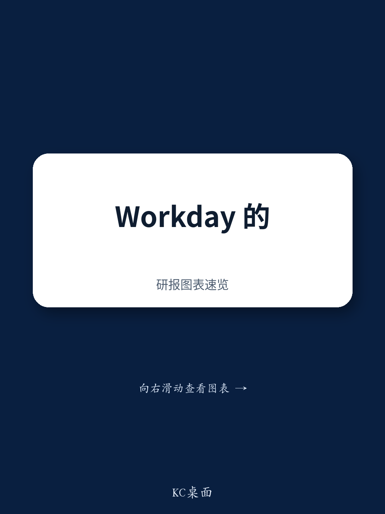
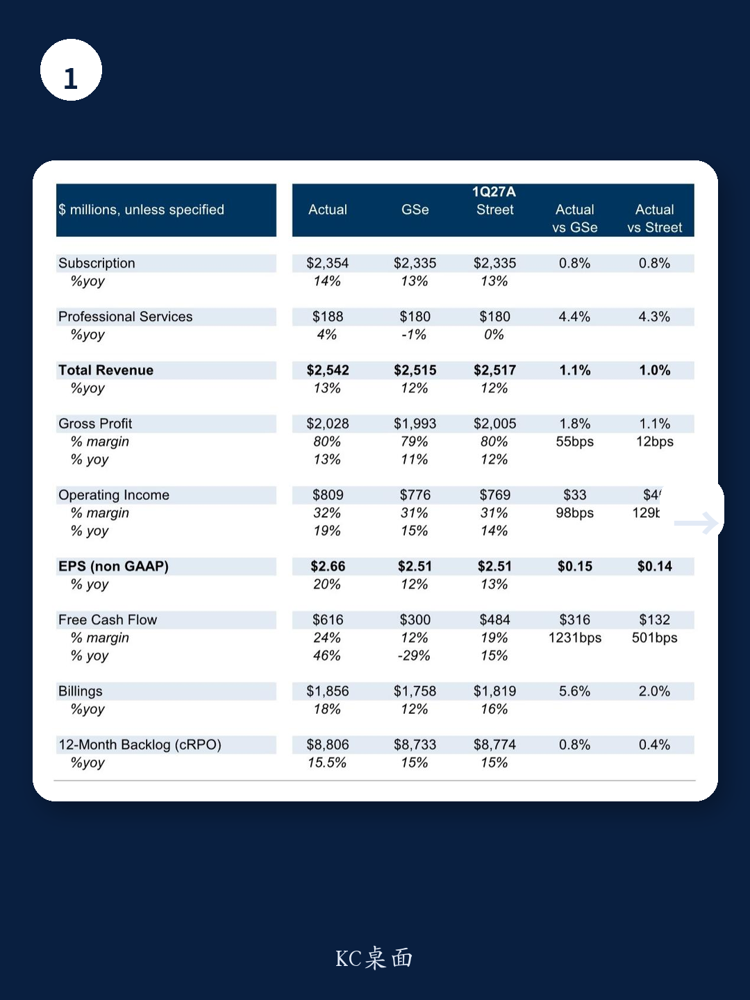
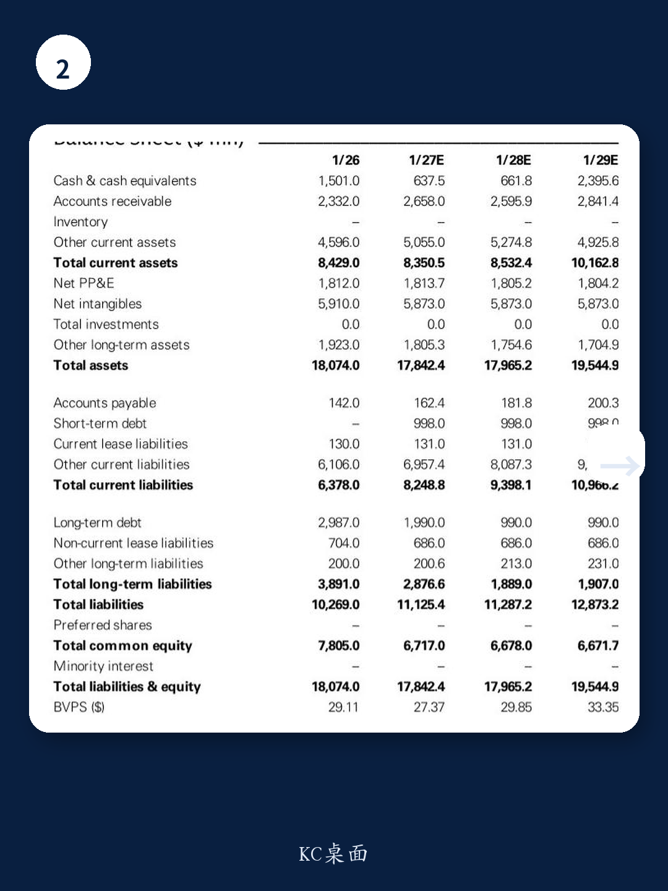

# Workday的真正拐点不在财报，而在“无头架构”能否跑通

一份刚刚发布的某外资投行研报，在Workday交出超预期的一季度成绩单后，给出了一个耐人寻味的判断：维持中性评级。股价盘后上涨11%，订阅收入超预期80个基点，EBIT利润率超指引130个基点，EPS高出6%——这些数字放在任何一家SaaS公司身上都值得庆祝。但这家投行的分析师选择将目标价从206美元下调至151美元，并在报告标题中强调“通往AI驱动价值的路径更加清晰，但尚未兑现”。

这份报告真正值得关注的，不是Workday这一季做对了什么，而是它正在赌一个可能彻底改变企业软件格局的架构方向。理解这个判断，比知道它超预期了几个百分点重要得多。

## 1. 核心订阅增速连续五个季度停滞，AI收入正在“拆东墙补西墙”

如果我们只看Workday的总体订阅增长，一季度14%的同比增速似乎不错。但报告揭示了一个更微妙的数字：当把AI相关收入剥离后，Workday的“核心”订阅收入增速已经连续五个季度稳定在12%左右。这不是增长停滞，而是增长的结构性固化。

某外资投行分析师估算，Workday的agentic ARR（代理型AI年度经常性收入）已达到5亿美元，占新增净ARR的30%以上。这意味着AI正在成为增量收入的主要来源，但传统按人头计费的SaaS业务增速正在自然放缓。问题不在于AI能不能带来收入，而在于AI的收入能否在传统业务增速下滑之前，接住增长的接力棒。

对投资者的含义是：Workday的估值逻辑正在从“稳定增长的SaaS”切换到“转型期的平台公司”。后者通常需要更高的风险溢价，这也解释了为什么目标价被下调。

## 2. “无头架构”不是技术概念，而是对SaaS商业模式的根本重构

报告中最具战略深度的部分，是Workday对其“lights out”（无人值守）财务和HR愿景的进一步阐述。这个愿景的核心是一个被称为“无头”的企业软件架构。传统SaaS是“前端应用+后端数据”一体化的产品，而“无头”意味着将前端用户界面与后端数据逻辑彻底分离。

Workday规划了三条货币化路径：第一，直接销售自己的AI代理，控制总体拥有成本并确保成功交付；第二，通过Extend Pro平台让客户在Workday之上构建AI应用；第三，为第三方开发者提供底层API和基础设施，形成生态系统。

这三条路径的共同指向是：Workday不再把自己定位为一个HR或财务软件公司，而是试图成为企业AI时代的操作系统层。这不仅是技术架构的变化，更是商业模式的根本转变——从卖座位变成卖能力、卖平台、卖生态。

但报告也明确指出了风险：这些路径的成功与否，取决于两个尚未验证的前提——产品与市场的匹配度，以及客户是否愿意接受这种从“购买软件”到“购买平台”的转变。这里的判断需要谨慎：目前没有任何数据能证明企业客户已经准备好为这种架构付费。

## 3. 进入IT服务管理市场，是拓宽TAM还是分散注意力？

Workday在本次财报中宣布进入IT服务管理（ITSM）市场。从表面看，这是基于Workday在员工生命周期管理领域的领域经验进行自然延伸。员工入职、权限管理、IT支持请求，这些确实与HR系统高度相关。

但这个动作的深层逻辑，在于Workday正在试图用“员工全生命周期”的概念重新定义自己的可寻址市场（TAM）。传统上，HR软件、财务软件、ITSM软件是三个独立的市场。Workday的赌注是：在AI时代，这些边界正在模糊，因为AI代理需要跨系统协调数据。

从竞争格局看，ITSM市场已经有ServiceNow这样的强势玩家。Workday能否在这个市场立足，不仅取决于产品能力，更取决于它能否说服客户用一个平台管理从招聘到IT支持的所有流程。报告没有给出明确的判断，但留下了值得追问的问题：一个在HR领域建立信任的公司，能否在IT领域同样获得信任？这两个领域的采购决策者完全不同。

## 4. 一个尚未被充分讨论的风险：AI代理能否在“无头”架构中真正实现跨系统协同？

报告没有完全展开，但值得深入思考的一个问题是：Workday的“无头”架构假设企业愿意将所有核心数据放在Workday的平台上，或者至少允许Workday的AI代理访问这些数据。但在现实中，大型企业的数据分布在几十甚至上百个系统中，每个系统都有自己的安全策略和数据治理规则。

Workday的AI代理如果只能在Workday自己的数据范围内运行，那它的价值就局限于HR和财务场景；如果它需要跨系统运行，那就需要解决数据互操作性和安全合规这两个长期未解的难题。报告没有给出这方面的技术细节或客户案例，这是一个明显的认知缺口。

对产业决策者来说，这里需要关注的是：Workday的AI代理战略是否真的能实现“lights out”式的自动化，还是最终只能做到“lights dim”（部分自动化）？这个问题的答案，将直接影响Workday未来三到五年的收入结构和利润率。

## 5. 估值框架的切换：从非GAAP到GAAP的隐含信号

报告中的一个技术细节值得注意：某外资投行将估值基准从非GAAP EPS切换到了GAAP EPS，目标价对应的估值倍数从17.5倍调整到24倍。表面看倍数提高了，但目标价从206美元降至151美元，说明EPS预期实际上被大幅下调。

这个切换背后的逻辑是：随着非GAAP向GAAP的转换改善，GAAP EPS现在可以作为更可靠的估值锚点。但这也意味着，Workday的股权激励成本、收购摊销等非现金支出正在变得更加透明。对于长期投资者来说，GAAP EPS更能反映真实的股东价值创造能力。

报告给出的24倍估值，高于软件同行中位数2倍，理由是Workday的GAAP EPS增速更快（比同行高3个百分点）和更高的Rule of 40得分。但这个溢价是否合理，取决于前述“无头”架构能否在12-18个月内兑现其商业承诺。

---

Workday正处于一个关键转型期。一季度的超预期表现是管理层执行力的证明，但真正的价值创造取决于那些尚未被验证的战略假设：企业是否愿意接受“无头”架构？AI代理能否实现跨系统协同？ITSM能否成为新的增长引擎？

这些问题，报告没有给出确定的答案。它们需要更多的客户案例、产品数据和竞争动态来验证。如果你对Workday的AI战略、估值框架切换的细节，或者“无头”架构对传统SaaS公司的竞争含义感兴趣，欢迎来我们的星球微信群继续讨论。我们会在那里拆解这份报告的完整图表、财务模型和竞争对比分析。

Personal reading notes and learning share only. Not investment advice.

