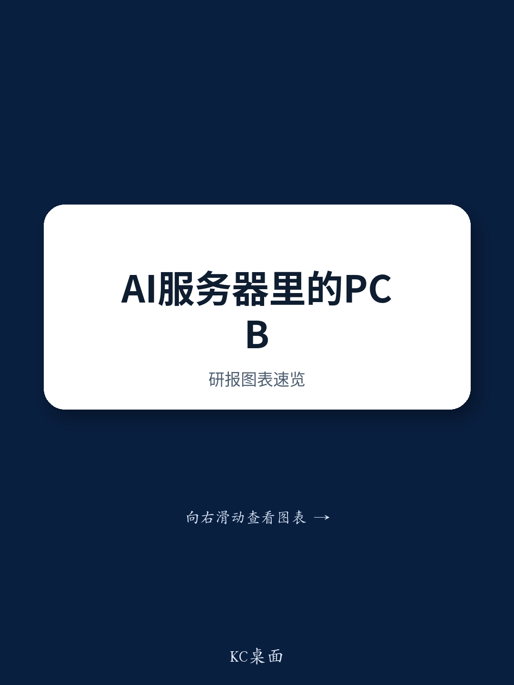
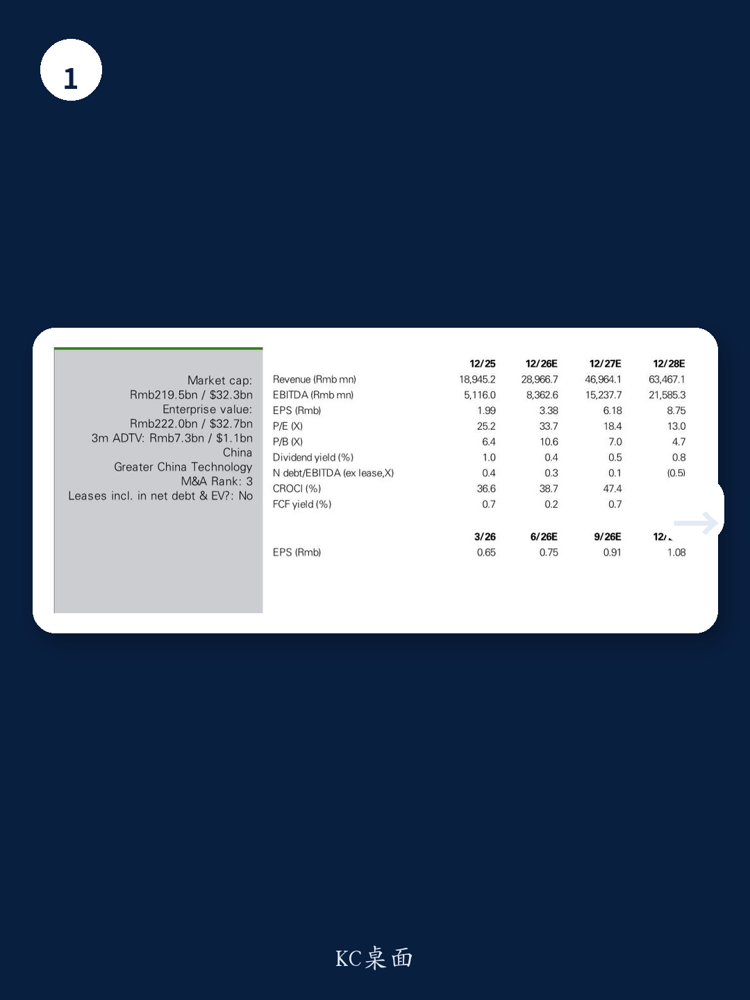
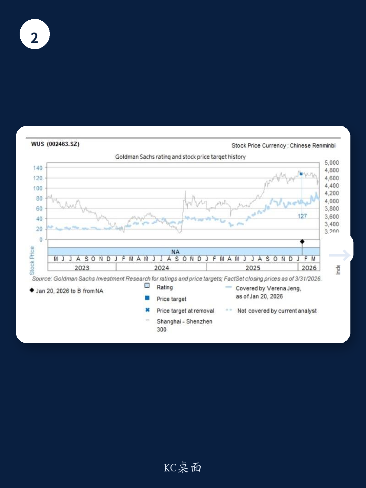

# AI PCB 的真正瓶颈不在需求，而在产能扩张的执行力

当市场还在争论AI算力需求是否见顶时，一份最新调研纪要揭示了一个更关键的信号：某头部PCB厂商的管理层对AI PCB终端需求保持乐观，同时正在将资本开支从2025年的30亿元大幅提升至2026年的60亿元，且这一高强度投入将持续到2028年。这不是简单的扩产，而是对“供给能力能否跟上技术升级”的核心赌注。

这份来自某外资投行的研报，在其中国科技之旅期间对沪电股份（002463.SZ）进行了管理层调研。报告的核心判断并非需求侧的新故事，而是供给侧的结构性变化——AI基础设施的升级周期正在重塑PCB行业的竞争门槛。那些能够将规模扩张转化为技术议价权的企业，将在这轮周期中实现质的飞跃。

## 1. 市场低估了AI服务器机架内部连接对PCB用量和规格的双重拉动

大多数投资者对AI PCB的理解停留在“更多层数、更高级材料”的简单线性增长。但报告揭示了一个更复杂的图景：AI服务器机架内部的连接需求正在从三个维度同时拉动PCB价值量——机架内tray与tray之间的连接（如背板）、tray内部的芯片间连接（如midplane），以及芯片封装层面的连接（如CoWoS）。

这三种连接方式对PCB的要求各不相同，但共同指向一个方向：更高层数、更低损耗材料、更精细的线路。报告预计，全球PCB市场价值量在2026年和2027年将分别同比增长113%和171%。这个数字的惊人之处不在于增速本身，而在于它暗示了AI PCB正在从“可选配置”变成“刚性需求”。

## 2. 资本开支翻倍不是激进，而是对技术路线确定性的理性回应

管理层明确表示，扩产策略并不是基于产能利用率，而是基于终端需求、技术准备度和产品质量。这句话值得反复推敲。它意味着沪电的产能扩张是有选择性的——只投向那些技术门槛高、终端需求确定的方向。

从数据看，2025年四季度和2026年一季度的资本开支环比分别增长53%和34%，全年预计从30亿元翻倍至60亿元，且高强度将持续到2028年。这不是盲目扩产，而是对AI基础设施升级周期确定性的理性押注。报告预计2026-2028年营收将从290亿元增长到635亿元，年均复合增长率接近50%，这个增长速度本身就验证了扩产的合理性。

## 3. 真正的竞争壁垒不是规模，而是“新产能转化为收入”的效率

市场对PCB行业的一个常见误解是“谁能扩产谁就能赢”。但报告中的一句话点出了关键：新产能必须“高效转化为收入并持续推动产品结构升级”。这意味着，产能只是入场券，真正决定胜负的是企业能否让新产能迅速匹配高价值产品需求。

对于沪电而言，其优势在于非大宗商品化产品的定位。管理层强调产能扩张聚焦于“非大宗商品化产品”，即那些竞争对手难以快速跟进的定制化、高规格产品。这实际上是在构建一种护城河——当同行还在为通用PCB的价格战厮杀时，沪电已经在用技术选型筛选客户。

## 4. 报告尚未完全回答的关键问题：ASIC渗透率上升对PCB价值量的二阶影响

报告提到，AI芯片中的ASIC渗透率预计在2026-2027年从40%升至50%。这是一个重要的结构性变量，但报告没有完全展开其影响。ASIC和GPU对PCB的需求存在本质差异——ASIC通常需要更定制化的基板和互连方案，这可能导致PCB价值量分布的变化，而非简单的总量增长。

这里仍需验证的是：ASIC渗透率上升是否会改变PCB供应商的竞争格局？定制化程度提高是否意味着订单集中度也会提升？这些问题直接关系到沪电的长期定价能力和客户粘性。报告没有给出明确判断，这恰恰是需要深入讨论的方向。

## 5. 估值框架隐含的关键假设：2027-2028年的盈利增长能否持续？

报告采用23倍2027年预期市盈率作为目标价依据，这一估值来自同业的P/E与EPS增长相关性分析。但隐含了一个关键假设：2027-2028年每年超过40%的EPS增长能否持续？从财务数据看，2026-2028年EPS预计分别为3.38元、6.18元和8.75元，增速确实惊人。

但这里有一个需要关注的风险点：当资本开支在2028年后逐步回归正常水平，营收增速是否也会相应放缓？如果增速回落，当前23倍的估值倍数是否还能维持？这取决于AI基础设施的升级周期能否从“爆发期”平稳过渡到“稳定增长期”。报告的风险提示也明确提到了“AI服务器和高速交换机升级慢于预期”以及“AI PCB市场竞争加剧”两个关键风险。

---

以上是这份调研纪要的核心洞察。但报告本身还有大量细节值得深挖：管理层对具体技术路线的态度、不同产品线的毛利率趋势、以及产能爬坡的时间表。这些内容因为篇幅限制无法一一展开。

欢迎来我们的社群，与产业研究者和投资者一起拆解完整报告。我们会在微信群里分享原始PDF，并组织专题讨论，重点围绕“ASIC渗透率对PCB价值量的二阶影响”和“资本开支回报率的验证节点”两个未解问题。期待你的加入。

Personal reading notes and learning share only. Not investment advice.

