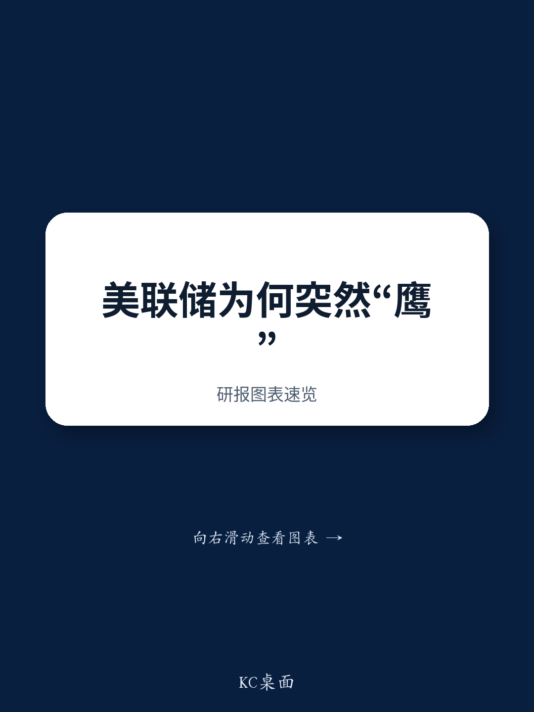
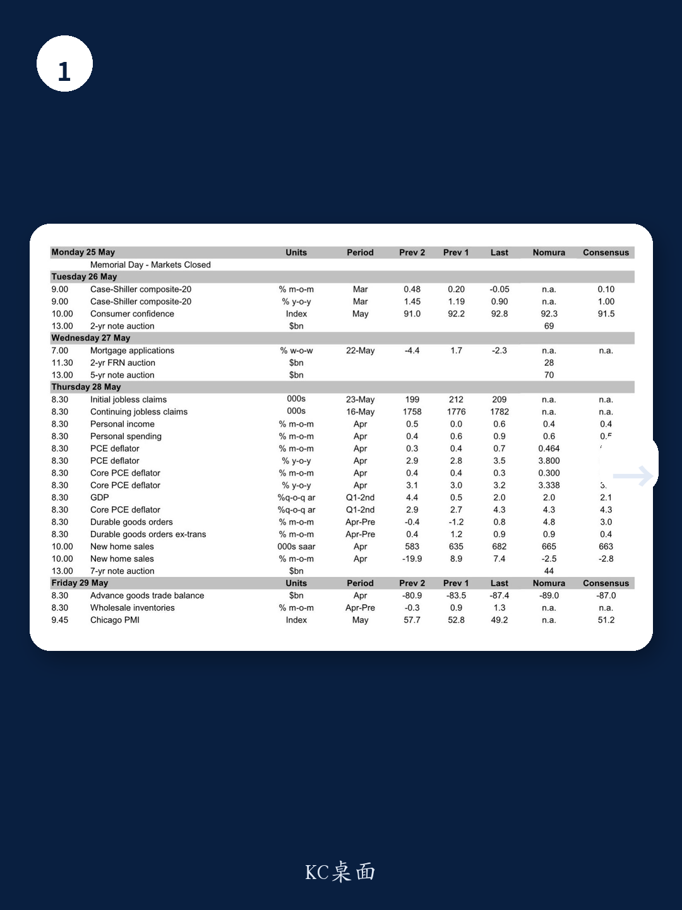

# 市场真正低估的不是降息时点，而是美联储“无限期按兵不动”的定价

过去六个月，市场一直在争论美联储何时降息。从年初的3月，到后来的6月，再到9月，降息预期一退再退。但一份来自某外资投行的最新研报提出了一个更激进的判断：美联储可能无限期按兵不动。不是推迟，不是放缓，是“indefinitely on hold”。

这份报告之所以值得认真对待，不是因为它的结论有多大胆，而是因为它从三个维度——政治压力、通胀结构、增长韧性——系统性地论证了为什么当前的环境已经不支持任何形式的宽松。更关键的是，它揭示了一个市场尚未充分定价的风险：如果美联储的终端利率就是现在的水平，而不是市场预期的更低水平，那么当前资产定价中隐含的降息溢价需要被重新评估。

## 1. 政治压力正在消退，而非加大，这是市场最大的误判

市场习惯性地认为，白宫会持续向美联储施压要求降息。但报告引用了特朗普本人的最新表态：“在战争结束前，你无法真正看数据。”这句话的关键不在于政治姿态，而在于它意味着行政分支对货币政策的干预窗口正在关闭。

更值得注意的是，报告指出新任美联储主席Kevin Warsh本人倾向于宽松，但问题在于他能否说服FOMC的多数成员。从最新的会议纪要看，支持宽松倾向的官员已经从3月的“many”下降到了4月的“several”，而更多官员开始认为，如果通胀持续高于2%，适当的政策是加息而非降息。

这意味着，即使主席想降，委员会也不会跟。这是市场尚未充分定价的治理结构变化。

## 2. 通胀不再是“暂时性”的，而是结构性供应冲击的叠加

报告中最值得警惕的数据来自S&P Manufacturing PMI的投入价格指数：5月飙升至79.5，环比上升超过11个点，这是该调查历史上最大的单月涨幅。这不仅仅是关税通胀的滞后效应——报告明确指出，伊朗战争带来的能源价格压力和全球内存芯片短缺正在形成新的价格推动力。

市场习惯于将当前的通胀归因于关税，并预期它会自然消退。但报告揭示了一个更复杂的结构：关税通胀在消退，但战争通胀和芯片短缺通胀在接棒。更关键的是，这些冲击不是独立的，而是在全球供应链上相互叠加。电脑软件及配件的价格已经连续五个月上涨，而芯片短缺的影响才刚刚开始传导到终端电子产品。

从资产定价的角度看，这意味着核心PCE很难在短期内回到2%的目标区间。报告预测4月核心PCE同比将从3.2%升至3.3%，而更关键的是前瞻性指标——纽约联储服务业价格指数、密歇根大学长期通胀预期——都在指向持续的压力。

## 3. 经济增长韧性远超预期，劳动力市场正在加速而非放缓

市场对衰退的担忧被数据证伪了。报告显示，二季度GDP跟踪值仍在2.6%，而更能够反映国内需求的“私人国内购买者实际最终销售”维持在2.9%的强劲水平。制造业PMI升至多年高位，资本品出货量和进口都在加速，且增长正在从科技/AI领域向外扩散。

劳动力市场的数据更值得关注。ADP周度数据显示，截至5月2日的四周内，私人部门周均新增就业达到42.5万人，创下该调查的历史新高。而失业金申领人数近期走平，考虑到季节性因素——往年夏季申领人数会上升——这实际上是增量利好。

这些数据合在一起意味着什么？美联储不需要为了支撑经济而降息。恰恰相反，在增长强劲、通胀上升的组合下，维持利率不变已经是最鸽派的选择。

## 4. 报告尚未完全回答的关键问题：终端利率的定价权在谁手中

报告的核心判断是“无限期按兵不动”，但它留下了一个关键问题没有完全展开：如果美联储的终端利率就是现在的3.50-3.75%，而不是市场预期的更低水平，那么当前的资产价格中隐含了多少降息溢价？

报告提到，费城联储主席Paulson认为市场定价的“长期暂停甚至加息”是“健康的”。但市场目前仍在定价年内有降息空间——这与报告的核心判断存在显著分歧。这个分歧的收敛方向，将决定未来几个月的资产价格走势。

另一个尚未回答的问题是：如果美联储真的进入“无限期暂停”，那么缩表路径会如何调整？报告提到纽约联储正在根据季节性流动性需求主动管理准备金购买，但并未给出如果利率维持不变、缩表是否加速的明确框架。这可能是下一个需要关注的政策变量。

## 5. 对读者的观察框架：三个需要持续跟踪的指标

基于这份报告，我们认为投资者应该建立三个核心观察指标，以判断美联储的政策方向是否真的如报告所预测的那样转向“无限期暂停”：

第一，核心PCE的月度环比读数。0.3%是警戒线。如果连续三个月保持在0.3%或以上，那么任何关于降息的讨论都将是徒劳的。报告预测4月是0.300%，几乎正好踩在线上。

第二，S&P PMI投入价格指数的后续读数。79.5是否只是单月噪音，还是新趋势的开端？如果5月的读数回落，市场可能会重新定价；如果维持高位，那么制造业通胀向消费者传导的路径将变得更加清晰。

第三，FOMC点阵图的变化。6月会议是下一个关键节点。如果点阵图的中位数预测显示年内不再有降息，那么报告的判断将被官方背书。如果点阵图仍保留降息空间，那么市场与美联储之间的博弈将持续。

这份报告的价值不在于预测的准确性，而在于它提供了一个清晰的决策框架：在政治压力消退、通胀结构性上升、增长韧性超预期的三重叠加下，美联储已经没有降息的必要和空间。市场如果还在定价降息，就需要认真思考这个分歧的收敛方向。

---

报告的完整版包含更多关键图表——包括ADP周度就业数据的历史序列、FOMC会议纪要中关于宽松倾向的逐次变化、以及纽约联储服务业价格指数与核心PCE之间的关系——这些图表背后还有更多二阶效应没有在这篇导读中展开。

欢迎来星球微信群里继续讨论：如果美联储真的无限期按兵不动，哪些资产最脆弱？哪些行业可能受益于利率环境的长期稳定？我们会在社群中拆解这份报告的完整图表，并讨论其对全球资产配置的含义。

Personal reading notes and learning share only. Not investment advice.

