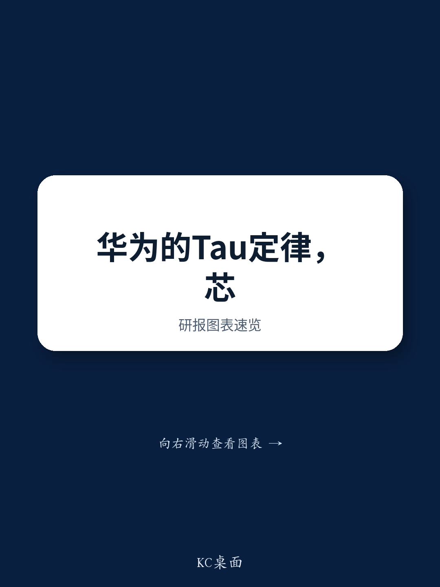
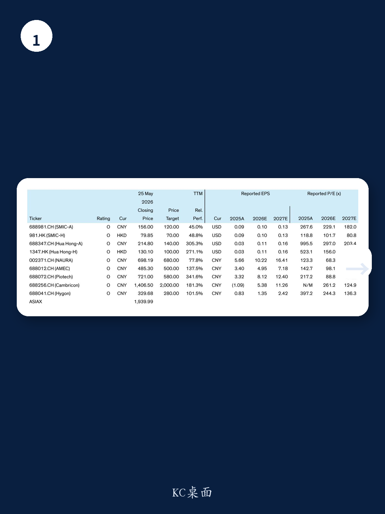
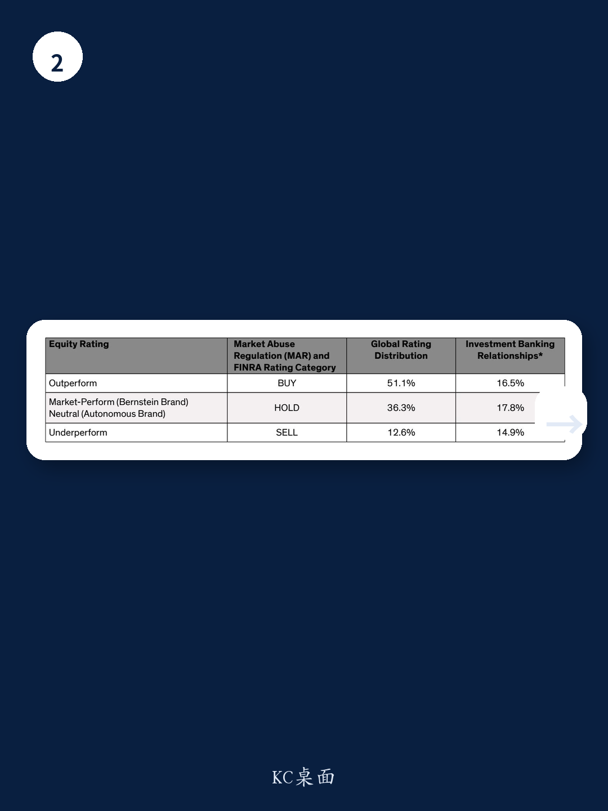

# 华为Tau定律的真正价值不在于技术突破，而在于为中国半导体产业提供了一条可预测的路线图

2025年5月25日，华为在国际电路与系统研讨会（ISCAS）上发布了Tau（τ）缩放定律。次日，A股半导体板块集体上涨，科创50指数涨幅达到5.9%。市场将其解读为“又一个DeepSeek时刻”。某外资投行研报随即覆盖了这一事件，并给出了明确的行业判断。

这份报告的核心主张是：Tau定律的意义远超单项技术突破。它最关键的贡献，是为受制于EUV光刻机出口管制的中国半导体产业，提供了一条可预测、可执行的十年演进路线图。这与DeepSeek在算法层面的创新有本质不同——DeepSeek证明的是“算力效率可以大幅提升”，而Tau定律要回答的是“在没有EUV的条件下，芯片性能能否持续提升”。

答案是：能，但条件苛刻。而正是这些条件本身，才是投资者真正需要关注的结构性变量。

## 1. Tau定律的核心不是“缩小晶体管”，而是“压缩信号延迟”

传统摩尔定律的核心逻辑是几何缩放——把晶体管做得更小，从而在单位面积内塞入更多器件，同时降低功耗、提升速度。但这一路径在先进制程节点已经明显放缓：设计成本超过10亿美元，每晶体管的成本不再下降。

华为提出的Tau定律换了一个底层度量单位。它不再以“晶体管面积”作为进步标尺，而是以“时间常数τ”——信号从一处传输到另一处的延迟——作为统一优化目标。这个τ横跨12个数量级，从单个晶体管的开关延迟，到数据中心工作负载的端到端响应时间。

这意味着，华为试图在整个计算堆栈的四个层级——晶体管、电路、芯片、系统——同时压缩延迟。其中最具突破性的创新是“LogicFolding”技术。从表面看，它类似于台积电的SoIC（系统集成芯片），都是通过3D堆叠将两颗芯片上下贴合。但华为实现了亚2微米的混合键合间距，这使其能够做到“单元对单元”的堆叠，而非传统的“芯片对芯片”堆叠。前者允许在逻辑电路内部实现垂直互联，大幅缩短相邻晶体管之间的信号路径，从而同时提升密度和频率。

报告数据显示，通过LogicFolding，华为在2026年有望将晶体管密度从2025年的155 MTr/mm²提升至238 MTr/mm²，相当于台积电N3节点的密度水平。同时，P-Core频率从2.75GHz提升至3.1GHz。到2031年，其密度目标为400+ MTr/mm²，接近台积电A14节点的密度。

这里需要强调的是，这些密度对比并非“苹果对苹果”——华为是通过多芯片堆叠实现的等效密度，而非单芯片光刻精度的提升。但问题的关键恰恰在此：对于AI芯片的最终用户而言，他们关心的是集群级别的算力输出，而非单颗芯片的制程节点。只要堆叠技术能够持续提升系统级性能，EUV的缺失就不是不可逾越的障碍。

## 2. 这个路线图有三个尚未完全解决的约束条件

Tau定律的价值在于它给出了一个可预测的演进路径。但报告也明确指出，这个路径并非没有天花板。三个约束条件值得投资者持续跟踪。

第一个约束是先进封装的技术壁垒。LogicFolding依赖的3DIC先进封装，台积电等全球领先者仍然拥有显著的技术和生态系统优势。华为能否在键合精度、良率、散热管理等方面持续追赶，目前仍需要更多量产数据验证。报告中提到的“sub-2um bonding pitch”和“overlay accuracy under 0.5μm”都是极为苛刻的工艺指标，大规模量产的良率控制是核心挑战。

第二个约束是功耗密度和散热。堆叠多颗芯片虽然提升了晶体管密度，但也显著增加了单位面积的热功耗。报告直言“thermal constraints will be a key issue”，需要电源传输技术的配套创新。目前，这一领域的解决方案尚未完全公开，其可行性和成本效益仍需验证。

第三个约束是成本和良率。先进封装本身并不便宜，而华为的路线图要求同时实现高密度堆叠和接近100%的良率（通过智能冗余设计）。这一目标能否在经济上实现规模化的商业闭环，目前仍缺乏足够的数据支撑。

这三个约束条件的突破进度，将直接决定Tau定律从“技术演示”走向“产业落地”的速度。这也是报告尚未完全回答的关键问题。

## 3. 真正的产业影响：中国半导体投资逻辑从“追赶”升级为“自主路线图”

如果说DeepSeek的创新让中国AI产业有了信心投资本土算力堆栈，那么Tau定律的意义在于：它让中国半导体产业有了信心投资本土芯片制造堆栈。

报告对此的判断非常清晰：Tau定律将“进一步强化我们的本土化投资主题”。这不是一个模糊的利好，而是直接指向了具体的受益环节。

报告明确看好的标的分属三个层次。首先是制造端，中芯国际（SMIC）是华为实现路线图的战略合作伙伴和关键执行者。如果华为希望在不使用EUV的条件下，通过多芯片集成达到台积电A14等效逻辑密度，那么中芯国际最先进的DUV多重图形化工艺将面临持续的高需求。

其次是设备端，北方华创（NAURA）在先进逻辑领域的敞口高于中微公司（AMEC），因此受益更大。而拓荆科技（Piotech）因为正在开发先进封装的键合工具，被市场视为核心受益者。

第三是AI芯片设计端，寒武纪（Cambricon）和海光信息（Hygon）将受益于一个更清晰的性能演进路径，但也将面临来自华为更直接的竞争。报告认为，这一环节的受益幅度将小于制造和设备环节。

值得注意的是，报告给出的估值水平并不便宜。中芯国际A股2026年预期市盈率为229倍，北方华创为68倍，拓荆科技为89倍。这些估值隐含了极高的增长预期。Tau定律能否兑现，将直接决定这些估值是否合理。

## 4. 投资者需要建立的观察框架：从“技术是否可行”转向“执行速度是否够快”

Tau定律的技术方向已经明确，但市场真正需要跟踪的，不再是“这条路能不能走通”，而是“华为和它的供应链能以多快的速度走完这条路”。

报告提供了一个清晰的观察框架，投资者可以从三个维度持续验证。

第一，键合精度的量产稳定性。sub-2um的键合间距在实验室可行，但大规模量产时的良率、修复率、成本曲线才是关键。拓荆科技的键合设备能否达到量产要求，将是重要的先行指标。

第二，功耗密度问题的解决方案。如果华为不能同步推出有效的电源传输和散热技术，堆叠层数的增加将面临物理瓶颈。这一领域的专利和产品发布值得持续关注。

第三，系统级性能的兑现节奏。报告提到华为计划在2030年实现超级计算节点（SuperPoD）的125倍算力提升，相当于每年3.3倍的复合增长。这一目标能否按季度或年度里程碑兑现，将是最直接的验证信号。

这三个维度中，任何一个出现明显滞后，都可能意味着Tau定律的产业落地速度低于预期。反之，如果华为能持续按路线图交付，中国半导体产业的本土化投资逻辑将得到显著强化。

## 5. 报告尚未完全回答的问题：可复制性与竞争格局

Tau定律的技术细节已经相当丰富，但报告也坦诚地指出一个关键问题：华为的这些创新，理论上全球竞争对手都可以复制。台积电、英特尔、三星在3DIC领域同样在推进类似的技术路线。区别在于，华为没有EUV，因此必须通过堆叠来弥补单芯片性能的差距；而台积电等既有EUV又有先进封装，其综合优势仍然明显。

这意味着，Tau定律虽然为中国半导体提供了清晰的演进路径，但尚不足以让中国在短期内缩小与全球领先者的整体差距。更有可能的结局是：中国在特定应用场景（如AI推理、边缘计算、手机SoC）通过堆叠技术实现“足够好”的性能，但在最顶尖的通用计算芯片领域，与台积电的差距仍将持续存在。

这个判断对投资组合的构建至关重要：哪些环节是“自主可控的刚需”，哪些环节是“全球竞争的配角”，两者适用的估值框架完全不同。

Tau定律的完整技术论文、华为的AI芯片路线图、以及报告中未完全展开的供应链受益细节，都值得深入拆解。这些内容已经超出了本文能够覆盖的范围。

欢迎来星球微信群里继续讨论完整报告，我们会逐一拆解其中的技术细节、竞争格局与投资逻辑。
