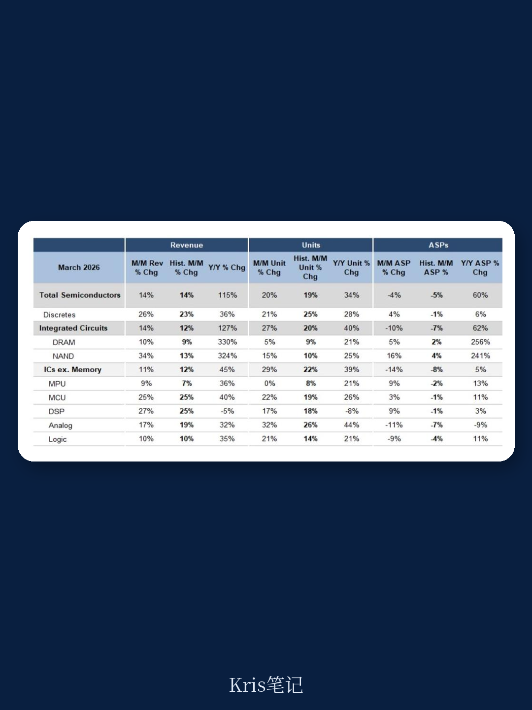
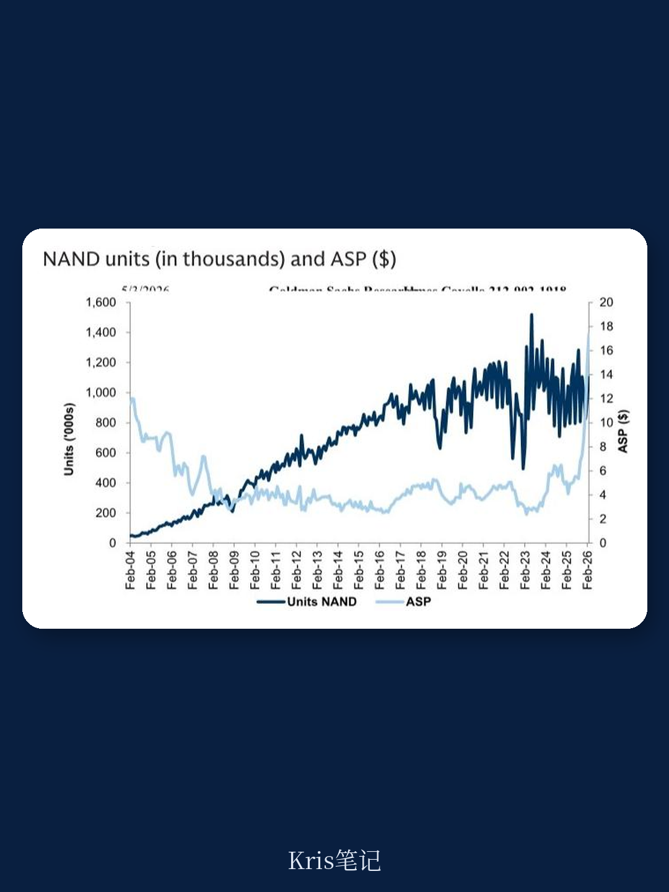

# 半导体复苏正在“分化”：DRAM放缓，但这两个板块正在加速追赶

3月的半导体出货数据，看起来是一份不错的成绩单。根据半导体行业协会（SIA）最新数据，整体半导体出货量环比增长20%，接近历史季节性水平。但这份“不错”的表象之下，结构性的分化正在加剧。

某外资投行最新研报指出，3月出货量的改善是“广泛但分化的”——部分板块正在快速追赶长期需求趋势，而另一些板块的环比动能却在减弱。对于关注半导体周期的投资者而言，这个信号值得认真对待。

## 一、这份研报真正值得看什么

市场对半导体周期的讨论，过去几个月一直围绕着“库存何时见底”和“需求何时正常化”展开。但这份研报的价值在于，它提供了一个更精细的观察框架：不是看总量，而是看每个细分板块距离长期需求趋势还有多远。

研报的核心问题很明确：哪些板块的复苏是真实的、可持续的？哪些板块的环比改善只是暂时的季节性波动？答案隐藏在三个关键指标中——出货量相对于长期趋势的偏离程度、环比增速是否超过历史均值，以及ASP（平均销售价格）的变化方向。

截至3月，集成电路（不含存储）出货量的三个月移动平均线，已从2月低于长期趋势8%收窄至低于趋势4%。这意味着，整个行业正在以“谨慎但持续”的节奏向正常化迈进。但真正值得关注的，是各细分板块之间的步调差异。

## 二、关键变化不在表面

**模拟芯片正在快速追赶。** 3月模拟芯片出货量环比增长32%，显著高于历史同期均值。更重要的是，其出货量距离长期趋势的差距已从1月的低于趋势6.5%收窄至仅低于2.0%。这是研报中最为积极的信号之一。模拟芯片通常被视为半导体需求的基础性指标，它的改善往往意味着工业、汽车等终端市场的真实需求正在回暖。

**MCU（微控制器）仍在深水区。** 尽管3月MCU出货量环比增长22%，略高于历史季节性水平，但其出货量仍低于长期趋势26%。这是所有细分板块中距离趋势最远的一个。研报对此的解读是：MCU的库存消化尚未完成，改善速度相对缓慢。这与模拟芯片形成了鲜明对比。

**DRAM的环比动能正在减弱。** 这是研报中一个容易被忽视但关键的变化。3月DRAM出货量环比仅增长5%，低于历史季节性水平的9%。在存储芯片价格仍然高企的背景下，出货量的环比放缓可能暗示下游客户正在重新评估库存策略。NAND则表现强劲，出货量环比增长15%，远超历史均值。

这三个板块的不同表现，指向同一个结论：半导体周期的复苏不是线性的，也不是同步的。对于投资者而言，识别出哪些板块的改善具有结构性支撑，哪些只是暂时性的反弹，比关注总量数据更重要。

## 三、还有哪些问题值得继续追踪

这份研报的另一个价值在于，它提出了几个值得持续跟踪的问题，但并未在报告中完全展开。

第一，出货量改善的可持续性。3月的环比改善部分得益于季节性因素，但研报判断“出货量将进一步接近趋势”。这个判断成立的前提是什么？哪些风险因素可能导致改善中断？

第二，ASP下降的隐含信号。3月模拟芯片和逻辑芯片的ASP分别环比下降11%和9%，均低于历史季节性均值。ASP的走软是否意味着竞争加剧，还是正常的去库存过程中的价格调整？

第三，研报在结论部分明确提到了对Microchip、NXP、Analog Devices的偏好，理由是“出货量最低于趋势”和“差异化的供应链管理”。这三家公司的基本面差异在哪里？为什么“出货量低于趋势”反而成为看好的理由？

这些问题的详细分析，以及研报中完整的趋势图、环比数据对比和个股逻辑推导，都在我们的完整解读中。

## 加入社群阅读全文

以上是对某外资投行最新半导体研报的初步解读。完整的报告解读包括：各细分板块的长期趋势偏离度动态图表、ASP与出货量的交叉分析、以及三家重点公司的逻辑对比。加入社群，领取完整研报解读与原始图表。

*本文仅作学习交流，不构成任何投资建议。*
