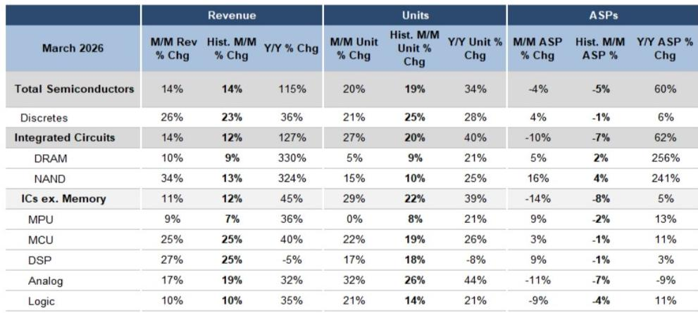
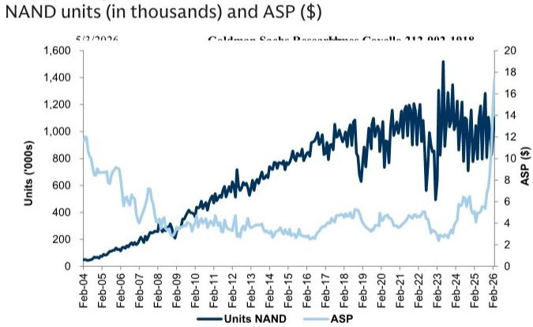

# The Semiconductor Recovery Is Real, But It Is Not Uniform: Why the Cycle Still Favors Stock Pickers Over Index Players

March semiconductor data from the Semiconductor Industry Association confirms what many investors have been hoping for: the industry is finally shipping closer to end demand. Total semiconductor units rose 20% month over month, broadly in line with historical seasonality, but the composition of that recovery tells a far more strategic story than the headline number suggests. Integrated circuits excluding memory surged 29% month over month, well above the typical 22% seasonal pattern. Analog units jumped 32%, also above the historical median of 27%. Even microcontrollers, long the laggard of the cycle, posted a 22% increase that beat the 20% median. The aggregate picture is one of measured normalization, but beneath the surface, the data reveals a recovery that is both broader and more fragile than many market participants assume.

The critical insight is not that semiconductor shipments are improving. It is that the improvement is occurring at different speeds across sub-segments, and those divergences carry distinct implications for which companies will benefit and which will remain under pressure. The March data shows that the gap between the strongest and weakest sub-segments is widening, not narrowing. Analog and logic are approaching their long-term demand trends, while microcontrollers remain 26% below trend and DRAM unit growth is actually decelerating. This is not a rising tide that lifts all boats. It is a selective current that rewards precise positioning.

The strategic question for investors is not whether the semiconductor cycle is turning. It is whether the cycle is turning in a way that aligns with your portfolio. The answer, based on the March data, is that it depends entirely on which part of the semiconductor value chain you are exposed to. The recovery is real, but it is not uniform. And that non-uniformity is precisely what creates opportunity for those who can read the sub-segment signals.

## The Broad-Based Recovery in Non-Memory ICs Masks a Deeper Structural Shift in End-Market Composition

The headline strength in integrated circuits excluding memory is undeniable. Units were 29% above the typical March seasonal pattern, and the three-month moving average now sits only 4% below long-term demand trend, a marked improvement from the 8% deficit in February. This is consistent with what company management teams have been telegraphing: inventories are normalizing, and shipments are gradually converging with actual consumption. But the speed of this convergence varies dramatically by end market.

Analog, for instance, has been the standout performer. Units are now only 2% below trend, compared to 6.5% below trend in January. This rapid improvement reflects the fact that analog content is deeply embedded in industrial, automotive, and communications infrastructure, all of which have shown resilience or early recovery signals. The 32% month-over-month unit growth in analog is not merely a seasonal bounce. It is a sign that the industrial inventory correction, which was one of the deepest in recent cycles, is closer to completion than many analysts expected.

Logic, meanwhile, posted 21% month-over-month unit growth, above the 14% historical median. This is a more complex signal. Logic includes a wide range of products, from standard logic to application-specific integrated circuits used in data centers and networking. The above-seasonal performance suggests that enterprise and cloud spending is holding up, but it also raises the question of whether some of this demand is pull-forward or restocking rather than genuine end-market strength. The distinction matters because logic tends to be more cyclical than analog, and a recovery driven by inventory restocking rather than final demand is less durable.

The most instructive sub-segment, however, is microcontrollers. Despite the 22% month-over-month unit growth, MCU units remain 26% below long-term trend. This is the deepest deficit in the entire non-memory IC universe. The reason is structural, not cyclical. Microcontrollers are the brain of countless embedded systems, from automotive engine control units to home appliances to industrial sensors. The breadth of their application means they are exposed to the full weight of the industrial and automotive inventory correction. The fact that MCU units are still 26% below trend, even after a strong March, suggests that the inventory digestion in these end markets is far from over. This is not a temporary lag. It is a signal that the industrial recovery, which many investors are banking on for the second half of the year, may be slower and more uneven than the analog data implies.

## DRAM Deceleration Is the Most Important Warning Signal in the March Data, and It Points to a Peak in Memory Pricing

While the non-memory IC recovery is broad and encouraging, the memory segment tells a different story. DRAM units rose only 5% month over month, below the typical 9% seasonal pattern. This is a notable deceleration from the explosive growth seen in previous months. NAND, by contrast, rose 15% month over month, above the 10% seasonal median. But the divergence between the two is less important than the common thread: both are experiencing a shift from volume-driven growth to price-driven growth.

DRAM revenue rose 10% month over month, roughly in line with seasonality, but that revenue growth was entirely driven by a 5% increase in average selling prices. Unit growth was below seasonal. This is a classic late-cycle signal. When memory demand is strong and supply is constrained, both units and prices rise. When the cycle matures, unit growth slows first, and prices eventually follow. The March data suggests that DRAM is entering that mature phase. The 5% ASP increase is still positive, but it is decelerating from the triple-digit year-over-year ASP growth rates seen in 2024 and early 2025. The 256% year-over-year ASP increase is a statistical artifact of the trough comparison from a year ago. The sequential trend is what matters, and it is softening.

NAND, on the other hand, still shows strong unit growth of 15% month over month, well above the 10% seasonal median. But NAND ASPs rose 16% month over month, also above seasonal. This suggests that NAND is still in a mid-cycle phase where both volumes and pricing are expanding. The divergence between DRAM and NAND is consistent with the different supply-demand dynamics in each market. NAND supply has been more disciplined, and demand from data center SSDs and high-capacity storage remains robust. DRAM, by contrast, faces a more uncertain demand picture from PCs and mobile, and supply additions from new fab capacity are starting to come online.

The strategic implication is clear. Memory investors who are positioned for continued upside in DRAM may be underestimating the risk of a peak in pricing. The March data does not signal an imminent crash, but it does suggest that the easy money in DRAM has been made. The next leg of the memory cycle will be driven by NAND, and only for those who can tolerate the higher volatility that comes with that segment.

## The Recovery Is Measured, Not Explosive, and That Has Direct Implications for Which Companies Will Outperform

The March data is consistent with a recovery that is measured, gradual, and uneven. This is not the V-shaped rebound that some bulls were hoping for. The three-month moving average for IC units excluding memory is still 4% below trend. That is an improvement, but it is not a breakout. The pace of improvement has been steady but slow, and there is no evidence in the data of a sudden acceleration in end-market demand.

This measured recovery has direct implications for stock selection. Companies that are shipping furthest below trend and have differentiated supply chain management are best positioned to benefit from the normalization. The report identifies Microchip, NXP, and Analog Devices as preferred names, precisely because they are exposed to the sub-segments with the deepest deficits and the most room for improvement. Microchip, for instance, is heavily exposed to microcontrollers, which are 26% below trend. If MCU units simply return to trend over the next six to twelve months, that represents significant volume upside. Analog Devices, by contrast, is already close to trend in analog, but its exposure to industrial and automotive end markets gives it a different risk-reward profile.

The key variable is supply chain management. In a measured recovery, companies that can manage their inventory and lead times effectively will capture more of the upside than those that are constrained by supply chain bottlenecks or that have been too aggressive in cutting production. The report emphasizes differentiated supply chain management as a selection criterion, and the March data supports this. The sub-segments that are recovering fastest, such as analog, are those where supply chains have been relatively stable. The sub-segments that are lagging, such as microcontrollers, are those where supply chains were most disrupted during the pandemic and have been slowest to normalize.

## What the Report Does Not Fully Answer: The Sustainability of the Recovery and the Risk of a Second-Half Slowdown

The March data provides a snapshot of improvement, but it does not answer the most important question for investors: is this recovery sustainable, or is it a temporary restocking event followed by a second-half slowdown? The report shows that shipments are approaching trend, but it does not distinguish between shipments that are consumed by end users and shipments that are absorbed into inventory. The risk is that some of the above-seasonal unit growth in March represents restocking by distributors and OEMs who are protecting themselves against supply chain disruptions, rather than genuine end-market demand.

The analog sub-segment is particularly vulnerable to this interpretation. Analog units were 32% above the typical March seasonal pattern, which is a massive deviation. But analog end markets, such as industrial and automotive, are not growing at 32% month over month. It is more likely that some of this growth is restocking. If end-market demand does not accelerate in the second quarter, the above-seasonal shipments in March could be followed by below-seasonal shipments in April and May as inventories are rebuilt. The report does not provide the data to distinguish between these two scenarios.

Another unresolved question is the trajectory of microcontrollers. The 26% deficit relative to trend is the largest in the non-memory IC universe, and the improvement from January to March was only 1.5 percentage points. At this rate, it would take more than a year for MCU units to return to trend, assuming no acceleration in end-market demand. But the report does not address the possibility that the MCU deficit is structural rather than cyclical. Microcontrollers are being replaced in some applications by higher-integration devices such as application processors and system-on-chip solutions. If the deficit reflects a permanent shift in demand rather than a temporary inventory correction, then the recovery in MCU units may never be as strong as the historical trend suggests.

## A Decision Framework for Investors: How to Position Based on the March Data

The March data provides a clear decision framework for investors, but it requires active interpretation. The framework has three dimensions: sub-segment exposure, trend proximity, and supply chain quality.

First, sub-segment exposure determines the baseline opportunity. Companies exposed to analog and logic are already close to trend, which means their upside from volume normalization is limited. Their earnings growth will depend more on pricing and cost control than on volume expansion. Companies exposed to microcontrollers and discrete semiconductors, which remain far below trend, have more volume upside but also more execution risk. The recovery in these sub-segments is not guaranteed, and the timing is uncertain.

Second, trend proximity determines the risk-reward profile. Companies that are already near trend, such as analog-focused firms, offer lower upside but also lower risk. Companies that are far below trend, such as MCU-focused firms, offer higher upside but also higher risk if the recovery stalls. Investors need to decide which risk-reward profile aligns with their portfolio objectives.

Third, supply chain quality determines which companies within each sub-segment will capture the most value. In a measured recovery, companies with strong supplier relationships, diversified sourcing, and efficient inventory management will outperform those that are constrained by supply chain bottlenecks. This is not a factor that can be read from the SIA data alone, but it is the most important differentiator for stock selection.

The March data suggests that the optimal positioning is a barbell approach: overweight companies in sub-segments that are far below trend but have strong supply chain management, such as Microchip and NXP, and underweight companies in sub-segments that are near trend but face pricing pressure, such as certain memory names. The middle of the market, where companies are neither far below trend nor near trend, offers the least compelling risk-reward.

## The Data Raises More Questions Than It Answers, and That Is Precisely Why You Need the Full Report

The March SIA data is a valuable signal, but it is not a complete picture. It tells us where the semiconductor industry is today, but it does not tell us where it is going. The key questions that remain unanswered include the sustainability of the analog recovery, the trajectory of microcontroller demand, and the risk of a peak in DRAM pricing. These questions cannot be answered with a single month of data. They require a deeper analysis of end-market demand, inventory levels, and supply chain dynamics.

The full report from which this data is drawn provides the charts, historical context, and sub-segment breakdowns that allow investors to make these judgments. It includes the three-month moving average trends that smooth out monthly volatility, the long-term demand trend lines that show how far each sub-segment is from equilibrium, and the month-over-month comparisons that reveal the pace of change. Without this context, the March data is just a number. With it, it becomes a strategic tool.

Join the community to read the full report and review the original charts. The data is public, but the interpretation is not. Those who take the time to understand the sub-segment dynamics will be better positioned to navigate the next phase of the semiconductor cycle.

*This article is for learning and discussion only and does not constitute investment advice.*
