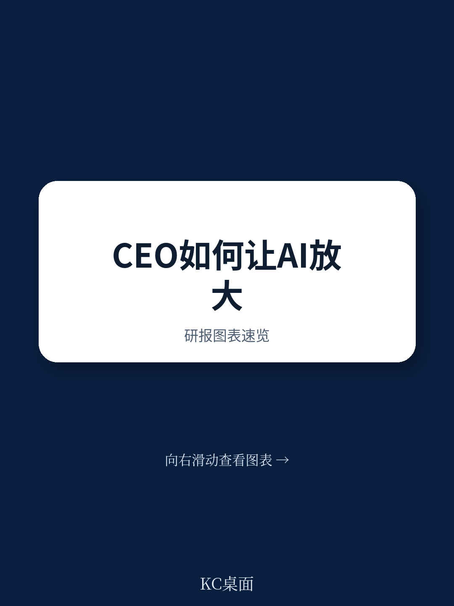

# 波士顿咨询：CEO的AI使用方式，正在成为公司竞争力的分水岭

大部分CEO已经意识到AI的重要性，但真正从中获得价值的比例低得惊人。波士顿咨询（BCG）在2026年6月发布的一份面向CEO群体的研究报告，给出了一个看似反直觉的核心判断：**决定一家公司AI转型成败的关键，不是战略文件写了什么，而是CEO本人每天如何使用AI。** 这份报告基于对15位高知名度CEO的公开案例研究，以及一项覆盖1488名美国全职工作者的调查，揭示了CEO个人AI使用习惯与公司整体AI价值创造之间的强关联——但结论远比“多用AI”复杂得多。在72%的CEO已直接负责公司AI决策的今天，只有15%的人正在从AI中创造有意义的商业价值。这中间的巨大落差，恰恰是这份报告最值得深挖的地方。

报告抛出的核心洞察是：**当AI被设计用于放大CEO本人最稀缺的两种资源——时间和判断力时，其价值回报远高于仅将其部署在组织中下层提升效率。** 这意味着，CEO对AI的认知与使用方式，正在从“个人效率工具”升级为“最高决策质量的放大器”，而这将直接决定公司在不确定性中的战略敏捷度。

## 1. CEO亲自使用AI的信号价值，远超任何战略文件

BCG的研究发现，当CEO本人公开、高频地使用AI时，这本身就是一个强大的组织信号。它比任何演讲或战略文件都更有效：它激励管理层和员工更大胆地尝试AI，明确告诉整个高管团队AI是每个人的职责，而非某个部门的项目。报告提供的数据支撑了这一判断：在识别出的“先行者”CEO群体中，一个显著特征是**他们每周至少花8小时构建自身的AI能力**——不是监督别人用AI，而是自己动手。

但BCG特别强调，时间本身不是价值创造的原因。真正重要的是CEO如何使用AI。在分析了15位高知名度CEO的公开案例后，报告提炼出六种常见行为：快速掌握新领域知识、预判关键对话、综合复杂信息、压力测试自身想法、更清晰地表达观点，以及评估自己的时间分配是否与战略优先级匹配。

> **KC评论：** 这里的核心不是CEO应该“加班学习AI”，而是AI正在改变CEO这个角色的工作方式。传统CEO的决策路径是“阅读大量材料—开会对齐信息—做出判断”，而先行者CEO的路径正在变为“用AI快速消化信息—带着初步判断进入会议—聚焦于验证和挑战”。这种转变意味着，CEO的决策质量不再仅仅依赖其个人经验与信息获取能力，还取决于其与AI协作的熟练度。完整报告中对这六种行为的详细案例拆解，以及先行者与落后者的具体行为差异对比，值得每一位企业领导者仔细研读。

## 2. 定制化AI系统正在从“辅助工具”升级为“战略决策伙伴”

目前大多数CEO使用AI的方式仍停留在早期阶段——借助现成的通用工具完成信息摘要、邮件处理等任务。但BCG明确指出，前沿趋势正果断转向为C-suite定制化的智能体系统。报告用一个生动的比喻形容当前状态：更像是“胶带拼接”而非企业级平台。

报告设想了一个更具吸引力的场景：当AI被定制化地嵌入CEO的决策流程时，它可以在会议开始前就完成信息整合、矛盾识别、权衡分析、假设检验和风险预警。目标不是自动化判断，而是让CEO“进入会议室时不是准备被汇报，而是准备好做决策”。更进一步，定制化智能体系统可以学习CEO的决策历史、心智模型和战略背景，成为更高级的“辩论伙伴”，甚至通过人物模拟器帮助CEO预判与特定利益相关者的关键对话。

BCG引用了EMESA地区一家工业公司的案例作为早期实践：该公司正在构建一套定制化智能体系统，将提供持续在线的绩效报告、风险分析、竞争情报等洞察，使CEO和高级领导团队能够实时掌握组织脉搏，提前预判并应对干扰。

> **KC评论：** 这是报告中一个极易被低估的洞察。大多数企业讨论AI应用时，焦点仍在“如何用AI降本增效”。BCG在这里提示了一个更高级的维度：**当AI被设计为服务于CEO的判断力时，它实际上是在重塑公司的“决策基础设施”。** 传统决策流程中，信息层层过滤、偏见层层叠加，最终到达CEO时往往已经失真。定制化AI系统如果设计得当，可能成为打破这种信息衰减和偏见固化的关键工具。但报告也坦诚，这类系统仍处于早期，其效果和风险都尚未被充分验证。完整报告中对这家工业公司案例的技术架构与实施效果的详细描述，是理解这一趋势的关键补充。

## 3. AI误导CEO的四种方式：比想象中更隐蔽，后果更严重

BCG没有回避风险。报告以相当严肃的篇幅讨论了AI可能误导CEO的四种方式，并特别指出，当处于最高位置的CEO过度信任有缺陷的AI输出时，其影响将波及战略、资本配置、人力计划、客户决策乃至转型节奏。

**第一，混淆“流畅表达”与“真实专业”。** AI能让陌生领域瞬间变得看似容易理解，但CEO并未真正掌握底层复杂性。一个漂亮的答案可能隐藏着薄弱的假设、缺失的背景或低置信度的结论。BCG此前的一项生成式AI研究已经揭示，用户倾向于在AI不太擅长的领域过度信任它。

**第二，混淆“速度”与“更好的判断”。** AI能压缩从提问到回答的时间，但CEO仍然需要时间来吸收、挑战和决策。否则，同样的工具在帮助CEO摆脱信息过载的同时，也可能让糟糕的合成结果显得权威。危险不在于AI总能给出答案，而在于它总是有答案——而人类不应该盲目信任一个“万事通”。

**第三，让AI缩小对话范围。** 相同的工具、相同的数据、相同的提示词，会强化相同的假设。结果是更快的、更干净的、更难发现的群体思维。BCG的研究发现，生成式AI相对统一的输出，可以使群体的思维多样性降低41%。这使得人类异议变得至关重要——CEO和高管团队必须始终挑战AI辅助给出的答案，追问“遗漏了什么”。

**第四，制造认知过载。** AI帮助人们更快地完成更多工作，但并没有扩展人类的认知容量。人类仍然需要审查、判断、纠正、协调并决定信任什么。通过生成更多信息、视角和综合洞察，AI反而可能增加认知负荷，侵蚀决策质量。BCG的调查显示，14%的AI用户报告了“AI大脑疲劳”——因过度使用或监督AI导致的精神疲劳，在营销领域这一比例高达26%。

> **KC评论：** 这四种风险中，“思维多样性降低41%”这一数据最值得警惕。很多企业引入AI的初衷是提高决策质量，但如果所有人都在使用相同的AI工具、输入相同的提示词、得到相似的答案，最终可能导致整个组织的“认知趋同”。CEO需要主动设计“异议机制”——比如让另一个AI模型批判第一个答案，或指定一位高管专门扮演挑战者角色。完整报告中关于“AI大脑疲劳”在不同职业群体的分布数据，以及BCG对如何设计异议机制的具体建议，是理解风险边界的重要参考。

## 4. 报告尚未完全回答的关键问题：AI是否真的让CEO变得更好了？

BCG在报告末尾提出了一个尖锐的问题：如何衡量AI是否让CEO变得更好了？对于呼叫中心，绩效可以快速量化。但对于CEO，一个决策的价值可能只有在时间推移中才能显现。报告承认，建立这种衡量纪律并不容易。

这恰恰是这份报告最诚实的部分，也是它留下的最大未解问题。目前，BCG的建议更多集中在“过程指标”上——CEO是否每周花8小时使用AI、是否挑战AI输出、是否设计异议机制。但缺少一个关键的“结果指标”：**AI辅助的决策，其长期成功率是否显著高于传统方式？**

此外，报告提到的定制化智能体系统，其数据隐私、安全性和“黑箱”风险也尚未充分展开。当AI系统越来越了解CEO的决策偏好和心智模式时，它可能变得极其擅长“迎合”而非“挑战”CEO，这恰恰是报告警告的“谄媚AI”的高级形态。CEO如何确保定制化系统不会演变为一个精致的“回音壁”？

## 5. 一份CEO可以立即使用的观察框架

结合BCG报告的核心逻辑，我们可以提炼出一个实用的四维观察框架，帮助CEO审视自身与AI的关系是否走在正确的轨道上：

**第一维：频率 vs. 意图。** 是否每天使用AI并不足够，关键在于使用的意图是否明确指向“成为更好的领导者”——是否用于挑战假设、预判风险、评估时间分配的战略匹配度，而非仅仅用于提高回复邮件的速度。

**第二维：工具 vs. 设计。** 通用工具可以节省时间，但定制化工具才能改善判断力。CEO需要区分自己目前使用的是“胶带拼接”还是“企业级平台”，并主动推动前者向后者的演进。

**第三维：速度 vs. 质量。** 是否在决策前留出足够的“吸收与挑战时间”？AI压缩的信息是否经过了人类判断的二次检验？CEO需要警惕“快速决策”背后的质量陷阱。

**第四维：共识 vs. 异议。** 组织内部是否存在对抗AI趋同性的机制？是否有专门的角色或流程来追问“AI遗漏了什么”、“我们是否太容易相信这个答案”？

这份报告的价值不在于给出标准答案，而在于提出了一个CEO必须严肃面对的自我审视框架。在AI快速渗透企业决策的今天，CEO与AI的关系，正在成为定义企业竞争力的新分水岭。但正如BCG在结尾所言：AI不能保证伟大的领导力，但它可以成为积极的力量放大器——如果CEO以纪律、好奇心和谦逊来使用它的话。

关于定制化AI系统如何避免沦为CEO的“信息回音壁”，以及BCG在调查中发现的“先行者CEO”与“落后者CEO”在决策质量上的具体差异数据，完整报告提供了更详尽的案例拆解与数据支撑。我们已在社群内发布了这份报告的完整中文摘要与关键图表解读，每天还会由AI agent结合人工review，生成包含多家国际投行最新研报摘要与数据图表的每日简报，帮助决策者快速把握市场动态与前沿趋势。

Personal reading notes and learning share only. Not investment advice.

