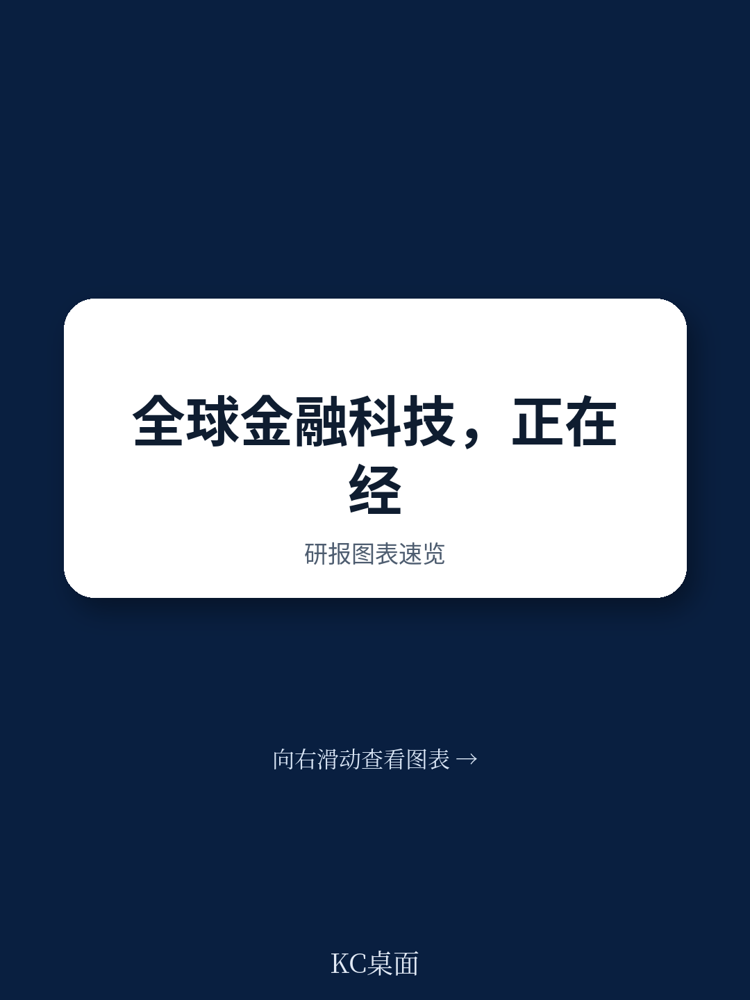
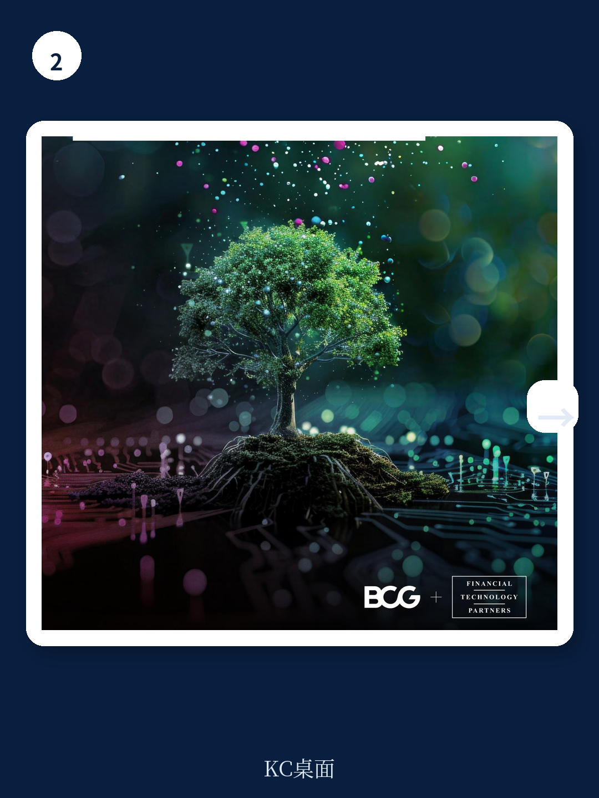

# 波士顿咨询：Fintech已过“幸存者考验”，下一轮赢家靠的是“规模议价权”

全球金融科技行业在经历了2023至2024年的估值修正与资本寒冬之后，于2025年交出了一份令市场重新审视其价值的答卷。波士顿咨询与FT Partners联合发布的《2026全球金融科技报告》明确指出，这个行业已经完成了从“恢复”到“复兴”的切换。但这份报告最值得关注的判断，并非简单的营收数字回暖，而是一个更深层的结构性信号：行业增长的动力源正在发生根本性迁移。过去，增长靠的是“数字原生”对“传统低效”的替代红利；现在，增长的门槛已经抬高到“能否将规模转化为系统性的议价权”。这不是一场所有参与者都能共享的复苏。

这份报告的核心论据是，2025年全球金融科技总收入突破5000亿美元，同比增长22%，增速是传统金融机构的4倍以上。然而，在这些光鲜的平均数之下，隐藏着一个正在加速分化的行业格局。头部玩家的盈利能力正在显著改善，而中尾部公司面临的资本筛选却比以往任何时候都更加严酷。这意味着，金融科技行业正从一个“由资本驱动的增长故事”，转向一个“由运营效率和规模壁垒定义的成熟市场”。对于产业决策者和高净值投资者而言，理解这种分化的内在逻辑，远比关注行业总规模的增长数字更具战略价值。

## 1. 资本不再“普惠”，而是向“确定性”集中，这重塑了竞争格局

报告中最具说服力的证据之一，是资本流向的结构性变化。2025年全球金融科技股权融资总额达到580亿美元，同比增长53%，看似市场热情回归。但深入观察融资轮次分布，会发现一个截然不同的故事：从2023年到2025年，E轮及以后的晚期融资增长了超过210%，而种子轮和天使轮融资却收缩了约10%。A轮和B轮的增长也仅为15%和30%，远不及晚期阶段的爆发力。

这意味着什么？资本正在用脚投票，明确地奖励那些已经证明了商业模式可行性、拥有清晰盈利路径和规模化能力的“确定性”玩家。这不再是2021年那种“只要故事动人就能拿到钱”的投机性繁荣。投资者变得更加挑剔，他们要求看到实实在在的运营指标。报告显示，全球最大的85家上市金融科技公司，平均EBITDA利润率在2025年提升了4个百分点至20%，其中74%的公司已经实现盈利，高于2024年的68%。这些数字共同指向一个结论：金融科技行业的“幸存者考验”已经结束，现在进入的是“强者恒强”的循环。

> **KC评论：** 这份报告用数据讲了一个很直白的道理：资本现在只愿意给“已经赢过的人”加注。对于创业者或投资者来说，如果你的公司还在A轮或B轮挣扎，融资环境比两年前更差；但如果你已经跑通了模型并接近盈利，资本市场的大门反而敞得更开。这要求我们在评估一家金融科技公司时，不能再只看它的用户增长故事，而必须审视其单位经济模型是否经得起“盈利性增长”的拷问。完整报告中对不同轮次融资的详细拆解，以及按垂直领域和地区划分的资金流向图，是判断哪些细分赛道还有“窗口期”的关键素材。

## 2. 支付仍是“现金牛”，但真正的增量来自两个被低估的垂直领域

尽管支付依然是金融科技领域营收占比最大的垂直赛道，但报告揭示的增长引擎已经转移。2025年，交易与投资（Trading and Investments）以及存款（Deposits）两大板块，分别以38%和30%的同比增速领跑全行业。这组数据值得深思。

交易与投资板块的强劲增长，与数字资产市场的复苏密切相关。报告提到，数字资产总市值已超过3万亿美元，其中加密货币约3万亿，稳定币约3000亿，代币化现实世界资产约300亿。尽管稳定币目前仍有65%的持仓与加密货币交易挂钩，显示出数字资产的应用场景依然高度集中，但交易量的激增无疑为相关的金融科技平台带来了巨大的收入增量。而存款板块的快速增长，则反映了以Nubank、Revolut等为代表的数字银行，正在从单纯的“支付钱包”向“主账户”迁移，成功吸纳了用户的储蓄资金。这不仅是收入来源的拓展，更是用户粘性和关系深度的质变。

> **KC评论：** 很多投资者习惯性地把金融科技等同于“支付”。但这份报告提醒我们，真正的结构性机会可能藏在“资产交易”和“存款经营”这两个更靠近“资产负债表”的环节。支付的竞争已经白热化，费率不断被压缩；而交易和存款业务，则能产生更高的手续费收入和息差收入。如果你想深入理解这个判断背后的支撑逻辑，完整报告中按地区和细分赛道的营收分布图，以及关于数字资产市场结构变化的详细分析，是必不可少的阅读材料。

## 3. AI的“生产力红利”已经落地，但“竞争护城河”尚未形成

AI是这份报告中最受关注的技术主题，但BCG给出的判断非常克制且务实。报告指出，AI正在金融科技的运营和工作流密集型领域产生真实价值，例如承保、反洗钱、客户身份识别、文件提取、客户支持和软件开发。在这些领域，AI显著缩短了周期时间，压缩了人力密集型任务。报告甚至观察到，使用AI的金融科技公司，其开发者生产力提升了5倍。

然而，报告同时也尖锐地指出，AI目前尚未在面向客户的体验端实现广泛的重塑。行业对AI的应用，目前更多是“赋能”而非“颠覆”。更关键的是，报告引用了一位行业CEO的观点：“长远来看，每个人都将获得相同的技术，今天看起来是优势的东西明天可能消失。执行速度可能是少数持久的护城河之一。”这意味着，AI本身可能不会成为任何一家公司的长期竞争壁垒，因为它可以被竞争对手快速复制。真正的壁垒，在于谁能更快地将AI整合进核心业务流程，并以此为基础重构运营模式和成本结构。

报告没有完全回答的一个关键问题是：当AI成为所有参与者的通用工具后，金融科技公司之间竞争的差异化将来自哪里？是更独特的数据资产，还是更深入的行业专有知识？这个问题，恰恰是高级读者需要从完整报告中去寻找线索和框架的。

## 4. 区域格局开始分化：亚太和欧洲领跑，但驱动因素截然不同

地域差异是理解这轮金融科技复兴的重要维度。报告显示，亚太地区以25%的营收增速成为全球增长最快的市场，这主要得益于日本和韩国的数字银行与加密货币交易平台，以及新加坡和印度尼西亚等东南亚市场的强劲表现。欧洲则以24%的增速紧随其后，其驱动力来自新银行向邻近产品和地域的扩张、先买后付的持续势头，以及更为友好的监管环境。

这两个区域的增长故事有着本质区别。亚太的增长更多受益于移动支付和数字基础设施的渗透红利，例如印度的UPI系统、巴西的Pix（虽然巴西在拉美，但模式类似）以及肯尼亚的M-PESA，这些案例证明，当市场结构和分发模式正确时，金融科技可以从利基颠覆者转变为大众市场的基础设施。而欧洲的增长，则更多是头部玩家（如Revolut, Klarna）在成熟市场通过产品矩阵扩张和监管套利实现的。北美增长21%，基本持平全球平均，但美国市场正在出现一个有趣的趋势：大型金融科技公司正越来越多地寻求直接获得货币监理署（OCC）的全国性信托和银行牌照，以绕过合作银行的中间成本，实现端到端的客户体验掌控。

> **KC评论：** 对于全球配置的投资者而言，亚太和欧洲提供了两种不同的“金融科技Beta”。亚太的Beta更多与“金融普惠”和“人口红利”挂钩，波动性可能更大，但长期天花板更高；欧洲的Beta则更依赖于“监管红利”和“头部公司的跨品类扩张”，确定性更强，但增长空间可能相对有限。完整报告中按地区划分的详细增长驱动力分析，以及各国监管环境的对比，是做出区域配置决策时不可绕过的功课。

## 5. 市场尚未完全买单：公共市场的不信任，是最大的未解之谜

尽管金融科技行业在营收、盈利能力和融资方面都表现亮眼，但报告揭示了一个令人不安的悖论：公共市场的投资者并未完全买账。过去五年中，全球最大的30宗金融科技IPO，其年度总股东回报（TSR）落后于更广泛的金融服务板块约24个百分点。

这意味着，虽然金融科技的运营基本面在改善，但公开市场的投资者仍在质疑其增长的可持续性、客户集中度、合规成熟度以及盈利的稳定性。IPO窗口虽然有所打开——2025年金融科技IPO数量同比增长50%至42家——但上市后的股价表现并未兑现行业的乐观情绪。这种“一二级市场的估值鸿沟”是当前金融科技行业最核心的矛盾之一。它暗示着，对于许多已经上市的金融科技公司而言，真正的“价值重估”可能还没有到来。它们需要更多的时间，向公共市场证明自己不仅仅是“高增长的故事”，更是“高回报的生意”。

这份报告为行业描绘了一幅“春意盎然，但并非百花齐放”的景象。金融科技已经证明了自己不是昙花一现的泡沫，它正在成长为全球金融服务体系中一个不可或缺的、成熟的组成部分。但下一阶段的赢家，将不再由“谁跑得最快”决定，而是由“谁在跑得更快的同时，还能把规模转化为真正的定价权、更低的资金成本和更深的客户粘性”来决定。

BCG的报告为我们提供了一个观察这个行业演进的严谨框架，但正如报告自身所揭示的，关于AI能否最终形成竞争壁垒、公共市场信心何时修复、以及B2B领域这片巨大的空白市场将如何被攻克，这些问题都还没有最终的答案。这些悬而未决的议题，恰恰是决定未来三年行业格局的关键变量。如果你想获得这些问题的深度拆解，以及报告中超过40页的原始图表、按垂直领域和地区划分的详细数据，以及我们每日由AI Agent与人工审核同步生成的国际投行中文摘要与独家评论，欢迎加入我们的社群。在这里，我们每天更新约10至40页的全球市场动态与研报解读，既方便你喂养AI模型，也方便你快速把握市场脉动，做出更有信息支撑的决策。

Personal reading notes and learning share only. Not investment advice.

