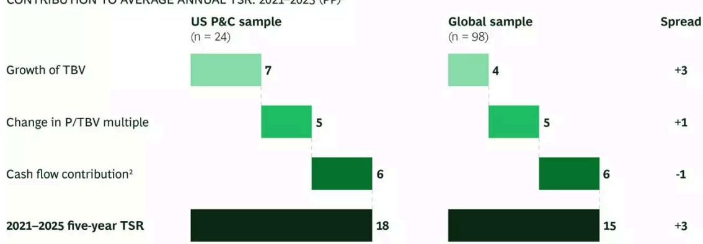
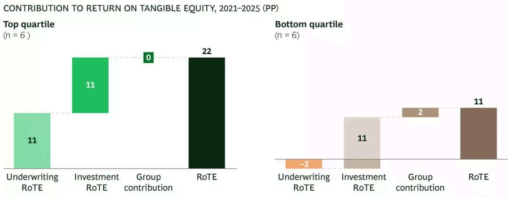
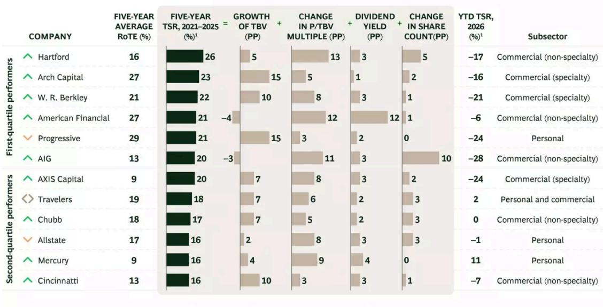
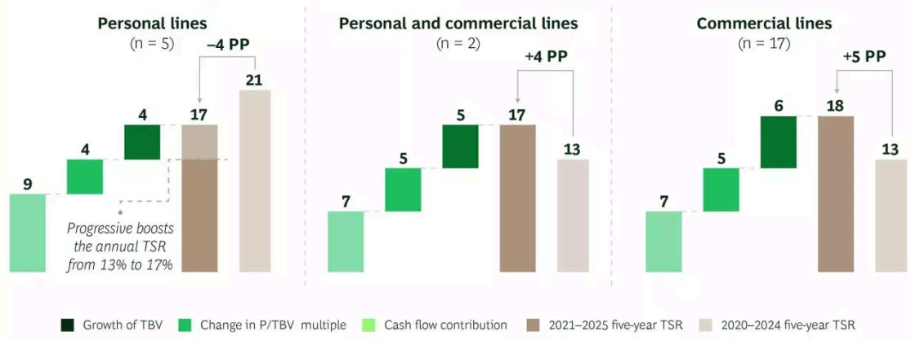
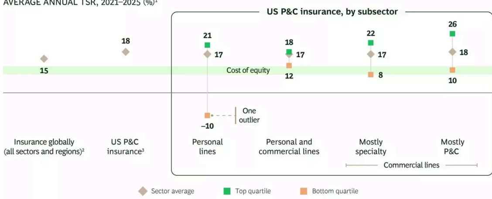

INSURANCE INDUSTRY

# Softer Rates and Bigger Risks Are Reshaping the US P&C Market

The 2026 Insurance Value Creators Report

By Nathalia Bellizia, Nadine Moore, and Paul Nelson

ARTICLE JUNE 25, 2026 15 MIN READ

After several years of strong performance on the heels of a prolonged hard market, US property and casualty (P&C) insurers need to navigate a market shift. Premium rates are softening across multiple lines, particularly personal auto and commercial property. Casualty lines face their own challenges. The cost of losses, driven by such factors as social inflation, severe convective storms (SCSs), and elevated claims severity, remains high. The result is a more complex operating

environment in which the gap between top- and bottom-quartile performers is widening, as it has during past market realignments.

There is one constant: profitable growth remains the clearest differentiator of long-term total shareholder return (TSR), although the recipe for achieving this growth is evolving. The most resilient performers combine disciplined underwriting fundamentals with sophisticated data and analytics capabilities and an aggressive approach to integrating AI—while keeping a close eye on the emerging structural risks reshaping their portfolios.

Four themes define the outlook for the US P&C market:

\- Pricing momentum has moderated. Carriers that have relied on rate increases as a primary means of improving underwriting results must now do more with data, segmentation, and expense discipline.

\- Underwriting excellence is non-negotiable. Top-quartile performers continue to generate significantly higher return on tangible equity (RoTE), primarily through maintaining superior loss ratios.

\- Structural risks are deepening. Long-tail casualty, secondary peril-driven property losses, and evolving litigation dynamics represent rising headwinds that require preemptive portfolio management rather than reactive repricing.

\- AI is moving from experiment to advantage. Leading carriers are deploying AI across underwriting, claims, and pricing workflows at scale, capturing operational efficiencies as well as more detailed risk insights that translate into measurable competitive advantage.

# TSR Performance: Strong but Moderating

US P&C insurers delivered five-year average annual TSR of approximately 18% for the period from 2021 through 2025, outperforming the global insurance average of 15% as well as that of most other sectors. One-year data for 2025, however, shows deceleration in the TSRs of US-based insurers relative to their European and Asia-Pacific peers, reflecting the impact of softening pricing conditions and elevated weather-related losses, even in the absence of major hurricane events.

The primary engine of value creation over the 2021–2025 period remains growth in tangible book value (TBV), the result of strong underwriting income. (See Exhibit 1.) Cash flow contribution

(dividends and buybacks) remains the second major lever, while multiple expansion has been more muted as the market prices in a softer cycle ahead.

For US P&C, Profitable Growth Remains the Biggest Contributor to TSR

CONTRIBUTION TO AVERAGE ANNUAL TSR: 2021–2025 (PP) $^{1}$

  
Sources: S&P Capital IQ; BCG ValueScience Center; BCG analysis.  
Note: The sample includes 24 companies for which the US represents the lion's share of business, although a few are headquartered or domiciled elsewhere. TSRs are weighted by market cap as of January 1, 2021. P&C = property and casualty; PP = percentage point; P/TBV = price to TBV; TBV = tangible book value; TSR = total shareholder return.  
$^{3}$ TSR was measured from January 1, 2021, through December 31, 2025. Fundamentals represent the last 12 months reported as of those dates. $^{2}$ Includes dividend contribution and share-count change.

# Underwriting Determines the Profitability Divide

Across every five-year period BCG has examined, underwriting income separates leaders from laggards. From 2021 through 2025, top-quartile P&C companies generated an estimated underwriting RoTE contribution of approximately 11 percentage points, while the bottom-quartile reported negative underwriting contributions. (See Exhibit 2.)

Top quartile

## EXHIBIT 2

Underwriting Results Drove Performance of Top-Quartile Companies

CONTRIBUTION TO RETURN ON TANGIBLE EQUITY, 2021–2025 (PP)

  
Sources: S&P Capital IQ; BCG ValueScience Center; BCG analysis.  
Note: PP = percentage points; RoTE = return on tangible equity. RoTE is calculated as pretax operating income gross of interest expenses, as a percentage of year-end tangible book value of equity net of preferred stock. Quartiles are based on TSR performance.

Elevated net investment income in 2024–2025 partially masked the underwriting deterioration at weaker carriers. As interest rates normalize and investment income falls, underwriting quality will remain the primary distinguishing factor for profitability. Companies that invested in pricing sophistication and risk segmentation during the hard market are better positioned to defend their margins in the softening environment ahead. (See Exhibit 3.)

## EXHIBIT 3

TSR Results for the First and Second Quartiles of US P&C Insurers  
  
Sources: S&P Capital IQ; Refinitiv; BCG ValueScience Center.  
Note: P&C = property and casualty; PP = percentage point; P/TBV = price to TBV; RoTE = return on tangible equity; TBV = tangible book value minus other comprehensive income; TSR = total shareholder return. Because of rounding, some figures may not sum to totals. $^{3}$ From January 1, 2026, to May 31, 2026; annualized TSR.

# Diverging Subsegment Fortunes

The subsegments of US P&C performed similarly from 2021 through 2025, with TSRs of 17% and 18% for personal and commercial lines, respectively. Behind these figures, however, are signs of diverging markets. (See Exhibit 4.) Commercial lines benefited from a prolonged hard market, while personal lines faced severe profitability challenges in 2022–2023 before recovering sharply in 2024 as rate adequacy improved. Progressive boosted the 2021–2025 personal lines by 4 points to 17%, but the overall results were still 4 points lower than the 2020–2024 TSR of 21%.

## EXHIBIT 4

Performance Across US P&C Subsegments Is Starting to Diverge

CONTRIBUTION TO AVERAGE ANNUAL TSR: 2021–2025 (PP) $^{1}$

  
Sources: S&P Capital IQ; BCG ValueScience Center; BCG analysis.  
Note: TSRs are weighted by market cap as of January 1, 2021. P&C = property and casualty; PP = percentage point; P/TBV = price to TBV; TBV = tangible book value; TSR = total shareholder return.  
$^{2}$ TSR was measured from January 1, 2021, through December 31, 2025. Fundamentals represent the last 12 months reported as of those dates.

Personal lines also showed the widest spread between leaders and laggards, with one outlier significantly expanding the gap between top- and bottom-quartile performers. (See Exhibit 5.) In contrast, specialty lines have reduced the spread compared with last year.

Personal Lines Experienced the Widest Spread in TSR

  
Sources: S&P Capital IQ; BCG ValueScience Center; BCG analysis.  
Note: TSRs are weighted by market cap as of January 1, 2021. The spread for “personal and commercial lines” is based on the minimum and maximum. P&C = property and casualty; TSR = total shareholder return.  
$^{1}$ TSR was measured from January 1, 2021, through December 31, 2025.  
$^{2}$ The 98 largest stock exchange-listed insurers globally.  
$^{3}$ Top 24 US P&C primary insurers in the S&P 1500 Index (excluding title and multiline insurers).

# Near-Term Trends in Personal Lines

We expect several key trends to shape the auto and homeowners markets over the next one to three years.

From Defense to Offense in Auto (but Not for Everyone). After several years of aggressive re-underwriting, nonrenewal campaigns, and double-digit rate increases, the US personal auto market has largely restored underwriting profitability. Combined ratios in personal auto improved to 92% in 2025 from 112% in 2022, according to S&P Global Market Intelligence and NAIC (National Association of Insurance Commissioners) data. The 92% ratio marks the best performance since 2020, when COVID-19 reduced driving significantly. Before 2020, the personal auto market had not reported a combined ratio below 95% since 2004.

The recovery, however, was uneven. Progressive, which moved first and most decisively to reprice its book, recovered profitability substantially ahead of the rest of the market. The company reduced its personal auto combined ratio to approximately 88% in 2025 and achieved significant premium growth as competitors remained in repair mode. It is now the number one personal auto insurer in the US. Other companies required more sustained periods of remediation, shedding policies to restore margin, before achieving combined ratios in the 90s.

With profitability broadly restored, the competitive dynamic is shifting. Carriers are moving from defense to offense, re-entering states and segments that they’d left, re-engaging growth levers, and competing more aggressively for new business. This shift brings with it several risks:

\- Claims frequency is returning from pandemic-era lows, while loss severity continues to rise because of vehicle complexity, repair costs, and medical expense inflation.

\- Annual loss costs (estimated at 6% to 8% by industry actuaries) are outpacing rate increases in some states, compressing margins.

\- Competitive intensity from large mutuals remains significant. Unconstrained by quarterly investor expectations, mutual insurers may be willing to absorb margin pressure to increase market share.

Scale and Underwriting Precision Decisive in Homeowners. The homeowners market has emerged as perhaps the most strategically consequential battleground in US P&C insurance. The market approached a turning point in 2025 with an impressive 88% combined ratio. Driving this result, the best since 2006, was an absence of major hurricanes making landfall, even though other natural catastrophes, such as the Palisades and Eaton wildfires and continuing SCSs, had big impacts.

Carriers and capital providers should be cautious, however. The 2025 result reflects a favorable confluence of factors rather than a structural reset, and several tailwinds are expected to recede as we move forward. Rate momentum should decelerate as adequacy is restored across states. Loss cost inflation remains active, and wildfire and other non-modeled perils are expected to keep the pressure on loss ratios as a new floor takes shape.

The compounding effects of climate change, reinsurance repricing, and regulatory shifts will likely create a bifurcated market. Carriers with superior catastrophe modeling, disciplined exposure management, and adequate pricing should generate strong returns, while the results of others will be undermined by future natural catastrophe events. SCS losses have already surpassed traditional hurricane losses as the primary driver of catastrophe losses across the US. According to Verisk and Munich Re, insured losses from SCS events exceeded \$50 billion in each of 2023, 2024, and 2025, compared with an average of roughly \$30 billion a year in the prior decade. These losses are geographically dispersed, making portfolio management and reinsurance structure more complex than traditional coastal catastrophe loss management programs.

Key strategic considerations for homeowners underwriters include:

\- Detail-Focused Policy Form Management. Coverage terms, exclusions, and sublimits are becoming more material to profitability as the frequency and severity of claims and the use of specialized policies in the excess and surplus market increases.

\- Scale as a Moat. Fixed costs in claims handling, distribution, and technology are increasingly disadvantaging smaller carriers. The top five personal lines writers continue to extend their market share advantage.

\- Reinsurance Optimization. With reinsurance pricing moderating modestly at 2025 renewals (approximately 15% to 20% reductions are reported by primary carriers), the cost of protection has eased. However, terms and conditions remain more restrictive than in the years before 2022 levels, according to reinsurance broker Guy Carpenter.

## Longer-Term Structural Trends

Over the longer term, three years and beyond, we expect several structural trends to reshape the US P&C market and industry.

The Long Shadow of Social Inflation. Long-tail casualty lines represent the most significant unresolved risk. The compounding forces of more attorney involvement in claims, third-party litigation financing, and the frequency of nuclear verdicts (\$10 million or more) are recasting loss patterns in ways that are materially less predictable than historical models imply.

The data is striking. According to Marathon Strategies, a strategic communications and research firm, there were 135 nuclear verdicts in 2024, the most since Marathon began tracking the data in 2009, capping five years of consistent growth since 2020. Swiss Re Institute estimates that third-party litigation financing, in which hedge funds, family offices, and other investors fund plaintiffs' legal costs in exchange for a share of awards, has grown to an estimated \$15 billion to \$18 billion market.

These dynamics increase loss costs, extend settlement timelines, and create uncertainty around reserve adequacy. According to Swiss Re, US insurers experienced \$62 billion in total adverse developments during the decade 2015 through 2024 for commercial liability lines (excluding medical professional liability). This stands in sharp contrast to 19 consecutive years of favorable aggregate reserve developments for the broader US P&C market.

The implications for US P&C carriers are several:

\- Reserve Uncertainty. Carriers with significant prior-year commercial liability and auto exposure face potential adverse development. Analysts and rating agencies are scrutinizing reserve adequacy with increasing intensity.

\- Underwriting Posture. Leading carriers are shifting capacity toward shorter-tail exposures and excess and surplus lines, which offer more flexible policy terms and pricing.

\- Repricing Cycle. Even as property lines soften, casualty pricing is expected to remain firm, creating a bifurcated rate environment in commercial lines portfolios.

Rethinking the Climate and Catastrophe Exposure Map. Climate change is reshaping insurers' underwriting, pricing, and portfolio strategy. The combination of rising hurricane intensity, accelerating wildfire risk in the western US, and the broad geographic expansion of SCS losses has fundamentally altered the risk landscape relative to historical models.

Several data points illustrate the scope of the challenge. According to NOAA, the average annual insured loss from billion-dollar weather events more than doubled between the 2010–2019 decade and the 2020–2024 period. Swiss Re Institute estimates that global insured natural-catastrophe losses will continue to grow at approximately 5% to 7% annually through 2030, fueled primarily by rising asset values in exposed areas and increasing loss severity from climate-related perils. This is in addition to the SCS losses discussed above.

For P&C management teams, the strategic response requires action in three areas:

\- Exposure Management. Actively managing geographic concentrations through underwriting guidelines, capacity limits, and nonrenewal programs in high-risk zones.

\- Model Evolution. Investing in next-generation catastrophe models that go beyond vendor models that may lag data from observed loss trends to incorporate climate-adjusted frequency and severity assumptions.

\- Product Innovation. Developing new product structures (such as parametric covers and climate risk indices) that offer scalable protection while managing balance sheet exposure.

AI as a New Risk Class. It’s early days, but thus far new coverages have not kept pace with businesses’ deployment of AI. AI agents represent an emerging frontier, and major carriers recognize the risks. They are pursuing blanket AI exclusions, but the design of innovative policies lags.

The absence of actuarial data is a significant problem. Because the technology is new, companies don't have loss histories for AI systems. Actuarial data takes five to seven years to develop, and new AI models come to market in a matter of months. The need for new coverages is urgent because of emerging exposures in such areas as professional liability, IP, and copyright. Further, physical damage could be subject to gaps in business interruption coverages.

The cyber insurance market's evolution from early temporary bounded policies to full first- and third-party coverage may offer a path forward. Carriers that invest now in loss data and early product development will lead an expanding market, while those that rely on exclusions risk ceding the market to others.

M&A: A New Wave of Consolidation. With underlying profitability restored for most well-run carriers and industry surplus at historically high levels, the strategic rationale for M&A is strengthening. Several market forces are converging to drive increased deal activity:

\- Scale Economics. As technology investment requirements increase and distribution costs rise, scale provides necessary advantages in unit economics. Smaller carriers, in particular, face rising pressure to either invest aggressively or find a larger partner.

\- Capability Acquisition. It’s easier, and a lot faster, today to acquire new capabilities in such fields as AI, advanced analytics, and climate modeling rather than build them organically. Target companies with proprietary data assets, managing general agent platforms, and frontier technologies command premium valuations.

\- Cross-Border Activity. Japanese and Korean insurers (Tokio Marine, Sompo, MS&AD, and Samsung Fire & Marine) have demonstrated a sustained appetite for acquisitions in the US as a source of earnings diversification and growth. We expect this trend to continue, subject to regulatory scrutiny.

The \$11 billion merger of Zurich Insurance and Beazley, expected to close later this year, illustrates the scale of ambition now on the table. In the US market, midsize specialty carriers and excess and surplus platforms are likely to be the most attractive targets as buyers seek underwriting expertise and access to profitable market niches. While transaction volume has decreased since 2023, deal values have increased, owing to more-targeted, higher-value acquisitions. Carriers are showing an increased willingness to identify growth areas and put excess capital to work through M&A. Political uncertainty and state regulation could limit the pace of cross-border deal execution, but strategic intent appears strong.

AI: From Pilot to Platform. AI has moved quickly from future potential to current competitive differentiation. Leading carriers are now deploying AI across the value chain at scale, with measurable impacts on loss ratios, expense ratios, and cycle times.

The AI applications with the highest impact currently include:

\- Underwriting Augmentation. Advanced models combining structured data (such as loss histories and financial information) with unstructured inputs (such as images, satellite data, and IoT information) can generate much more detailed and specific risk assessments. Some commercial lines underwriters report reductions in underwriting cycle times of 20% to 30% and measurable improvement in loss ratio predictive accuracy.

\- Claims Automation. AI is reducing claims leakage and cycle times by automating such important and expensive functions as first-notice-of-loss triage, damage assessment (using computer vision and drone imagery), and fraud detection. Some carriers report reductions of 15% to 25% in claims processing costs in automated segments.

\- Pricing Optimization. Real-time pricing engines that incorporate telematics data, behavioral signals, and external information sources are enabling more specific risk segmentation, particularly in personal auto. Integrating strong pipelines of claims data into actuarial pricing is also enabling commercial lines carriers to develop more dynamic pricing capabilities that better align pricing with underlying risks.

\- Distribution and Marketing. AI-driven lead scoring, agent support tools, and digital-direct platforms are improving conversion economics and reducing customer acquisition costs.

The gap between AI leaders and laggards in P&C is already widening. Companies that have invested in data infrastructure, model governance, and talent over the past three to five years are now capturing advantages that are difficult to replicate quickly. Carriers still in pilot mode risk falling further behind peers on both expense ratios and risk selection quality.

## C-Suite Priorities: What Top Performers Do Differently

The challenges confronting US P&C carriers are neither uniformly new nor evenly distributed. But today's operating environment punishes inaction much more harshly than in the past. In a softening market with rising structural risks, the actions that management teams take now will determine their position in the value creation rankings for the next five years.

Our analysis of top-quartile performers identifies four areas of consistent differentiation.

Master the Softening Cycle Transition. The transition from a hard to a soft market is one of the most strategically consequential periods in the insurance cycle. Carriers that maintain underwriting discipline during this shift—resisting the temptation to grow premium volume at the expense of margin—consistently outperform over the subsequent five-year period. Practical priorities include preemptive portfolio steering (actively reallocating capital away from lines where pricing is deteriorating faster than loss trends), rigorous account-level profitability review, and maintaining pricing adequacy discipline, even in lines where competitors are reducing rates.

Build the Next-Generation Underwriting Engine. Underwriting excellence remains the primary driver of value in P&C, but the definition of excellence is evolving. The best underwriters in 2026 combine deep domain expertise with advanced data and technology capabilities. Companies should invest in three areas:

\- Data Infrastructure. Unified, accessible data assets that support real-time pricing, risk assessment, and portfolio management decisions.

\- Model Sophistication. Advanced predictive models that go beyond traditional actuarial approaches by incorporating alternative data sources (such as satellite imagery, climate data, behavioral signals, and third-party information).

\- Workflow Automation. Straight-through processing for standard risks that frees expert underwriters to focus on complex, high-value accounts where human judgment provides the greatest value.

Secure Scarce Talent. Access to talent has emerged as a binding constraint on value creation. The competition for skilled underwriters, data scientists, and AI engineers has intensified significantly, with managing general agents, private-equity-backed startups, and technology companies all competing in the same pools of expertise.

Top-performing carriers are differentiating on talent strategy through several approaches:

\- Creating specialized centers of excellence that offer underwriters meaningful technical autonomy

\- Developing AI upskilling programs that help experienced underwriters amplify their judgment with data tools

\- Building compensation structures that reward long-term underwriting performance rather than near-term premium volume

Address Structural Risks. The structural risks described in this report—social inflation, climate-driven property losses, and AI disruption—do not resolve themselves. Carriers that wait for these risks to manifest before responding are likely to find themselves in a reactive, loss-driven mode at precisely the moment when others are investing in new capabilities and stronger market position. For casualty lines, the importance of reserve review rigor, active litigation management programs, and deliberate capacity management is on the rise. Property insurers need to invest in next-generation climate exposure management tools and work collaboratively with regulators on frameworks that allow market-based pricing. All P&C insurers need to move quickly from AI pilots to AI platforms, with governance structures that ensure responsible deployment at scale.

# The Fundamentals Still Win—But the Bar Is Rising

BCG's multiyear analysis of US P&C value creation continues to demonstrate a consistent truth: companies that get the fundamentals right—disciplined underwriting, rigorous capital allocation, and sustained investment in capability—outperform over every measurable time horizon. This finding has held across hard and soft markets, through catastrophe cycles, and during economic downturns.

The new challenge is the sophistication required to execute. The best underwriting organizations of 2026 look very different from those of 2016. Today, they combine deep domain expertise with AI-powered tools, real-time data, and rigorous portfolio management processes that were not available a decade ago.

The carriers most at risk are those in the middle: not yet facing acute financial distress but also not investing aggressively enough to build the capabilities that will define competitive advantage in the next cycle. As the gap widens between leaders and laggards, “good enough” is no longer good enough.

The evidence is clear that those companies that respond to structural risks and invest in talent and technology will power the next generation of underwriting excellence.

The authors are grateful to Jürgen Böhrmann, Azariah Harris, Teresa Schreiber, and their colleagues in BCG's Insurance practice for their contributions to this report.

## Authors

  
Nathalia Bellizia  
Managing Director & Partner
New York

  
Nadine Moore

  
Managing Director & Senior Partner
Chicago  
Paul Nelson

Managing Director & Partner
Chicago

## ABOUT BOSTON CONSULTING GROUP

Boston Consulting Group bridges the gap between ambition and outcomes for the world's leading companies and organizations. We are built for this era of unprecedented change — bringing strategic clarity rooted in over 60 years of deep domain knowledge, combined with applied AI shaped by our practitioners. BCG works shoulder-to-shoulder with CEOs across industries and geographies to deliver transformative impact at scale: stronger returns, transferred capabilities, and change that sticks. For more information, visit bcg.com.