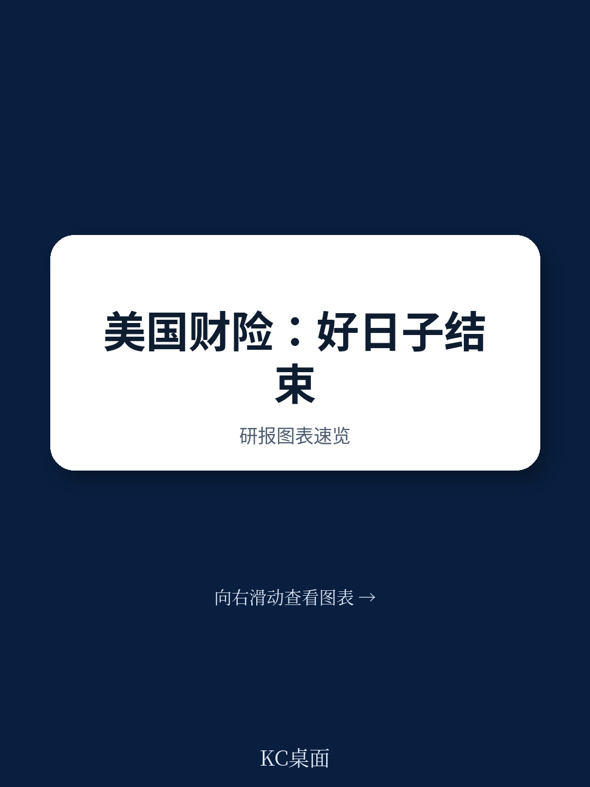
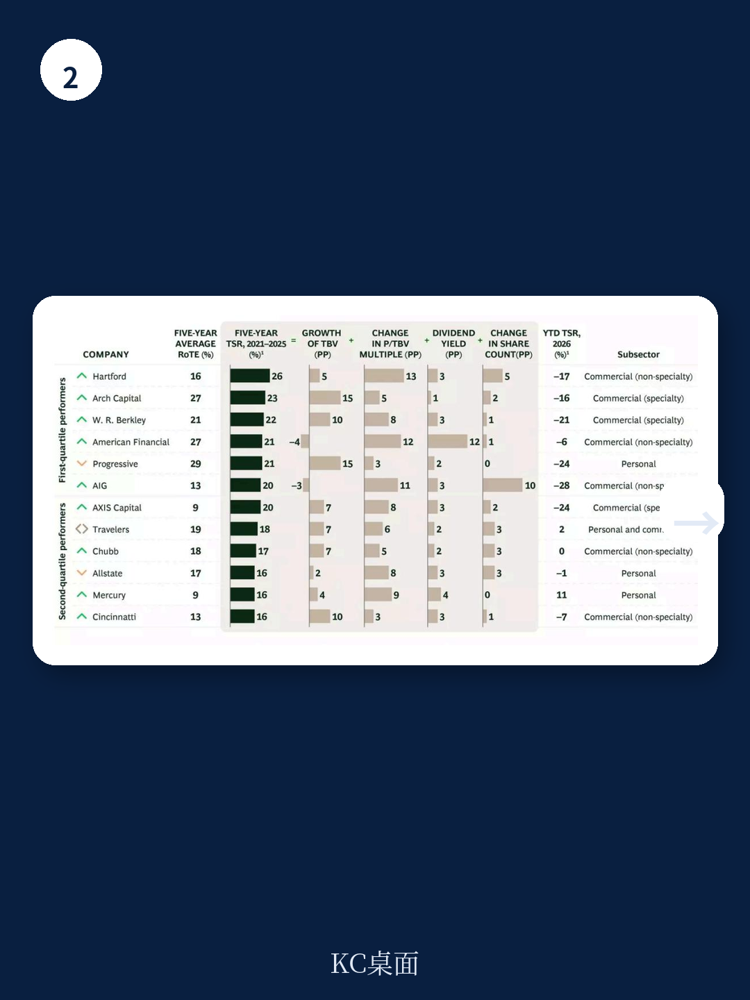

# 波士顿咨询：BCG：美国财险市场最危险的信号不是费率走软，而是承保能力断层

美国财产与 casualty 保险市场正在经历一个微妙的转折点。波士顿咨询在最新发布的《2026年保险价值创造者报告》中给出了一组值得认真拆解的数据：2021至2025年间，美国财险公司的五年平均年度总股东回报率约为18%，跑赢全球保险业均值15%，也跑赢了大多数其他行业。但2025年的单年数据已经显露出明显的减速迹象——美国保险公司的TSR正在被欧洲和亚太同行追赶。

这份报告的真正价值不在于这些数字本身，而在于它揭示了一个正在加速的结构性分化：行业头部与尾部的差距正在拉大，而且这一次的分化逻辑与过去几轮周期有本质区别。

最直接的主判断是：美国财险市场已经告别了单纯靠费率上涨就能改善承保结果的时代。那些在硬市场中依赖提价来维持盈利的保险公司，现在必须用数据、细分和费用纪律来证明自己的承保能力。这不是一个周期性的调整，而是一个能力门槛的系统性抬升。

## 1. 承保利润才是真正的分水岭，投资收入正在掩盖一个危险的假象

波士顿咨询的分析跨越了多个五年周期，结论始终一致：承保业绩是区分领先者和落后者的核心指标。在2021至2025年这个周期里，表现最好的四分之一财险公司，其承保业务对有形股本回报率的贡献约为11个百分点；而表现最差的四分之一公司，承保贡献为负值。

这个差距本身并不令人意外。真正值得关注的是：2024至2025年间，较高的净投资收益部分掩盖了弱势保险公司的承保恶化。换句话说，当利率正常化、投资收益回落之后，承保质量将成为区分盈利能力的唯一变量。

> **KC评论：** 这意味着，当前很多保险公司的财报数字可能比实际经营状况更好看。投资者如果只看ROE而不拆解承保和投资的贡献比例，很容易高估那些在承保端已经出现问题的公司的真实竞争力。完整报告中有详细的ROE拆解图表，可以帮助读者逐层判断哪些公司是真正的结构性强者。

波士顿咨询的图表清晰地展示了这一点：第一四分位和第二四分位公司在承保贡献上的差距是系统性的，而投资收入贡献的差距则相对有限。那些在硬市场期间投资于定价精细化和风险细分的公司，在费率走软的环境中将更有能力捍卫自己的利润率。

## 2. 个人险种的分化比商业险更剧烈，一个异类正在改写竞争规则

从2021到2025年，个人险和商业险的TSR分别为17%和18%，看似接近。但波士顿咨询的报告指出，这组数据背后是两个正在分化的市场。商业险受益于长期的硬市场，而个人险则在2022至2023年面临严重的盈利挑战，直到2024年才因费率充足度改善而大幅回升。

更关键的是，个人险种表现出了最宽的领先者与落后者差距。报告特别指出，Progressive将个人险种的五年TSR拉高了4个百分点至17%，但即便如此，这个数字仍然比2020至2024年的21%低了4个百分点。

Progressive的故事值得单独拿出来讲。这家公司率先且最果断地对其保单组合进行了重新定价，在竞争对手仍处于修复模式时，就实现了显著的保费增长。目前它已经成为美国个人车险市场的第一名。

> **KC评论：** Progressive的案例说明，在个人险市场，先发优势带来的不仅是市场份额，还有定价权和客户选择权。当其他公司还在忙于止损时，Progressive已经在用数据驱动的定价模型筛选优质客户，形成了正向循环。完整报告中有Progressive与其他公司的详细对比数据，可以更清楚地看到这种优势是如何量化的。

## 3. 车险市场从防守转向进攻，但三个风险正在积累

美国个人车险市场在2025年实现了92%的综合成本率，这是自2020年以来的最佳表现。但波士顿咨询提醒，这个数字背后有几个值得警惕的趋势。

第一个风险是索赔频率正在从疫情低点回升，而损失严重度因车辆复杂性、维修成本和医疗费用通胀而持续上升。行业精算师估计年度损失成本增长在6%到8%之间，已经超过了某些州的费率涨幅。

第二个风险是竞争强度。大型互助保险公司不受季度投资者预期约束，它们可能愿意承受利润率压力来换取市场份额。这意味着，即使行业整体费率走软，竞争也不会自然降温。

第三个风险是恢复的不均衡。Progressive在2025年将个人车险综合成本率降到了约88%，而其他公司则经历了更长时间的修复期，通过放弃保单来恢复利润率，才最终实现综合成本率在90%以上。

波士顿咨询的判断很直接：随着盈利能力的广泛恢复，竞争格局正在从防守转向进攻。保险公司重新进入此前退出的州和细分市场，重新启动增长杠杆，对新业务展开了更激烈的竞争。

## 4. 房屋险正在成为战略竞争的主战场，但2025年的好成绩不可持续

房屋险市场可能是美国财险中战略意义最强的战场。2025年，该市场实现了88%的综合成本率，这是自2006年以来的最佳表现。但波士顿咨询明确警告：这个结果反映的是有利因素的巧合，而不是结构性重置。

推动这个好成绩的主要原因是2025年没有大的飓风登陆。但其他自然灾害——比如Palisades和Eaton山火，以及持续的对流风暴——已经造成了重大影响。报告指出，对流风暴造成的保险损失已经超过传统飓风，成为美国巨灾损失的主要驱动因素。根据Verisk和慕尼黑再保险的数据，2023、2024、2025年每年由对流风暴造成的保险损失都超过了500亿美元，而此前十年的年均水平约为300亿美元。

对于房屋险承保人，波士顿咨询提出了三个关键战略考量：

第一，保单条款管理变得越来越重要。随着索赔频率和严重度的上升，承保范围、除外责任和分项限额对盈利能力的影响越来越大。

第二，规模正在成为护城河。在理赔处理、分销和技术方面的固定成本，正在使小型保险公司处于越来越不利的地位。前五大个人险承保人正在持续扩大市场份额。

第三，再保险优化。虽然2025年续保时再保险价格温和下降约15%至20%，但条款和条件仍然比2022年之前的水平更为严格。

> **KC评论：** 88%的综合成本率看起来很美，但波士顿咨询的核心判断是“这不是结构性的”。这意味着，投资者在评估房屋险公司时，不能把2025年的数据作为盈利能力的基准。完整报告中有关于气候损失趋势的详细数据，可以帮助读者判断哪些公司真正具备了应对结构性风险的能力。

## 5. 社会通胀是最大的未解风险，长尾责任正在改写损失模型

波士顿咨询报告中最具穿透力的部分，是对社会通胀的讨论。长尾责任险种代表了最重大的未解决风险。律师参与索赔的程度加深、第三方诉讼融资的兴起、以及“核裁决”频率的增加，正在以历史模型无法预测的方式重塑损失模式。

数据令人震惊。根据Marathon Strategies的数据，2024年发生了135起核裁决（1000万美元及以上），这是自2009年该公司开始追踪以来的最高纪录，也是2020年以来连续五年的持续增长。瑞士再保险研究所估计，第三方诉讼融资市场已经增长到约150亿至180亿美元。

这些动态增加了损失成本，延长了和解时间线，并造成了准备金充足度的不确定性。根据瑞士再保险的数据，美国保险公司在2015至2024年间，商业责任险种（不包括医疗专业责任）经历了总计620亿美元的不利准备金发展。这与更广泛的美国财险市场连续19年的有利准备金发展形成了鲜明对比。

报告没有完全回答的一个关键问题是：社会通胀的影响何时会在财务报表中充分体现？由于长尾责任险种的损失发展需要多年才能完全显现，目前的准备金是否充足仍是一个悬而未决的问题。这也是为什么波士顿咨询建议领先的保险公司正在将产能转向短尾险种和超额与剩余市场——后者提供更灵活的保单条款和定价。

## 6. AI正在从实验走向竞争优势，但作为新的风险类别，覆盖缺口正在扩大

波士顿咨询将AI定位为财险行业的下一个结构性变量，这个判断包含两个层面。

第一，作为运营工具，AI正在从实验阶段走向规模化部署。领先的保险公司正在承保、理赔和定价工作流程中大规模部署AI，不仅获得了运营效率，还获得了更精细的风险洞察，这些正在转化为可量化的竞争优势。

第二，作为新的风险类别，AI正在创造保险覆盖的巨大缺口。报告指出，新的保险产品未能跟上企业部署AI的步伐。AI代理代表着一个新兴的前沿领域，主要保险公司已经认识到风险，正在推行全面的AI除外责任，但创新保单的设计仍然滞后。

缺乏精算数据是一个核心问题。因为技术是新的，公司没有AI系统的损失历史。精算数据需要五到七年才能开发出来，而新的AI模型在几个月内就会进入市场。专业责任、知识产权和版权等领域的风险暴露正在变得迫切。

> **KC评论：** 这里有一个尚未被市场充分定价的机遇：那些现在就开始投资于AI损失数据和早期产品开发的保险公司，将在一个快速扩张的市场中占据领先地位；而那些依赖于除外责任的公司，则可能将市场拱手让给竞争对手。完整报告中有关于AI作为风险类别的更详细的讨论，包括与网络保险市场演进的类比分析。

## 7. 并购浪潮正在酝酿，但买什么比买不买更重要

波士顿咨询认为，随着大多数经营良好的保险公司恢复了基础盈利能力，行业盈余处于历史高位，并购的战略理由正在增强。几个市场力量正在汇聚，推动交易活动增加：规模经济需求、能力获取动机、以及日韩保险公司的持续收购意愿。

但报告中最有价值的判断不是“并购会增加”，而是“并购的逻辑正在变化”。过去，并购主要是为了扩大规模、降低成本。现在，并购更多是为了获取能力——特别是在AI、高级分析和气候建模领域。拥有专有数据资产、管理总代理平台和前沿技术的目标公司，正在获得溢价估值。

报告特别提到了日韩保险公司（Tokio Marine、Sompo、MS&AD和Samsung Fire & Marine）对美国资产的持续收购兴趣。这是一个值得关注的结构性趋势：这些亚洲保险巨头正在利用美国市场实现收益多元化和增长。

## 最后：留给读者的观察框架

波士顿咨询报告的核心框架可以概括为三个层次的问题：

第一层：你的承保能力是否真的优于同行？拆开ROE，看承保贡献，不要被投资收入蒙蔽。

第二层：你是否有能力应对结构性风险？社会通胀、气候损失、AI风险——这些不是周期性的，它们需要的是预判性的组合管理，而不是被动的重新定价。

第三层：你的技术投资是否已经转化为竞争优势？AI从实验到平台化部署的速度，将决定下一轮周期的赢家和输家。

报告中最令人不安的一个发现是：“足够好已经不再足够好。”那些尚未面临严重财务困境、但也未积极投资于构建下一周期竞争优势的公司，才是最危险的群体。它们正在被夹在中间——既无法像领先者那样获得定价权和客户选择权，也无法像落后者那样通过激进重组来解决问题。

波士顿咨询的这份报告为这些公司开出了具体的行动清单：主动调整组合、投资下一代承保引擎、锁定稀缺人才、以及提前应对结构性风险。但报告没有完全展开的是：这些行动需要多大的资本投入？需要多长的时间才能见效？在费率走软的环境下，管理层是否有足够的耐心和勇气来执行？

这些问题，正是我们每天在社群中与读者持续讨论的内容。我们每天会由AI agent结合人工review，生成国际投行中文摘要与KC评论，daily更新，约10至40页，也包含当天最新数据图表合集。这些内容既方便喂给AI做进一步分析，也方便人工快速把握市场动态。如果你对完整报告中的原始图表、数据拆解、以及更多未在本文中展开的二阶判断感兴趣，欢迎加入我们的讨论。

Personal reading notes and learning share only. Not investment advice.

