# The Widening AI Value Gap

Build for the Future 2025

By Jessica Apotheker, Vinciane Beauchene, Nicolas de Bellefonds, Patrick Forth, Marc Roman Franke, Michael Grebe, Nina Kataeva, Santeri Kirvelä, Djon Kleine, Romain de Laubier, Vladimir Lukic, Amanda Luther, Mary Martin, Jeff Walters, and Christoph Schweizer

September 2025

## Contents

03 Are You Generating Value from AI?
• Critical Capabilities
• Future-Built Strategies

05 AI Value Generators Are Pulling Away
• The Expanding Value Gap
• Value from the Core
• On Come Agents
• Agents Do Not Work Alone
• Sidebar: AI Maturity Varies by Sector and Region

11 What Value Generators Do Differently
• Pursue a Multiyear Strategic AI Ambition
• Reshape and Invent with Impact
• Adopt an AI-First Operating Model
• Secure and Enable the Necessary Talent
• Use Fit-for-Purpose Technology and Data

17 How to Accelerate AI Value Creation

19 Appendix
• AI Definitions
• Survey Methodology

# Are You Generating Value from AI?

How much value is your company generating from your investments in AI? It’s a question more CEOs, boards, and investors are asking. More often than not, the answer is not encouraging.

BCG's latest research provides empirical proof that for a small number of companies AI is delivering significant bottom-line value in the form of revenue and cash flow increases and process and workflow improvements. The impact is sufficient to drive shareholder returns. But this typically does not happen. Only $5\%$ of companies in our 2025 study of more than 1,250 firms worldwide are achieving AI value at scale—a measure of how tough the full AI transformation is. Fully $60\%$ of companies are not achieving material value at all, reporting minimal revenue and cost gains despite substantial investment. Another $35\%$ (13 percentage points more than in 2024) are scaling up their efforts and seeing some returns, but many of them admit that they are not moving far enough or fast enough. (See Exhibit 1.)

## Critical Capabilities

The difference is that the top 5% of companies, which we call future-built, have put in place the critical capabilities needed to make AI work at the level of innovation and reinvention as well as to boost efficiencies. Not only are these companies outperforming the competition, but they have also opened a value gap and are pulling further ahead as they reinvest the proceeds from their earlier success in new capabilities, tools, and innovations. Future-built companies are achieving a transformative effect on value creation by catalyzing better decisions and faster and more efficient actions, targeting step changes that go far beyond what is possible from automation and productivity increases.

Much of this value is concentrated in core business functions, such as R&D, sales and marketing, and manufacturing, as well as in IT, where the expected value potential in multiple areas increased substantially over expectations in our 2024 report, Where's the Value in AI? The biggest value comes from client-related functions and IT.

All of this is happening much more rapidly than previous digital disruptions did, and it will continue to do so as AI's functionality improves. Agentic AI, which combines predictive and generative capabilities to reason, learn, and act autonomously, promises to be the biggest accelerator of the widening value gap. Agents, hardly spoken of at all in 2024, already account for $17\%$ of total AI value in 2025 and are expected to reach $29\%$ by 2028.

## Future-Built Strategies

Future-built companies are distinguished by five interlinked strategies that we identified in last year's report, starting with strong leadership and a clear and ambitious vision. They recognize the massive opportunity to drive a top-down multiyear agenda, they define their AI programs with ambitious cost and revenue targets from top management, and they mandate near-term bottom-line improvements while developing new skills, workflows, and technology that will fuel their success for years to come.

Share of companies

Only 5% of Companies Get Substantial Value from AI, While 60% Lag in Developing Critical AI Capabilities  
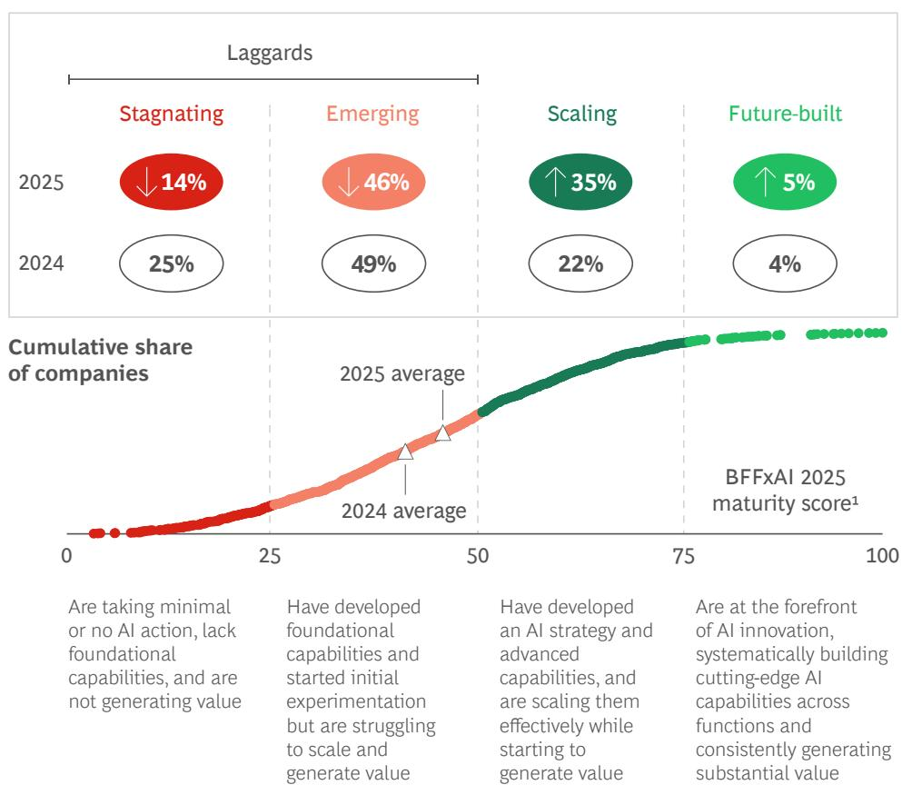

<table><tr><td colspan="2">Value achieved by future-built2</td></tr><tr><td>1.7x</td><td>Revenue growth</td></tr><tr><td>3.6x</td><td>Three-year TSR3</td></tr><tr><td>2.7x</td><td>Return on invested capital</td></tr><tr><td>1.6x</td><td>EBIT margin</td></tr><tr><td>3.5x</td><td>Patents</td></tr></table>

Source: BCG Build for the Future 2025 Global Study (n = 1,250).  
$^{1}$ This score assesses AI maturity across 41 dimensions.  
$^{2}$ Future-built versus stagnating + emerging.  
$^{3}$ External metrics (Capital IQ): total shareholder return (June 22–May 25 for three-year TSR).

Future-built firms go well beyond automation and incremental productivity improvements to reshape current workflows and invent new ones. They prioritize the latest advances, such as generative AI (GenAI) and agentic AI, to create new revenue streams. Big value comes not from AI pilots or isolated use cases, but from reshaping and reinventing core business workflows end-to-end.

Future-built firms have adopted an AI-first approach and installed and achieved organizational buy-in for an AI-first operating model that combines strong leadership with decentralized execution and shared ownership between business and IT. They are moving toward hybrid workflows based on human–AI collaboration supported by necessary upskilling, governance guardrails, and partnerships. They aggressively source or train the talent they need, now and for the future, especially through broad-based upskilling of current staff (more than 50% of the internal workforce). They also build out a flexible, modular, and interoperable technology stack and a data foundation that leverage central AI platforms, reusable agents, interoperable architectures, and governed access to trusted enterprise data.

The good news for other companies is that the playbook that these future-built firms follow is clearly delineated and available to all. It’s a roadmap that the other 95% can use to build AI maturity and achieve value at scale. But these trailing firms, especially the 60% that have little or no value to show for their investment in AI so far, need to move fast or risk being left in the wake of this latest powerful wave of digital disruption.

# AI Value Generators Are Pulling Away

The goal of AI, of course, is to create business value. Such value has been elusive until recently, leading to skepticism among executives about the importance of the technology to their companies and among investors about whether the immense investments being made in AI (more than \$250 billion in 2024 alone, according to Stanford University) will pay off by driving higher corporate usage.

But our research indicates that for the best companies, value is achievable and substantial. Future-built companies already generate 1.7 times more revenue growth and 1.6 times higher EBIT margins than the 60% of companies in the categories we term stagnating or emerging. The AI portfolio of initiatives at one large multiformat retailer has produced cost, margin, and revenue impacts of hundreds of millions of dollars over the past five years, adding more than 10% to the company EBITDA today. A company executive told us, “The investor community sees this, as we do, as a strategically important driver of value.”

## The Expanding Value Gap

AI-driven value accrues over time, creating a compounding effect. (See Exhibit 2.) Future-built companies that moved early enjoy outsized benefits across financial and operational fronts, and this performance gap is widening. Future-built firms plan to spend 26% more on IT (representing almost a full percentage point of revenue) and dedicate up to 64% more of their IT budget to AI in 2025. As a result of this investment, they expect twice the revenue increase and 1.4 times greater cost reductions than laggards in the areas where they apply AI.

This creates a cycle that is virtuous for some and vicious for others. In the latter camp are companies that started to experiment but struggled to scale and generate value (the 46% we call emerging) and stagnating companies that have taken little or no action (the remaining 14%). We refer to all of these companies collectively as laggards; about a third admit that they have made no progress. (See “AI Definitions” in the appendix.) As future-built companies reinvest their AI returns in stronger people and additional tech capabilities, they accelerate value creation. Laggards, which lack foundational capabilities and generate almost no value, risk being locked into a vicious cycle of losing ground.

## EXHIBIT 2

Future-Built Companies Create a Virtuous Cycle by Higher Spending on IT and Reinvestment of Gains from AI

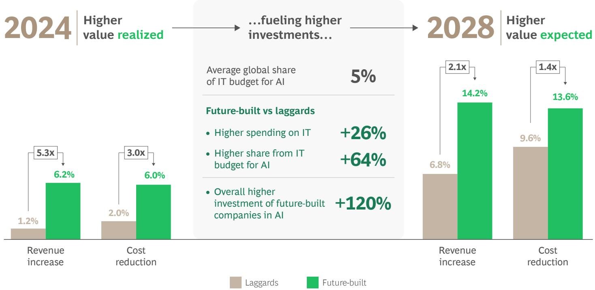  
Source: BCG Build for the Future 2025 Global Study (n = 1,250).  
Note: Results reflect the business area respondents know best, not always the full company. Revenue increase and cost reduction are calculated as a percentage of annual revenue through AI efficiency gains in areas where AI is applied.

Our research and client experience finds plenty of reasons for lack of progress. One of the biggest is lack of top management commitment. Among laggards, top management may talk the talk, but it fails to articulate any clear value ambition and doesn't put in place a program to track progress regularly. It delegates AI to people in middle or lower management, who are unsure what to do or are fearful of the technology's future impact on them. Some company leaders move slowly because they worry about adverse impacts, such as poor customer experience. Others are told by operational management that they are already using AI in many places and the value will come if the leaders are patient. Still others experiment too widely, spreading their resources over scores of complex workflows and automating processes here and there, instead of focusing end-to-end on a few important functions or workflows that can generate value and illustrate the benefits of scale. The outcome is often a proliferation of disconnected initiatives that consume resources without generating coordinated value.

In the end, too many companies have approached AI too incrementally, as a way to do more of the same a little faster or better, when the need is for strategic reinvention: What matters to my customers and differentiates my business? How will AI and agents change how I deliver those outcomes? Where do humans still have the biggest impact?

## Value from the Core

Our research has found that 70% of potential value from AI is concentrated in core business functions such as sales and marketing, manufacturing, supply chain, and pricing. R&D and innovation alone account for 15% of the total potential value. This continues a trend that we identified in our 2024 report, which reported that 62% of value came from core business functions.

The big exception is IT, whose share of AI value jumped by 6 percentage points to 13% in 2025. (See Exhibit 3 and the sidebar, “AI Maturity Varies by Sector and Region.”)

# 70% of AI's Value Is Concentrated in Core Businesses

Distribution of AI value potential across functions in 2025 (%)

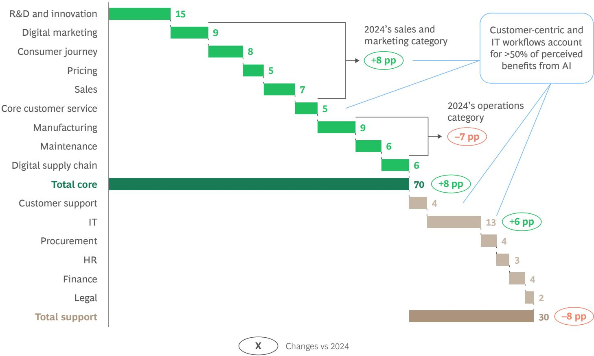  
Source: BCG Build for the Future 2025 Global Study (n = 1,250).  
Note: Customer service is considered a core business function in some industries (e.g., banking, insurance, and real estate) but a support function in others (e.g., consumer products, automotive, and logistics).

AI is already creating tangible value in multiple core business workflows. For example, AI-powered infrastructure monitoring and predictive maintenance helps energy companies reduce costly downtime, driving strong cost-avoidance benefits. Some 45% of these firms have either scaled or fully deployed this workflow, leading to avoidance of 30% of addressable costs when fully deployed.
(See Exhibit 4.)

GenAI helps these and other firms leverage predictive AI in the service of wider adoption by facilitating nontechnical communication and engagement. Future-built companies, which put predictive AI on their CEO agendas as early as 2021, are now much faster than others at enabling broad adoption.

## On Come Agents

The emergence of agentic AI in the past 12 months represents a critical development in making AI more relevant to businesses. Agentic AI combines predictive AI and GenAI in core business workflows across the entire value chain. The workflows can be simple, such as performing reconciliation in the procurement function, but companies can also integrate multiple agents into more complex workflows, such as supply chain management or consolidated supply and demand workflows in call center rostering.

The most successful examples involve embedding agents across entire workflows rather than running them as isolated pilots. In this sense, AI agents can be thought of as digital workers. They perform alongside or under the supervision of human workers to digest large volumes of data, perform logic and reasoning functions, make decisions, and act. Internal feedback loops enable them to learn and improve outcomes.

# AI Maturity Varies by Sector and Region

AI maturity, which we define as the ability to create value at scale, varies by sector. Maturity has advanced across most industries—but not evenly. New front-runners have emerged, legacy sectors continue to struggle, and sharp contrasts are visible in both capability adoption and workforce readiness. And though maturity varies across sectors, companies in each one have made cutting-edge progress.

Software, telecommunications, and payments and fintech lead the maturity race in 2025, showing strong year-over-year development and boosting their positions on our index by 13 points, 11 points, and 7 points, respectively. Fashion and luxury, chemicals, and real estate and construction remain at the lower end of the AI maturity curve.

In sectors such as airlines and telecommunications, AI's contribution to value in core functions pushes 80% (up 15 percentage points (pp) and 8 pp, respectively, from 2024). Chemicals, oil and gas, and machinery and automation show the highest shift toward AI use in core functions, with increases of 14 to 19 pp.

There are big disparities in access to AI tools. In relatively immature sectors, less than 50% of employees have access to GenAI tools such as Copilot and ChatGPT. In relatively mature sectors, more than 70% of staff have access. We found disparities in training as well. Software companies plan to upskill 55% of their staff in the coming year while chemicals and machinery and automation firms plan to train less than 15%. Although access to tools and training is insufficient by itself to drive meaningful value, it is a strong indicator of whether a company or sector takes AI seriously.

Regional differences are subtle. North America tends to be slightly ahead on most adoption metrics. Asia-Pacific follows, with Europe somewhat farther behind, though all regions have a mix of future-built and lagging companies.

Asia-Pacific companies allocate the highest share of their IT budget to AI (5.2% versus 4.6% in Europe and 4.4% in North America), and these companies are reporting slightly higher value. Looking ahead to 2028, Asia-Pacific expects a revenue increase of 10% (versus 7% for Europe and 8% for North America) and cost reduction of 12% (versus 10% for others).

Agentic AI adoption varies, too: 51% of firms in North America are experimenting with or deploying agents versus 45% in Asia-Pacific and 41% in Europe. Interestingly, Asia-Pacific allocates the largest share of AI budget to agentic development (32% versus 29% in North America and 22% in Europe).

No Matter the Industry, Scaled Workflows in the Core Business Are Already Creating Value  
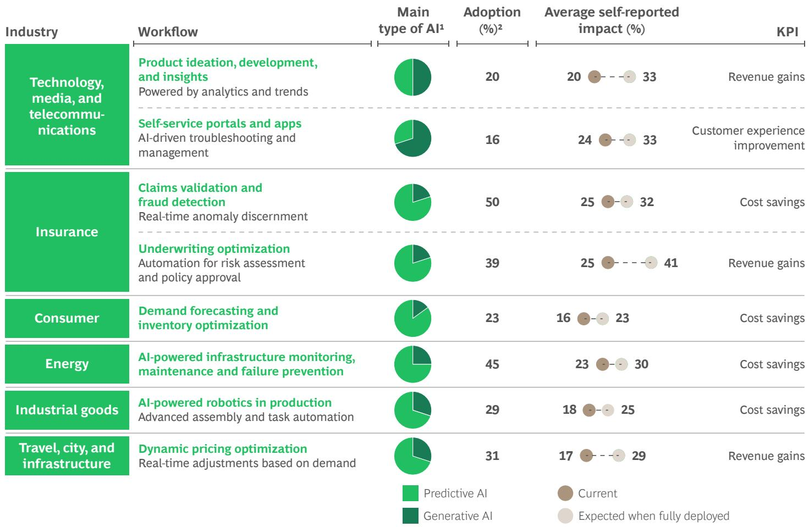  
Source: BCG Build for the Future 2025 Global Study (n = \~900 for workflows).  
$^{1}$ Estimate based on the predominant AI type in each workflow, even if there is always some of the other.  
$^{2}$ Scaled or fully deployed stage of adoption for the workflow.

Companies should view agentic AI as the next step in AI implementation, not as the starting point. The prerequisites for agents include strong data foundations, scaled AI capabilities, and clear governance. The best way to deploy agents is through a few high-value workflows with clear implementation plans and workforce training, rather than in a massive rollout of agents everywhere at once.

For example, a global beauty products company implemented a step change in its sales and marketing as it sought to address multiple issues with customers' online experience. These problem areas included highly fragmented sources of information, a lack of personalized guidance, and an inability to access important product information before making a purchase decision. The company's solution was to introduce the industry's first large-scale virtual beauty assistant, integrated into the company's websites and e-commerce journeys extending across more than 20 markets and covering eight brands.

The automated assistant combines AI-powered consultation with real-time personalization, supported by a unified data and cloud platform. The virtual assistant was deployed in less than 12 months, and the company expects to gain \$100 million in incremental revenue from the initiative—doubling the ROI of traditional e-commerce customer pathways, and enabling a new model of always-on, personalized customer engagement.

A leading electronic device manufacturer sought to integrate GenAI across infrastructure, manufacturing, and frontline operations. Its previous digital efforts were fragmented; it needed central orchestration, governance, and a technician-focused transformation. The answer lay in assembling and stocking a “company store” of centralized agentic AI solutions to govern, scale, and monitor AI use cases across the manufacturer’s more than 200 factories. Companies can use core agents repeatedly, accelerating deployment of new workflows and supporting 80%

automation in complex operational workflows such as defects diagnostics and production planning. The company has modeled more than \$300 million in EBIT impact through scalable GenAI workflows.

According to our survey, agents account for about 17% of total AI value in 2025, and they are moving fast. Agentic value is expected to almost double to 29% by 2028. (See Exhibit 5.) Agents are expanding the value gap between future-built firms and their slower rivals. Future-built companies already allocate 15% of their AI budgets to agents. A third of these companies use agents, compared with 12% of scalers and almost none of laggards. For all companies, agents represent both a massive opportunity and a pressing risk. Companies urgently need to redesign how work gets done, addressing the impact of agents on existing processes, roles, and skills.

## Agents Do Not Work Alone

Companies are aware that they do not have the internal skills to build and deploy agents by themselves. The best companies respond by working with partners from a large and growing ecosystem of infrastructure, platform, and applications providers. Our survey shows that companies that leverage this ecosystem are three times as likely as those that don’t to experiment with or deploy agents and to reuse models and prompts across workflows. Future-built companies also determine what they should build internally versus what they should access from the ecosystem. They move toward a flexible tech architecture and data model that is interoperable across multiple vendors' solutions. They entrench the critical capabilities in-house.

A leading insurance company partnered with best-in-class tech vendors—including AI infrastructure, foundation model, and data integration providers—to deploy agentic AI across its underwriting and claims functions, boosting the speed of underwriting processes and enabling enterprise-wide transformation through the orchestration of a multivendor ecosystem.

Powerful as they are, agents present new risks that must be managed, and it's concerning that $72\%$ of companies already report unmanaged AI-security risks. Any firm using AI must design and embed protections and guardrails at scale without slowing performance. Executives at future-built companies look to remove roadblocks as they build in security, effectively solving issues such as fear of adverse customer experience, hallucinations, bias, and misuse of data—issues that often bog down laggards.

Agents do not operate without humans. Their performance depends on strong human orchestration in redesigned roles. The best companies reconfigure workflows to combine autonomous agents with human oversight, maximizing value and adoption.

## EXHIBIT 5

## Value from Agentic AI Is Expected to Double by 2028

2x more value is expected to come from agentic AI by 2028 $(\%)$ 1

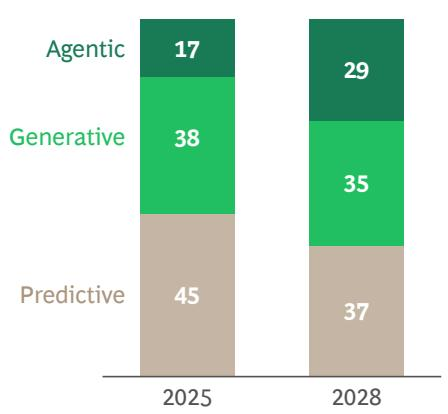  
Companies are experimenting with agentic AI...  
Companies prioritize customer experience use cases for agents

46%

Of companies are experimenting with early pilots or deploying agents (with 16% of these companies already demonstrating tangible value)

...Thanks to budget allocation

30%

Of companies are spending over 15% of their AI budget on agents

Top 5 functions prioritized for agentic AI usage $(\%)^{2}$

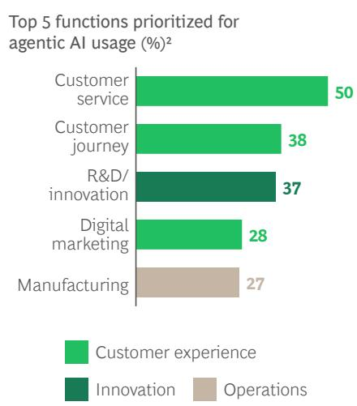  
Source: BCG Build for the Future 2025 Global Study (n = 1.250).  
Note: Because of rounding, not all bar segment totals equal 100%.

# What Value Generators Do Differently

Our research shows that regardless of sector or size of enterprise, future-built companies follow a well-defined and proven playbook, rooted in an AI-first operating model, to generate value and expand their advantage. (See Exhibit 6.) We laid out the winning formula in our 2024 report, and the evidence this year suggests that companies should double down on it, since value creation clearly compounds for firms that focus on making the right moves.

The playbook has five strategies:

\- Lead from the top with an aggressive multiyear strategic AI ambition.

\- Reshape current workflows and invent new ones with value-based prioritization of AI implementation and rigorous tracking of results.

\- Transform to an AI-first operating model rooted in human-machine collaboration.

\- Secure and enable the necessary talent by anticipating new needs, leveraging the supplier ecosystem, tenaciously upskilling people, and transforming workflows.

\- Build a fit-for-purpose technology architecture and data foundation.

## Pursue a Multiyear Strategic AI Ambition

Future-built companies approach AI as board- and CEO-sponsored programs, thereby elevating the agenda above isolated experiments or pilots. Top management translates overall business goals into a multiyear, fully funded AI vision with an explicit execution roadmap. Nearly 100% of future-built organizations report deeply engaged C-suites, compared with only 8% of laggards. They prioritize AI opportunities through a clear, sequenced roadmap rather than switching on all enterprise applications at once.

## EXHIBIT 6

## Future-Built Companies Pursue Five Strategies

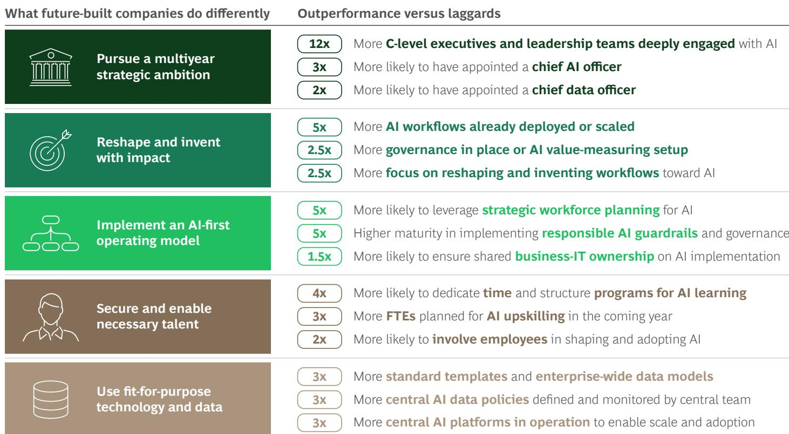  
Source: BCG Build for the Future 2025 Global Study (n = 1,250).
Note: FTE = full-time equivalent.

Future-built firms follow several organizing principles (see Exhibit 7):

\- Shared Ownership. One defining practice of these companies is a model of co-ownership between the business and IT. Each partner has clear decision rights and shared accountability. Future-built companies are 1.5 times as likely as others to adopt this shared model, and more than 40% of them (versus 19% of stagnating firms) explicitly embed shared ownership of AI into their governance. This ensures that technology and business leaders align on ambitious targets and scale AI with measurable impact. Future-built companies also strike a balance between empowering decentralized innovation and having accountable P&L owners in the center provide steering.

\- Top-Down Removal of Roadblocks. Future-built leaders tackle systemic challenges, such as filling talent gaps, implementing responsible AI, and breaking through technology and data bottlenecks, through top-down intervention. Their dedication to institutionalizing accountability makes them three times as likely as others to appoint a chief AI officer and twice as likely to designate a chief data officer. These roles not only help remove structural barriers, but also help drive cross-enterprise adoption.

\- Visible, Outspoken Executive Sponsorship. Senior executives in future-built organizations act as highly visible sponsors of AI. They articulate a unified AI vision, fund it as a strategic priority, and demonstrate that they are personally committed to embedding AI in strategic decision making. Nearly all C-level leaders actively use AI in their day-to-day activities, acting as role-models for adoption and pushing the scaling of initiatives across the enterprise.

A major global bank has piloted an AI-first greenfield transformation of its HR function as a top-down strategic program to show how the technology can fundamentally reshape employee journeys. Instead of scattering responsibilities across central, divisional, and functional HR units, the bank reimagined HR from “hire to retire.”

The bank's approach was not to optimize isolated processes, but to reinvent the HR function end-to-end with an AI-first lens. Three fundamental questions guided the redesign: Which employee customer journeys are relevant? Which parts can and should be covered by AI (including GenAI and agents)? Which tasks need to remain with the internal workforce?

# Future-Built Companies Get It Right with Joint Business-IT Ownership and C-Level Accountability

Future-built companies ensure joint ownership between IT and business teams for driving the AI implementation (%)

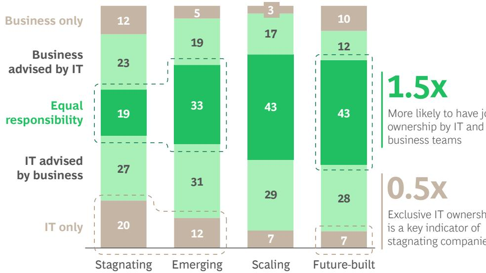

More likely to have joint ownership by IT and business teams

0.5x
Exclusive IT ownership is a key indicator of stagnating companies

Future-built companies institutionalize AI accountability

3x

More likely to have appointed a chief AI officer

2x More likely to have appointed a chief data officer

Source: BCG Build for the Future 2025 Global Study (n = 1,250).

Note: Because of rounding, not all bar segment totals equal 100%.

1“Who has primary ownership for driving the AI implementation in your company?”

2“Have you created dedicated roles to drive AI delivery and transformation in your company? (Select all that apply).”

The bank redefined a set of employee journeys (such as “I apply and join,” “I get feedback,” “I get rewarded,” and “I leave”)—and all the component parts—to serve as the backbone of the transformation. It anchored the redesign in four principles: the desired employee experience, the new operating model, required functional capabilities, and enabling technologies. Guided by these principles, the bank built a capability roadmap, sequenced by importance and impact, and defined clear KPIs (such as time-to-hire, 90-day retention rate, and cycle time for service requests) to track progress. Rather than claiming broad automation or quantified savings, the bank launched targeted prototypes—such as AI-enabled summarization of feedback to support line managers in the annual performance cycle—that demonstrated major efficiency gains and informed a high-level business case for future savings.

Senior leadership is visibly steering the program, supported by a small group of domain experts, to ensure speed, accountability, and the achievement of its value ambition. This approach will greatly accelerate HR performance and efficiency, and the bank can apply the resulting insights about core process reinvention with AI to other functions.

## Reshape and Invent with Impact

Future-built and scaling companies go beyond automating processes and workflows with AI to create value by reshaping existing businesses and inventing new ones. They rethink how work gets done with different forms of the technology, such as vision AI, which enables computers to analyze visual data and derive useful information from images and videos. Nearly 90% of future-built and scaling companies expect most of their AI value to come from reshaping and inventing business processes.

Consider the case of a global leader in water, hygiene, and sustainability solutions, which used AI to build an entirely new digital restaurant technology business powered by GenAI and vision AI. Starting with pilots in the US, the company created vision AI models to observe operations in the back-of-house of a restaurant and generate AI-driven after-action reports that included clear, actionable guidelines for optimizing speed of service, labor efficiency, and kitchen operations. The company earned 100% customer satisfaction in trials. It identified an addressable market of \$1 billion to \$1.5 billion with target revenue of about \$400 million in five years at twice the gross margin of its traditional product set. It is now scaling up the new initiative, using a combination of organizational skills and advanced technology to create a new business and revenue stream.

Successful companies also drive value by prioritizing their AI portfolios for financial or operational impact, which results in strong alignment of adoption and expected outcomes. Future-built and scaling companies achieve a 76% higher match between where AI is deployed and where it delivers impact. Prioritization accelerates implementation. Some 62% of initiatives at future-built companies have already been deployed, compared with 12% for laggards. Overall, these companies achieve faster time-to-impact—typically 9 to 12 months instead of 12 to 18 months. (See Exhibit 8.)

A consumer products company is boosting its global marketing function's efficiency by using a data-driven prioritization process to streamline and simplify marketing campaign development. The marketing function employs multiple teams that work on different brands in more than 50 markets. A project team used a department-wide survey to map all of the company's campaigns, activities, and allocated resources. The map helped identify the most promising opportunities for optimization through AI and their estimated value potential. The resulting feasibility matrix highlighted the most value-promising workflows. Integrating AI into these workflows has enabled the

company to improve the efficiency of its marketing, mostly through internal and external cost reductions, such as agency cost and process streamlining. It achieved savings of 25% to 40% in time spent on content creation, brand planning, and reporting, and it doubled its speed to market for campaign activation with better-quality deliverables. It is now following a proven playbook to scale AI in other functions, such as sales, supply chain management, and R&D.

Leaders consistently track and report results. More than 60% of future-built firms rigorously track AI value, compared with only 17% of stagnating companies.

## Adopt an AI-First Operating Model

Future-built companies understand the need to move fast, but they are equally attentive to evolving their operating model over time along multiple dimensions. An effective AI operating model does not focus on replacing people with technology; it entails reimagining the company around AI. Humans are no less critical to the process than before, but they have redesigned roles in workflows that are restructured to include digital workers.

## EXHIBIT 8

Efficient Prioritization Enables Future-Built Companies to Deploy and Scale More Workflows Faster

Future-built companies have over 5x the AI workflows in deployment (\%)...

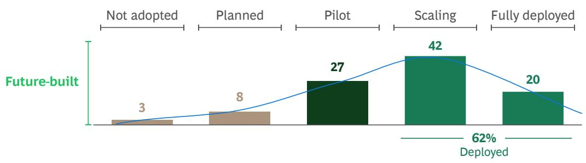

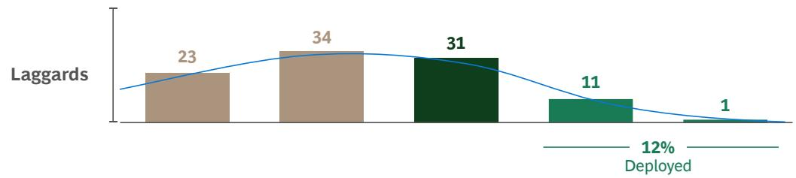  
Source: BCG Build for the Future 2025 Global Study (n = 1,250).

... and are up to 2x faster

Average number of months required to fully deploy

9-12

Planning accuracy increases with experience of full deployment

12–18

Likely overly optimistic without prioritization and a clear roadmap

As they move the organization toward an AI operating model, the C-suite needs to answer a new set of design questions, including the following:

\- How can we deliver these outcomes differently by leveraging AI agents? What key workflows can we reshape with AI? (It’s important in this context to think in terms of reinvention rather than incremental improvement, as the global bank described earlier did.)

\- Where will humans continue to provide distinctive value in reshaped workflows?

\- How do human and digital workers coexist with appropriate accountability in hybrid structures?

\- How do we ensure that our responsible AI program has teeth and is followed?

\- Recognizing that AI deployments are rarely perfect, how do we build fast feedback loops?

\- What's the best balance between centralizing expertise in centers of excellence versus democratizing AI usage across the organization?

Although these questions are complex—and the answers are often even more so—future-built companies embrace the shift deliberately. They move from people-centered processes augmented by digital tools to AI-agent-centered processes orchestrated by people. They are five times as likely as laggards to engage in strategic workforce planning for AI. Two aspects of the new model are particularly important: governance and partnerships within the ecosystem.

As a senior retail executive told us, “It is important to get the operating model right as more AI solutions are deployed. We concentrate in particular on senior sponsorship and ownership of AI benefits by the businesses, which creates the room to invest in foundational data and on the right capabilities for the AI buildout. In our model, the AI capital allocation is managed centrally to make sure we are prioritizing the largest opportunities, but the amortization is carried by the business teams to ensure that they have skin in the game and own the impact.”

Governance. Future-built companies strike a balance between empowering decentralized innovation and maintaining central steering with accountable P&L owners in the center. These companies are 1.5 times as likely to have their IT and business functions share ownership of the transformation with clear decision rights, 4.6 times as likely to have fit-for-purpose guardrails, and 2.6 times as likely to have rigorous tracking of AI value across the organization. They set out clear AI-driven KPIs and a plan for top-down showcasing of AI-first progress.

Partnerships Within the Ecosystem. Working with external experts is important in the AI operating model. Partnerships are often the best—and sometimes the only—way to secure the requisite talent, gain greater flexibility and access to the latest technology, and enable speedier shifts in how the organization operates. These ventures can create new engines for value creation, and in some markets they may be the only way for companies to operate.

Most companies need to think through how to remodel in-house and external resources to boost the successful use of large-scale partnerships. Indeed, the rapidly maturing supplier ecosystem—including maturing language models and more agentic AI offers by function and sector from hyperscalers, platform companies, and a plethora of AI-native application providers—should give executives at non-future-built companies an incentive to explore what partnerships can do to accelerate their AI programs.

## Secure and Enable the Necessary Talent

Media reports tend to focus on projected job losses resulting from AI, and undoubtedly some jobs, especially ones involving more structured and repetitive tasks, will go away. Nevertheless, for an AI operating model to work, access to human talent is more critical than ever. Future-built companies understand this. They recognize that scaling AI requires access to scarce talent, and they act decisively to attract, retain, and upskill individuals who can orchestrate and oversee AI agents in designing, deploying, and managing next-generation AI capabilities without delay. In the short term, this means hiring knowledgeable talent. In the medium to long term, though, it means building the infrastructure and systems required to assess shifting talent and skill needs, retrain and upskill current staff while reinventing workflows, manage a hybrid worker environment, and manage an overall evolution in people skills mix.

Upskilling and Engaging the Workforce. Future-built firms invest in broad-based employee enablement. They pair bold training ambitions with widespread engagement: more than 50% of employees at these companies are expected to be upskilled in AI in 2025, compared with only 20% at laggards. Future-built firms are also four times as likely to carve out time for structured learning. As a result, 50% more staff use AI in their daily work, shifting their contributions to higher-value activities such as strategic thinking, judgment, and human–AI collaboration.

Co-Design and Workflow Redesign. To accelerate adoption, future-built companies engage employees actively in co-designing AI solutions. Integrating agents into a workflow is not a matter of bolting them onto legacy processes—it requires reimagining the workflow end-to-end, bringing human and digital workers into functional harmony, and enabling interoperability across cloud-based, on-premises, and external ecosystems of AI agents and tools. Future-built companies involve the workforce twice as often as others do in reshaping workflows as they build, test, and deploy agents. This inclusiveness ensures smoother adoption and builds ownership and trust. These firms recognize that as the AI operating model takes hold, the role of humans evolves dramatically. Companies must look after AI workers as well as human colleagues so that both deliver optimal outcomes together. With the spread of AI, and especially of agents, humans must play a lead role in reimagining future agents and workflows.

Hybrid Worker Environments and Skills Evolution. Operating in a hybrid worker environment—one in which humans and AI agents collaborate—calls for new management capabilities. AI reshapes roles by automating routine processes, narrowing performance gaps in structured tasks, and amplifying the edge of top performers in complex, judgment-driven work. Future-built firms anticipate these shifts by assessing AI-first skill sets, adapting current roles, and creating new ones as required. The workforce mix shifts away from repetitive processes toward creativity, innovation, and contextual market insight. Managers act as role models for adoption. Human roles increasingly emphasize oversight, decision making, and confirmation that human and digital workers are delivering outcomes together.

## Use Fit-for-Purpose Technology and Data

Future-built companies recognize that capturing value from AI requires more than just adding new tools; it demands rewiring the firm's architecture and processes around the new technology. Two years on from the launch of ChatGPT, many firms face a growing "GenAI burden"—a portfolio of siloed proofs-of-concept that cannot scale, duplicated effort across the business, rising costs, and ever-more-complex security needs. To avoid this, the best companies adopt a strategic, horizontal tech stack with a dedicated agent and AI platform layer to control costs and risk, scale intelligently, and prove value incrementally.

As the use of agents multiplies, fragmented architectures that force teams to rebuild models from scratch are no longer viable. Future-built firms sidestep this problem by embracing a flexible, portfolio approach to technology. Recognizing that there is no single end-state architecture, they curate a mix of solutions to serve specific needs. This strategy involves making deliberate choices across four broad options for sourcing agentic capabilities:

\- Standalone Agentic Solutions. Turnkey applications for narrow tasks, such as coding or research assistants

\- Embedded Agentic Solutions. Capabilities integrated directly within major enterprise platforms like CRM or ERP, leveraging native data and governance

\- Agent Builder Platforms. Low-code or self-serve platforms that empower teams to build custom agents by using modular components

\- Custom-Built Agent Solutions. Tailor-made agents developed from scratch for differentiating use cases that require bespoke logic, heavy orchestration, or strict performance controls

Most companies find that a hybrid approach is the most effective strategy for balancing market solutions with internal customization. Our research shows that only 11% of firms rely primarily on in-house development, and just 4% depend on a single, end-to-end vendor for their full AI stack. However, buying solutions everywhere without prioritization risks fragmentation and poor adoption.

Clear principles guide the hybrid portfolio strategy. Smart companies focus on core enablers such as data readiness and internal skills—platform-agnostic investments that deliver sustained value. It is also essential to treat the ownership of models and prompts as a strategic lever and to make conscious choices about when to adopt, adapt, or assemble solutions to maintain control and differentiation.

A consistent platform strategy ties these technology choices together. Future-built firms are three times as likely to operate a central, integrated AI platform as the backbone for their AI deployment. This platform approach has a compounding effect: the company builds common capabilities for security, monitoring, and orchestration once and then reuses them, ensuring that each new use case strengthens the platform, accelerates the next, and moves toward enterprise-level scale. To support this effort, more than half of future-built companies maintain centralized repositories of reusable models and prompts, drastically reducing duplicative work.

Finally, leaders implement a strong data foundation that allows business units to harness shared platforms and external partners. More than 50% of future-built firms operate on a single enterprise-wide data model, compared with just about 4% of their stagnating peers. This gives teams rapid access to reliable data for building tailored solutions. The data foundation is centrally steered but permits ingestion of data from different domains, creating both efficiency and scalability.

Future-built firms reinforce their data foundation with strong governance. These companies are three times as likely to enforce enterprise-wide data policies through central oversight teams, ensuring quality, trust, and responsible use. Central steering, combined with shared business accountability, safeguards data integrity while giving business units the ownership necessary to keep data current and usable.

# How to Accelerate AI Value Creation

Are you ready?

CEOs and their boards must make deploying AI for value a top priority. Most will need to overcome organizational reluctance, complex IT, poor data integrity and access, and workforce concerns about job losses and AI weaknesses. But articulating a clear ambition with a strong focus on value, as well as moving beyond a cost-only approach to emphasize innovation and competitive advantage, will put them on the right path. Future-built companies have given them a proven playbook to follow.

Each company will follow its own path, depending on its current capabilities. To identify the appropriate starting point, companies should assess and benchmark their current capabilities and highlight gaps with competitors. Laggards can follow the future-built playbook described in the previous chapter to move up the maturity curve, starting with a firm and bold commitment from top management and a sustained effort to translate business objectives into an overarching vision and strategy. Companies that are already scaling AI initiatives should invest (and reinvest their gains) in forward-looking capabilities, such as agentic AI innovation. (See Exhibit 9.)

Adherence to our 10-20-70 rule for technology transformations will help speed the journey: $70\%$ of a business's strategic focus should be on the people and processes, $20\%$ on the tech, and $10\%$ on algorithms.

(See Exhibit 10.) Our research shows that most roadblocks involve people, organization, and processes. In 2024, companies struggled with aligning AI to the overall strategy and establishing a business case, but now the priority has shifted to more concrete implementation challenges such as adoption of AI tools and management of unstructured data.

Still, companies that try to jump straight into reshaping and invention without taking the preliminary step of building the necessary capabilities—such as an AI-first operating model, people skills, and relevant technology—typically fail.

Successful AI implementation requires active collaboration with the tech ecosystem to overcome adoption bottlenecks involving orchestration layers, system connectivity, and enterprise data strategies. For all companies, interoperability is critical. Without open standards, each agent is at risk of becoming a silo. Initiatives such as the Model Context Protocol promote reusability across workflows, reduce deployment costs, and help avoid vendor lock-in.

The most important point is that time is short. The technology is advancing fast, making catching up more difficult with each passing week. Future-built companies are pulling away, widening the value gap, and putting slow movers in a deeper value hole. The others need to move now.

## The Future-Built Playbook for Climbing the AI Maturity Curve

Pursue a multiyear strategic ambition

Reshape and invent with impact

Implement an AI-first operating model

Secure and enable necessary talent

## Move up to scaling

Develop AI strategy, advance AI capabilities, and scale AI effectively

\- Set up an AI program with an ambitious top-down value target

\- Prioritize high-ROI workflows in a rigorously tracked roadmap

\- Ensure leadership commitment to AI transformation and practical usage

\- Select one or two business domains for end-to-end AI-first redesign

\- Establish an AI delivery office as accelerator, tracking progress and value

## Use fit-for-purpose technology and data

\- Set up joint business/IT teams for prioritized workflows with clear KPIs

\- Support practical application of AI tools in day-to-day work

\- Start an AI upskilling effort with protected time

\- Define guardrails and set up for a scalable, modular AI architecture

\- Leverage AI workflows to implement and enhance the AI architecture

## Move up to future-built

Take the forefront of AI innovation and cutting-edge AI capabilities, generating substantial value

\- Focus on achieving the concrete path to value that you defined

\- Advance in forward-looking capabilities such as agentic AI

\- Scale AI workflows to unlock P&L impact across functions

\- Invent new end-to-end AI-first workflows to shape the market

\- Scale the AI ecosystem with long-term partnerships so all participants have skin in the game

\- Empower teams to own AI solutions with joint business/IT ownership

\- Ensure enterprise-wide access and adoption of AI tools and workflows

\- Double down on workforce transformation to prepare for agentic AI

\- Drive enterprise-wide deployment of AI platforms at scale

\- Refine data and architecture management to increase effectiveness

Future-built

Source: BCG analysis.

## EXHIBIT 10

## Most AI Roadblocks Involve People, Organization, and Processes BCG's 10-20-70 model Key challenges named by respondents (%)

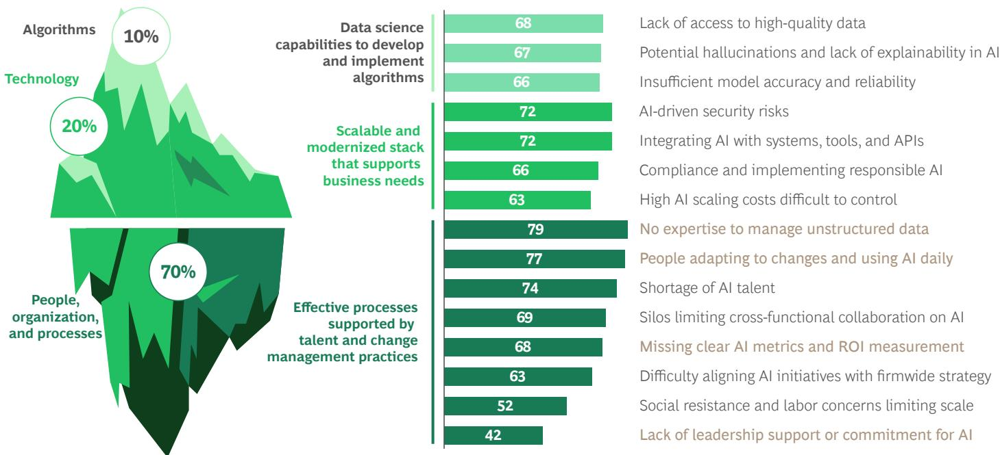  
Source: BCG Build for the Future 2025 Global Study (n = 1,250).

Significantly higher for laggards versus future-built

## Appendix

## AI Definitions

## AI Maturity Categories

\- Stagnating. Are taking minimal or no AI action, lack foundational capabilities, and are not generating value

\- Emerging. Have developed foundational capabilities and started initial experimentation, but are struggling to scale and generate value

\- Scaling. Have developed an AI strategy and advanced capabilities, and are scaling them effectively while starting to generate value

\- Future-built. Are at the forefront of AI innovation, systematically building cutting-edge AI capabilities across functions and consistently generating substantial value

## AI Operating Model

An AI operating model is an enterprise-wide way of working in which AI is co-owned by business and IT, embedded in governance, and funded as a strategic program led by top management. It requires top-down leadership to provide speed, clarity, and certainty, avoiding fake AI traps that occur when middle management disperses effort across small pilots without generating real value.

## AI Value Realization Pathways

\- Deploying. Boosting efficiency with GenAI tools (for example, in code generation, invoice reconciliation, and meeting summaries)

\- Reshaping. Transforming core business workflows (for example, marketing, supply chain, and customer service) for productivity, quality, and speed

\- Inventing. Creating AI-native offerings that unlock new revenue models (for example, hyper-personalized experiences, AI-powered products, and data monetization)

## AI Technologies

\- Predictive AI. The use of artificial intelligence to analyze historical and current data and make predictions about future events or trends

\- Generative AI. The use of artificial intelligence to generate new, realistic content by learning and replicating patterns

\- Agentic AI. A model of artificial intelligence execution with autonomous agents that can observe, reason, plan, use tools, and act, coordinating across workflows, tools, and systems with minimal human input; these agents incorporate predictive as well as GenAI, and vary enormously in terms of workflow complexity

\- Vision AI. A type of artificial intelligence that can analyze and interpret visual data sources, such as images or videos

## AI Ecosystems and Partnerships

AI ecosystems and partnerships are networks of external providers (hyperscalers, platform vendors, and specialized AI firms) that companies can engage to accelerate adoption and scale. Strategic users of ecosystems are significantly more likely to adopt GenAI and agentic AI, reuse models and prompts across workflows, and generate greater value.

## Machine Learning

Machine learning (ML) is a branch of AI that uses algorithms and statistical models to identify patterns in data and automatically improve performance through real-world experience, without being explicitly programmed to take specific new data points into account. ML underpins predictive AI and is a foundational enabler for generative and agentic AI.

## Workflow

Workflow is a structured sequence of tasks, activities, and decisions designed to deliver a business outcome within a function or across functions. In the context of AI, companies are increasingly reimagining workflows end-to-end, with agents and automation taking over routine steps while humans provide orchestration, judgment, and oversight. Workflows are the core unit of value creation in AI transformations, as they determine how efficiently and effectively work gets done across the enterprise.

## Survey Methodology

We designed our 2025 Build for the Future survey to focus on the AI capabilities necessary to support strategic objectives, deliver significant business value, and identify and capitalize on new market possibilities.

Accordingly, we built our comprehensive AI maturity score on 41 foundational capabilities, each measured along four clearly defined maturity stages: stagnating, emerging, scaling, and future-built.

Next, we sorted the weighted scores into four numerical ranges:

\- Stagnating: 0–25

\- Emerging: >25–50

\- Scaling: >50–75

\- Future-built: >75–100

Our survey asked 1,250 CxOs and senior executives who are AI decision makers across more than 25 sectors to estimate their companies' AI maturity along all 41 capabilities, including outcomes in customer experience and operations in response to sector-specific questions. We drew insights on AI maturity and value from self-reported data provided by the respondents. Results reflect the business area that the respondents know best—not always the full company. Unless explicitly stated as realized (for

example, as completed by the end of 2024), reported numbers reflect expected future impact. Although we took all available precautions to achieve highest data quality, responses may be subject to perception bias.

Respondents came from 68 countries in Asia, Europe, and North America and from nine industries: consumer goods; energy; financial services; health care; industrial goods; insurance; public sector; technology, media, and telecommunications; and travel, cities, and infrastructure. (See the exhibit.)

Financial metrics (for example, TSR and EBIT) are sourced via CapitalIQ and Orbis. Overall company performance has multiple drivers beyond AI.

We applied multivariate statistical methods such as random forest, logistic regression, and structural equation modeling (partial least squares regression) to calculate regression weights.

## 1,250 Responses Covering All Regions and Industries, as Well as a Wide Range of Company Sizes and Executive Positions

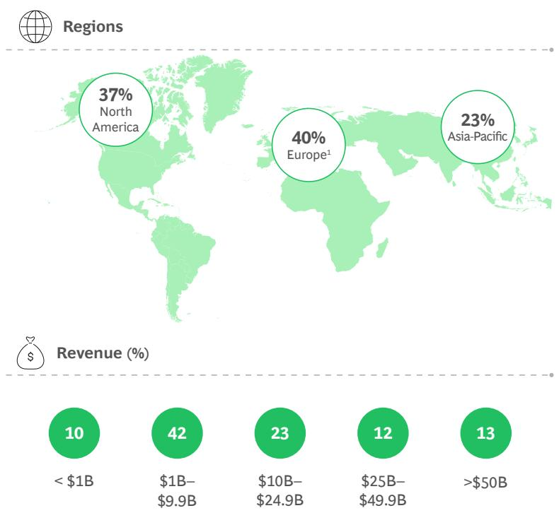  
Source: BCG Build for the Future 2025 Global Study (n = 1,250). Note: B = billion. $^{1}$ Europe includes data points from Africa and South America.

  
Profile of respondents (%)

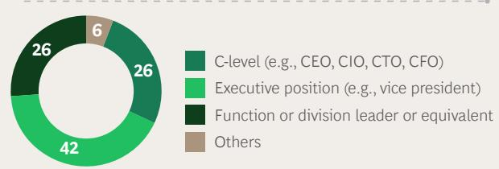

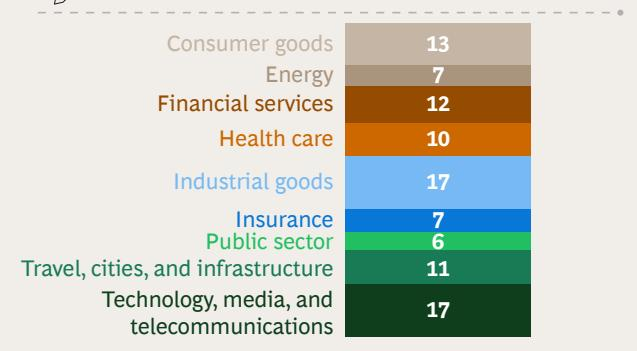

## About the Authors

Jessica Apotheker is a managing director and senior partner in the Paris office of Boston Consulting Group, and the global CMO for BCG and BCG X. You may contact her by email at apotheker.jessica@bcg.com.

Nicolas de Bellefonds is a managing director and senior partner in BCG's Paris office. You may contact him by email at debellefonds.nicolas@bcg.com.

Marc Roman Franke is a partner and associate director, AI and digital transformation, in BCG's Berlin office. You may contact him by email at franke.marcroman@bcg.com.

Nina Kataeva is a managing director and partner in BCG's Zurich office. You may contact her by email at kataeva.nina@bcg.com.

Vinciane Beauchene is a managing director and partner in the firm's Paris office. You may contact her by email at beauchene.vinciane@bcg.com.

Patrick Forth is a senior advisor and senior partner emeritus in the firm's Sydney office. You may contact him by email at forth.patrick@advisor.bcg.com.

Michael Grebe is a managing director and senior partner in the firm's Munich office. You may contact him by email at grebe.michael@bcg.com.

Santeri Kirvelä is a managing director and senior partner in the firm's Helsinki office. You may contact him by email at kirvela.santeri@bcg.com.

Djon Kleine is a managing director and partner in BCG's Los Angeles office. You may contact him by email at kleine.djon@bcg.com.

Vladimir Lukic is a managing director and senior partner in BCG's Boston office and is the global leader of the firm's Tech and Digital Advantage practice. You may contact him by email at lukic.vladimir@bcg.com.

Mary Martin is a managing director and senior partner in BCG's Denver office. You may contact her by email at martin.mary@bcg.com.

Christoph Schweizer is CEO of Boston Consulting Group.

## For Further Contact

If you would like to discuss this report, please contact the authors.

Romain de Laubier is a managing director and senior partner in the firm's Singapore office. You may contact him by email at delaubier.romain@bcg.com.

Amanda Luther is a managing director and senior partner in the firm's Austin office. You may contact her by email at luther.amanda@bcg.com.

Jeff Walters is a managing director and senior partner in the firm's Hong Kong office. You may contact him by email at walters.jeff@bcg.com.

## Acknowledgments

The authors extend their gratitude to everyone who contributed to the research and development of this report, including Charles Adamo, Florence Adida, Julie Bedard, Giuseppe Colombo, Maunoir de Kerros, Cyprien d'Harcourt, Anna Dorkel, Camille Duranton, Eva Engelhardt, Caroline Girard, Rim Hachani, Matthew Kropp, Nikolaus Lang, Michael Leyh, Deborah Lovich, Clemens Nopp, Lucas Quarta, Clémentine Remy, Lee Robertson, and Jürgen Rogg.

## BCG

Boston Consulting Group partners with leaders in business and society to tackle their most important challenges and capture their greatest opportunities. BCG was the pioneer in business strategy when it was founded in 1963. Today, we work closely with clients to embrace a transformational approach aimed at benefiting all stakeholders—empowering organizations to grow, build sustainable competitive advantage, and drive positive societal impact.

Our diverse, global teams bring deep industry and functional expertise and a range of perspectives that question the status quo and spark change. BCG delivers solutions through leading-edge management consulting, technology and design, and corporate and digital ventures. We work in a uniquely collaborative model across the firm and throughout all levels of the client organization, fueled by the goal of helping our clients thrive and enabling them to make the world a better place.

For information or permission to reprint, please contact BCG at permissions@bcg.com. To find the latest BCG content and register to receive e-alerts on this topic or others, please visit bcg.com. Follow Boston Consulting Group on LinkedIn, Facebook, and X (formerly Twitter).

BCG