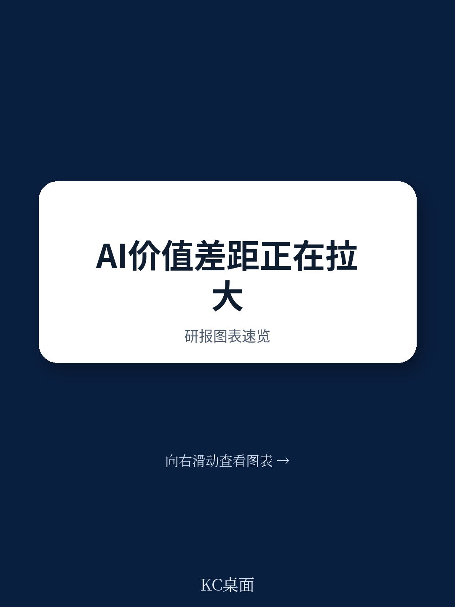
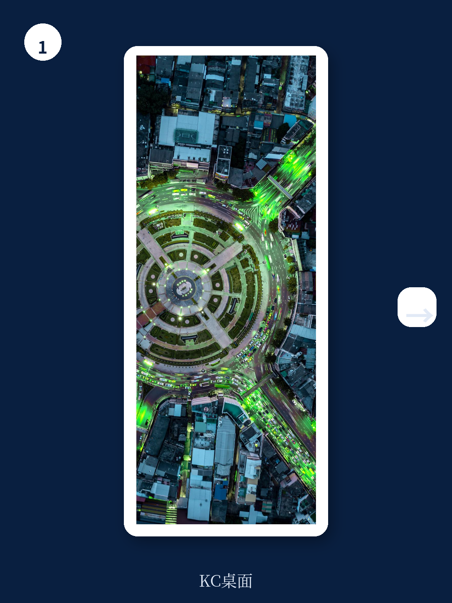
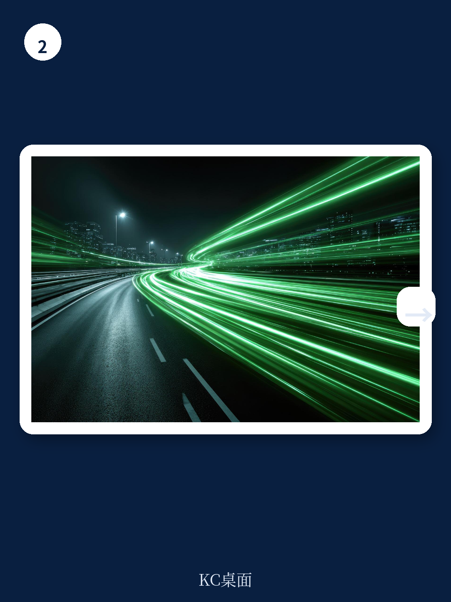

# 波士顿咨询：5%的公司正在拉大AI价值鸿沟，其余95%面临被锁定的风险

AI投资的回报正在出现一个令人不安的分化。波士顿咨询公司（BCG）在2025年对全球超过1250家企业的研究显示，只有5%的公司真正从AI中获得了可观的商业价值。这5%的企业，BCG称之为“未来构建者”，不仅在营收增长和EBIT利润率上显著领先，更关键的是，他们正在利用AI回报进行再投资，形成一个加速的价值创造循环。而其余95%的公司，尤其是60%几乎没有看到任何实质性回报的企业，正面临被锁定在“落后循环”中的风险。

这份报告最值得关注的判断不是AI是否有价值，而是价值正在被极少数公司加速收割。这种差距不是线性的，而是指数级的。它意味着，对于大多数企业决策者而言，现在的核心问题已经不是“要不要投AI”，而是“如何避免被越甩越远”。

BCG的报告提供了一个清晰的路线图，但同时也提出了一个尖锐的问题：在AI技术，特别是代理型AI加速迭代的当下，你的组织是否有能力在12-18个月内完成从“实验”到“重塑”的跨越？

## 1. 真正的价值鸿沟不在技术，而在“未来构建者”的五项战略能力

BCG将企业AI成熟度划分为四个层次：未来构建者（5%）、扩展者（35%）、新兴者（46%）和停滞者（14%）。未来构建者与其他企业的差距是全方位的：营收增长是后者的1.7倍，三年股东总回报是3.6倍，已动用资本回报率是2.7倍。这些数字不是来自某个AI试点项目，而是来自整体业务运营的系统性改变。

这些领先企业并非拥有更先进的算法或更多的GPU。他们的优势在于五项相互关联的战略能力：清晰的多年期AI愿景、以冲击力为导向的业务重塑、AI优先的运营模式、人才保障策略，以及灵活的技术与数据架构。这五项能力共同构成了一个飞轮：愿景驱动资源投入，重塑产生价值，运营模式确保落地，人才提供持续动力，技术架构则让这一切可扩展。

> **KC评论：** 许多企业把AI转型等同于购买一套软件或建立一支数据科学团队。BCG的数据表明，这种做法几乎注定失败。真正的门槛在于能否将AI嵌入到从战略到执行的每一个环节，而这需要CEO层面的持续承诺，而非CTO或CDO的孤军奋战。完整报告中包含了对这五项能力的详细诊断框架和评分卡，可以帮助企业定位自己的真实位置。

## 2. 70%的AI价值集中在核心业务，IT职能的跃升值得关注

BCG的研究发现，AI价值的70%集中在核心业务职能中，包括销售与营销、制造、供应链和定价。其中，研发与创新单独贡献了15%的潜在价值。这意味着，AI不是IT部门的工具，而是业务部门的核心竞争力。

一个值得注意的变化是，IT职能的AI价值占比从2024年的7%跃升至2025年的13%，增加了6个百分点。这背后反映的是AI正在从“辅助工具”演变为“基础设施”。当AI开始重塑IT本身的运作方式——例如通过智能监控、自动化运维和代码生成——IT部门也从成本中心转变为价值创造中心。

具体到工作流层面，BCG的数据展示了已经实现规模化部署的案例。例如，在能源行业，AI驱动的预测性维护可以帮助企业避免30%的可处理成本。在消费品行业，AI驱动的需求预测和库存优化正在显著提升库存周转率和客户满意度。这些不是未来的可能性，而是已经发生的现实。

> **KC评论：** 对于制造、零售、能源等传统行业，这份报告提供了一个非常实用的切入点：不要试图全面铺开，而是聚焦于2-3个核心工作流，用AI实现端到端的重塑。完整报告中包含了一张按行业和职能分类的价值潜力热力图，可以帮助企业快速识别自己的高价值领域。

## 3. 代理型AI正在成为价值鸿沟的最大加速器

2024年的报告中几乎未提及的代理型AI，在2025年已经占到AI总价值的17%，并且预计到2028年将达到29%。代理型AI结合了预测性AI和生成式AI的能力，可以自主推理、学习和执行任务。它不是简单的聊天机器人或自动化脚本，而是可以像数字员工一样，在人类监督下完成复杂的业务流程。

BCG给出了一个生动的案例：一家全球美妆公司部署了行业首个大规模虚拟美容顾问，整合了AI咨询、实时个性化和统一数据平台，在不到12个月内上线，预计将带来1亿美元的增量收入，使传统电商客户路径的ROI翻倍。这个案例的关键在于，它不是孤立的试点，而是嵌入到超过20个市场和8个品牌的网站和电商旅程中。

另一个案例是一家领先的电子设备制造商，它在超过200家工厂中建立了“公司商店”式的中央代理型AI解决方案库，实现了复杂运营工作流中80%的自动化。这些代理可以被重复使用，加速了新工作流的部署。

> **KC评论：** 代理型AI的部署有一个重要前提：必须先有扎实的数据基础、规模化的AI能力和清晰的治理框架。试图在没有这些基础的情况下直接上马代理型AI，就像在没有地基的情况下盖摩天大楼。完整报告中详细讨论了代理型AI的部署路线图、常见陷阱和治理框架，这部分内容对任何计划引入代理型AI的企业都极具参考价值。

## 4. 报告尚未完全回答的关键问题：人才鸿沟与组织变革的深水区

BCG报告清晰地指出了未来构建者的五项能力，但有一个问题并未完全展开：当企业决定从“停滞者”或“新兴者”向“未来构建者”转型时，最大的瓶颈是什么？

报告提到了人才问题——未来构建者计划对超过50%的内部员工进行大规模技能提升——但未深入讨论一个更根本的挑战：如何在组织内部建立“AI优先”的文化和决策机制。这不仅仅是培训几万名员工使用Copilot的问题，而是需要重新定义工作流程、绩效评估和职业发展路径。

另一个未解的问题是：对于那些已经投入了数亿美元但回报甚微的企业，他们应该如何“止损”并重新规划？报告提供了“加速AI价值创造”的框架，但对于如何识别和关闭那些注定失败的项目，着墨不多。这些正是企业决策者在读完报告后最需要进一步探讨的问题。

## 5. 你的观察框架：三个信号判断企业是否走在正确的轨道上

基于BCG的研究，我们可以建立一个简单的观察框架，帮助判断一家企业是否正在从“实验模式”转向“价值创造模式”。

第一个信号是CEO是否亲自介入AI议程。如果AI项目主要由CTO或CDO推动，且CEO只在季度战略会上过问，那么这家企业很可能停留在“新兴者”阶段。未来构建者的AI议程是由CEO和董事会自上而下推动的，并且设定了可量化的成本和收入目标。

第二个信号是AI投资是否集中在少数几个端到端的工作流上，而不是分散在几十个试点项目中。BCG的数据显示，价值来自于“重塑和发明”，而非“自动化孤岛”。如果一家企业有超过10个AI试点项目但没有一个实现规模化部署，这通常是一个危险信号。

第三个信号是人才策略是否从“招聘”转向“大规模技能提升”。未来构建者不是依赖外部招聘来填补AI人才缺口，而是对现有员工进行系统性的再培训。如果一家企业仍然主要通过猎头来寻找AI人才，它可能低估了组织变革的深度。

这些信号不仅适用于评估自己的企业，也适用于评估投资组合中的公司。对于投资者而言，那些展现出这些信号的企业，更有可能在未来的AI价值竞赛中胜出。

---

BCG的这份报告提供了一个残酷但诚实的结论：AI的价值正在被极少数企业加速收割，而大多数企业还在原地打转。好消息是，领先者的路线图是清晰的，并且对所有企业开放。坏消息是，时间窗口正在收窄——代理型AI的崛起意味着差距只会加速扩大。

如果你对BCG报告中提到的五项战略能力的详细诊断框架、按行业分类的价值潜力热力图、以及代理型AI的部署路线图感兴趣，这些内容在完整报告中都有更深入的展开。在我们的社群中，每天会由AI agent结合人工审阅，生成包括BCG、麦肯锡、高盛等国际顶级机构的研报中文摘要与深度评论，每日更新约10-40页，涵盖最新数据图表合集，既方便喂给AI模型，也方便人工快速把握市场动态。欢迎加入讨论。

Personal reading notes and learning share only. Not investment advice.

