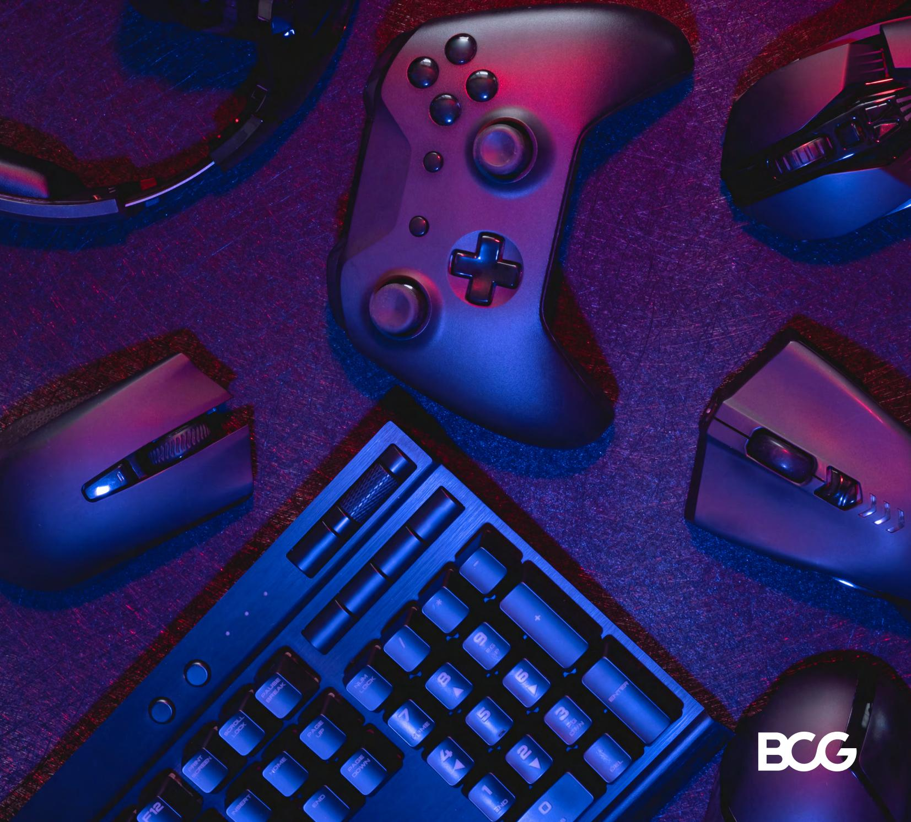

VIDEO GAMING REPORT 2026

# How Platforms Are Colliding and Why This Will Spark the Next Era of Growth

December 2025
By Ernesto Pagano, Giorgo Paizanis, Povilas Joniškis, Niels Danielsen, Francisco Smart, Siddharth Modi, and Henry Anderson

## Contents

03 Introduction
07 GenAI: Opportunities and Risks
10 Platform Evolution: From Console Wars to Cloud Wars
13 UGC: Welcome to the New Creator Economy
16 App Stores Opening Up: A Revolution for Distribution
19 Improving Monetization: The New Math of Game Pricing
23 Growth Through Disruption
24 About the Global Gaming Survey
24 About the Authors

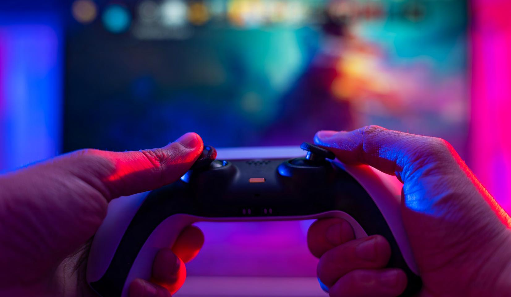

## Introduction

As 2025 comes to a close, the video game industry is emerging from its post-pandemic slump and ready to enter a new, more upbeat era. Employment and investment in the sector are stabilizing; growth is starting to pick up.

This cautiously optimistic industry outlook is evident in BCG's latest Global Gaming Survey of approximately 3,000 gamers, as well as in numerous conversations with industry leaders and our work with companies in the industry. These data points suggest that the long-awaited end to the three-year “video game winter” is imminent, although growth will not return to the rates achieved during the 2010s, when the industry doubled in size in a decade. (See Exhibit 1.)

One ground for optimism is that gamers remain passionate about gaming. Around 55% of gamers in our survey have increased their gaming time over the past six months. In addition, gaming parents told us they are introducing the children to the activity early, creating a pipeline of new players. About 44% of such parents say that their children are playing video games by the age of five, and two of the three most popular first games that their children play include a significant amount of user-generated content (UGC): Minecraft and Roblox. (See Exhibit 2.)

## EXHIBIT 1

# Gaming Industry Growth Is Set to Increase, Ending the Post-Pandemic Slowdown

GLOBAL GAMING REVENUE BY TYPE (\$BILLIONS)

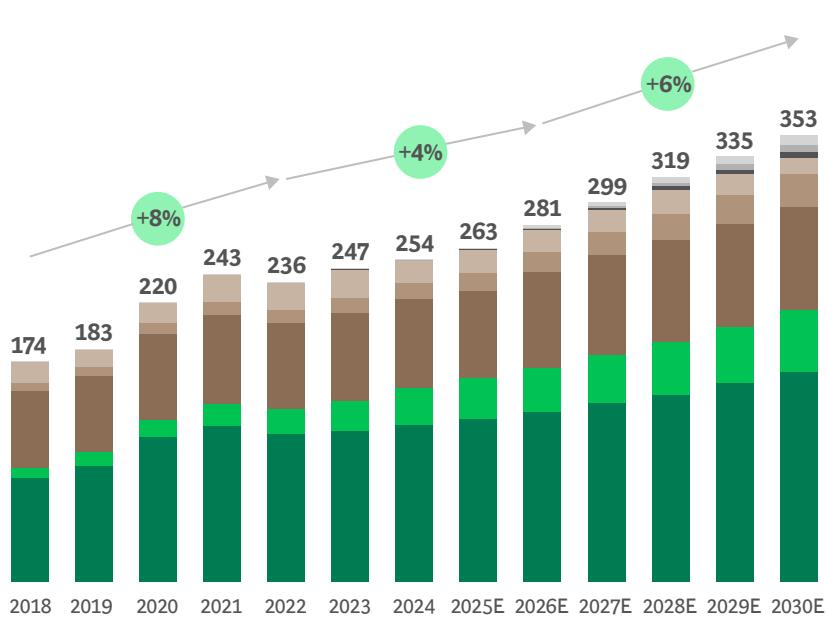

<table><tr><td rowspan="2"></td><td colspan="2">REVENUE ($BILLIONS)</td><td colspan="2">CAGR (%)</td></tr><tr><td>2025E</td><td>2020-2025E</td><td colspan="2">2025E-2030E</td></tr><tr><td colspan="5">Cloud</td></tr><tr><td>Streaming service</td><td>0.6</td><td>57</td><td colspan="2">69</td></tr><tr><td>Multigame subscription</td><td>0.4</td><td>52</td><td colspan="2">74</td></tr><tr><td>Game transactional</td><td>0.5</td><td>66</td><td colspan="2">59</td></tr><tr><td colspan="5">PC and console</td></tr><tr><td>Console hardware</td><td>18.3</td><td>3</td><td colspan="2">-7</td></tr><tr><td>Multigame subscription</td><td>13.7</td><td>10</td><td colspan="2">13</td></tr><tr><td>Game transactional</td><td>69.6</td><td>0</td><td colspan="2">3</td></tr><tr><td colspan="5">Mobile</td></tr><tr><td>Advertising</td><td>31.9</td><td>19</td><td colspan="2">9</td></tr><tr><td>In-app purchases</td><td>128.7</td><td>2</td><td colspan="2">5</td></tr></table>

Sources: Ampere Analysis; SensorTower; BCG analysis of historical and forecasted data.
Note: Console hardware data includes handheld PC devices. In-app purchases include mobile subscriptions such as Apple Arcade. CAGR = compound annual growth rate.

## EXHIBIT 2

Almost Half of All Gamer Parents' Kids Start Playing Video Games by Age 5, and Two of Their Most Common First Games Contain UGC

Today, more than 50% of respondents' children began their digital journey by age 5, and about 77% began playing video games by age 7

Q: How old was your child when they had their first digital experience? (%)

Q: How old was your child when they first started playing video games? (%)

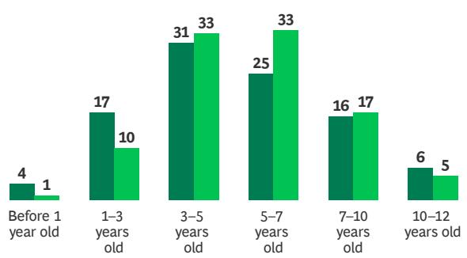  
Two of the three most popular first games for kids are UGC games: Minecraft and Roblox  
Q: What was the first video game your child ever played? (%)

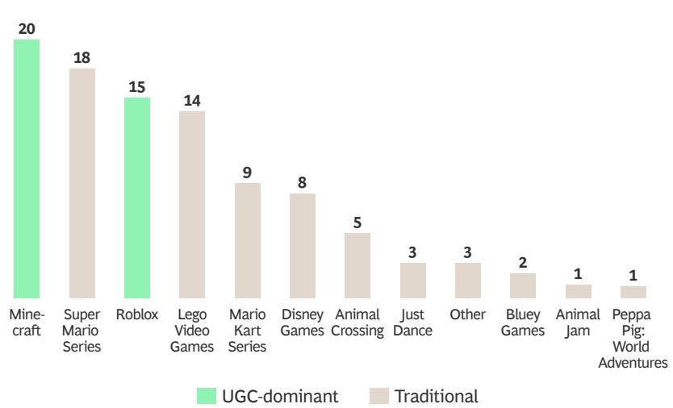  
Sources: BCG Global Gaming Survey 2025 (N = 2,972); BCG analysis.
Note: UGC = user-generated content. Because of rounding some bar chart totals do not add up to 100%.

Adults are increasing their engagement with games and are continuing to play later in life. In our survey, 40% of baby boom gamers and 50% of Gen X gamers report spending five hours or more each week playing video games. Many adult gamers are introducing the next generation to gaming as well, with 57% of parents saying that they introduced their child to video games. (See Exhibit 3.) This intergenerational influence helps explain why Gen Alpha and Millennials share similar preferences for primary platforms (PlayStation and Nintendo Switch), while Gen Z shows a slightly stronger inclination toward PC gaming. Millennials, the first generation to grow up with PlayStation and Nintendo consoles at home, seem to be perpetuating this gaming cycle across generations. (See Exhibit 4.)

Our upbeat forecast is founded on much more than this, however. We have identified four strategic trends that will reshape the industry over the next five to ten years and create new revenue opportunities. Each is powerful individually, but in combination they are more powerful still because they will bring in a new era of convergence, opening huge new opportunities as gaming platforms collide and old rules of development and distribution no longer apply. Here are the four trends:

\- Generative AI (GenAI), which has the potential to overhaul the building of games, will likely trigger a flood of new games. Although many of them will be low-grade “gameslop,” making curation and discovery more important than ever, some may be breakthrough games that help the industry grow. Today’s definition of “quality” games emphasizes eye-popping graphics and polished storylines, but in the future it may move toward topical or novel titles. We analyzed metadata from Steam and discovered, as of the middle of 2025, around 20% of new games disclosing the use of AI, double the figure of a year earlier.

\- The expansion of user-generated content (UGC) will drive engagement far beyond its current audience of mostly young users. The creator economy for Fortnite and Roblox alone will see payouts exceeding \$1.5 billion in 2025. In BCG's Global Gaming Survey, 40% of gamers said they are consuming more UGC than they did a year ago.

\- The rise of cloud gaming will accelerate fundamental changes in distribution, a critical part of the gaming value chain. It will also broaden access and push gaming toward its new, hardware-agnostic future. Cloud gaming is primed for takeoff: 60% of players in the survey said they had tried it, and 80% of these reported a positive experience.

\- The opening up of app stores will enable developers to pay lower fees and will give them huge new opportunities to control their own distribution. This is an earthquake for mobile gaming, which represents 50% of global gaming revenues, but the tremors may be felt, in time, across the entire gaming ecosystem.

## EXHIBIT 3

Adults Are Driving Growth at Both Ends by Introducing the Next Generation to Gaming and Remaining Engaged Well into Retirement

Most children are introduced to gaming by their parents, making adults the primary onboarding channel

Q: How was your child first introduced to video games? (%)

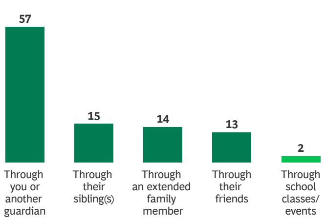  
Sources: BCG Global Gaming Survey (N = 2,972); BCG analysis. Note: Because of rounding not all bar chart totals add up to 100%.  
Boomers continue gaming into retirement, signaling long-term engagement  
Q: How much time do you spend playing video games? (%)

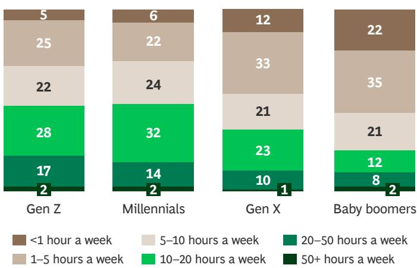

## EXHIBIT 4

# Younger Gamers Prefer Consoles, Particularly PlayStation and Switch, While Gen X and Boomers Spend More Time Gaming on Mobile

## RESPONDENT'S PRIMARY GAMING PLATFORM, BY GENERATION (%)

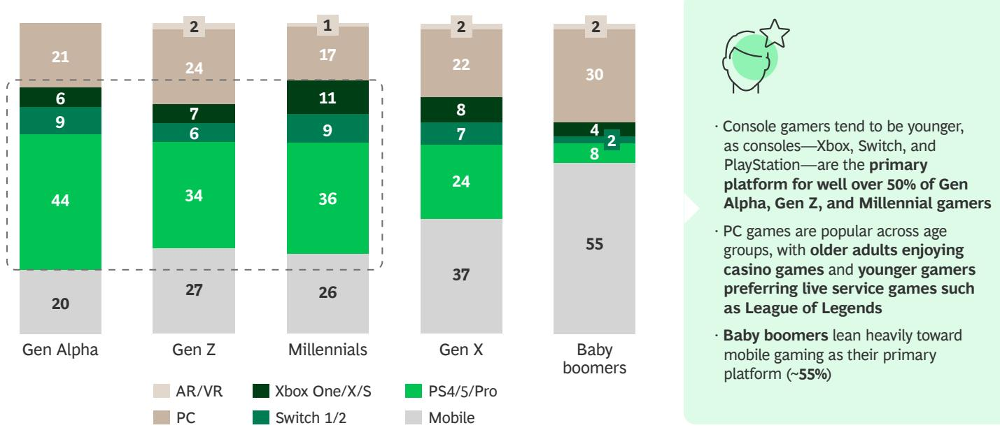

\- Console gamers tend to be younger, as consoles—Xbox, Switch, and PlayStation—are the primary platform for well over 50% of Gen Alpha, Gen Z, and Millennial gamers

Sources: BCG Global Gaming Survey 2025 (N = 2,972); BCG analysis.

\- PC games are popular across age groups, with older adults enjoying casino games and younger gamers preferring live service games such as League of Legends

\- Baby boomers lean heavily toward mobile gaming as their primary platform (\~55%)

Note: “Primary gaming platform” refers to the platform that respondents spend the most time on. Respondents who answered “Others” were excluded from the results. The N for AR/VR as primary gaming platform is very low (N = 40). AR/VR = augmented reality/virtual reality. Because of rounding not all bar chart totals add up to 100%.

Together, these trends will significantly change the industry's value chain. For instance, the console wars will become increasingly irrelevant as the battle shifts to competing ecosystems underpinned by omniscreen cloud gaming technology. Another contest will involve discoverability. Shelf space has become digital and infinite, and the hard lines between platforms are diminishing as players move between multiple devices and as games become increasingly multiplatform. In this crowded, noisy marketplace, developers that master community, algorithmic discovery, and new engagement-oriented business models, including subscription and microtransactions, will be the winners.

In addition, the industry is in a position to improve monetization in multiple ways. Some gamers are clearly feeling the cost-of-living squeeze, as more than 75% of survey respondents told us that game prices will impact their purchase choices. Nevertheless, we see many opportunities for the industry to attract valuable incremental revenue.

# GenAI: Opportunities and Risks

## What's Changing

AI is overhauling the game development process, driving innovation and reducing development costs and time-to-market. But the technology offers no shortcuts to customer acquisition, and this may become more of a challenge if rapidly produced games saturate the market.

## What the Numbers Show

BCG has analyzed metadata from Steam that indicates how quickly the industry is adopting AI: around 7,300 games on the platform disclose AI applications. (See Exhibit 5.)

On the basis of this data, we estimate that approximately 50% of studios are now using AI. Even AAA studios, despite initial reluctance, seem to be moving forward, as shown by the partnership announced in October between EA and Stability AI, which EA says will “reimagine how content is built.”

We see traction increasing in four areas (see Exhibit 6):

\- AI efficiency plays as technology improves code, automates quality assurance, and more broadly tilts the economics of conventional game development in a favorable direction, which may lead to more cross-platform games

\- Game-generating tools that use GenAI to create entire immersive, high-quality games, which some vendors say can accelerate game development by 90%

\- Intelligent nonplayer characters (NPCs) with memory, personality, and adaptive behaviors, putting a long-overdue end to predictable, “Welcome, adventurer” dialogue

\- New types of gameplay in which GenAI co-creates the game, adapting to player choice

Players, however, are generally not concerned. In our Global Gaming Survey, the most significant point of resistance involved adult gamers reacting to AI for generating art/animation; but even there, only 10% had a negative view. Likewise, just 7% of adult gamers had a negative view of using AI to generate story lines and quests, and a mere 5% reacted negatively to having AI generate NPCs and dialogue.

Even this limited degree of skepticism varies across age groups. Child and young adult gamers tend to be much more receptive—indeed, often enthusiastic—about the prospect of NPCs that behave like true friends or of hypercomplex, adaptive quests that human developers would find difficult to script.

## EXHIBIT 5

## GenAI Is Becoming More Common in Game Development

## Approximately one-fifth of titles released in Q3 2025 disclosed AI integration

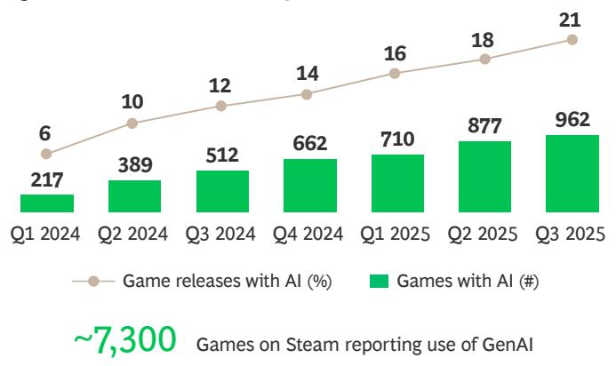  
The top three genres disclosing AI use are casual (20%), adventure (16%), and action (14%)  
Source: BCG analysis of data from scraped from Steam platform as of August 2025.
Note: NPC = nonplayer character.

Asset creation is the main use; narrative, audio, and user experience are secondary  
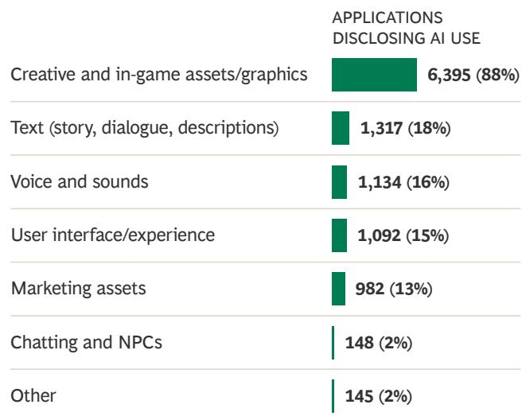

## EXHIBIT 6

## How GenAI Is Changing the Games Industry

## Driving efficiency

Modl.AI and Mighty Build & Test are complementary AI platforms that automate QA, representing the shift to AI-driven production pipelines. Bots simulate player behavior to detect issues earlier, and automation shortens release cycles and raises code quality.

\- Modl.AI's virtual player bots explore builds and find defects to speed up testing and iteration.

\- Mighty Build & Test runs scalable automated build-and-test pipelines that validate games across devices 24–7.

## Generating games

BitMagic and Series Entertainment are at the forefront of a new wave in game development, using GenAI to make creative, immersive, high-quality games in less time and at lower cost.

\- BitMagic's prompt-based, browser-based solution now has around 1.2M users.

\- Series raised \$28M in funding. Its Rho Engine is a multimodal full-stack creation platform that speeds game development by 90%.

## Making better NPCs

NVIDIA's ACE and Inworld AI are platforms for building intelligent NPCs.

\- ACE delivers a full GenAI stack for natural, real-time character interaction (e.g., in Naraka: Bladepoint).

\- Inworld builds tools and models for powering real-time conversational AI in interactive apps and games.

## Creating new gameplay

Generative AI is shifting games from static menus to co-creation platforms.

\- AI Roguelite is a fully GenAI-driven RPG roguelite where LLMs generate every element (locations, items, and so on), using probabilistic simulations to drive both combat and narrative.

\- Whispers from the Star is a GenAI-driven narrative sandbox game where players interact with an intelligent avatar through natural conversation that evolves with every dialogue.

Note: LLM = large language model; NPC = nonplayer character; QA = quality assurance; RPG = role-playing game.

Significantly, the gamers in our survey were reacting to features they have not yet experienced. A tsunami of low-grade AI-created games could quickly sour their views.

Data from our survey of developers reveals that some are moving fast while many others are holding back. (See Exhibit 7.)

## EXHIBIT 7

## Developers Still Fear Pushback from Gamers over GenAI Use

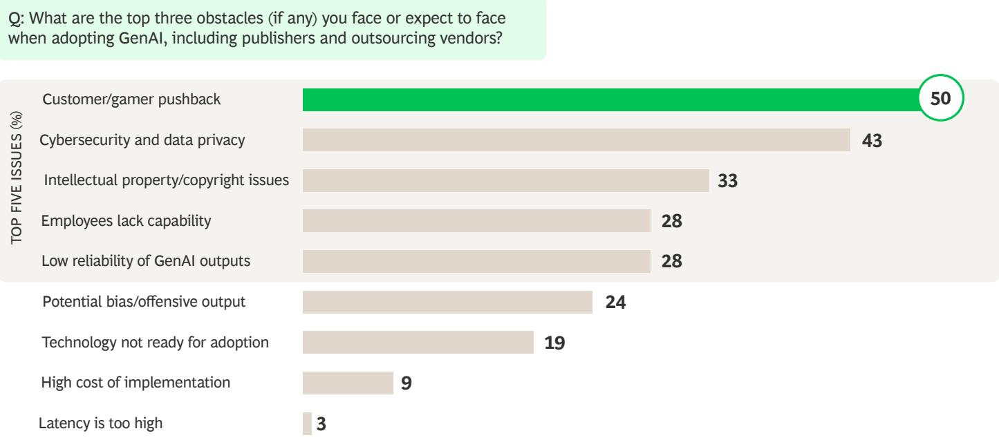  
Source: BCG 2023 Game Developer Survey (N = 81).

## Seizing the Opportunity

It is a mistake to think of AI as nothing more than a way to relieve the pressure of development costs, which can reach \$300 million for an AAA-rated game. AI's promise of faster development cycles and new types of content with lower development costs could trigger a wave of innovation and experimentation. AI can also have a huge impact on the management of live service games, among other forms of live operations content management.

It also opens the way for a new breed of AI-native studios whose output may complement rather than compete with traditional and somewhat hand-crafted AAA game developers. Initially, these efforts may produce lower-quality results, but Clayton Christensen's The Innovator's Dilemma, one of the most important academic studies of disruptive business models, observes that low-end disruptive innovations can quickly improve under the right conditions. In the gaming world, consumers may appreciate having more variety and faster refresh. This may impact discoverability, however, as blockbuster games (with their blockbuster budgets) will have to work harder to stand out in a market crowded with AI titles.

Crucially, realizing this broadly positive future for the industry depends on using AI wisely. Poor-quality,

derivative experiences may overwhelm undercurated game stores, burdening AI with an image problem and creating reputation problems for developers who approach AI more thoughtfully. Copyright and intellectual property issues are another concern. Major studios will not stand idly by if new developers produce lookalike content trained on their rivals' assets or even code base.

Leaders must establish clear principles for AI deployment: transparency, curation, and the redeployment of savings into more ambitious creativity. AI should expand what games can be, not erode the creative canvas.

A further issue relates to trust and the human touch, the sometimes quirky elements that help gamers connect emotionally with the games they love. Even AI-native studios must find a way to generate that kind of personal connection.

## The Takeaway

Deployed with care, AI is a generational opportunity for game developers. But there are risks too. If AI creates a wave of new games, curation and community-driven discovery will become even more important as vehicles for ensuring that gamers can find the experience they want.

# Platform Evolution: From Console Wars to Cloud Wars

## What's Changing

Cloud gaming is ready to go mainstream, which will transport the industry to a new hardware-agnostic era. The ramifications of this shift will affect companies and individuals across the gaming ecosystem, from console makers to developers to distributors.

There are three models of cloud gaming:

\- Pure plays, such as Nvidia's GeForce Now, are disrupting the hardware-focused gaming market by offering a console-level gaming experience on almost any equipment a player has on hand, with no downloads required.

\- Multigame subscriptions, such as PlayStation Plus Extra, offer a wide range of downloadable games for a single monthly payment. Over time, these services can transition to a cloud-based model.

\- Hybrid/bundled models, such as Xbox Game Pass, offer a flexible mix of downloadable games and streaming.

## What the Numbers Show

In BCG's 2025 Gaming Survey, $60\%$ of players said that they had tried cloud gaming, and $80\%$ reported a positive experience. (See Exhibit 8.)

This level of positive response may come as a surprise to people who thought that cloud gaming could never match local processing. Today, however, the high-speed, low-latency links needed to deliver a great gaming experience with just a \$40 controller and low-end laptop are much more widely available.

Despite these tailwinds, about 70% of gamers who have tried cloud gaming spend less than a quarter of their time using it. But given the positive user experience and other factors, we project that global revenues for cloud gaming will grow from around \$1.4 billion in 2025 to roughly \$18.3 billion in 2030. (See Exhibit 9.) That amounts to a compound annual growth rate above 50%, taking into account streaming pure plays plus a portion of hybrid and bundled services. At the same time, player numbers will rise rapidly.

Not surprisingly, Sony, Microsoft, Netflix, Apple, and Amazon are all trying to establish a strong position in relation to this new revenue stream.

About $70\%$ of cloud gamers spend less than $25\%$ of their gaming time using this technology

## EXHIBIT 8

## Cloud Gaming Can Deliver a Good Experience

27%

of gamers said they are regular or heavy users of cloud gaming

80%

of gamers who tried it
reported an overall
positive experience

However, gamers who use cloud gaming also play on other platforms
HOW CLOUD GAMERS APPORTION THEIR GAMING TIME (%)

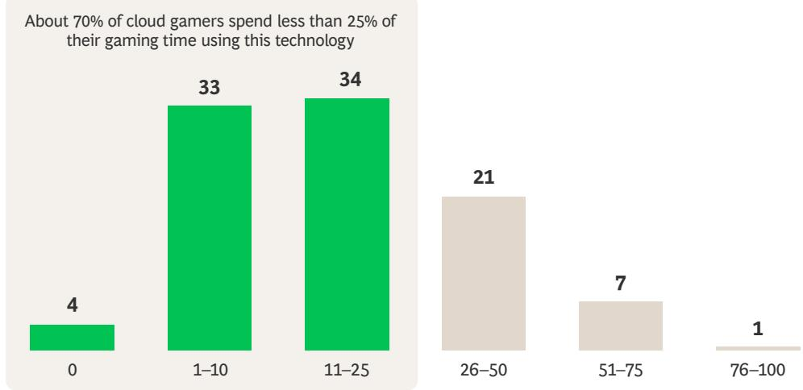  
TIME DEVOTED TO CLOUD GAMING (%)  
Sources: BCG Global Gaming Survey (N = 2,972); BCG analysis.

## EXHIBIT 9

Cloud Gaming Is Ready for Liftoff as the Gaming Experience Improves

CLOUD GAMING USERS (MILLIONS)

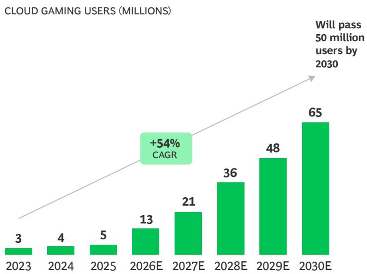  
Source: BCG GEMS forecasted market data.
Note: CAGR = compound annual growth rate.  
CLOUD GAMING MARKET (\$BILLIONS)

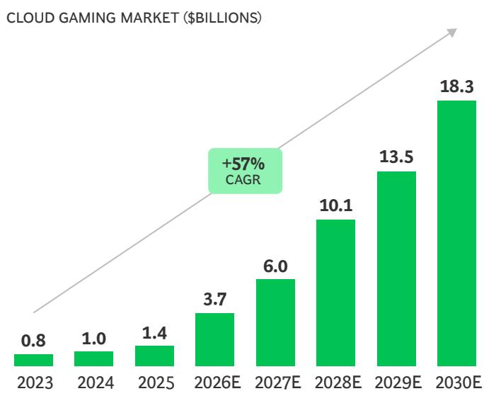

## Seizing the Opportunity

The impact goes far beyond the potential influx of new players. For developers, it includes several considerations:

\- Frictionless gameplay may enable higher conversion. Because no download is required, players can start a session from ads, emails, or directly on the store page, which promises a massive lift in conversion rates. Gamers will appreciate frictionless play too, as it allows them to take their library and progress with them as they move from laptop to console to tablet to phone.

\- Cloud gaming offers all the benefits of cloud-native development. Creators can build, test, and iterate without local builds. The technology also unlocks features that are difficult to run on local hardware, such as server-side AI and real-time world data.

\- Users get the benefit of unified patching and content rollout. “Canary builds” test new features on small groups of players, after which companies can quickly roll them out to the global player base.

Most importantly, cloud gaming changes the game distribution. Games and the hardware on which they have been separate products for more than 40 years. The cloud era could see a rebundling of games with the cloud hardware they run on. Multigame cloud subscriptions will shift developer focus from units shipped to hours played, rewarding the stickiest games and driving new marketing strategies.

This does not mean the end of dedicated gaming hardware such as consoles. There will always be people who want the plug-and-play experience that these devices deliver. Instead, games will offer players multiple entry points across various devices, including consoles. Indeed, there may be openings for new types of gaming hardware, as underlined by Valve's announcement in November that it would again try to establish a market for a PC/console hybrid with the Steam Machine, following the success of its portable Steam Deck. The future is not hardware-less, but increasingly it will be hardware agnostic.

By 2030, as cloud gaming continues to increase as a share of play time, industry power structures could look very different. As platforms become less important, incumbent players will have to make difficult choices. Successful console makers will recognize that any shift to new models could cannibalize profitable existing businesses and threaten the next generational upgrade cycle.

New players will have big opportunities—including with tech giants such as Amazon, streaming powerhouses such as Netflix, and ecosystem players such as Apple, which have storefronts, billing, and software on millions of devices.

Some players are already positioning themselves. Microsoft's January 2022 purchase of Activision for around \$70 billion, the richest industry M&A ever, was in part designed to position Microsoft for the new, cloud-enabled, era in which almost any device can function as a gaming platform. In November 2025, Sony announced that gamers can now stream some of its most iconic games from the cloud to its PS Portal handheld device, with no PlayStation console required.

## The Takeaway

For some time, PC gaming and the rise of mobile have been eroding the console's role as the central pillar of gaming. But cloud gaming is taking this disruption to a new level, eroding the hard lines between platform types and creating a converged gaming experience. For developers, navigating this change and its implications—especially the changes to distribution—is vital. They must master monetization within subscription products, which means retaining those rights and valuing them appropriately. Engagement will be vital in an age of all-you-can-eat content libraries.

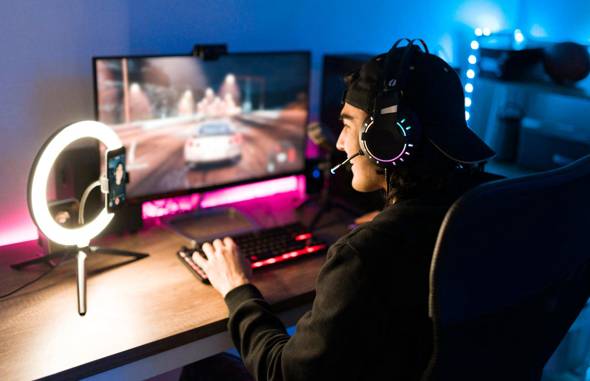

# UGC: Welcome to the New Creator Economy

## What's Changing

UGC has emerged as a vibrant, rapidly growing creator economy, with payouts that will reach \$1.5 billion in 2025 from just two games. We expect UGC to drive increasing engagement among young gamers, but it also has latent possibilities among older demographics.

## What the Numbers Show

One dramatic measure of the new creator economy is the 2024 payouts by Roblox and Fortnite: \$923 million and \$352 million, respectively. Equally dramatic is data from the BCG Global Gaming Survey indicating that UGC is driving younger gamers' engagement. (See Exhibit 10.)

Of course, some games have long encouraged user-generated modifications. But creation often required skills approaching those of a full-time game developer. Now, advances in technology have democratized and monetized UGC, either natively on-platform or via YouTube or other streaming services.

## EXHIBIT 10

## Gamers Are Interacting With UGC, but Creators Are Still a Minority

More than 40% of gamers are consuming more UGC than they did a year ago...

Q: Select how much you agree/disagree with the following statement: I consume more UGC now than I did 12 months ago (%)

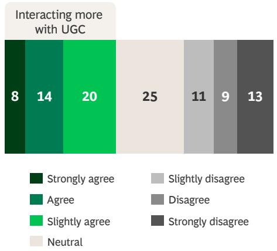  
Sources: BCG Global Gaming Survey 2025 (N = 2,972); BCG analysis. Note: UGC = user-generated content.  
Q: Select all the ways you have interacted with user-generated content in the past (%)

... but only 10% to 15% of gamers have created content

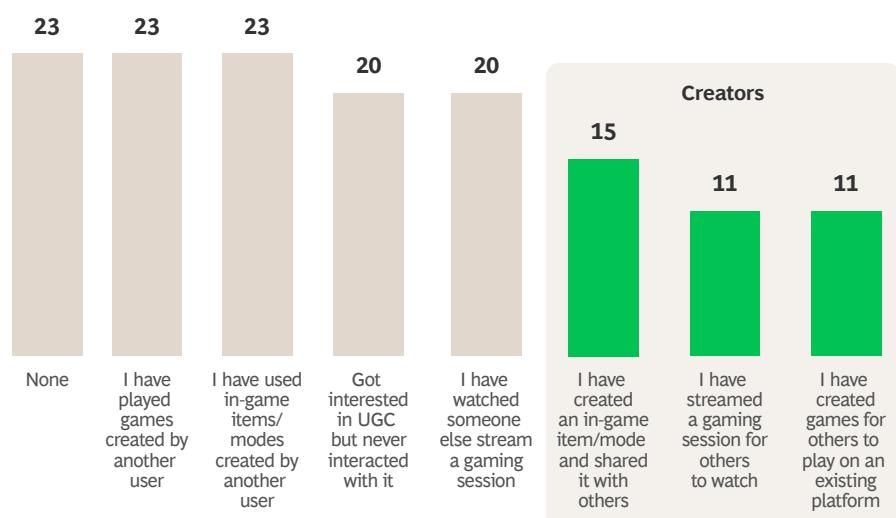

Roblox has 1.6 million monetized creators who have created more than 100 million UGC experiences to date. One of Roblox's biggest hits, Grow a Garden, an intersection of UGC and another important trend, cozy gaming, had 16 million concurrent players at its peak in the summer of 2025.

The experiences may seem low-fidelity and limited by primitive graphics. But the definition of gaming quality is evolving, and platforms that welcome UGC contributions are thriving on social interaction and novelty. The result is a living, breathing experience that changes with each login because users are building it in days, as opposed to the multiyear development cycles of big titles.

For people who are not inclined to create new gaming experiences, UGC offers a whole other world in streamed gaming. The biggest names in streaming have real influence: in our survey, 55% of gamers said they would try a new game if their favorite creator switched to it.

## Seizing the Opportunity

Developers that want to harness the power of UGC to a particular game need to build a creator economy that fits the vibe of the game and the demographic it attracts.

Consider the very different economies built by UGC behemoths Roblox and Fortnite. Roblox users are children and teens, with 56% of players under the age of 16. Its ecosystem is grassroots- and commerce-driven, with virtual playgrounds, classrooms, and malls that mimic the real-life world of its players. Roblox thus acts as a broad creator economy platform with deep commerce integration that presents a vast range of low-fi content to its engaged young audience.

Fortnite, in contrast, is tuned to a somewhat older demographic; 60% of its players are 18 to 24 years old, and the ecosystem leans into pop culture with an endless stream of curated, IP-centric tie-ins ranging from Nike to K-Pop Demon Hunters. Its audience gets AAA sizzle plus engagement with the biggest youth brands. which build UGC under tight developer control.

Fortnite maps generated by professional users originally served as a way to keep players engaged between the game's main seasonal chapters, but the developer is now upping its bet on UGC. Fortnite's most recent changes, effective December 2025, underline this evolution: creators can sell durable and consumable goods from their Fortnite islands; the platform offers incentives for players to bring in new or previously inactive players; and creators will receive an ad-revenue share of $100\%$ for their creations for a year. Perhaps just as important, the creator community has access to new tools for discovery and engagement.

Roblox and Fortnite are in prime position to evolve into full-fledged distribution platforms that are leaders in the next stage of the gaming industry—one in which games operate as hardware-agnostic platforms, in contrast to the old paradigm in which consoles and other hardware enabled the platform and distribution.

UGC today focuses on younger gamers, but older gamers are interacting with it, too. In our survey, 15% of gamers in their 60s or older said that they had watched someone else's stream. And 28% of this group said that they were interested in UGC although they had not yet tried it. (See Exhibit 11.)

## The Takeaway

UGC represents a vast opportunity, initially for games with a base of young players who seek self-expression as content creators, but in the longer term for a much broader demographic. UGC offers much more than improved engagement, however. It is accelerating the industry’s migration toward a hardware-agnostic era in which games function as platforms.

Developers that want to harness UGC's power should prioritize building an ecosystem that fits the game and offers the right incentives.

## EXHIBIT 11

Gen Z and Millennials Are Interacting More With UGC; Older Gamers Show Potential

Q: Select all the ways you have interacted with user-generated content in the past

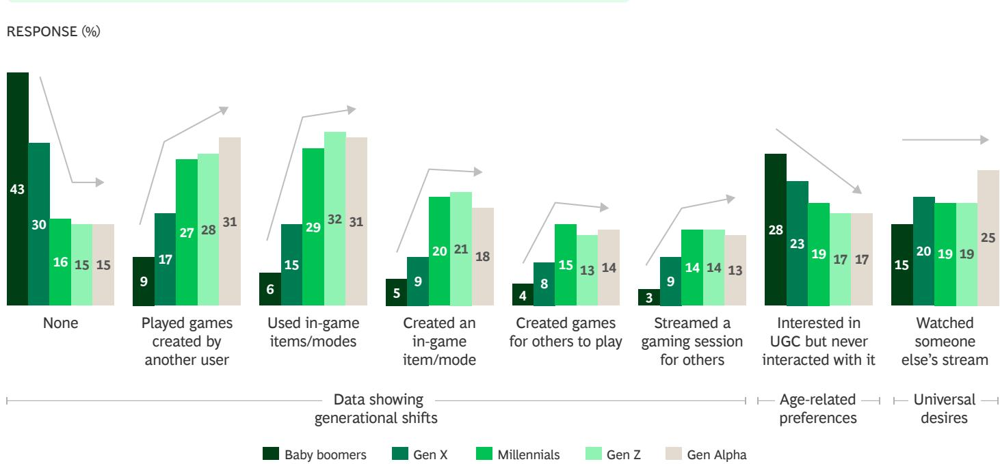  
Sources: BCG Global Gaming Survey 2025 (N = 2,972); BCG analysis.  
Note: Generational cohorts are defined by age as follows: Gen Alpha, 12 and younger; Gen Z, 13 to 28; Millennials, 29 to 44, Gen X, 45 to 60; baby boomers, 60 and older. UGC = user-generated content.

# App Stores Opening Up: A Revolution for Distribution

## What's Changing

In the wake of regulatory and court action, app stores are opening up, granting developers, particularly in mobile, opportunities to introduce new approaches to distributing games and monetizing users.

## What the Numbers Show

A growing number of gamers are purchasing games from developer-owned web stores instead of from traditional platforms. In our survey, 33% of adult gamers and 40% of teens said that they had made at least one such purchase. Developers could push those percentages higher by addressing security concerns and increasing incentives. (See Exhibit 12.)

Many of these purchases will be for game play on PCs, traditionally the most open gaming platform. In contrast, our conversations with game developers suggest that this year 85% of transactions on mobile, currently the most closed platform, will have taken place via the App Store or Play Store, despite the limited degree of opening there so far.

The opening up of app stores has major implications for gaming. We estimate that mobile in-app purchases in 2025 will total almost \$130 billion, accounting for nearly half of global industry revenue.

## EXHIBIT 12

Gamers Are Motivated to Buy on Developer Websites, but Pain Points Remain

Gamers are aware of developer web stores, and are purchasing from them

There are strong, clear motivators beyond price...

...but developers must work harder to overcome barriers

Q: When playing mobile games, what has been your experience with making in-game purchases directly through a game developer's store? (%)

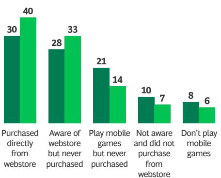  
Source: BCG Global Gaming Survey 2025 (N = 2,972).  
Q: Why did you choose to purchase from a developer's webstore? (%)

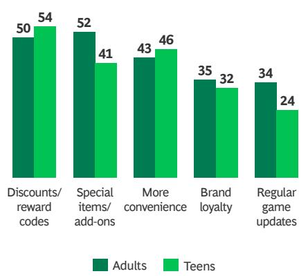  
Q: Why did you NOT choose to purchase from a developer's webstore? (%)

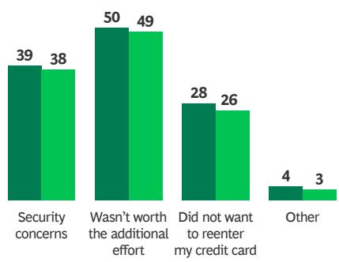

## Seizing the Opportunity

The app store model today is at a turning point. Regulatory action in Europe and court rulings in the US are forcing closed mobile platforms to open their doors, clearing the way for alternative payment systems, sideloading, and increased in-app purchasing freedom.

For players, using alternative app stores is no big deal. Once bought, their new game resides on their device, alongside other purchases. It’s less of a hassle than downloading a game and then logging into a developer-specific platform on a PC.

In addition paying lower fees, developers will gain a range of opportunities through new distribution channels, including the ability to build cross-platform ecosystems that were impossible just a few years ago, deepening player engagement without the need to contend with a gatekeeper app store. This will further erode the barriers between platforms.

Our discussions with developers point to rapid changes in how gamers spend their money on mobile gaming. Overall, revenues will rise, but incumbent app stores will see some income erosion. Growth will come from webstores and other newly accessible distribution channels that are ready for takeoff. (See Exhibit 13.)

# Mobile Gaming Will See Modest Growth, but New Payment and Download Channels Will Quickly Grab Share

IN-APP PURCHASING OF MOBILE GAMES (\$BILLIONS)

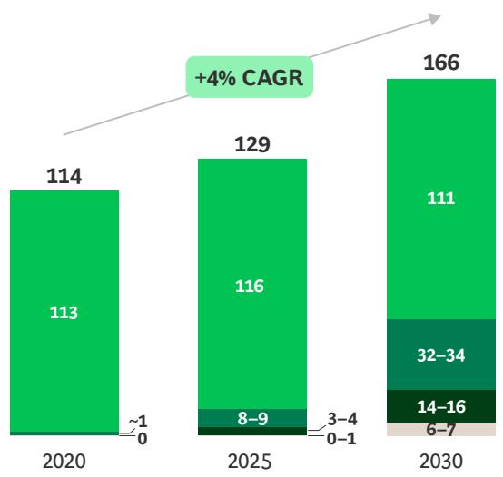

<table><tr><td rowspan="2">Market breakdown</td><td colspan="3">ESTIMATED SHARE OF TOTAL (%)</td></tr><tr><td>2020</td><td>2025</td><td>2030</td></tr><tr><td>Transactions inside app via Apple/Google (incumbent stores)</td><td>99</td><td>90</td><td>67</td></tr><tr><td>Transactions outside app in web stores</td><td>1</td><td>~6-7</td><td>~20</td></tr><tr><td>Transactions inside app via third-party payment systems</td><td>0</td><td>~3-4</td><td>~8-10</td></tr><tr><td>Transactions inside app via apps downloaded from alternative app store</td><td>0</td><td>~0-1</td><td>~3-5</td></tr></table>

Sources: BCG GEMS data; 2024 Survey of Game Developers (N = 60); expert interviews with leading publishers (N = 40). Note: CAGR = compound annual growth rate.

Developers have three opportunities, each one more attractive than what traditional closed ecosystems offer:

\- Manage payments themselves but use existing app stores for distribution. This opportunity is the result of Epic Games' landmark US court victory over Apple, which forced the phone-maker to allow external payment links in iOS apps. Download fees could fall from 30% to perhaps 5%, a huge boost to developers' margins.

\- Offer their games via cloud streaming. In 2024, Apple changed its terms of service so that cloud-streamed games could use developers' payment systems, too, instead of the App Store's high-commission system.

\- Launch their own app store. The EU’s Digital Markets App has been the regulatory driver here. This bold option requires substantial investment, but it permits sideloading games with new business models and monetization strategies built on the richer player data that developers can collect. Besides creating single-developer (or even single-game) app stores, developers can form consortia to reduce costs and build scale.

Games developers will have additional options as the app store ecosystem grows. For instance, ads on video streaming services drive a huge number of app installs. These streamers could direct these to their own game-developer-friendly app store, which would not require developers to set up their own stores; ideal for independent or smaller developers.

One caveat involves security: our data shows that developers must work harder to reassure users on issues such as security, fraud, and refunds.

## The Takeaway

For developers, the opportunity is clear: new app store distribution models are quickly emerging, especially in mobile. Developers that pivot strategically will reduce their platform dependency, improve their profitability, and find new avenues to reach users. Those that rely on today's dominant app distribution systems will likely lose ground.

# Improving Monetization: The New Math of Game Pricing

## What's Changing

The convergence of UGC, AI, cloud, and opportunities around app stores will create a new playbook for every stakeholder in gaming. But even before these reach full force, the industry must better monetize the value it creates in games.

## What the Numbers Show

BCG's survey data confirms that gamers generally are feeling squeezed economically, with about $65\%$ using tactics such as waiting for discounts to save money. (See Exhibit 14.) The result is a split market. Approximately $45\%$ of gamers are serious fans who are willing to buy even at higher prices—a good omen for GTA 6, the biggest planned launch of 2026, which is likely to come with a high price tag. Another $23\%$ or so are neutral, but about $30\%$ said that their purchasing will fall if prices rise.

In terms of age group, spending tends to decline as family responsibilities increase. Among survey respondents in Gen X, 73% said that they spend less than \$100 per month on video games; among baby boomers, many of whom prefer low-cost or free mobile gaming, the proportion of low-spenders is even higher, at 86%. Nevertheless, games remain a great value for those that play a lot. The cost per hour is 30% to 80% lower than movies and video entertainment, and premium game prices have declined at an inflation-adjusted rate of 1% per year over the past two decades. (See Exhibit 15.)

Our survey data yields some encouraging signs that in the US, at least, gamers' willingness to pay has increased.

## EXHIBIT 14

## Most Gamers Are Price-Conscious and Are Prepared to Wait for Discounts

More than 75% of gamers say prices will heavily impact their purchase choices

Q: Please select how much you agree with the following statements: Price significantly influences my choice of brand/product/service (%)

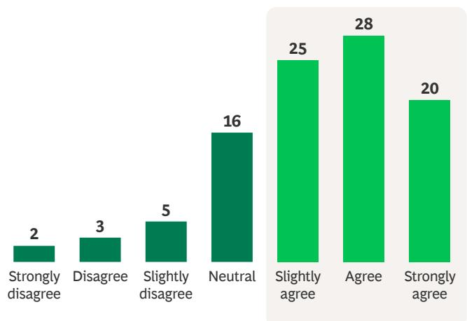  
Sources: BCG Global Gaming Survey 2025 (N = 2,972); BCG analysis.  
About 65% of gamers have tactics to limit their spending  
Q: When multiple games in the same franchise are released in the same year, which of the following do you do? (%)

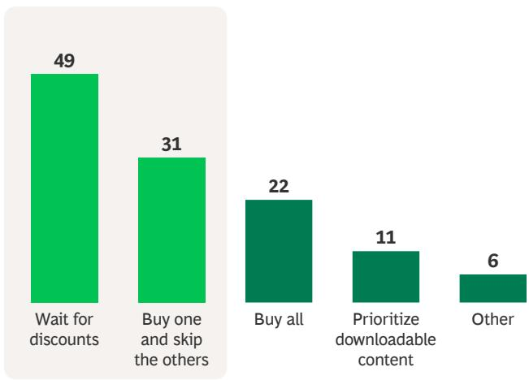

## EXHIBIT 15

Premium Games Are a Good Value, and the Average Launch Price of AAA Games Has Declined When Adjusted for Inflation

  
Consumer cost per hour of entertainment by medium and format for major categories, as of 2025 (\$) $^{1}$

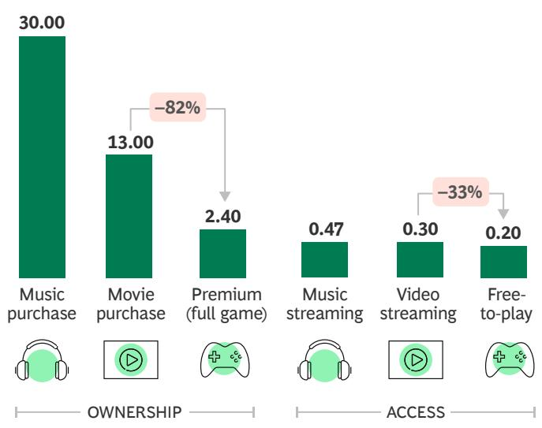  
Sources: BCG GEMS; PQ Media. $^{1}$ Data is calculated as cost over average hours consumed.  
Typical inflation adjusted price of a standard-edition AAA full game over the past 20 years (\$)

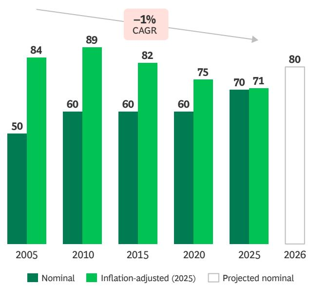

## Seizing the Opportunity

The industry urgently needs to derive more value from the amazing experiences it offers. We have identified four important strategic trends that will boost revenue:

\- Tiered pricing will increase, for both purchases and subscriptions. Games are now selling at a broader range of price points. This divergence marks a return to the pricing of the 1990s, when game prices differed twofold or more. At the high end, the pricing of Grand Theft Auto 6, due for release in 2026, will receive close industry attention. For the best AA-rated games, such as the 2025 role-playing sleeper hit Clair Obscur: Expedition 33, however, \$49.99 is a realistic price that still rewards the substantial investment that even these more limited games require. Similarly, subscriptions should be priced in tiers that reflect the value they deliver.

\- Developers will use windowing to maximize lifetime revenue. Windowing involves staggering the release of titles across platforms, regions, and price tiers, in part to prevent loss of value. The practice was common in Hollywood in the days before streaming, when studios carefully managed their releases across different countries, rental and purchase DVDs, and broadcast TV sales to maximize revenues and protect valuable intellectual property. To sustain the value of tentpole franchises, developers should adopt smarter windowing strategies: launch with a premium price, time discounts carefully, and use subscription access to collect long-tail revenues. The goal is to optimize revenue from both free-spending and price-sensitive gamers. Another smart strategy is to release games outside the peak periods of February–March and August–December; during those windows, many gamers buy and start playing a single title, and wait for the rest to be discounted. Developers can extend a game’s revenue lifespan through careful management of when, where, and at what price they offer that title.

## • Alternative monetization will expand rapidly.

Many free-to-play games on mobile already deploy these strategies to great effect. As strategies such as in-game transactions and downloadable content increase, the proportion of gamers' spending that goes to outright purchase of new titles will fall. Titles that receive updates every 12 months are ideal for subscription, lowering developers' marketing costs by avoiding an annual sales battle. From Millennials onward, younger generations are increasingly likely to prefer live-service games to single-player games and to prefer accessing games via subscription to buying them individually. (See Exhibit 16.)

## EXHIBIT 16

Gaming Preferences Reveal Generational Divides in Format and Monetization Models, Including Access-Based Models

  
I prefer live-service games to single-player games (%)

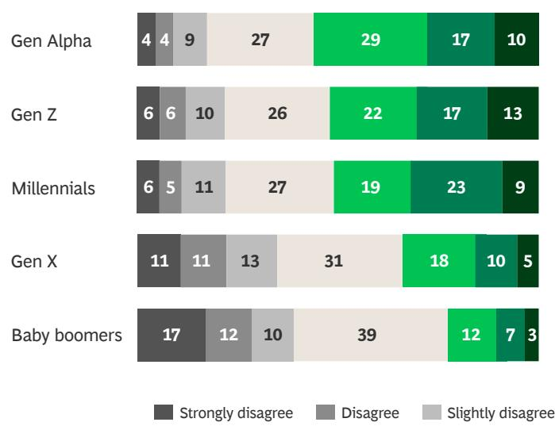  
Source: BCG Global Gaming Survey 2025 (N = 2,972).

  
I prefer accessing games via subscription over buying individual games (%)

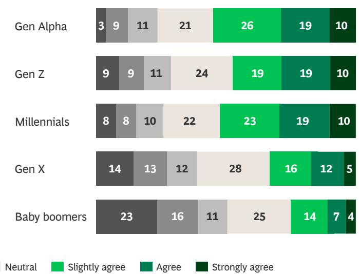

\- In-game advertising will emerge as a stronger revenue stream. Mobile games typically earn 20% of their revenue from advertising, but we see plenty of underexplored opportunities on bigger screens. (See Exhibit 17.)

## The Takeaway

For the money, gaming delivers more value than many other hobbies. This is a sign that the industry needs to work harder on pricing, not just to raise revenue but also to protect the scarcity and visibility that make big games significant events in popular culture.

## EXHIBIT 17

Advertising Is Undermonetized in Gaming, Considering Its Share of Attention

Gaming accounts for 12.5% of gamers' time spent with media, but only around 3% of media ad spending

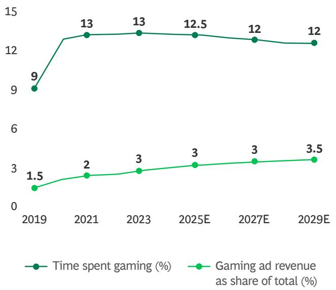  
Sources: BCG GEMS; PQ Media; BCG Global Gaming Survey 2025 (N = 2,972).  
Around $30\%$ of gamers wouldn't mind sponsored listings in a games store; hardcore gamers are most open to this  
Q: Agreement with “I don’t mind sponsored listings within my gaming store” (%)

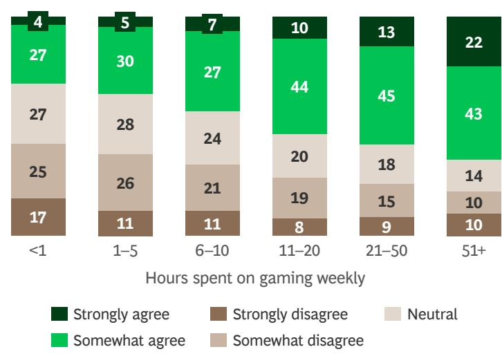

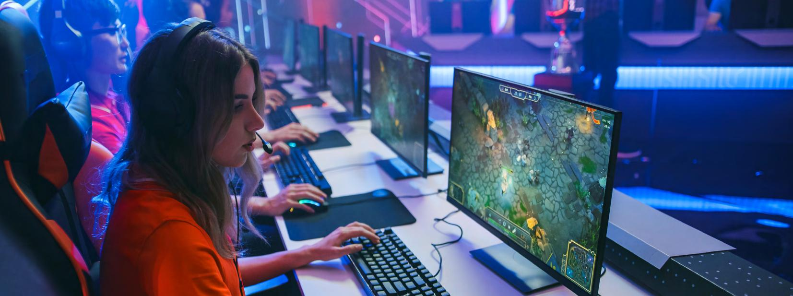

# Growth Through Disruption

As the gaming industry enters 2026, new pathways to growth are emerging. But those pathways are open only to those who embrace disruption and discard much of the industry's old playbook. (See Exhibit 18.)

Cloud gaming ecosystems, user-generated content, AI, and the opening up of app stores will drive rapid changes—both positive and negative, depending on where in the value chain a company sits—that will affect every aspect of the industry. Collectively, they will redefine game production and distribution, which in turn will reshape the gaming landscape and redefine consumer expectations. Improved monetization and the shifting app store ecosystem will have a more immediate impact on companies' bottom line.

By 2030, we should see an explosion of gaming content, an expansion of the global audience for games, and broadening expectations for omniplatform gaming. We anticipate a healthy, growing market, although there will be on the AAA business model will experience continued pressure, and top-tier developers will need to invest further in strategies related to brand, franchise, intellectual property, platform curation, subscription, and windowing. Together, these efforts will challenge and reshape the current landscape and alter value pools.

Executives who understand these changes and position their businesses to seize the opportunities will define gaming's next decade.

## EXHIBIT 18

## The Gaming World in 2030 and Beyond

## Explosion of content

Discovery and curation will become decisive platform advantages as tens of thousands of new professional and UGC titles flood the market.

## Global TAM expansion

Cloud distribution will reduce large upfront investments and expand access, bringing millions of new players into gaming, particularly if new experiences can be unlocked.

## Omniplatform gaming

Players will expect persistent access across screens and devices, with ability to take their progress and library with them wherever they go.

## Blockbusters as cornerstones

Large-scale hits and exclusive IP will become critical, as gaming blockbusters emerge as the last untapped source of billion-dollar IP. Monetization will demand robust windowing strategies.

  
Note: IP = intellectual property; TAM = total addressable market; UGC = user-generated content.

## Value pools in flux

Value pools will shift across different publishers, infrastructure owners, cloud platforms, storefronts, and creators.

# About the Global Gaming Survey

To better understand gamers' thinking on key issues, BCG commissioned Dynata to conduct a global online survey of 2,972 respondents, ranging from casual mobile gamers to a small number who play video games more than 50 hours per week. Dynata conducted fieldwork from July 9 to July 18, 2025.

A total of 22% of survey respondents resided in the US. Other major countries represented include China (8%), Germany (8%), Japan (8%), and South Korea (8%).

This is BCG's second global survey of gamers. For information about the results of our 2024 survey, see our previous report, Leveling Up for the New Reality.

## About the Authors

Ernesto Pagano is a managing director and senior partner in the Dallas office of Boston Consulting Group and global leader of the media sector. You may contact him by email at pagano.ernesto@bcg.com.

Povilas Joniškis is a managing director and partner in BCG's Dubai office. You may contact him by email at joniskis.povilas@bcg.com.

Francisco Smart is a project leader in BCG's Miami office. You may contact him by email at smart.francisco@bcg.com.

Henry Anderson is a manager in BCG's London office. You may contact him by email at anderson.henry@bcg.com.

Giorgo Paizanis is a partner in the firm's Los Angeles office. You may contact him by email at paizanis.giorgo@bcg.com.

Niels Danielsen is a principal in the firm's Miami office. You may contact him by email at danielsen.niels@bcg.com.

Siddharth Modi is a project leader in the firm's Miami office. You may contact him by email at modi.siddharth@bcg.com.

## For Further Contact

If you would like to discuss this report, please contact the authors.

## Acknowledgments

The authors would like to thank industry collaborators Alejandro Marin Vidal and Rob Schonfeld.

The authors are also grateful to the following for their contributions to this article: Tor Fryer Petersson, Janet Hernandez, Max Legemah, Claire Liu, Jahan Sahni, and Ziwei Tang.

## BCG

Boston Consulting Group partners with leaders in business and society to tackle their most important challenges and capture their greatest opportunities. BCG was the pioneer in business strategy when it was founded in 1963. Today, we work closely with clients to embrace a transformational approach aimed at benefiting all stakeholders—empowering organizations to grow, build sustainable competitive advantage, and drive positive societal impact.

Our diverse, global teams bring deep industry and functional expertise and a range of perspectives that question the status quo and spark change. BCG delivers solutions through leading-edge management consulting, technology and design, and corporate and digital ventures. We work in a uniquely collaborative model across the firm and throughout all levels of the client organization, fueled by the goal of helping our clients thrive and enabling them to make the world a better place.

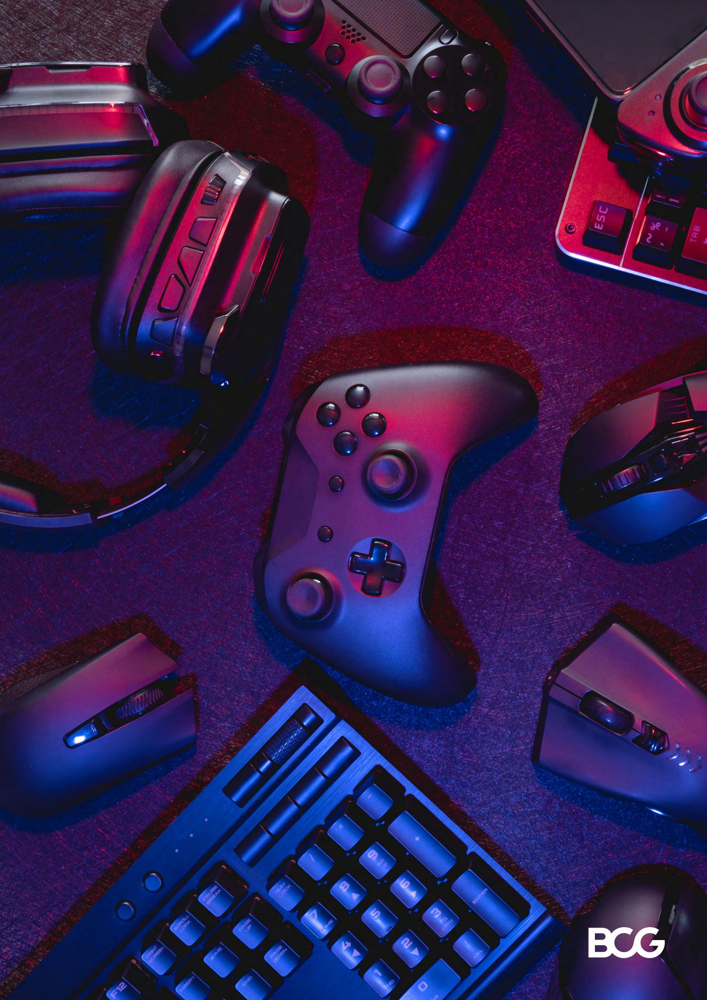

BCG