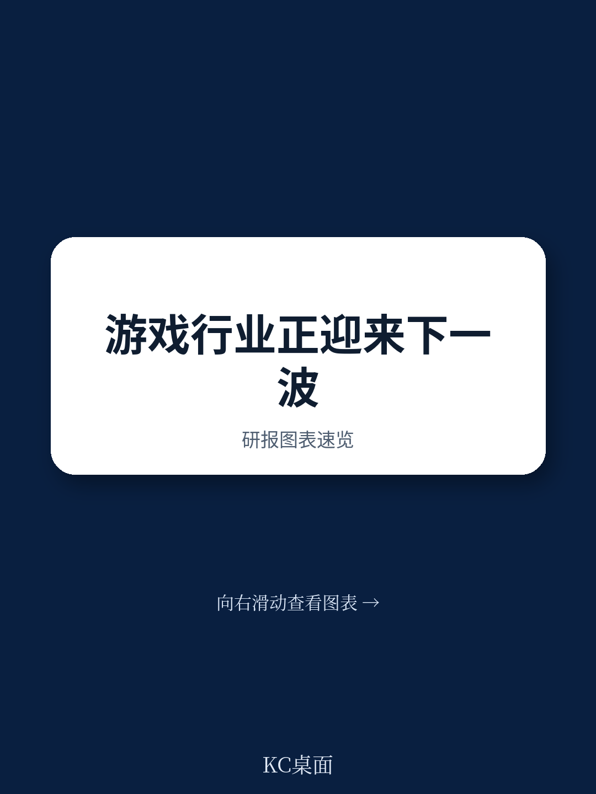

# 波士顿咨询：游戏行业“冬季”结束，但增长逻辑已彻底改变

2025年底，游戏行业终于可以松一口气。波士顿咨询（BCG）在其最新发布的《视频游戏报告2026》中给出了一个明确的判断：持续三年的“游戏寒冬”即将结束，行业正进入一个更加乐观的新阶段。但这份报告真正值得关注的，不是复苏本身，而是复苏背后的结构性变化——旧有的平台战争、开发规则和分发模式正在失效，游戏行业即将迎来一次彻底的洗牌。

这份基于近3000名玩家调研和大量行业访谈的报告，提出了一个核心主张：未来五到十年，四大趋势将同时发力，推动游戏行业进入一个“平台碰撞”的新时代。增长会回来，但不会回到2010年代翻倍的速度。真正的问题在于，谁能在新规则下重新定义自己的位置。

> **KC评论：** 报告的核心洞察不是“行业回暖”，而是“回暖的方式和过去完全不同”。如果你是产业决策者或投资者，关注点应该从“行业增速多少”转向“价值池如何重新分配”。这份报告最值得细读的部分，是它对四个趋势如何互相叠加、改变竞争格局的分析。

## 1. 云游戏不再是概念，而是引爆平台战争的导火索

BCG报告中最具冲击力的判断之一，是“主机战争正在变得无关紧要”。当云游戏走向主流，硬件不再是竞争壁垒，真正的战场将转移到“生态系统”层面——谁能提供跨屏幕、跨设备的无缝体验，谁就能赢。

数据支撑了这一判断：60%的受访玩家尝试过云游戏，其中80%给出了正面评价。报告预测，云游戏收入将从2025年的约15亿美元，以超过60%的年复合增长率在2030年达到一个完全不同的量级。这意味着，玩家将不再受限于PlayStation、Xbox或Switch的硬件绑定，而是可以在电视、手机、平板甚至浏览器上自由切换。

对主机厂商而言，这是一个严峻的挑战。硬件销售本身正在萎缩——报告给出的2025-2030年主机硬件CAGR为-7%。如果硬件不再是护城河，索尼、微软和任天堂必须找到新的方式留住用户。对于微软而言，这可能是一个机会：它的Game Pass订阅制加上云基础设施，或许能比对手更快适应“硬件无关”的未来。

> **KC评论：** 报告没有直接点名，但这里的隐含问题是：当硬件不再绑定用户，游戏平台的核心竞争力是什么？答案可能是“社区”和“内容生态”。完整报告对云游戏的三种商业模式有更细致的拆解，这也是理解未来竞争格局的关键。

## 2. UGC创作者经济正在重塑游戏行业的“劳动力结构”

报告揭示了一个被很多人低估的趋势：用户生成内容（UGC）正在从“年轻人的玩具”变成主流消费行为。40%的受访玩家表示，他们消费的UGC内容比一年前更多。仅Fortnite和Roblox两个平台，2025年向创作者支付的金额将超过15亿美元。

更值得关注的是代际传递效应。报告发现，44%的玩家父母表示，他们的孩子在5岁前就开始玩游戏，而孩子们最常接触的三款游戏中有两款是UGC游戏：Minecraft和Roblox。这意味着，新一代玩家从一开始就习惯了“创造+消费”的混合模式，而不是被动接受开发者设计好的内容。

这对传统游戏开发商的含义是深刻的。UGC平台本质上是在创造一种“无限内容供给”的能力，而传统开发商仍然依赖有限的人力去制作每个关卡、每个任务。当UGC平台的内容数量和更新速度远超传统模式，用户的注意力自然会迁移。

> **KC评论：** 报告没有展开讨论的一个关键问题是：UGC平台如何平衡“开放创作”和“质量控制”？Roblox和Fortnite的答案不同，但完整报告对UGC平台的商业模式和创作者激励有更深入的分析，这是理解“创作者经济”能否持续扩张的核心。

## 3. AI是把双刃剑：内容爆炸会让“发现”成为新稀缺资源

BCG对AI在游戏行业的应用持谨慎乐观态度。报告估计，约50%的游戏工作室已在开发中使用AI，Steam平台上约7300款游戏披露了AI应用信息。AI在资产创建、NPC智能化、游戏自动生成等四个方向都有显著进展。

但报告也指出了AI带来的最大风险：内容过剩。如果AI催生大量低质量的“游戏垃圾”，玩家的反感情绪可能迅速上升。目前，玩家对AI的负面反应还非常有限——只有10%的成年玩家对AI生成艺术和动画持负面看法。但报告警告，这种态度可能因为“体验过”而迅速恶化。

这意味着，在AI驱动的未来，**“发现”和“策展”将成为比“开发”更稀缺的能力**。当Steam上每天有几十款新游戏上架，玩家如何找到适合自己的内容？传统的编辑推荐、评分系统可能都不够用了。社区驱动的发现机制、算法推荐的质量，将成为平台的核心竞争力。

> **KC评论：** 报告引用了《创新者的窘境》来说明AI可能带来的低端颠覆。但这里有一个尚未回答的问题：当AI能生成高质量的游戏内容时，“AAA级制作”和“独立游戏”之间的界限会如何模糊？完整报告对AI-native工作室的崛起有更具体的案例，值得一读。

## 4. 应用商店开放：移动游戏的地震，影响远不止于此

BCG将应用商店的开放称为“地震”，这个形容并不夸张。移动游戏占全球游戏收入的50%，而苹果和谷歌的应用商店抽成长期以来是开发商最大的成本之一。随着监管压力和市场变化，两大商店正在逐步开放第三方支付和更灵活的费率结构。

报告认为，这将给开发者更大的分发控制权和利润空间。但更深层的影响在于：当应用商店不再是唯一的分发入口，开发者可以建立自己的用户关系、订阅体系和交叉推广网络。这意味着，拥有强大IP和社区基础的开发商将获得更大的议价能力，而依赖商店流量的小型开发者可能面临更激烈的竞争。

对主机和PC平台而言，应用商店的开放也可能产生溢出效应。如果移动端的“去中心化分发”被证明可行，玩家和开发者可能会期待其他平台也跟进。报告没有直接说，但逻辑上，这将对Steam、Epic Games Store等PC平台形成长期压力。

> **KC评论：** 应用商店开放的具体节奏和程度，在不同市场存在巨大差异。欧盟的《数字市场法案》已经推动了显著变化，但美国、亚洲的进展各不相同。完整报告对全球主要市场的应用商店政策变化有详细梳理，这是理解“地震”烈度的关键。

## 5. 报告没有完全回答的两个关键问题

尽管BCG的报告覆盖了四大趋势，但有两个关键问题它承认了尚未充分回答。

第一，**AI生成内容的版权和IP问题**。报告提到，大型工作室不会坐视小型开发者用AI复制他们的资产和代码。但具体如何监管、如何界定侵权，目前没有清晰答案。这个问题可能在2026-2027年引发行业性的法律冲突，影响AI在游戏行业的应用速度。

第二，**AAA级游戏的商业模式能否持续**。报告指出，AAA游戏的开发成本已高达3亿美元，而硬件销售正在萎缩、订阅制正在挤压单次购买收入。虽然报告提到了“窗口化策略”（不同平台、不同时间窗口的差异化定价）作为应对，但并没有给出明确的答案——AAA级游戏的投入产出比是否还能支撑这个模式？这可能是未来三年行业最核心的未解问题。

## 6. 一个观察框架：用“价值池迁移”的视角看未来

对于产业决策者和投资者而言，与其关注游戏行业的整体增速，不如关注**价值池的迁移方向**。BCG报告暗示了几个明确的迁移路径：

- 从硬件到生态系统：云端分发让硬件不再稀缺，稀缺转向“用户关系”和“内容生态”。
- 从开发到发现：AI让内容供给无限化，发现和策展成为新瓶颈。
- 从商店抽成到直接变现：应用商店开放让开发者有更多利润空间，但需要自己建立用户运营能力。
- 从AAA独占到UGC长尾：用户生成内容正在侵蚀传统开发模式的护城河。

这四个迁移方向，每一个都会产生赢家和输家。报告没有给出具体的投资建议，但它的分析框架已经足够清晰——谁在迁移方向上拥有资产，谁就更可能受益。

---

如果你对这份报告中的具体数据、图表和案例感兴趣——比如云游戏三种商业模式的对比、UGC平台的创作者激励结构、AI在游戏开发中的实际应用案例、或全球主要市场应用商店政策变化的详细时间线——我们已经在社群中发布了完整的研报解读，包含原始图表和KC的逐段分析。

每天，我们的AI agent会结合人工review，从国际投行和咨询公司的最新研报中提取核心洞察，生成约10-40页的中文摘要与数据合集。这些内容既方便喂给AI做进一步分析，也方便人工快速把握市场动态。如果你也在追踪游戏、科技或消费行业的结构性变化，欢迎加入社群，一起讨论这些未解问题。

Personal reading notes and learning share only. Not investment advice.

