# At 250, sustaining America's competitive edge

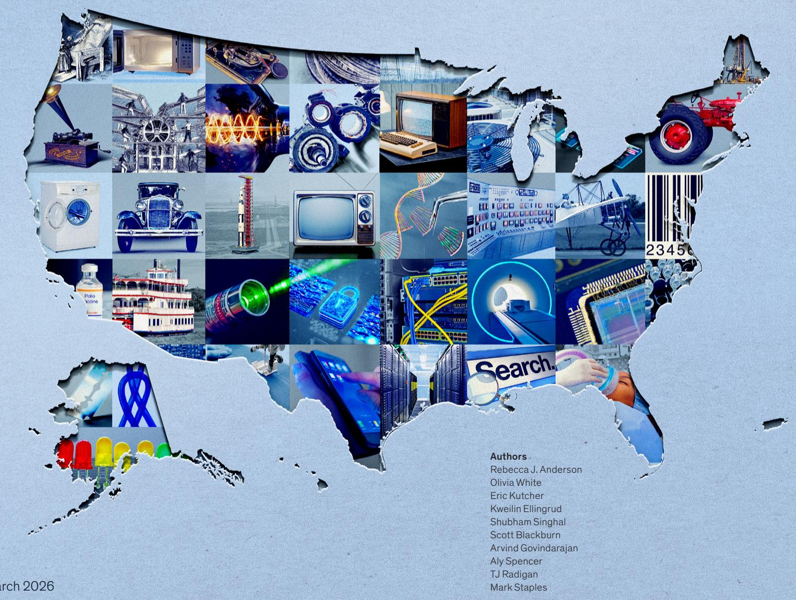

Authors
Rebecca J. Anderson
Olivia White
Eric Kutcher
Kweilin Ellingrud
Shubham Singhal
Scott Blackburn
Arvind Govindarajan
Aly Spencer
TJ Radigan
Mark Staples

Confidential and proprietary. Any use of this material without specific permission of McKinsey & Company is strictly prohibited.

Copyright © 2026 McKinsey & Company. All rights reserved.

# McKinsey Global Institute

The McKinsey Global Institute was established in 1990. Our mission is to provide a fact base to aid decision making on the economic and business issues most critical to the world's companies and policy leaders. We benefit from the full range of McKinsey's regional, sectoral, and functional knowledge, skills, and expertise, but editorial direction and decisions are solely the responsibility of MGI directors and partners.

Our research is currently grouped into five major themes:

— Productivity and prosperity: Creating and harnessing the world’s assets most productively

— Resources of the world: Building, powering, and feeding the world sustainably

— Human potential: Maximizing and achieving the potential of human talent

— Global connections: Exploring how flows of goods, services, people, capital, and ideas shape economies

— Technologies and markets of the future: Discussing the next big arenas of value and competition

We aim for independent and fact-based research. None of our work is commissioned or funded by any business, government, or other institution; we share our results publicly free of charge; and we are entirely funded by the partners of McKinsey. While we engage multiple distinguished external advisers to contribute to our work, the analyses presented in our publications are MGI's alone, and any errors are our own.

You can find out more about MGI and our research at www.mckinsey.com/mgi.

MGI directors

Shubham Singhal (chair)

MGI partners

Arvind Govindarajan

Chris Bradley

Mekala Krishnan

Tanguy Catlin

Kweilin Ellingrud

Anu Madgavkar

Sylvain Johansson

Jan Mischke

Nick Leung

Jeongmin Seong

Olivia White

## Contents

At a glance 3
Introduction 5

CHAPTER 1

At 250, the United States is the world's most competitive economy 6

CHAPTER 2

Looking back: Four chapters 21

CHAPTER 3

The foundations of US competitiveness 38

CHAPTER 4

Looking ahead: Securing the next era 46

CHAPTER 5

America's national project 65

Acknowledgments 67

Endnotes 68

## At a glance

\- At 250 years old, the United States is the world's most competitive economy. It generates 26 percent of global GDP and is home to 59 of the world's top 100 firms. In the past several years, accelerating US productivity growth and announced foreign direct investment inflows have sharpened its edge over other advanced economies.

— It's a new world. AI is unveiling an ever-expanding realm of possibilities, just as geopolitical contention is growing and fertility rates are falling. The United States is a global technology leader today and spends 27 percent of the world's research and development dollars—but will that be enough to sustain its current 59 percent share of top firms?

— Some US historical competitive advantages are becoming liabilities. Current generations owe it to future ones to address deteriorating fiscal health, eroding infrastructure, declining educational achievement, fading manufacturing know-how, and sustained disparities in income and wealth.

\- Safeguarding an economic edge requires evolving, as America has before. The United States has repeatedly adapted its economic model to meet, and then shape, new technologies and geopolitical realities. Since the country's founding, American competitiveness has shifted but sustained across four historical chapters: agricultural, industrial, scientific, and digital. A new one is coming.

— A culture of innovation and natural abundance are abiding strengths on which to draw. By our count, Americans created or supported 76 of the 100 most important inventions since 1776, from steamboats to smartphones, from the electrical grid to generative AI. Over its history, the country has profited from twice as much agricultural land per capita as any other large economy, and it was largely self-sufficient in energy for 200 years, including since 2019. These are just a few examples of its resource wealth.

— We the people will write the coming chapter. Collective effort from American individuals, business, and government can ensure energy abundance, an infrastructure backbone, education that builds minds and skills to match new technology, and the financial strength to pay for it all. The prize is continued growth, national economic security, and economic opportunity for everyone.

US share of global total, %

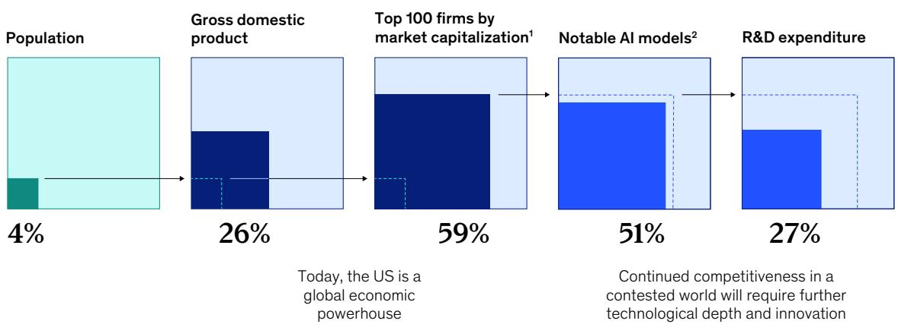  
$^{1}$ As of December 31, 2025.  
$^{2}$ Epoch AI defines “notable AI models” as particularly influential machine learning models, selected based on criteria such as state-of-the-art performance, historical significance, and high citation rates. The data set is manually curated and not exhaustive.

Source: World Bank; World Intellectual Property Organization; McKinsey Value Intelligence; Epoch AI, “Data on AI Models,” published online at epoch.ai, accessed February 2026; McKinsey Global Institute analysis

McKinsey & Company

## Introduction

It began with a startling act of rebellion. In July 1776, delegates from 13 British colonies declared their independence, dissolved their bonds with England, threatened war, and pledged “our Lives, our Fortunes and our sacred Honor” to each other and their newly united states.

One delegate described the mood in the room as a “pensive, awful silence.” The new nation’s leaders harbored grave reservations. All were acutely aware of the potential consequences of their choice: ruin, prison, war, and death. At a remove of 250 years, it’s hard to conceive of the courage that the founders summoned as each walked to the desk and picked up the quill.

Their courage paid off. Over two and a half centuries, the country has transformed from a collection of agrarian colonies into the world's largest and most influential economy. American firms shape global markets, accounting for more than half of the world's market capitalization. US innovation ecosystems define the frontier of science and technology; 76 of the 100 most influential innovations of the past 250 years came at least in part from American minds and hands. Average living standards have exceeded those of any other large nation for the past 100 years, even as affordability remains an issue. By these and many other measures, the United States today is the most economically competitive country in the world.

America's enduring economic edge was never inevitable. The United States, like most every nation, has been shaped by extraordinary difficulties—wars, recessions, depressions, and pandemics. But America has consistently come through in ways that others have not. In large measure, that's thanks to two foundations of American economic competitiveness that it has relied on again and again: a culture of ambition and individual achievement, and a bountiful natural endowment.

Through every chapter of the past 250 years, the United States has harnessed these foundations, not in a fixed economic model but through flexible institutions that have made the next adaptation possible. And it has done so collectively. “We the people”—farmers in the fields, tinkerers in backyard workshops, teachers in schoolrooms, machinists at forges, seamstresses at machines, developers pulling all-nighters to invent world-changing code—have built an American economic powerhouse.

Today, the United States possesses immense economic strengths anchored in its twin foundations. But if history is any guide, these will carry the country only so far. The challenges are clear and present: a mounting national debt, eroding infrastructure, slipping test scores, fading manufacturing know-how, and sustained disparities in income and wealth. The question America confronts today is not how to celebrate its past but whether it can once again find a new alignment of its resources, ambitions, institutions, and policies to secure competitiveness in the next chapter of its story.

Much is at stake: individuals' access to productive employment and affordable essential goods, businesses' ability to scale and take risks, and government's capacity to raise funds and ensure national economic security.

This report examines the arc of US competitiveness, past, present, and future. America's history of reinvention holds compelling lessons as the nation confronts a future of immense if uncertain opportunity.

CHAPTER 1

# At 250, the United States is the world's most competitive economy

Over the course of 250 years, the United States has transformed from a small agrarian economy to the world's leading economic power, a position it has enjoyed for more than a century. Today it has the highest income of any populous country (Exhibit 1). $^{1}$

American firms have undergone a spectacular evolution, from small textile mills in New England to world-leading industrial powerhouses to platform technology companies that shape everyday lives around the globe. American innovation, once a matter of adapting tools developed elsewhere to local settings, has gone on to set the global technology frontier. Over time, rising productivity has steadily lifted household living standards and created economic opportunities for millions.

The combination of leadership in global markets, powerful innovation ecosystems, and individual economic opportunity and prosperity can be summed up in one phrase: economic competitiveness (see sidebar "Defining—and measuring—competitiveness").

Today, the United States has 4 percent of the global population but generates 26 percent of GDP, and it accounts for more than 50 percent of market capitalization (Exhibit 2). It has exceeded many of its rich-country peers in labor productivity and growth, especially in recent years, when productivity has accelerated at levels unseen in other major economies. $^{2}$ Leadership in technology also continues to underpin US competitiveness: The country is home to a plurality of the world's top-cited scientists and has the most notable AI models. $^{3}$ Announced annual inflows of greenfield foreign direct investment (FDI) have roughly doubled from the prepandemic period. $^{4}$ And today, as it has since roughly 1900, GDP per capita exceeds that of other major economies.

# The United States has cause for celebration. But there are also reasons for reflection.

## Exhibit 1

## By 1900, the United States had the world's leading economy by size and individual incomes.

Real gross domestic product, $^{1}$ 1820–2024, \$ trillion in 2024  
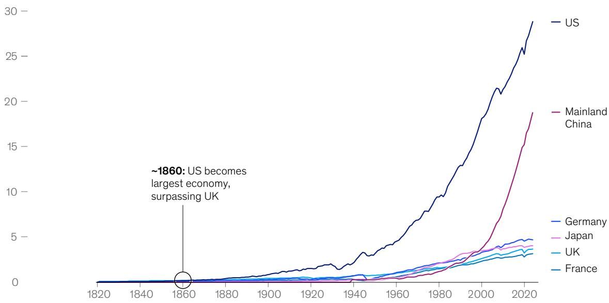

Real gross domestic product per capita, $^{2}$ purchasing power parity, 1800–2024  
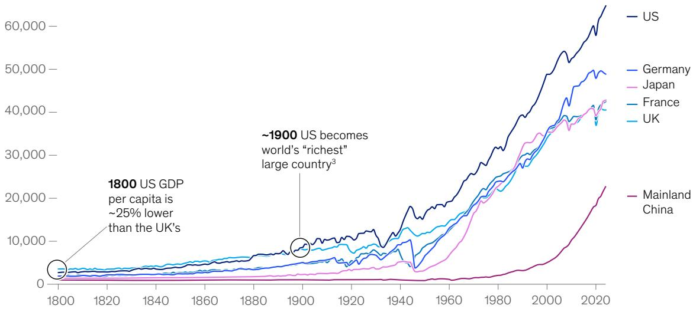  
$^{1}$ Graph shown using real dollars with the base year 2022, using real annual growth rates from the Maddison Project to project backward. Using this methodology, the US economy surpasses the United Kingdom's economy in 1858. Using purchasing power parity, this crossover happens in 1862. Estimates by other academic and journalistic sources range from 1860 to 1890 (eg, Chinn and Frankel, 2008). $^{2}$ In constant 2011 prices.  
$^{3}$ At various times throughout history, several smaller countries with populations of fewer than 10 million people have had a higher GDP per capita than the US (eg, Ireland and Norway today).  
Source: Maddison Project (2023); World Bank; McKinsey Global Institute analysis

## McKinsey & Company

Sidebar

## Defining—and measuring—competitiveness

While there is no universally agreed-upon definition of “competitiveness,” we identified three features that are central to most discussions of the topic, straightforward to understand, and readily visible in the world today: $^{1}$

1. Globally leading firms. First and foremost, a competitive economy has firms that can compete globally and reach scale through a combination of lower relative operating costs (greater efficiency) and quality.

2. Innovation and technology leadership.
A competitive economy also has growing productivity, which is fundamentally driven by expanding know-how, innovation, and new technological development. Sustained competitiveness across time means always being a technological step ahead.

3. Economic opportunity. An economy is only truly competitive if the gains from economic activity translate to prosperity for its people. In the long run, wages and overall prosperity tend to rise with productivity.

A common theme across academic literature is productivity, which both signals and drives competitiveness. High productivity suggests a significant degree of know-how in addition to sophisticated capital inputs, such as machinery. A high growth rate suggests rapid knowledge development, innovation, and advancement of technology. Without high productivity, countries and their firms cannot lead markets over time. Productivity also translates to wage gains for workers and greater prosperity in the long term. $^{2}$

The last feature may be surprising to some. Prosperity is fundamental to competitiveness for multiple reasons. For one, it is mutually reinforcing with market leadership and innovation, as higher wages attract top talent. Households that can

fulfill their basic needs and generate wealth are more productive and spend more as consumers, further reinforcing growth. And economic opportunity is essential to countries in the competition to be the most attractive places to live and work.

Several metrics can be used to measure global market-leading firms, innovation and technology leadership, and individual opportunity and prosperity. Selecting a few is inevitably arbitrary to some degree. The metrics in Exhibit 2, especially those pertaining to individual opportunity and prosperity, are a representative sample, showing a range of strengths and challenges for every country. Not shown are a host of metrics that measure the inputs needed to achieve growth—for example plentiful energy and human capital. We discuss some of these in later chapters.

# Prosperity is mutually reinforcing with market leadership and innovation, as higher wages attract top talent.

# The United States remains the world's largest economy, is home to the world's most valuable companies, and leads in technology and innovation.

Competitiveness indicators for G7 economies and Mainland China

<table><tr><td rowspan="2"></td><td rowspan="2">Global rank among large countries with data available1</td><td colspan="3">Mainland China</td><td>Japan</td><td>France</td><td colspan="2">Canada</td></tr><tr><td>US</td><td colspan="2">Germany</td><td>UK</td><td colspan="3">Italy</td></tr><tr><td rowspan="9">Globally leading firms</td><td>GDP nominal, $ trillion, 2024</td><td>29</td><td>19</td><td>5</td><td>4</td><td>4</td><td>3</td><td>2</td></tr><tr><td>Labor productivity per hour, $ PPP, 2024</td><td>98</td><td>22</td><td>93</td><td>59</td><td>79</td><td>88</td><td>75</td></tr><tr><td>Share of top 100 firms by revenue, %, 2024</td><td>47</td><td>18</td><td>6</td><td>6</td><td>2</td><td>4</td><td>1</td></tr><tr><td>Share of top 100 firms by market capitalization, %, 2025</td><td>59</td><td>12</td><td>2</td><td>2</td><td>4</td><td>3</td><td></td></tr><tr><td>Share of global market capitalization, %, 2022</td><td>54</td><td>10</td><td>2</td><td>6</td><td>3</td><td>2</td><td>1</td></tr><tr><td>Share of global venture capital investment, %, 2024</td><td>58</td><td>12</td><td>2</td><td>1</td><td>5</td><td>2</td><td></td></tr><tr><td>Share of global FDI inflows, %, 2024</td><td>18</td><td>8</td><td>0</td><td>1</td><td>-3</td><td>2</td><td>2</td></tr><tr><td>Share of global manufacturing output, %, 2024</td><td>11</td><td>45</td><td>4</td><td>3</td><td>1</td><td>2</td><td>2</td></tr><tr><td>Share of global exports, %, 2024</td><td>10</td><td>17</td><td>8</td><td>3</td><td>2</td><td>3</td><td>3</td></tr><tr><td rowspan="7">Innovation and technology leadership</td><td>Productivity growth, %, 2019–24</td><td>1.8</td><td>5.7</td><td>0.3</td><td>0.7</td><td>0.4</td><td>-0.4</td><td>-0.1</td></tr><tr><td>R&amp;D expenditure as share of GDP, %, 2023</td><td>4</td><td>3</td><td>3</td><td>3</td><td>3</td><td>2</td><td>1</td></tr><tr><td>Total AI private investment, $ billion, 2024</td><td>109.1</td><td>9.3</td><td>2.0</td><td>0.9</td><td>4.5</td><td>2.6</td><td>0.9</td></tr><tr><td>Count of notable AI models,2 2025</td><td>48</td><td>32</td><td>0</td><td>0</td><td>0</td><td>1</td><td>0</td></tr><tr><td>Share of last 10 years&#x27; most cited scientists, %, 2016–25</td><td>38</td><td>5</td><td>5</td><td>4</td><td>9</td><td>3</td><td>3</td></tr><tr><td>Share of last 10 years&#x27; science Nobel Prizes, %, 2016–25</td><td>47</td><td>0</td><td>4</td><td>7</td><td>16</td><td>9</td><td>1</td></tr><tr><td>Global Innovation Index rank, 2025</td><td>3</td><td>10</td><td>11</td><td>12</td><td>6</td><td>13</td><td>28</td></tr><tr><td rowspan="4">Economic opportunity</td><td>GDP per capita, $ thousand PPP, 2024</td><td>86</td><td>27</td><td>72</td><td>52</td><td>61</td><td>61</td><td>61</td></tr><tr><td>Top 10% to bottom 50% pretax income ratio,3 2024</td><td>35</td><td>31</td><td>20</td><td>23</td><td>17</td><td>17</td><td>15</td></tr><tr><td>Average total years of schooling, 2023</td><td>14</td><td>8</td><td>14</td><td>13</td><td>13</td><td>12</td><td>11</td></tr><tr><td>PISA simple average of math/reading/science scores,4 2022</td><td>489</td><td>579</td><td>482</td><td>533</td><td>494</td><td>478</td><td>477</td></tr></table>

$^{1}$ The ranking is out of countries with population greater than 10 million. Country availability varies by metric, up to 94 countries.  
$^{2}$ Epoch AI defines “notable AI models” as particularly influential machine learning models, selected based on criteria such as state-of-the-art performance, historical significance, and high citation rates. The data set is manually curated and not exhaustive.  
$^{3}$ The ratio of the share of income received by the top 10% of the population to the share received by the bottom 50% of the population, a measure of income inequality.  
$^{4}$ China does not participate in the OECD's Programme for International Student Assessment (PISA) nationwide. Scores are based on four provinces only—Beijing, Shanghai, Jiangsu, and Zhejiang.

McKinsey & Company

These are cause for celebration. But there are also reasons for reflection. The United States is no longer the global leader in manufacturing and trade. Its lead on technology is narrowing amid greater competition with China. $^{5}$ And the picture of household well-being is mixed: Although aggregate measures show high levels of income, many households feel they can no longer keep up economically, contributing to low levels of public trust. $^{6}$

Here we examine the hallmarks of economic competitiveness: globally leading firms, leadership in technology and innovation, and economic opportunity.

## US firms lead global markets

American companies make up more than half of the top 100 firms globally by market capitalization and revenue (Exhibit 3). From start-ups to large corporations, they attract an outsize share of capital from global markets. US firms hold more than half of global public equity funding and receive more than 50 percent of global venture capital (VC) investment. $^{7}$ These valuations are supported, at least in part, by the fact that US firms have the highest levels of productivity, and rates of productivity growth, among firms in G20 economies. $^{8}$ Large US firms excel on a range of other corporate performance metrics; compared to European peers, they have 30 percent higher returns on invested capital and 50 percent faster top-line growth. $^{9}$

Exhibit 3

US firms make up the majority of the world's largest companies.

Top 100 public companies in the world by market capitalization, Dec 31, 2025

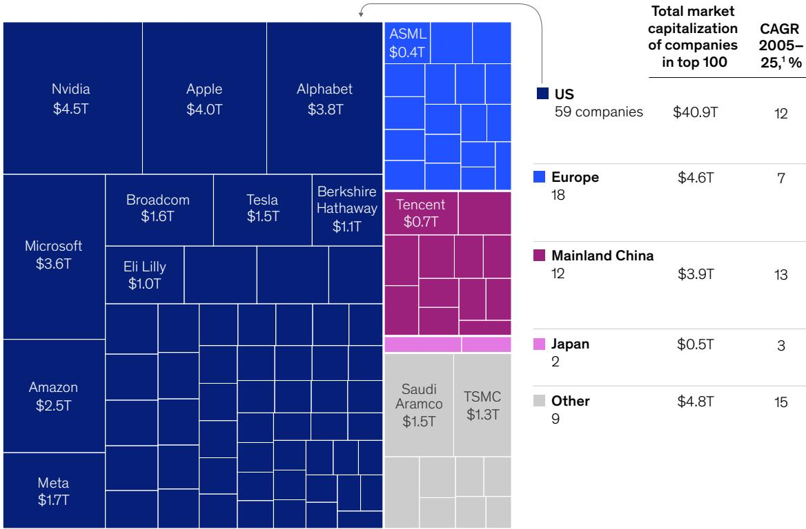  
$^{1}$ CAGR for only the combined value of companies displayed here—the top 100 by market capitalization in 2025—and not the entire economy. Source: McKinsey Value Intelligence; McKinsey Global Institute analysis

McKinsey & Company

<table><tr><td></td><td>At a glance</td><td>US economy at 250</td><td>Looking back at US competitiveness</td><td>Foundations of US competitiveness</td><td>Looking ahead</td><td>America&#x27;s national project</td><td>Endnotes</td></tr></table>

To be sure, a sizable share of US market capitalization is connected to the technology sector. Yet US firms lead across a range of sectors and are present in the upper echelons of all of them. $^{10}$

US market leadership is not a recent development: The United States has been the preeminent home to the world's top companies for more than a century, even as these companies have themselves turned over (Exhibit 4). Over the past 25 years, for example, only Microsoft has remained in the top ten global firms by market capitalization. The sectoral composition has also shifted, from industrials and energy through the 1980s to almost entirely technology today.

Exhibit 4  
US firms have led global rankings for more than a century.  
Top 10 largest publicly traded firms in the world by market capitalization $^{1}$  
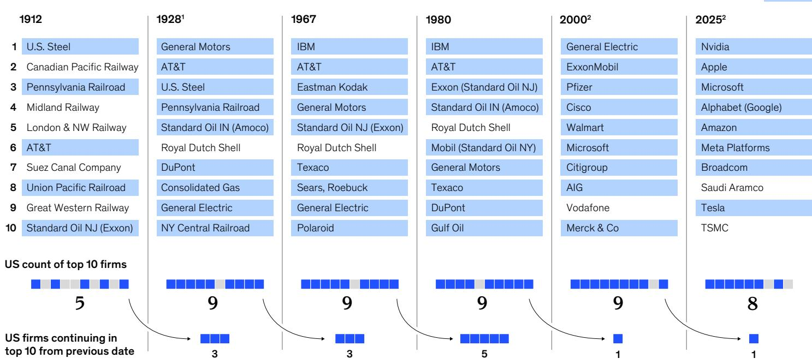  
$^{1}$ Ranked by net profit instead of market capitalization because of limited data availability. $^{2}$ As of end of day on the last trading day of the year.  
As of end of day on the last trading day of the year. Source: City Index (1980); Forbes (1967); Time (1928); Peter Wardley, "A global assessment of the large enterprise on the eve of the First World War: Corporate size and performance in 1912" (2006); McKinsey Value Intelligence (2000, 2025); McKinsey Global Institute analysis

McKinsey & Company

Fundamentally, US firms' outperformance is rooted in greater dynamism: They exhibit higher rates of labor reallocation, market entry and exit, and growth of young firms. $^{11}$ That dynamism translates to higher national productivity growth (Exhibit 5). $^{12}$

US firms show higher levels of dynamism and resulting productivity.

Contribution to national productivity growth, 2011–19, percentage points

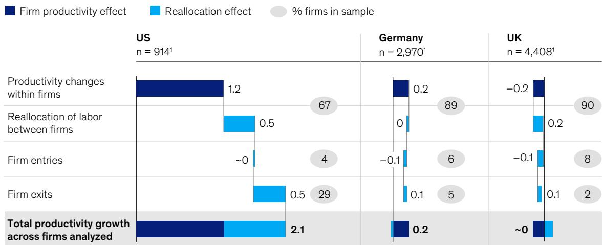  
$^{1}$ Our analysis uses a firm-level “lab economy” of \~8,300 large firms (50+ employees; mostly 250+ and 500+ in the US) headquartered in the US, Germany, and the UK across four sectors (retail; automotive and aerospace; travel and logistics; computers and electronics), covering approximately two-thirds of large-firm value added and most productivity growth in these sectors.
Source: Capital IQ; EU KLEMS; Moody's; US Bureau of Labor Statistics; McKinsey Global Institute analysis

## McKinsey & Company

## US manufacturing leadership has receded

Notably, one major sector in which the United States no longer has a leading global market share is manufacturing. China began expanding its industrial capacity in the 1980s, then ramped it up on a large scale in the 2000s, surpassing the United States in share of global manufacturing output in 2010. Today, China produces nearly half of global manufacturing output, compared to 11 percent for the United States. $^{13}$

US manufacturing has also lost ground domestically as the economy has shifted toward services. Over the past 50 years, manufacturing's share of both GDP and employment has declined from more than 20 percent to less than 10 percent today. $^{14}$ This halving of manufacturing employment is equal to about 19 million jobs today. These were mostly middle-class jobs, and they have been offset by growth in high-skill jobs in the knowledge economy—for example, in technology software and finance—along with lower-skill services jobs such as home cleaning. $^{15}$ Between 2000 and 2018, for example, the share of all US jobs with wages in the middle of the income distribution fell six percentage points. $^{16}$

The shift to services has had additional economic implications. For one, as the United States began to import the goods it consumed, it tilted from trade surplus to trade deficit. Before 1976, the United States was a net exporter; it then became a net importer, with a trade deficit hovering around 3 percent of GDP over the past decade. $^{17}$ And over time, the United States has lost some of its capacity to produce a wide range of products—from sports shoes to smartphones, dysprosium to data processors, ships to chips—presenting questions about future resiliency. $^{18}$ Of course, some of these products matter more for national security and future economic competitiveness than others.

Today, 40 percent of US imports, worth more than \$1 trillion, are considered critical, or “central to resilient, diverse, and secure supply chains to ensure economic prosperity and national security.” $^{19}$

Nevertheless, the United States remains the second-largest manufacturer and trading partner for the world, accounting for 10 percent of the world's total exports. With an output of \$7.3 trillion, including in many of the same products or categories where it imports large volumes, and a workforce of almost 13 million, the United States retains a strong manufacturing base on which it might build capacity in industries that will become increasingly important in the future, including semiconductors, electrification, and next-era hardware such as robotics and autonomous systems. $^{20}$

New manufacturing capacity is more than just factories. Also needed are an educated and skilled workforce that can fill shortages in fields such as engineering; a strong national balance sheet to support the needed financing; and restored investment in infrastructure, especially for energy.

## US leadership in innovation and tech continues as new pressures emerge

Continued high valuations hinge on whether recent accelerations of productivity will indeed translate to higher economic (and earnings) growth over the long term. $^{21}$ Higher productivity growth rates, especially in recent years, have been accompanied by higher rates of business investment and R&D spending, a positive sign for long-term growth potential. The United States leads the world on R&D spending in absolute terms, and, among major economies, as a share of GDP. Large US firms (those with at least 1 billion in annual revenue) have expanded their investment and R&D spending more rapidly than peers in other major economies. Compared to European peers, for example, they have 60 percent greater investment and 80 percent greater R&D intensity, and they have increased their investment and R&D at more than triple the European rate (Exhibit 6). $^{22}$ Big tech firms drive much of this disparity.

## The US lead in technology is narrowing as China becomes more competitive.

## Exhibit 6

## Large US firms lead on investment, outpacing their European counterparts.

Capital expenditure and R&D spending of large $^{1}$ US and European $^{2}$ companies, $^{3}$ 2010–22, $^{4}$ real 2022 \$ billion

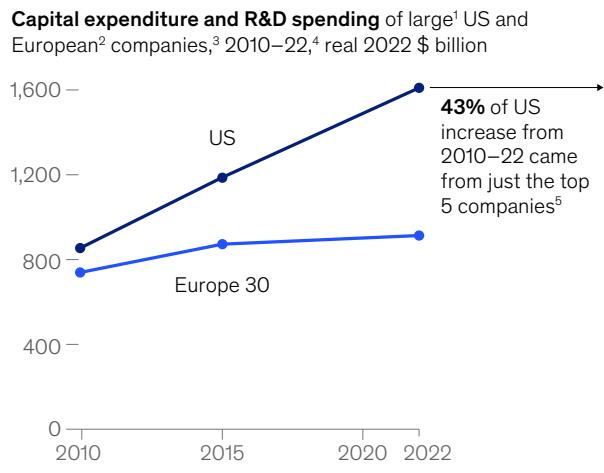  
$^{1}$ Annual revenues >\$1 billion.

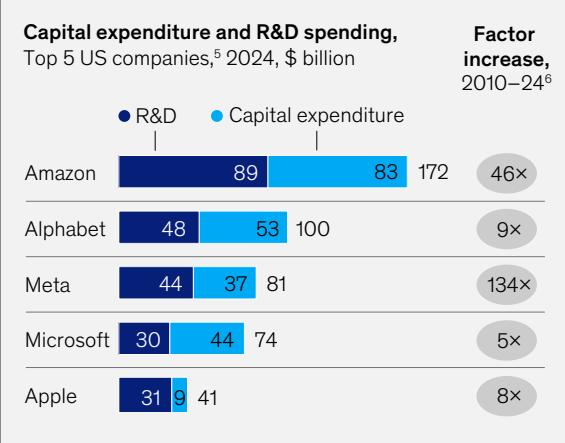  
$^{2}$ Europe 30 = EU-27 plus Norway, Switzerland, and the UK.  
$^{3}$ Considers only public companies; excludes intangible assets.  
$^{4}$ Historical spending for both Europe 30 and the US is adjusted for inflation; for the US, spend is converted from euros to dollars using the foreign exchange rate for each individual year, deflating with US inflation rates, and converting the deflated US spending figures back to euros based on the 2022 foreign exchange rate. $^{5}$ As ranked by total capital expenditure and R&D in 2024.  
$^{6}$ Adjusted for inflation. In nominal terms, factor increases are, respectively: 63x, 13x, 185x, 7x, and 11x.  
Adjusted for information in Nominal terms, factor increases are, respectively: USD, IBX, USDX, FX, and FX. Source: AMECO; The Conference Board; S&P Global Market Intelligence; US Bureau of Labor Statistics; World Bank; McKinsey Value Intelligence; McKinsey Global Institute analysis

## McKinsey & Company

Private-sector investment in frontier technologies exceeded \$1 trillion between 2021 and 2024, complemented by more than \$50 billion in federal R&D funding. $^{23}$ The return on investment is striking: America has outperformed in intellectual property and critical technologies. The World Intellectual Property Organization ranks the United States near the top of its Global Innovation Index. $^{24}$ And compared with other major economies, the United States has more than a tenfold lead in private investment in AI. Today, the nation leads the world in the number of notable AI models, accounting for more than half of the world's total. $^{25}$

Another effect: Flourishing US knowledge ecosystems of universities and venture capital—backed start-ups attract and develop many of the greatest minds from all over the world, paving the way for ongoing success in science and technology. Today, nearly 40 percent of the world’s leading scientists, or those in the top 200,000 globally by citations, are based in the United States; no other country has more than 10 percent. $^{26}$ Half of the scientific Nobel Prize winners over the past decade call America home. $^{27}$

## Competition in critical technologies is heating up

Past success does not guarantee future results, of course, and the US lead in technology is narrowing as China becomes more competitive. Some are now warning of a second “China shock,” should China displace American leadership in critical technologies. $^{28}$

Beyond simply focusing on the gaps of the past, the United States needs to prepare for leadership in the industries that will be most important in the coming decades. Future competitiveness increasingly hinges on leadership in critical technologies, such as AI, robotics, biotechnology,

quantum computing, high-performance batteries, and space-based technology. $^{29}$ Economically, these technologies promise great gains for profits and wages. Geopolitically, they will be critical for protecting national security; their dual-use (military and civilian) nature means firms that develop them will be on both frontiers. In all these areas, China has made rapid progress and, in some cases, has taken the lead.

In remarkably short order, China has moved from producing low-cost goods to leading the world in complex, capital-intensive industries such as electric vehicles and photovoltaics. $^{30}$ This shift is now extending beyond manufacturing into research-intensive domains once dominated by advanced economies. In biotechnology, for example, China's output in drug discovery has grown more than tenfold since 2013. $^{31}$ As of 2024, China surpassed the United States in number of clinical trials and in the count of clinical-stage molecules. $^{32}$ Altogether, China's life sciences industry is no longer confined to generic biologics or follow-on products, and it is now playing a leading role in generating sophisticated novel biologics. $^{33}$

In the domain of AI, while America still has the most sophisticated AI models, China has more robots than the rest of the world combined. $^{34}$ The United States has approached AI as a product unto itself, focusing on screen-based text and images. China's approach, however, has emphasized AI's deployment in the physical world, with intelligent machines that can see, decide, and act in real time. $^{35}$ For example, Chinese firms are integrating AI into industrial robots that learn from their environments, drones that analyze visual data onboard while in flight, and autonomous vehicles whose core intelligence runs directly inside the vehicle rather than in the cloud. $^{36}$

Recently, China has also established a strong presence in the realm of fundamental scientific research, advancing the frontiers of knowledge. $^{37}$ From 2017 to 2023, China overtook the United States in most cited research in fields including machine learning, quantum sensors, advanced integrated circuit design and fabrication, adversarial AI, natural language processing, and high-performance computing (it already led in other fields, including electric batteries and advanced magnets). $^{38}$ In some instances, China is deploying this research in practical uses with tangible output; for example, China developed the world's first quantum satellite. $^{39}$ Although most cities with dense populations of highly cited researchers are American, Beijing saw the largest absolute inflow from 2019 to 2023. $^{40}$

To lead in critical technologies in the decades to come, the United States will need not only to establish an edge in today's emerging technologies but also to make the discoveries that uncover tomorrow's. The nation will need to support innovation ecosystems and continue to attract—and build—talent. Currently the United States graduates fewer engineers than China, both in absolute terms and relative to population size. $^{41}$ Even more fundamentally, in K-12 education, the United States lags behind both its own historical record and other major economies. The 2024 National Assessment of Educational Progress showed a downward trajectory in math, science, and reading; only about a third of eighth-grade students were proficient. $^{42}$ The Programme for International Student Assessment found that American 15-year-olds score lower on average in math than their peers in all other G7 economies. $^{43}$ A robust public education system rooted in general knowledge and problem solving has been a historical strength of the United States. $^{44}$ The question today is how to restore that advantage.

## Average incomes are high, but prosperity is uneven

Beyond scale of firms and leadership in technology, a final component of competitiveness is economic opportunity, or the extent to which growth translates to household prosperity in the form of higher incomes. Economic opportunity drives a virtuous cycle with innovation, as the potential for high incomes (and access to resources, such as start-up capital) attracts and retains top talent.

Higher broad-based wages fuel thriving consumer markets, a longtime driver of American growth. More broadly, when individuals have higher living standards, they tend to be more productive, fostering further growth. $^{45}$

Today, the United States remains a place of immense economic upside, producing high average incomes; no other country of ten million or more people has a higher GDP per capita (even in purchasing power parity terms). The story is particularly pronounced for Americans in high income brackets: The paychecks of the top decile of American earners are 10 to 50 percent higher than those of peers in major European economies and Canada. Perhaps less well known, Americans in the top 40 percent of income earn more than their counterparts in major European economies, and the top 20 percent earn more than their peers in Canada.

The story changes for the bottom half of the income distribution, with American incomes lagging behind those of major European economies and Canada (Exhibit 7). $^{46}$ The bottom quintile of American incomes has been gaining ground recently, but the gap remains wide. Among major economies, the United States has one of the widest gaps in income levels between the top 10 percent and bottom 50 percent. $^{47}$

This gap in income levels has grown over the past 50 years. Although all income segments have seen real growth, market incomes (wages and asset flows) have grown the most for the top two quintiles. For the bottom 60 percent of the population, more income growth has come in the form of government benefits than from wages, and the middle quintile has seen the lowest overall growth. $^{48}$

## Exhibit 7

Top earners give the United States its income edge.

Pretax national income per capita by income segment, 1980–2024, real \$ at purchasing power parity (Indexed US = 100)

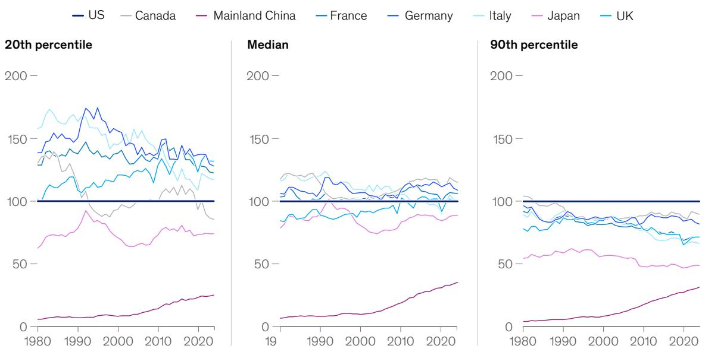  
Source: Timbeau (2024); World Inequality Database; McKinsey Global Institute analysis

McKinsey & Company

This disparity in wage growth has many well-researched causes. For example, as discussed, technological change and deindustrialization have reduced the availability of middle-wage jobs while expanding demand for both highly educated and low-wage workers. $^{49}$ High returns from financial assets, meanwhile, have produced very high levels of wealth for high-income households, which tend to own more assets: The top 1 percent of wealth holders have more than \$16 million in wealth per capita and collectively own 5 percent of global wealth. $^{50}$ Others include insufficient human-capital development for many American workers and pressures from expanding global trade. $^{51}$

Sustained disparities in real wage growth and levels, wealth accumulation, and intergenerational income mobility have contributed to a growing sense among more Americans that they will not be able to reach their economic goals. As this sentiment takes hold, it raises the question of whether Americans' support for public policies that promote innovation and dynamism will continue.

Structural shifts, including the movement from a manufacturing-based to a services-based economy, have also led to a growing geographic dispersion of productivity levels, seen strikingly across major US cities (Exhibit 8). Over the past several decades, some have seen relatively modest productivity growth, including those in the historical Rust Belt. On the other end of the spectrum, cities with deep knowledge ecosystems have seen extraordinary gains and continue to offer high income possibilities. For example, in San Jose, California, GDP per capita has more than tripled since 2000 (see sidebar “What makes some cities more productive than others?”). $^{52}$ Notably, however, the cost of living also varies by city; housing in particular tends to be more expensive in cities with higher levels of productivity and income. $^{53}$

## Sidebar

## What makes some cities more productive than others?

Cities have long been cradles of innovation and hubs for economic activity in the United States and elsewhere. $^{1}$ How have some US cities capitalized on their advantages to become more productive than others?

First, the most productive cities are creating talent and innovation “flywheels” for the knowledge economy age. Deep pools of highly educated workers, major research institutions, and high R&D intensity are mutually reinforcing. $^{2}$ Of the metropolitan areas in the world with the most leading

scientists, eight of the top ten are in the United States: New York; Boston; San Jose/San Francisco; Washington, DC; Los Angeles; Chicago; Philadelphia; and Raleigh/Durham/Chapel Hill. $^{3}$ Six of the eight are in the top ten in the country for productivity at the metropolitan statistical area level.

Second, agglomeration economies help industry hubs flourish. Spillover effects for knowledge and skills boost productivity as workers switch jobs and form communities of practice. US history is rife with world-leading industry clusters, from hatmakers in Danbury, Connecticut, in the 1800s, to Detroit's automakers in the 1900s, to today's Kendall Square biotechnology cluster in Cambridge, Massachusetts. Recent work has found that agglomeration benefits vary sharply with distance and can be felt at the scale of a neighborhood or even within a building. $^{4}$

Cities specialize in different industries and so differences in sectors' productivity levels and growth are also part of the story. The information sector saw productivity growth of 5.6 percent from 2000 to 2024, driving enormous gains for cities with strong employment in that industry, like San Jose and Seattle, where the sector employs 14 percent and 8 percent of workers, respectively. Conversely, productivity grew by just 0.9 percent in healthcare and shrank by 0.2 percent in construction. Cities with greater reliance on these industries tended to see slower productivity growth.

## The most productive US cities have pulled further ahead of the pack since 1995.

Productivity in 40 largest metropolitan statistical areas (MSAs), real value added by employee 1995, 2019, and 2024, real 2017 \$, top 40 MSAs by employment in 2024

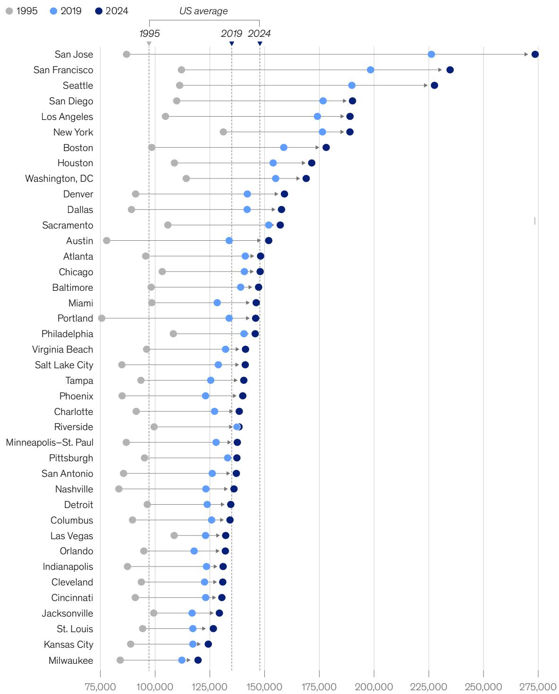  
Source: Moody's; US Bureau of Economic Analysis; US Bureau of Labor Statistics; McKinsey Global Institute analysis

McKinsey & Company

The United States remains the most competitive economy in the world on a multitude of fronts. Getting to this point has not been a straight path. There were twists and turns, transformations and reinventions. Before contemplating the future, we first turn to what can be learned from the past 250 years, telling the story of four chapters of US competitiveness.

CHAPTER 2

# Looking back: Four chapters

As we have seen, the United States has been the world's largest economy for more than a century. The rise of American competitiveness did not follow a linear or clear trajectory. Growth and innovation often happened in bursts, after moments of disruption and reinvention.

Taking stock of the past 250 years of US economic history, four chapters emerge (Exhibit 9). In each, the United States led global markets in at least one major area while working on new strains of innovation that planted the seeds for the following chapter of competitiveness, first in agriculture, then in industry, science, and knowledge. Major geopolitical events roughly mark the transition

## Over 250 years, US economic competitiveness has played out in four chapters.

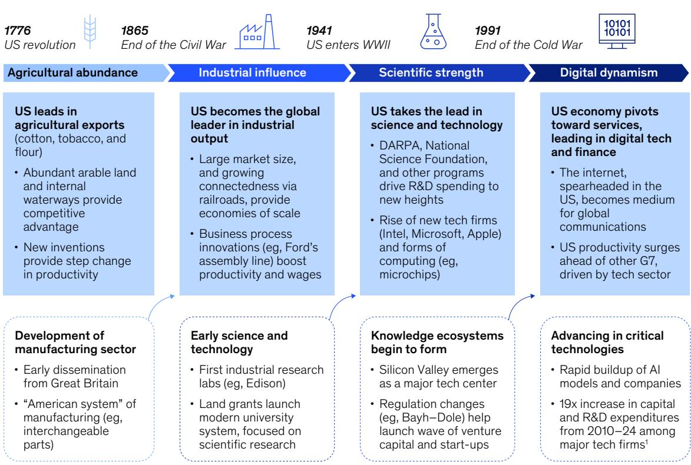  
$^{1}$ In non-inflation adjusted terms.
Source: McKinsey Value Intelligence; McKinsey Global Institute analysis

McKinsey & Company

between chapters—the Civil War, World War II, and the end of the Cold War. Heralding the end of each chapter, disruptions tested the country, and reinventions at these turning points ultimately strengthened the US economy and its position in the world.

## 1. Agricultural abundance

## American Revolution to the Civil War

In its first century-plus, the United States was a predominantly agrarian society. In the South, cotton boomed, making up most of the world market by 1820 and meeting strong demand from the booming British textile industry. $^{54}$ Other agricultural staples, especially wheat, flourished, too.

Port cities such as Charleston and New Orleans were major centers of trade. In the North, a burgeoning manufacturing industry took root, particularly around Boston and other New England cities. Philadelphia was another center of culture and commerce, as was New York (which surged ahead following the completion of the Erie Canal in 1825).

## Natural advantages and early inventions drove US agricultural competitiveness

From the start, the United States had a major advantage in the form of abundant arable land. As of 1776, the country (at that time, 13 states along the Eastern seaboard) was 430,000 square miles, compared with 88,000 for the island of Great Britain, whose population was more than three times larger. $^{55}$ And that land was productive: Americans consumed 1.4 times more calories per capita than residents of Western European countries (Exhibit 10). $^{56}$ Americans were two to three inches taller—a good proxy for human welfare—and had longer lifespans than the average person in the United Kingdom. $^{57}$ At the time of independence, US exports were overwhelmingly agricultural, especially tobacco, rice, and other grains. $^{58}$ One study found that South Carolina exported more than three-quarters of its rice crop in the 1730s. $^{59}$

The United States had another natural advantage: navigable waterways. Coastal passages with barrier islands and inland rivers made long-distance shipping efficient. The Mississippi River system alone, made fully accessible by the Louisiana Purchase of 1803, includes more than 6,000 miles of barge-ready shipping lanes. $^{60}$

A strong entrepreneurial spirit, together with supporting institutions, both cultivated great minds and encouraged invention. Among the American inventions of this era, the cotton gin (1794) and the mechanical reaper (1831) directly addressed the challenges of cotton and wheat production: Short-grain cotton (in the South) was tough to process, and wheat farmers (in the North) faced labor crunches in the short harvesting season. Both inventions significantly increased crop productivity. $^{61}$ Given soaring demand from the British textile industry during the First Industrial Revolution, cotton exports came to define America's position in the world, while also entrenching slavery in the antebellum South. $^{62}$

## Exhibit 10

The United States has historically led in agricultural land per capita.  
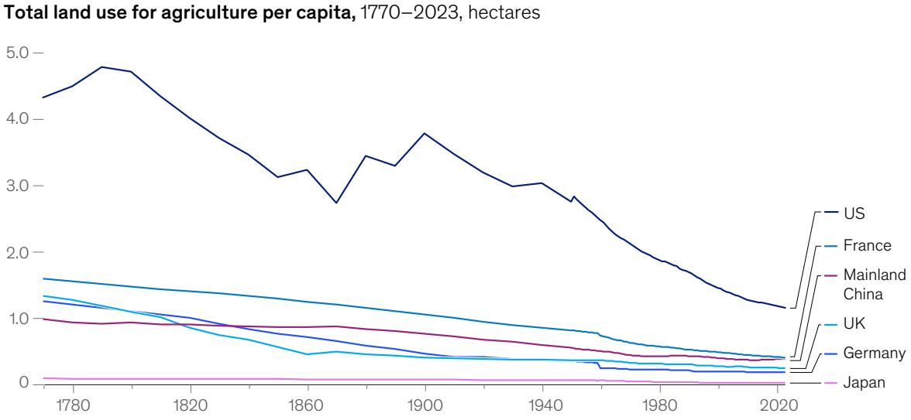  
Source: HYDE (PBL); McKinsey Global Institute analysis  
McKinsey & Company

Other critical American inventions of this era include the steamboat—first a working prototype (1787) and then a scalable commercial design (1807)—which hastened upriver transportation, reducing the journey from New Orleans to Cincinnati from about 15 weeks to 15 days; and the telegraph (1844), which sped up communication and connection across the country. $^{63}$ Telegraph lines were made from copper, another abundant natural resource.

## Old-world connections offered a leg up

British and European technology supported much of early US industrialization. The colonial legacy afforded access to British technology and expertise (through immigration, business dealings, and a common language) faster than much of the rest of the world.

By some accounts, early US manufacturing development was a matter of geopolitical happenstance: The United States imposed a trade embargo on Britain and France in 1807 in response to Napoleonic Wars in Europe, leading to a trade environment that allowed early firms, such as the Boston Manufacturing Company, to build domestic market share. Brewing tensions also provided a major impetus for the nascent US domestic arms-manufacturing industry, where interchangeable parts were first deployed at scale. $^{64}$ By the 1853 world's fair in New York City, the United States was internationally recognized as a leader in manufacturing innovation. $^{65}$

Other developments contributed to the early rise of US manufacturing and set the stage for its post-Civil War boom. The country quickly developed a sophisticated financial sector, which came to rival London's as early as the 1830s. The creation of national and state banks, as well as securities markets, notably for public debt, encouraged inflows of capital that ultimately funded major infrastructure projects such as railroads. $^{66}$ The Morrill Land Grant Act and Pacific Railway Act of 1862 propelled the creation of 57 colleges and universities focused on science and practical training (rather than classical studies) and the construction of a transcontinental railroad. Greater scientific knowledge and connectedness increased agricultural productivity and industrial human capital, setting the stage for the explosive growth of industry that characterized the next era. $^{67}$

## The Civil War marked a turning point

By the end of the Civil War, the United States had a clear innovation engine and a growing manufacturing base. The nation viewed its success to date and future promise through the lens of technological progress and economic dominance, demonstrated clearly in a fresco painted in 1865 in the eye of the US Capitol dome (see sidebar “The Apotheosis of Washington and American innovation circa 1865”).

Ultimately, the United States outpaced Britain and other European economies in per capita growth beginning about 1800 through the Civil War. New England alone had double the per capita growth of many European economies. $^{68}$ The Civil War marked a critical turning point for the US economy, ending slavery and redirecting capital investment, wealth, income, and political power to the North, particularly its industrial cities, setting the stage for the next era. $^{69}$

Sidebar

## The Apotheosis of Washington and American innovation circa 1865

The Apotheosis of Washington—a grand fresco depicting George Washington “rising to the heavens in glory” flanked by figures of Liberty and Victory—dominates the US Capitol rotunda ceiling. Completed in 1865, it was commissioned and begun in 1862, at the height of the Civil War. $^{1}$ Constantino Brumidi, an immigrant from Italy, painted the fresco. Before coming to the United States, Brumidi was a prominent painter in Rome, where his commissions included the official portrait of Pope Pius IX. $^{2}$

The fresco celebrates American innovation and achievement and suggests the future strength of a reunited country. $^{3}$ “Science” features Minerva, pointing toward Benjamin Franklin, Robert Fulton, and Samuel F. B. Morse. “Commerce” is represented by Robert

Morris, financier of the American Revolution. For “Agriculture,” Brumidi depicts Ceres seated on the McCormick reaper, while “Mechanics” shows Vulcan with a steam engine. “Marine” portrays Neptune and Venus with the transatlantic cable, which was being laid at the time. Finally, “War” departs from themes of technological innovation and instead celebrates the innovation of the American experiment, showing a soldier and an eagle defeating tyranny and monarchic power to pave the way for democracy and rule of, by, and for the people.

## 2. Industrial influence

## Civil War to World War II

Following the Civil War, the US-led Second Industrial Revolution gained full force, and America emerged as the world's preeminent industrial economy. Society grew more connected, shifting away from its agrarian and relatively isolated beginnings. Agricultural productivity in the prior era, immigration inflows, and expanding industrial opportunities promoted greater urbanization, especially in the Northeast.

The engines of the economy shifted as small firms grew. Across many industries, these consolidated into globally dominant industrial corporations. New York rose to become the country's unquestioned financial center, while cities across the Midwest became centers of industry (for example, Detroit for automobiles, Pittsburgh for steel) and transportation (Chicago became the country's rail hub). Los Angeles became the epicenter of the film industry, and later in the era, Washington, DC's prominence grew in line with the expanding role of government. By the late 19th century, the United States had become the world's largest economy and global leader in industrial output (Exhibit 11). The country also became the leader in overall GDP and income by 1900 (Exhibit 1 in Chapter 1). $^{70}$

The United States overtook the United Kingdom as the world's leading manufacturing power by the early 20th century.

Share of global manufacturing output, 1750–2024, %  
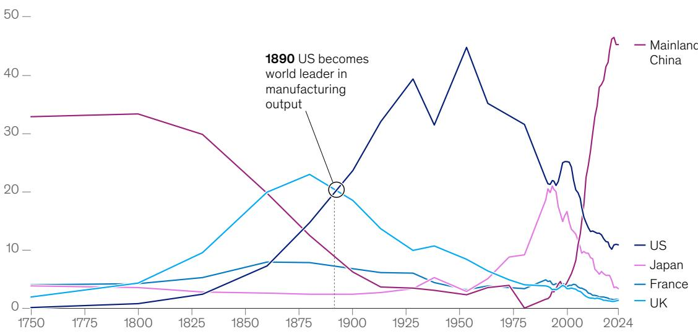  
Source: For 1750–1975: Paul Bairoch, "International industrialization levels from 1750 to 1980," Journal of European Economic History, 1982; after 1975: S&P Global Comparative Industry Service, accessed November 2025; McKinsey Global Institute analysis  
McKinsey & Company

While the half-century following the Civil War is typically known for its titans of industry and their rapidly expanding wealth, this era also saw widespread gains, the beginnings of a middle class, Henry Ford's "\$5 workday," and shifts in favor of better working conditions.

## The forces behind early US industrialization

While the rise of agricultural competitiveness in the first era was shaped in large part by the abundance of arable land, the second era would not have been possible without vast fossil fuel and mineral resources, especially coal, oil, and iron ore, together with railroads connecting the country.

By 1832, the United States had more railroad miles than any European country, and by 1870, a larger population. The rapid expansion of railroads was fueled by capital expenditure, which at its height topped 4 percent of GDP annually. This played a critical role in expanding market connectedness and transporting resources from mines to factories (which were previously dependent on proximity to falling water for hydromechanical power). $^{71}$ Trains carried anthracite coal from vast deposits first discovered a century earlier to power factories across the country. By 1899, the United States was the world leader in coal output (Exhibit 12). It was also the first country in the world to extract oil commercially, and by 1955, oil was the largest part of the US energy mix.

The size and increasing connectedness of the US market enabled American firms to gain economies of scale. $^{72}$ A common language across the country promoted standardization, driving further efficiency. Meanwhile, Atlantic and Pacific ports allowed plentiful access to international trade routes, positioning the United States at the center of the post-1870 wave of globalization. $^{73}$ In the early decades of the era, laissez-faire policies allowed firms to grow to unprecedented size.

Around 1900, the United States became the world leader in coal output, and maintained that position for approximately 60 years.

Coal output, $^{1}$ million metric tons, 1800–1960

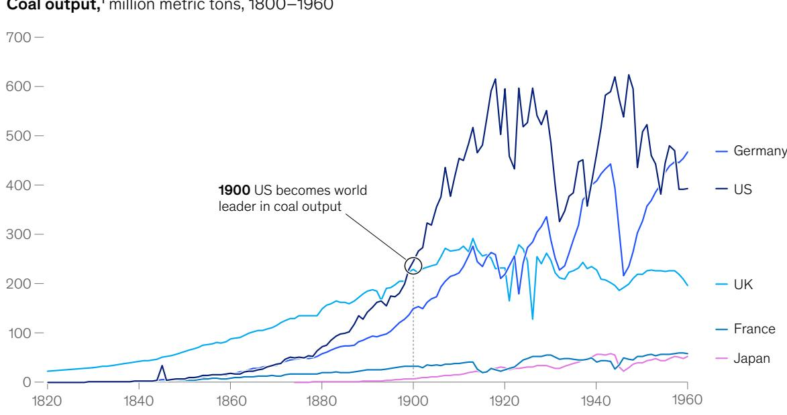  
$^{1}$ Includes bituminous and anthracite coal.
Source: International Historical Statistics; McKinsey Global Institute analysis  
McKinsey & Company

Immigrants provided a large consumer base and workforce. From 1850 to 1910, an average of about 420,000 immigrants entered the country each year. $^{74}$ By 1900, Chicago, for example, had a population of two million people, 70 percent of whom were born outside the United States. $^{75}$ With inflows of immigrants also came inflows of capital. A lasting connection to Britain provided a line to the world's dominant financial center, London. In New York, Wall Street boomed and bankers such as J. P. Morgan led the way in channeling funds to industry. $^{76}$

## By 1900, Chicago had 2 million people; 70 percent were born outside the United States.

## The fruits of research

Scientific and technical knowledge expanded in this era, bringing with it life- and work-altering inventions. More knowledge led to higher productivity growth, particularly in total factor productivity. $^{77}$

The 1862 Morrill Land-Grant Act established public colleges across the nation and helped expand the public university system from 24 schools to more than 100 by 1900. $^{78}$ These new institutions focused on practical skills for undergraduates and advanced federally supported research on agriculture and other applied sciences. Later revisions explicitly gave land-grant colleges the mandate to offer agriculture “extensions” to disseminate knowledge beyond the campus to local farmers. $^{79}$

Even more influential was the development of industrial research labs and modern corporations. $^{80}$ Corporate R&D labs, at firms such as General Electric and AT&T, professionalized invention and led to pivotal products including Thomas Edison's light bulb. Modern corporations, meanwhile, became more sophisticated in their operations. As they grew in scale, they required new forms of organization and management, sparking ideas that eventually created another American strength of this era: the professionalization of management. $^{81}$ Process innovations, best symbolized by Henry Ford's assembly line, led productivity growth to new heights and drove wages higher.

## A swing in the policy pendulum

Although policies in this era started off laissez-faire, the role of government in ensuring competitive and dynamic markets grew. The expanding power of large firms produced a wave of Progressive Era policies, such as the Sherman Antitrust Act of 1890, followed by the Clayton Antitrust Act of 1914. Increasingly deep financial crises and periods of deflation drove the creation of the Federal Reserve in 1913.

The Great Depression and the presidency of Franklin Delano Roosevelt created an earthquake that reset the paradigm toward greater government involvement in the economy (more specifically, boosting employment) through programs like those in the New Deal and infrastructure projects including the Hoover Dam. As of 1910, government spending was 2 percent of GDP; that increased to approximately 37 percent by 1945 (and has not dropped below 20 percent since). $^{82}$

## 3. Scientific strength

## World War II to the end of the Cold War

In the World Wars, the relative geographic isolation of the United States provided a crucial advantage: The continental United States suffered minimal material damage, while much of Europe and Asia endured devastating destruction. The mighty industrial base, process innovations, and managerial experience developed in the prior chapter mobilized resources to a scale hitherto unseen. $^{83}$ The country came out of World War II economically and militarily stronger than ever, giving it a primary seat at the table in establishing the postwar economic order.

Following World War II, US exports of manufactured goods led global markets for the next half century. In 1950, the country accounted for 27 percent of world GDP. $^{84}$ A strong manufacturing base and growing levels of education translated to rising household incomes and an expanding middle class. The population continued to urbanize and then suburbanize. The “American dream” increasingly took the shape of a suburban single-family home, stocked with electrical appliances, and a car or two out front.

As in the prior era, US manufacturing was supported by deep fossil fuel and mineral resources, a large, connected internal market, and a strong workforce. In the postwar era, however, America had a new advantage: the Bretton Woods system, in which the dollar became the global reserve currency, often called an “exorbitant privilege” in international markets. $^{85}$

What solidified US competitiveness in this era, however, was American leadership in the ever-important field of technology, rooted in rapid scientific discovery. The Northeast remained an important center of economic and scientific gravity, and metropolitan areas such as Houston, the San Francisco Bay Area, and Seattle rose to prominence for their connections to energy, early computing, and aerospace.

## The Cold War propelled research and commerce

The United States–developed atomic bomb was a decisive factor not only in ending World War II but also in establishing the United States as a global leader in science and technology. The Cold War provided a new imperative for technological advancement. Government spending on R&D supported business research and established organizations such as the Defense Advanced Research Projects Agency (DARPA), the National Science Foundation, and the National Institutes of Health, among other institutions. $^{86}$ In just the decade between 1940 and 1950, federal R&D spending grew 15-fold. $^{87}$

Technological leaps of the era included nuclear energy, semiconductors, rockets and satellites, and, ultimately, personal computers. The United States led the way on most of these, was involved with their invention, or adopted them quickly to become a competitor. This surge of invention continued a tradition established in the second era. These inventions were turned into products and scaled, inventing entire industries, by illustrious US firms founded in this era (Intel, Microsoft, Apple) and the era before (Boeing, Texas Instruments, IBM).

Perhaps the single most visible token of US scientific leadership was its rise to dominance in Nobel Prizes. The country surpassed the United Kingdom and Germany in annual science-based prizes in the lead-up to World War II and took the lead on cumulative prizes by 1955 (Exhibit 13). $^{88}$ The strength of US science itself aided this ascent, of course, but so did the decline of European scientific leadership, which started in the 1930s as many of that continent’s great scientists fled the rise of fascism. The trend of top scientists calling America home has continued since. Between 1940 and 2020, approximately 27 percent of United States–based Nobel Prizes in science went to winners born outside the United States. $^{89}$

America's focus on science and technology in this chapter was broad-based, stretching far beyond elite science. Investments in knowledge and skills, specifically through the GI Bill, led to an increasingly educated workforce. Average years of US schooling increased from eight in 1930 to 12 in 1980, ranking among the highest in the world. The number of US university students per thousand people more than quintupled in this same period, and approximately 2.2 million Americans used the GI bill to help pay for college by 1956. $^{90}$

From the 1940s, US scientists have received more international recognition.

Rolling 5-year total $^{1}$ of Nobel Prize recipients in scientific fields $^{2}$ by country, $^{3}$ 1905–2025  
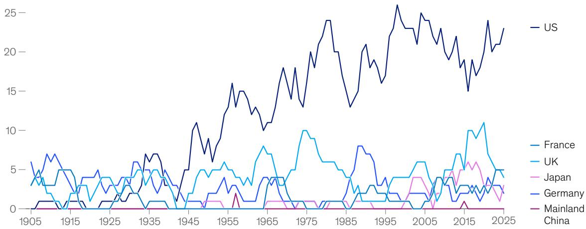  
$^{1}$ Figures shown for each year represent the total number of laureates in the previous five years.  
$^{2}$ Scientific fields includes chemistry, physics, and physiology/medicine; when prizes are split, each individual is counted once. Since prize splitting has become more common in recent years, the total number of prizes awarded is higher in later years.  
$^{3}$ Nationality given is the citizenship of the recipient at the time the award was made; individuals with multiple nationalities are counted multiple times, once for each of their nationalities.  
Source: Britannica; Nobel Foundation; McKinsey Global Institute analysis

## McKinsey & Company

## Economic disruptions marked a transition

The 1970s saw slowing productivity growth, energy crises, and double-digit rates of inflation. Just as the Great Depression provided a tectonic shift in favor of stronger government involvement, the 1970s economic turbulence shook the structures of government. The first major shift was a more active and independent Federal Reserve, led by chair Paul Volcker, who brought inflation under control and restored confidence in the dollar. $^{91}$

The second shift was a pivot toward deregulation in the 1980s, which set the wheels in motion for an era in which the growth of knowledge ecosystems and the financial sector played pivotal roles in America's competitive position in the world.

## By 1956, 2.2 million Americans had used the GI Bill to pay for college.

## 4. Digital dynamism

## End of the Cold War to today

The end of the Cold War in 1991 cemented the United States as the world's military and economic superpower. Some contemporaneous commentators declared “the end of history,” expecting an enduring order of liberal democracy and free-market capitalism led by the United States. $^{92}$

In a marked shift from the previous era, starting around 1990, US economic competitiveness was no longer defined by manufacturing but rather by services, especially in finance, software development, R&D, and a host of other knowledge-intensive fields. By 2010, China had surpassed the United States as the world's largest manufacturer (Exhibit 11, above). $^{93}$

Yet technology remained central to US competitiveness. The PC, invented and commercialized by US firms, began to shape life and work around the world in the 1990s. As the PC market grew, the internet streamlined global communications. At the same time, emerging markets, especially China, rapidly developed. US firms moved upstream in value chains, focusing on knowledge-based software development, system design, and other intellectual property, and offshored manufacturing to lower-labor-cost countries. $^{94}$ Semiconductors followed a similar path, with chips increasingly designed domestically and fabricated abroad. $^{95}$ US competitiveness ultimately came to be defined by this knowledge economy.

Demand for a growing pool of US financial assets grew, attracting capital from a globalizing world. $^{96}$ In the years since 1990, foreign investment in US equities and debt has grown substantially, from the equivalent of 11 percent of GDP in each category to 50 percent for bonds and 118 percent for equities today (Exhibit 14). $^{97}$ Over time, the value of foreign investment in US capital markets has outpaced flows in the opposite direction, US investments overseas (due in large part to the outperformance of US equity markets). As exports of financial assets grew, so did imports of goods, reflecting a shift toward a more services-oriented economy.

Exhibit 14

## Since about 1990, foreign holdings of US financial assets have surged.

Net international investment positions over time 1970–2024, multiple of national GDP

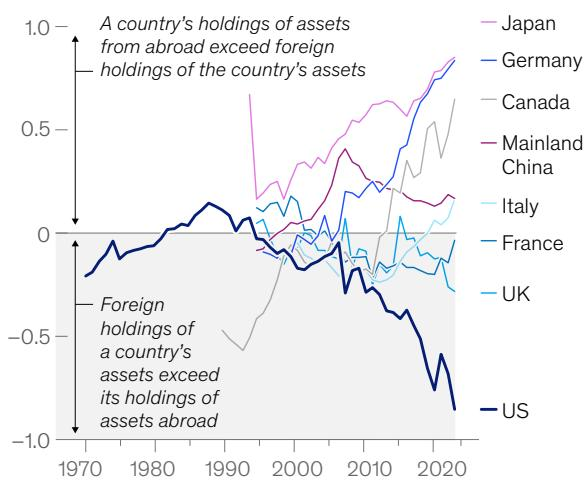  
Foreign investment in the US by asset type 1970–2024, multiple of US GDP

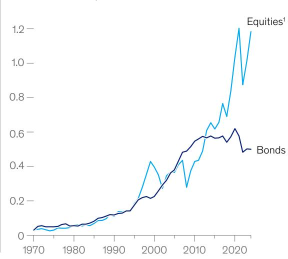  
$^{1}$ Includes shares in publicly and privately held corporations as well as shares in mutual funds and money market funds. Both foreign direct and portfolio investment are included in this category.
Source: CEIC; Federal Reserve Board; national statistics offices; OECD; World Bank; McKinsey Global Institute analysis

McKinsey & Company

## At the height of the tech boom, the United States was investing \$100 billion in VC annually, five times more than Europe.

## Innovation shifted to ecosystems

For about a decade beginning in the late 1990s, US productivity surged, growing at an average of 2.5 percent and pulling America ahead of advanced economy peers (Exhibit 15). $^{98}$ US productivity had not grown so fast since the mid-1960s. Behind this productivity jump was the information technology revolution, which both deepened capital by spurring investment and bumped up total factor productivity. $^{99}$ Since 2005, productivity growth has cooled, but it has remained about 0.9 percentage point above levels in other comparably sized economies—about 1.3 percent versus 0.5 percent across the G7.

Innovation increasingly flowered in ecosystems of universities, venture capital–funded start-ups, and larger firms. Venture capital, a new development of this era, set the United States and its ecosystems apart. In 1995, the nation invested \$4.8 billion in VC versus Europe's \$3.0 billion; by 2000, at the height of the tech boom, the United States was investing \$100 billion annually, more than five times Europe's \$20 billion. Today, annual VC investment in the United States is more than ten times higher than in Europe. $^{100}$ Although VC-backed firms account for less than 0.5 percent of all new firms each year in the United States, seven of the ten largest publicly traded companies in the world by market capitalization were originally backed by VC. $^{101}$

Productivity growth has been most concentrated in cities with some of the most flourishing knowledge ecosystems. These “superstar” cities have anchoring sectors and, often, universities. Their productivity has continued to push them ahead of the pack. The three US cities with the highest productivity today—San Jose, San Francisco, and Seattle—also had 50 percent higher productivity growth than the average US city over the past 20 years. $^{102}$

## Exhibit 15

In the 1990s, the United States pulled ahead of other major economies in productivity, led by IT.

Labor productivity $^{1}$ by country, 1995 vs 2024, \$ 2024 PPP

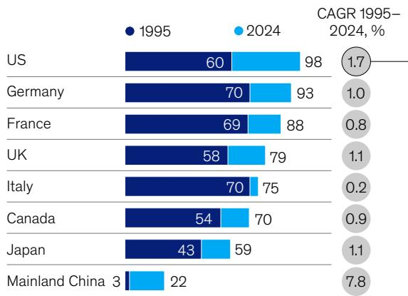  
$^{1}$ Output per hour worked.
Source: The Conference Board; US Bureau of Labor Statistics; McKinsey Global Institute analysis

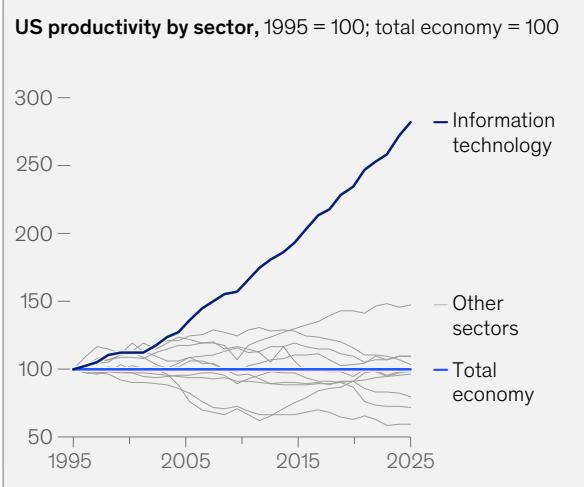

## McKinsey & Company

## Up, down, and global

The fourth chapter of US history has been marked by ups and downs. The wave of productivity growth in the 1990s and early 2000s unfolded as the United States helped usher in the age of the internet, with new digital technologies. The country entered this historical chapter as the undisputed military and economic leader and kept that position throughout.

This chapter also had deep lows. Chief among them was the global financial crisis, which began in earnest in 2008 and turned into the largest US financial meltdown since the Great Depression, affecting all parts of the economy. The collapse in home prices sharply reduced net worth for highly leveraged middle- and lower-income households. $^{103}$ Areas and households with greater pre-crisis debt, many still recovering from the “China shock” drop in manufacturing employment, suffered much deeper and longer-lasting declines. $^{104}$

Throughout this chapter, globalization deepened global connections and interdependence through flows of goods, services, capital, people, data, and ideas. Growth of global goods exports has slowed slightly since 2008, yet other flows have only continued to grow. $^{105}$

Today, America finds itself in a world that is still highly interconnected. In recent years, both US productivity growth and FDI announcements have accelerated. $^{106}$ By contrast, given growing geopolitical competition and the rise of generative and agentic AI (among other critical technologies), the major question is—what comes next?

The United States has taken an incredible journey of economic development over the past 250 years. But it was not a straight path; it required reinvention along the way. In the next chapter, we turn to some of the constants: the foundations of competitiveness throughout US history.

CHAPTER 3

# The foundations of US competitiveness

While the nature of US competitiveness has shifted over time, a pair of distinctive foundations has remained constant—natural abundance, and a culture of creativity, innovation, ambition, and individual achievement; in a word, entrepreneurialism. These foundations provided the United States with unique advantages at pivotal moments in history. They also encouraged the development of strong institutions and infrastructure, which in turn have reinforced the foundations over time. That reinforcement can make it difficult to untangle cause and effect; indeed, each has shaped the other. What matters is that the United States has undoubtedly benefited from its twin foundations.

## Favored by nature

In 1767, Benjamin Franklin wrote: "America, an immense Territory, favour'd by Nature with all Advantages of Climate, Soil, great navigable Rivers and Lakes, &c. must become a great Country, populous and mighty." $^{107}$ He was prescient. Over time, the country's natural abundance and geographic positioning have provided plentiful energy and mineral resources, vast stretches of arable land, and access to internal and international trade routes. The depth and diversity of these resources set the United States apart (Exhibit 16).

## Reliable and affordable energy has been an enduring source of strategic advantage for the United States.

## Exhibit 16

## The United States is abundantly endowed with a range of natural resources.

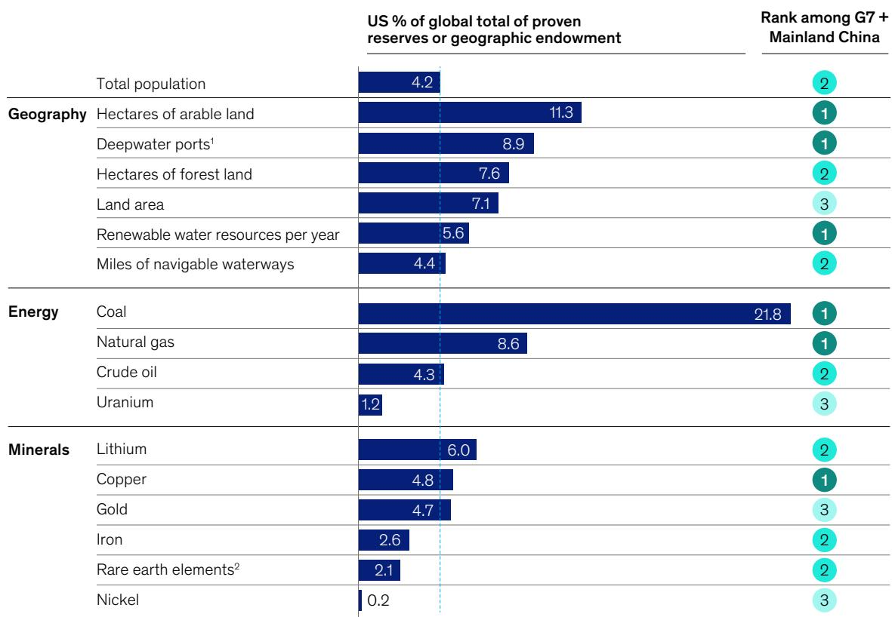  
Note: Most recent data available is 2023 for most variables and ranges from 2014–24.  
$^{1}$ Count of ports with an anchorage depth greater than 10 meters. Based on World Port Index, a census of \~3,800 “major ports and terminals” from the National Geospatial-Intelligence Agency.  
$^{2}$ Known US rare earth element reserves consist primarily of “light” rare earth elements; both “light” and “heavy” varieties are needed for the production of advanced electronics.  
Source: CIA World Factbook; International Atomic Energy Agency; Maddison Project; National Geospatial-Intelligence Agency; OECD; UN Food and Agriculture Organization; UN Statistics Agency; US Energy Information Administration; US Geological Survey; World Bank; McKinsey Global Institute analysis

## McKinsey & Company

The importance of various natural resources evolved across time. In the first historical chapter, arable land and navigable waterways were essential for agriculture and transportation of products across the country. $^{108}$ An expanding frontier brought forth increasing access to minerals, energy, and land. In Europe, such expansion and ensuing infrastructure development typically required compensating landowners, which did not always occur in the United States. $^{109}$ In the second chapter, fossil fuels such as coal and oil, along with minerals such as iron ore, powered industry and provided raw materials. In the third chapter, as science and technology took off, mineral access was a source of strategic advantage; deposits of copper, bauxite (aluminum-containing ore), and uranium supported electrification, aerospace, and nuclear power. In the fourth chapter, the United States was more connected than ever before through global trade, but even then, domestic minerals still provided an advantage. The internet backbone depended on fiber optics and its components (copper, gold, and aluminum) and plentiful energy.

Reliable and affordable energy has been an enduring source of strategic advantage for the United States (Exhibit 17). Access to plentiful energy has lowered input costs for businesses, improving productivity, enabling scale, and improving household well-being. At independence, Americans consumed twice as much energy per person as Britons, given abundant firewood. $^{110}$ As discussed, ready access to coal ignited the American industrial revolution of the second chapter. In the third chapter, the United States became a net energy importer as its energy consumption began to outpace domestic production. The resulting exposure to the oil crises of the 1970s led to energy squeezes, contributing to a slump in productivity. $^{111}$ The country regained energy independence in the fourth chapter through the shale revolution, which began in the mid-2000s. In 2019, energy imports dropped below exports for the first time in half a century. $^{112}$ This ultimately helped shield the United States from major energy price fluctuations brought about by Russia's 2022 invasion of Ukraine. $^{113}$ Today, 64 percent of US crude oil production and 79 percent of dry natural gas production is from shale and tight formations. $^{114}$

Exhibit 17

Different fuels powered each chapter.

Total US primary energy consumption by source, $^{1}$ 1775–2024, million BTU per capita

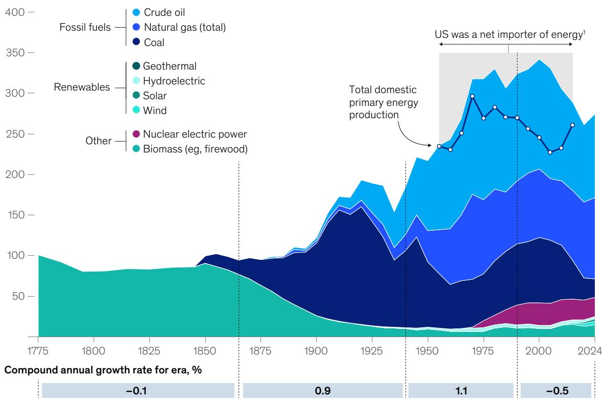  
$^{1}$ Years when US net energy imports accounted for more than 1% of energy consumption, from the mid-1950s until 2019. Source: US Energy Information Administration; McKinsey Global Institute analysis

McKinsey & Company

Geography has also mattered. Relative geographic isolation meant the United States saw minimal damage during the World Wars. Natural deep harbors and warm-water ports on two oceans provided access to plentiful trade routes throughout history. Relatively friendly relations with neighbors also provided a layer of security. $^{115}$ Periods of conflict within Europe also motivated the United States to develop its own industry; the Napoleonic Wars, for example, helped launch early US manufacturing. $^{116}$

## America's 'can-do' spirit

From its inception to this day, the United States has had an entrepreneurial culture that has served as an ongoing foundation for competitiveness. By some accounts, entrepreneurs and inventors have been “cultural heroes” throughout US history. $^{117}$ Entrepreneurship in America — often supported by wealth earned from its resources—has meant a willingness to take risks, an embrace of new ideas and people, and a drive for economic progress. $^{118}$ As Alexis de Tocqueville wrote in 1840: “America is a land of wonders, in which everything is in constant motion and every change seems an improvement. No natural boundary seems to be set to the efforts of man; and in his eyes what is not yet done is only what he has not yet attempted to do.” $^{119}$

The culture of entrepreneurship stems at least in part from the absence of Europe's entrenched societal structures and systems; the United States was able to start fresh. Perceived openness and economic opportunity have attracted many of the world's best minds over the country's history. In the second chapter, for example, immigrants brought new ideas and had an outsize impact on innovation; migrants from this era were more than 1.5 times likelier to file a patent than their US-born peers. $^{120}$ Andrew Carnegie, an immigrant from Scotland, famously started a steel empire that became the world's largest corporation. This phenomenon has endured. In 2024, 46 percent of Fortune 500 firms had at least one founder who was a first- or second-generation immigrant, according to a recent study. $^{121}$

From steamboats in the first chapter to smartphones in the fourth, the United States has been a leader in invention. Americans came up with or collaborated on the vast majority of the most important inventions of the past 250 years (Exhibit 18). $^{122}$ The nature of invention changed over time, as did who funded it. $^{123}$ In the first chapter, self-taught tinkerers and artisans such as Eli Whitney led the charge. In the second, the industrial research lab took center stage, providing capital to inventors such as Thomas Edison and Nikola Tesla. In the third, collaborations between government, universities, and businesses mobilized teams such as a group at Bell Labs led by William Shockley, John Bardeen, and Walter Brattain, co-inventors of the first transistor. During this chapter, funding for R&D primarily came from government, with strong incentives rooted in Cold War–era geopolitical competition. In the fourth, business once again played a larger role in funding R&D. Knowledge ecosystems, including universities and venture capital–backed start-ups, became the centers of invention, with figures such as Steve Jobs envisioning products and ways of interacting with technology such as smartphones, backed by teams that turned those ideas into reality.

## Exhibit 18

The United States has led the invention of new products, systems, and technologies over the past 250 years.

Selection of top 100 inventions with US involvement highlighted

<table><tr><td>Year $^{2}$ </td><td>Invention</td></tr><tr><td>1775</td><td>Steam engine (Watt improvement)</td></tr><tr><td>1775</td><td>Flush toilet</td></tr><tr><td>1775</td><td>Water frame</td></tr><tr><td>1786</td><td>Power loom</td></tr><tr><td>1793</td><td>Cotton gin</td></tr><tr><td>1796</td><td>Vaccines (smallpox mass production)</td></tr><tr><td>1800</td><td>Battery (voltaic pile)</td></tr><tr><td>1807</td><td>Steamboat</td></tr><tr><td>1810</td><td>Canning for food preservation</td></tr><tr><td>1817</td><td>Bicycle</td></tr><tr><td>1824</td><td>Portland cement</td></tr><tr><td>1825</td><td>Railroad system/steam locomotive</td></tr><tr><td>1825</td><td>Electromagnet</td></tr><tr><td>1826</td><td>Photography</td></tr><tr><td>1832</td><td>Electric dynamo</td></tr><tr><td>1834</td><td>Refrigeration (vapor compression)</td></tr><tr><td>1834</td><td>Electric motor</td></tr><tr><td>1837</td><td>Telegraph</td></tr><tr><td>1839</td><td>Vulcanized rubber</td></tr><tr><td>1843</td><td>Rotary printing press</td></tr><tr><td>1846</td><td>Anesthesia</td></tr><tr><td>1846</td><td>Sewing machine</td></tr><tr><td>1853</td><td>Petroleum refining/oil drilling</td></tr><tr><td>1856</td><td>Bessemer steel process</td></tr><tr><td>1864</td><td>Pasteurization</td></tr><tr><td>1866</td><td>Transatlantic telegraph cable</td></tr><tr><td>1867</td><td>Antiseptic surgery</td></tr><tr><td>1867</td><td>Dynamite</td></tr><tr><td>1876</td><td>Telephone</td></tr><tr><td>1876</td><td>Internal combustion engine</td></tr><tr><td>1877</td><td>Phonograph</td></tr><tr><td>1879</td><td>Electric lighting (incandescent)</td></tr><tr><td>1882</td><td>Electrical grid system</td></tr></table>

<table><tr><td>Year</td><td>Invention</td></tr><tr><td>1885</td><td>Automobile (Benz Patent-Motorwagen)</td></tr><tr><td>1886</td><td>Aluminum smelting (Hall-Héroult)</td></tr><tr><td>1888</td><td>AC induction motor</td></tr><tr><td>1893</td><td>Radio/wireless communication</td></tr><tr><td>1893</td><td>Diesel engine</td></tr><tr><td>1895</td><td>X-ray technology</td></tr><tr><td>1895</td><td>Motion pictures</td></tr><tr><td>1897</td><td>Water chlorination</td></tr><tr><td>1901</td><td>Disposable blade razor (Gillette)</td></tr><tr><td>1902</td><td>Air conditioning</td></tr><tr><td>1903</td><td>Airplane/powered flight</td></tr><tr><td>1904</td><td>Tractor with internal combustion</td></tr><tr><td>1906</td><td>Vacuum tube</td></tr><tr><td>1907</td><td>Plastics (Bakelite)</td></tr><tr><td>1908</td><td>Mass-market cars (Ford Model T)</td></tr><tr><td>1908</td><td>Electric washing machine</td></tr><tr><td>1909</td><td>Ammonia production (Haber-Bosch)</td></tr><tr><td>1909</td><td>Synthetic rubber</td></tr><tr><td>1913</td><td>Assembly-line manufacturing</td></tr><tr><td>1921</td><td>Highway</td></tr><tr><td>1926</td><td>Rocketry (Goddard first launch)</td></tr><tr><td>1926</td><td>Power steering</td></tr><tr><td>1927</td><td>Television</td></tr><tr><td>1928</td><td>Antibiotics (penicillin)</td></tr><tr><td>1935</td><td>Radar</td></tr><tr><td>1935</td><td>Nylon</td></tr><tr><td>1939</td><td>Jet engine</td></tr><tr><td>1945</td><td>Electronic computer (ENIAC)</td></tr><tr><td>1945</td><td>Microwave oven</td></tr><tr><td>1947</td><td>Transistor</td></tr><tr><td>1951</td><td>Nuclear power</td></tr><tr><td>1952</td><td>Compiler for machine code</td></tr><tr><td>1952</td><td>Barcode</td></tr></table>

<table><tr><td colspan="2"></td><td>US-involved1</td><td>US-led</td></tr><tr><td>Year</td><td>Invention</td><td></td><td></td></tr><tr><td>1953</td><td>DNA double-helix structure</td><td></td><td></td></tr><tr><td>1954</td><td>Solar photovoltaic cell</td><td></td><td></td></tr><tr><td>1955</td><td>Polio vaccine</td><td></td><td></td></tr><tr><td>1956</td><td>Containerized shipping</td><td></td><td></td></tr><tr><td>1958</td><td>Semiconductor integrated circuit</td><td></td><td></td></tr><tr><td>1960</td><td>Laser technology</td><td></td><td></td></tr><tr><td>1960</td><td>Oral contraceptives</td><td></td><td></td></tr><tr><td>1962</td><td>Communications satellite</td><td></td><td></td></tr><tr><td>1962</td><td>LED (light-emitting diode)</td><td></td><td></td></tr><tr><td>1966</td><td>“Green Revolution” crops</td><td></td><td></td></tr><tr><td>1969</td><td>Internet (ARPANET)</td><td></td><td></td></tr><tr><td>1969</td><td>Computer operating system (UNIX)</td><td></td><td></td></tr><tr><td>1970</td><td>Fiber optics</td><td></td><td></td></tr><tr><td>1971</td><td>Microprocessor</td><td></td><td></td></tr><tr><td>1973</td><td>Recombinant DNA technology</td><td></td><td></td></tr><tr><td>1975</td><td>Personal computer</td><td></td><td></td></tr><tr><td>1976</td><td>Public-key cryptography</td><td></td><td></td></tr><tr><td>1977</td><td>MRI scanner</td><td></td><td></td></tr><tr><td>1981</td><td>Laptop</td><td></td><td></td></tr><tr><td>1983</td><td>Mobile cellular phone</td><td></td><td></td></tr><tr><td>1983</td><td>Polymerase chain reaction (PCR)</td><td></td><td></td></tr><tr><td>1984</td><td>Graphical user interface</td><td></td><td></td></tr><tr><td>1989</td><td>World Wide Web</td><td></td><td></td></tr><tr><td>1991</td><td>Lithium-Ion battery</td><td></td><td></td></tr><tr><td>1993</td><td>GPS (global positioning system)</td><td></td><td></td></tr><tr><td>1997</td><td>Wi-Fi (802.11)</td><td></td><td></td></tr><tr><td>1998</td><td>Internet search engine</td><td></td><td></td></tr><tr><td>2002</td><td>Cloud computing (AWS)</td><td></td><td></td></tr><tr><td>2004</td><td>Social media (founding of Facebook)</td><td></td><td></td></tr><tr><td>2007</td><td>Smartphone</td><td></td><td></td></tr><tr><td>2007</td><td>Mobile money transfer</td><td></td><td></td></tr><tr><td>2012</td><td>CRISPR gene editing</td><td></td><td></td></tr><tr><td>2020</td><td>mRNA vaccines</td><td></td><td></td></tr><tr><td>2022</td><td>Generative AI (ChatGPT)</td><td></td><td></td></tr></table>

## McKinsey & Company

The entrepreneurial spirit of the United States was not limited to tech visionaries. It was also embedded in the American people and business community, who have long had the appetite (and means) to adopt and scale new technologies, including those invented elsewhere, such as the automobile, first developed in Germany in 1885. Over time, inventions such as railroads, telephones, and personal computers were adopted more quickly in the United States than elsewhere (Exhibit 19). The effects on the economy and the fabric of life were manifold: better connections, greater economies of scale, and faster transportation, communication, and learning. While these examples are historical, the same can be said of some more recent technologies; for example, the United States has been at the forefront of scaling cloud computing services. $^{124}$

Personal computers per thousand inhabitants, 1981–2002

Throughout its history, the United States has been a rapid adopter of technologies that connect the population across distance.

Railroad track, km per thousand inhabitants, 1830–1929

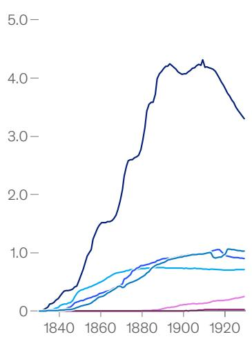

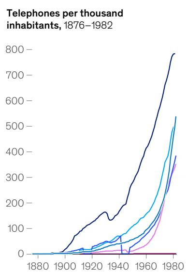

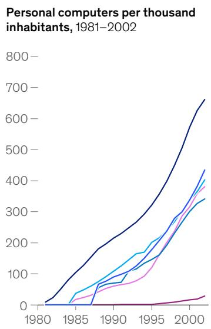  
Source: Harvard Business School Cross-country Historical Adoption of Technology (CHAT) Dataset, Diego Comin and Bart Hobijn (2009); UN World Population Prospects 2024; McKinsey Global Institute analysis

## McKinsey & Company

Americans have adopted generative AI even faster than earlier transformative technologies. $^{125}$ That said, however, other countries have been faster; a recent ranking puts the United States in 24th place for adoption rates, behind many other G7 economies. $^{126}$ As discussed, Chinese companies are embedding AI at a rapid clip. This raises the crucial questions of whether the United States can maintain this foundation of competitiveness, and, if lost, what reclaiming it might take.

## Institutions and infrastructure reinforce the foundations

Over the past 250 years, institutions have embodied and supported the country's entrepreneurial culture, and infrastructure has helped the United States harness the power of its natural resources. A virtuous cycle animates both. Entrepreneurial culture encouraged the development of new forms of governance, and the resulting institutions in turn encouraged higher ambitions and risk-taking. Resource discovery demanded infrastructure investment, while better infrastructure enabled and encouraged more resource discovery.

American institutions have, throughout history, incorporated the nation's ideals, especially its entrepreneurial culture. To an unusual degree among modern economies, they have supported and strengthened the spirit of taking risks, protecting intellectual property, and promoting markets and individual freedom. $^{127}$ The US Constitution is the oldest in the world, having survived a Civil War, the Great Depression, and two World Wars. This stability has been balanced with regulatory adaptability amid economic expansion, shifting geopolitical circumstances, and technological advancements. Federalism, which supports policy experimentation at the state and local levels, has been critical in

the development and refinement of institutions. As just one example, in the realm of corporate law, several states moved early to codify limited liability and enact general incorporation laws, starting with New York in 1811. The approach ultimately spread and has been central to the development of modern corporations. $^{128}$ Institutions such as comparatively generous bankruptcy laws also have encouraged entrepreneurship and risk-taking. $^{129}$

The American educational system, another critical and evolving institution, has produced a well-educated, dynamic labor force, installing an ethos of constant improvement in the entrepreneurial foundation. $^{130}$ The expansion of public education, especially in the early 20th century, created a workforce with a baseline of general knowledge. By the end of the second historical chapter, the United States had one of the highest rates of education in the world. Importantly, American education emphasized problem solving and flexibility over specialization, creating a more adaptable workforce and lowering switching costs for workers. $^{131}$ Developments in tertiary education, such as the Morrill Land-Grant Act in the first historical chapter and the GI Bill in the third, also expanded knowledge and skills development in technical fields. Lower regulation in labor markets than seen elsewhere complemented an educated and adaptable workforce to lift competitiveness. $^{132}$

The US financial system, meanwhile, emerged as both a product and an enabler of the American entrepreneurial culture. Beginning in the early years of the republic, the United States developed deep capital markets and innovative financial institutions. Beyond positioning the country as a global financial leader as early as the 1830s, early finance provided funding for major infrastructure projects, including canals and railroads, as well as industry. $^{133}$ Over time, financial institutions made it easier for firms to form, scale, and fail without permanently deterring future experimentation.

Infrastructure has also contributed to America's competitiveness. Infrastructure moved minerals, energy resources, water, and agricultural goods to ports or places of consumption and adapted over time as the country's context and needs shifted. Americans built their earliest railroads to transport coal to factories, specialized piers to ship iron ore across the Great Lakes, and vast aqueducts to divert water to arid mining claims. Then, too, natural resources were integral to infrastructure construction, especially minerals such as copper for electrical equipment and iron ore for steel in bridges, buildings, and pipes, among numerous other fixtures. US infrastructure today supports the second-largest domestic freight system in the world, including the longest freight railroad network and the second-longest highway system. $^{134}$ Today, institutions and infrastructure alone do not make the United States unique; plenty of other countries have high-quality infrastructure and pro-market institutions. But they have supported US competitiveness in a uniquely American way over the course of the past quarter millennium.

Plentiful natural resources and favorable geography provided both easy connection to markets and security, allowing for rapid advances in industry, science, and technology. But natural resources alone were not enough; harnessing them, in evolving and often innovative ways, has made the difference. $^{135}$ The nation's entrepreneurial spirit was similarly codified and strengthened by strong property rights and pro-market institutions and was further nurtured over time through educational and financial systems. In the next section, we discuss how in the chapter to come, the United States can build on the foundations that have served it so well throughout its history.

CHAPTER 4

# Looking ahead: Securing the next era

Today the United States may be entering a new chapter. Tech, especially AI, is advancing rapidly. Postpandemic macroeconomic disruptions persist, marked by a recent 40-year high in inflation. And heightened geopolitical tensions have produced a growing tide of protectionism reflected in both higher tariffs (the US average tariff rate is now 12.7 percent, the highest since World War II) and industrial policies such as the Inflation Reduction Act and the CHIPS and Science Act. Current trajectories suggest that these forces, along with persistently high capital costs and aging populations, are likely to set the competitive context for the United States and other major economies in coming years.

The opportunity is immense. Future-shaping industries including AI, biotechnology, and robotics are expected to have market sizes in the trillions in the coming decade. $^{136}$ By one estimate, AI could add up to 0.6 percentage point to annual productivity growth through 2040. $^{137}$

To seize this opportunity, the United States must prepare to confront looming challenges, including rising demand for energy, infrastructure gaps, and growing national debt. Success also means business strategy, operations, and innovation systems transforming to embrace AI. In parallel, business and society need to proactively train US workers to share their jobs with AI. Should those challenges be met, the net effect would be an American economy that innovates and operates in faster, bigger, and better ways. All this needs to be done with an eye to national economic security amid growing geopolitical fractures. $^{138}$

The magic of US competitiveness to date is that it has not been the result of top-down planning but rather has developed organically from its foundations of natural abundance and entrepreneurialism (which in turn have been harnessed through infrastructure and institutions). Overly specific prescriptions for how to attain the next wave of competitiveness risk missing this important point. Whatever steps US firms, governments, and institutions take, they should ideally be informed by what's worked in the past: adapting US abundance and entrepreneurship into continued economic leadership on the global stage.

In that spirit, we see five overarching prerequisites for US competitiveness in the next era. Two draw on the country's institutions of entrepreneurialism: (1) an AI-fluent workforce and (2) sustained long-term investment. Two more relate to the foundation of natural abundance: (3) power that meets the needs of future technology and (4) new and improved infrastructure. A final prerequisite acknowledges a new geopolitical environment: (5) national economic security in a volatile world. In this chapter, we dive into each of these prerequisites, discussing both current challenges and those on the horizon, as well as proposing near-term actions that can help the country stay on track (for a brief summary, see sidebar “A near-term agenda for leaders”).

## Sidebar

## A near-term agenda for leaders

Long-term checklists are inherently futile, especially in a world of rapidly evolving technology and geopolitical contexts. Across the five prerequisites discussed in this chapter, however, some clear near-term actions, for near-term ends, can help the country stay on track. All require collaboration by businesses, investors, policymakers, and regulators at every level of government. Some are directed at one group (such as permitting reform for regulators). Ultimately, however, these are system-level challenges requiring systemic solutions.

## An AI-fluent workforce. AI promises

significant potential to boost productivity and generate meaningful work at high wages. Capturing this will require business strategy, operations, and innovation systems transforming to embrace AI. Businesses need a trained and ready workforce. This requires upskilling and labor market dynamism to a degree unprecedented in recent history. An aging population and expected worker shortages, particularly in specialized areas, raise the stakes. Near-term moves include the following:

— Build and procure agents and robots and integrate them into business models; reconfigure jobs as needed to account for higher automation and new types of tasks; and lay the groundwork for full-scale transformation.

— Train the workforce on AI skills while also expanding upskilling opportunities to the population in full, to transition labor markets into an AI-centric future of work.

— Reduce frictions for labor mobility through steps such as expanding opportunity for remote work and improving matching of workers to job opportunities, to boost labor force dynamism.

— Marshal coinvestment from corporations and public programs for skills training targeted at shortages and for incentives such as scholarships and research grants to study engineering.

— Strive for higher K–12 education outcomes while retaining the principles of general education.

— Ensure the US university system remains the strongest in the world and encourage students to pursue engineering and other in-demand technical fields, while prizing free and creative thinking.

— Continue to attract top talent from all parts of the United States and from around the world to remain at the forefront of discovery and innovation.

## Sustained long-term investment.

Entrepreneurs and researchers need financial capital to build their businesses and push the bounds of knowledge. Reaching scale and expanding innovation in the long term will require even greater amounts of funding for capital projects, education and upskilling, and R&D. Historically, the United

States has benefited from deep, trusted financial markets that both provide plentiful home-grown opportunities for wealth creation and attract the world's capital. To preserve that advantage, short-term steps include the following:

— Commit to a path to reducing federal deficits, on the order of three percentage points of GDP. $^{1}$

— Invest in and adopt automation technologies to raise productivity; secure access to labor and materials; and reassess the business portfolio mix.

— Encourage the flow of capital to productive businesses, big and small, via supporting regulatory and supervisory frameworks.

— Ensure financial planning for households and businesses is not predicated on assumptions of ongoing low interest rates and create new financial products that help with long-term saving and investment.

## Power that meets the needs of future

technology. Future technology will also have immense physical requirements, the most salient of which (at the moment) is energy. Power demand has started to grow for the first time in decades, fueled in large part by data centers. It appears that technologies central to America's future competitiveness will continue demanding more energy. Power supply, or more specifically energy generation and transmission infrastructure, must therefore keep up. Next steps include the following:

## Sidebar (continued) A near-term agenda for leaders

— Ensure system stability via increased collaboration between power generators and regional grid operators.

— Enhance grid capacity quickly by deploying existing technologies, such as demand response systems. $^{2}$

— Develop strategies to resolve supply-side bottlenecks for new energy infrastructure, such as permitting reform, investing to expand production of scarce equipment such as transformers, and providing targeted skills training for engineers and construction workers.

New and improved infrastructure. Beyond energy, other forms of infrastructure, such as bridges, ports, and fiber optics, are also central to competitiveness. And yet the United States faces growing gaps following decades of underinvestment. Heightened geopolitical competition and climate change are poised to place greater demands on infrastructure in the long term, adding urgency not just to fill today's gaps but to go even further. Moves to consider include the following:

\- Maintain recent heightened momentum in infrastructure spending, which could fill 60 percent of total expected needs to restore basic infrastructure to good working order. $^{3}$

— Speed up construction timelines by streamlining permitting processes and improving coordination across regulators.

— Integrate digital technologies throughout infrastructure systems, such as those for predictive maintenance, to improve efficiency and resilience.

— Begin preparing for long-term funding needs, bringing together stakeholders across the infrastructure ecosystem, including private capital and all levels of government.

National economic security in a volatile world. The spotlight is increasingly on national economic security as the global trading system fractures along geopolitical lines. China surpassed the United States in manufacturing output beginning in 2010, and over time, the United States has lost capacity to manufacture many products critical for national security, presenting questions about future resilience. Securing defense supply chains, whether through stockpiling, shifted sourcing, or targeted investments in new capacity, is a critical next step. $^{4}$ Another crucial component is government's ability to make needed investments in defense and technology infrastructure and to respond to crises, which are at risk currently given the high national debt. More than anything else, however, continued resilience will depend on the country's ability to do the things it is best at, such as innovation.

## 1. An AI-fluent workforce

Throughout the country's history, America's firms, widespread public education, and leading universities have built a dynamic workforce. Education, fundamentally rooted in general knowledge, encouraged problem solving and flexibility, while universities and knowledge ecosystems instilled deep levels of skill. Beyond building home-grown talent, these systems have also attracted the world's best minds (along with deep pools of capital). Americans have enjoyed economic opportunity while strong human capital has in turn promoted innovation and scale, driving more prosperity. $^{139}$

As discussed, AI promises significant potential to boost productivity growth and generate meaningful work at high wages. Capturing this will require business strategy, operations, and innovation systems transforming to embrace AI. As that happens, the contract between businesses and their workforces will need renewal. As businesses transform, they will require a trained and ready workforce, and at the same time individuals will need the requisite preparation to thrive. This requires upskilling and labor market dynamism to a degree unprecedented in recent history. Altogether, this shift will be predicated on the workforce's ability to quickly adapt and learn. An aging population and expected worker shortages, particularly in specialized areas, raise the stakes. $^{140}$

## Work is poised to fundamentally transform

The path of innovation is notoriously difficult to forecast, especially when it is moving so fast. Yet the state of technology as it stands today suggests that fundamental change is coming: About 57 percent of American hours worked could, in theory, be performed by agents and robots. $^{141}$

That's not a prediction of job loss. Throughout history, inventions have given rise to new work and changed some jobs while making others obsolete. "Computers" were once people doing sums. Today's computers have created a range of jobs, from hardware technician to software engineer. Data scientist is also a new job, but in a sense it is just the latest incarnation of older roles, for example the people the US Census Bureau employed in the late 1800s to process demographic data about the growing country. $^{142}$

No matter how automation proceeds, many human skills will remain relevant. About 80 percent of skills used in the workplace today are needed for activities that cannot be automated with today's technology. But many of those skills are also used for activities that theoretically could be automated. Consider the skill of data analysis. While AI excels at rapid pattern detection and automating the drudgery of data cleaning, humans are better at interpretation and asking new questions. In many such cases, work may be done by people and AI together.

Everywhere and all at once, AI skills are increasingly important (Exhibit 20). Ultimately, workers of all stripes will need to adapt and reskill for an automated world and a transformed structure of jobs. While that full evolution may take time—and technology will evolve along the way—the next few years are crucial.

Things could get rocky in many ways. Historical precedents of new jobs forming quickly in the wake of new technology may not hold for an innovation as unique as AI. Firms could be slow to adopt AI, stultifying growth. New and improved jobs might be created, but without matching systems to efficiently connect labor to work. Or workers might not have access to sufficient opportunities to learn the skills of seamless work with agents and robots.

One reason for optimism is labor force dynamism, a source of strength for the United States relative to other major economies throughout history, particularly in the closing decades of the 20th century. That said, trends over the past several decades point to a gradual loss of labor market fluidity. The job reallocation rate, a measure of labor force dynamism, has dropped by roughly a third from the mid-1990s to today (save for a blip during the COVID-19 pandemic). $^{143}$ Relatedly, geographic mobility has also declined. $^{144}$ The exact mix of factors behind declining dynamism are debated, but there is relative consensus on some changes that would help. These include reducing frictions many workers face when switching jobs—such as differences in occupational licensing across states and non-compete agreements—and undertaking more skills-based hiring. $^{145}$ Easing new business formation would also help create new job opportunities. $^{146}$ And of course, improving elementary and secondary education, grounded in general knowledge, would improve long-term workforce adaptability, as it has historically. $^{147}$

## Exhibit 20

Demand for AI fluency and technical AI skills rose between 2023 and 2025.

Employees in jobs demanding AI-related skills

AI fluency skills, calling for people to use or manage AI

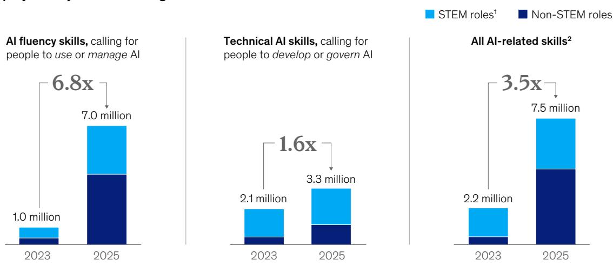  
Technical AI skills, calling for people to develop or govern AI  
STEM roles $^{1}$ Non-STEM roles  
$^{1}$ Includes the following Standard Occupational Classification groups: computer and mathematical occupations; architecture and engineering occupations; life, physical, and social science occupations; and healthcare practitioners and technical occupations.  
$^{2}$ In many cases, non-STEM occupations may require technical AI skills if workers are managers of STEM occupations (eg, chief technology officer, director of engineering, technical product manager).  
Source: Lightcast; US Bureau of Labor Statistics; McKinsey Global Institute analysis

## McKinsey & Company

## An aging workforce

Mass retirement provides an additional challenge. The primary driver of US economic growth over the past two decades has been a rise in the number of total hours worked, a proxy for overall labor supply. $^{148}$ As fertility rates have fallen over the past several decades, the population has aged, and the labor force is beginning to grow noticeably older, affecting sectors across the board. Nearly all occupations have an older workforce than they did 15 years ago (Exhibit 21). For example, 20 percent of construction workers are over 55, up one-third since 2010. For healthcare support, the number is 25 percent, nearly a 50 percent jump. $^{149}$

Worker shortages across a range of high- and low-skill occupations are already a concern. Many of the sectors experiencing recent shortages have historically been harder to automate and have seen stubbornly low rates of productivity growth. Healthcare, for example, has had persistently high vacancy rates, while vacancies in construction, logistics, and utilities have more than doubled over the past few decades. $^{150}$ In a 2024 survey, more than half of US construction firms reported project delays due to worker shortages. $^{151}$ Many of these jobs require a large portion of human-centric skills, in which AI or automation has lower near-term potential to help fill workforce gaps. $^{152}$

## Exhibit 21

# Older adults represent an increasing proportion of the workforce across most occupations, especially physically demanding ones.

Share of employees in occupation who are 55 or older, 2011–24, %

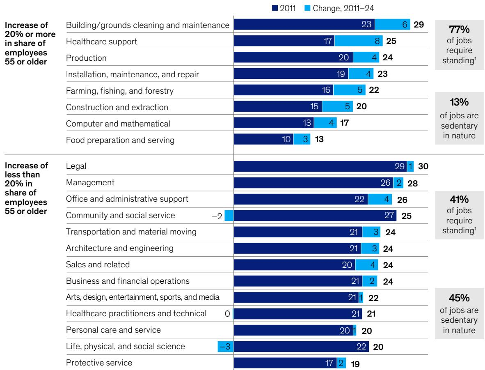  
Note: Figures may not sum to 100%, because of rounding. $^{1}$ Percentage reporting that their job does not permit the choice of when to sit or stand; based on the Occupational Requirements Survey, 2023. Source: US Bureau of Labor Statistics (Table 11b, 2011 and 2024; Occupational Requirements Survey, 2023); McKinsey Global Institute analysis

## McKinsey & Company

Taking into account aging and higher expected demand, the skilled trade jobs critical for both growth and competitiveness in coming years—for example, construction and engineering—are expected to grow by 20 times the number of overall net new jobs through 2032. $^{153}$ The current pipeline of engineers suggests future shortages and the potential loss of technological leadership in the world; while the United States has a quarter of Mainland China's population, it has just one-tenth of the engineering graduates. $^{154}$ In mechanical engineering specifically, which is critical in fields such as robotics, China produces about 350,000 newly minted grads each year compared to about 45,000 in the United States. $^{155}$ A 2023 report by the Semiconductor Industry Association estimates that 58 percent of 67,000 projected new jobs in the semiconductor industry could go unfilled, based on current degree completion rates. $^{156}$ Pipeline challenges have been noted in other critical technologies, such as biotechnology. $^{157}$

## Rejuvenating labor for an AI future

Labor markets are a linchpin of economic competitiveness. To maintain their edge, and capture the gains from AI, the United States can consider the following near-term actions:

— To begin capturing gains from AI, begin building and procuring agents and robots, and integrating them into business models; reconfigure jobs as needed to account for higher automation and new types of tasks; and lay the groundwork for full-scale transformation.

— To seamlessly transition labor markets into an AI-centric future of work, train the workforce on AI skills while also expanding upskilling opportunities to the population in full.

— To boost labor force dynamism, improve the matching of workers to job opportunities and reduce frictions for labor mobility through steps such as expanding opportunities for remote work, hiring for skills rather than credentials, and streamlining occupational licensing; easing new business creation and knowledge diffusion would also help.

— To address current workforce shortages, especially those related to value chains for critical technologies (for example, construction workers and engineers), marshal coinvestment from corporations and public programs for targeted skills training programs and to provide incentives such as scholarships and research grants to study engineering. $^{158}$

\- To develop a flexible workforce equal to the challenge of rapid changes in technology and skill demand, achieve higher K–12 education outcomes while retaining the principles of general education.

— To deepen skills needed for the industries and world of tomorrow, ensure that the US university system remains the strongest in the world; encourage students to pursue engineering and other in-demand technical fields while prizing free and creative thinking.

— To remain at the forefront of discovery and innovation, continue to attract top talent from all parts of the United States and from around the world, to study at a US university and to found or work at US companies.

## 2. Sustained long-term investment

Entrepreneurs and researchers need financial capital to build their businesses and push the bounds of knowledge. The United States has long benefited from deep, trusted financial markets that both provide plentiful home-grown opportunities for wealth creation and attract the world's capital. Since the end of World War II, the US dollar has been the world's reserve currency and US Treasury securities have been considered the world's safest asset. As a result, US companies, entrepreneurs, and innovators have enjoyed plentiful capital.

Growing scale and innovation in the long term will require even greater amounts of funding for capital projects, education and upskilling, and R&D. Maintaining confidence in the United States—in its economic future and the stability of its institutions—is critical to ensure that American firms continue to attract funding to make these needed investments.

## The growing US national debt threatens investor confidence

The federal debt today stands at 38 trillion, or 120 percent of GDP. This is higher than the 119 percent recorded in 1946 in the aftermath of World War II and barely less than the all-time high set in April 2020 at the height of the COVID-19 pandemic. $^{159}$ The United States has one of the highest national debt levels relative to GDP of major economies, behind only Japan, Greece, and Italy in the OECD. From 2000 to 2024, 2.40 of US debt was created for every 1 of net new investment (compared to 1.90 on average globally). $^{160}$

When interest rates are low, growing debts are more manageable, as was the case in the decade following the global financial crisis. However, as inflation took hold after the COVID-19 pandemic, ten-year Treasury yields, the basis for most market interest rates, more than doubled their 2010s average. Interest payments in fiscal year 2024 shot up 34 percent, to \$949 billion, exceeding defense spending for the first time (Exhibit 22). $^{161}$ This continued into 2025. $^{162}$

Persistent higher rates relative to expected growth rates could drive up debt growth in years to come. $^{163}$ There is reason to believe that rates will remain structurally elevated above prepandemic levels. Investment needs are rising alongside a decline in economy-wide savings as the population ages, wage growth among lower-income segments that are less likely to save, high and rising fiscal deficits that absorb more capital, and slower growth in emerging markets (which have historically invested excess savings in the United States). $^{164}$

Growing levels of uncertainty or a loss of confidence may also put pressure on US long-term interest rates. About half of outstanding debt is set to roll over this year and next. As these Treasuries come on the market, will demand match the supply? If not, rates may rise and contribute to unwanted growth in the national debt. Another unhelpful effect: Higher interest rates can crowd out both private investment and other government spending priorities, including the ability to respond to future crises. $^{165}$ The effects can spill into equity markets as elevated rates curb long-term investment and increase economic uncertainty, ultimately threatening household wealth and broader market confidence. $^{166}$

## About half of outstanding Treasuries are set to roll over this year and next. Will demand match supply?

## Exhibit 22

## US fiscal deficits, including net interest payments, are historically elevated.

US federal deficits and defense spending, FY 1975–2035E, % of GDP  
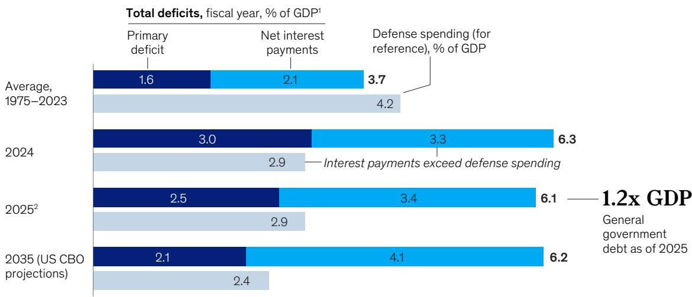  
$^{1}$ Based on fiscal-year totals.  
$^{2}$ Figures from November 2025 monthly summary reflecting FY2025 in full. The US Treasury Department estimates that the calendar-year deficit for 2025 will be 5.4% of GDP.  
Source: Congressional Budget Office (10-Year Outlook from January 2025 and Monthly Budget Review from November 2025); US Office of Management and Budget for historical data; US Treasury Monthly Statement of the Public Debt; McKinsey Global Institute analysis

## McKinsey & Company

## Finding investment dollars as capital costs rise

Knowledge ecosystems are famously capital-light. But competitiveness in the next era will require substantial capital investment. As we discuss below, power generation, distribution, and infrastructure are underfunded. US data centers are in the spotlight; an additional 3 trillion is needed through 2030 to keep up with the compute demands of AI. $^{167}$ More money will have to be found to bolster production capacity for critical goods, domestically and among allies (as we discuss below). Beyond capital expenditure, significant spending will be needed for skills development and for R&D.

Much of this is difficult to counteract. But if the United States could reduce its level of debt—saving more or borrowing less—pressure on interest rates would ease, opening the way for economy-wide investment in newly critical technologies and infrastructure. Investors are increasingly focused on whether the government has a credible plan to manage deficits and debt over the medium term. $^{168}$ Deficit reduction of course will need to be done thoughtfully; overtightening could drive a demand shock throughout the economy, prompting a recession.

Higher productivity, for example from AI, can help, but it cannot solve the debt problem on its own. For one, any potential labor market disruptions could drive up costs such as unemployment insurance. And higher growth adds some degree of higher fiscal costs. Higher wages resulting from higher productivity mean higher social benefits and public-sector labor costs. $^{169}$

Higher interest rates could also threaten households and corporations. Notably, US household and corporate balance sheets have become healthier since 2010, but pockets of risk remain as debt maturity “walls” approach. $^{170}$ Relatedly, as both investment demands and capital costs rise, companies need to access capital, and the broader financial system must channel savings to the most productive investments. This requires a shift from the status quo of the past couple of decades, when more savings were held within corporations and capital was directed disproportionately to chasing financial returns rather than productive investment. $^{171}$ Maintaining resilience and fostering a productive financial system are imperatives for both policymakers and corporate- and financial-sector leaders.

## Attracting sustained investment

Sustaining investment fundamentally means maintaining confidence in the dollar, US Treasuries, and US equity markets.

Actions that can help include the following:

— To reduce pressure on interest rates, commit to a path to reducing deficits, on the order of three percentage points of GDP. $^{172}$

\- For business to capture gains even in the face of higher interest rates and potential volatility, invest in and adopt automation technologies to grow productivity; secure access to labor and materials; and reassess the business portfolio mix.

— To make investment productive and stimulate growth, ensure that regulatory and supervisory frameworks encourage the flow of capital to productive businesses, big and small.

— To maintain resilience for households and businesses amid macroeconomic shifts, ensure that financial planning is not predicated on assumptions of ongoing low interest rates, and create new financial products that help with long-term saving and investment.

## 3. Power that meets the needs of future technology

Future technology will also have immense physical requirements, the most salient of which currently is energy. All signs point to energy remaining a core input to economic growth over the long term and perhaps even growing in importance, especially given its fundamental role underpinning both computing (at least based on today's AI models) and advanced manufacturing.

Today, the United States is the world's largest producer of oil and natural gas, which has helped keep energy both more affordable and more reliable than in other major economies. $^{173}$ Further, US power is more diversified than ever before, with carbon-free sources constituting 44 percent of electricity generation in 2024. $^{174}$ However, bottlenecks in expanding power supply could pose a risk that the United States will not be able to keep up with recent growth in demand, especially from data centers, a fundamental component of the AI value chain.

## Surging demand

In recent years, power demand in the United States has started to grow after being stable for much of the past two decades. From 2010 to 2022, power demand grew at an average annual rate of 1.0 percent; it accelerated to 1.7 percent from 2022 to 2025. Data centers account for more than half of this recent growth. $^{175}$

Supply is struggling to keep up. Delayed maintenance makes the challenge worse; a growing share of new transmission infrastructure is built just to preserve reliability. $^{176}$ Utilities' fixed costs from refurbishing and replacing existing distribution and transmission infrastructure are a factor in growing retail electricity prices in some states. $^{177}$ The wait for generator grid connections alone increased eightfold from 2014 to 2023. $^{178}$ Today there is a backlog of hundreds of gigawatts of projects waiting for new wires or substation upgrades. $^{179}$

Several factors are at work. As coal and gas plants reach retirement age, bringing on new baseload and dispatchable generation is costly, and the market offers few incentives. Supply chain challenges for critical equipment, such as transformers and turbines, add further bottlenecks, with lead times of two to five years. Greater reliance on renewables increases energy system variability, requiring careful management.

Furthermore, long queues for permits, along with skills shortages, are slowing the growth of power supply. Average federal permitting takes 4.5 years for clean-energy projects and 6.5 years for transmission, with many stretching beyond a decade. As of July 2025, more than 650 projects were awaiting federal approval. $^{180}$ Energy and upstream equipment manufacturers also face shortages of engineering and construction labor (as discussed).

## The problem will become acute

In the coming era, when technologies such as AI become integral to work and society, power demand is likely to surge further. Growing geopolitical competition also means a likely push to build more domestic manufacturing for critical products like semiconductors, which will require more energy. By 2040, the United States is likely to need 60 percent more electricity than it produces today to power thirsty data centers and transportation electrification and to meet growing industrial demand (Exhibit 23). $^{181}$

Exhibit 23

US power demand is expected to increase by 3.1 percent annually through 2040.

US power demand by sector, current-trajectory scenario, $^{1}$ thousand terawatt-hours  
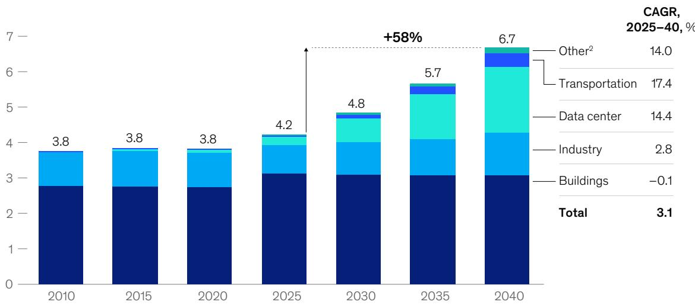  
$^{1}$ Volumetric power demand load is total downstream sales, comparable to data that operators are required to provide on the US Energy Information Administration's Form EIA-861. It represents the gross of distributed generation, behind-the-meter systems, and transmission and distribution losses. $^{2}$ Includes electrolysis for hydrogen production and energy used for synthetic fuel production. Source: US Energy Information Administration; McKinsey Power Model, Global Energy Perspective 2025; McKinsey Global Institute analysis

## McKinsey & Company

## What's needed now

Expanded energy infrastructure will ensure that rising power demand supports productivity growth and innovation and does not become a binding constraint on economic competitiveness. This will mean building new generation and grid capacity at a pace that has not been seen in decades while also maintaining affordability and reliability during the buildout, achieving the difficult balance of business profitability and household well-being.

Over time, doing so will likely require greater coordination among regulators, corporations, and investors. It likely means maintaining legacy power systems while boosting investment and innovation in technologies such as batteries, nuclear, and enhanced geothermal technology. $^{182}$

The following near-term actions could help start to make this happen:

— To ensure system stability, increase collaboration between power generators and regional grid operators to ensure that supply keeps up with demand.

— To enhance grid capacity quickly, deploy existing technologies, including demand response systems, storage, and grid-enhancing technologies that help, for example, manage the grid more effectively during weather events. $^{183}$

— To build new power generation and grid infrastructure faster, resolve supply-side bottlenecks via permitting reform and speed up collaboration across regulators, invest to expand production of scarce equipment such as transformers, and provide targeted skills training for engineers and construction workers.

## 4. New and improved infrastructure

Throughout the country's history, US infrastructure has helped harness its natural abundance and support productivity growth. However, over the past several decades, this historical strength has waned because of underinvestment, and today the United States faces notable gaps, for example in transportation. In the long term, rapid growth in technology, greater domestic production (in the face of geopolitically fracturing trade) and climate change will place greater demands on infrastructure.

Infrastructure, if renewed, could boost innovation and productivity—or it could become a bottleneck for future competitiveness. Like energy, it is a necessary physical input to the next era.

## Coming up short

In 2025, the American Society of Civil Engineers issued a report card that gave US infrastructure a C. In half of 18 specific categories, the country received worse than a C-minus. $^{184}$ No US port ranks among the world's top 50 for vessel time in port. $^{185}$ Forty-five percent of US bridges are more than 50 years old. $^{186}$ Congestion in freight corridors, ports, and logistics systems costs the economy nearly \$166 billion annually. $^{187}$ Approximately 20 million Americans still do not have access to broadband internet. $^{188}$ Cyberattacks on North American utilities, meanwhile, increased 88 percent from 2024 to 2025. $^{189}$

By one estimate, just restoring current infrastructure to good working order requires an additional \$3.1 trillion over the next decade (in addition to a \$600 billion energy shortfall). $^{190}$ Today's gaps are the result of underinvestment, slow permitting processes, and growing wear and tear. In 1959, US public investment in transportation and water infrastructure was 3.0 percent of GDP, 40 percent of which was operations and maintenance. By 2023, that figure was 2.3 percent of GDP, nearly 60 percent of which was spent to keep the systems running. $^{191}$ And when investment does go to new construction, permitting delays materially raise costs—often by 24 to 30 percent—through inflation, labor escalation, and added overhead. $^{192}$

## New era, greater demands

Just as the United States built railroads to connect coal mines to factories to launch the industrial powerhouses of the late 19th century, it now needs modernized physical and digital infrastructure for the next chapter. This means more is needed beyond filling today's gaps.

Geopolitical competition also increasingly features infrastructure, both domestic and in countries with commercial or military ties. China, in particular, has dramatically scaled its infrastructure, and its developers face fewer barriers than Americans. AI data centers, for example, are completed six to 16 months faster in China than in the United States. $^{193}$ China's Belt and Road Initiative has invested in more than 150 countries, with projects in transportation, energy, and digital connectivity, explicitly expanding China's presence in emerging markets. $^{194}$ Since 2012, China has invested roughly \$1.4 trillion through the initiative in energy, mining, and other infrastructure projects, with more than \$200 billion in 2025 alone. $^{195}$ Geopolitical competition also means a renewed push for resilience in critical goods manufacturing, which would come with further infrastructure requirements, as discussed below.

Climate change will also place higher demands on infrastructure, such as irrigation, stormwater, and drainage systems, flood barriers, and power grids with more air conditioning, as climate hazards become more widespread and sometimes more severe. By 2050, the United States will need to scale up infrastructure-related climate adaptation threefold, to about \$36 billion annually, to maintain today's levels of protection. $^{196}$

Should the United States fall further behind, whether by historical standards or global measures, US businesses and households will face higher energy, transportation, and communication costs. That would mean missing out on innovation, including new technologies and processes, that come from building large-scale infrastructure projects. $^{197}$ And it might mean that the United States loses global influence.

## Getting infrastructure on track

Investing in infrastructure yields sizable returns. It promotes growth of industry and technology, generates innovation, and improves household well-being. $^{198}$

Actions that can help deliver new and improved infrastructure sooner rather than later include the following:

— To restore roads, bridges, and other basic infrastructure to good working order, maintain recent heightened momentum in infrastructure spending, which could fill 60 percent of total expected infrastructure needs over the next decade. $^{199}$

— To speed construction of transportation and digital infrastructure, streamline permitting processes and improve coordination across regulators (at the federal, state, and municipal levels), and invest in targeted skills training for engineers and construction workers. $^{200}$

\- To lower long-term costs, integrate digital technologies throughout infrastructure systems to improve efficiency, resilience, and predictive maintenance, and prepare for future capital and operational expenditures for climate resilience, estimated at \$36 billion annually through 2050.

## 5. National economic security in a volatile world

The prerequisites we’ve outlined so far—rejuvenated labor markets, sustained investment, ample power generation, and infrastructure modernization—will all need to take place in a more contentious and fractious world.

A fifth prerequisite is to enhance national economic security. Like the others, national economic security has been a historical US strength, thanks to the country's natural abundance, relative geographic isolation, and leadership in manufacturing and tech.

Today, Mainland China leads the world in manufacturing, producing 45 percent of global output compared to 11 percent for the United States. In some cases, this transfer of share was direct: American companies welcomed the low-cost environment that China (and other developing countries) offered. While the United States remains the second-largest manufacturer in the world, over time it has lost a share of its capacity to produce a wide range of products—from athletic shoes to smartphones, from dysprosium to data processors, from ships to chips—presenting questions about future resilience. $^{201}$

## The critical conundrum

Every year, the United States imports about \$1.2 trillion in critical goods, those central to resilient supply chains and national security (Exhibit 24). $^{202}$ For example, advanced semiconductors are required to run power grids and telecommunications; specific active pharmaceutical ingredients are necessary to produce life-saving antibiotics; specialized high-capacity batteries keep our transportation and defense systems operational.

When US imports of a critical product are not entirely reliable, the situation can pose risk. Altogether, about \$1.4 trillion in US imports are concentrated—the country relies on three or fewer nations for the supply of a given resource or manufactured product. When things go smoothly, this is not a problem. But when there is disruption and a country no longer can or will keep shipping, supply might be shut off. For example, Taiwan and South Korea produce nearly all of the world's most advanced semiconductors. $^{203}$ When the pandemic caused new surges in demand for some products and disrupted supply chains, American households and companies realized just how dependent they were on a handful of countries for semiconductors as well as other products they had not previously considered. The United States saw temporary shortages of products as varied as face masks, aluminum cans, and sriracha. $^{204}$

Geopolitics deepens the conundrum. A total of \$160 billion of US imports are critical, concentrated, and come from geopolitically distant trading partners (see sidebar “Defining geopolitical distance”). This bull’s-eye of potential exposure may seem small, but it contains a wide range of extraordinarily important goods. What’s more, for about three-quarters of these, Americans depend on imports for more than 90 percent of their consumption. If imports are cut off, current domestic production comes nowhere close to filling the gap.

## Exhibit 24

## Two-thirds of goods' imports are exposed to one or more of three trade dependencies.

Breakdown of US imports, \$ billion  
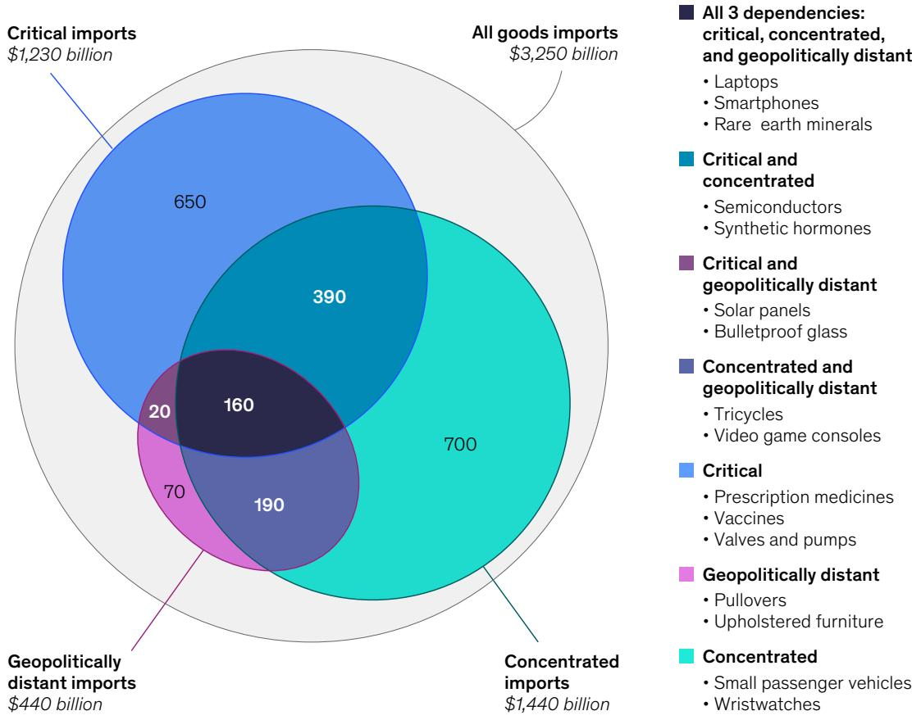  
Note: Critical products as defined in the Draft List of Critical Supply Chains (2022) in response to Executive Order 14017 (2021); geopolitical distances, as defined by MGI, calculated based on differences in countries' UN voting patterns and weighted by share of imports; geopolitically distant products have an average distance above 7.0 (scale 0–10, 0 being US and 10 being Iran). Concentrated products are defined as having Herfindahl-Hirschman Index (HHI) greater than 3,000. Source: US Census Bureau—Trade Data Online (2024); McKinsey Global Institute analysis

## McKinsey & Company

Some of the most exposed goods are critical materials central to economic security, such as rare-earth metals, which power and defense systems depend on. The United States sources 70 percent of its rare earths (and 99 percent of heavy rare earth) from China. Demand for rare earths and other minerals such as lithium, nickel, and copper is rising rapidly; global lithium demand alone is projected to increase roughly eightfold by 2040. Chinese firms own the facilities responsible for refining roughly 80 percent of the world's cobalt, 70 percent of lithium, 60 percent of nickel, and 40 percent of copper. $^{205}$ These dependencies translate directly into national-security risk. Each F-35 fighter requires more than 400 kilograms of rare earth materials, and advanced naval vessels need thousands of pounds. $^{206}$

Sidebar

## Defining geopolitical distance

Previous MGI research developed an analytical measure of geopolitical position, using votes in the UN General Assembly between 2005 and 2022 as a proxy for alignment on global issues. We used principal component analysis to map each voting country on a one-dimensional voting spectrum ranging from zero to ten. Explicitly, we did not define this spectrum based on any specific country or pair of economies. We then took the geopolitical distance between any two economies to be their difference on this scale. $^{2}$

By this measure, Europe, Japan, South Korea, and the United States sit near one end of a spectrum, while China and Russia sit closer to the other end (Exhibit 25). Most emerging markets sit somewhere in the middle. Of course, relations between countries are dynamic. The United States and countries that are close, by our definition, diverged over some high-profile UN General Assembly votes in 2025. But this has happened before; UN votes are a noisy measure of geopolitical alignment, with countries' voting practices varying from session to session. Time will tell if recent voting patterns signal a more permanent shift in geopolitical relations.

Exhibit 25

Economies hold different geopolitical positions.

Geopolitical position based on UN General Assembly voting patterns, $^{1}$ 2005–22, 0–10 scale

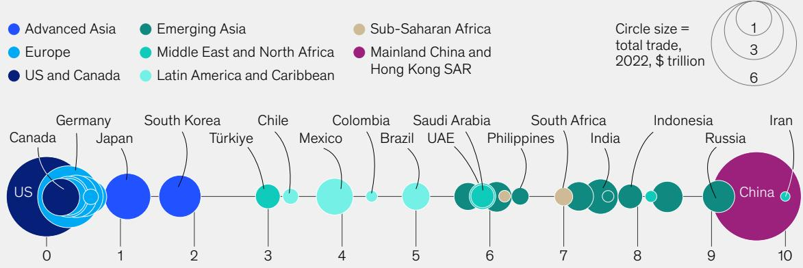

$^{1}$ Calculated by principal component analysis of UNGA voting records in 2005–22, reduced to a 0–10 scale. To exclude procedural votes, a subset of UNGA votes are considered. For 2005–21, these exclude votes not designated as “important” in “Voting practices in the United Nations,” US Department of State. For 2022, votes addressing the war in Ukraine are included.

Source: Geopolitics and the geometry of global trade, McKinsey Global Institute, 2024; McKinsey Global Institute analysis

McKinsey & Company

Critical manufactured products in a range of technologies are also at risk. The three largest product exposures are smartphones (\$56 billion in imports in 2024) and laptops (\$48 billion), essentials of daily life for millions, followed by lithium-ion batteries (\$22 billion), which are heavily used in those and other consumer electronics, electric transportation, and large-scale energy storage. $^{207}$ Other product exposures are smaller in terms of import value but no less vital. Consider pharmaceuticals. China supplies more than 90 percent of US imports by volume for a range of both finished drugs (for example, the anti-inflammatory prednisone and the antibiotics penicillin and streptomycin) and active pharmaceutical ingredients (including for antibiotics, ibuprofen, and hydrocortisone). $^{208}$

## Building resilience for the future

Of course, the United States needs to prepare for resilience tomorrow rather than focusing on gaps of the past. Exposure points have emerged in industries of the future, which will shape the global economy in years to come. For example, while the United States has made massive moves to boost its semiconductor manufacturing capabilities—attracting more than \$450 billion in investment commitments between 2022 and 2025, including some \$200 billion in announced FDI focused mainly on leading-edge chips—some production inputs are exposed. $^{209}$ Consider printed circuit boards and chemicals used in fabs, where China accounts for 30 percent and 60 percent, respectively, of US imports. $^{210}$

For other goods critical to industries of the future, imports are concentrated, though not, for the moment, with geopolitically distant exporters. As AI data centers scaled rapidly in 2025, imports of logic chips and networking equipment (mainly from Taiwan) were the fastest-growing segment, at about 50 percent annually. $^{211}$ And in quantum computing, where accuracy is existential, concentration is acute: Japan specializes in blue gallium laser diodes, Finland in high-precision timing devices, and Sweden in the highest-quality low-temperature amplifiers. $^{212}$ In all of these areas, China has been rapidly building its own competing manufacturing capabilities. $^{213}$ But the immediate competition is to be first to build a robust quantum computer, not to build scale.

How can America address these exposure points, building resilience while striking a thoughtful balance between openness and entrepreneurship, on the one hand, and the urgent needs of national security, on the other? $^{214}$ Here, history may not be the best guide. The next uncertain era certainly recalls the third historical chapter, from World War II to the end of the Cold War. Both feature a rapidly shifting technology landscape, growing geopolitical tension, and the fracturing of a global economic system.

But it's unlikely to be anything like an exact repeat of that chapter. Today's trade crisscrosses the globe, China is the world's top manufacturing powerhouse, and US tech development is shaped and funded disproportionately by firms rather than by government (business-funded R&D was equivalent to 2.6 percent of GDP in 2022, compared to 0.6 percent for federally funded R&D). $^{215}$ And today's biggest firms are largely globalized and not focused on the implications of business decisions for national resilience.

One step is clear: The United States will need to bolster its ability to procure or develop critical materials and to address manufacturing gaps that could become strategic choke points. In some cases, diversifying sourcing to more geopolitically aligned economies may be sufficient. In just the last year, supply chains for some products have shifted significantly. For example, US imports of both smartphones and laptops stayed constant from 2024 to 2025; both were about \$50 billion. But in the same span, imports from China fell by about \$17 billion for smartphones and \$23 billion for laptops. $^{216}$

In parallel, America may need to invest in new production capacity, requiring a fundamentally revamped industrial footprint. Ramp-up ratios—the factor of domestic production increase that would be equivalent to current imports—for products in the bull's-eye of exposure (critical, concentrated, and geopolitically distant) are nearly double for medical and scientific instruments, five times for machinery, and more than six times for electronics. $^{217}$ For some products, ramp-up factors are much higher. For example, the figures are 13 times for laptops, 17 for smartphones, and 26 for medical gloves.

Increasing domestic production adds urgency and magnitude to all the other prerequisites discussed, requiring even more skilled labor to use cutting-edge robotics, sustained funding, energy, and infrastructure. Attracting more FDI can help. The benefits go beyond simple funding: Cross-border investments that take root also transfer knowledge and spur ongoing domestic investment. In a virtuous cycle, building production know-how can generate even greater innovation and productivity growth, along with greater employment. $^{218}$

The United States has done well recently. Across sectors from 2022 to 2025, the country nearly doubled its announced annual FDI inflows compared to the prepandemic period, with Japan, South Korea, and Taiwan the primary contributors. The CHIPS and Science Act, for example, spurred new waves of investment, particularly in US production of semiconductors. In this same period, the United States received the most announced semiconductor FDI globally. $^{219}$ These new investments come with a great deal of production know-how.

National economic security will be assured only by greater partnership between government and business. This will help with the twin objectives of securing critical materials and expanding domestic production capacity, as well as promoting the technological innovation needed to stay ahead in the first place. Government will likely need to increase its investment, “crowding in” further investment from the private sector. Public funding has been central to major historical breakthroughs including semiconductors, biotechnology, and the internet. Low rates of private investment in some next-era critical technologies such as quantum, which have long time horizons and high degrees of uncertainty, suggest the need for public spending. $^{220}$

## Next steps in boosting economic security

The spotlight is increasingly on national economic security. A variety of developments are evolving at a national level that may help. Some, such as the CHIPS and Science Act, are already established; others, such as America's Talent Strategy and America's AI Action Plan, are relatively new. Still others are in discussion and deserve continued focus.

Central to national economic security is achieving the needed degree of resilience in sourcing critical products, whether from abroad or production at home. Businesses and government entities that are deep on the intricacies of production and supply networks will need to align on which critical goods are top priority. Defense supply chains are especially vital. Securing these, whether from stockpiling, shifted sourcing, or targeted investments in new capacity, is a critical next step. $^{221}$

That will test the ability of government to make the needed investments in defense and technology infrastructure and to respond to crises. As discussed in the context of sustained long-term investment, a high national debt burden, particularly in a time of high interest rates, might reduce government's ability to raise funds when it next needs them most.

All that said, the best defense is a good offense. Continued resilience will also depend on the country's ability to do all the other things it is best at while ensuring that its companies are strong and that the economy works for all Americans. The pace and magnitude of technological change make this more urgent than ever.

These are acute challenges. But as Alexis de Tocqueville wrote, “The greatness of America lies not in being more enlightened than any other nation, but rather in her ability to repair her faults.” If there’s one country that has proven itself capable of reinvention when circumstance demands, it is the United States.

CHAPTER 5

# America's national project

History and the analysis in this report demonstrate that competitiveness must be earned, through choices, investments, and continual renewal of institutions. It is not an inheritance.

As the old era gives way to the new, the American economy is in a position of immense strength. The country's firms lead global markets, its innovations define technological frontiers, and its aggregate prosperity exceeds that of any other large economy. Yet, absent commitment to change, all that is at risk of loss to labor market disruption, potential turbulence in the financial system, and real geopolitical strife. This is a moment for confidence, not complacency, as leaders, shapers, and decision-makers across the country commit to choices to perpetuate America's long-running strengths.

For businesses, US competitiveness determines whether they can continue to scale, innovate, and attract capital. The United States has long offered an unmatched combination of market size, deep financial systems, talent density, and institutional predictability. As competition intensifies and costs of capital rise, preserving these advantages will depend on reliable infrastructure, accessible talent pipelines, and policy frameworks that reward productive investment over short-term extraction.

For governments—federal, state, and local—competitiveness is essential to fiscal capacity and policy autonomy. A productive, growing economy expands the resources available for the long list of public investment needs, from infrastructure and education to national defense and social insurance. Untethering that economy requires governments to modernize permitting and infrastructure delivery, safeguard market competition, invest in research and skills, and maintain fiscal credibility.

For individuals and households, competitiveness means opportunity: access to good jobs, rising wages, affordable essentials, and paths for advancement. Productivity growth remains the most reliable driver of such opportunity. But this relationship is neither automatic nor evenly distributed. In an AI-powered world, prosperity will depend on dynamic labor markets, portable skills, and well-supported transitions.

The United States has reinvented its economic model before, showing resolute resilience in the face of deep uncertainty and challenges. Over the past two and a half centuries, the country's competitiveness has been understood as a shared responsibility and generational investment, worth struggling for. Americans have come together to build railroads, electrify cities and small towns, expand education, and pioneer new industries.

Sustaining and sharpening America's competitive edge in the next chapter is part of the ongoing national project made newly urgent by a changing world.

# Acknowledgments

The research was led by Rebecca J. Anderson, an MGI senior fellow in McKinsey's Washington, DC office; Olivia White, a director of MGI and a senior partner in the Bay Area office; Eric Kutcher, chair of North America and a senior partner in the Bay Area office; Kweilin Ellingrud, a director of MGI and a senior partner in the Minneapolis office; Shubham Singhal, MGI chair and a senior partner in the Detroit office; Scott Blackburn, a senior partner in the Washington, DC office; Arvind Govindarajan, a partner in the Boston office; Aly Spencer, a partner in the New York office; TJ Radigan, an MGI fellow in the Boston office; and Mark Staples is an editorial director in the New York office. TJ Radigan led the working team, which included Frances Matamoros and Evan Bimaputra.

Juan Velasco provided expert support with data visualization.

The authors wish to thank Ben Saft, head of communications for special initiatives in the New York office; Max Gleischman, partner of strategic communications in the New York office; MGI editorial director Rachel Robinson; Rebeca Robboy, MGI director of communications; and Rishabh Chaturvedi, MGI's manager of editorial operations.

We are especially grateful for the contributions of MGI advisers Matt Slaughter, the Paul Danos Dean of the Tuck School of Business at Dartmouth College; Hans-Helmut Kotz, a resident fellow at the Minda de Gunzburg Center for European Studies at Harvard University and a senior fellow of the Leibniz Institute for Financial Research SAFE; and Martin Neil Baily, senior fellow emeritus in economic studies at The Brookings Institution.

We thank our McKinsey and MGI colleagues Aditya Iyengar, Alastair Green, Annabel Farr, Anu Madgavkar, Bob Sternfels, Carlo Tanghetti, Diego Castresana, Drew Erdmann, Emma

Clifford, Ezra Greenberg, Fábio Neves, Gabriel Cerdas, Humayun Tai, Jan Mischke, Jeongmin Seong, Jesse Noffsinger, Jon Spaner, Jose Maria Quiros, Kanmani Chockalingam, Kate Smaje, Kevin Russell, Lucas Hattori, Maria Jesus Ramirez, Mekala Krishnan, Michael Neary, Michiel Nevard, Nick Kingsmill, Patrick Chen, Rick Tetzeli, Sebastian Vargas, Suhayl Chettih, Tiago Devesa, and Vishesh Patel for their insights and guidance.

The cover illustration features prominent American inventions of the past 250 years.

As with all MGI research, this work is independent and has not been commissioned or sponsored in any way by any business, government, or other institution. We seek to provide business and policy leaders with the facts and insights needed to better understand the forces shaping the global economy. Any errors are our own.

## Endnotes

1 We define a “populous” country as one with at least ten million people.

US productivity growth since 2019 has been twice as fast as in the previous decade (2010–19). Based on data from the US Bureau of Labor Statistics and The Conference Board, US productivity growth from 2019 to 2024 was higher than in the rest of the G7. While Mainland China's productivity growth was lower in 2019–24 relative to 2010–19, it was still higher than US productivity growth over the period (5.7 percent versus 2.1 percent). This recent productivity uplift can be attributed to many factors, such as pandemic-era labor market disruptions. For one set of explanations, see Christopher J. Waller, There's still no rush, speech at the Economic Club of New York, March 27, 2024.

John P.A. Ioannidis, "August 2024 data-update for 'Updated science-wide author databases of standardized citation indicators,'" Version 7, Elsevier Data Repository, September 2024; The AI index 2025 annual report, Stanford Institute for Human-Centered Artificial Intelligence (Stanford HAI), April 2025.

Announced greenfield FDI into the United States more than doubled from 2015–19 to 2022–25 and stands at more than \$200 billion annually; the United States captured about 30 percent of global investment in automotive assembly and batteries. See “The FDI shake-up: How foreign direct investment today may shape industry and trade tomorrow,” McKinsey Global Institute, September 22, 2025.

Throughout this report, “China” refers to Mainland China unless otherwise specified.

Public trust in government: 1958–2025, Pew Research Center, December 4, 2025. See also “In a moment of tariffs, can the world find balance and trust to thrive?,” McKinsey, May 2, 2025.

The United States accounted for 57 percent of worldwide deal value in 2024 and was home to half of the world's unicorns, including nearly \$2.1 trillion in valuation concentrated in California alone. National Venture Capital Association (NVCA), NVCA 2025 yearbook, March 2025; Hurun Research Institute, Global Unicorn Index 2025, July 2025.

Based on data from The Conference Board. Valuations are also supported by economic profits, higher in the United States than in other regions. Recent McKinsey research found that economic profit pools in the United States and Canada were 1.7 times higher in the last five years than

they were from 2005 to 2009 but down slightly in Europe. "Global economic profit bounces back to an all-time high," McKinsey, September 4, 2025.

Refers to all firms with at least \$1 billion in revenue in the United States and the European Union, United Kingdom, Norway, and Switzerland. "Accelerating European competitiveness for a new era," McKinsey Global Institute, January 16, 2024.

In eight out of 11 industries in the Global Industry Classification Standard, spanning the entire economy, US companies made up five or more of the top ten publicly traded companies by market capitalization as of December 31, 2025. The three industries in which the United States did not make up the majority are energy, utilities, and materials.

11 US top-performing “young” firms—those less than five years old and in the top decile for sales growth—make up six times the share of total employment of their European counterparts. Oyun Erdene Adilbish et al., Europe’s productivity weakness: Firm-level roots and remedies, International Monetary Fund, February 2025. Relatedly, among G7 countries, the United States has one of the highest rates of scaled-up companies—those that were small businesses at some point since 2000. Seventeen percent of US companies are scale-ups, second among the G7 to the United Kingdom, with 18 percent. “A microscope on small businesses: Spotting opportunities to boost productivity,” McKinsey Global Institute, May 2, 2024.

$^{12}$ Over the past 30 years, the United States has averaged productivity growth close to 2 percent, while other G7 countries have averaged 0.2 percent to just over 1.0 percent, based on data from The Conference Board. The productivity figures in Exhibit 5 refer to aggregates across a national sample of companies.

$^{13}$ Based on data from IHS Markit.

14 According to the US Bureau of Economic Analysis, manufacturing's share of GDP was 21 percent in 1979 and just under 10 percent in 2025. According to the US Bureau of Labor Statistics, manufacturing's share of employment was 22 percent in the late 1970s and 8 percent in 2025.

15 David H. Autor, Lawrence F. Katz, and Melissa S. Kearney, "The polarization of the U.S. labor market," American Economic Review, May 2006, Volume 96, Number 2; Daron Acemoglu and David Autor, "Skills, tasks and technologies: Implications for employment and earnings," Handbook of Labor Economics, Volume 4b, Orley Ashenfelter and David Card, eds., North Holland, 2010.

"The social contract in the 21st century," McKinsey Global Institute, February 5, 2020.

Based on data from the US Bureau of Economic Analysis.

In semiconductors, for example, the United States retains more than 50 percent of global revenues but saw its share of manufacturing capacity fall from 37 percent in 1990 to just 10 percent by 2022, with near-zero presence in advanced logic and high-bandwidth memory chips. State of the U.S. semiconductor industry, Semiconductor Industry Association, July 2025.

"Executive order 14017 – America's supply chains," Administration of Joseph R. Biden, Jr., February 24, 2021. A specific list of products appears in "Draft list of critical supply chains," US International Trade Administration, accessed February 16, 2026.

Manufacturing output data from the US Bureau of Economic Analysis. Manufacturing employment data from the US Bureau of Labor Statistics. Future industries are based on “The next big arenas of competition,” McKinsey Global Institute, October 23, 2024.

Olivia White, Rebecca J. Anderson, and Jan Mischke, "The economy is walking a tight rope. What could trip it up," Barron's, October 9, 2025.

R&D intensity refers to R&D spending as a share of revenue; refers to all firms with at least \$1 billion in revenue in the United States and the European Union, United Kingdom, Norway, and Switzerland; “Accelerating European: Competitiveness for a new era,” McKinsey Global Institute, January 16, 2024.

Heather Boushey, “The Biden-Harris administration has catalyzed \$1 trillion in new U.S. private sector clean energy, semiconductor, and other advanced manufacturing investment,” The White House, November 26, 2024; Christopher V. Pece, “Reclassification of federally funded research and development centers as federal intramural performers of R&D,” National Center for Science and Engineering Statistics, National Science Foundation, January 4, 2024.

24 The United States is ranked third, after Switzerland and Sweden. Global innovation index 2025, World Intellectual Property Organization, 2024.

The AI index 2025 annual report, Stanford HAI, April 2025.

John P. A. Ioannidis, "August 2024 data-update for 'Updated science-wide author databases of standardized citation indicators,'" Version 7, Elsevier Data Repository, September 2024.

McKinsey Global Institute analysis of Nobel Prize recipients; Nobel Foundation; Britannica.

The first “China shock” refers to the loss of employment in manufacturing in the United States following China’s rapid expansion of manufacturing capacity; David H. Autor, David Dorn, and Gordon H. Hanson, “The China shock: Learning from labor-market adjustment to large changes in trade,” Annual Review of Economics, October 2016, Volume 8, Number 1; David Autor and Gordon Hanson, “We warned about the first China shock. The next one will be worse.” The New York Times, July 14, 2025; See also Jonathan E. Hillman, U.S. economic security: Winning the race for tomorrow’s technologies, Council on Foreign Relations, Task Force on Economic Security report number 83, November 13, 2025

See Jonathan E. Hillman, U.S. economic security: Winning the race for tomorrow's technologies, Council on Foreign Relations, Task Force on Economic Security report number 83, November 13, 2025; Emily Harding and Harshana Ghoorhoo, "Seven critical technologies for winning the next war," Center for Strategic and International Studies, April 2023.

Amy Harder, "China blowing past world on renewables and EVs," Axios, December 3, 2025.

Michael Kinch and Kevin Gardner, “We crunched the numbers on drug discovery in the U.S. vs. China. The results were alarming,” STAT News, December 16, 2025.

Meghan Ostertag, “Fact of the week: China has surpassed the US in the number of drug clinical trials, with 1,100 more trials listed,” Information Technology & Innovation Foundation, June 9, 2025; Silvia Crescioli and Janice M. Reichert, “Innovative antibody therapeutic development in China compared with the USA and Europe,” Nature Reviews Drug Discovery, November 7, 2025.

See also Todd Young, "How America can win the biotech race," Foreign Affairs, October 2025.

Meaghan Tobin and Keith Bradsher, "There are more robots working in China than the rest of the world combined," The New York Times, September 25, 2025.

Michael Froman, “China, the United States, and the AI race,” Council on Foreign Relations, October 10, 2025.

See, for example, “DJI Matrice 4 series brings intelligence to aerial operations,” DJI,

January 8, 2025; Pavlo Zvenyhorodskyi and Scott Singer, Embodied AI: China's big bet on smart robots, Carnegie Endowment for International Peace, November 24, 2025.

37 See, for example, Mikko Packalen, “Edge factors: Scientific frontier positions of nations,” Scientometrics, Volume 118, February 2019. Niccolò Pisani et al., “China’s rise as global scientific powerhouse: A trajectory of international collaboration and specialization in high-impact research,” Research Policy, October 2025, Volume 54, Number 8; Renli Wu, Christopher Esposito, and James Evans, “Shifting power asymmetries in scientific teams reveal China’s rising leadership in global science,” Proceedings of the National Academy of Sciences of the United States of America, October 2025, Volume 122, Number 44.

Australian Strategic Policy Institute, 2025. Others have pointed out that China is now the world's global leader in uncrewed aerial vehicles, solar panels, graphene, high-speed rail, electric vehicles, and lithium batteries; see Malcolm Scott, "The US is failing to contain China's push for tech supremacy," Bloomberg, October 30, 2024.

See Jonathan E. Hillman, U.S. economic security: Winning the race for tomorrow's technologies, Council on Foreign Relations, Task Force on Economic Security report number 83, November 13, 2025; Sam Howell, The quest for qubits: Assessing US–China competition in quantum computing, Center for a New American Security, May 2024.

Andrés Rodríguez-Pose, Leiboyu Xiang, and Neil Lee, “Finding stars: Mapping the geography of the world’s scientific elites,” Transactions of the Institute of British Geographers, November 2025.

While the United States has a quarter of Mainland China's population, it has just one-tenth of the engineering graduates; Paul Eremenko and Ashish Srivastava, "China graduates 1.3 million engineers per year, versus just 130,000 in the U.S. We need AI to bridge the gap," Fortune, January 14, 2026.

Only 22 percent of 12th-graders performed at or above “proficient” levels in math, and 35 percent at reading; only 31 percent of eighth graders performed at or above “proficient” levels in science.

"Average performance of 15-year-old students in mathematics," in Hannah Ritchie et al., "Global education," Our World in Data, September 9, 2025; data adapted from OECD.

44 For a discussion of general education as a historical source of strength for the United States, see Claudia Goldin and Lawrence F. Katz, The Race Between Education and Technology, Harvard University Press, 2008.

45 "From poverty to empowerment: Raising the bar for sustainable and inclusive growth," McKinsey Global Institute, September 18, 2023.

46 This refers to market income, or income before taxes and redistribution. When cash transfers are included, this fact does not materially change. See Xavier Timbeau, "Is Europe falling behind the United States?" OFCE (Sciences Po Paris), May 21, 2025. Note that there is ongoing debate about the impact of in-kind transfers, especially regarding how to account for public expenditure on healthcare and how transfers shift relative incomes for lower income quintiles. For a range of perspectives on this argument, see Gerald Auten and David Splinter, "Income inequality in the United States: Using tax data to measure long-term trends," Journal of Political Economy, July 2024, Volume 132, Number 7; Richard V. Burkhauser, James Elwell, and Kevin Corinth, Income growth and its distribution from Eisenhower to Obama: The growing importance of in-kind transfers, AEI Economics working paper number 2019-21, American Enterprise Institute, November 2019; Emmanuel Saez and Gabriel Zucman, Trends in US income and wealth inequality: Revising after the revisionists, National Bureau of Economic Research working paper number 27921, September 2020; and Emmanuel Saez and Gabriel Zucman, Letter to House of Representatives Committee on Ways and Means, May 11, 2021.

Measured before taxes and redistribution. Based on data from the World Inequality Database.

Luke Pardue and Ella Grant, “Current evidence on household financial well-being,” in Advancing America’s Prosperity, Melissa S. Kearney and Luke Pardue, eds., Aspen Institute, 2025. Government benefits in this case refers to cash payments as well as in-kind services, such as Medicaid.

Jobs with wages in the middle of the income distribution have increasingly disappeared (their share of total employment in the United States fell six percentage points between 2000 and 2018). "The social contract in the 21st century," McKinsey Global Institute, February 5, 2020.

"Out of balance: What's next for growth, wealth, and debt?" McKinsey Global Institute, October 9, 2025.

51 Economic historians point to several contributing factors, though the precise nature and relative magnitude of each are matters of debate. One often-mentioned factor is rapid technological advancement. Some scholars argue that educational advancement of the workforce did not keep up; the result was increased automation of some jobs formerly done by humans. Another factor is growing productivity and industrial expansion in emerging markets, resulting in greater import competition. Relatedly, deindustrialization has shifted the distribution of jobs toward both high- and low-wage services jobs, increasing wage polarization. Labor unions also declined in strength and numbers. Deregulation in the financial sector and rising financial asset returns raised the rewards for higher (financial) skills and benefited asset owners. Some have argued that monetary policies in the wake of the global financial crisis have contributed to macroeconomic distortions, including contributing to growing asset values relative to economic output. For a range of research on this subject, see Peter H. Lindert and Jeffrey G. Williamson, Unequal Gains: American Growth and Inequality Since 1700, Princeton University Press, 2016; Daron Acemoglu and David Autor, "Skills, tasks and technologies: Implications for employment and earnings," in Handbook of Labor Economics, Volume 4b, Orley Ashenfelter and David Card, eds., North Holland, 2010; Anna Stansbury and Lawrence H. Summers, The declining worker power hypothesis: An explanation for the recent evolution of the American economy, National Bureau of Economic Research working paper number 27193, May 2020; David H. Autor, Lawrence F. Katz, and Melissa S. Kearney, "The polarization of the U.S. labor market." American Economic Review, May 2006, Volume 96, Number 2; Atif Mian, Kamalesh Rao, and Amir Sufi, "Household balance sheets, consumption, and the economic slump," The Quarterly Journal of Economics, November 2013, Volume 128, Number 4; Thomas Piketty and Emmanuel Saez, "Top incomes and the Great Recession," IMF Economic Review, August 2013, Volume 61, Number 3.

"Total real gross domestic product for San Jose–Sunnyvale–Santa Clara, CA," last updated December 4, 2024, and "Resident population in San Jose–Sunnyvale–Santa Clara, CA," last updated March 14, 2025, FRED, Federal Reserve Bank of St. Louis. Real GDP per capita rose from \$66,000 to almost \$200,000.

Based on data from the OECD, 48 percent of low-income (bottom-quintile) households in the United States spend at least 40 percent of their income on housing. Among the G7, the next highest was Canada at 35 percent. Data from the US Bureau of Labor Statistics show that an average of 40 percent of spending by the bottom quintile of earners is directed toward housing, compared to about a third on average across the population.

"The economics of cotton," in U.S. History, OpenStaxCollege, 2014.

55 US Census Bureau; “Great Britain,” New World Encyclopedia, accessed February 13, 2026; “American War of Independence: Outbreak,” National Army Museum, accessed February 13, 2026; “Populations of Great Britain and America,” Encyclopedia of the American Revolution: Library of Military History, Encyclopedia.com, accessed February 13, 2026.

56 "Agricultural area over the long-term, 1600 to 2023," HYDE and Our World in Data, 2023; "Daily supply of calories per person, 1604 to 2022," Food and Agriculture Organization of the United Nations and Our World in Data; figure for Western European countries is the average of the United Kingdom, Germany, and France.

57 Some estimates also show incomes in purchasing power parity terms as being higher in the 13 American colonies compared to Britain. See Peter H. Lindert and Jeffrey G. Williamson, Unequal Gains: American Growth and Inequality Since 1700, Princeton University Press, 2016.

Joshua L. Rosenbloom, The colonial American economy, ISU General Staff Papers, Iowa State University, February 2018.

59 Betty Joyce Nash, "Rice to riches," Region Focus, Federal Reserve Bank of Richmond, Winter 2008, Volume 12, Number 1.

60 "Waterways," Mid-America Freight Coalition (MAFC) Regional Freight Study, accessed February 13, 2026.

61 Before the introduction of McCormick's mechanical reaper, six laborers could harvest two acres per day. After its introduction, a smaller crew could handle between ten and 15 acres per day. Meanwhile, the cotton gin made it economical to harvest short-staple upland cotton, which yielded two to three times more cotton per acre than the previously entrenched Sea Island variety and could be grown over a vastly larger area. American cotton production expanded 1,000-fold between 1790 and 1860 as a result of both this invention and continuous innovation in seed varieties. See William H. Phillips, "Cotton gin," EH.Net Encyclopedia, Economic History Association, February 2004; Alan L. Olmstead and Paul W. Rhode, Creating Abundance: Biological Innovation and American Agricultural Development, Cambridge University Press, 2008; John G. Clark and Nancy Farm Mannikko, "McCormick invents the reaper," EBSCO, 2023.

62 For further reading in the role of institutions, exports, and market expansion on pre-Civil War US growth, see Douglass C. North, The Economic Growth of the United States, 1790–1860, Prentice-Hall, 1961.

63 Richard Campanella, "The speed of culture," 64 Parishes, March 2019.

64 Joshua L. Rosenbloom, The Industrial Revolution in the United States: 1790–1870, National Bureau of Economic Research working paper number 34225, September 2025.

65 At this event, also referred to as the New York Crystal Palace Exhibition, a member of the British delegation is purported to have said, "In consequence of the scarcity and high price of labor in the United States, and the extreme desire manifested by masters and workmen to adopt

all labour-saving appliances...a considerable number of different trades are carried on... in large factories, with machinery applied to almost every process, the extreme subdivision of labour and all reduced to an almost perfect system of manufactures." Joshua L. Rosenbloom, The Industrial Revolution in the United States: 1790–1870, National Bureau of Economic Research working paper number 34225, September 2025.

Peter L. Rousseau and Richard Sylla, Emerging financial markets and early U.S. growth, National Bureau of Economic Research working paper number 7448, December 1999.

Thomas Weiss, Long term changes in US agricultural output per worker, 1800 to 1900, National Bureau of Economic Research working paper number 23, February 1991.

By some accounts, the United States was the first economy to reach “modern economic growth,” defined by Simon Kuznets as sustained GDP per capita growth of at least 1 percent a year. Peter H. Lindert and Jeffrey G. Williamson, Unequal Gains: American Growth and Inequality Since 1700, Princeton University Press, 2016.

In the words of Louis M. Hacker, the Civil War and its conclusion “permitted the unchecked advance of industrial capitalism.” Louis M. Hacker, The Triumph of American Capitalism: The Development of Forces in American History to the End of the Nineteenth Century, Simon and Schuster, 1940. In the South, the property share of income declined from 33 to 11 percent from 1860 to 1870, reflecting emancipation of enslaved people and wartime destruction. See Peter H. Lindert and Jeffrey G. Williamson, Unequal Gains: American Growth and Inequality Since 1700, Princeton University Press, 2016. See also Jonathan Levy, Ages of American Capitalism: A History of the United States, Random House, 2021.

Jutta Bolt and Jan Luiten van Zanden, Maddison Project Database 2023, April 2024. Other sources estimate that US GDP per capita at purchasing power parity surpassed Britain much earlier, as of colonial times. See Peter H. Lindert and Jeffrey G. Williamson, Unequal Gains: American Growth and Inequality Since 1700, Princeton University Press, 2016.

71 Capital expenditure on railroads peaked at 4.31 percent of GDP between 1848 and 1854. Rui M. Pereira, William J. Hausman, and Alfredo Marvão Pereira, Railroads and economic growth in the antebellum United States, College of William and Mary Department of Economics working paper number 153, December 2014. Before railroads, goods could generally be transported only up to 100 miles by land. See J. Bradford DeLong, Slouching Towards Utopia: An Economic History of the Twentieth Century, Basic Books, 2022.

See Alfred D. Chandler Jr., Scale and Scope: The Dynamics of Industrial Capitalism, Belknap Press of Harvard University Press, 1990; Kevin H. O'Rourke and Jeffrey G. Williamson, Globalization and History: The Evolution of a Nineteenth-Century Atlantic Economy, The MIT Press, 1999.

The first major wave of globalization, from about 1870 to World War I, was catalyzed in large part by declining transportation costs. See J. Bradford DeLong, Slouching Towards Utopia: An Economic History of the Twentieth Century, Basic Books, 2022.

Brian R. Mitchell, International Historical Statistics: The Americas, 1750–2005, Palgrave Macmillan, 2013. Waves of migration from Europe to the United States began in the mid-19th century, which some have called the “first mass migration in history”; see Timothy J. Hatton and Jeffrey G. Williamson, The Age of Mass Migration: Causes and Economic Impact, Oxford University Press, 1998.

J. Bradford DeLong, Slouching Towards Utopia: An Economic History of the Twentieth Century, Basic Books, 2022.

Jonathan Levy, Ages of American Capitalism: A History of the United States, Random House, 2021; Peter L. Rousseau and Richard Sylla, Emerging financial markets and early U.S. growth, National Bureau of Economic Research working paper number 7448, December 1999.

According to Bergeaud, Cette, and Lecat, TFP accounted for roughly 1.3 percent of growth from 1890 to 1913, rising to approximately 2.5 percent in the period 1913–50. Antonin Bergeaud, Gilbert Cette, and Rémy Lecat, "Productivity trends in advanced countries between 1890 and 2012," The Review of Income and Wealth, September 2016, Volume 62, Number 3.

Claudia Goldin and Lawrence F. Katz, "The shaping of higher education: The formative years in the United States, 1890 to 1940," Journal of Economic Perspectives, Winter 1999, Volume 13, Number 1.

Colleges of Agriculture at the Land Grant Universities: A Profile, National Research Council, The National Academies Press, 1995.

J. Bradford DeLong, Slouching Towards Utopia: An Economic History of the Twentieth Century, Basic Books, 2022.

For more on the professionalization of management, see Alfred D. Chandler Jr., Scale and Scope: The Dynamics of Industrial Capitalism, Belknap Press of Harvard University Press, 1990.

Based on data from the IMF.

Herman, Arthur, Freedom's Forge: How American Business Produced Victory in World War II, Random House, 2012.

84 Angus Maddison, "Shares of the rich and the rest in the world economy: Income divergence between nations, 1820–2030," Asian Economic Policy Review, June 2008, Volume 3, Number 1.

85 "Exorbitant privilege" refers to the ability of the United States (or any global reserve currency country) to borrow at low interest rates, run persistent trade and fiscal deficits, and finance itself in its own currency. The term was originally used by Valéry Giscard d'Estaing, France's minister of finance in the 1960s, in reference to the advantage of the United States in the global economy. For further reading, see Kenneth Rogoff, Our Dollar, Your Problem: An Insider's View of Seven Turbulent Decades of Global Finance, and the Road Ahead, Yale University Press, 2025.

86 For discussion on the development of semiconductors and US government role, see Chris Miller, Chip War: The Fight for the World's Most Critical Technology, Scribner, 2022.

37 Allocating Federal Funds for Science and Technology, National Academy of Sciences Committee on Criteria for Federal Support of Research and Development, The National Academies Press, 1995; Richard Rowberg, "Federal R&D funding: A concise history," Congressional Research Service, 1998. Federally supported R&D totaled \$70 million in 1940 and \$1.05 billion in 1950.

Nobel Foundation; Britannica. Defined based on the country of citizenship at the time the prize was awarded. Individuals with multiple nationalities are counted multiple times, once for each nationality.

Notably, in the postwar era, immigrants represented a disproportionate share of the entrepreneurs and engineers who propelled US technological competitiveness. In some cases, these were entrepreneurs and inventors whose breakthroughs came about at US universities or in research laboratories (such as Albert Sabin, who created the oral polio vaccine at the University of Cincinnati). In other cases, the United States strategically recruited innovators already at the frontier (for example, the secretive “Operation Paperclip” aimed to boost US military supremacy by recruiting 1,600 German scientists in the aftermath of World War II).

90 Brian R. Mitchell, International Historical Statistics: The Americas, 1750–2005, Palgrave Macmillan, 2013; Keith W. Olson, "The G.I. Bill and Higher Education: Success and Surprise," American Quarterly, December 1973, Volume 25, Number 5.

91 For further discussion of the Federal Reserve in this period, see Jonathan Levy, Ages of American Capitalism: A History of the United States, Random House, 2021.

92 Francis Fukuyama, The End of History and the Last Man, Free Press, 1992. This sense of optimism proved short-lived, as China grew in economic might, accelerated by its entry to the WTO in 2001, without fully embracing these principles.

93 Based on data from IHS Markit.

94 Economist Richard Baldwin has referred to the waves of offshoring production made possible by improved communications as globalization's "second unbundling." Richard Baldwin, Trade and industrialisation after globalisation's 2nd unbundling: How building and joining a supply chain are different and why it matters, National Bureau of Economic Research working paper number 17716, December 2011.

After launching the modern semiconductor industry in the 1950s, America has lost most of its fabrication capacity; Taiwan now produces 90 percent of the world's most advanced chips. Chris Miller, Chip War: The Fight for the World's Most Critical Technology, Scribner, 2022.

Jonathan Levy, Ages of American Capitalism: A History of the United States, Random House, 2021; J. Bradford DeLong, Slouching Towards Utopia: An Economic History of the Twentieth Century, Basic Books, 2022.

Based on data from the Federal Reserve Board.

Based on data from The Conference Board; this figure as reported by the US Bureau of Labor Statistics is 3 percent. During this time, China rapidly grew its productivity, although levels started out much lower than those of advanced economies.

Dale W. Jorgenson, "US economic growth in the information age," Issues in Science and Technology, Fall 2001, Volume XVIII, Number I.

OECD Venture Capital data, 2023.

Josh Lerner and Ramana Nanda, Venture capital's role in financing innovation: What we know and how much we still need to learn, Harvard Business School working paper number 20-131, 2020. Out of the ten companies, seven—Nvidia, Apple, Microsoft, Amazon, Alphabet, Meta, and Tesla—received venture capital backing during their early stages, based on press coverage and company websites.

$^{102}$ Based on data from the US Bureau of Labor Statistics.

103 For further discussion, see Atif Mian, Kamalesh Rao, and Amir Sufi, "Household balance sheets, consumption, and the economic slump," The Quarterly Journal of Economics, November 2013, Volume 128, Number 4.

104 Autor, Dorn, and Hanson show that commuting zones exposed to Chinese imports experienced persistent manufacturing job losses, lower

earnings, and reduced labor force participation well before 2007. Subsequent work notes that these same areas entered the housing boom with weaker income growth, less occupational mobility, and, often, higher reliance on credit to sustain consumption. David H. Autor, David Dorn, and Gordon H. Hanson, "The China syndrome: Local labor market effects of import competition in the United States," American Economic Review, October 2013, Volume 103, Number 6; David H. Autor, David Dorn, and Gordon H. Hanson, "The China shock: Learning from labor-market adjustment to large changes in trade," Annual Review of Economics, October 2016, Volume 8, Number 1.

105 "Global flows: The ties that bind in an interconnected world," McKinsey Global Institute, November 15, 2022.

106 Based on data from the US Bureau of Labor Statistics, US labor productivity growth from 2019 to 2024 was roughly double its rate from 2010 to 2019. Announced greenfield FDI into the United States more than doubled from 2015–19 to 2022–25. "The FDI shake-up: How foreign direct investment today may shape industry and trade tomorrow," McKinsey Global Institute, September 2025.

107 "Benjamin Franklin to Lord Kames, 25 February 1767," National Archives.

108 Frederick Jackson Turner, "The significance of the frontier in American history," Proceedings of the American Historical Association for the Year 1893, January 1893. See also A. Paul David and Gavin Wright, "Increasing returns and the genesis of American resource abundance," Industrial and Corporate Change, March 1997, Volume 6, Number 2.

109 The development of US railroads, for example, was supported and partially financed through extensive federal land grants; the US government provided land to railroad companies, which in turn sold the land to settlers, using proceeds to fund railroad development. In Europe, by contrast, infrastructure firms had to purchase land from private holders, with financing through equity, bonds, and state subsidies. In other words, in Europe, land acquisition was a cost center, not a financing source. See Paul W. Gates, History of public land law development, US Government Printing Office, 1968; Lloyd J. Mercer, Railroads and Land Grant Policy: A Study in Government Intervention, Academic Press, 1982; Richard White, Railroaded: The Transcontinentals and the Making of Modern America, W. W. Norton & Company, 2011; Colleen A. Dunlavy, Politics and Industrialization: Early Railroads in the United States and Prussia, Princeton University Press, 1994.

Paul Warde, Energy Consumption in England & Wales, 1560–2000, Consiglio Nazionale delle

Ricerche, 2007. Per capita energy consumption in England and Wales was about 40 million to 45 million BTU in 1781, versus approximately 100 million in the United States.

111 Dale W. Jorgenson, "Energy prices and productivity growth," in The Impact of Rising Oil Prices on the World Economy, Lars Matthiessen, ed., The Scandinavian Journal of Economics, 1982.

$^{112}$ Energy statistics data browser, International Energy Agency, June 10, 2025.

113 In 2022, wholesale gas prices in the euro area were on average 13.0 times higher than in 2020, while those in the United States and Asia were 3.5 and 9.0 times higher than their respective 2020 levels. Based on data from the European Central Bank, Lorenz Emter, Vanessa Gunnella and Tobias Schuler, "The energy shock, price competitiveness and euro area export performance," ECB Economic Bulletin, March 2023.

114 "How much shale (tight) oil is produced in the United States?" US Energy Information Administration, March 28, 2024; "U.S. shale natural gas production has declined so far in 2024," US Energy Information Administration, October 24, 2024.

115 Tim Marshall, Prisoners of Geography: Ten Maps That Explain Everything About the World, Elliott & Thompson, 2015.

116 Joshua L. Rosenbloom, The Industrial Revolution in the United States: 1790–1870, National Bureau of Economic Research working paper number 34225, September 2025.

117 J. Bradford DeLong, Slouching Towards Utopia: An Economic History of the Twentieth Century, Basic Books, 2022.

$^{118}$ For more on the US culture of entrepreneurship and how it contributed to economic development, see Joseph Schumpeter, The Theory of Economic Development, 1911 (English Translation 1934).

$^{119}$ Alexis de Tocqueville, Democracy in America, Volume II, 1840.

120 Pew Research Center; Maddison Project; Dario Diodato, Andrea Morrison, and Sergio Petralia, "Migration and invention in the age of mass migration," Journal of Economic Geography, March 2022, Volume 22, Number 2.

121 New American Fortune 500 in 2024: The largest American companies and their immigrant roots, American Immigration Council, September 2024.

122 While the precise inventions included in such a list are of course a matter of debate, the finding of significant US involvement stands even with reasonable changes in the list of inventions. This representative list of the top 100 inventions of the past 250 years was determined using two sources of insight. First, a list was created by generating rankings of the top 100 inventions of the past 250 years from the “deep research” functions of four LLMs (ChatGPT, Claude, Gemini, and Grok) in October 2025. The prompt requested that the top 100 be based on four criteria: 1) scale of impact as measured by number of people affected; 2) level of improvement versus previously available alternatives; 3) direct effects on economic growth or productivity; 4) direct effects on individual quality of life or standard of living. Responses were averaged across the different outputs Second, the list was cross-checked against academic and journalistic sources released since the year 2000 that attempted to answer a similar question. They considered a 100-plus-year period with an explicitly global lens rather than focusing on the United States. The sources included Larry Gormley and Lee Radford, “The greatest inventions in the past 1000 years,” Ohio State University, 2000 (revised 2024), and Daniel Stone, “The 10 inventions that changed the world,” National Geographic, 2017. Nine items that appeared on two or more of these lists (but not in the top 100 from the LLMs) were added, and the nine lowest-ranking inventions from the LLM output were removed, to arrive at the top 100. Of the nine inventions removed, five were US-led (automatic transmission, semiconductor laser, quantum processing unit, human genome sequence, and modern suspension bridge), one was US-involved (the blue LED), and three did not include significant US involvement (iron puddling, pneumatic tires, and high-speed rail).

123 The changing nature and origins of invention in the United States has also been discussed in Ezra Klein and Derek Thompson, Abundance, Avid Reader Press, 2025.

124 More than two-thirds of US businesses run most operations on the cloud, making the United States a global leader in cloud adoption. Sofia Ramirez, "Cloud adoption statistics 2026: Growth, migration drivers & ROI highlight," SQ Magazine, July 2025.

125 In the United States, current generative AI adoption rates exceed those of the PC and the internet in the same number of years after they were first mass marketed. On the Economy, "The rapid adoption of generative AI," blog entry by Alexander Bick, Adam Blandin, and David Deming, Federal Reserve Bank of St. Louis, September 23, 2024.

126 Globally, the United States is not currently an overall leader in AI—it ranks 24th on overall adoption. Global AI adoption in 2025—a widening digital divide, AI Economy Institute, Microsoft, January 8, 2026.

127 A central work arguing the importance of institutions is Daron Acemoglu and James A. Robinson, Why Nations Fail: The Origins of Power,

Prosperity, and Poverty, Crown Publishers, 2012. See also Douglass C. North, Institutions, Institutional Change and Economic Performance, Cambridge University Press, 1990.

28 Before general incorporation laws, firms could incorporate only via state legislation. Eric Hilt, "Corporation law and the shift toward open access in the antebellum United States," in Organizations, Civil Society, and the Roots of Development, Naomi R. Lamoreaux and John Joseph Wallis, eds., The University of Chicago Press, 2017.

$^{129}$ See, for example, David M. Primo and Wm Scott Green, “Bankruptcy law and entrepreneurship,” Entrepreneurship Research Journal, March 2011, Volume 1, Number 2.

130 To provide a recent example, the share of the US workforce that underwent “occupational shifts” was 2.7 times higher than the share in Europe from 2016 to 2019, and 1.3 times higher from 2019 to 2022. “A new future of work: The race to deploy AI and raise skills in Europe and beyond,” McKinsey Global Institute, May 21, 2024.

131 These concepts have been discussed in Claudia Goldin and Lawrence F. Katz, The Race Between Education and Technology, Harvard University Press, 2008.

132 These concepts have been discussed in Robert E. Hall, "The importance of lifetime jobs in the U.S. economy," American Economic Review, September 1982, Volume 72, Number 4; Edward P. Lazear, "Job security provisions and employment," The Quarterly Journal of Economics, August 1990, Volume 105, Number 3; and The OECD jobs study: Facts, analysis, strategies, OECD, 1994.

133 Peter L. Rousseau and Richard Sylla, Emerging financial markets and early U.S. growth, National Bureau of Economic Research working paper number 7448, December 1999.

134 The US freight system spans roughly 67,000 miles of controlled-access highways (second globally), 140,000 miles of freight railway (first globally), and 12,000 miles of navigable waterways (fourth globally). "Public road length – 2023," Federal Highway Administration, US Department of Transportation, 2023; "China expands transport network to facilitate high-quality development," Xinhua, February 28, 2024; "China's railway passenger traffic exceeds 4.31 bln in 2024," Xinhua, June 6, 2025; "Overview of America's freight railroads," Association of American Railroads, March 2020; "Waterways," The World Factbook, US Central Intelligence Agency, 2019.

135 Gavin Wright, "The origins of American industrial success, 1879–1940," American Economic Review, September 1990, Volume 80, Number 4.

136 The market for future-growth "arenas," including e-commerce, cloud services, and semiconductors, could total \$29 trillion to \$48 trillion in revenue

by 2040. "The next big arenas of competition," McKinsey Global Institute, October 23, 2024.

$^{137}$ Labor productivity growth could be 0.1 to 0.6 percent annually depending on the rate of technology adoption and redeployment of worker time to other activities. “The economic potential of generative AI: The next productivity frontier,” McKinsey Global Institute, June 14, 2023.

138 Headwinds to long-term growth, both globally and in the United States, have been discussed widely in literature. For example, in a 2012 paper, economist Robert Gordon highlighted six headwinds to long-term US economic growth that reflect a marked shift from the drivers of growth since 1870. They are aging populations, plateauing educational attainment, rising income inequality, slowing gains from global integration, environmental damage, and growing indebtedness. Robert J. Gordon, Is U.S. economic growth over? Faltering innovation confronts the six headwinds, National Bureau of Economic Research working paper number 18315, August 2012.

$^{139}$ See Matthew J. Slaughter and David Wessel, "Productivity is everything: Why economic policy misses what really matters," Foreign Affairs, February 2025.

140 Demographic shifts and plateauing educational attainment have also been discussed as headwinds to long-term growth by economist Robert Gordon.

141 "Agents, robots, and us: Skill partnerships in the age of AI," McKinsey Global Institute, November 25, 2025.

142 Beginning in 1890, the US Census shifted from hand counting to new electric systems that counted punch cards. See Inside Adams, "How the U.S. Census drove computing technology," blog entry by Ellen Terrell, Library of Congress, April 7, 2020.

143 This measure was about 16 percent in the mid-1990s and today is 11 percent, based on data from the US Bureau of Labor Statistics. Labor market reallocation is defined as private-sector jobs lost plus private-sector jobs gained divided by the total number of private-sector jobs, measured on a quarterly basis. Declines have not been uniform across states: A 2019 BLS study found that reallocation fell by 30 percent in California, Texas, and Florida, while it fell by less than 10 percent in Mississippi and North Dakota. Anthony Colavito, "The decline in employment dynamism over the last three decades," US Bureau of Labor Statistics, March 2022.

144 Rates of internal migration have declined across all age groups over the past several decades; in other words, workers may be less inclined to move where jobs are (although some of this may have been substituted by higher rates of remote working). Explanations include demographic factors (an aging population, a greater share of women working full time) and growing housing costs, which may hinder workers' ability to move. Geographic labor mobility within the United States has declined by a quarter since 2006; the share of Americans moving states dropped steadily from 2.7 percent annually in 2006 to 2.1 percent in 2024, based on data from the US Census Bureau. "Percentage of population that moved in the past year: Same state and different state moves," in 2006 to 2024 American Community Survey, 1-year estimates, US Census Bureau, 2024. Notably, the share of Europeans changing place of residence annually is about half the figure for the United States; see Raven Molloy, Christopher L. Smith, and Abigail K. Wozniak, Internal migration in the United States, National Bureau of Economic Research working paper number 17307, August 2011. Explanations of demographic and housing factors are from John Bailey Jones, Yue Li, and Urvi Neelakantan, Why is geographic mobility declining?, Federal Reserve Bank of Richmond Economic Brief number 25-19, May 2025.

145 For more on labor market frictions, see Morris M. Kleiner and Ming Xu, Occupational licensing and labor market fluidity, National Bureau of Economic Research working paper number 27568, July 2020; Evan P. Starr, J. J. Prescott, and Norman D. Bishara, "Noncompete agreements in the US labor force," The Journal of Law & Economics, February 2021, Volume 64, Number 1; Matthew S. Johnson, Kurt J. Lavetti, and Michael Lipsitz, The labor market effects of legal restrictions on worker mobility, National Bureau of Economic Research working paper number 31929, December 2024. For more levers related to skills-based versus credentials-based hiring, see "Generative AI and the future of work in America," McKinsey Global Institute, July 26, 2023.

146 Business dynamism, or the rate of firm entry and exit, has also declined in recent decades. Researchers have attributed this to growing firm power and concentration, raising barriers to entry, and slowing knowledge diffusion. See Ufuk Akcigit and Sina T. Ates, What happened to U.S. business dynamism?, National Bureau of Economic Research working paper number 25756, May 2019; Flavio Calvino, Chiara Criscuolo, and Rudy Verlhac, Declining business dynamism: Structural and policy determinants, OECD Science, Technology and Industry Policy Papers number 94, 2020.

147 Slowing rates of educational advancement and lower performance in subjects including math and reading present longer-term headwinds for the labor force's adaptability and depth of problem-solving skill. According to the National Assessment of Educational Progress, as of 2025, nearly a third of students in 12th grade performed below the "basic" achievement level in reading,

and 45 percent performed below “basic” in math. For reading, this represents a 12 percent uptick in the share below the “basic” standard since 1992. The share below basic for math has gone up by 5 percent since 2005. Cole Behrens and Karissa Waddick, “US student scores hit new lows in Nation’s Report Card,” USA Today, September 9, 2025.

For further detail, see "Help wanted: Charting the challenge of tight labor markets in advanced economies," McKinsey Global Institute, June 26, 2024.

$^{149}$ We estimate that shifting age mix will reduce GDP per capita growth by 0.2 percent annually in the United States through 2050. “Dependency and depopulation? Confronting the consequences of a new demographic reality,” McKinsey Global Institute, January 15, 2025.

150 Based on data from the US Bureau of Labor Statistics; "Heartbeat of health: Reimagining the healthcare workforce of the future," McKinsey Health Institute, May 14, 2025.

151 "2024 workforce survey analysis," Associated General Contractors, August 2024.

"Agents, robots, and us: Skill partnerships in the age of AI," McKinsey Global Institute, November 25, 2025.

153 "Tradespeople wanted: The need for critical trade skills in the US," McKinsey, April 2024; see also "Help wanted: The long-term labor tightening trend by country," McKinsey Global Institute, August 28, 2024.

154 Paul Eremenko and Ashish Srivastava, "China graduates 1.3 million engineers per year, versus just 130,000 in the U.S. We need AI to bridge the gap," Fortune, January 14, 2026.

155 Estimates from Keith Bradsher, “China has an army of robots on its side in the tariff war,” The New York Times, April 23, 2025. The American Society of Mechanical Engineers estimates that there are 35,000 mechanical engineering graduates in the United States annually. Cathy Cecere, “When it comes to engineers, demand exceeds supply,” American Society of Mechanical Engineers, April 16, 2025.

156 The projected unfilled jobs are a mix of technicians requiring certificates or two-year degrees (39 percent), engineers or computer scientists with four-year degrees (35 percent), and engineers with master's degrees or doctorates (26 percent). "Chipping away: Assessing and addressing the labor market gap facing the U.S. semiconductor industry," Semiconductor Industry Association, 2023.

157 Twenty percent of the US life sciences workforce is at least 55 years old, and graduate programs are not producing enough R&D, clinical research, and technical professionals to keep up. See Stephanie A. Freel et al., "Now is the time to fix the clinical research workforce crisis," Clinical Trials, October 2023, Volume 20, Number 5. For a broader discussion of labor and critical technology, see Jonathan E. Hillman, U.S. economic security: Winning the race for tomorrow's technologies, Council on Foreign Relations, Task Force on Economic Security report number 83, November 13, 2025.

158 For discussion of some actions already being taken by regions and companies, see "Tradespeople wanted: The need for critical trade skills in the US," McKinsey, April 9, 2024.

159 "Budget FY 2025—Historical tables, budget of the United States government, fiscal year 2025," US Government Publishing Office, accessed February 16, 2026. FRED database, "Federal debt: total public debt as percent of gross domestic product (GFDEGDQ188S)," Federal Reserve Bank of St. Louis, accessed February 25, 2026. As of Q3, 2025. Debt held by the public—an alternate measure of national debt that takes gross government debt less Treasury securities held by federal trust funds and other government accounts—is just below 100 percent of GDP today, slightly below the World War II peak.

160 "Out of balance: What's next for growth, wealth, and debt?" McKinsey Global Institute, October 9, 2025.

161 "Monthly budget review: Summary for fiscal year 2024," US Congressional Budget Office, accessed February 16, 2026.

162 Fiscal-year deficits as a share of GDP were 5.9 percent of GDP, based on data from the US Congressional Budget Office. The Treasury Department estimates that the calendar-year deficit for 2025 will be 5.4 percent of GDP. "U.S. Department of the Treasury year in review," US Department of the Treasury, 2025, accessed February 13, 2026.

163 Understanding the trajectory of public debt involves three central variables: (1) the level of primary (noninterest) deficits as a share of GDP; (2) nominal GDP growth (g); and (3) the rate on long-term government bonds (r). When growth exceeds interest rates, there is some fiscal space to run primary deficits without growing the ratio of public debt to GDP, since the cost the government is paying to borrow money is less than the growth of the economy. The larger the gap between g and r, the greater space for deficits without growing the ratio of debt to GDP. See Olivier Blanchard, Fiscal Policy Under Low Interest Rates, The MIT Press, 2023; Jason Furman and Lawrence H. Summers, "Who's afraid of budget deficits?" Foreign Affairs, March/April 2019. For an international comparative perspective, see Philipp Heimberger, "Public debt and r-g risks in

advanced economies: Eurozone versus standalone," Journal of International Money and Finance, September 2023.

164 "Out of balance: What's next for growth, wealth, and debt?" McKinsey Global Institute, October 9, 2025.

165 This is a point discussed in both Christina D. Romer and David H. Romer, Fiscal space and the aftermath of financial crises: How it matters and why, Brookings Papers on Economic Activity, Spring 2019; and Jason Furman, "Eight questions—and some answers—on the US fiscal situation," in Strengthening America's Economic Dynamism, Melissa S. Kearney and Luke Pardue, eds., Aspen Institute, 2024.

166 More than half of household wealth development in the United States over the past 25 years has been “on paper” or concentrated in asset price growth rather than net new investment. Much of this has been driven by equities, now triple their values relative to GDP compared to long-term historical averages (1950–2023). "Out of balance: What's next for growth, wealth, and debt?" McKinsey Global Institute, October 9, 2025.

167 \$3 trillion represents total for North America. See “The cost of compute: A \$7 trillion race to scale data centers,” McKinsey Quarterly, April 28, 2025.

$^{168}$ See, for example, John Authers, “After Davos, bond markets are wielding a new big stick,” Bloomberg, January 23, 2026.

169 Jan Mischke, Olivia White, and Rebecca J. Anderson, “The world is awash in wealth but starved for productivity—and that imbalance is distorting growth, debt, and opportunity. We need AI to come through,” Fortune, December 31, 2025.

170 Household and corporate debt has come down by nearly 20 percentage points of GDP since 2010, and it is only about 25 percent of GDP above its 70-year average. US households have in part been shielded from high interest rates given that about 85 percent of outstanding mortgages have 30-year fixed-rate terms. Credit card debt, however, is one potential pocket of risk, with the share of balances over 90 days delinquent as of Q3 2025 rising to its highest level since 2011, according to the Federal Reserve Bank of New York. On the corporate side, more than \$1 trillion of leveraged loans and high-yield bonds are set to mature between 2027 and 2029, according to PitchBook. See “Out of balance: What’s next for growth, wealth, and debt?,” McKinsey Global Institute, October 9, 2025; “Household debt and credit report,” Federal Reserve Bank of New York, accessed February 13, 2026; Jack Hersch, “2026 US distressed credit outlook: Bifurcation, maturity wall promise busy year,” PitchBook, December 10, 2025.

171 See Peter Chen, Loukas Karabarbounis, and Brent Neiman, The global rise of corporate saving, National Bureau of Economic Research working paper number 23133, February 2017; "Out of balance: What's next for growth, wealth, and debt?," McKinsey Global Institute, October 9, 2025.

172 See Exhibit 22. Reducing the deficit by three percent of GDP would bring the fiscal budget (primary deficit) back into balance. An abundance of literature points to myriad specific policy proposals to resolve deficits, but there is near-universal consensus that something needs to be done. See, for example, Karen Dynan and Douglas Elmendorf, "Putting US fiscal policy on a sustainable path," Journal of Economic Perspectives, Fall 2025, Volume 39, Number 4; Jason Furman, "Eight questions—and some answers—on the US fiscal situation," in Strengthening America's Economic Dynamism, Melissa S. Kearney and Luke Pardue, eds., Aspen Institute, 2024. Deficit reduction has been a stated priority of representatives of multiple recent administrations, including most recently Treasury Secretary Scott Bessent. See, for example, "Remarks by Secretary of the Treasury Scott Bessent before the Treasury Market Conference," US Department of the Treasury, November 12, 2025.

173 Andrew Reamer, "United States 2024: Energy policy review," American Economic Association, July 3, 2024.

174 This figure includes nuclear power. Lori Bird, Andrew Light, and Ian Goldsmith, "US clean power development sees record progress, as well as stronger headwinds," World Resources Institute, February 21, 2025.

175 McKinsey Power Model, Global Energy Perspective 2025.

176 "New report reveals U.S. transmission buildout lagging far behind national needs," Americans for a Clean Energy Grid, July 23, 2025.

177 In 2024, the average electricity retail price varied by a factor of three across states. A variety of factors have contributed to this divergence. When fixed costs are spread across higher customer loads, this results in lower average prices. Beyond this, natural gas price volatility, state renewable portfolio standards, and exposure to severe weather and wildfires have been associated with higher retail electricity prices. Ryan Wiser et al., "Factors influencing recent trends in retail electricity prices in the United States," The Electricity Journal, December 2025, Volume 38, Number 4.

$^{178}$ Joseph Rand et al., Queued up: Characteristics of power plants seeking transmission interconnection, Berkeley Lab, December 15, 2025; Grid connection backlog grows by 30% in 2023, dominated by requests for solar, wind, and energy storage, Berkeley Lab, April 10, 2024; "Powering a new era of US energy demand," McKinsey, April 29, 2025.

179 Lori Bird, Andrew Light, and Ian Goldsmith, "US clean power development sees record progress, as well as stronger headwinds," World Resources Institute, February 21, 2025.

180 "U.S. permitting delays hold back economy, cost jobs," American Clean Power Association, April 2024; "Unlocking US federal permitting: A sustainable growth imperative," McKinsey, July 28, 2025.

181 Based on the McKinsey Power Model, "Powering a new era of US energy demand," McKinsey, April 29, 2025; "Global Energy Perspective 2025," McKinsey, October 13, 2025.

182 Notably, both nuclear and geothermal could provide an opportunity for the United States to position itself as a scientific and technological leader. While building nuclear capacity requires further developing a specialized labor force and supply chain, geothermal relies on a similar supply chain, skills, and technologies as unconventional oil and gas extraction (for example, from shale), in which the United States is already a leader. "Powering a new era of US energy demand," McKinsey, April 29, 2025.

183 Grid-enhancing technologies such as dynamic line ratings could raise grid capacity by 10 to 30 percent. "Powering a new era of US energy demand," McKinsey, April 29, 2025; "After more than a decade of little change, U.S. electricity consumption is rising again," US Energy Information Agency, May 13, 2025.

184 These include aviation, dams, energy, levees, roads, schools, stormwater, transit, and wastewater. "ASCE report card gives U.S. infrastructure highest-ever 'C' grade, stresses need for sustained investment to support economic growth," American Society of Civil Engineers, March 25, 2025.

185 "Bipartisan Infrastructure Law: Maritime administration," US Department of Transportation, July 11, 2025; "The Container Port Performance Index 2023: A comparable assessment of performance based on vessel time in port," World Bank, 2024.

186 "Reimagining infrastructure in the United States: How to build better," McKinsey, July 2020; 2025 Infrastructure Report Card, American Society of Civil Engineers, March 25, 2025.

187 "Roads," in 2025 Infrastructure Report Card, American Society of Civil Engineers, March 25, 2025.

188 The FCC reports that 19.6 million Americans do not have access to fixed broadband service at a speed of 100/20 Mbps; other estimates place this figure at 26.0 million. Tyler Cooper, "Mind the map: The hidden impact of inaccurate broadband availability claims," BroadbandNow, June 4, 2025.

$^{189}$ Cyber security report 2026, Check Point Security, January 28, 2026.

190 This figure includes an assumption that recent levels of federal spending continue, including the increases following the 2021 Infrastructure Investment and Jobs Act and the 2022 Inflation Reduction Act. The total amount needed for "good working order" over the next decade is estimated at \$7.2 trillion, in addition to \$1.9 trillion of energy spending, according to the American Society of Civil Engineers. "ASCE report card gives U.S. infrastructure highest-ever 'C' grade, stresses need for sustained investment to support economic growth," American Society of Civil Engineers, March 25, 2025. The total of \$9.1 trillion across these categories is comparable to estimates in McKinsey research, which places infrastructure investment needs (inclusive of energy) at about \$12 trillion through 2040, calculated as 75 percent (GDP share) of the \$16 trillion total for the Americas. The infrastructure moment: Investing in the expanding foundations of modern society, McKinsey, September 9, 2025.

191 "Public spending on transportation and water infrastructure, 1956 to 2023," Congressional Budget Office, February 26, 2025.

192 "Unlocking US federal permitting: A sustainable growth imperative," McKinsey, July 28, 2025.

193 Dan Wang, for example, writes that China has compressed more than a century's worth of American construction and infrastructure investment (from the mid-19th to the mid-20th century, or from railroads to interstate highways) in a few decades. See Dan Wang, Breakneck: China's Quest to Engineer the Future, W.W. Norton & Company, 2025; see also Jonathan E. Hillman, U.S. economic security: Winning the race for tomorrow's technologies, Council on Foreign Relations, Task Force on Economic Security report number 83, November 13, 2025.

194 "How Is the Belt and Road Initiative Advancing China's Interests?," ChinaPower Project at the Center for Strategic and International Studies, May 8, 2017, updated October 11, 2024.

195 "Beijing pours cash into Belt and Road financing in global resources grab," Financial Times, January 18, 2026.

196 Refers to amortized capital and operating expenditures. The largest increase would be needed for irrigation systems to address drought, requiring an additional \$11 billion annually. Cost estimates are based on current trajectory of emissions, under which multiple estimates suggest that by roughly 2030, the global, multidecadal mean surface temperature would rise to 1.5°C above preindustrial levels on a path to 2.0°C by about 2050, with further warming anticipated after that. “Advancing adaptation: Mapping costs from cooling to coastal defenses,” McKinsey Global Institute, December 11, 2025.

As discussed in Dan Wang and Arthur Kroeber, "The real China model: Beijing's enduring formula for wealth and power," Foreign Affairs, September/October 2025.

198 By some estimates, every \$1 spent on public infrastructure can grow a country's GDP by \$0.05 to \$0.25. "Strategic infrastructure: Steps to prioritize and deliver infrastructure effectively and efficiently," World Economic Forum, September 2012.

199 If recent trends continue, this investment will account for 60 percent of a total \$7.2 trillion investment need over the next decade, based on estimates from the American Society of Civil Engineers. Note that this figure is calculated based on the total infrastructure need of \$9.1 trillion minus the \$1.9 trillion needed for energy specifically. "ASCE report card gives U.S. infrastructure highest-ever 'C' grade, stresses need for sustained investment to support economic growth," American Society of Civil Engineers, March 25, 2025.

200 For further reading, see The infrastructure moment: Investing in the expanding foundations of modern society, McKinsey, September 9, 2025.

201 In semiconductors, for example, the United States retains more than 50 percent of global revenues but saw its share of manufacturing capacity fall from 37 percent in 1990 to just 10 percent by 2022, with near-zero presence in advanced logic and high-bandwidth memory chips. State of the U.S. semiconductor industry, Semiconductor Industry Association, July 2025.

202 "Critical goods" refers to goods and materials that are critical to public health and biological preparedness, information and communications technology, energy, and critical minerals, as defined by the Biden administration's Executive Order 14017. "Draft list of critical supply chains," US International Trade Administration, accessed February 16, 2026.

203 "Semiconductor fabs: Construction challenges in the United States," McKinsey, January 27, 2023.

204 See, for example, Wassen Mohammad, Adel Elomri, and Laoucine Kerbache, "The global semiconductor chip shortage: Causes, implications, and potential remedies," IFAC-PapersOnLine, International Federation of Automatic Control, 2022, Volume 55, Number 10.

205 "Outlook for key minerals," global critical minerals outlook 2024, International Energy Agency, May 2024; The hard stuff: Navigating the physical realities of the energy transition, McKinsey Global Institute, August 14, 2024; "The FDI shake-up: How foreign direct investment today may shape industry and trade tomorrow," McKinsey Global Institute, September 22, 2025.

206 "Rare earths and the F-35: Untangling fact, speculation, and spin," Rare Earth Exchanges, September 13, 2025; "6 military uses of rare earth elements in defense technology," Rare Earth Exchanges, October 4, 2025.

207 Based on data from the US Census Bureau, 2025.

208 Niels Graham, "Pharmaceuticals are China's next trade weapon," Atlantic Council, November 7, 2025.

209 "The FDI shake-up: How foreign direct investment today may shape industry and trade tomorrow," McKinsey Global Institute, September 22, 2025, using data from fDi Markets; McKinsey Semiconductor Supply and Demand Model; "Comments of ITIF to the Department of Commerce Bureau of Industry and Security," Information Technology & Innovation Foundation, May 7, 2025, using data from the Semiconductor Industry Association.

$^{210}$ Based on data from the US Census Bureau and Jonathan E. Hillman, U.S. economic security: Winning the race for tomorrow's technologies, Council on Foreign Relations, Task Force on Economic Security report number 83, November 13, 2025.

211 Based on data from the US Census Bureau.

212 Jonathan E. Hillman, U.S. economic security: Winning the race for tomorrow's technologies, Council on Foreign Relations task force report number 83, November 13, 2025; Jonas Löfvendahl, "Low noise with high potential," Quantum Sweden Innovation Platform, accessed February 12, 2026; "Case: Kyocera Technologies—

Shared-use cleanroom powers MEMS resonator innovation," VTT Research, accessed February 12, 2026.

213 Jonathan E. Hillman, U.S. economic security: Winning the race for tomorrow's technologies, Council on Foreign Relations task force report number 83, November 13, 2025.

214 "In a moment of tariffs, can the world find balance and trust to thrive?", McKinsey, May 2, 2025.

215 Based on data from the National Science Foundation. From 1953 to 1990, average business-funded R&D was 1.0 percent of GDP, while federally funded R&D was 1.3 percent of GDP.

216 Based on data from the US Census Bureau.

217 Based on data from the US Census Bureau (Trade Data Online), the US Bureau of Labor Statistics (Current Population Survey), and Lightcast.

218 For example, previous MGI researched found that greater greenfield FDI flows tended to result in higher exports, if sufficient human capital and infrastructure, global value chain integration, and meaningful domestic investment are present. "The FDI shake-up: How foreign direct investment today may shape industry and trade tomorrow," McKinsey Global Institute, September 22, 2025. See also Christine Zhenwei Qiang, Yan Liu, and Victor Steenbergen, An investment perspective on global value chains, World Bank, May 2021.

219 "The FDI shake-up: How foreign direct investment today may shape industry and trade tomorrow," McKinsey Global Institute, September 22, 2025.

220 Jonathan E. Hillman, U.S. economic security: Winning the race for tomorrow's technologies, Council on Foreign Relations task force report number 83, November 13, 2025.

221 See, for example: Jonathan E. Hillman, U.S. economic security: Winning the race for tomorrow's technologies, Council on Foreign Relations task force report number 83, November 13, 2025; Tim Welter et al., 2025 economic statecraft summit report, Potomac Institute for Policy Studies, December 16, 2025.

McKinsey Global Institute

March 2026

Copyright © McKinsey & Company

Designed by the McKinsey Global Institute

mckinsey.com/mgi

X @McKinsey\_MGI

@McKinseyGlobalInstitute

in @McKinseyGlobalInstitute

Subscribe to MGI's LinkedIn newsletter,

Forward Thinking: mck.co/forwardthinking